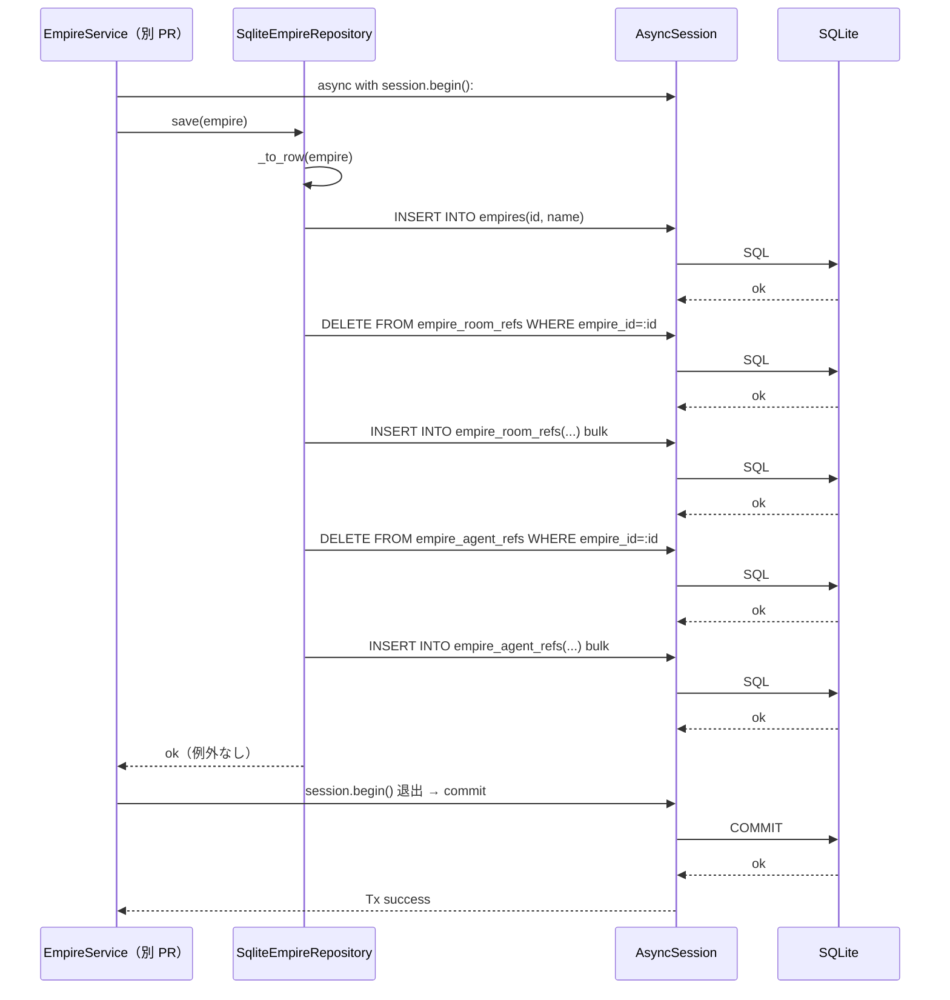
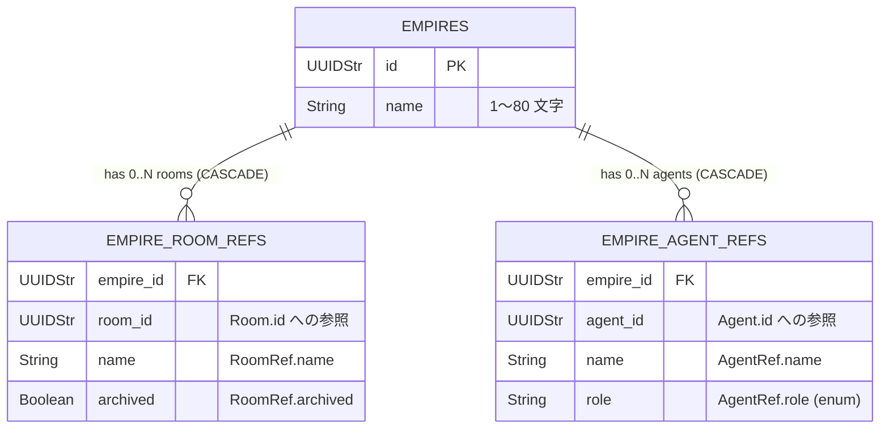

# 基本設計書

> feature: `empire-repository`
> 関連: [basic-design.md §モジュール契約](basic-design.md) / [`docs/features/persistence-foundation/`](../../persistence-foundation/) / [`docs/features/empire/`](../domain/)

## 記述ルール（必ず守ること）

基本設計に**疑似コード・サンプル実装（python/ts/sh/yaml 等の言語コードブロック）を書かない**。
ソースコードと二重管理になりメンテナンスコストしか生まない。
必要なのは構造契約（クラス・モジュール・データの関係）であり、実装の細部は [detailed-design.md](detailed-design.md) で凍結する。

## モジュール構成

| 機能 ID | モジュール | ディレクトリ | 責務 |
|--------|----------|------------|------|
| REQ-EMR-001 | `EmpireRepository` Protocol | `backend/src/bakufu/application/ports/empire_repository.py` | Repository ポート定義（application 層、外側を知らない） |
| REQ-EMR-002 | `SqliteEmpireRepository` | `backend/src/bakufu/infrastructure/persistence/sqlite/repositories/empire_repository.py` | SQLite 実装（infrastructure 層、Protocol を満たす） |
| REQ-EMR-003 | Alembic 2nd revision | `backend/alembic/versions/0002_empire_aggregate.py` | 3 テーブル + INDEX 追加 |
| REQ-EMR-004 | CI 三層防衛拡張（Layer 1） | `scripts/ci/check_masking_columns.sh`（既存ファイル更新） | Empire 3 テーブルを「masking 対象なし」で明示登録 |
| REQ-EMR-004 | CI 三層防衛拡張（Layer 2） | `backend/tests/architecture/test_masking_columns.py`（既存ファイル更新） | Empire 3 テーブルを parametrize に追加、masking 対象なし assert |
| REQ-EMR-005 | storage.md 逆引き表更新 | `docs/design/domain-model/storage.md`（既存ファイル更新） | Empire 関連カラム「masking 対象なし」行を追加 |
| 共通 | application/__init__.py | `backend/src/bakufu/application/__init__.py` | 新規（最初の application 層ファイル）|
| 共通 | application/ports/__init__.py | `backend/src/bakufu/application/ports/__init__.py` | 新規 |
| 共通 | repositories/__init__.py | `backend/src/bakufu/infrastructure/persistence/sqlite/repositories/__init__.py` | 新規 |

```
ディレクトリ構造（本 feature で追加・変更されるファイル）:

.
├── backend/
│   ├── alembic/
│   │   └── versions/
│   │       └── 0002_empire_aggregate.py             # 新規: 3 テーブル + INDEX 追加
│   ├── src/
│   │   └── bakufu/
│   │       ├── application/                          # 新規ディレクトリ（最初の application 層）
│   │       │   ├── __init__.py                       # 新規
│   │       │   └── ports/
│   │       │       ├── __init__.py                   # 新規
│   │       │       └── empire_repository.py          # 新規: EmpireRepository Protocol
│   │       └── infrastructure/
│   │           └── persistence/
│   │               └── sqlite/
│   │                   └── repositories/             # 新規ディレクトリ
│   │                       ├── __init__.py           # 新規
│   │                       └── empire_repository.py  # 新規: SqliteEmpireRepository
│   └── tests/
│       └── infrastructure/
│           └── persistence/
│               └── sqlite/
│                   └── repositories/                 # 新規ディレクトリ
│                       ├── __init__.py               # 新規
│                       └── test_empire_repository.py # 新規: 結合テスト
├── scripts/
│   └── ci/
│       └── check_masking_columns.sh                  # 既存更新: Empire 3 テーブル追加
└── docs/
    ├── architecture/
    │   └── domain-model/
    │       └── storage.md                            # 既存更新: 逆引き表に Empire 行追加
    └── features/
        └── empire-repository/                        # 本 feature 設計書 4 本
```

## モジュール契約（機能要件）

本 sub-feature が提供するモジュールの入出力契約を凍結する。各 REQ-EMR-NNN は親 [`feature-spec.md §5`](../feature-spec.md) ユースケース UC-EM-NNN と 1:1 または N:1 で対応する（孤児要件を作らない）。

### REQ-EMR-001: EmpireRepository Protocol 定義

| 項目 | 内容 |
|---|---|
| 入力 | 該当なし（Protocol 定義のため抽象） |
| 処理 | `application/ports/empire_repository.py` で `EmpireRepository(Protocol)` を定義。3 メソッド: `find_by_id` / `count` / `save`。すべて `async def` |
| 出力 | Protocol 定義（`@runtime_checkable` なし） |
| エラー時 | 該当なし |

### REQ-EMR-002: SqliteEmpireRepository 実装

| 項目 | 内容 |
|---|---|
| 入力 | `AsyncSession`（コンストラクタ引数）、各メソッドに応じた引数 |
| 処理 | `find_by_id`: `empires` + `empire_room_refs` + `empire_agent_refs` を JOIN。`save`: §確定 R1-B の delete-then-insert 戦略 |
| 出力 | `find_by_id`: `Empire | None`、`count`: `int`、`save`: `None` |
| エラー時 | SQLAlchemy `IntegrityError` → application 層に伝播 |

### REQ-EMR-003: Alembic 2nd revision

| 項目 | 内容 |
|---|---|
| 入力 | M2 永続化基盤の initial revision |
| 処理 | `0002_empire_aggregate.py` で 3 テーブル追加 |
| 出力 | 3 テーブル + INDEX が SQLite に存在 |
| エラー時 | migration 失敗 → `BakufuMigrationError` |

### REQ-EMR-004: CI 三層防衛の Empire 拡張

| 項目 | 内容 |
|---|---|
| 入力 | M2 永続化基盤の Layer 1 / Layer 2 |
| 処理 | grep guard / arch test に Empire 3 テーブル追加、masking 対象なし assert |
| 出力 | CI が「masking 対象なし」を物理保証 |
| エラー時 | 後続 PR で `MaskedText` 誤指定 → CI ブロック |

### REQ-EMR-005: storage.md 逆引き表更新

| 項目 | 内容 |
|---|---|
| 入力 | `docs/design/domain-model/storage.md` |
| 処理 | §逆引き表に「Empire 関連カラム: masking 対象なし」行を追加 |
| 出力 | 行が追加された状態 |
| エラー時 | 該当なし |

## データモデル

3 テーブル + 関連 INDEX。詳細は [`detailed-design.md §データ構造（永続化キー）`](detailed-design.md)。

| エンティティ | 主要属性 |
|---|---|
| `empires` | `id` (PK, UUIDStr) / `name` (String(80)) |
| `empire_room_refs` | `empire_id` FK / `room_id` / `name` / `archived` / UNIQUE(empire_id, room_id) |
| `empire_agent_refs` | `empire_id` FK / `agent_id` / `name` / `role` / UNIQUE(empire_id, agent_id) |

**masking 対象カラム**: なし（CI 三層防衛で物理保証）

## 依存関係

| 区分 | 依存 | 備考 |
|---|---|---|
| ランタイム | Python 3.12+ | 既存 |
| Python 依存 | SQLAlchemy 2.x / Alembic | 既存 |
| ドメイン | `Empire` / `EmpireId` / `RoomRef` / `AgentRef` | 既存 |
| インフラ | `Base` / `UUIDStr` / `AsyncSession` | 既存 |
| 外部サービス | 該当なし | infrastructure 層のため外部通信なし |

## クラス設計（概要）

```mermaid
classDiagram
    class EmpireRepository {
        <<Protocol>>
        +find_by_id(empire_id) Empire | None
        +count() int
        +save(empire) None
    }
    class SqliteEmpireRepository {
        +session: AsyncSession
        +find_by_id(empire_id) Empire | None
        +count() int
        +save(empire) None
        -_to_row(empire) dict
        -_from_row(empire_row, room_refs, agent_refs) Empire
    }
    class Empire {
        <<Aggregate Root>>
        +id: EmpireId
        +name: str
        +rooms: list~RoomRef~
        +agents: list~AgentRef~
    }

    SqliteEmpireRepository ..|> EmpireRepository : implements
    SqliteEmpireRepository --> Empire : returns
    EmpireRepository ..> Empire : returns
```



**凝集のポイント**:

- `EmpireRepository` Protocol は application 層に配置、domain は知らない
- `SqliteEmpireRepository` は infrastructure 層、Protocol を**型レベルで満たす**（`@runtime_checkable` なし、duck typing）
- domain ↔ row 変換は private method `_to_row()` / `_from_row()` で Repository に閉じる
- `save()` は同一 Tx 内で 3 テーブル（empires + empire_room_refs + empire_agent_refs）を delete-then-insert で更新（§確定 R1-B）
- 呼び出し側 service が `async with session.begin():` で UoW 境界を管理、Repository は session を受け取るのみ

## 処理フロー

### ユースケース 1: Empire の新規作成（save 経路）

1. application 層 `EmpireService.create(name)` が以下を実行（本 PR スコープ外、別 PR）
   - `EmpireRepository.count()` を呼び `count > 0` なら `EmpireAlreadyExistsError`（empire feature §確定 R1-B）
   - `Empire(id=uuid4(), name=name, rooms=[], agents=[])` を構築
2. service が `async with session.begin():` で UoW 境界を開く
3. service が `EmpireRepository.save(empire)` を呼ぶ
4. `SqliteEmpireRepository.save(empire)` が以下を順次実行（同一 Tx 内）:
   - `_to_row(empire)` で `empires_row: dict`、`room_refs: list[dict]`、`agent_refs: list[dict]` に分離
   - `INSERT INTO empires (id, name) VALUES (...)` または UPSERT
   - `DELETE FROM empire_room_refs WHERE empire_id = :empire_id` で全削除
   - `INSERT INTO empire_room_refs (...) VALUES (...)` を `room_refs` 件数分 bulk INSERT
   - `DELETE FROM empire_agent_refs WHERE empire_id = :empire_id` で全削除
   - `INSERT INTO empire_agent_refs (...) VALUES (...)` を `agent_refs` 件数分 bulk INSERT
5. `session.begin()` ブロック退出で commit、例外なら rollback

### ユースケース 2: Empire の取得（find_by_id 経路）

1. application 層 `EmpireService` が `EmpireRepository.find_by_id(empire_id)` を呼ぶ
2. `SqliteEmpireRepository.find_by_id(empire_id)` が以下を実行:
   - `SELECT * FROM empires WHERE id = :empire_id` で empire_row を取得（不在なら None を返す）
   - `SELECT * FROM empire_room_refs WHERE empire_id = :empire_id ORDER BY room_id` で room_refs を取得
   - `SELECT * FROM empire_agent_refs WHERE empire_id = :empire_id ORDER BY agent_id` で agent_refs を取得
   - `_from_row(empire_row, room_refs, agent_refs)` で `Empire` を構築（VO 構造で復元）
3. valid な Empire を返却

### ユースケース 3: Empire の更新（save 経路、既存 Empire の rooms / agents 変更）

1. application 層が `find_by_id(empire_id)` で既存 Empire を取得
2. service が Empire のドメイン操作（例: `empire.hire_agent(agent_ref)`）で新 Empire を構築（pre-validate 方式、empire #8 で凍結）
3. service が `EmpireRepository.save(updated_empire)` を呼ぶ
4. `SqliteEmpireRepository.save()` がユースケース 1 と同じ手順で同一 Tx 内に delete-then-insert（§確定 R1-B）
5. **delete-then-insert の利点**: 差分計算なし、子テーブル全件を一度削除して全件再挿入するため race condition なし、常に元 Aggregate と DB が同期

### ユースケース 4: Empire のシングルトン強制（count 経路、application 層から利用）

1. application 層 `EmpireService.create(name)` が `EmpireRepository.count()` を呼ぶ
2. `SqliteEmpireRepository.count()` が `SELECT COUNT(*) FROM empires` を実行
3. service が `count > 0` なら `EmpireAlreadyExistsError` を raise（empire feature §確定 R1-B、本 PR スコープ外）

## シーケンス図



## アーキテクチャへの影響

- `docs/design/domain-model.md` への変更: なし（モジュール配置案の `application/ports/` / `infrastructure/persistence/sqlite/repositories/` は既に概念定義済み、本 PR で実体化）
- `docs/design/domain-model/storage.md` への変更: **§逆引き表に「Empire 関連カラム: masking 対象なし」行を追加**（§確定 R1-E、本 PR で同一コミット）
- `docs/design/tech-stack.md` への変更: なし
- 既存 feature への波及:
  - `feature/persistence-foundation`（PR #23）の上に乗る、追加要件なし
  - `feature/empire`（PR #15）の domain 層 Empire を import するのみ、empire 設計書は変更しない

## 外部連携

該当なし — 理由: infrastructure 層（SQLite Repository）に閉じる。外部システムへの通信は発生しない。

| 連携先 | 目的 | プロトコル | 認証 | タイムアウト / リトライ |
|-------|------|----------|-----|--------------------|
| 該当なし | — | — | — | — |

## UX 設計

該当なし — 理由: UI を持たない infrastructure 層。

| シナリオ | 期待される挙動 |
|---------|------------|
| 該当なし | — |

**アクセシビリティ方針**: 該当なし（UI なし）。

## セキュリティ設計

### 脅威モデル

詳細な信頼境界は [`docs/design/threat-model.md`](../../../design/threat-model.md)。本 feature 範囲では以下の 2 件。

| 想定攻撃者 | 攻撃経路 | 保護資産 | 対策 |
|-----------|---------|---------|------|
| **T1: Empire テーブルへの masking 対象カラム誤追加（後続 Repository PR の事故）** | 後続 PR の実装者が「Empire の例があるから」と masking 対象漏れに気づかず、`empires.name` を `MaskedText` 不要なのに、別 Aggregate のカラムを `String` で宣言してしまう | 全 Aggregate の masking 整合性 | CI 三層防衛 Layer 1（grep guard）+ Layer 2（arch test）で Empire 3 テーブルを「masking 対象なし」として明示登録、後続 PR が誤って `MaskedText` を Empire に追加すると Layer 2 で検出（§確定 R1-E） |
| **T2: 永続化 Tx の半端終了による参照整合性破損** | `save()` 中に SQLite クラッシュ → `empires` 行のみ INSERT されて `empire_room_refs` / `empire_agent_refs` が DELETE のみで終了 | Empire の整合性 | 同一 Tx 内の delete-then-insert（§確定 R1-B）+ M2 永続化基盤の WAL crash safety + foreign_keys ON。Tx 全体が ATOMIC、半端終了で rollback |

### OWASP Top 10 対応

| # | カテゴリ | 対応状況 |
|---|---------|---------|
| A01 | Broken Access Control | 該当なし（infrastructure 層、認可は別 feature） |
| A02 | Cryptographic Failures | 該当なし（Empire には masking 対象カラムなし、§確定 R1-E で物理保証） |
| A03 | Injection | **適用**: SQLAlchemy ORM 経由で SQL injection 防御。raw SQL は使わない |
| A04 | Insecure Design | **適用**: Repository ポート分離（依存方向 domain ← application ← infrastructure）+ delete-then-insert 戦略で Tx 原子性 |
| A05 | Security Misconfiguration | M2 永続化基盤の PRAGMA 強制（defensive=ON 等）の上に乗る、追加要件なし |
| A06 | Vulnerable Components | SQLAlchemy 2.x / Alembic / aiosqlite（pip-audit で監視） |
| A07 | Auth Failures | 該当なし |
| A08 | Data Integrity Failures | **適用**: foreign_keys ON + ON DELETE CASCADE で参照整合性、Tx 原子性で半端更新を防止 |
| A09 | Logging Failures | M2 永続化基盤の構造化ログ + masking gateway の上に乗る、追加要件なし |
| A10 | SSRF | 該当なし |

## ER 図



UNIQUE 制約:

- `empire_room_refs(empire_id, room_id)`: 同一 Empire 内で同 room_id の重複参照を禁止
- `empire_agent_refs(empire_id, agent_id)`: 同一 Empire 内で同 agent_id の重複参照を禁止

masking 対象カラム: **なし**（§確定 R1-E、storage.md §逆引き表で物理保証）。

## エラーハンドリング方針

| 例外種別 | 処理方針 | ユーザーへの通知 |
|---------|---------|----------------|
| `sqlalchemy.IntegrityError`（FK 違反、UNIQUE 違反） | application 層に伝播、HTTP API 層で 409 Conflict にマッピング | application 層 / HTTP API の MSG（別 feature） |
| `sqlalchemy.OperationalError`（接続切断、ロック timeout） | application 層に伝播、HTTP API 層で 503 にマッピング | 同上 |
| `pydantic.ValidationError`（domain Empire 構築時、`_from_row` 内で発生し得る） | Repository 内で catch せず application 層に伝播、データ破損として扱う | application 層 / HTTP API の MSG |
| その他 | 握り潰さない、application 層へ伝播 | 汎用エラーメッセージ |

**Repository 内で明示的な commit / rollback はしない**: 呼び出し側 service が `async with session.begin():` で UoW 境界を管理。これにより 1 Tx 内で複数 Repository を呼ぶシナリオ（例: directive + task の同時保存）に対応。
