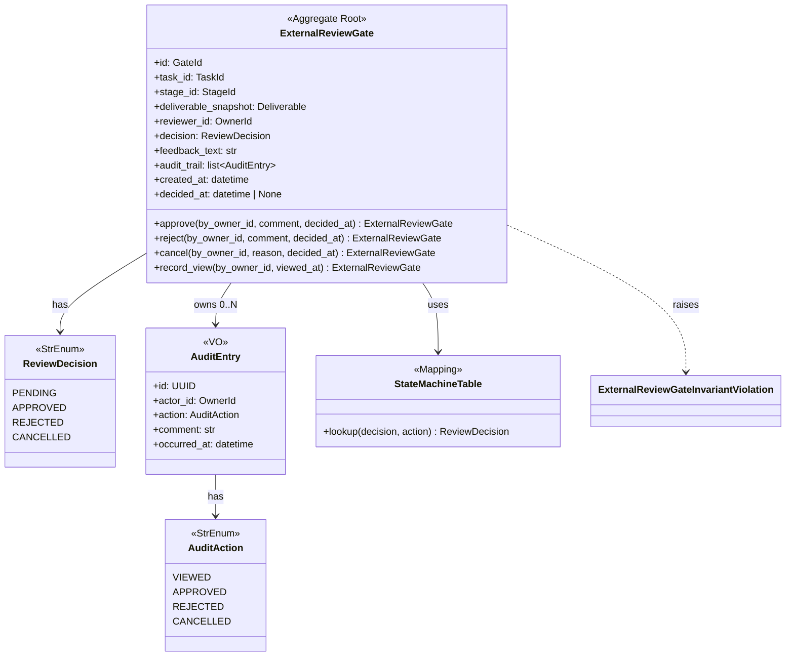
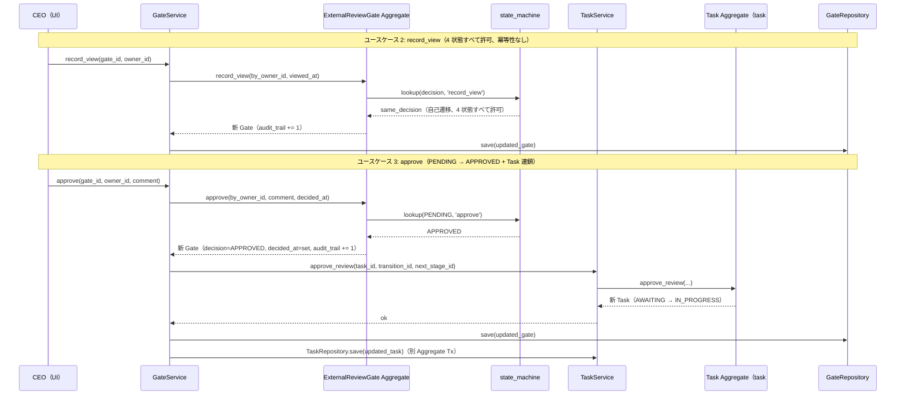
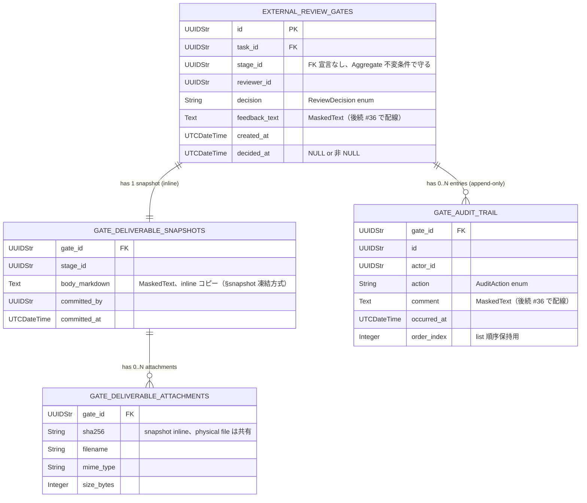

# 基本設計書

> feature: `external-review-gate`
> 関連: [requirements.md](requirements.md) / [`docs/design/domain-model/aggregates.md`](../../design/domain-model/aggregates.md) §ExternalReviewGate / [`docs/features/task/`](../task/) （PR #42 §確定 A-2 連携先）

## 記述ルール（必ず守ること）

基本設計に**疑似コード・サンプル実装（python/ts/sh/yaml 等の言語コードブロック）を書かない**。
ソースコードと二重管理になりメンテナンスコストしか生まない。
必要なのは構造契約（クラス・モジュール・データの関係）であり、実装の細部は [detailed-design.md](detailed-design.md) で凍結する。

## モジュール構成

| 機能 ID | モジュール | ディレクトリ | 責務 |
|--------|----------|------------|------|
| REQ-GT-001〜006 | `ExternalReviewGate` Aggregate Root | `backend/src/bakufu/domain/external_review_gate/external_review_gate.py` | Gate の属性・不変条件・ふるまい 4 種 |
| REQ-GT-006 | 不変条件 helper | `backend/src/bakufu/domain/external_review_gate/aggregate_validators.py` | `_validate_decision_immutable` / `_validate_decided_at_consistency` / `_validate_snapshot_immutable` / `_validate_feedback_text_range` / `_validate_audit_trail_append_only` |
| REQ-GT-002〜005（state machine）| `state_machine.py` | `backend/src/bakufu/domain/external_review_gate/state_machine.py` | enum-based decision table（task #42 §確定 A-2 パターン継承）+ `lookup(decision, action) -> ReviewDecision` |
| REQ-GT-001 | `ExternalReviewGateInvariantViolation` 例外 | `backend/src/bakufu/domain/exceptions.py`（既存ファイル更新）| webhook auto-mask 強制（6 兄弟と同パターン）|
| 共通 | `AuditEntry` VO + `ReviewDecision` / `AuditAction` enum | `backend/src/bakufu/domain/value_objects.py`（既存ファイル更新）| Pydantic v2 frozen + StrEnum |
| 公開 API | re-export | `backend/src/bakufu/domain/external_review_gate/__init__.py` | `ExternalReviewGate` / `ExternalReviewGateInvariantViolation` / `ReviewDecision` を re-export |

```
ディレクトリ構造（本 feature で追加・変更されるファイル）:

.
├── backend/
│   ├── src/
│   │   └── bakufu/
│   │       └── domain/
│   │           ├── external_review_gate/        # 新規ディレクトリ（task と同パターン）
│   │           │   ├── __init__.py
│   │           │   ├── external_review_gate.py
│   │           │   ├── aggregate_validators.py
│   │           │   └── state_machine.py
│   │           ├── exceptions.py                # 既存更新: ExternalReviewGateInvariantViolation 追加
│   │           └── value_objects.py             # 既存更新: ReviewDecision / AuditAction enum + AuditEntry VO 追加
│   └── tests/
│       ├── factories/
│       │   └── external_review_gate.py          # 新規: GateFactory / DecidedGateFactory / AuditEntryFactory
│       └── domain/
│           └── external_review_gate/
│               ├── __init__.py
│               └── test_external_review_gate/   # 新規ディレクトリ（500 行ルール、最初から分割）
│                   ├── __init__.py
│                   ├── test_construction.py     # 構築 + Pydantic 型検査
│                   ├── test_state_machine.py    # state machine 7 遷移網羅 + decision_already_decided
│                   ├── test_invariants.py       # 5 不変条件 helper + auto-mask
│                   └── test_audit_snapshot.py   # audit_trail append-only + snapshot 不変性 + record_view 冪等性なし
└── docs/
    └── features/
        └── external-review-gate/                # 本 feature 設計書 5 本
```

## クラス設計（概要）



**凝集のポイント**:

- ExternalReviewGate は frozen（Pydantic v2 `model_config.frozen=True`）
- ふるまい 4 種（approve / reject / cancel / record_view）は **すべて新インスタンスを返す**（pre-validate 方式）
- state machine table は `state_machine.py` モジュールスコープの `Final[Mapping]`（task #42 §確定 B 同パターン、`MappingProxyType` でロック）
- `_validate_*` helper 5 種は `aggregate_validators.py` で module-level 関数として独立
- `task_id` / `stage_id` / `reviewer_id` 参照整合性は **application 層責務**（外部知識）
- **Task method を一切 import しない**（Aggregate 境界保護、task #42 §確定 A-2 連携先として application 層 `GateService` が dispatch 担当）

## 処理フロー

### ユースケース 1: Gate 生成（GateService.create 経由）

1. application 層 `TaskService.request_external_review(task_id)` が `task.request_external_review()` を呼び AWAITING_EXTERNAL_REVIEW 遷移（task #37、本 PR スコープ外）
2. application 層 `GateService.create(task_id, stage_id, deliverable, reviewer_id)` が呼ばれる:
   - `WorkflowRepository.find_by_id(workflow_id)` で Stage の `kind == EXTERNAL_REVIEW` を検証
   - Deliverable VO を inline コピー（**snapshot 凍結**、`storage.md` §snapshot 凍結方式、実 inline コピー実装は #36 で配線）
   - `ExternalReviewGate(id=uuid4(), task_id=task_id, stage_id=stage_id, deliverable_snapshot=deliverable_copy, reviewer_id=reviewer_id, decision=PENDING, feedback_text='', audit_trail=[], created_at=now, decided_at=None)` を構築
3. Pydantic 型バリデーション → `model_validator(mode='after')` で 5 不変条件検査が走る（構築時は decided_at_inconsistent と feedback_text_range のみ発動可能性、他 3 種は always pass）
4. valid なら `GateRepository.save(gate)`（後続 #36）

### ユースケース 2: CEO 閲覧（record_view）

1. CEO が UI で Gate を開く → `GateService.record_view(gate_id, owner_id)` → `gate.record_view(by_owner_id, viewed_at=now)`
2. Aggregate 内:
   - `state_machine.lookup(self.decision, 'record_view')` → 4 状態すべてで自己遷移を許可（**§確定 R1-C 4 状態すべて許可**）
   - `audit_trail` に `AuditEntry(id=uuid4(), actor_id=by_owner_id, action=VIEWED, comment='', occurred_at=viewed_at)` を append
   - `_rebuild_with_state(audit_trail=updated_trail)`（**`decision` / `decided_at` / `feedback_text` は不変**）
3. 新 Gate を返却。**冪等性なし**（同 owner 複数回呼び出しで複数エントリ、§確定 R1-C 監査要件）

### ユースケース 3: 承認（approve、Task 連携先）

1. CEO が UI で approve → `GateService.approve(gate_id, by_owner_id, comment)` が呼ばれる
2. application 層が `gate.approve(by_owner_id, comment, decided_at=now)` を呼ぶ
3. Aggregate 内:
   - `state_machine.lookup(self.decision, 'approve')` → PENDING のときのみ APPROVED 遷移を許可、他は `decision_already_decided` raise
   - `feedback_text` を NFC 正規化 → range 検査
   - `audit_trail` に `AuditEntry(action=APPROVED, comment=comment, occurred_at=decided_at)` を append
   - `_rebuild_with_state(decision=APPROVED, feedback_text=normalized_comment, audit_trail=updated_trail, decided_at=decided_at)`
4. application 層 `GateService.approve()` が **同一 application UoW 内で `task.approve_review(transition_id, by_owner_id, next_stage_id)`** を呼ぶ（task #42 §確定 A-2 dispatch、Task / Gate 別 Tx だが application 層が連結）
5. `GateRepository.save(updated_gate)` + `TaskRepository.save(updated_task)`

### ユースケース 4: 差戻（reject、複数ラウンド対応）

1. CEO が UI で reject → `GateService.reject(gate_id, by_owner_id, comment)` → `gate.reject(by_owner_id, comment, decided_at=now)`
2. Aggregate 内: state_machine lookup `(self.decision, 'reject')` → PENDING のときのみ REJECTED 遷移、`audit_trail` に REJECTED エントリ追加 → `_rebuild_with_state(decision=REJECTED, ...)`
3. application 層 `GateService.reject()` が `task.reject_review(transition_id, by_owner_id, next_stage_id=差し戻し先)` を呼ぶ
4. **複数ラウンド対応**: 同 Task の同 Stage で再 directive 発行 → 別 Gate 生成（本 Gate は履歴として保持）

### ユースケース 5: 中止（cancel、Task 連鎖）

1. Task が CANCELLED に遷移したとき、application 層が連鎖して `GateService.cancel(gate_id, by_owner_id, reason)` を呼ぶ
2. `gate.cancel(by_owner_id, reason, decided_at=now)` → PENDING → CANCELLED、audit_trail に CANCELLED エントリ追加

## シーケンス図



## アーキテクチャへの影響

- `docs/design/domain-model.md` への変更: なし（Gate の `mermaid classDiagram` は既に存在）
- `docs/design/domain-model/aggregates.md` への変更: なし（§ExternalReviewGate は既に凍結済み、本 feature は実装の追従）
- `docs/design/domain-model/value-objects.md` への変更: §列挙型一覧の `ReviewDecision` / `AuditAction` 行は既に存在、§AuditEntry 構造定義も存在、本 PR で Python 実体化
- `docs/design/domain-model/storage.md` への変更: なし（snapshot 凍結方式は既に詳細凍結済み、本 PR は VO 構造定義まで）
- 既存 feature への波及: なし。task / その他 6 兄弟は本 feature を import しない（依存方向: gate → 既存 ID 型 + Deliverable VO のみ）

## 外部連携

該当なし — 理由: domain 層のみ。

| 連携先 | 目的 | プロトコル | 認証 | タイムアウト / リトライ |
|-------|------|----------|-----|--------------------|
| 該当なし | — | — | — | — |

## UX 設計

該当なし — 理由: domain 層、UI なし。Gate 操作 UI は `feature/external-review-gate-ui`（後続）で扱う。

| シナリオ | 期待される挙動 |
|---------|------------|
| 該当なし | — |

**アクセシビリティ方針**: 該当なし。

## セキュリティ設計

### 脅威モデル

本 feature 範囲では以下の 4 件。詳細な信頼境界は [`docs/design/threat-model.md`](../../design/threat-model.md)。

| 想定攻撃者 | 攻撃経路 | 保護資産 | 対策 |
|-----------|---------|---------|------|
| **T1: feedback_text 経由の secret 漏洩** | CEO が approve / reject コメントに webhook URL / API key を貼り付け → Repository 経由で永続化 → ログ・監査経路へ流出 | webhook URL / API key / OAuth token | Aggregate 内では raw 保持。**永続化前マスキング**は後続 `feature/external-review-gate-repository`（Issue #36）で `feedback_text` カラムを `MaskedText` 配線する責務 |
| **T2: audit_trail[*].comment 経由の secret 漏洩** | 同上、AuditEntry の comment に混入 | 同上 | 同上、Repository 永続化前マスキング |
| **T3: ExternalReviewGateInvariantViolation の例外経路で webhook URL 流出** | `feedback_text` に webhook URL 含む状態で `feedback_text_range` raise → 例外 detail に full text が埋め込まれログ流出 | Discord webhook token | `ExternalReviewGateInvariantViolation.__init__` で `mask_discord_webhook` + `mask_discord_webhook_in` を `super().__init__` 前に強制適用（6 兄弟と同パターン、§確定 R1-F）|
| **T4: state machine bypass 攻撃** | application 層が誤った順序でふるまいを呼ぶ（PENDING でない Gate に approve）→ state machine 不整合状態で永続化 | Gate の整合性 | state machine table lookup の **失敗時 Fail Fast**（§確定 R1-B）+ `_validate_decision_immutable`（§確定 R1-A 不変条件）の 2 重防衛 |

### OWASP Top 10 対応

| # | カテゴリ | 対応状況 |
|---|---------|---------|
| A01 | Broken Access Control | 該当なし（domain 層） |
| A02 | Cryptographic Failures | **適用**: `feedback_text` / `audit_trail[*].comment` の永続化前マスキング（後続 #36 で `MaskedText` 配線）+ 例外 auto-mask |
| A03 | Injection | 該当なし（Pydantic 型強制 + StrEnum） |
| A04 | Insecure Design | **適用**: pre-validate 方式 / frozen model / state machine decision table / 5 不変条件の多重防衛 |
| A05 | Security Misconfiguration | 該当なし |
| A06 | Vulnerable Components | Pydantic v2 / pyright |
| A07 | Auth Failures | 該当なし |
| A08 | Data Integrity Failures | **適用**: frozen model / pre-validate / state machine + decision_immutable + audit_trail append-only + snapshot_immutable の 5 重防衛 |
| A09 | Logging Failures | **適用**: `ExternalReviewGateInvariantViolation` の auto-mask により例外ログから webhook URL 漏洩なし |
| A10 | SSRF | 該当なし |

## ER 図

該当なし — 理由: 本 feature は domain 層のみで永続化スキーマは含まない。永続化は `feature/external-review-gate-repository`（Issue #36）で扱う。参考の概形:



masking 対象（後続 #36 責務、本 PR スコープ外）:
- `external_review_gates.feedback_text`: `MaskedText`
- `gate_deliverable_snapshots.body_markdown`: `MaskedText`
- `gate_audit_trail.comment`: `MaskedText`

## エラーハンドリング方針

| 例外種別 | 処理方針 | ユーザーへの通知 |
|---------|---------|----------------|
| `ExternalReviewGateInvariantViolation(kind='decision_already_decided')` | application 層で catch、HTTP API 層で 409 Conflict | MSG-GT-001 |
| `ExternalReviewGateInvariantViolation(kind='decided_at_inconsistent' / 'snapshot_immutable' / 'audit_trail_append_only')` | application 層で catch、500 Internal Server Error（データ破損 or 実装バグ） | MSG-GT-002 / 003 / 005 |
| `ExternalReviewGateInvariantViolation(kind='feedback_text_range')` | 422 にマッピング | MSG-GT-004 |
| `pydantic.ValidationError` | application 層で catch、422 にマッピング | MSG-GT-006 |
| `GateNotFoundError` | application 層 `GateService` の参照整合性違反、404 | MSG-GT-007 |
| その他 | 握り潰さない、application 層へ伝播 | 汎用エラーメッセージ |
