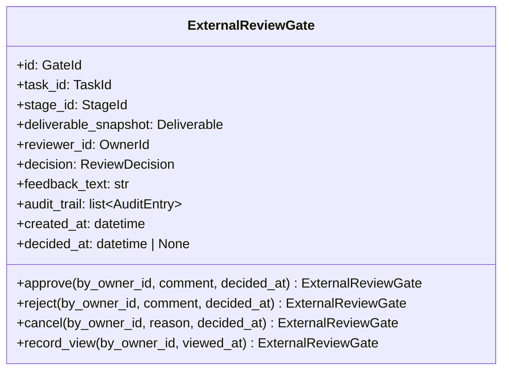

# 詳細設計書

> feature: `external-review-gate`
> 関連: [basic-design.md](basic-design.md) / [`docs/design/domain-model/aggregates.md`](../../design/domain-model/aggregates.md) §ExternalReviewGate / [`docs/features/task/detailed-design.md`](../task/detailed-design.md) §確定 A-2（dispatch 表パターン継承元）

## 記述ルール（必ず守ること）

詳細設計に**疑似コード・サンプル実装（python/ts/sh/yaml 等の言語コードブロック）を書かない**。
ソースコードと二重管理になりメンテナンスコストしか生まない。
必要なのは「構造契約（属性名・型・制約）」と「確定文言（メッセージ文字列）」と「実装の意図」。

## クラス設計（詳細）

### Aggregate Root: ExternalReviewGate

| 属性 | 型 | 制約 | 意図 |
|----|----|----|----|
| `id` | `GateId`（UUIDv4）| 不変 | 一意識別 |
| `task_id` | `TaskId`（UUIDv4）| 不変、参照のみ | 対象タスク（参照整合性は application 層）|
| `stage_id` | `StageId`（UUIDv4）| 不変、参照のみ | EXTERNAL_REVIEW kind の Stage（同上）|
| `deliverable_snapshot` | `Deliverable` | 不変（**§確定 D snapshot_immutable**）| Gate 生成時に inline コピー（task PR #42 で実体化済み VO）|
| `reviewer_id` | `OwnerId`（UUIDv4）| 不変、参照のみ | 人間レビュワー（既定 CEO）|
| `decision` | `ReviewDecision` | enum 4 値（PENDING / APPROVED / REJECTED / CANCELLED）| 判断結果（PENDING → 1 回のみ遷移）|
| `feedback_text` | `str` | 0〜10000 文字（NFC 正規化のみ、strip しない） | 差し戻し理由・承認コメント |
| `audit_trail` | `list[AuditEntry]` | 0 件以上、append-only、順序保持 | 監査ログ |
| `created_at` | `datetime` | UTC、tz-aware | 起票時刻 |
| `decided_at` | `datetime \| None` | UTC、tz-aware or None。`decision == PENDING` ⇔ None | 判断時刻 |

`model_config`:
- `frozen = True`
- `arbitrary_types_allowed = False`
- `extra = 'forbid'`

**不変条件（model_validator(mode='after')）**: 5 種

1. `_validate_decision_immutable` — PENDING → 1 回のみ遷移（再遷移禁止、ふるまい入口で守る）
2. `_validate_decided_at_consistency` — `decision == PENDING` ⇔ `decided_at is None`、`decision != PENDING` ⇔ `decided_at` 非 None
3. `_validate_snapshot_immutable` — Gate 生成時の `deliverable_snapshot` を以後変更しない（`_rebuild_with_state` で snapshot 引数を渡さない契約）
4. `_validate_feedback_text_range` — NFC 後 length 0〜10000
5. `_validate_audit_trail_append_only` — 既存エントリ改変禁止、新規 append のみ（`_rebuild_with_state` で audit_trail を生成するときに既存エントリ + 新規エントリの順序保持）

**不変条件（application 層責務、Aggregate 内では守らない、§確定 R1-A）**:
- `task_id` の Task 存在 — `GateService.create()` で `TaskRepository.find_by_id`
- `stage_id` の Stage 存在 + `kind == EXTERNAL_REVIEW` — `GateService.create()` で `WorkflowRepository.find_by_id`
- `reviewer_id` の Owner 存在 — `GateService.create()` で `OwnerRepository.find_by_id`
- Task の current_stage と Gate の stage_id が一致すること — `GateService.create()` で確認

**ふるまい**（全 4 種、すべて新インスタンス返却。**method 名 = action 名で 1:1 対応**、§確定 A dispatch 表で凍結）:
- `approve(by_owner_id: OwnerId, comment: str, decided_at: datetime) -> ExternalReviewGate`: PENDING → APPROVED、`decided_at` 設定、audit_trail に APPROVED エントリ追加
- `reject(by_owner_id: OwnerId, comment: str, decided_at: datetime) -> ExternalReviewGate`: PENDING → REJECTED、同上
- `cancel(by_owner_id: OwnerId, reason: str, decided_at: datetime) -> ExternalReviewGate`: PENDING → CANCELLED、同上
- `record_view(by_owner_id: OwnerId, viewed_at: datetime) -> ExternalReviewGate`: 4 状態すべての自己遷移、audit_trail に VIEWED エントリ追加（**§確定 R1-C 冪等性なし**、`decision` / `decided_at` / `feedback_text` 不変）

### Module: state_machine（`domain/external_review_gate/state_machine.py`）

state machine の決定表（task #42 §確定 B パターン継承）。**`Mapping[tuple[ReviewDecision, str], ReviewDecision]`** として module-level 定数で凍結。**action 名 = ふるまい名で 1:1 対応**（§確定 A）。

| key（`(current_decision, action)`） | value（`next_decision`） |
|---|---|
| `(PENDING, 'approve')` | `APPROVED` |
| `(PENDING, 'reject')` | `REJECTED` |
| `(PENDING, 'cancel')` | `CANCELLED` |
| `(PENDING, 'record_view')` | `PENDING`（自己遷移、audit_trail 追加のみ）|
| `(APPROVED, 'record_view')` | `APPROVED`（自己遷移、4 状態すべて record_view 許可、§確定 R1-C）|
| `(REJECTED, 'record_view')` | `REJECTED`（自己遷移）|
| `(CANCELLED, 'record_view')` | `CANCELLED`（自己遷移）|

合計 **7 ✓ 遷移**を明示列挙（PENDING からの 3 遷移 + record_view の 4 自己遷移）+ 9 ✗ セル（PENDING 以外からの approve / reject / cancel）。task #42 §確定 B と同じく `Final[Mapping]` + `MappingProxyType` でロック、後続 PR の遷移追加を物理的に難しくする。

| 関数 | 引数 | 戻り値 | 制約 |
|----|----|----|----|
| `lookup(current_decision: ReviewDecision, action: str) -> ReviewDecision` | `(current_decision, action)` | `ReviewDecision`（許可遷移先）| table 不在時は `KeyError` を raise（caller 側で `ExternalReviewGateInvariantViolation(kind='decision_already_decided')` に変換）|

`action` は `Literal['approve', 'reject', 'cancel', 'record_view']` の **4 値**で型レベル制約（**ふるまい名と 1:1 対応**）。

### Exception: ExternalReviewGateInvariantViolation

| 属性 | 型 | 制約 |
|----|----|----|
| `message` | `str` | MSG-GT-NNN 由来の文言（webhook URL は `<REDACTED:DISCORD_WEBHOOK>` 化済み）|
| `detail` | `dict[str, object]` | 違反の文脈（webhook URL は `mask_discord_webhook_in` で再帰的に伏字化済み）|
| `kind` | `Literal['decision_already_decided', 'decided_at_inconsistent', 'snapshot_immutable', 'feedback_text_range', 'audit_trail_append_only']` | 違反種別 |

`Exception` 継承。`domain/exceptions.py` の他の例外（6 兄弟）と統一フォーマット。**`super().__init__` 前に `message` を `mask_discord_webhook` で、`detail` を `mask_discord_webhook_in` で伏字化**（6 兄弟と同パターン、多層防御、§確定 R1-F）。

### VO: AuditEntry（`domain/value_objects.py` 既存ファイル更新）

| 属性 | 型 | 制約 |
|----|----|----|
| `id` | `UUID` | UUIDv4 |
| `actor_id` | `OwnerId`（UUIDv4）| 不変 |
| `action` | `AuditAction` | enum（VIEWED / APPROVED / REJECTED / CANCELLED）|
| `comment` | `str` | 0〜2000 文字（NFC 正規化のみ、strip しない）|
| `occurred_at` | `datetime` | UTC、tz-aware |

`model_config`: frozen / extra='forbid' / arbitrary_types_allowed=False。

### Enum 追加（`domain/value_objects.py`）

| Enum | 値 | 用途 |
|---|---|---|
| `ReviewDecision` | PENDING / APPROVED / REJECTED / CANCELLED | Gate.decision |
| `AuditAction` | VIEWED / APPROVED / REJECTED / CANCELLED（MVP は 4 値、`value-objects.md` 既凍結の 10 値のうち本 Gate で使う 4 値、残り 6 値は Admin CLI 拡張時に追加） | AuditEntry.action |

`value-objects.md` §列挙型一覧で凍結済みの 4 値を Python `StrEnum` として実体化。

## 確定事項（先送り撤廃）

### 確定 A: Method × current_decision dispatch 表（task #42 §確定 A-2 パターン継承、揺れゼロ凍結）

**採用方針: (B) 専用 method 分離**（method 名 = action 名で 1:1 対応、`decision: ReviewDecision` 引数追加は不採用）

task PR #42 §確定 A-2 と同じ思想で、Gate の各 method が呼ばれたときに「current_decision を見て action を組み立てる」**動的 dispatch を排除**する。method × current_decision の組み合わせに対する許可遷移を以下の表で**完全に静的**に決める:

| method | PENDING | APPROVED | REJECTED | CANCELLED |
|---|---|---|---|---|
| `approve` | → APPROVED | ✗ | ✗ | ✗ |
| `reject` | → REJECTED | ✗ | ✗ | ✗ |
| `cancel` | → CANCELLED | ✗ | ✗ | ✗ |
| `record_view` | → PENDING（自己）| → APPROVED（自己）| → REJECTED（自己）| → CANCELLED（自己）|

合計 **7 ✓ 遷移**（state machine table 7 行と完全一致）+ 9 ✗ セル。**`✓ 7 = state machine table 7 = lookup 成功経路 7`** で 3 表の整合性が常時保証される。

##### `(*, 'record_view')` を 4 行明示列挙する根拠

`record_view` は decision を変えない自己遷移だが、**「4 状態すべてで許可」を表で明示**するために 4 行列挙する（task #42 §確定 A-2 の commit_deliverable / advance_to_next 自己遷移と同パターン）。これにより:

1. テスト側が dispatch 表を写経して 7 ✓ + 9 ✗ を網羅できる
2. 後続 PR が `record_view` に terminal 制約を加える退行を物理的に難しくする

##### task / Gate 両 PR で同パターンを採用する根拠（M1 完成時の整合性）

| PR | dispatch 方針 | method 数 | state 数 | 遷移数 |
|---|---|---|---|---|
| task #42 §確定 A-2 | 専用 method 分離（10 method） | 10 | 6（TaskStatus）| 13 |
| **本 PR §確定 A** | 専用 method 分離（4 method）| 4 | 4（ReviewDecision）| 7 |

両 PR で **「method 名 = action 名」** + **「ふるまい入口で `state_machine.lookup(self.decision, '<self.method_name>')`」** + **「失敗時 InvariantViolation」** のパターンを統一。後続 `feature/external-review-gate-application`（GateService）が「Gate APPROVED → `task.approve_review(...)`、Gate REJECTED → `task.reject_review(...)`」の dispatch 関係を**直交独立**に扱える（Gate 4 値 × Task 10 method = 40 経路は数学的に整理されるが、実運用は APPROVED → approve_review / REJECTED → reject_review / CANCELLED → 場合により cancel の 3 経路のみ、application 層静的 dispatch）。

### 確定 B: state machine table のロック方式（task #42 §確定 B パターン継承）

`state_machine.py` の table は **module-level の `Final[Mapping]`** として定義し、import 時に凍結する:

| 措置 | 内容 |
|---|---|
| `Final` 型注釈 | pyright が再代入を検出 |
| `MappingProxyType` ラップ | runtime 上で setitem を拒否 |
| 公開 API は `lookup()` 関数のみ | table を直接公開しない |

table の追加・削除は本ファイルの修正 PR を要する。後続 PR が「`record_view` を decision 変更経路に使う」等の遷移追加を試みると、本ファイル修正 + テスト修正が同期して必要になり、誤った遷移追加を物理的に難しくする。

### 確定 C: `audit_trail` append-only 不変条件（§確定 R1-C 詳細）

`_validate_audit_trail_append_only` の検査ロジック:

| 入力経路 | 元 audit_trail | 新 audit_trail | 判定 |
|---|---|---|---|
| コンストラクタ初回 | （存在しない）| 任意の list | OK（永続化からの復元含めて任意の長さで構築可）|
| `record_view` / `approve` / `reject` / `cancel` で audit_trail 拡張 | 元 list = `[e_1, e_2, ..., e_n]` | 新 list = `[e_1, e_2, ..., e_n, e_new]` | OK（既存 n 件が同一順序で先頭、末尾に 1 件 append）|
| 既存 entry 改変（`e_2` の comment が変わる）| `[e_1, e_2, ...]` | `[e_1, e_2_modified, ...]` | NG → `audit_trail_append_only` |
| 順序破壊（prepend / 中間挿入 / 並び替え）| `[e_1, e_2]` | `[e_new, e_1, e_2]` または `[e_2, e_1]` | 同上 |
| 既存 entry 削除 | `[e_1, e_2]` | `[e_1]` | 同上 |

実装上は `_rebuild_with_state` で `audit_trail = self.audit_trail + [new_entry]` の形で生成する契約。`model_validator` 内で「新 audit_trail の先頭 N 件が元 audit_trail と構造的等価」+「N+1 件目以降が新規 entry」を assert。

### 確定 D: `deliverable_snapshot` 不変条件（§確定 R1-D 詳細）

`_validate_snapshot_immutable` は **コンストラクタ後の `deliverable_snapshot` 改変を禁止**:

| 入力経路 | 動作 |
|---|---|
| コンストラクタ（新規生成 or 復元）| 任意の `Deliverable` を受け取る、構築時には何もしない（snapshot 設定そのもの）|
| `_rebuild_with_state` 内で `deliverable_snapshot` を新値で上書き | 構造的にこの経路を作らない契約（`_rebuild_with_state` の引数に `deliverable_snapshot` を含めない設計）|
| 万一の改変試行（直接代入は frozen で拒否、`model_validator` 経由でも検出）| `ExternalReviewGateInvariantViolation(kind='snapshot_immutable')` で raise |

##### `_rebuild_with_state` の契約（snapshot を渡さない）

各ふるまい（approve / reject / cancel / record_view）の `_rebuild_with_state` 呼び出しは:

| ふるまい | 渡す引数 |
|---|---|
| `approve` | `decision`, `feedback_text`, `audit_trail`, `decided_at` |
| `reject` | 同上 |
| `cancel` | 同上 |
| `record_view` | `audit_trail` のみ |

**全 4 method で `deliverable_snapshot` を `_rebuild_with_state` に渡さない**ことで snapshot 不変性を構造的に保証。

### 確定 E: pre-validate 方式（task #42 §確定 A 同パターン継承）

各ふるまいの手順:

1. `state_machine.lookup(self.decision, '<method_name>')` → 不在なら `decision_already_decided` raise
2. `feedback_text` / `comment` / `reason` の NFC 正規化 → range 検査（必要な method のみ）
3. `self.model_dump(mode='python')` で現状を dict 化
4. dict 内の該当属性を新値で更新（decision / feedback_text / audit_trail / decided_at）
5. `ExternalReviewGate.model_validate(updated_dict)` を呼ぶ — `model_validator(mode='after')` が走る
6. 失敗時は `ValidationError` を `ExternalReviewGateInvariantViolation` に変換して raise（pre-validate なので元 Gate は変更されない）

`model_copy(update=...)` は採用しない（6 兄弟同方針）。

### 確定 F: `feedback_text` の正規化パイプライン

`Persona.prompt_body` / `PromptKit.prefix_markdown` / `Directive.text` / `Task.last_error` と同じく **NFC 正規化のみ、strip しない**:

| 段階 | 動作 |
|---|---|
| 1 | 引数 `comment` / `reason` を受け取る |
| 2 | `unicodedata.normalize('NFC', ...)` で NFC 正規化 |
| 3 | `len(normalized)` で Unicode コードポイント数を計上（**strip は適用しない**）|
| 4 | 範囲判定（`0 <= length <= 10000`）|
| 5 | 通過時のみ `feedback_text = normalized` で保持 |

### 確定 G: `record_view` の冪等性なし契約（§確定 R1-C 詳細）

`record_view(by_owner_id, viewed_at)` は同 owner / 同時刻でも重複エントリを記録:

| 入力 | 期待 |
|---|---|
| `gate.record_view(owner_a, t_1)` | audit_trail += 1 件 |
| `gate.record_view(owner_a, t_2)` | audit_trail += 1 件（合計 2 件、異なる時刻）|
| `gate.record_view(owner_a, t_1)` （同時刻）| audit_trail += 1 件（重複でも履歴として記録）|
| `gate.record_view(owner_b, t_1)` | audit_trail += 1 件（別 owner）|

**監査要件**: 「誰がいつ何度見たか」を完全保持。冪等にすると CEO の閲覧パターンが追跡できなくなり、監査ログの本来の役割を放棄することになる。

### 確定 H: `ExternalReviewGateInvariantViolation` の webhook auto-mask（§確定 R1-F 詳細、6 兄弟踏襲）

6 兄弟と同じく `ExternalReviewGateInvariantViolation.__init__` で:

1. `super().__init__` 前に `mask_discord_webhook(message)` を message に適用
2. `detail` に対し `mask_discord_webhook_in(detail)` を再帰的に適用
3. `kind` は enum 文字列のため mask 対象外
4. その後 `super().__init__(masked_message)` を呼ぶ

#### `ExternalReviewGateInvariantViolation` で webhook が混入する経路

| 経路 | 例 |
|----|----|
| `feedback_text_range` raise | CEO が approve コメントに webhook URL を含む 10001 文字超過の長文 → 例外 detail に text の prefix が含まれる |
| `audit_trail_append_only` raise の detail | 既存 entry に webhook URL を含むコメントがあった場合 → detail に乗ると漏洩経路 |
| `decision_already_decided` raise の detail | feedback_text に webhook を含む状態で再 approve 試行 → 同上 |

UI 側 / Repository 側でも入力時マスキング / 永続化前マスキングを実装するが、本 Aggregate 層では「例外経路で漏れない」ことを単独で保証する責務（多層防御）。

### 確定 I: 例外型統一規約と「揺れ」の凍結（room §確定 I 踏襲）

| 違反種別 | 例外型 | 発生レイヤ | 凍結する `kind` 値 |
|---|---|---|---|
| state machine 不正遷移（PENDING 以外からの decision 遷移）| `ExternalReviewGateInvariantViolation` | 各ふるまい中の lookup | `decision_already_decided` |
| 構造的不変条件違反 | `ExternalReviewGateInvariantViolation` | `model_validator(mode='after')` | `decided_at_inconsistent` / `snapshot_immutable` / `feedback_text_range` / `audit_trail_append_only` |
| 型違反 / 必須欠落 | `pydantic.ValidationError` | Pydantic 型バリデーション | — |
| application 層の参照整合性違反 | `GateNotFoundError` 等 | `GateService` 系 | — |

##### MSG ID と例外型の対応（凍結）

| MSG ID | 例外型 | kind |
|---|---|---|
| MSG-GT-001 | `ExternalReviewGateInvariantViolation` | `decision_already_decided` |
| MSG-GT-002 | `ExternalReviewGateInvariantViolation` | `decided_at_inconsistent` |
| MSG-GT-003 | `ExternalReviewGateInvariantViolation` | `snapshot_immutable` |
| MSG-GT-004 | `ExternalReviewGateInvariantViolation` | `feedback_text_range` |
| MSG-GT-005 | `ExternalReviewGateInvariantViolation` | `audit_trail_append_only` |
| MSG-GT-006 | `pydantic.ValidationError` | （型違反全般、kind 概念なし）|
| MSG-GT-007 | `GateNotFoundError` | （application 層）|

### 確定 J: 「Aggregate 内検査と application 層検査」の責務分離マトリクス

| 検査項目 | Aggregate 内 | application 層 |
|---|---|---|
| `decision` PENDING → 1 回のみ遷移 | ✓（state_machine + `_validate_decision_immutable`）| ✗ |
| `decided_at` consistency | ✓（`_validate_decided_at_consistency`）| ✗ |
| `deliverable_snapshot` 不変 | ✓（`_validate_snapshot_immutable`）| ✗ |
| `feedback_text` range | ✓（`_validate_feedback_text_range`）| ✗ |
| `audit_trail` append-only | ✓（`_validate_audit_trail_append_only`）| ✗ |
| `task_id` の Task 存在 | ✗ | ✓（`GateService.create()` で `TaskRepository.find_by_id`）|
| `stage_id` の Stage 存在 + `kind == EXTERNAL_REVIEW` | ✗ | ✓（`GateService.create()` で `WorkflowRepository.find_by_id`）|
| `reviewer_id` の Owner 存在 | ✗ | ✓（同上）|
| Task の current_stage と Gate の stage_id 一致 | ✗ | ✓（`GateService.create()` で確認）|
| **Gate decision → Task method dispatch（APPROVED → `approve_review`、REJECTED → `reject_review`）** | ✗ | ✓（**`GateService.approve()` / `reject()` 完了後の連鎖呼び出し、task #42 §確定 A-2 連携先**）|

### 確定 K: テスト責務の 4 ファイル分割（task PR #42 教訓を最初から反映）

empire-repo PR #29 / workflow-repo PR #41 / task PR #42 の Norman R-N1 教訓（500 行ルール違反 → ディレクトリ分割）を踏襲。本 PR は**最初から 4 ファイル分割**:

| ファイル | 責務 |
|---|---|
| `test_external_review_gate/test_construction.py` | 構築 + Pydantic 型検査 + frozen + extra='forbid' |
| `test_external_review_gate/test_state_machine.py` | state machine 7 ✓ 遷移網羅 + 9 ✗ セル（decision_already_decided）+ table lock |
| `test_external_review_gate/test_invariants.py` | 5 不変条件 helper + auto-mask + MSG 文言照合 + Next: hint 物理保証 |
| `test_external_review_gate/test_audit_snapshot.py` | audit_trail append-only（既存改変 / prepend / 削除）+ snapshot 不変性 + record_view 冪等性なし（同 owner 複数回 / 同時刻）|

各ファイル 200 行を目安、500 行ルール厳守。

## 設計判断の補足

### なぜ独立 Aggregate なのか（Task の子にしない理由）

§確定 R1-A 参照。短く言うと **(1) 寿命差異** + **(2) Tx 境界差異** + **(3) 複数ラウンド対応**。Task の子にすると 1 Aggregate ＝ 1 Tx 原則が崩れ、CEO の承認操作（人間時間）と Agent 処理（ロボット時間）を同 Tx に縛る歪んだ設計になる。

### なぜ `record_view` を 4 状態すべて許可するか

監査要件として「terminal な Gate（APPROVED / REJECTED / CANCELLED）でも後日確認した記録を残したい」というニーズがある。例: 「3 ヶ月前に APPROVED した Gate を再確認した」というログが残る方が、コンプライアンス観点で価値がある。一方 approve / reject / cancel は terminal の Gate に再実行できると履歴がぐちゃぐちゃになるので PENDING 限定（§確定 A）。

### なぜ `decided_at` を引数で受け取るか

`datetime.now(timezone.utc)` を Aggregate 内で自動生成すると freezegun 等での test 制御が必要。application 層で生成して引数渡しすることで Aggregate 自体は時刻に依存しない pure data になる（task #42 / directive #28 と同方針）。

### なぜ `snapshot` を `_rebuild_with_state` に渡さない構造にするか

§確定 D で snapshot 不変性を凍結したが、実装的には「`_rebuild_with_state` の引数に `deliverable_snapshot` を含めない契約」で構造的に保証する。引数に渡す経路を作らなければ、誤って snapshot を変更する PR が物理的に難しくなる（型レベルのガード）。

### なぜ `audit_trail` を `set` ではなく `list` で持つか

時系列順序保持必要（誰が何の順で何をしたか）+ 同 owner / 同時刻でも複数エントリ可（§確定 G 冪等性なし）+ pydantic v2 の serialize で順序が決定論。`set` だと順序非決定論で監査要件違反。

## ユーザー向けメッセージの確定文言

### プレフィックス統一

| プレフィックス | 意味 |
|--------------|-----|
| `[FAIL]` | 処理中止を伴う失敗 |
| `[OK]` | 成功完了 |

### MSG 確定文言表

各メッセージは **「失敗内容（What）」+「次に何をすべきか（Next Action）」の 2 行構造**を採用する（§確定 I、room §確定 I 踏襲）。

| ID | 例外型 | 文言（1 行目: failure / 2 行目: next action） |
|----|------|----|
| MSG-GT-001 | `ExternalReviewGateInvariantViolation(kind='decision_already_decided')` | `[FAIL] Gate decision is already decided: gate_id={gate_id}, current_decision={current_decision}` / `Next: A Gate can only be decided once (PENDING -> APPROVED/REJECTED/CANCELLED); issue a new directive for re-review.` |
| MSG-GT-002 | `ExternalReviewGateInvariantViolation(kind='decided_at_inconsistent')` | `[FAIL] Gate decided_at consistency violation: decision={decision}, decided_at={decided_at_present}` / `Next: decided_at must be None when decision==PENDING, and a UTC tz-aware datetime otherwise; check Repository row integrity.` |
| MSG-GT-003 | `ExternalReviewGateInvariantViolation(kind='snapshot_immutable')` | `[FAIL] Gate deliverable_snapshot is immutable after construction: gate_id={gate_id}` / `Next: deliverable_snapshot is frozen at Gate creation; do not pass it to _rebuild_with_state. Issue a new Gate for a new deliverable.` |
| MSG-GT-004 | `ExternalReviewGateInvariantViolation(kind='feedback_text_range')` | `[FAIL] Gate feedback_text must be 0-10000 characters (got {length})` / `Next: Trim the comment/reason to <=10000 NFC-normalized characters.` |
| MSG-GT-005 | `ExternalReviewGateInvariantViolation(kind='audit_trail_append_only')` | `[FAIL] Gate audit_trail violates append-only contract: existing entries cannot be modified or reordered` / `Next: Only append new AuditEntry instances at the end; never edit, prepend, or delete existing entries.` |
| MSG-GT-006 | `pydantic.ValidationError`（Gate VO 構築時）| `[FAIL] Gate type validation failed: {field}={value!r}` / `Next: Verify field types — id/task_id/stage_id/reviewer_id are UUIDv4, decision is ReviewDecision enum, timestamps are UTC tz-aware.` |
| MSG-GT-007 | `GateNotFoundError`（application 層）| `[FAIL] Gate not found: gate_id={gate_id}` / `Next: Verify the gate_id; the Gate may have been deleted or never created.` |

##### 「Next:」行の役割（フィードバック原則、6 兄弟踏襲）

- 例外 message / API レスポンスの `error.next_action` / UI Toast 2 行目 / CLI stderr 2 行目に**同一文言**
- i18n 入口、Phase 2 で 2 キー × 言語数で翻訳テーブル
- test-design.md TC-UT-GT-NNN で `assert "Next:" in str(exc)` を CI 物理保証

メッセージは ASCII 範囲（プレースホルダ `{...}` は f-string 形式）。

## データ構造（永続化キー）

該当なし — 理由: 本 feature は domain 層のみで永続化スキーマは含まない。永続化は `feature/external-review-gate-repository`（Issue #36）で扱う。参考の概形は basic-design.md §ER 図 を参照。

masking 対象（後続 #36 責務、本 PR スコープ外）: `feedback_text` / `audit_trail.comment` / `deliverable_snapshot.body_markdown`。

## API エンドポイント詳細

該当なし — 理由: 本 feature は domain 層のみ。API は `feature/http-api` で凍結する。

## Known Issues

### 申し送り #1: Repository 配線時の `feedback_text` / `audit_trail.comment` マスキング

`feature/external-review-gate-repository`（Issue #36）で `external_review_gates.feedback_text` / `gate_audit_trail.comment` カラムを `MaskedText` で配線する責務（agent-repository PR #43 の Schneier #3 実適用パターンを踏襲）。本 PR では VO 構造定義まで、Repository 配線は範囲外。

### 申し送り #2: `deliverable_snapshot` の inline コピー実装

`feature/external-review-gate-repository`（Issue #36）で Gate row + `gate_deliverable_snapshots` テーブル + `gate_deliverable_attachments` テーブルを inline コピー実装する責務（`storage.md` §snapshot 凍結方式既凍結、本 PR では VO 構造の不変性凍結のみ）。

## 出典・参考

- [Pydantic v2 — model_validator / model_validate](https://docs.pydantic.dev/latest/concepts/validators/) — pre-validate 方式
- [Pydantic v2 — frozen models](https://docs.pydantic.dev/latest/concepts/models/)
- [Python typing.Literal / Final](https://docs.python.org/3/library/typing.html#typing.Final) — state_machine table 凍結根拠
- [types.MappingProxyType](https://docs.python.org/3/library/types.html#types.MappingProxyType) — runtime read-only Mapping
- [`docs/design/domain-model/aggregates.md`](../../design/domain-model/aggregates.md) — ExternalReviewGate 凍結済み設計
- [`docs/design/domain-model/value-objects.md`](../../design/domain-model/value-objects.md) — ReviewDecision / AuditAction / AuditEntry 凍結済み列挙
- [`docs/design/domain-model/storage.md`](../../design/domain-model/storage.md) — snapshot 凍結方式（後続 #36 で配線）
- [`docs/design/threat-model.md`](../../design/threat-model.md) — A02 / A04 / A08 / A09 対応根拠
- [`docs/features/task/detailed-design.md`](../task/detailed-design.md) §確定 A-2 — 専用 method 分離 dispatch 表パターンの先例
- [`docs/features/room/detailed-design.md`](../room/detailed-design.md) §確定 I — 例外型統一規約 + MSG 2 行構造の先例
