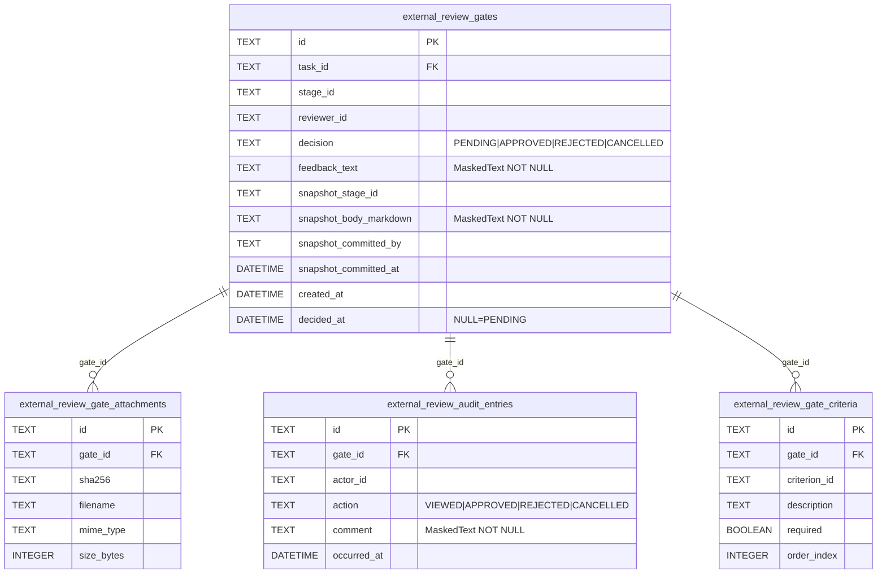

# 基本設計書

> feature: `external-review-gate` / sub-feature: `http-api`
> 関連 Issue: [#61 feat(external-review-gate-http-api): ExternalReviewGate HTTP API (approve/reject/cancel, M3)](https://github.com/bakufu-dev/bakufu/issues/61)
> 関連: [`../feature-spec.md`](../feature-spec.md) / [`../domain/basic-design.md`](../domain/basic-design.md) / [`../repository/basic-design.md`](../repository/basic-design.md) / [`../../http-api-foundation/http-api/basic-design.md`](../../http-api-foundation/http-api/basic-design.md)
> 凍結済み設計参照: [`docs/design/architecture.md §interfaces レイヤー詳細`](../../../design/architecture.md) / [`docs/design/threat-model.md`](../../../design/threat-model.md)

## 記述ルール（必ず守ること）

基本設計に**疑似コード・サンプル実装（python/ts/sh/yaml 等の言語コードブロック）を書かない**。
ソースコードと二重管理になりメンテナンスコストしか生まない。
必要なのは構造契約（クラス・モジュール・データの関係）であり、実装の細部は [detailed-design.md](detailed-design.md) で凍結する。

## 実装前提（Issue #61 で充足済み）

本 sub-feature は以下の横断変更を同一 PR 内で充足する:

| 前提 | 対象ファイル | 内容 |
|---|---|---|
| **P-1: gate_exceptions.py 新規作成** | `backend/src/bakufu/application/exceptions/gate_exceptions.py` | `GateNotFoundError` / `GateAlreadyDecidedError` / `GateAuthorizationError` を新規定義する（http-api-foundation スケルトンに不在） |
| **P-2: ExternalReviewGateService 全メソッド肉付け** | `backend/src/bakufu/application/services/external_review_gate_service.py` | http-api-foundation で骨格のみ定義された ExternalReviewGateService に approve / reject / cancel / find_pending_for_reviewer / find_by_task_id を追加する |
| **P-3: 例外ハンドラ追加** | `backend/src/bakufu/interfaces/http/error_handlers.py`（既存追記） | `GateNotFoundError` / `GateAlreadyDecidedError` / `GateAuthorizationError` → `ErrorResponse` 変換ハンドラを追加する |

## モジュール構成

本 sub-feature で追加・変更するモジュール一覧。

| 機能 ID | モジュール | ディレクトリ | 責務 |
|---|---|---|---|
| REQ-ERG-HTTP-001〜006 | `gate_router` | `backend/src/bakufu/interfaces/http/routers/external_review_gates.py` | Gate 取得・判断操作エンドポイント（6 本） |
| REQ-ERG-HTTP-001〜006 | `ExternalReviewGateService` | `backend/src/bakufu/application/services/external_review_gate_service.py` | http-api-foundation でスケルトン定義済み。本 sub-feature で全メソッドを肉付け |
| REQ-ERG-HTTP-001〜006 | `GateSchemas` | `backend/src/bakufu/interfaces/http/schemas/external_review_gate.py` | Pydantic v2 リクエスト / レスポンスモデル（新規ファイル） |
| 横断 | gate 例外ハンドラ群 | `backend/src/bakufu/interfaces/http/error_handlers.py`（既存追記） | `GateNotFoundError` / `GateAlreadyDecidedError` / `GateAuthorizationError` → `ErrorResponse` 変換 |
| 横断 | application 例外定義 | `backend/src/bakufu/application/exceptions/gate_exceptions.py`（前提 P-1） | `GateNotFoundError` / `GateAlreadyDecidedError` / `GateAuthorizationError` |

```
本 sub-feature で追加・変更されるファイル:

backend/
└── src/bakufu/
    ├── application/
    │   ├── exceptions/
    │   │   └── gate_exceptions.py                          # 新規: Gate 操作例外（P-1）
    │   └── services/
    │       └── external_review_gate_service.py              # 既存肉付け: approve / reject / cancel 等（P-2）
    └── interfaces/http/
        ├── dependencies.py                                  # 既存追記: get_gate_service() 追加
        ├── error_handlers.py                                # 既存追記: gate 例外ハンドラ群追加（P-3）
        ├── routers/
        │   └── external_review_gates.py                    # 新規: 6 エンドポイント
        └── schemas/
            └── external_review_gate.py                     # 新規: Pydantic スキーマ群
```

## モジュール契約（機能要件）

本 sub-feature が提供するモジュールの入出力契約を凍結する。各 REQ-ERG-HTTP-NNN は親 [`../feature-spec.md §5`](../feature-spec.md) ユースケース UC-ERG-NNN と対応する（孤児要件なし）。

### REQ-ERG-HTTP-001: PENDING Gate 一覧取得（GET /api/gates）

| 項目 | 内容 |
|---|---|
| 入力 | クエリパラメータ `reviewer_id: UUID`（必須）/ `decision: str`（省略時 `PENDING`） |
| 処理 | `ExternalReviewGateService.find_pending_for_reviewer(reviewer_id)` → `ExternalReviewGateRepository.find_pending_by_reviewer(reviewer_id)` → `list[ExternalReviewGate]`（0 件以上）|
| 出力 | HTTP 200, `GateListResponse(items: list[GateResponse], total: int)` |
| エラー時 | 不正 UUID → 422 / `reviewer_id` 未指定 → 422 |

**備考**: `decision` クエリパラメータは PENDING 以外（APPROVED / REJECTED / CANCELLED）も将来拡張として許容するが、MVP では `find_pending_by_reviewer()` のみ実装。`decision != PENDING` の場合は空リストを返す（YAGNI — 詳細は `detailed-design.md §確定A`）。

### REQ-ERG-HTTP-002: Task の Gate 履歴取得（GET /api/tasks/{task_id}/gates）

| 項目 | 内容 |
|---|---|
| 入力 | パスパラメータ `task_id: UUID` |
| 処理 | `ExternalReviewGateService.find_by_task(task_id)` → `ExternalReviewGateRepository.find_by_task_id(task_id)` → `list[ExternalReviewGate]`（時系列昇順）|
| 出力 | HTTP 200, `GateListResponse(items: list[GateResponse], total: int)`（複数ラウンド対応、created_at 昇順）|
| エラー時 | 不正 UUID → 422（Task 不在チェックは行わない — Task 不在時は空リストを返す）|

### REQ-ERG-HTTP-003: Gate 単件取得（GET /api/gates/{id}）

| 項目 | 内容 |
|---|---|
| 入力 | パスパラメータ `id: UUID` |
| 処理 | `ExternalReviewGateService.find_by_id_or_raise(gate_id)` → `ExternalReviewGateRepository.find_by_id(gate_id)` → None → `GateNotFoundError`。取得成功後 `record_view` は呼び出さない（HTTP GET は副作用なし）|
| 出力 | HTTP 200, `GateDetailResponse`（`deliverable_snapshot.body_markdown` / `feedback_text` / `audit_trail[*].comment` は DB から取得したマスキング済みの値をそのまま返す（`<REDACTED:...>` パターンが含まれることがある）— 詳細は §セキュリティ設計 §確定B。**`required_deliverable_criteria: list[AcceptanceCriterionResponse]` を含む（受入基準 #17）**）|
| エラー時 | 不在 → 404 (MSG-ERG-HTTP-001) / 不正 UUID → 422 |

### REQ-ERG-HTTP-004: Gate 承認（POST /api/gates/{id}/approve）

| 項目 | 内容 |
|---|---|
| 入力 | パスパラメータ `id: UUID` / リクエスト Body `GateApprove`（`comment: str`（任意、0〜10000 文字））/ `Authorization: Bearer <reviewer_owner_id>` ヘッダー |
| 処理 | (1) Bearer トークンから `reviewer_owner_id: OwnerId` を抽出（`get_reviewer_id()` Depends）→ (2) `ExternalReviewGateService.find_by_id_or_raise(gate_id)` → (3) `gate.reviewer_id != reviewer_owner_id` → `GateAuthorizationError` → (4) `gate.approve(by_owner_id=reviewer_owner_id, comment=body.comment, decided_at=utcnow())` → `ExternalReviewGateInvariantViolation(kind='decision_already_decided')` → `GateAlreadyDecidedError` → (5) `ExternalReviewGateRepository.save(updated_gate)` —  `async with session.begin()` 内 |
| 出力 | HTTP 200, `GateDetailResponse`（decision=APPROVED）|
| エラー時 | 不在 → 404 (MSG-ERG-HTTP-001) / Authorization ヘッダー不正 → 422 (MSG-ERG-HTTP-004) / reviewer 不一致 → 403 (MSG-ERG-HTTP-003) / 既決定 → 409 (MSG-ERG-HTTP-002) / feedback_text 超過 → 422 / 不正 UUID → 422 |

### REQ-ERG-HTTP-005: Gate 差し戻し（POST /api/gates/{id}/reject）

| 項目 | 内容 |
|---|---|
| 入力 | パスパラメータ `id: UUID` / リクエスト Body `GateReject`（`feedback_text: str`（**必須**、1〜10000 文字））/ `Authorization: Bearer <reviewer_owner_id>` ヘッダー |
| 処理 | REQ-ERG-HTTP-004 と同構造。`gate.reject(by_owner_id, comment=body.feedback_text, decided_at=utcnow())` を呼び出す（domain の引数名は `comment`、Schema フィールド名 `feedback_text` と区別）。`feedback_text` が空文字列の場合は Pydantic バリデーションで 422 を返す（reject は差し戻し理由が業務的に必須）|
| 出力 | HTTP 200, `GateDetailResponse`（decision=REJECTED）|
| エラー時 | 不在 → 404 / Authorization ヘッダー不正 → 422 / reviewer 不一致 → 403 / 既決定 → 409 / feedback_text 空または超過 → 422 / 不正 UUID → 422 |

### REQ-ERG-HTTP-006: Gate キャンセル（POST /api/gates/{id}/cancel）

| 項目 | 内容 |
|---|---|
| 入力 | パスパラメータ `id: UUID` / リクエスト Body `GateCancel`（`reason: str`（任意、0〜10000 文字））/ `Authorization: Bearer <reviewer_owner_id>` ヘッダー |
| 処理 | REQ-ERG-HTTP-004 と同構造。`gate.cancel(by_owner_id, reason=body.reason, decided_at=utcnow())` を呼び出す |
| 出力 | HTTP 200, `GateDetailResponse`（decision=CANCELLED）|
| エラー時 | 不在 → 404 / Authorization ヘッダー不正 → 422 / reviewer 不一致 → 403 / 既決定 → 409 / reason 超過 → 422 / 不正 UUID → 422 |

## ユーザー向けメッセージ一覧

確定文言は [`detailed-design.md §MSG 確定文言表`](detailed-design.md) で凍結する。

| ID | 種別 | 条件 | HTTP ステータス |
|---|---|---|---|
| MSG-ERG-HTTP-001 | エラー（不在）| Gate が見つからない | 404 |
| MSG-ERG-HTTP-002 | エラー（競合）| 既に判断済みの Gate に approve / reject / cancel を試みた（業務ルール R1-B）| 409 |
| MSG-ERG-HTTP-003 | エラー（認可）| Bearer トークンの OwnerId が gate.reviewer_id と一致しない | 403 |
| MSG-ERG-HTTP-004 | エラー（認証）| `Authorization: Bearer` ヘッダーが不正または OwnerId 形式でない | 422 |

## 依存関係

| 区分 | 依存 | バージョン方針 | 備考 |
|---|---|---|---|
| ランタイム | Python 3.12+ | `pyproject.toml` | 既存 |
| HTTP フレームワーク | FastAPI / Pydantic v2 / httpx | `pyproject.toml` | http-api-foundation で確定済み |
| DI パターン | `get_session()` / `get_gate_service()` | http-api-foundation 確定 | `dependencies.py` に `get_gate_service()` を追加 |
| application 例外 | `GateNotFoundError` / `GateAlreadyDecidedError` / `GateAuthorizationError` | 本 PR で新規定義（P-1）| `application/exceptions/gate_exceptions.py` |
| domain | `ExternalReviewGate` / `GateId` / `OwnerId` / `TaskId` / `ReviewDecision` / `ExternalReviewGateInvariantViolation` | M1 確定（PR #46）| external-review-gate domain sub-feature |
| repository | `ExternalReviewGateRepository` Protocol（6 method）| M2 確定（PR #53）| find_pending_by_reviewer / find_by_task_id を使用 |
| masking（§確定B）| `deliverable_snapshot.body_markdown` / `feedback_text` / `audit_trail[*].comment` | DB 保存時 mask() 適用済み | **API 応答は DB から取得した mask() 済み文字列をそのまま返す**（`<REDACTED:...>` パターンが含まれることがある — §確定B / §セキュリティ設計 §確定B 参照）|
| 基盤 | http-api-foundation（ErrorResponse / lifespan / CORS / error handler / dependencies）| M3 確定（Issue #55）| 全 error handler / session_factory を引き継ぐ |

## クラス設計（概要）

```mermaid
classDiagram
    class GateRouter {
        <<FastAPI APIRouter>>
        +GET /api/gates
        +GET /api/tasks/{task_id}/gates
        +GET /api/gates/{id}
        +POST /api/gates/{id}/approve
        +POST /api/gates/{id}/reject
        +POST /api/gates/{id}/cancel
    }
    class ExternalReviewGateService {
        -_repo: ExternalReviewGateRepositoryPort
        +__init__(repo)
        +find_by_id_or_raise(gate_id) ExternalReviewGate
        +find_pending_for_reviewer(reviewer_id) list~ExternalReviewGate~
        +find_by_task(task_id) list~ExternalReviewGate~
        +approve(gate, reviewer_id, comment, decided_at) ExternalReviewGate
        +reject(gate, reviewer_id, feedback_text, decided_at) ExternalReviewGate
        +cancel(gate, reviewer_id, reason, decided_at) ExternalReviewGate
    }
    class ExternalReviewGateRepository {
        <<Protocol>>
        +find_by_id(gate_id) ExternalReviewGate | None
        +find_pending_by_reviewer(reviewer_id) list~ExternalReviewGate~
        +find_by_task_id(task_id) list~ExternalReviewGate~
        +save(gate) None
        +count() int
        +count_by_decision(decision) int
    }
    class GateApprove {
        <<Pydantic BaseModel>>
        +comment: str
    }
    class GateReject {
        <<Pydantic BaseModel>>
        +feedback_text: str
    }
    class GateCancel {
        <<Pydantic BaseModel>>
        +reason: str
    }
    class GateResponse {
        <<Pydantic BaseModel>>
        +id: str
        +task_id: str
        +stage_id: str
        +reviewer_id: str
        +decision: str
        +created_at: str
        +decided_at: str | None
    }
    class AcceptanceCriterionResponse {
        <<Pydantic BaseModel>>
        +id: str
        +description: str
        +required: bool
    }
    class GateDetailResponse {
        <<Pydantic BaseModel>>
        +id: str
        +task_id: str
        +stage_id: str
        +reviewer_id: str
        +decision: str
        +feedback_text: str
        +deliverable_snapshot: DeliverableSnapshotResponse
        +audit_trail: list~AuditEntryResponse~
        +required_deliverable_criteria: list~AcceptanceCriterionResponse~
        +created_at: str
        +decided_at: str | None
    }
    class DeliverableSnapshotResponse {
        <<Pydantic BaseModel>>
        +stage_id: str
        +body_markdown: str
        +committed_by: str
        +committed_at: str
        +attachments: list~AttachmentResponse~
    }
    class AuditEntryResponse {
        <<Pydantic BaseModel>>
        +actor_id: str
        +action: str
        +comment: str
        +occurred_at: str
    }
    class GateListResponse {
        <<Pydantic BaseModel>>
        +items: list~GateResponse~
        +total: int
    }

    GateRouter --> ExternalReviewGateService : uses (DI)
    ExternalReviewGateService --> ExternalReviewGateRepository : uses (Port)
    GateRouter ..> GateApprove : deserializes
    GateRouter ..> GateReject : deserializes
    GateRouter ..> GateCancel : deserializes
    GateRouter ..> GateDetailResponse : serializes
    GateRouter ..> GateListResponse : serializes
    GateDetailResponse --> AcceptanceCriterionResponse : required_deliverable_criteria 0..N
```

## 処理フロー

### ユースケース 1: PENDING Gate 一覧取得（GET /api/gates）

1. Router が `reviewer_id: UUID` をクエリパラメータとして受け取る（不正形式 → 422）
2. `ExternalReviewGateService.find_pending_for_reviewer(reviewer_id)` 呼び出し
3. `ExternalReviewGateRepository.find_pending_by_reviewer(reviewer_id)` → `list[ExternalReviewGate]`（0 件以上）
4. `GateListResponse(items=[GateResponse(...)], total=len(gates))` を構築
5. HTTP 200 を返す（0 件でも 200 + 空リスト）

### ユースケース 2: Task の Gate 履歴取得（GET /api/tasks/{task_id}/gates）

1. Router が `task_id: UUID` をパスパラメータとして受け取る（不正形式 → 422）
2. `ExternalReviewGateService.find_by_task(task_id)` 呼び出し
3. `ExternalReviewGateRepository.find_by_task_id(task_id)` → `list[ExternalReviewGate]`（created_at 昇順）
4. `GateListResponse(items=[GateResponse(...)], total=len(gates))` を構築
5. HTTP 200 を返す（Task 不在でも 200 + 空リスト）

### ユースケース 3: Gate 単件取得（GET /api/gates/{id}）

1. Router が `id: UUID` をパスパラメータとして受け取る（不正形式 → 422）
2. `ExternalReviewGateService.find_by_id_or_raise(gate_id)` 呼び出し
3. `ExternalReviewGateRepository.find_by_id(gate_id)` → None → `GateNotFoundError` → 404
4. `GateDetailResponse` を構築（`deliverable_snapshot.body_markdown` / `feedback_text` / `audit_trail[*].comment` は DB 値（MaskedText でマスキング済み）をそのまま返す — §確定B）
5. HTTP 200 を返す

### ユースケース 4: Gate 承認（POST /api/gates/{id}/approve）

1. Router が `id: UUID` + `GateApprove` を受け取る。`Authorization: Bearer <owner_id>` ヘッダーから `reviewer_owner_id` を抽出（`get_reviewer_id()` Depends — 不正形式 → 422）
2. **Router が `async with session.begin():` を開始する。以下 3〜5 はその内側で実行する（§確定E — autobegin 問題の回避）**
3. `ExternalReviewGateService.find_by_id_or_raise(gate_id)` → 不在 → `GateNotFoundError` → 404
4. `ExternalReviewGateService.approve(gate, reviewer_owner_id, comment, decided_at)` を呼び出す。**reviewer_id 照合は Service 内で実行する（照合責務の凍結: Router ではなく Service）**:
   - `gate.reviewer_id != reviewer_owner_id` → `GateAuthorizationError` → 403
   - `gate.approve(by_owner_id=reviewer_owner_id, comment=body.comment, decided_at=utcnow())`
     - `ExternalReviewGateInvariantViolation(kind='decision_already_decided')` → `GateAlreadyDecidedError` → 409
     - `ExternalReviewGateInvariantViolation(kind='feedback_text_range')` → 422
5. `ExternalReviewGateService.save(updated_gate)` — Router が Session.begin() 内で呼ぶ（§確定E）。Service が Repository.save() に委譲
6. HTTP 200 `GateDetailResponse`（decision=APPROVED）を返す

### ユースケース 5: Gate 差し戻し（POST /api/gates/{id}/reject）

1. ユースケース 4 と同構造。`GateReject` を受け取り `gate.reject(by_owner_id, comment=body.feedback_text, decided_at=utcnow())` を呼び出す（domain の引数名は `comment`）
2. `feedback_text` は Pydantic で 1 文字以上（空文字不可）を検証 → 空の場合 422
3. HTTP 200 `GateDetailResponse`（decision=REJECTED）を返す

### ユースケース 6: Gate キャンセル（POST /api/gates/{id}/cancel）

1. ユースケース 4 と同構造。`GateCancel` を受け取り `gate.cancel(by_owner_id, reason=body.reason, decided_at=utcnow())` を呼び出す
2. HTTP 200 `GateDetailResponse`（decision=CANCELLED）を返す

## シーケンス図

approve / reject / cancel の 3 操作は対称構造なので、approve を代表として 1 枚で凍結する。reject / cancel も Bearer 抽出 → find_by_id_or_raise → reviewer_id 照合 → domain メソッド（`reject` / `cancel`）→ save → 200 の同一フローを辿る。

```mermaid
sequenceDiagram
    autonumber
    participant Client as API クライアント（CEO）
    participant Router as GateRouter
    participant Dep as get_reviewer_id()<br/>Depends
    participant Svc as ExternalReviewGateService
    participant Dom as ExternalReviewGate<br/>（domain）
    participant Repo as ExternalReviewGateRepository
    participant EH as ErrorHandler

    Client->>Router: POST /api/gates/{id}/approve<br/>Authorization: Bearer &lt;owner_id&gt;<br/>Body: GateApprove

    Router->>Dep: Authorization header
    alt ヘッダー不在 / 形式不正 / UUID 不正
        Dep-->>EH: HTTPException(422)
        EH-->>Client: 422 validation_error (MSG-ERG-HTTP-004)
    end
    Dep-->>Router: reviewer_owner_id: OwnerId

    Note over Router,Repo: async with session.begin(): — 以下はUoW内（§確定E）
    Router->>Svc: find_by_id_or_raise(gate_id)
    Svc->>Repo: find_by_id(gate_id)
    alt Gate 不在
        Repo-->>Svc: None
        Svc-->>EH: GateNotFoundError
        EH-->>Client: 404 not_found (MSG-ERG-HTTP-001)
    end
    Repo-->>Svc: ExternalReviewGate(PENDING)
    Svc-->>Router: gate

    Router->>Svc: approve(gate, reviewer_owner_id, comment, decided_at)
    Svc->>Svc: gate.reviewer_id != reviewer_owner_id?
    alt 照合失敗
        Svc-->>EH: GateAuthorizationError
        EH-->>Client: 403 forbidden (MSG-ERG-HTTP-003)
    end
    Svc->>Dom: gate.approve(by_owner_id, comment, decided_at)
    alt 既決定（decision_already_decided）
        Dom-->>Svc: ExternalReviewGateInvariantViolation
        Svc-->>EH: GateAlreadyDecidedError
        EH-->>Client: 409 conflict (MSG-ERG-HTTP-002)
    end
    Dom-->>Svc: ExternalReviewGate(APPROVED)
    Svc-->>Router: ExternalReviewGate(APPROVED)

    Router->>Svc: save(updated_gate)
    Svc->>Repo: save(updated_gate)（薄委譲）
    Repo-->>Svc: None
    Svc-->>Router: None
    Note over Router,Repo: session.begin() commit（UoW終端）

    Router-->>Client: 200 OK + GateDetailResponse(decision=APPROVED)
```

## エラーハンドリング方針

| 例外クラス | 発生源 | HTTP | ErrorResponse.code | メッセージ |
|---|---|---|---|---|
| `GateNotFoundError` | ExternalReviewGateService | 404 | `not_found` | MSG-ERG-HTTP-001 |
| `GateAlreadyDecidedError` | ExternalReviewGateService（domain 例外を wrap）| 409 | `conflict` | MSG-ERG-HTTP-002 |
| `GateAuthorizationError` | ExternalReviewGateService（reviewer_id 照合）| 403 | `forbidden` | MSG-ERG-HTTP-003 |
| `ExternalReviewGateInvariantViolation`（feedback_text_range）| domain | 422 | `validation_error` | Pydantic 標準 / domain メッセージ |
| Pydantic `ValidationError` | RequestBody | 422 | `validation_error` | Pydantic 標準 |
| 不正 UUID / Bearer 不正 | パスパラメータ / ヘッダー | 422 | `validation_error` | MSG-ERG-HTTP-004 |

**ExternalReviewGateInvariantViolation の分岐判定**（ExternalReviewGateService 内）:

- `kind == 'decision_already_decided'` → `GateAlreadyDecidedError` を raise（409）
- `kind == 'feedback_text_range'` → `ExternalReviewGateInvariantViolation` をそのまま伝播（422 に変換）

## セキュリティ設計

### 脅威モデル

| 想定攻撃者 | 攻撃経路 | 保護資産 | 対策 |
|---|---|---|---|
| **T1: なりすまし reviewer** | 他の reviewer_id を `Authorization: Bearer` に指定し、他人の Gate を approve する | Gate の判断整合性（誰が承認したか）| `gate.reviewer_id != reviewer_owner_id` → `GateAuthorizationError` → 403（REQ-ERG-HTTP-004〜006）|
| **T2: 二重決定（TOCTOU）** | 2 リクエストが同一 PENDING Gate に approve を送信し、domain 不変条件をバイパスしようとする | Gate の判断状態（decision 1 回限り）| **MVP 前提の凍結: 単一プロセス・シングル CEO ユーザー・loopback バインド（127.0.0.1）の組み合わせにより、同一 Gate への同時並列承認リクエストは実運用上発生しない。この前提を明示することで、楽観的ロック・DB 一意制約の追加を Phase 2 スコープとする（YAGNI）。将来マルチユーザー / マルチプロセス対応時は `version: int` フィールド + UPDATE 行数チェックによる楽観的ロックを導入すること。** シリアルアクセスでの防御は domain の `gate.approve()` による `decision_already_decided` raise（→ 409）が担保 |
| **T3: スタックトレース露出** | 500 エラーレスポンスへの内部情報混入 | 内部実装情報 | http-api-foundation 確定A: `generic_exception_handler` が `internal_error` のみ返す |
| **T4: 不正 UUID によるパス注入** | gate_id / task_id に不正値を注入 | DB 整合性 | FastAPI `UUID` 型強制（422 on 不正形式）+ SQLAlchemy ORM（SQL 文字列を直接組み立てない）|
| **T5: CSRF 経由での判断操作** | ブラウザ経由の不正 POST | Gate の判断状態 | http-api-foundation 確定D: CSRF Origin 検証ミドルウェア（Origin ヘッダ不一致なら 403）|
| **T6: アンマスク実装誤りによる secret 漏洩（A02）** | 実装者が誤って `unmask()` 処理を API レスポンス生成に追加し、mask() 済み値をアンマスクして返す実装誤りリスク | API key / webhook token | §確定B 凍結: 「mask() 済み文字列をそのまま返す」が唯一の正実装。ORM read の `process_result_value` がアンマスク処理を含まないことは `infrastructure/persistence/sqlite/base.py MaskedText` で確認済み。コードレビューでアンマスク処理の追加（`unmask()` / `decode()` 等の呼び出し）を検出・拒否すること |

### §確定B: `deliverable_snapshot.body_markdown` / `feedback_text` / `audit_trail[*].comment` の API 返却方針

> **一意確定（全4箇所で同一定義）**: `MaskedText` TypeDecorator は `process_bind_param`（書き込み時）で `mask()` を適用し、`process_result_value`（読み出し時）は値をそのまま返す（アンマスク処理なし — `infrastructure/persistence/sqlite/base.py MaskedText` 実装による）。したがって DB には mask() 済み文字列が永続化されており、API はその値をそのまま返す。
>
> **API 応答値 = DB に保存されている mask() 済み文字列**（`<REDACTED:DISCORD_WEBHOOK>` 等のパターンが含まれることがある）。これは仕様であり、設計上の意図として凍結する。アンマスク処理・秘匿前の文字列を返す表現は本書で使用禁止。
>
> **防御の目的**: DB 直接参照（dump / 管理ツール / ログ）による secret 漏洩防御。HTTP API 経由の表示を制限することが目的ではない。
>
> CEO が「なぜコメントが `<REDACTED:DISCORD_WEBHOOK>` になっているのか」を理解できる UI 補足説明は ui sub-feature のスコープ。

### OWASP Top 10 対応

| # | カテゴリ | 対応状況 |
|---|---|---|
| A01 | Broken Access Control | **GET エンドポイント（REQ-001〜003）は認証なし。loopback バインド（`127.0.0.1:8000`）を唯一の防御線とする（設計上の意図: MVP シングルユーザー前提 — §脅威モデル T2 参照）。** POST エンドポイント（REQ-004〜006）は `Authorization: Bearer <owner_id>` + `gate.reviewer_id != reviewer_owner_id` チェック（ExternalReviewGateService 責務）で二重防御 |
| A02 | Cryptographic Failures | DB 永続化は MaskedText（書き込み時 mask() 強制）。API 応答も mask() 済み文字列をそのまま返すため DB・API 両層で secret が外部に出ない多層防御（§確定B / T6 参照）|
| A03 | Injection | SQLAlchemy ORM 経由（SQL 文字列を直接組み立てない）。Pydantic v2 で入力バリデーション |
| A04 | Insecure Design | domain の pre-validate + frozen Gate で不整合状態を物理的に防止。state machine decision table で不正遷移を拒否 |
| A05 | Security Misconfiguration | http-api-foundation の lifespan / CORS 設定を引き継ぐ |
| A06 | Vulnerable Components | 依存 CVE は CI `pip-audit` で監視 |
| A07 | Auth Failures | Bearer `<owner_id>` 方式は MVP loopback 前提の簡易識別。本格 OIDC 認証は Phase 2（YAGNI）。reviewer_id 照合（T1 対策）で意図せぬ他者判断を防止 |
| A08 | Data Integrity Failures | `async with session.begin()` + UoW でアトミック永続化。例外時は自動ロールバック |
| A09 | Logging Failures | 内部エラーはログ、スタックトレースはレスポンスに含めない（http-api-foundation 継承）|
| A10 | SSRF | 該当なし — 外部通信を持たない（LLM / Discord 送信は別 feature 責務）|

## ER 図（影響範囲）

本 sub-feature は DB テーブルを新規作成しない。`external-review-gate/repository` sub-feature で作成済みの 3 テーブルを参照のみ。



## アーキテクチャへの影響

- `docs/design/architecture.md` への変更: なし（interfaces レイヤー詳細は http-api-foundation で凍結済み）
- `docs/design/domain-model/aggregates.md` への変更: なし（ExternalReviewGate Aggregate は M1 で凍結済み）
- 既存 feature への波及:
  - `http-api-foundation`: `dependencies.py` に `get_gate_service()` を追加。`error_handlers.py` に gate 例外ハンドラを追加（P-3）
  - `ExternalReviewGateService`（http-api-foundation で骨格定義済み）: approve / reject / cancel / find_pending_for_reviewer / find_by_task を追加

## 外部連携

該当なし — 理由: ExternalReviewGate HTTP API は外部通信を持たない。DB アクセスは persistence-foundation 経由の AsyncSession のみ。LLM 呼び出し / Discord 送信 / GitHub API 連携は別 feature 責務であり、本 sub-feature のスコープ外。

| 連携先 | 目的 | プロトコル | 認証 | タイムアウト / リトライ |
|---|---|---|---|---|
| （なし）| — | — | — | — |

## UX 設計

該当なし — 理由: 本 sub-feature は HTTP API（JSON over HTTP）のみ。UI コンポーネントは存在しない。CEO によるレビュー操作 UI（Deliverable 確認 → approve / reject ボタン）は将来の `ui` sub-feature が担当する。

| シナリオ | 期待される挙動 |
|---|---|
| （なし）| — |

**アクセシビリティ方針**: 該当なし — 理由: HTTP API のみ（UI なし）。
