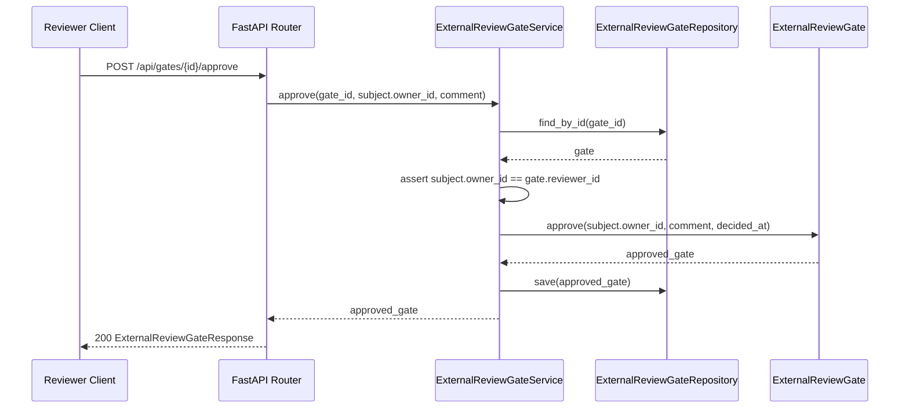
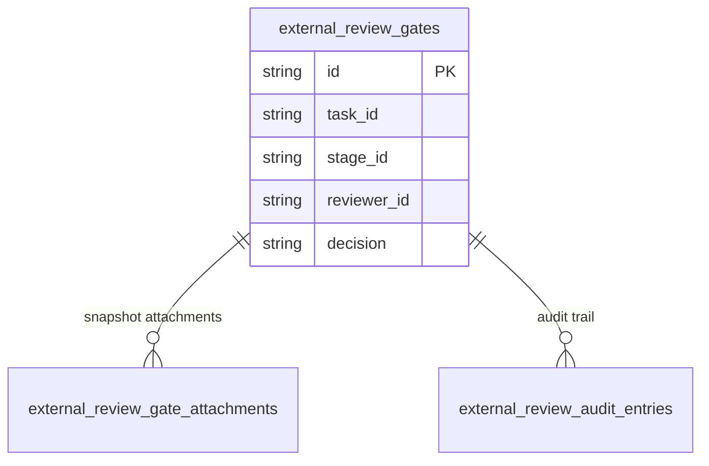

# 基本設計書

> feature: `external-review-gate` / sub-feature: `http-api`
> 親業務仕様: [`../feature-spec.md`](../feature-spec.md)
> 関連: [`basic-design.md §モジュール契約`](basic-design.md)

## 本書の役割

本書は **階層 3: モジュール（sub-feature）の基本設計** として、ExternalReviewGate を reviewer 視点で操作する HTTP API の構造契約を凍結する。親 [`../feature-spec.md`](../feature-spec.md) の UC-ERG-002〜005 と R1-B / R1-C / R1-H を HTTP 境界へ展開し、API 6 本の入出力、認可境界、状態遷移、外部レビュー承認 / 却下 / 取消の責務を定義する。

## 記述ルール（必ず守ること）

基本設計に **疑似コード・サンプル実装（言語コードブロック）を書かない**。
ソースコードと二重管理になりメンテナンスコストしか生まない。
必要なのは構造契約（クラス・モジュール・データの関係）であり、実装の細部は [`detailed-design.md`](detailed-design.md) で凍結する。

## モジュール構成

| 機能 ID | モジュール | ディレクトリ | 責務 |
|---|---|---|---|
| REQ-ERG-HTTP-001〜006 | `external_review_gates_router` | `backend/src/bakufu/interfaces/http/routers/external_review_gates.py` | Gate 一覧 / Task 履歴 / 単件 / approve / reject / cancel の 6 エンドポイント |
| REQ-ERG-HTTP-001〜006 | `ExternalReviewGateService` | `backend/src/bakufu/application/services/external_review_gate_service.py` | Repository 取得、reviewer 境界検証、Domain ふるまい呼び出し、UoW 保存 |
| REQ-ERG-HTTP-001〜006 | `ExternalReviewGateSchemas` | `backend/src/bakufu/interfaces/http/schemas/external_review_gate.py` | Pydantic v2 request / response model、VO 変換、HTTP レスポンスは Repository 復元値をそのまま返す。`MaskedText` が保存時に不可逆マスクした secret は redacted のまま返る |
| REQ-ERG-HTTP-003〜006 | error handlers | `backend/src/bakufu/interfaces/http/error_handlers.py` | NotFound / Forbidden / Conflict / InvariantViolation を `ErrorResponse` へ変換 |
| REQ-ERG-HTTP-001〜006 | DI / app wiring | `backend/src/bakufu/interfaces/http/dependencies.py` / `app.py` | `ExternalReviewGateService` 注入と router 登録 |

```
ディレクトリ構造（本 sub-feature で追加・変更されるファイル）:

backend/src/bakufu/
├── application/
│   ├── exceptions/external_review_gate_exceptions.py
│   └── services/external_review_gate_service.py
└── interfaces/http/
    ├── app.py
    ├── dependencies.py
    ├── error_handlers.py
    ├── routers/external_review_gates.py
    └── schemas/external_review_gate.py
```

## モジュール契約（機能要件）

### REQ-ERG-HTTP-001: reviewer 向け Gate 一覧

| 項目 | 内容 |
|---|---|
| 入力 | `GET /api/gates?decision=PENDING`。`decision` は MVP では `PENDING` のみ受理。reviewer は認証済み subject から取得し、query/body で受け取らない |
| 処理 | 認証済み subject の PENDING Gate を `created_at DESC, id DESC` で取得する。reviewer 不在確認は行わず、Repository 結果に従う |
| 出力 | HTTP 200, `ExternalReviewGateListResponse(items, total)` |
| エラー時 | 不正 UUID / 未対応 decision → 422 (MSG-ERG-HTTP-004) |

### REQ-ERG-HTTP-002: Task の Gate 履歴

| 項目 | 内容 |
|---|---|
| 入力 | `GET /api/tasks/{task_id}/gates`。reviewer は認証済み subject から取得し、query/body で受け取らない |
| 処理 | `task_id` の Gate 履歴を `created_at ASC, id ASC` で取得し、`gate.reviewer_id == subject.owner_id` の行だけ返す |
| 出力 | HTTP 200, `ExternalReviewGateListResponse`。複数ラウンド履歴を時系列で返す |
| エラー時 | 不正 UUID → 422。該当なしは 200 + 空リスト |

### REQ-ERG-HTTP-003: Gate 単件取得

| 項目 | 内容 |
|---|---|
| 入力 | `GET /api/gates/{id}`。viewer は認証済み subject から取得し、query/body で受け取らない |
| 処理 | Gate を取得し、`subject.owner_id == gate.reviewer_id` を検証する。成功時は `record_view(subject.owner_id)` を呼び audit_trail に VIEWED を追記して保存する |
| 出力 | HTTP 200, `ExternalReviewGateResponse`（deliverable_snapshot / attachments / audit_trail 込み） |
| エラー時 | Gate 不在 → 404 (MSG-ERG-HTTP-001) / reviewer 不一致 → 403 (MSG-ERG-HTTP-002) / 不正 UUID → 422 |

### REQ-ERG-HTTP-004: Gate 承認

| 項目 | 内容 |
|---|---|
| 入力 | `POST /api/gates/{id}/approve`、Body `{"comment": str | null}`。actor は認証済み subject から取得し、body で受け取らない |
| 処理 | Gate を取得し、`subject.owner_id == gate.reviewer_id` を検証する。PENDING のみ `gate.approve(subject.owner_id, comment or "")` を実行し保存する |
| 出力 | HTTP 200, `ExternalReviewGateResponse`（decision=APPROVED, decided_at set, audit_trail に APPROVED 追記） |
| エラー時 | 不在 → 404 / reviewer 不一致 → 403 / 既決 Gate → 409 (MSG-ERG-HTTP-003) / comment 10000 文字超 → 422 |

### REQ-ERG-HTTP-005: Gate 差し戻し

| 項目 | 内容 |
|---|---|
| 入力 | `POST /api/gates/{id}/reject`、Body `{"feedback_text": str}`。`feedback_text` は 1〜10000 文字。actor は認証済み subject から取得し、body で受け取らない |
| 処理 | Gate を取得し、`subject.owner_id == gate.reviewer_id` を検証する。PENDING のみ `gate.reject(subject.owner_id, feedback_text)` を実行し保存する |
| 出力 | HTTP 200, `ExternalReviewGateResponse`（decision=REJECTED, decided_at set, feedback_text set） |
| エラー時 | 不在 → 404 / reviewer 不一致 → 403 / 既決 Gate → 409 / 空または 10000 文字超 → 422 |

### REQ-ERG-HTTP-006: Gate 取消

| 項目 | 内容 |
|---|---|
| 入力 | `POST /api/gates/{id}/cancel`、Body `{"reason": str | null}`。actor は認証済み subject から取得し、body で受け取らない |
| 処理 | Gate を取得し、`subject.owner_id == gate.reviewer_id` を検証する。PENDING のみ `gate.cancel(subject.owner_id, reason or "")` を実行し保存する |
| 出力 | HTTP 200, `ExternalReviewGateResponse`（decision=CANCELLED, decided_at set） |
| エラー時 | 不在 → 404 / reviewer 不一致 → 403 / 既決 Gate → 409 / reason 10000 文字超 → 422 |

## ユーザー向けメッセージ一覧

| ID | 種別 | メッセージ（要旨） | 表示条件 |
|---|---|---|---|
| MSG-ERG-HTTP-001 | エラー | External review gate not found. / Next: Refresh the gate list and select an existing gate. | 指定 Gate が存在しない |
| MSG-ERG-HTTP-002 | エラー | Reviewer is not authorized for this gate. / Next: Sign in as the assigned reviewer for this gate. | 認証済み subject が Gate reviewer と一致しない |
| MSG-ERG-HTTP-003 | エラー | External review gate has already been decided. / Next: Open the task gate history and review the latest pending gate. | APPROVED / REJECTED / CANCELLED に再判断を要求 |
| MSG-ERG-HTTP-004 | エラー | Request validation failed: `<detail>` / Next: Fix the request parameters and retry. | UUID / Body / query validation 失敗 |

各メッセージの確定文言は [`detailed-design.md §MSG 確定文言表`](detailed-design.md) で凍結する。

## 依存関係

| 区分 | 依存 | バージョン方針 | 備考 |
|---|---|---|---|
| ランタイム | Python 3.12+ | `pyproject.toml` | 既存 |
| HTTP | FastAPI / Pydantic v2 / httpx | `pyproject.toml` | http-api-foundation で確定済み |
| application | `ExternalReviewGateService` | 本 sub-feature で肉付け | Repository + session UoW を保持 |
| repository | `ExternalReviewGateRepository` | 既存 | `find_by_id` / `find_pending_by_reviewer` / `find_by_task_id` / `save` を使用 |
| domain | `ExternalReviewGate` / `ReviewDecision` / `AuditEntry` | 既存 | 状態遷移は Domain に委譲 |
| auth | `AuthenticatedSubject` dependency | 本 sub-feature | `Authorization: Bearer <token>` をサーバ設定の `BAKUFU_OWNER_API_TOKEN` と照合し、成功時だけ `BAKUFU_OWNER_ID` を `subject.owner_id` として返す。`reviewer_id` / `viewer_id` / `actor_id` の自己申告入力は禁止 |
| security | `MaskedText` | 既存 | DB 保存時に `body_markdown` / `feedback_text` / audit comment を不可逆マスクする。HTTP レスポンス層では再マスクも原文復号もせず、Repository 復元値（secret は redacted）を返す |

## クラス設計（概要）

```mermaid
classDiagram
    class ExternalReviewGatesRouter {
        +GET /api/gates
        +GET /api/tasks/{task_id}/gates
        +GET /api/gates/{id}
        +POST /api/gates/{id}/approve
        +POST /api/gates/{id}/reject
        +POST /api/gates/{id}/cancel
    }
    class ExternalReviewGateService {
        -_repo
        -_session
        +list_pending(subject)
        +list_by_task(task_id, subject)
        +get_and_record_view(gate_id, subject)
        +approve(gate_id, subject, comment)
        +reject(gate_id, subject, feedback_text)
        +cancel(gate_id, subject, reason)
    }
    class ExternalReviewGateRepository {
        <<Protocol>>
        +find_by_id(gate_id)
        +find_pending_by_reviewer(reviewer_id)
        +find_by_task_id(task_id)
        +save(gate)
    }
    class ExternalReviewGateResponse
    class ExternalReviewGateDecisionRequest

    ExternalReviewGatesRouter --> ExternalReviewGateService
    ExternalReviewGateService --> ExternalReviewGateRepository
    ExternalReviewGatesRouter ..> ExternalReviewGateResponse
    ExternalReviewGatesRouter ..> ExternalReviewGateDecisionRequest
```

**凝集のポイント**:
- HTTP router は入出力変換と status code だけを持つ。
- reviewer / actor の認可境界は application service に閉じる。ただし主体 ID は認証済み subject からのみ取得し、query/body の自己申告値は使わない。
- 状態遷移は Domain に「やれ」と命じ、HTTP 層は decision を直接書き換えない。
- DB masking は Repository 責務。HTTP レスポンスは Repository 復元値を返し、schema serializer で再マスクしない。`MaskedText.process_result_value` は復号しないため、保存済み secret は redacted のまま表示される。

## 処理フロー

### ユースケース 1: PENDING Gate 一覧

1. reviewer が `GET /api/gates` を呼ぶ。
2. Service が `find_pending_by_reviewer` を呼ぶ。
3. Schema が `ExternalReviewGateListResponse` に変換する。

### ユースケース 2: Gate 詳細閲覧

1. reviewer が `GET /api/gates/{id}` を呼ぶ。
2. Service が Gate 不在と reviewer 不一致を検証する。
3. Domain の `record_view` で audit_trail に VIEWED を追記する。
4. 同一 UoW で保存し、更新後 Gate を返す。

### ユースケース 3: 承認 / 差し戻し / 取消

1. reviewer が decision API を呼ぶ。
2. Service が Gate 不在と reviewer 不一致を検証する。
3. Domain の `approve` / `reject` / `cancel` を呼ぶ。
4. Domain が PENDING → 終端状態を 1 回だけ許可し、既決なら Fail Fast する。
5. Service が保存し、HTTP 200 で更新後 Gate を返す。

## シーケンス図



## アーキテクチャへの影響

- [`docs/design/domain-model.md`](../../../design/domain-model.md) への変更: なし。
- [`docs/design/tech-stack.md`](../../../design/tech-stack.md) への変更: なし。既存 FastAPI / Pydantic v2 を使用する。
- 既存 feature への波及: `interfaces/http/app.py` に router / handler 登録を追加する。親 `feature-spec.md` は本 sub-feature を現行 scope として更新済み。

## 外部連携

| 連携先 | 目的 | プロトコル | 認証 | タイムアウト / リトライ |
|---|---|---|---|---|
| 該当なし | 外部通信なし | — | — | — |

## UX 設計

| シナリオ | 期待される挙動 |
|---|---|
| reviewer dashboard | PENDING Gate が新しい順に表示できる |
| reviewer detail | deliverable snapshot と audit_trail を同時に確認できる |
| reviewer decision | approve / reject / cancel 後に同じレスポンス形式で最新状態を確認できる |

**アクセシビリティ方針**: 該当なし — 本 sub-feature は HTTP API のみ。UI 表示要件は後続 `ui` sub-feature で扱う。

## セキュリティ設計

### 脅威モデル

| 想定攻撃者 | 攻撃経路 | 保護資産 | 対策 |
|---|---|---|---|
| **T1: BOLA** | 他 reviewer の `gate_id` を推測して単件取得 / 判断 | Deliverable snapshot / audit_trail / decision | 認証済み `subject.owner_id` と `gate.reviewer_id` の一致を service で必須化し、不一致は 403。`reviewer_id` / `viewer_id` / `actor_id` は API 入力として受け付けない |
| **T2: 既決 Gate の再判断** | APPROVED 後に reject / cancel を再送 | Gate の判断一回性 | Domain state machine の `decision_already_decided` を 409 に変換 |
| **T3: secret 露出** | snapshot / feedback / audit comment に webhook URL が混入 | webhook URL / API key | Repository `MaskedText` による DB 保存時マスキングで at-rest とログを保護する。HTTP API は Repository 復元値を再マスクせず返すが、`MaskedText` は復号しないため保存済み secret は redacted のまま返る |
| **T4: audit 改ざん** | 詳細取得を audit なしで返す | 閲覧監査ログ | `GET /api/gates/{id}` は `record_view` 保存後の Gate を返す |
| **T5: CSRF** | ブラウザ経由で approve / reject / cancel を不正送信 | Gate の判断完全性 | http-api-foundation 確定D: 状態変更 POST は `Origin` ヘッダ検証ミドルウェアを通す。不一致 Origin は 403 |
| **T6: vulnerable components** | FastAPI / Starlette / Pydantic / httpx / SQLAlchemy / SQLite の既知脆弱性 | API 実行環境 | `just audit` / CI `audit` で依存 CVE を確認し、既知 critical/high を残したまま実装 PR を通さない |

### OWASP API Security Top 10 2023 対応表

| ID | リスク | 本 sub-feature の対応 | テスト |
|---|---|---|---|
| API1 | Broken Object Level Authorization | `subject.owner_id == gate.reviewer_id` を全単件 / 状態変更で検証し、自己申告 ID を禁止 | TC-IT-ERG-HTTP-008 / 015 |
| API2 | Broken Authentication | Bearer token 必須、constant-time 比較、欠落 / 不一致は Service 前で 401 | TC-IT-ERG-HTTP-015 / 016 |
| API3 | Broken Object Property Level Authorization | request body は `extra="forbid"`。`actor_id` 等の権限属性注入と audit 直接編集を禁止 | TC-IT-ERG-HTTP-009 |
| API4 | Unrestricted Resource Consumption | comment / feedback / reason を 10000 文字上限、一覧は MVP で PENDING のみ | TC-IT-ERG-HTTP-009 / TC-UT-ERG-HTTP-008 |
| API5 | Broken Function Level Authorization | reviewer 以外は approve / reject / cancel 不可。管理者用の横断操作は設けない | TC-IT-ERG-HTTP-008 |
| API6 | Unrestricted Access to Sensitive Business Flows | 状態変更は PENDING 1 回のみ、CSRF Origin 検証を通す | TC-IT-ERG-HTTP-007 / 014 |
| API7 | Server Side Request Forgery | 本 API は外部 URL へ送信しない。入力 URL は保存対象であり fetch 対象ではない | 該当なし（外部通信なし） |
| API8 | Security Misconfiguration | auth / CSRF / error handler を app wiring で登録し、CORS は許可 Origin のみに限定 | TC-IT-ERG-HTTP-014 / 015 |
| API9 | Improper Inventory Management | 6 API を本書で棚卸しし、OpenAPI とテストマトリクスで孤児 API を禁止 | TC-IT-ERG-HTTP-011〜013 |
| API10 | Unsafe Consumption of APIs | 外部 API 消費なし。将来追加時は timeout / retry / schema validation を個別 sub-feature で凍結 | 該当なし（外部 API なし） |

### Bearer token 運用

| 項目 | 凍結内容 |
|---|---|
| 生成強度 | `BAKUFU_OWNER_API_TOKEN` は 32 bytes 以上の CSPRNG 由来 URL-safe secret。短い固定語は禁止 |
| 保管 | token は環境変数または secrets manager で注入し、Git / docs / DB に保存しない |
| 照合 | request token と設定値は constant-time 比較する |
| ローテーション | 漏洩時は設定値を差し替えてプロセス再起動する。MVP は単一 token のため同時二重 token は扱わない |
| ログ非露出 | `Authorization` ヘッダ、token 値、比較失敗時の入力値は application / access log に出さない |

詳細な信頼境界は [`docs/design/threat-model.md`](../../../design/threat-model.md)。

## ER 図



## エラーハンドリング方針

| 例外種別 | 処理方針 | ユーザーへの通知 |
|---|---|---|
| `ExternalReviewGateNotFoundError` | 404 / `not_found` | MSG-ERG-HTTP-001 |
| `ExternalReviewGateAuthorizationError` | 403 / `forbidden` | MSG-ERG-HTTP-002 |
| `ExternalReviewGateDecisionConflictError` | 409 / `conflict` | MSG-ERG-HTTP-003 |
| `ExternalReviewGateInvariantViolation` | feedback 長などは 422、既決 decision は service で 409 に変換 | MSG-ERG-HTTP-003 / 004 |
