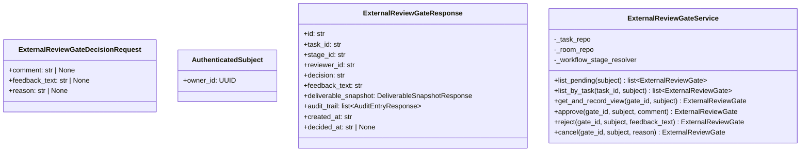

# 詳細設計書

> feature: `external-review-gate` / sub-feature: `http-api`
> 親業務仕様: [`../feature-spec.md`](../feature-spec.md)
> 関連: [`basic-design.md`](basic-design.md)

## 本書の役割

本書は階層 3 [`basic-design.md`](basic-design.md) を、実装直前の構造契約・確定文言・API エンドポイント詳細として凍結する。実装 PR は本書を参照し、HTTP 層が Domain の状態を直接変更しないこと、reviewer 境界を application service に閉じること、認証済み subject 以外の自己申告 ID を認可に使わないこと、HTTP レスポンスでは Repository 復元値を返すことを守る。

## 記述ルール（必ず守ること）

詳細設計に **疑似コード・サンプル実装（言語コードブロック）を書かない**。
ソースコードと二重管理になりメンテナンスコストしか生まない。
必要なのは「構造契約（属性名・型・制約）」と「確定文言（メッセージ文字列）」と「実装の意図（なぜこの API 形になるか）」であり、コードそのものは実装 PR で書く。

## クラス設計（詳細）

### Aggregate Root: ExternalReviewGate

| 属性 | 型 | 制約 | 意図 |
|---|---|---|---|
| `id` | `GateId` | UUID | API パス識別子 |
| `task_id` | `TaskId` | UUID | Task 履歴 API の検索キー |
| `stage_id` | `StageId` | UUID | 対象 Stage |
| `deliverable_snapshot` | `Deliverable` | Gate 生成後不変 | CEO が判断した成果物本文 |
| `reviewer_id` | `OwnerId` | UUID | Gate に割り当てられた reviewer。HTTP 認可では `AuthenticatedSubject.owner_id` と照合する |
| `decision` | `ReviewDecision` | PENDING / APPROVED / REJECTED / CANCELLED | 状態遷移結果 |
| `feedback_text` | `str` | 0〜10000 文字 | approve comment / reject feedback / cancel reason |
| `audit_trail` | `list[AuditEntry]` | 追記のみ | 閲覧・判断の監査証跡 |
| `created_at` | `datetime` | tz-aware | Gate 作成時刻 |
| `decided_at` | `datetime | None` | PENDING は None、終端状態は set | 判断時刻 |

**不変条件**:
- `decision=PENDING` のみ approve / reject / cancel を許可する。
- `record_view` は 4 状態すべてで許可する。
- `deliverable_snapshot` は HTTP API から更新しない。
- `audit_trail` は HTTP API から直接編集しない。

**ふるまい**:
- `approve(by_owner_id, comment, decided_at)`: PENDING → APPROVED。
- `reject(by_owner_id, comment, decided_at)`: PENDING → REJECTED。
- `cancel(by_owner_id, reason, decided_at)`: PENDING → CANCELLED。
- `record_view(by_owner_id, viewed_at)`: decision 不変、VIEWED audit 追記。

### Entity within Aggregate: AuditEntry

| 属性 | 型 | 制約 |
|---|---|---|
| `id` | `UUID` | 一意 |
| `actor_id` | `OwnerId` | 認証済み subject から解決する reviewer ID。HTTP request body / query では受け取らない |
| `action` | `AuditAction` | VIEWED / APPROVED / REJECTED / CANCELLED |
| `comment` | `str` | 0〜10000 文字 |
| `occurred_at` | `datetime` | tz-aware |

### Value Object: DeliverableSnapshotResponse

| 属性 | 型 |
|---|---|
| `stage_id` | `str` |
| `body_markdown` | `str` |
| `submitted_by` | `str` |
| `submitted_at` | `str` |
| `attachments` | `list[AttachmentResponse]` |

## 確定事項（先送り撤廃）

### 確定 A: 認可境界

HTTP 契約は `reviewer_id` / `viewer_id` / `actor_id` を query / body で受け取らない。Router は `AuthenticatedSubject` dependency から検証済み subject を受け取り、Service は取得済み Gate の `reviewer_id` と `subject.owner_id` が一致しない操作を 403 で拒否する。自己申告 ID は spoofing 可能なので認可境界として不適格だ。これは OWASP API1:2023 の BOLA 対策として、パス ID だけで他人の Gate を読ませないためだ。

**AuthenticatedSubject 解決契約**:

| 項目 | 内容 |
|---|---|
| 入力 | `Authorization: Bearer <token>` |
| 検証 | `<token>` をサーバ設定 `BAKUFU_OWNER_API_TOKEN` と constant-time 比較する。token は 32 bytes 以上の CSPRNG 由来 URL-safe secret とする |
| subject | 検証成功時、サーバ設定 `BAKUFU_OWNER_ID` を `AuthenticatedSubject.owner_id` として返す |
| 失敗 | token 欠落 / 不一致 / `BAKUFU_OWNER_ID` 不正 UUID は 401 で拒否し、Service を呼ばない |
| 禁止 | request query/body/header から reviewer ID を直接受け取らない。`X-Reviewer-Id` などの主体ヘッダも禁止 |
| スキーマ | decision request は `extra="forbid"` とし、`actor_id` / `viewer_id` / `reviewer_id` が body に混入したら 422 |
| 保管 | `BAKUFU_OWNER_API_TOKEN` は環境変数または secrets manager で注入し、Git / docs / DB に保存しない |
| ローテーション | 漏洩時は設定値を差し替えてプロセス再起動する。MVP は単一 token のため grace period 付き二重 token は扱わない |
| ログ非露出 | `Authorization` ヘッダ、token 値、比較失敗時の入力値は application / access log に出さない |

**Bearer token 運用契約**:

| 項目 | 内容 |
|---|---|
| 生成強度 | 256 bit 以上の CSPRNG 由来値。人間可読語・短縮 UUID・時刻由来は禁止 |
| 保管 | `BAKUFU_OWNER_API_TOKEN` は環境変数または secret manager のみ。DB / repository / log に保存しない |
| ローテーション | token 変更は再起動で反映。旧 token と新 token の二重受理は MVP では行わない |
| ログ非露出 | `Authorization` header、token 比較失敗時の入力値、設定値は structured log / error body に出さない |

### 確定 B: `GET /api/gates/{id}` は閲覧記録を保存する

Gate 詳細取得は単なる read ではなく、親仕様 R1-C / R1-E の監査要件を満たすため `record_view` を呼び、保存後の Gate を返す。複数回閲覧は audit_trail に複数 VIEWED として残る。

### 確定 C: reject の `feedback_text` は必須

差し戻しは後続 Agent が修正するための業務情報なので、空文字を 422 で拒否する。approve comment と cancel reason は任意であり、未指定時は空文字を Domain に渡す。

### 確定 D: 既決 Gate の再判断は 409

Domain の `ExternalReviewGateInvariantViolation(kind="decision_already_decided")` は Service で `ExternalReviewGateDecisionConflictError` に変換する。HTTP クライアントから見ると入力形式ではなくリソース状態の競合だからだ。

### 確定 E: HTTP レスポンスは Repository 復元値をそのまま返す

HTTP schema serializer は `deliverable_snapshot.body_markdown` / `feedback_text` / `audit_trail[].comment` に `mask()` を再適用しない。一方で Repository の `MaskedText` は不可逆マスクであり、DB に保存された secret を HTTP 層が raw secret へ復号する契約はない。したがって Repository 復元値に `<REDACTED:*>` が含まれる場合、HTTP は redacted のまま返す。

### 確定 E-2: Gate 判断後の Task 遷移は Workflow Transition 契約で解決する

`ExternalReviewGateService.approve()` / `reject()` は Gate を保存した後、同一 UoW で Task を進める。ただし `gate.stage_id` を `next_stage_id` として再利用してはならない。Service は `TaskRepository` で Task を取得し、`RoomRepository` で `room.workflow_id` を解決し、`WorkflowStageResolver.find_transition_by_workflow_stage_condition(workflow_id, gate.stage_id, APPROVED|REJECTED)` から `transition_id` と `to_stage_id` を得る。承認は APPROVED 遷移の `to_stage_id`、差し戻しは REJECTED 遷移の `to_stage_id` だけを `task.approve_review()` / `task.reject_review()` に渡す。

`ExternalReviewGateService.__init__` は `TaskRepository` / `RoomRepository` / `WorkflowStageResolver` を必須依存として受け取る。いずれかが欠落する構成は Gate 判断後の Task 遷移契約を満たせないため、初期化時に fail fast し、`approve()` / `reject()` で黙って Task 遷移を省略してはならない。

### 確定 F: CSRF Origin 検証

approve / reject / cancel は状態変更 POST なので、http-api-foundation 確定Dの CSRF Origin 検証ミドルウェアを必ず通る。`Origin` ヘッダが存在し、許可 Origin 一覧と不一致なら 403 / MSG-HAF-004 を返す。MVP では curl / SDK / AI エージェント用に `Origin` なしは通過する既存契約を維持する。

### 確定 G: CVE 確認

Issue #61 実装 PR は `audit` CI（pip-audit / pnpm audit）を必須証跡に含める。FastAPI / Starlette / Pydantic / httpx / SQLAlchemy / SQLite 関連で known critical/high CVE が残る場合は、設計ではなく依存更新または明示的な影響なし根拠を PR に記載するまでマージ不可とする。

### 確定 H: OWASP API Security Top 10 固定対応

| 分類 | 固定する設計 |
|---|---|
| API1 BOLA | 全 Gate 操作で `subject.owner_id` と `gate.reviewer_id` を照合 |
| API2 Authentication | Bearer token の constant-time 比較、CSPRNG 256 bit 以上、ログ非露出 |
| API3 BOPLA | request `extra="forbid"`、主体 ID 入力禁止 |
| API4 Resource Consumption | 10000 文字上限、PENDING 一覧に限定 |
| API5 Function Authorization | reviewer API 以外の権限を持たせない |
| API6 Sensitive Flows | 状態変更は PENDING 一回だけ、既決は 409 |
| API7 SSRF | 外部 URL fetch なし |
| API8 Misconfiguration | Origin guard / CORS / error handler は foundation 準拠 |
| API9 Inventory | 本書の 6 endpoint だけを公開対象にする |
| API10 Unsafe API Consumption | 外部 API 消費なし、依存 CVE は audit CI で止める |

### 確定 I: HTTP 境界の公開関数禁止

ExternalReviewGate の HTTP 入口、DI、app wiring、error handler はクラスへ封入する。HTTP 境界全体（`app.py` / `dependencies.py` / `error_handlers.py` / `routers/*.py`）はトップレベル公開関数を持たない。FastAPI の handler 登録は `HttpApplicationFactory` から `HttpErrorHandlers` のメソッドを明示的に参照し、route 登録は各 `*HttpRoutes` クラスの classmethod を `APIRouter.add_api_route()` に渡す。

## 設計判断の補足

### なぜ decision を query で自由検索にしないか

Issue #61 の dashboard 要件は PENDING 一覧であり、Repository も `find_pending_by_reviewer` を持つ。APPROVED / REJECTED / CANCELLED の横断検索は MVP 最短路では不要なので、YAGNI として `decision=PENDING` のみ許可する。

### なぜ Task 履歴 API は reviewer_id でフィルタするか

`GET /api/tasks/{task_id}/gates` は複数ラウンドを見せるために必要だが、Task ID を知るだけで他 reviewer の snapshot を読めると BOLA になる。現時点では reviewer が自分の Gate 履歴だけ読む契約に絞る。

## ユーザー向けメッセージの確定文言

### プレフィックス統一

| プレフィックス | 意味 |
|---|---|
| `[FAIL]` | HTTP body には露出しない。domain 由来文言の前処理対象 |
| `[OK]` | 該当なし |
| `[SKIP]` | 該当なし |
| `[WARN]` | 該当なし |
| `[INFO]` | 該当なし |

### MSG 確定文言表

| ID | 出力先 | 文言（2 行構造） |
|---|---|---|
| MSG-ERG-HTTP-001 | HTTP JSON | `External review gate not found.\nNext: Refresh the gate list and select an existing gate.` |
| MSG-ERG-HTTP-002 | HTTP JSON | `Reviewer is not authorized for this gate.\nNext: Sign in as the assigned reviewer for this gate.` |
| MSG-ERG-HTTP-003 | HTTP JSON | `External review gate has already been decided.\nNext: Open the task gate history and review the latest pending gate.` |
| MSG-ERG-HTTP-004 | HTTP JSON | `Request validation failed: <detail>\nNext: Fix the request parameters and retry.` |

## データ構造（永続化キー）

### `external_review_gates` テーブル

| カラム | 型 | 制約 | 意図 |
|---|---|---|---|
| `id` | string | PK, NOT NULL | Gate 識別子 |
| `task_id` | string | NOT NULL, indexed | Task 履歴検索 |
| `stage_id` | string | NOT NULL | Stage 識別子 |
| `reviewer_id` | string | NOT NULL, indexed | reviewer dashboard / 認可境界 |
| `decision` | string | NOT NULL, indexed | PENDING 一覧 / 状態 |
| `snapshot_body_markdown` | MaskedText | NOT NULL | 成果物本文 |
| `feedback_text` | MaskedText | NOT NULL | 判断コメント |
| `created_at` | datetime | NOT NULL | 並び順 |
| `decided_at` | datetime | nullable | 判断時刻 |

### `/api/gates` リクエスト / レスポンス

| フィールド | 型 | 必須 | 説明 |
|---|---|---|---|
| `subject` | `AuthenticatedSubject` dependency | yes | reviewer dashboard の主体。query/body の `reviewer_id` は受け取らない |
| `decision` | string query | no | MVP は `PENDING` のみ |
| `items` | list | response | Gate response 配列 |
| `total` | int | response | `len(items)` と等価 |

## API エンドポイント詳細

### GET /api/gates

| 項目 | 内容 |
|---|---|
| 用途 | reviewer の PENDING Gate 一覧 |
| 認証 | `AuthenticatedSubject.owner_id` を reviewer として使用。query/body の `reviewer_id` は受け取らない |
| リクエスト Body | なし |
| 成功レスポンス | 200 OK + `ExternalReviewGateListResponse` |
| 失敗レスポンス | 422 + `ErrorResponse` |
| 副作用 | なし |

### GET /api/tasks/{task_id}/gates

| 項目 | 内容 |
|---|---|
| 用途 | Task の Gate 履歴（複数ラウンド） |
| 認証 | `AuthenticatedSubject.owner_id` で自分の Gate のみ返す |
| リクエスト Body | なし |
| 成功レスポンス | 200 OK + `ExternalReviewGateListResponse` |
| 失敗レスポンス | 422 + `ErrorResponse` |
| 副作用 | なし |

### GET /api/gates/{id}

| 項目 | 内容 |
|---|---|
| 用途 | Gate 単件取得、閲覧監査記録 |
| 認証 | `AuthenticatedSubject.owner_id` と `gate.reviewer_id` を照合 |
| リクエスト Body | なし |
| 成功レスポンス | 200 OK + `ExternalReviewGateResponse` |
| 失敗レスポンス | 404 / 403 / 422 + `ErrorResponse` |
| 副作用 | `AuditEntry(action=VIEWED)` 追記、Gate 保存 |

### POST /api/gates/{id}/approve

| 項目 | 内容 |
|---|---|
| 用途 | 外部レビュー承認 |
| 認証 | `AuthenticatedSubject.owner_id` と `gate.reviewer_id` を照合 |
| リクエスト Body | `ApproveGateRequest(comment?)` |
| 成功レスポンス | 200 OK + `ExternalReviewGateResponse(decision=APPROVED)` |
| 失敗レスポンス | 404 / 403 / 409 / 422 + `ErrorResponse` |
| 副作用 | `AuditEntry(action=APPROVED)` 追記、Gate 保存 |

### POST /api/gates/{id}/reject

| 項目 | 内容 |
|---|---|
| 用途 | 外部レビュー差し戻し |
| 認証 | `AuthenticatedSubject.owner_id` と `gate.reviewer_id` を照合 |
| リクエスト Body | `RejectGateRequest(feedback_text)` |
| 成功レスポンス | 200 OK + `ExternalReviewGateResponse(decision=REJECTED)` |
| 失敗レスポンス | 404 / 403 / 409 / 422 + `ErrorResponse` |
| 副作用 | `AuditEntry(action=REJECTED)` 追記、Gate 保存 |

### POST /api/gates/{id}/cancel

| 項目 | 内容 |
|---|---|
| 用途 | 外部レビュー取消 |
| 認証 | `AuthenticatedSubject.owner_id` と `gate.reviewer_id` を照合 |
| リクエスト Body | `CancelGateRequest(reason?)` |
| 成功レスポンス | 200 OK + `ExternalReviewGateResponse(decision=CANCELLED)` |
| 失敗レスポンス | 404 / 403 / 409 / 422 + `ErrorResponse` |
| 副作用 | `AuditEntry(action=CANCELLED)` 追記、Gate 保存 |

## 出典・参考

- FastAPI response model: https://fastapi.tiangolo.com/tutorial/response-model/
- FastAPI path parameters: https://fastapi.tiangolo.com/tutorial/path-params/
- Pydantic field serializers: https://docs.pydantic.dev/latest/concepts/serialization/#field-serializers
- OWASP API1:2023 Broken Object Level Authorization: https://owasp.org/API-Security/editions/2023/en/0xa1-broken-object-level-authorization/
- OWASP API Security Top 10 2023: https://owasp.org/API-Security/editions/2023/en/0x00-header/
- OWASP API3:2023 Broken Object Property Level Authorization: https://owasp.org/API-Security/editions/2023/en/0xa3-broken-object-property-level-authorization/
- OWASP Cross-Site Request Forgery Prevention Cheat Sheet: https://cheatsheetseries.owasp.org/cheatsheets/Cross-Site_Request_Forgery_Prevention_Cheat_Sheet.html
- GitHub Advisory Database: https://github.com/advisories
- OSV vulnerability database: https://osv.dev/
