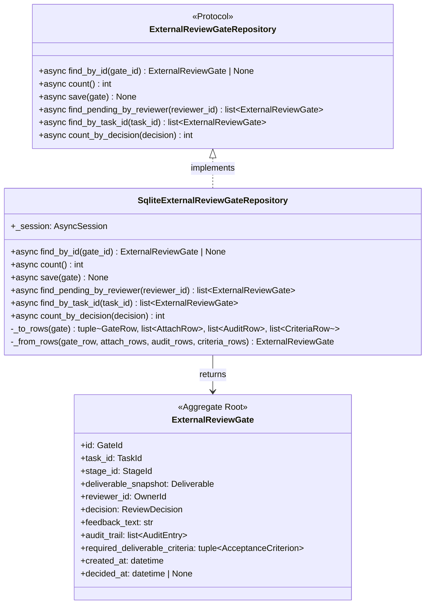
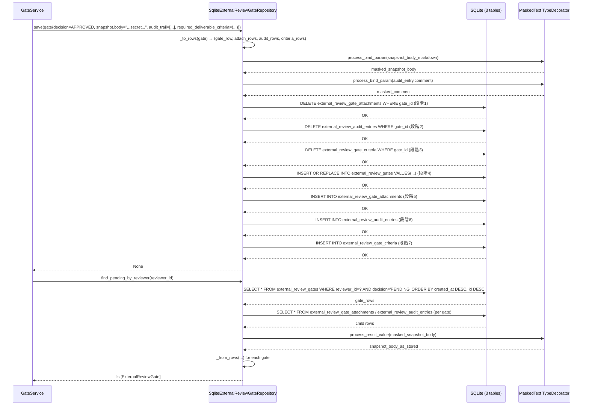
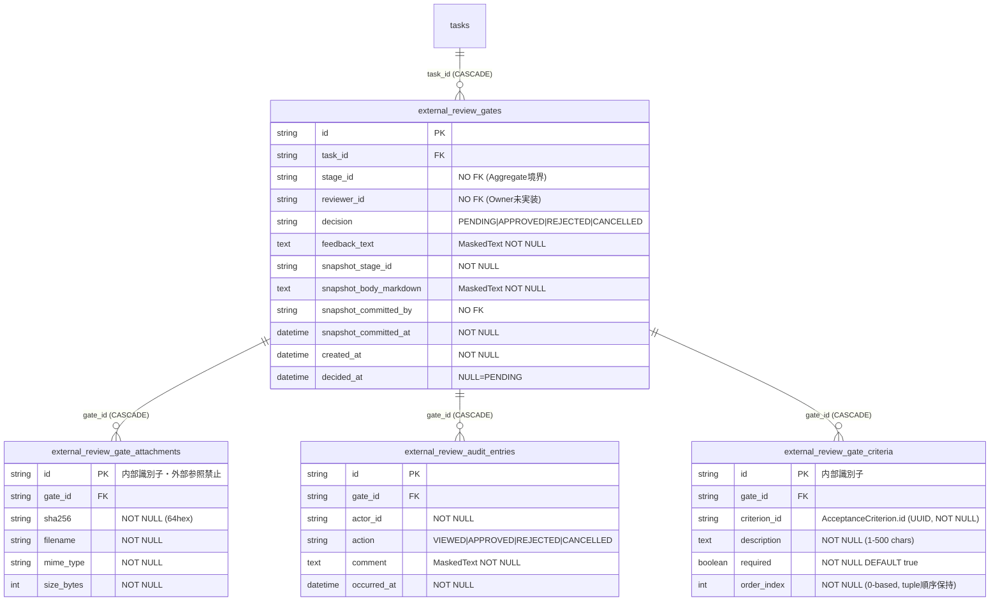

# 基本設計書 — external-review-gate / repository

> feature: `external-review-gate` / sub-feature: `repository`
> 親 spec: [../feature-spec.md](../feature-spec.md) §9 受入基準 14, 15
> 関連: [`../domain/basic-design.md`](../domain/basic-design.md) / [`../../empire-repository/`](../../empire-repository/) **テンプレート真実源** / [`../../task-repository/`](../../task-repository/) **直近テンプレート**

## §モジュール契約（機能要件）

| 要件ID | 概要 | 入力 | 処理 | 出力 | エラー時 | 親 spec 参照 |
|--------|------|------|------|------|---------|-------------|
| REQ-ERGR-001 | ExternalReviewGateRepository Protocol 定義 | — | 6 method（find_by_id / count / save / find_pending_by_reviewer / find_by_task_id / count_by_decision）を async def で宣言 | Protocol 型定義 | — | §9 AC#14 |
| REQ-ERGR-002 | save() 7 段階 DELETE+UPSERT+INSERT | gate: ExternalReviewGate | 子テーブル DELETE（3 種）→ gate UPSERT → 子テーブル INSERT（3 種）（§確定 R1-B 7 段階） | None | `sqlalchemy.IntegrityError`（FK 違反等）→ 上位伝播 | §9 AC#14 |
| REQ-ERGR-003 | find_pending_by_reviewer | reviewer_id: OwnerId | WHERE reviewer_id + decision='PENDING' ORDER BY created_at DESC, id DESC | list[ExternalReviewGate]（空の場合 []） | — | §9 AC#14 |
| REQ-ERGR-004 | find_by_task_id | task_id: TaskId | WHERE task_id ORDER BY created_at ASC, id ASC | list[ExternalReviewGate]（時系列昇順）| — | §9 AC#14 |
| REQ-ERGR-005 | count_by_decision | decision: ReviewDecision | SELECT COUNT(*) WHERE decision = :decision | int | — | §9 AC#14 |
| REQ-ERGR-006 | 3 masking カラム永続化（§確定 R1-E） | snapshot_body_markdown / feedback_text / audit_entries.comment を含む gate | MaskedText TypeDecorator が bind param 生成前に secret をマスキング | DB に raw secret が保存されない | — | §9 AC#15 |
| REQ-ERGR-007 | Alembic 0008 DDL | — | 3 テーブル（external_review_gates / external_review_gate_attachments / external_review_audit_entries）+ INDEX 3 件（task_id_created / reviewer_decision / decision）を作成 | migrate 済み DB スキーマ | — | §9 AC#14 |
| REQ-ERGR-008 | Alembic 0014 DDL（criteria テーブル追加）| — | 1 テーブル（external_review_gate_criteria）+ INDEX 1 件（gate_id）を追加。`down_revision="0013_add_room_role_overrides"` | migrate 済み DB スキーマ（criteria テーブル含む）| — | §9 AC#14, 16 |

## 記述ルール（必ず守ること）

基本設計に**疑似コード・サンプル実装（python/ts/sh/yaml 等の言語コードブロック）を書かない**。
ソースコードと二重管理になりメンテナンスコストしか生まない。
必要なのは構造契約（クラス・モジュール・データの関係）であり、実装の細部は [detailed-design.md](detailed-design.md) で凍結する。

## モジュール構成

| 機能 ID | モジュール | ディレクトリ | 責務 |
|--------|----------|------------|------|
| REQ-ERGR-001 | `ExternalReviewGateRepository` Protocol | `backend/src/bakufu/application/ports/external_review_gate_repository.py` | Repository ポート定義（6 method） |
| REQ-ERGR-002 | `SqliteExternalReviewGateRepository` | `backend/src/bakufu/infrastructure/persistence/sqlite/repositories/external_review_gate_repository.py` | SQLite 実装、§確定 R1-A〜H 全適用 |
| REQ-ERGR-003 | Alembic 0008 revision | `backend/alembic/versions/0008_external_review_gate_aggregate.py` | 3 テーブル + INDEX 3 件、`down_revision="0007_task_aggregate"` |
| REQ-ERGR-004 | CI 三層防衛拡張 Layer 1 | `scripts/ci/check_masking_columns.sh`（既存ファイル更新）| ExternalReviewGate 3 masking カラム明示登録（snapshot_body_markdown / feedback_text / comment） |
| REQ-ERGR-004 | CI 三層防衛拡張 Layer 2 | `backend/tests/architecture/test_masking_columns.py`（既存ファイル更新）| parametrize に 3 masking カラム追加 |
| REQ-ERGR-005 | storage.md 逆引き表更新 | `docs/design/domain-model/storage.md`（既存ファイル更新）| ExternalReviewGate 関連行追加・後続表記更新 |
| REQ-ERGR-009 | CI 三層防衛拡張 Layer 1（criteria テーブル）| `scripts/ci/check_masking_columns.sh`（既存ファイル更新）| `external_review_gate_criteria` テーブルの全カラムを **masking 対象なし**として明示登録（負のチェック: `MaskedText` / `MaskedJSONEncoded` が登場しないことを assert。PR #137 `acceptance_criteria_json` と同一業務判断。`deliverable-template/feature-spec.md §13` 機密レベル「低」凍結済み）|
| REQ-ERGR-009 | CI 三層防衛拡張 Layer 2（criteria テーブル）| `backend/tests/architecture/test_masking_columns.py`（既存ファイル更新）| `external_review_gate_criteria` テーブルの全カラムが masking 対象外であることを assert する parametrize 行を追加（過剰マスキング BUG-PF-001 防止）|
| REQ-ERGR-009 | storage.md 逆引き表更新（criteria テーブル）| `docs/design/domain-model/storage.md`（既存ファイル更新）| `external_review_gate_criteria` 全カラム（masking 対象なし）を §逆引き表に追加。`deliverable-template` の `acceptance_criteria_json` masking 判断と同一行に掲載 |
| 共通 | `tables/external_review_gates.py` | `backend/src/bakufu/infrastructure/persistence/sqlite/tables/` | `external_review_gates` テーブル ORM 定義（snapshot_body_markdown は MaskedText） |
| 共通 | `tables/external_review_gate_attachments.py` | 同上 | `external_review_gate_attachments` テーブル ORM 定義 |
| 共通 | `tables/external_review_audit_entries.py` | 同上 | `external_review_audit_entries` テーブル ORM 定義（comment は MaskedText） |
| REQ-ERGR-008 | `tables/external_review_gate_criteria.py` | 同上 | `external_review_gate_criteria` テーブル ORM 定義（gate_id FK / criterion_id / description / required / order_index）|
| REQ-ERGR-008 | Alembic 0014 revision | `backend/alembic/versions/0014_external_review_gate_criteria.py` | external_review_gate_criteria テーブル + INDEX 1 件、`down_revision="0013_add_room_role_overrides"` |

```
ディレクトリ構造（本 feature で追加・変更されるファイル）:

.
├── backend/
│   ├── alembic/
│   │   └── versions/
│   │       └── 0008_external_review_gate_aggregate.py    # 新規: 3 テーブル + INDEX 3 件（§確定 R1-K）
│   ├── src/
│   │   └── bakufu/
│   │       ├── application/
│   │       │   └── ports/
│   │       │       └── external_review_gate_repository.py # 新規: Protocol（6 method）
│   │       └── infrastructure/
│   │           └── persistence/
│   │               └── sqlite/
│   │                   ├── repositories/
│   │                   │   └── external_review_gate_repository.py  # 新規: SqliteExternalReviewGateRepository
│   │                   └── tables/
│   │                       ├── external_review_gates.py            # 新規（snapshot_body_markdown は MaskedText）
│   │                       ├── external_review_gate_attachments.py # 新規（snapshot 添付 metadata）
│   │                       └── external_review_audit_entries.py    # 新規（comment は MaskedText）
│   └── tests/
│       ├── infrastructure/
│       │   └── persistence/
│       │       └── sqlite/
│       │           └── repositories/
│       │               └── test_external_review_gate_repository/   # 新規ディレクトリ（500 行ルール対応）
│       │                   ├── __init__.py
│       │                   ├── conftest.py
│       │                   └── test_*.py                           # テスト担当が作成（本 PR スコープ外）
│       └── architecture/
│           └── test_masking_columns.py                             # 既存更新: 3 masking カラム parametrize 追加
├── scripts/
│   └── ci/
│       └── check_masking_columns.sh                                # 既存更新: 3 エントリ追加
└── docs/
    ├── architecture/
    │   └── domain-model/
    │       └── storage.md                                          # 既存更新: ExternalReviewGate 関連行追加
    └── features/
        └── external-review-gate-repository/                        # 本 feature 設計書 4 本
```

## クラス設計（概要）



**凝集のポイント**:
- `ExternalReviewGateRepository` Protocol は application 層（empire §確定 A 踏襲）
- `SqliteExternalReviewGateRepository` は `AsyncSession` をコンストラクタで受け取る（依存性注入）
- `_to_rows` / `_from_rows` は private に閉じる（empire §確定 C 踏襲）
- 4 テーブルにまたがるため mapping method は複数 Row を tuple で扱う（task-repository パターン踏襲）
- `deliverable_snapshot` は Gate 本体の scalar カラム + `external_review_gate_attachments` 子テーブルで永続化
- `required_deliverable_criteria` は `external_review_gate_criteria` 子テーブルで永続化（order_index で元の tuple 順序を保持、domain 不変条件は変更がないため DELETE+INSERT は冪等）

## 処理フロー

### ユースケース 1: Gate の新規作成（save 経路）

1. application 層（`GateService.create()`）が ExternalReviewGate インスタンスを構築（`decision=PENDING`, `audit_trail=[]`, `snapshot` 凍結済み, `required_deliverable_criteria` 凍結済み）
2. `ExternalReviewGateRepository.save(gate)` を呼び出す
3. `_to_rows(gate)` で 4 種 Row に変換（`snapshot_body_markdown` は MaskedText TypeDecorator が自動マスキング）
4. §確定 R1-B の 7 段階を順次実行（新規 Gate では段階 1〜3 DELETE が 0 件）
5. 成功: `None` 返却

### ユースケース 2: Gate の取得（find_by_id 経路）

1. application 層が `ExternalReviewGateRepository.find_by_id(gate_id)` を呼び出す
2. `SELECT * FROM external_review_gates WHERE id = :id` で `GateRow` を取得
3. 不在: `None` 返却
4. 存在: `external_review_gate_attachments` を `ORDER BY sha256 ASC` / `external_review_audit_entries` を `ORDER BY occurred_at ASC, id ASC` で個別 SELECT（§確定 R1-H）
5. `_from_rows(gate_row, attach_rows, audit_rows)` で `ExternalReviewGate` インスタンスに変換
6. `ExternalReviewGate` 返却

### ユースケース 3: Gate の状態遷移後 save（CEO が approve / reject / cancel）

1. application 層が `find_by_id(gate_id)` で既存 Gate を取得
2. CEO アクション: `gate.approve(by_owner_id=ceo_id, comment="OK", decided_at=now)` で新 Gate インスタンス取得（`decision=APPROVED`, `audit_trail` に APPROVED エントリ追加、`required_deliverable_criteria` は不変）
3. `ExternalReviewGateRepository.save(updated_gate)` を呼び出す
4. §確定 R1-B の 7 段階で既存子行を DELETE（3 種）→ Gate UPSERT（決済日時 / decision 更新）→ 子行 INSERT（3 種）
5. 成功: `None` 返却

### ユースケース 4: PENDING Gate の一覧取得（reviewer 視点）

1. application 層（`GateService.find_pending_for_reviewer(reviewer_id)`）が `ExternalReviewGateRepository.find_pending_by_reviewer(reviewer_id)` を呼び出す
2. `SELECT * FROM external_review_gates WHERE reviewer_id = :id AND decision = 'PENDING' ORDER BY created_at DESC, id DESC`
3. 各 GateRow に対して子テーブルを個別 SELECT → `_from_rows()` で Gate 復元
4. `list[ExternalReviewGate]` 返却（空の場合 `[]`）

### ユースケース 5: Task の Gate 履歴取得（複数ラウンド対応）

1. application 層が `ExternalReviewGateRepository.find_by_task_id(task_id)` を呼び出す
2. `SELECT * FROM external_review_gates WHERE task_id = :task_id ORDER BY created_at ASC, id ASC`
3. 各 GateRow に対して子テーブルを個別 SELECT → `_from_rows()` で Gate 復元
4. `list[ExternalReviewGate]` 返却（差し戻し + 再起票ラウンドの時系列順）

## シーケンス図



## アーキテクチャへの影響

- `docs/design/domain-model/storage.md` への変更: §逆引き表に ExternalReviewGate 関連行追加（本 PR で実施）
- `docs/design/tech-stack.md` への変更: なし（既存スタックのみ使用）
- 既存 feature への波及:
  - CI (`check_masking_columns.sh`, `test_masking_columns.py`): 既存ファイルに 3 masking カラム追加
  - storage.md: 逆引き表更新（2 行更新 + 1 行追加）
  - **M2 マイルストーン完了**: 本 PR マージで empire / workflow / agent / room / directive / task / external-review-gate の全 7 Aggregate Repository が揃い、M2 SQLite 永続化が完成

## 外部連携

| 連携先 | 目的 | プロトコル | 認証 | タイムアウト / リトライ |
|-------|------|----------|-----|--------------------|
| 該当なし | infrastructure 層、外部通信なし | — | — | — |

## UX 設計

該当なし — 理由: UI を持たない（infrastructure 層 Repository）。

| シナリオ | 期待される挙動 |
|---------|------------|
| 該当なし | — |

**アクセシビリティ方針**: 該当なし。

## セキュリティ設計

### 脅威モデル

| 想定攻撃者 | 攻撃経路 | 保護資産 | 対策 |
|-----------|---------|---------|------|
| **T1: 内部脅威（DB 直接参照）** | SQLite ファイルへの直接アクセスで masking カラムを読み取り | `snapshot_body_markdown`（Agent 出力・secret 混入の可能性）/ `feedback_text`（CEO コメント・webhook URL 等を貼り付け得る）/ `audit_entries.comment`（CEO が webhook URL を貼り付け得る、`feedback_text` と同一 CEO 入力値） | `MaskedText` TypeDecorator で永続化前にマスキング。DB に raw secret が保存されない |
| **T2: ログ経由漏洩** | SQLAlchemy echo ログ / アプリログに bind param が出力される | 3 masking カラムに混入した secret | `MaskedText` が bind param 生成前にマスキング → ログに masked テキストが流れる |
| **T3: 実装漏れ（TypeDecorator 未適用）** | 後続 PR が 3 masking カラムのいずれかを `Text` 型に変更 | 3 masking カラムの masking 保証 | CI 三層防衛（grep guard + arch test + storage.md 逆引き表）が自動検出して PR ブロック |
| **T4: snapshot の不正改ざん（DB 直接 UPDATE）** | DB を直接操作して snapshot を書き換え | Gate 生成時の deliverable_snapshot 不変性 | snapshot 不変条件は Domain 層（§確定 D 凍結）で保証。Repository は valid な状態のみ保存する契約。DB 直接操作は監査ログ（audit_log テーブル）で検出 |

### OWASP Top 10 対応

| # | カテゴリ | 対応状況 |
|---|---------|---------|
| A01 | Broken Access Control | 該当なし（infrastructure 層、アクセス制御は application / HTTP API 層） |
| A02 | Cryptographic Failures | **対応**: `snapshot_body_markdown` / `feedback_text` / `audit_entries.comment` の 3 カラムを `MaskedText` TypeDecorator でマスキング（AES ではなく `MaskingGateway.mask()` の pattern masking — secret pattern を `<REDACTED>` 化） |
| A03 | Injection | **対応**: SQLAlchemy ORM の parameterized query のみ使用、raw SQL 不使用 |
| A04 | Insecure Design | **対応**: TypeDecorator 強制 + CI 三層防衛で「マスキング忘れ」を設計レベルで排除。snapshot 不変性は Domain 不変条件で保証 |
| A05 | Security Misconfiguration | 該当なし（外部接続なし） |
| A06 | Vulnerable Components | SQLAlchemy 2.x / Alembic を pyproject.toml で pin。CVE-2025-6965（SQLite < 3.50.2）: SQLAlchemy ORM parameterized query 経由で SQL 注入攻撃経路を物理遮断 + SQLite >= 3.50.2 ops 要件（tech-stack.md 凍結済み） |
| A07 | Auth Failures | 該当なし（Repository 層、認証は別 feature） |
| A08 | Data Integrity Failures | **対応**: FK 制約（task_id → tasks.id CASCADE）+ NOT NULL + UNIQUE で整合性保証。audit_trail 順序保証は §確定 R1-H ORDER BY で物理保証 |
| A09 | Logging Failures | **対応**: `external_review_gates.snapshot_body_markdown`（Agent 出力・API key 等を含み得る）/ `external_review_gates.feedback_text`（CEO コメント・webhook token / API key を含み得る）/ `external_review_audit_entries.comment`（CEO コメント・webhook token を含み得る）を `MaskedText` でマスキングしてから bind param を生成するため、SQLAlchemy echo ログ / 監査ログ経路でも raw secret が漏洩しない |
| A10 | SSRF | 該当なし（外部通信なし）|

## ER 図



UNIQUE 制約:
- `external_review_gate_attachments(gate_id, sha256)`: 同一 Gate 内で同 sha256 の重複参照を禁止（snapshot 凍結後の重複防止）
- `external_review_gate_criteria(gate_id, order_index)`: 同一 Gate 内での order_index 重複を禁止

masking 対象カラム: `external_review_gates.snapshot_body_markdown` / `external_review_gates.feedback_text` / `external_review_audit_entries.comment`（各 MaskedText、§確定 R1-E で CI 三層防衛が物理保証）。`external_review_gate_criteria.description` は masking 不要 — 根拠: `deliverable-template/feature-spec.md §13` で全カラムが機密レベル「低」と業務判定済み（PR #137 で `acceptance_criteria_json` カラムが masking なしで凍結・CI 三層防衛で物理保証済み）。同一 `AcceptanceCriterion` VO を Gate snapshot として保持するため、同一の業務判断を踏襲する（REQ-ERGR-009）。

## エラーハンドリング方針

| 例外種別 | 処理方針 | ユーザーへの通知 |
|---------|---------|----------------|
| `sqlalchemy.IntegrityError`（FK 違反: task_id → tasks.id が存在しない）| 上位伝播（Repository は catch しない）| application 層が `TaskNotFoundError` / HTTP 404 にマッピング（別 feature） |
| `sqlalchemy.IntegrityError`（UNIQUE 違反: `gate_attachments.(gate_id, sha256)` 重複）| 上位伝播 | §確定 R1-B の DELETE → INSERT 順序で正常系では発生しない（save() 設計不変条件） |
| `sqlalchemy.IntegrityError`（NOT NULL 違反）| 上位伝播 | application 層 Fail Fast（ExternalReviewGate Aggregate の不変条件で事前防止） |
| `sqlalchemy.OperationalError`（DB 接続失敗 / WAL ロックタイムアウト） | 上位伝播 | `BakufuStorageError`（infrastructure 層）→ HTTP 503（別 feature） |
| `pydantic.ValidationError`（`_from_rows()` 内での ExternalReviewGate 構築失敗）| 上位伝播（データ破損として扱う）| application 層 / HTTP API の汎用エラーメッセージ |

**Repository 内で明示的な commit / rollback はしない**: 呼び出し側 service が `async with session.begin():` で UoW 境界を管理。
