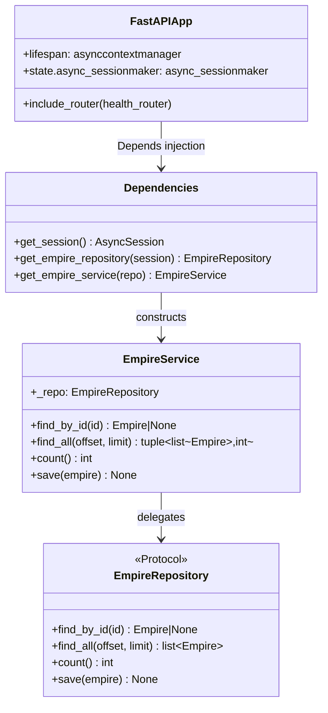
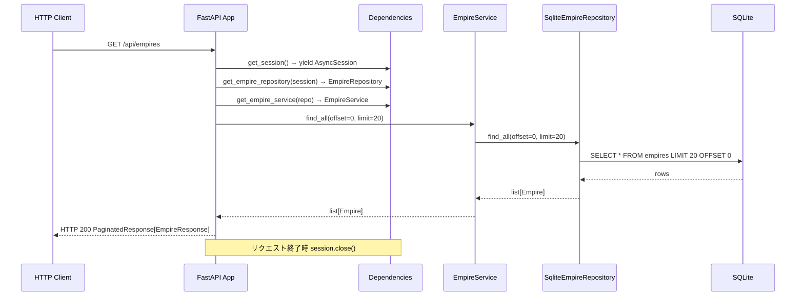

# 基本設計書

> feature: `http-api-foundation`
> 関連: [requirements.md](requirements.md) / [`docs/architecture/tech-stack.md`](../../architecture/tech-stack.md) / [`docs/features/empire-repository/`](../empire-repository/) 他 M2 feature

## 記述ルール（必ず守ること）

基本設計に**疑似コード・サンプル実装（python/ts/sh/yaml 等の言語コードブロック）を書かない**。
ソースコードと二重管理になりメンテナンスコストしか生まない。
必要なのは構造契約（クラス・モジュール・データの関係）であり、実装の細部は detailed-design.md で凍結する。

## モジュール構成

<!-- requirements.md の機能要件 ID を「どのモジュール（ファイル / ディレクトリ）で実現するか」にマッピングする。 -->
<!-- 配置先と責務を 1 行で書く。 -->

| 機能 ID | モジュール | ディレクトリ | 責務 |
|--------|----------|------------|------|
| REQ-HAF-001 | `app.py` | `backend/src/bakufu/interfaces/http/` | FastAPI インスタンス生成・lifespan・CORS・ルーター登録 |
| REQ-HAF-002 | `dependencies.py` | `backend/src/bakufu/interfaces/http/` | `get_session` / `get_*_repository` / `get_*_service` Depends factory 全集約 |
| REQ-HAF-003 | `error_handlers.py` | `backend/src/bakufu/interfaces/http/` | 例外種別→統一 ErrorResponse 変換ハンドラ登録 |
| REQ-HAF-004 | `schemas/common.py` | `backend/src/bakufu/interfaces/http/schemas/` | `PaginatedResponse[T]` / `ErrorResponse` / `ErrorDetail` |
| REQ-HAF-005 | `routers/health.py` | `backend/src/bakufu/interfaces/http/routers/` | `GET /health` |
| REQ-HAF-006 | `main.py` | `backend/src/bakufu/` | uvicorn エントリポイント |
| REQ-HAF-007 | `services/*.py` (7ファイル) | `backend/src/bakufu/application/services/` | 各 Aggregate thin CRUD service |

```
.
└── backend/
    └── src/
        └── bakufu/
            ├── main.py                                          # 新規: uvicorn エントリポイント
            ├── application/
            │   └── services/
            │       ├── empire_service.py                       # 新規: Empire thin CRUD
            │       ├── room_service.py                         # 新規: Room thin CRUD
            │       ├── workflow_service.py                     # 新規: Workflow thin CRUD
            │       ├── agent_service.py                        # 新規: Agent thin CRUD
            │       ├── directive_service.py                    # 新規: Directive thin CRUD
            │       ├── task_service.py                         # 新規: Task thin CRUD
            │       └── gate_service.py                         # 新規: Gate thin CRUD
            └── interfaces/
                └── http/
                    ├── app.py                                   # 新規: FastAPI factory
                    ├── dependencies.py                          # 新規: DI Depends factories
                    ├── error_handlers.py                        # 新規: 例外→ErrorResponse 変換
                    ├── schemas/
                    │   └── common.py                           # 新規: PaginatedResponse / ErrorResponse
                    └── routers/
                        └── health.py                           # 新規: GET /health
```

## クラス設計（概要）

<!-- mermaid classDiagram で概要を示す。詳細は detailed-design.md。 -->



**凝集のポイント**:
- `app.py` は FastAPI インスタンスの生成と登録のみ（DI factory は `dependencies.py` に集約）
- `dependencies.py` は全 Depends factory の唯一の置き場所。後続 Issue B〜G は `from interfaces.http.dependencies import get_empire_service` でインポートする
- service は Repository Protocol に依存（Clean Architecture Port 契約。具象 Sqlite*Repository に直接依存しない）

## 処理フロー

<!-- ユースケース単位で「ユーザー操作 → 内部処理 → 副作用 → 応答」を箇条書き。 -->

### ユースケース 1: アプリ起動シーケンス

1. `main.py` が環境変数から `BAKUFU_BIND_HOST` / `BAKUFU_BIND_PORT` を読み取り uvicorn を起動
2. uvicorn が ASGI アプリ（`app.py` の `create_app()` 戻り値）をロード
3. `lifespan` コンテキストマネージャが `AsyncEngine` 生成 → `async_sessionmaker` 生成 → `app.state.async_sessionmaker` に格納
4. 全ルーター（`health_router`）を `/api` prefix でインクルード
5. uvicorn が HTTP リクエスト受付開始

### ユースケース 2: 正常リクエスト処理（DI 連鎖）

1. HTTP リクエスト受信
2. FastAPI がルートハンドラを解決し、`Depends` 連鎖を実行
3. `get_session()` が `app.state.async_sessionmaker` から `AsyncSession` を yield（request スコープ）
4. `get_empire_repository(session)` が `SqliteEmpireRepository(session)` を生成
5. `get_empire_service(repo)` が `EmpireService(repo)` を生成
6. ルートハンドラが service を呼び出す。書き込み操作（POST/PUT/DELETE）の場合は router handler が `async with session.begin():` で Tx を開始してから service の `save()` を呼ぶ（Tx 境界は router handler が管理。service / repository 内で `commit()` / `rollback()` を呼ばない）。結果を Pydantic Response スキーマに変換して返す
7. request 終了時に `get_session()` の finally で session を close

### ユースケース 3: エラー処理（例外→統一レスポンス変換）

1. ルートハンドラ / service / repository で例外が raise される
2. FastAPI の exception handler が例外を捕捉
3. `error_handlers.py` の handler が `{"error":{"code":"...","message":"..."}}` に変換して HTTP レスポンスを返す
4. stdout/stderr にスタックトレースを出力（デバッグ用、レスポンス body には含めない）

## シーケンス図



## アーキテクチャへの影響

<!-- docs/architecture/ への変更が必要なら明記。Aggregate の追加・削除は domain-model.md を同 PR で更新する。 -->

- `docs/architecture/tech-stack.md` への変更: なし（FastAPI / uvicorn は採用済み。interfaces/ 層追加のみ）
- `docs/architecture/domain-model.md` への変更: なし（新規 Aggregate なし）
- 既存 feature への波及: M2 全 Repository（7本）が本 feature の `dependencies.py` から参照されるようになる。設計変更なし

## 外部連携

該当なし — 理由: 本 feature は FastAPI 基盤のみ。外部通信なし（LLM / Discord / GitHub は M5/M4 スコープ）

| 連携先 | 目的 | プロトコル | 認証 | タイムアウト / リトライ |
|-------|------|----------|-----|--------------------|
| （なし） | — | — | — | — |

## UX 設計

該当なし — 理由: 本 feature は backend infrastructure 基盤。UI を持たない

| シナリオ | 期待される挙動 |
|---------|------------|
| （なし） | — |

**アクセシビリティ方針**: 該当なし — 理由: 本 feature は HTTP API のみ（UI なし）

## セキュリティ設計

### 脅威モデル

| 想定攻撃者 | 攻撃経路 | 保護資産 | 対策 |
|-----------|---------|---------|------|
| **T1: 外部ネットワーク攻撃者** | 外部からの直接 HTTP アクセス | bakufu API 全体 | 既定 loopback `127.0.0.1` バインド（tech-stack.md §ネットワーク/TLS 方針）。`BAKUFU_BIND_HOST=0.0.0.0` は明示設定が必要 |
| **T2: CORS 経由の不正サイト** | 悪意のある Web ページから Fetch | bakufu API | `BAKUFU_CORS_ORIGINS` 環境変数で許可 Origin を明示制限。デフォルトは `http://localhost:5173` のみ |
| **T3: SQLi / インジェクション** | API パラメータ経由 | SQLite DB | SQLAlchemy ORM parameterized query のみ（raw SQL 禁止、M2 と同方針）。Pydantic v2 で入力バリデーション |
| **T4: エラーレスポンス情報漏洩** | 500 エラー時のスタックトレース露出 | サーバー内部実装 | エラーハンドラが内部情報を body から除外。ログは stdout のみ |

### OWASP Top 10 対応

| # | カテゴリ | 対応状況 |
|---|---------|---------|
| A01 | Broken Access Control | MVP は認証なし（loopback + シングルユーザー設計）。**アクセス制御の主体は `BAKUFU_BIND_HOST=127.0.0.1`（loopback バインドによる外部到達不能化）**。`BAKUFU_TRUST_PROXY=false` は `X-Forwarded-For` 等プロキシヘッダを無視する制御であり、外部アクセス遮断とは独立した防御（混同禁止）|
| A02 | Cryptographic Failures | loopback HTTP のみ。外部公開時は reverse proxy で TLS 終端（tech-stack.md 凍結済み）|
| A03 | Injection | SQLAlchemy ORM + Pydantic v2 バリデーションで対応 |
| A04 | Insecure Design | lifespan での確実な接続初期化。DI による session scope 明確化 |
| A05 | Security Misconfiguration | CORS 明示設定。デフォルト loopback。`BAKUFU_RELOAD=false` 本番既定 |
| A06 | Vulnerable Components | pyproject.toml pin + pip-audit CI（既存）|
| A07 | Auth Failures | MVP 対象外（シングルユーザー loopback 前提）|
| A08 | Data Integrity Failures | IntegrityError → HTTP 409 変換。UoW は application service 層が `async with session.begin()` で管理 |
| A09 | Logging Failures | 500 時はスタックトレースを stdout に出力。response body には含めない |
| A10 | SSRF | 該当なし — 理由: 外部通信なし（本 feature スコープ）|

## ER 図

該当なし — 理由: 本 feature は新規テーブルなし。既存 M2 スキーマを参照のみ

## エラーハンドリング方針

| 例外種別 | 処理方針 | ユーザーへの通知 |
|---------|---------|----------------|
| `HTTPException` | `{"error":{"code":"HTTP_<status>","message":detail}}` に変換 | MSG-HAF-001 相当 |
| `RequestValidationError` | HTTP 422 + `{"error":{"code":"VALIDATION_ERROR","message":"...","detail":[...]}}` | MSG-HAF-002 |
| `sqlalchemy.exc.IntegrityError`（UNIQUE 違反） | HTTP 409 + `{"error":{"code":"CONFLICT","message":"..."}}` | MSG-HAF-003 |
| `sqlalchemy.exc.IntegrityError`（FK 違反） | HTTP 409 + `{"error":{"code":"DEPENDENCY","message":"..."}}` | MSG-HAF-004 |
| `Exception`（未捕捉） | HTTP 500 + `{"error":{"code":"INTERNAL_ERROR","message":"Internal server error"}}`。stdout にスタックトレース出力 | MSG-HAF-001 |
