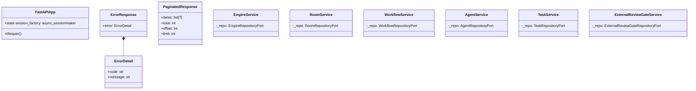
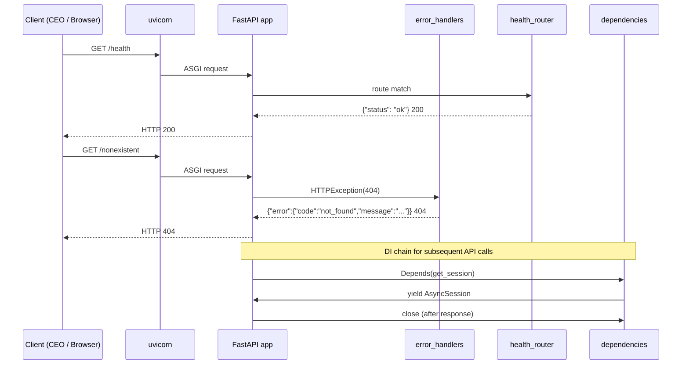

# 基本設計書

> feature: `http-api-foundation` / sub-feature: `http-api`
> 親業務仕様: [`../feature-spec.md`](../feature-spec.md)
> 関連: [`detailed-design.md`](detailed-design.md) / [`test-design.md`](test-design.md)

## 本書の役割

本書は **階層 3: モジュール（sub-feature http-api）の基本設計**（Module-level Basic Design）を凍結する。階層 1 の [`docs/design/architecture.md`](../../../design/architecture.md) で凍結された interfaces レイヤー構成を、本 sub-feature レベルに展開した細部を扱う。

機能要件（REQ-HAF-NNN）は本書 §モジュール契約 として統合される。本書は **構造契約と処理フローを凍結する** — 「どのモジュールが・どの順で・何を担うか」のレベルで凍結する。

**書くこと**:
- モジュール構成（機能 ID → ディレクトリ → 責務）
- モジュール契約（機能要件の入出力、業務記述）
- クラス設計（概要）
- 処理フロー（ユースケース単位）
- シーケンス図 / 脅威モデル / エラーハンドリング方針

**書かないこと**（後段の設計書へ追い出す）:
- メソッド呼び出しの細部 → [`detailed-design.md`](detailed-design.md) §確定事項
- 属性の型・制約 → [`detailed-design.md`](detailed-design.md) §クラス設計（詳細）
- MSG 確定文言 → [`detailed-design.md`](detailed-design.md) §MSG 確定文言表
- 疑似コード・サンプル実装（言語コードブロック）→ 実装 PR

## モジュール構成

| 機能 ID | モジュール | ディレクトリ | 責務 |
|---|---|---|---|
| REQ-HAF-001 | `app` | `interfaces/http/app.py` | FastAPI app 初期化・lifespan・CORS・error handler 登録 |
| REQ-HAF-002 | `health_router` | `interfaces/http/routers/health.py` | `GET /health` エンドポイント |
| REQ-HAF-003 | `error_handlers` | `interfaces/http/error_handlers.py` | 例外 → `{"error": {...}}` ErrorResponse 変換 |
| REQ-HAF-004 | `dependencies` | `interfaces/http/dependencies.py` | `get_session()` / `get_*_repository()` / `get_*_service()` DI ファクトリ |
| REQ-HAF-005 | `schemas_common` | `interfaces/http/schemas/common.py` | `ErrorResponse` / `PaginatedResponse[T]` 汎用 Pydantic モデル |
| REQ-HAF-006 | `application_services` | `application/services/` | thin CRUD service 骨格（Empire / Room / Workflow / Agent / Task / ExternalReviewGate）|
| REQ-HAF-007 | `main` | `main.py` | uvicorn エントリポイント |

```
backend/src/bakufu/
├── main.py                               # REQ-HAF-007: uvicorn entrypoint
├── interfaces/
│   └── http/
│       ├── app.py                        # REQ-HAF-001: FastAPI app + lifespan + CORS
│       ├── dependencies.py               # REQ-HAF-004: DI factories
│       ├── error_handlers.py             # REQ-HAF-003: exception → ErrorResponse
│       ├── schemas/
│       │   └── common.py                 # REQ-HAF-005: ErrorResponse / PaginatedResponse
│       └── routers/
│           └── health.py                 # REQ-HAF-002: GET /health
└── application/
    └── services/
        ├── __init__.py
        ├── empire_service.py             # REQ-HAF-006: EmpireService skeleton
        ├── room_service.py               # REQ-HAF-006: RoomService skeleton
        ├── workflow_service.py           # REQ-HAF-006: WorkflowService skeleton
        ├── agent_service.py              # REQ-HAF-006: AgentService skeleton
        ├── task_service.py               # REQ-HAF-006: TaskService skeleton
        └── external_review_gate_service.py  # REQ-HAF-006: ExternalReviewGateService skeleton（Issue #61 で approve / reject / cancel 等を追加）
```

## モジュール契約（機能要件）

各 REQ-HAF-NNN は親 [`feature-spec.md §5`](../feature-spec.md) ユースケース UC-HAF-NNN と対応する（孤児要件なし）。

### REQ-HAF-001: FastAPI アプリ初期化・lifespan・CORS

| 項目 | 内容 |
|---|---|
| 入力 | 環境変数 `BAKUFU_ALLOWED_ORIGINS`（未設定時 `["http://localhost:5173"]`）/ persistence-foundation の `AsyncEngine` |
| 処理 | lifespan コンテキストで session factory を起動時に初期化し `app.state.session_factory` に保持する。シャットダウン時に engine を dispose する。CORS ミドルウェアを許可 Origin で登録する。error handler を登録する |
| 出力 | FastAPI app インスタンス（`app.state.session_factory` 設定済み）|
| エラー時 | engine 初期化失敗 → startup 時に例外を伝播させてプロセスを異常終了させる（Fail Fast）|

**紐付く UC**: UC-HAF-001, UC-HAF-004

### REQ-HAF-002: `GET /health` エンドポイント

| 項目 | 内容 |
|---|---|
| 入力 | なし（認証不要、loopback バインド前提）|
| 処理 | 固定レスポンスを返す（DB チェック等の追加処理なし。bakufu プロセスが応答できていることのみを確認）|
| 出力 | HTTP 200, Body `{"status": "ok"}` |
| エラー時 | 該当なし（固定レスポンスのため、例外の余地なし）|

**紐付く UC**: UC-HAF-001

### REQ-HAF-003: 例外 → ErrorResponse 変換

| 項目 | 内容 |
|---|---|
| 入力 | FastAPI / Starlette が発火する例外（`HTTPException` / `RequestValidationError` / `IntegrityError` / ハンドルされない `Exception`）|
| 処理 | 例外種別に応じて HTTP ステータスコードとエラーコード文字列を決定し、`{"error": {"code": str, "message": str}}` 形式で返す。スタックトレースを含めない |
| 出力 | `ErrorResponse` 形式の JSON レスポンス（404 / 422 / 409 / 500 + `{"error": {"code": ..., "message": ...}}`）|
| エラー時 | error handler 自体が例外を起こした場合は `500 internal_error` にフォールバック（多重障害時の Fail Secure）|

**紐付く UC**: UC-HAF-002

### REQ-HAF-004: 依存注入ファクトリ

| 項目 | 内容 |
|---|---|
| 入力 | `Request`（`app.state.session_factory` へのアクセス）|
| 処理 | `get_session()` は `async with session_factory()` で `AsyncSession` を yield し、リクエスト完了後に close する。`get_*_repository()` は session を受け取り対応 Repository を構築して返す。`get_*_service()` は Repository を受け取り対応 Service を構築して返す |
| 出力 | `AsyncSession` / 各 Repository インスタンス / 各 Service インスタンス |
| エラー時 | セッション取得失敗 → 例外を伝播（catch しない。境界エラーハンドラが 500 に変換）|

**紐付く UC**: UC-HAF-004

### REQ-HAF-005: 汎用 Pydantic スキーマ

| 項目 | 内容 |
|---|---|
| 入力 | ジェネリック型パラメータ `T`（`PaginatedResponse[T]`）、エラーコードと message 文字列（`ErrorResponse`）|
| 処理 | `ErrorResponse` は `{"error": {"code": str, "message": str}}` 構造を Pydantic モデルとして定義する。`PaginatedResponse[T]` は `{"items": list[T], "total": int, "offset": int, "limit": int}` 構造とする |
| 出力 | Pydantic モデルクラス（後続 router が import して使用）|
| エラー時 | 該当なし（スキーマ定義のため実行時エラーなし）|

**紐付く UC**: UC-HAF-002, UC-HAF-003

### REQ-HAF-006: Application Service 骨格

| 項目 | 内容 |
|---|---|
| 入力 | 対応 Repository Port（`EmpireRepositoryPort` 等）|
| 処理 | 各 Service クラスは `__init__` で Repository を受け取り `self._repo` に保持する。後続 API PR が CRUD メソッドを追記する。本 PR ではクラス宣言と `__init__` のみを実装（空骨格）|
| 出力 | Service インスタンス（後続 PR が肉付け）|
| エラー時 | 該当なし（骨格のため、実行時ロジックなし）|

**紐付く UC**: UC-HAF-004

**ExternalReviewGateService の拡張（Issue #61）**: `external_review_gate_service.py` は本 PR で骨格定義のみ。Issue #61（M3）で `approve` / `reject` / `cancel` / `find_pending_for_reviewer` / `find_by_task` の全メソッドを肉付けする（[`docs/features/external-review-gate/http-api/basic-design.md`](../../external-review-gate/http-api/basic-design.md) 前提 P-2 参照）。

### REQ-HAF-007: uvicorn エントリポイント

| 項目 | 内容 |
|---|---|
| 入力 | 環境変数 `BAKUFU_BIND_HOST`（既定 `127.0.0.1`）/ `BAKUFU_BIND_PORT`（既定 `8000`）|
| 処理 | `uvicorn.run()` で FastAPI app を起動する |
| 出力 | uvicorn プロセス起動（HTTP リスナー）|
| エラー時 | バインドアドレス占有 → uvicorn が例外を発火してプロセス異常終了（Fail Fast）|

**紐付く UC**: UC-HAF-001

## ユーザー向けメッセージ一覧

| ID | 種別 | メッセージ（要旨） | 表示条件 |
|---|---|---|---|
| MSG-HAF-001 | エラー | `not_found` — リソースが存在しない | HTTP 404 時 |
| MSG-HAF-002 | エラー | `validation_error` — リクエストのバリデーション失敗 | HTTP 422 / Pydantic `RequestValidationError` 時 |
| MSG-HAF-003 | エラー | `internal_error` — サーバー内部エラー | ハンドルされない例外（500）時 |
| MSG-HAF-004 | エラー | `forbidden` — CSRF Origin 検証失敗 | Origin ヘッダが許可一覧外（403）時 |
| MSG-HAF-005 | 成功 | `{"status": "ok"}` | `GET /health` 正常応答時 |

各メッセージの確定文言は [`detailed-design.md §MSG 確定文言表`](detailed-design.md) で凍結する。

## 依存関係

| 区分 | 依存 | バージョン方針 | 備考 |
|---|---|---|---|
| ランタイム | Python 3.12+ | `pyproject.toml` | 既存 |
| 外部ライブラリ | FastAPI | `pyproject.toml` | 既存 |
| 外部ライブラリ | uvicorn | `pyproject.toml` | 既存 |
| 外部ライブラリ | Pydantic v2 | `pyproject.toml` | 既存 |
| 外部ライブラリ | SQLAlchemy 2.x async | `pyproject.toml` | persistence-foundation から継承 |
| feature 依存 | `persistence-foundation` | — | `AsyncEngine` / session factory 基盤 |
| feature 依存 | M1 domain / M2 repository | — | application service が参照する Repository Port |

## クラス設計（概要）



**凝集のポイント**:
- `ErrorResponse` / `ErrorDetail` は `schemas/common.py` に閉じ、全 router が import する。error handler は `ErrorResponse` を組み立てるだけで、HTTPException の変換ロジックを持つ
- Service 骨格は Repository Port にのみ依存する（`AsyncSession` を直接参照しない）
- lifespan / CORS / error handler 登録は `app.py` に集約し、router は業務ロジックのみを担う（責務の単純明確化）

## 処理フロー

### ユースケース 1: `GET /health` — 稼働確認（UC-HAF-001）

1. CEO がブラウザで `GET /health` を送信する
2. uvicorn が FastAPI app に渡す
3. `health_router` が固定 Body `{"status": "ok"}` と HTTP 200 を返す

### ユースケース 2: エラーレスポンス変換（UC-HAF-002）

1. クライアントが存在しないパスへ GET する
2. Starlette が `HTTPException(404)` を発火する
3. `error_handlers.http_exception_handler` が `{"error": {"code": "not_found", "message": "..."}}` + HTTP 404 を返す

### ユースケース 3: DI セッション管理（UC-HAF-004）

1. 後続 router が `Depends(get_session)` を宣言する
2. FastAPI が `get_session()` を呼ぶ; `async with session_factory()` で `AsyncSession` を yield する
3. router がセッションを Repository に渡して業務処理を実行する
4. レスポンス後 FastAPI が DI の後処理を実行 → `AsyncSession.close()` が呼ばれる

## シーケンス図



## アーキテクチャへの影響

- [`docs/design/architecture.md`](../../../design/architecture.md) への変更: interfaces レイヤー詳細説明を追記（本 PR で更新）
- [`docs/design/tech-stack.md`](../../../design/tech-stack.md) への変更: なし（FastAPI / uvicorn は既存確定技術）
- 既存 feature への波及: なし（本 feature は新規モジュールの追加のみ）

## 外部連携

| 連携先 | 目的 | プロトコル | 認証 | タイムアウト / リトライ |
|---|---|---|---|---|
| persistence-foundation | SQLAlchemy `AsyncEngine` / session factory 取得 | 内部モジュール参照 | なし | なし（内部）|

## UX 設計

| シナリオ | 期待される挙動 |
|---|---|
| `GET /health` 正常応答 | `{"status": "ok"}` が即座に返る（DB アクセスなし）|
| `GET /openapi.json` | FastAPI が自動生成した OpenAPI 3.1 JSON を返す |
| エラー発生時 | `{"error": {"code": ..., "message": ...}}` の統一形式で返す（スタックトレースなし）|

**アクセシビリティ方針**: HTTP API のため HTML/DOM アクセシビリティは対象外。

## セキュリティ設計

### 脅威モデル

| 想定攻撃者 | 攻撃経路 | 保護資産 | 対策 |
|---|---|---|---|
| **T2: ブラウザ経由のローカル攻撃者（XSS / CSRF）** | 状態変更 API への CSRF 要求 | bakufu の業務データ（Task 不正起票等） | `Origin` ヘッダ検証（R1-4）。`Origin` が許可一覧外なら 403 Forbidden（MSG-HAF-004）|
| **T3: ネットワーク上の中間者** | HTTP 平文での盗聴 | Conversation / Deliverable 本文 | 既定 `127.0.0.1:8000` loopback バインド（R1-3）。外部公開は reverse proxy + TLS で終端 |
| **T3: ヘッダ偽装** | `X-Forwarded-For` 偽装でエラーレスポンスにクライアント情報を混入させる | 内部 IP アドレス | エラーレスポンスにリクエストヘッダ・IP を含めない（MSG 確定文言で管理）|
| **A09: Logging Failures** | 適用: application 層（各 Service）が業務操作完了時に audit_log に記録する責務を持つ。interfaces 層（router）は audit_log を直接出力しない（責務分離、application 層の申し送り事項）| — | — |

詳細な信頼境界は [`docs/design/threat-model.md`](../../../design/threat-model.md)。

### OWASP Top 10 (2021) 対応表

interfaces 層（HTTP API 最前線）として OWASP A01〜A10 の全項目を明示する。

| # | カテゴリ | interfaces 層での該当 / N/A 理由 | 対策 |
|---|---|---|---|
| A01 | Broken Access Control | **MVP は認証不要のシングルユーザー前提**（loopback バインドで物理的に局所化）。`/docs` / `/openapi.json` は loopback 上のみ公開し、外部公開は reverse proxy 側でアクセス制御する（`detailed-design.md §確定 H` 参照）| loopback バインド。reverse proxy 経由の外部公開時は Basic Auth / OIDC を reverse proxy 側で終端（Phase 2）|
| A02 | Cryptographic Failures | Cookie セッションは MVP 未使用のため Cookie 属性は対象外。TLS は reverse proxy で終端する | 既定 `127.0.0.1:8000` バインド。外部公開時は `BAKUFU_TRUST_PROXY=true` + reverse proxy + TLS 必須（`threat-model.md §A3`）|
| A03 | Injection | HTTP Body は Pydantic で検証済み。SQL は SQLAlchemy パラメータバインドで injection を回避。shell を呼ばない | `RequestValidationError` → `validation_error` 変換（REQ-HAF-003）。SQLAlchemy は全クエリでバインド変数を強制 |
| A04 | Insecure Design | 該当なし — interfaces 層は業務ロジックを持たない thin ファサード。不正な設計抽象はない | application 層への委譲 + error handler の単一責務設計 |
| A05 | Security Misconfiguration | CORS `allow_headers` に `Authorization` を含む理由: Phase 2 Bearer Token 認証の事前配線（MVP では使用しない）。ワイルドカード `*` は不使用。`allow_credentials=False` | `BAKUFU_ALLOWED_ORIGINS` で許可 Origin を明示管理。`allow_credentials=False` を確定 C で凍結 |
| A06 | Vulnerable / Outdated Components | FastAPI（最新版）: 2024-2025 時点での既知 CVE なし（https://security.snyk.io/package/pip/fastapi 確認済み）。uvicorn: 同確認済み | `pip-audit` + `osv-scanner` CI ジョブ（`dev-workflow` feature）で定期監査 |
| A07 | Identification / Auth Failures | MVP はシングルユーザー + loopback バインドで認証を OS ユーザー権限に委譲。マルチユーザー RBAC は Phase 2（YAGNI） | `threat-model.md §A07` 参照。MVP では認証なしを**意図的に**採用し、外部公開時は reverse proxy 側で Basic Auth / OIDC を終端 |
| A08 | Software / Data Integrity Failures | エラーレスポンスには業務データを含めない。DI 経由でのみ session / Repository を渡す（直接参照不可） | `msg` 確定文言（スタックトレース・内部変数名の非露出）。DI factory の単一配信経路 |
| A09 | Security Logging / Monitoring Failures | **適用**: application 層（各 Service）が業務操作完了時に `audit_log` に記録する責務を持つ。interfaces 層（router）は `audit_log` を直接出力しない（責務分離、application 層の申し送り事項）| application/services/ の各 Service が CRUD 完了後に audit_log を記録（後続 Issue B〜G で実装）|
| A10 | Server-Side Request Forgery | http-api-foundation は外部 URL を受け付ける機能を持たない。SSRF の攻撃面が存在しない | 該当なし（MVP では任意 URL fetch 機能を含めない。`threat-model.md §A10` 参照）|

## ER 図

該当なし（http-api-foundation は DB テーブルを新規作成しない。persistence-foundation が管理するテーブルを session 経由で参照するのみ）。

## エラーハンドリング方針

| 例外種別 | 処理方針 | ユーザーへの通知 |
|---|---|---|
| `HTTPException(404)` | Starlette の 404 を `not_found` エラーコードに変換 | MSG-HAF-001 |
| `RequestValidationError` | Pydantic バリデーション失敗を `validation_error` に変換。detail は message フィールドに含める | MSG-HAF-002 |
| ハンドルされない `Exception` | スタックトレースをログに記録し、`internal_error` を返す（詳細をクライアントに露出しない） | MSG-HAF-003 |
| Origin 不一致 | CSRF ミドルウェア / ハンドラが `forbidden` を返す | MSG-HAF-004 |
