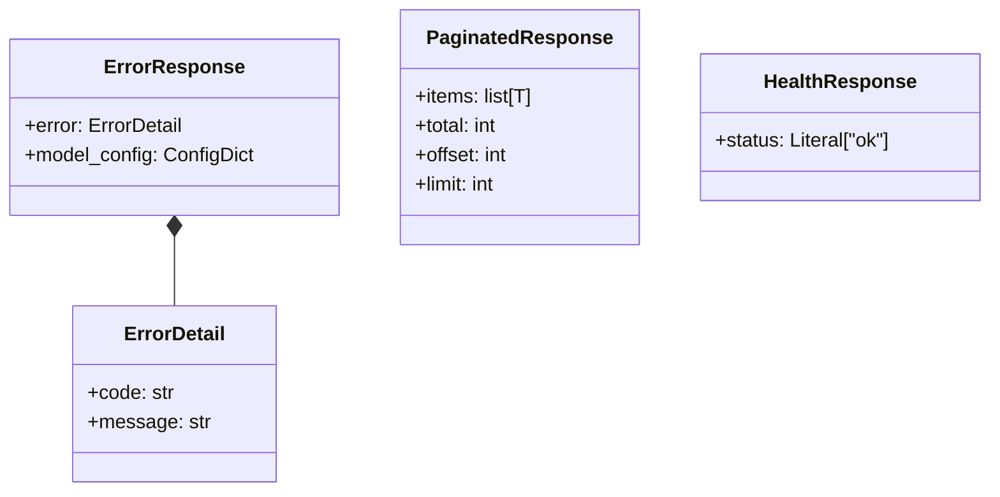

# 詳細設計書

> feature: `http-api-foundation` / sub-feature: `http-api`
> 親業務仕様: [`../feature-spec.md`](../feature-spec.md)
> 関連: [`basic-design.md`](basic-design.md)

## 本書の役割

本書は **階層 3: モジュール（sub-feature http-api）の詳細設計**（Module-level Detailed Design）を凍結する。[`basic-design.md`](basic-design.md) で凍結されたモジュール基本設計を、実装直前の **構造契約・確定文言・API 詳細** として詳細化する。実装 PR は本書を改変せず参照する。設計変更が必要なら本書を先に更新する PR を立てる。

**書くこと**:
- 親 [`feature-spec.md §7`](../feature-spec.md) 確定 R1-X を実装方針として展開する `§確定 A` / `§確定 B` ...
- クラス設計（詳細）—属性・型・制約
- MSG 確定文言（実装者が改変できない契約）
- API エンドポイント詳細（スキーマ・ステータスコード）

**書かないこと**:
- ソースコードそのもの（疑似コード・サンプル実装を含む）→ 実装 PR
- 業務ルールの採用根拠の議論 → 親 `feature-spec.md §7`

## クラス設計（詳細）

### Pydantic モデル: `ErrorDetail`

| 属性 | 型 | 制約 | 意図 |
|---|---|---|---|
| `code` | `str` | 必須、非空文字列 | エラー種別を機械的に判定できるコード（`not_found` / `validation_error` / `internal_error` / `forbidden`）|
| `message` | `str` | 必須 | 人間可読なエラー説明（スタックトレースを含まない）|

**不変条件**:
- `code` は事前定義された文字列定数のいずれか（確定 A 参照）
- `message` にファイルパス・スタックトレース・内部変数名を含めない

### Pydantic モデル: `ErrorResponse`

| 属性 | 型 | 制約 | 意図 |
|---|---|---|---|
| `error` | `ErrorDetail` | 必須 | ネストした error オブジェクト（クライアントが `response.error.code` でアクセスする）|

**model_config**: `extra="forbid"` を設定する（不明フィールドの混入を防ぐ）。

### Pydantic モデル: `PaginatedResponse[T]`

| 属性 | 型 | 制約 | 意図 |
|---|---|---|---|
| `items` | `list[T]` | 必須 | ページ内アイテムリスト |
| `total` | `int` | 必須、>= 0 | フィルタ後の全件数 |
| `offset` | `int` | 必須、>= 0 | 取得開始位置 |
| `limit` | `int` | 必須、>= 1 | 1 ページの最大件数 |

### Pydantic モデル: `HealthResponse`

| 属性 | 型 | 制約 | 意図 |
|---|---|---|---|
| `status` | `Literal["ok"]` | 必須、固定値 `"ok"` | pyright strict のため Literal 型で定義する |

### Application Service 骨格: `EmpireService` / `RoomService` / `WorkflowService` / `AgentService` / `TaskService` / `ExternalReviewGateService`

各 Service は以下の共通構造を持つ（後続 PR で CRUD メソッドを追記）:

| 属性 / メソッド | 型 | 制約 | 意図 |
|---|---|---|---|
| `__init__(self, repo: <Aggregate>RepositoryPort)` | — | `repo` は Port インターフェース型 | DI による Repository 注入。具体型（ORM 実装）に依存しない |

**不変条件**:
- Service は `AsyncSession` を直接参照しない（Clean Architecture の Port パターン）
- Service は domain 層の Aggregate / VO を直接 import してよい
- Service から interfaces 層（router / schemas）への import は禁止（依存方向: interfaces → application → domain）

## 確定事項（先送り撤廃）

### 確定 A: エラーコード定数を `error_handlers.py` に定数として宣言する

親 `feature-spec.md §7 R1-1` の実装方針。`ErrorCode` として以下の文字列定数を宣言する:

| 定数名 | 値 | 使用 HTTP ステータス |
|---|---|---|
| `NOT_FOUND` | `"not_found"` | 404 |
| `VALIDATION_ERROR` | `"validation_error"` | 422 |
| `INTERNAL_ERROR` | `"internal_error"` | 500 |
| `FORBIDDEN` | `"forbidden"` | 403 |

### 確定 B: lifespan は `AsyncEngine` を `app.state.engine` に保持し、`async_sessionmaker` を `app.state.session_factory` に保持する

親 `feature-spec.md §7 R1-2` の実装方針。`get_session()` は `app.state.session_factory` を参照する。`app.state.engine` は shutdown 時の `await engine.dispose()` でのみ使用する。

`app.state` に保持するオブジェクト:

| キー | 型 | 設定タイミング |
|---|---|---|
| `session_factory` | `async_sessionmaker[AsyncSession]` | lifespan startup |
| `engine` | `AsyncEngine` | lifespan startup（dispose 用）|

### 確定 C: CORS ミドルウェアは `CORSMiddleware` を使用する。許可 method は `["GET", "POST", "PUT", "PATCH", "DELETE", "OPTIONS"]`、許可ヘッダは `["Content-Type", "Authorization"]`

親 `feature-spec.md §7 R1-3` の実装方針。`allow_origins` は `BAKUFU_ALLOWED_ORIGINS` 環境変数をカンマ区切りでパースする。未設定時は `["http://localhost:5173"]`。`allow_credentials=False`（MVP では Cookie セッション未使用）。

### 確定 D: CSRF Origin 検証は `error_handlers.py` に Starlette middleware として実装する

親 `feature-spec.md §7 R1-4` の実装方針。`POST` / `PUT` / `PATCH` / `DELETE` メソッドのリクエストに対し、`Origin` ヘッダが存在しない場合または許可 Origin 一覧に含まれない場合は `403 Forbidden` を返す。`GET` / `OPTIONS` / `HEAD` は検証をスキップする。

### 確定 E: `get_session()` は `async with session_factory() as session: yield session` パターンを使用する

`try/except/finally` の明示的な close を書かない。`async with` が SQLAlchemy の `AsyncSession` context manager として close を保証する。

### 確定 F: application/services/ の各 Service クラスは `__init__` のみ定義し、メソッドは後続 PR で追記する

pyright strict 対応: 空クラスにならないよう `__init__` にデフォルトの docstring を付ける。メソッドのスタブ（`...` / `raise NotImplementedError`）は書かない（後続 PR が追記するメソッドシグネチャが先に凍結されていないため、スタブを書くと設計書との二重管理になる）。

### 確定 G: `main.py` は `if __name__ == "__main__"` ガードを設ける

`uvicorn.run()` を直接呼ぶ経路は `if __name__ == "__main__"` 内のみ。テストは `app` インスタンスを直接 import し、`httpx.AsyncClient(app=app)` で ASGI として起動する（uvicorn プロセスを立てない）。

## 設計判断の補足

### なぜ `{"error": {"code": ..., "message": ...}}` の 2 階層ネストか

- FastAPI デフォルトの `{"detail": ...}` は `detail` が `str` にも `list` にもなりうる（Pydantic validation error は `list[ValidationErrorDetail]` を返す）。クライアントが `typeof response.detail` を判定する必要があり、パースが不安定
- `{"error": {"code": ..., "message": ...}}` の形式はコードが常に文字列定数で機械判定可能。`message` は常に `str`
- 参考: [Microsoft REST API Guidelines](https://github.com/Microsoft/api-guidelines/blob/vNext/Guidelines.md#7102-error-condition-responses) の error オブジェクト形式に準拠

### なぜ `PaginatedResponse` を `offset` / `limit` ベースにするか

- MVP では Aggregate 数が少なく、カーソルベースのページネーションは YAGNI
- `offset` / `limit` は SQL の `OFFSET` / `LIMIT` と直接対応し、後続 Repository 実装が自然に使える
- 将来的にカーソルベースへの移行が必要な場合は本モデルを拡張する（フィールド追加のみ）

### なぜ `app.state` に session factory を保持するか

- FastAPI では `Depends()` が `Request` にアクセスできるため、`get_session()` が `request.app.state.session_factory` を参照できる
- グローバル変数（モジュールレベル変数）を使うと、テスト並列実行時にテスト間でセッションファクトリが共有されてしまう
- `app.state` はアプリインスタンス単位で独立するため、テストで `TestClient(app)` を複数インスタンス生成しても安全

## ユーザー向けメッセージの確定文言

[`basic-design.md §ユーザー向けメッセージ一覧`](basic-design.md) で ID のみ定義した MSG を、本書で正確な文言として凍結する。実装者が勝手に改変できない契約。変更は本書の更新 PR のみで許可。

### プレフィックス統一

HTTP API の JSON レスポンスには `[FAIL]` / `[OK]` プレフィックスを使用しない（REST API 規約に合わない）。`code` フィールドがプレフィックスの役割を担う。

### MSG 確定文言表

| ID | 出力先 | `code` | `message` |
|---|---|---|---|
| MSG-HAF-001 | JSON レスポンス Body | `not_found` | `"Resource not found."` |
| MSG-HAF-002 | JSON レスポンス Body | `validation_error` | `"Request validation failed: {detail}"` （`{detail}` は Pydantic の `RequestValidationError.errors()` の要約文字列）|
| MSG-HAF-003 | JSON レスポンス Body | `internal_error` | `"An internal server error occurred."` |
| MSG-HAF-004 | JSON レスポンス Body | `forbidden` | `"CSRF check failed: Origin not allowed."` |
| MSG-HAF-005 | JSON レスポンス Body | — | `{"status": "ok"}` （`ErrorResponse` 形式ではなく `HealthResponse` 形式）|

**`message` 中に含めてはいけない情報**:
- スタックトレース
- ファイルパス（`/home/...` / `/app/...` 等）
- 内部変数名・クラス名（pyright 型名等）
- DB テーブル名・カラム名

## データ構造（永続化キー）

該当なし（http-api-foundation は DB テーブルを新規作成しない）。

## API エンドポイント詳細

### `GET /health`

| 項目 | 内容 |
|---|---|
| 用途 | bakufu プロセスの稼働確認 |
| 認証 | なし（loopback バインド前提）|
| リクエスト Body | なし |
| 成功レスポンス | `200 OK` — `{"status": "ok"}` |
| 失敗レスポンス | 該当なし（固定レスポンス）|
| 副作用 | なし |

### `GET /openapi.json`

| 項目 | 内容 |
|---|---|
| 用途 | OpenAPI 3.1 スキーマ取得（FastAPI 自動生成）|
| 認証 | なし |
| リクエスト Body | なし |
| 成功レスポンス | `200 OK` — OpenAPI JSON |
| 失敗レスポンス | 該当なし |
| 副作用 | なし |

### `GET /docs`

| 項目 | 内容 |
|---|---|
| 用途 | Swagger UI（FastAPI 自動生成、開発時のみ利用）|
| 認証 | なし |
| リクエスト Body | なし |
| 成功レスポンス | `200 OK` — HTML |
| 失敗レスポンス | 該当なし |
| 副作用 | なし |

## 出典・参考

- FastAPI lifespan: https://fastapi.tiangolo.com/advanced/events/#lifespan
- FastAPI Depends: https://fastapi.tiangolo.com/tutorial/dependencies/
- FastAPI Custom Exception Handlers: https://fastapi.tiangolo.com/tutorial/handling-errors/#install-custom-exception-handlers
- Pydantic v2 model_config: https://docs.pydantic.dev/latest/concepts/config/
- SQLAlchemy 2.x Async: https://docs.sqlalchemy.org/en/20/orm/extensions/asyncio.html
- Microsoft REST API Guidelines (error format): https://github.com/Microsoft/api-guidelines/blob/vNext/Guidelines.md#7102-error-condition-responses
- OWASP CSRF Prevention Cheat Sheet: https://cheatsheetseries.owasp.org/cheatsheets/Cross-Site_Request_Forgery_Prevention_Cheat_Sheet.html
