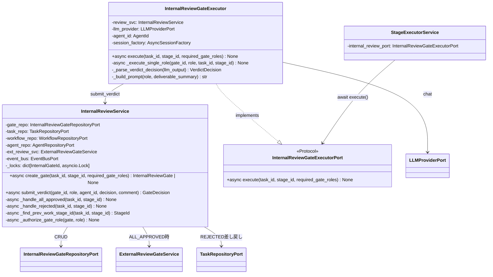
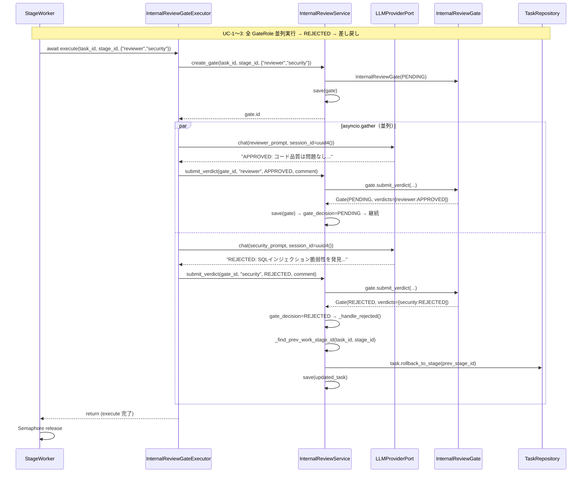

# 基本設計書 — internal-review-gate / application

> feature: `internal-review-gate` / sub-feature: `application`
> 親業務仕様: [`../feature-spec.md`](../feature-spec.md)
> 関連: [`../domain/basic-design.md`](../domain/basic-design.md) / [`../repository/basic-design.md`](../repository/basic-design.md) / [`../../stage-executor/application/detailed-design.md §確定 G`](../../stage-executor/application/detailed-design.md)（InternalReviewGateExecutorPort 定義元）
> 担当 Issue: [#164 feat(M5-B): InternalReviewGate infrastructure実装](https://github.com/bakufu-dev/bakufu/issues/164)

## 本書の役割

本書は **階層 3: internal-review-gate / application の基本設計**（Module-level Basic Design）を凍結する。M5-B の核心である「INTERNAL_REVIEW Stage の並列 LLM 実行・判定集約・Task 連携」の application サービス設計と infrastructure 実装クラス（`InternalReviewGateExecutor`）を確定する。

**書くこと**:
- モジュール構成（application services + infrastructure/reviewers）
- モジュール契約（機能要件 REQ-IRG-A001〜REQ-IRG-A004）
- クラス設計（概要）
- 処理フロー / シーケンス図 / セキュリティ設計

**書かないこと**（後段へ追い出す）:
- 属性の型・制約 → [`detailed-design.md §確定事項`](detailed-design.md)
- MSG 確定文言 → [`detailed-design.md §MSG 確定文言表`](detailed-design.md)
- GateRole prompt 確定文言 → [`detailed-design.md §確定 E`](detailed-design.md)

## 記述ルール（必ず守ること）

基本設計に **疑似コード・サンプル実装（python/ts/sh/yaml 等の言語コードブロック）を書かない**。
ソースコードと二重管理になりメンテナンスコストしか生まない。

## §モジュール契約（機能要件）

> 本 §は親 [`feature-spec.md`](../feature-spec.md) §9 受入基準 #8〜#10 および §7 業務ルール R1-D〜R1-F と紐付く。

| 要件 ID | 要件 | 入力 | 処理 | 出力 | エラー時 |
|--------|------|------|------|------|---------|
| REQ-IRG-A001 | `InternalReviewService` が Gate の CRUD と downstream 連携を担う | task_id / stage_id / required_gate_roles（Gate 生成時）; gate_id / role / agent_id / decision / comment（Verdict 提出時）| Gate 生成（required_gate_roles が空集合なら生成しない）/ Verdict 提出→ Gate 保存 / Gate 決定後に ALL_APPROVED → Task 次フェーズ / REJECTED → Task 差し戻し連携 | `InternalReviewGate`（生成時）/ `GateDecision`（Verdict 提出後）| `InternalReviewGateNotFoundError`（Gate 不在）/ `InternalReviewGateInvariantViolation`（domain 不変条件違反、application 層に伝播）/ `TaskNotFoundError` |
| REQ-IRG-A002 | `InternalReviewGateExecutor` が `InternalReviewGateExecutorPort` を実装する | task_id / stage_id / required_gate_roles（StageExecutorService から委譲）| 各 GateRole に対して `LLMProviderPort.chat()` を `asyncio.gather()` で並列呼び出し → LLM 出力から `VerdictDecision` を解析 → `InternalReviewService.submit_verdict()` を逐次呼び出し → 全 Verdict 提出完了まで `await`（long-running coroutine）| None（Gate ALL_APPROVED / REJECTED に達した時点で処理終了、Task 連携は `InternalReviewService.submit_verdict()` が実行）| LLM エラー → `LLMProviderError` 系例外を送出（StageExecutorService REQ-ME-002 が Task.block() に帰着させる）|
| REQ-IRG-A003 | `InternalReviewService.submit_verdict()` が Gate 決定後の downstream 連携を実行する | gate_id / role / agent_id / decision / comment | domain `gate.submit_verdict()` → Gate 保存 → gate_decision 確認 → ALL_APPROVED: `ExternalReviewGateService.create()` 呼び出し（または次 Stage 遷移）/ REJECTED: DAG traversal で前段 Stage ID 算出 → `TaskRepository.save(task.rollback_to_stage(prev_stage_id))` | `GateDecision` | domain 不変条件違反は `InternalReviewGateInvariantViolation` で上位伝播 |
| REQ-IRG-A004 | 前段 Stage ID の決定は Workflow DAG traversal で行う（application 層責務）| task_id / stage_id（REJECTED が確定した INTERNAL_REVIEW Stage）| `WorkflowRepository.find_by_id(workflow_id)` で Workflow を取得 → `Stage.kind == WORK` の直前 Stage を `transitions` DAG で逆引き → 前段 WORK Stage の `stage_id` を確定 | `StageId`（差し戻し先）| 前段 WORK Stage が存在しない場合は設計バグ（`IllegalWorkflowStructureError`）|

**依存先**:
- `InternalReviewGateRepositoryPort`（repository sub-feature で定義、DI 注入）
- `LLMProviderPort`（`application/ports/llm_provider_port.py`、M5-A 定義済み）
- `InternalReviewGateExecutorPort`（`application/ports/internal_review_gate_executor_port.py`、M5-A 定義済み）
- `ExternalReviewGateService`（M3 で実装済み、ALL_APPROVED 後の ExternalReviewGate 生成委譲）
- `TaskRepository` / `WorkflowRepository`（M3 で実装済み）
- `EventBusPort`（M4 で定義済み、Gate 状態変化イベント発行）
- `InternalReviewGate` Aggregate / `GateDecision` / `VerdictDecision`（domain M1 実装済み）

## モジュール構成

| 機能 ID | モジュール | ディレクトリ | 責務 |
|--------|----------|------------|------|
| REQ-IRG-A001, A003 | `InternalReviewService` | `backend/src/bakufu/application/services/internal_review_service.py` | Gate CRUD + Verdict 集約 + downstream 連携（ALL_APPROVED / REJECTED 後の Task・ExternalReviewGate 操作）|
| REQ-IRG-A002 | `InternalReviewGateExecutor` | `backend/src/bakufu/infrastructure/reviewers/internal_review_gate_executor.py` | `InternalReviewGateExecutorPort` 実装（§確定 G に従い infrastructure 配置）。並列 LLM 実行・VerdictDecision 解析・`InternalReviewService.submit_verdict()` 呼び出し |
| REQ-IRG-A002 | GateRole プロンプトテンプレート | `backend/src/bakufu/infrastructure/reviewers/prompts/` | `default.py`（汎用 GateRole テンプレート）/ 将来の role 別テンプレートの配置先 |
| REQ-IRG-A004 | DAG traversal ロジック | `backend/src/bakufu/application/services/internal_review_service.py` の private method | Workflow DAG を逆引きして前段 WORK Stage を特定 |

```
ディレクトリ構造（本 sub-feature で追加・変更されるファイル）:

.
├── backend/
│   ├── src/
│   │   └── bakufu/
│   │       ├── application/
│   │       │   └── services/
│   │       │       └── internal_review_service.py          # 新規: InternalReviewService
│   │       └── infrastructure/
│   │           └── reviewers/
│   │               ├── __init__.py                         # 新規
│   │               ├── internal_review_gate_executor.py    # 新規: InternalReviewGateExecutorPort 実装
│   │               └── prompts/
│   │                   ├── __init__.py                     # 新規
│   │                   └── default.py                      # 新規: 汎用 GateRole テンプレート
│   └── tests/
│       ├── integration/
│       │   └── test_internal_review_gate_application.py    # 新規: IT（InMemoryRepository + LLM mock）
│       └── unit/
│           ├── test_internal_review_service.py             # 新規: UT（InternalReviewService）
│           └── test_internal_review_gate_executor.py       # 新規: UT（Executor + prompt parsing）
└── docs/
    └── features/
        └── internal-review-gate/
            └── application/                                 # 本 sub-feature 設計書 3 本
```

## クラス設計（概要）



**凝集のポイント**:
- `InternalReviewGateExecutor` は infrastructure 層に置き、`InternalReviewGateExecutorPort`（application 層 Protocol）を構造的部分型で実装する（§確定 G）
- `InternalReviewService` は application 層の薄いファサード。業務ロジックは domain Aggregate に委譲し、downstream 連携を担う
- LLM 呼び出し（`execute_single_role`）と Verdict 提出（`InternalReviewService.submit_verdict`）は分離。Executor が LLM 結果を解析し Service に渡す（Tell, Don't Ask）
- 並列実行（`asyncio.gather`）と逐次集約（`submit_verdict`）の責務を Executor が保持
- GateRole ごとの session_id は互いに独立した UUID v4（§確定 A）。同一 Task の会話継続は不要（GateRole 審査は独立判断が本質、feature-spec.md R1-B）

## 処理フロー

### ユースケース 1: INTERNAL_REVIEW Stage 到達 → Gate 生成 → 並列 LLM 実行

1. `StageExecutorService.dispatch_stage()` が Stage.kind = INTERNAL_REVIEW を検知
2. `StageWorker` が Semaphore を acquire したまま `await internal_review_port.execute(task_id, stage_id, required_gate_roles)` を呼ぶ
3. `InternalReviewGateExecutor.execute()` が起動:
   - `InternalReviewService.create_gate(task_id, stage_id, required_gate_roles)` で Gate を DB に永続化
   - `asyncio.gather(*[_execute_single_role(gate.id, role, ...) for role in required_gate_roles])` で全 GateRole を並列呼び出し
4. 各 `_execute_single_role(gate_id, role)` が:
   - 独立した `session_id=uuid4()` で `LLMProviderPort.chat(prompt, session_id)` を呼ぶ
   - LLM 出力を `_parse_verdict_decision()` で `VerdictDecision` に変換（APPROVED / REJECTED の 2 値、ambiguous → REJECTED、§確定 D）
   - `InternalReviewService.submit_verdict(gate_id, role, agent_id, decision, comment)` を呼ぶ
5. `asyncio.gather()` が全完了（または REJECTED で早期終了、§確定 B）を待機
6. `execute()` が return → `StageWorker` が Semaphore を release

### ユースケース 2: 全 GateRole APPROVED → ExternalReviewGate 生成

1. 最後の APPROVED Verdict を `submit_verdict()` → `gate_decision == ALL_APPROVED`
2. `InternalReviewService._handle_all_approved(task_id, stage_id)` を呼ぶ
3. `ExternalReviewGateService.create(task_id, stage_id, ...)` で ExternalReviewGate を生成（既存 Service に委譲、feature-spec.md §9 #8）
4. `EventBusPort.publish(InternalReviewGateDecidedEvent(..., decision=ALL_APPROVED))` で WebSocket 通知（M4 EventBus 経由）
5. `execute()` の `asyncio.gather()` が完了して return

### ユースケース 3: いずれかの GateRole が REJECTED → Task 差し戻し

1. 最初の REJECTED Verdict を `submit_verdict()` → `gate_decision == REJECTED`（即時遷移、feature-spec.md R1-E）
2. `InternalReviewService._handle_rejected(task_id, stage_id)` を呼ぶ
3. `_find_prev_work_stage_id(task_id, stage_id)` で Workflow DAG traversal → 前段 WORK Stage ID を算出
4. `TaskRepository.find_by_id(task_id)` → `task.rollback_to_stage(prev_stage_id)` → `TaskRepository.save(updated_task)` で Task を差し戻し
5. `EventBusPort.publish(InternalReviewGateDecidedEvent(..., decision=REJECTED))` で WebSocket 通知
6. 残りの GateRole の `asyncio.gather()` は `return_exceptions=True` で回収（他 GateRole を interrupt しない、§確定 B）
7. `execute()` が return → `StageExecutorService` が差し戻し済み Task を StageWorker に再キューする（M5-A の REQ-ME-006 は REJECTED 後の再キューを担う）

### ユースケース 4: LLM エラー → Task.block()

1. `_execute_single_role()` 内で `LLMProviderPort.chat()` が `LLMProviderError` 系例外を送出
2. `asyncio.gather(return_exceptions=True)` が例外を回収
3. `InternalReviewGateExecutor.execute()` が例外を再送出
4. `StageExecutorService` の REQ-ME-002 エラーハンドリングが `Task.block()` に帰着させる（M5-A の既存実装）

## シーケンス図



## アーキテクチャへの影響

- `docs/design/architecture.md`: `InternalReviewService`（application/services）、`InternalReviewGateExecutor`（infrastructure/reviewers 新規サブシステム）を追記（本 PR で同一コミット）
- `docs/features/stage-executor/application/detailed-design.md`: M5-A の `_NullInternalReviewGateExecutor` stub を `InternalReviewGateExecutor` に置き換えるスタブ除去は実装 PR の責務（設計書変更不要）
- 既存 feature への波及:
  - `StageExecutorService`: `InternalReviewGateExecutorPort` の DI 注入先を `_NullInternalReviewGateExecutor` → `InternalReviewGateExecutor` に変更（`infrastructure/bootstrap.py` の DI 配線）
  - `ExternalReviewGateService`（M3 実装済み）: `_handle_all_approved()` から呼び出すのみ、設計書変更なし

## 外部連携

| 連携先 | 目的 | プロトコル | 認証 | タイムアウト / リトライ |
|-------|------|----------|-----|--------------------|
| Claude Code CLI（`LLMProviderPort`）| GateRole 審査プロンプト実行 | subprocess（M5-A 実装済み）| M5-A T2 環境変数 allow-list（`{"PATH","HOME","LANG","LC_ALL","CLAUDE_HOME"} + BAKUFU_*`）に従い管理。ANTHROPIC_API_KEY は `CLAUDE_HOME` 経由の設定ファイルに保持し、subprocess 起動時に環境変数として直接渡さない（[stage-executor/application/detailed-design.md §セキュリティ T2](../../stage-executor/application/detailed-design.md) 参照）| 10 分タイムアウト（M5-A §確定 H: LLMProviderTimeoutError）/ REJECTED 時は残りの gather タスクを return_exceptions で回収 |

## UX 設計

該当なし — 理由: UI を持たない application / infrastructure 層。Gate 状態の WebSocket 通知は M4 EventBus 経由で配信済み。Gate 状態表示 UI は将来の `internal-review-gate/ui/` sub-feature で扱う。

| シナリオ | 期待される挙動 |
|---------|------------|
| 該当なし | — |

**アクセシビリティ方針**: 該当なし。

## セキュリティ設計

### 脅威モデル

詳細な信頼境界は [`docs/design/threat-model.md`](../../../design/threat-model.md)。本 sub-feature 範囲では以下の 4 件。

| 想定攻撃者 | 攻撃経路 | 保護資産 | 対策 |
|-----------|---------|---------|------|
| **T1: GateRole 詐称（定義外の role を自称して Verdict を提出）**| `submit_verdict(role="security", ...)` を Gate の `required_gate_roles` に "security" が含まれない状態で呼び出す | Gate の品質保証機能 | `InternalReviewService.submit_verdict()` が提出 `role` を `gate.required_gate_roles` と照合し、含まれない role からの提出を `UnauthorizedGateRoleError` で拒否する（feature-spec.md §7 R1-A / domain/detailed-design.md §確定 I）。LLM Executor の `agent_id` は Executor 共通 ID であり agent レベルの role_profile チェックは行わない（全 GateRole を同一 Executor が実行するため role_profile チェックは形骸化するため）|
| **T2: ambiguous 判定の悪用（LLM が曖昧表現で APPROVED 相当の扱いを狙う）**| `_parse_verdict_decision()` が "条件付き承認" を APPROVED に誤変換 | Gate の品質保証機能 | `_parse_verdict_decision()` は明確な "APPROVED" または同義語のみを `VerdictDecision.APPROVED` に変換。それ以外は全て `VerdictDecision.REJECTED`（feature-spec.md R1-F / domain/detailed-design.md §確定 F） |
| **T3: LLM 出力経由の secret 混入（comment に API key 等が含まれる）**| GateRole LLM が出力に secret を含む comment を生成 → `submit_verdict()` → Repository 経由で DB 永続化 / または `logger.debug(llm_output)` でログに漏洩 | API key / webhook token | (1) **ログ禁止制約**: `_execute_single_role()` および `_parse_verdict_decision()` において raw LLM 出力（`llm_output` 変数）を `logger.debug()` / `logger.info()` 等でログ出力することを **禁止** する。ログに書き込む場合はマスキング済み `comment`（`gate.verdicts[-1].comment`）のみ使用すること。(2) **DB 永続化マスキング**: Repository sub-feature の `MaskedText` TypeDecorator が永続化前にマスキング（feature-spec.md §13 機密レベル「高」）|
| **T4: asyncio.gather 中の一部 GateRole LLM エラーによるスタック**| `_execute_single_role()` が例外を送出しても他の gather タスクがぶら下がり、Semaphore が永久に解放されない | StageWorker の concurrency slot | `asyncio.gather(return_exceptions=True)` を採用し、全 GateRole のタスクを確実に回収。`execute()` の末尾で例外があれば再送出してエラーハンドリングに委譲（§確定 B）|

### OWASP Top 10 対応

| # | カテゴリ | 対応状況 |
|---|---------|---------|
| A01 | Broken Access Control | **適用**: `InternalReviewService.submit_verdict()` が呼び出し元 agent_id の GateRole 権限を認可確認（T1 対策、domain/detailed-design.md §確定 I の application 層責務）|
| A02 | Cryptographic Failures | **転送**: comment の secret マスキングは repository 層で実施（本 sub-feature はフロー制御のみ）|
| A03 | Injection | **適用**: LLM 出力を `_parse_verdict_decision()` で構造化 ENUM に変換してから domain に渡す。raw LLM 出力を直接 domain に注入しない |
| A04 | Insecure Design | **適用**: Semaphore release 保証（return_exceptions=True）/ ambiguous → REJECTED 強制（T2）/ GateRole 権限認可（T1）|
| A07 | Auth Failures | **適用**: GateRole 詐称防止（T1）を application 層で実施（domain 層は agent_id を VO として保持のみ）|
| A09 | Logging Failures | **適用**: `InternalReviewService.submit_verdict()` が Gate 決定時（ALL_APPROVED / REJECTED 遷移）に audit_log を記録する。comment の raw テキストは含めない（T3 対策）。詳細は detailed-design.md §確定 J 参照 |

## エラーハンドリング方針

| 例外種別 | 処理方針 | ユーザーへの通知 |
|---------|---------|----------------|
| `InternalReviewGateInvariantViolation`（domain 不変条件違反）| application 層に伝播、HTTP API 層で 409 / 422 | MSG-IRG-001〜004（domain/detailed-design.md）|
| `InternalReviewGateNotFoundError`（Gate 不在）| application 層で raise、HTTP API 層で 404 | MSG-IRG-A001 |
| `LLMProviderError` 系（SessionLost / RateLimited / Auth / Timeout / Process）| `execute()` から送出 → `StageExecutorService` REQ-ME-002 が Task.block() に帰着させる | MSG-ME-002（stage-executor/application/detailed-design.md）|
| `asyncio.gather` 内の例外（return_exceptions=True で回収後）| 例外があれば `execute()` 末尾で再送出 | 上記 LLMProviderError と同経路 |

## ユーザー向けメッセージ一覧

| ID | 種別 | メッセージ（要旨） | 表示条件 |
|---|---|---|---|
| MSG-IRG-A001 | エラー | InternalReviewGate not found | `submit_verdict()` 等で Gate が存在しない場合（HTTP API 404） |
| MSG-IRG-A002 | エラー | Unauthorized: agent does not have GateRole permission | GateRole 詐称検出時（HTTP API 403）|

確定文言は [`detailed-design.md §MSG 確定文言表`](detailed-design.md) で凍結する。

## 依存関係

| 区分 | 依存 | バージョン方針 | 備考 |
|---|---|---|---|
| ランタイム | Python 3.12+ / asyncio | `pyproject.toml` | 既存 |
| Ports | `InternalReviewGateRepositoryPort` / `LLMProviderPort` / `InternalReviewGateExecutorPort` / `EventBusPort` | `application/ports/` | 本 PR または M5-A 定義済み |
| Services | `ExternalReviewGateService` / `TaskRepository` / `WorkflowRepository` / `AgentRepository` | M3 実装済み | 既存 |
| Domain | `InternalReviewGate` / `GateDecision` / `VerdictDecision` | M1 実装済み | 既存 |
