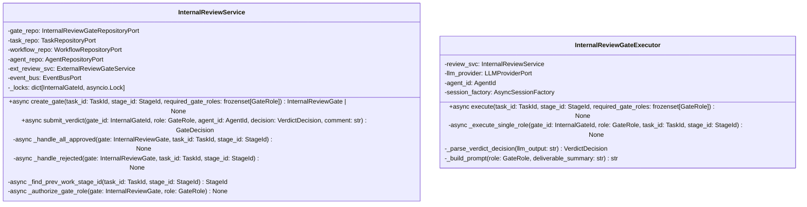

# 詳細設計書 — internal-review-gate / application

> feature: `internal-review-gate` / sub-feature: `application`
> 親業務仕様: [`../feature-spec.md`](../feature-spec.md)
> 関連: [`basic-design.md`](basic-design.md) / [`../../stage-executor/application/detailed-design.md`](../../stage-executor/application/detailed-design.md)（§確定 G: Executor 配置先・long-running coroutine 方式）
> 担当 Issue: [#164 feat(M5-B): InternalReviewGate infrastructure実装](https://github.com/bakufu-dev/bakufu/issues/164)

## 本書の役割

本書は **階層 3: internal-review-gate / application の詳細設計**（Module-level Detailed Design）を凍結する。M5-B の実装者が参照する **構造契約・確定事項・MSG 文言** を確定する。ジェンセン決定の 3 論点（①Executor 配置、②session_id 戦略、③差し戻し先 Stage 決定責務）を §確定 A〜G に展開する。

**書くこと**:
- クラス属性・型・制約（構造契約の詳細）
- `§確定 A〜G`（ジェンセン決定論点 + M5-B 固有の実装方針）
- MSG 確定文言（実装者が改変できない契約）

**書かないこと**:
- ソースコードそのもの / 疑似コード

## 記述ルール（必ず守ること）

詳細設計に **疑似コード・サンプル実装（python/ts/sh/yaml 等の言語コードブロック）を書かない**。

## クラス設計（詳細）

### Service: InternalReviewService

| 属性 | 型 | 意図 |
|---|---|---|
| `gate_repo` | `InternalReviewGateRepositoryPort` | Gate の CRUD |
| `task_repo` | `TaskRepositoryPort` | Task の取得・差し戻し保存 |
| `workflow_repo` | `WorkflowRepositoryPort` | DAG traversal 用 Workflow 取得 |
| `agent_repo` | `AgentRepositoryPort` | GateRole 権限認可（T1 対策）|
| `ext_review_svc` | `ExternalReviewGateService` | ALL_APPROVED → ExternalReviewGate 生成委譲 |
| `event_bus` | `EventBusPort` | Gate 状態変化 Domain Event 発行 |
| `_locks` | `dict[InternalGateId, asyncio.Lock]` | Gate ID ごとの Lost Update 防止ロック（§確定 H）|

**ふるまいの不変条件**:
- `create_gate()`: `required_gate_roles` が空集合なら `None` を返す（Gate を生成しない）
- `create_gate()`: 同一 `(task_id, stage_id)` の PENDING Gate が既存なら生成せず既存 Gate を返す（べき等、§確定 F）
- `submit_verdict()`: 呼び出し前に `_authorize_gate_role(agent_id, role)` で認可確認（A01 対策）
- `submit_verdict()`: `gate_decision == ALL_APPROVED` なら `_handle_all_approved()` を呼ぶ（同一 Tx 内）
- `submit_verdict()`: `gate_decision == REJECTED` なら `_handle_rejected()` を呼ぶ（同一 Tx 内）

### Executor: InternalReviewGateExecutor（`infrastructure/reviewers/`）

| 属性 | 型 | 意図 |
|---|---|---|
| `review_svc` | `InternalReviewService` | Verdict 提出 + Gate 決定 後処理 |
| `llm_provider` | `LLMProviderPort` | GateRole 審査 LLM 呼び出し |
| `agent_id` | `AgentId` | InternalReviewGateExecutor 自身のエージェント ID（各 GateRole の `agent_id` に使用）|
| `session_factory` | `AsyncSessionFactory`（`async_sessionmaker[AsyncSession]`）| GateRole ごとの独立 DB セッション生成元（§確定 I）|

**`execute()` のふるまい**:
1. `review_svc.create_gate(task_id, stage_id, required_gate_roles)` で Gate を生成・保存
2. `asyncio.gather(*tasks, return_exceptions=True)` で全 GateRole を並列呼び出し（§確定 B）
3. gather 結果に例外が含まれる場合は最初の例外を再送出（StageExecutorService が Task.block() に帰着）
4. 正常完了の場合は `None` を return（Task 連携は `submit_verdict()` 内で完結）

**`_execute_single_role()` のふるまい**:
1. `_build_prompt(role, deliverable_summary)` でプロンプトを構築（§確定 E）
2. `session_id = uuid4()` を生成（§確定 A）
3. `llm_provider.chat(prompt, session_id=session_id)` で LLM を呼び出す
4. `_parse_verdict_decision(llm_output)` で `VerdictDecision` を解析（§確定 D）
5. `review_svc.submit_verdict(gate_id, role, self.agent_id, decision, comment)` を呼ぶ

## 確定事項（先送り撤廃）

### 確定 A: session_id は GateRole ごとに独立した新規 UUID v4（ジェンセン決定 ②）

INTERNAL_REVIEW の各 GateRole 呼び出しに `session_id = uuid4()` を使用する。WORK Stage の session_id（Stage ID を流用）とは異なる戦略を採用する。

**根拠**:
- 複数 GateRole は独立した観点で並列審査する（feature-spec.md R1-B: 1 GateRole = 独立した判定）。同一 session に複数 GateRole の会話が混在すると LLM コンテキストが相互汚染され、独立性が失われる
- 各 GateRole は deliverable の内容と審査観点のみを必要とし、他 GateRole の判定結果を入力として必要としない（競合的評価を避ける設計）
- 新規 UUID v4 の生成はステートレスであり、SessionLost リトライ時も同じ戦略で対応可能

### 確定 B: 並列実行は `asyncio.gather(return_exceptions=True)` を採用。`gate_already_decided` 例外は無視する

全 GateRole の `_execute_single_role()` を `asyncio.gather(return_exceptions=True)` で並列実行する。

**根拠**:
- `return_exceptions=True`: gather タスクの一部が例外を送出しても他のタスクをキャンセルせずに最後まで実行する。1 GateRole の LLM エラーが他 GateRole の判定を妨げない（M4 Fail Soft パターンと同様の設計方針）
- REJECTED が確定した後も残りの GateRole が並列実行を継続するが、`submit_verdict()` 内で `gate_decision != PENDING` を domain 層が `InternalReviewGateInvariantViolation(kind='gate_already_decided')` で拒否する。これは「後続 GateRole が REJECTED 確定後に Verdict 提出を試みた」という**正常業務経路**であり、LLM エラーと区別して無視しなければならない
- `asyncio.gather` は単一 asyncio イベントループ内で完結するため、追加スレッドや外部プロセスが不要（tech-stack.md §LLM Adapter 方針と整合）

**例外フィルタリング規則（§確定B/C の矛盾を解消）**:

| gather 結果の例外型 | 処理方針 |
|------------------|---------|
| `InternalReviewGateInvariantViolation(kind='gate_already_decided')` | **無視**（REJECTED 確定後の後続 Verdict 提出による正常業務例外）|
| `LLMProviderError` 系（SessionLost / RateLimited / Auth / Timeout / Process）| **再送出**（StageExecutorService REQ-ME-002 が Task.block() に帰着）|
| その他の例外 | **再送出**（予期しない障害として上位に委譲）|

`execute()` は gather 結果を走査し、上記ルールで例外を分類する。`gate_already_decided` 以外の例外が存在する場合は最初の非 `gate_already_decided` 例外を再送出する。

**REJECTED 後の gather 継続について（fire-and-forget との違い）**:
execute() は `await asyncio.gather(...)` を最後まで待機してから return する。REJECTED が確定した時点で Task 差し戻しは `submit_verdict()` 内で完結しているため、残りの gather タスクが完了するまでの待機時間は LLM の応答時間のみ。Semaphore は全 gather タスク完了後に release される（design rationale: stage-executor §確定 G「なぜ long-running coroutine か」参照）。

### 確定 C: REJECTED 後の残り GateRole 呼び出しは interrupt しない

REJECTED Verdict が確定した後も、`asyncio.gather(return_exceptions=True)` で起動中の他 GateRole タスクはキャンセルせずに完走させる。

**根拠**:
- キャンセル（`task.cancel()`）を注入する実装は `_execute_single_role()` に shared state（gate_decision チェック）が必要になり、Executor の設計が複雑化する
- 残り GateRole が完走して `submit_verdict()` を呼んでも、domain 層が `kind='gate_already_decided'` で拒否するため副作用がない
- MVP スコープでは GateRole 数は最大 3〜5 程度（feature-spec.md §14 パフォーマンス）。キャンセルによる時間短縮より設計のシンプルさを優先（KISS 原則）

### 確定 D: LLM 出力の `VerdictDecision` 解析ルール

`_parse_verdict_decision(llm_output: str) -> VerdictDecision` の解析ロジック:

| LLM 出力パターン | 変換結果 | 根拠 |
|----------------|---------|------|
| 1 行目の **行頭**（前後の空白を除く）が `APPROVED` / `LGTM` / `OK` のいずれかで始まる（大文字小文字無視、`\b` 単語境界）— `re.match(r"^\s*(APPROVED\|LGTM\|OK)\b", first_line, re.IGNORECASE)` | `VerdictDecision.APPROVED` | 明確な承認表現のみを前進許可 |
| 上記以外の全て（`REJECTED` / "却下" / "条件付き承認" / 空文字 / parse 失敗 等）| `VerdictDecision.REJECTED` | feature-spec.md R1-F: ambiguous は REJECTED として扱う |

**根拠**:
- 行頭マッチ（`re.match`）を使用することで `"REJECTED: 承認できない理由..."` が誤って `APPROVED` に分類されるパターンを排除する。substring 検索では "承認" を含む REJECTED 文が誤判定される脆弱性がある（ヘルスバーグ指摘 §却下5）
- 日本語の "承認" は不採用。LLM に対してプロンプト（§確定 E）で英語キーワード（`APPROVED` / `REJECTED`）を明示的に指示するため、日本語キーワードマッチは不要であり誤検知を増やすだけ
- `\b` 単語境界により `APPROVEDXXX` 等の誤マッチを防ぐ
- parse に失敗した場合は安全側（`REJECTED`）に倒す Fail Safe 設計（feature-spec.md R1-F）

プロンプト設計（§確定 E）で LLM に "1 行目に判定（APPROVED / REJECTED のいずれか）、2 行目以降に理由" を指示することで、パターンマッチング精度を高める。

### 確定 E: GateRole プロンプトテンプレートの構造と `deliverable_summary` 取得元

`_build_prompt(role: GateRole, deliverable_summary: str) -> str` が使用するテンプレートを凍結する。

**プロンプト構造**（`infrastructure/reviewers/prompts/default.py` に定義）:

| セクション | 内容 |
|-----------|------|
| システムロール | "あなたは {role} の専門家として、以下の成果物をレビューしてください。" |
| 成果物 | "{deliverable_summary}" |
| 審査指示 | "レビュー結果を以下の形式で出力してください: 1行目: APPROVED または REJECTED、2行目以降: 審査の根拠とフィードバック（500文字以内）" |
| 禁止事項 | "条件付き承認や曖昧な判定は REJECTED として出力してください。" |

role 別のカスタムテンプレート（`prompts/{role}.py`）が存在しない場合は `prompts/default.py` を使用する（現時点では全 role が default テンプレートを使用）。将来、特定 GateRole（例: security）に審査観点の詳細指示が必要な場合は role 別テンプレートを追加する（YAGNI: 現時点では default のみで十分）。

**`deliverable_summary` の取得元（凍結）**:

`_execute_single_role()` が `_build_prompt()` に渡す `deliverable_summary` の取得元を以下の通り凍結する（申し送り#3 撤廃）。

| ステップ | 操作 |
|---------|------|
| 1 | `TaskRepository.find_by_id(task_id)` で Task を取得 |
| 2 | `task.current_deliverable` が `None` の場合は `IllegalTaskStateError` を送出（Fail Fast）|
| 3 | `task.current_deliverable.content`（`str`）を `deliverable_summary` として `_build_prompt()` に渡す |

**根拠**: INTERNAL_REVIEW Stage の審査対象は「直前の WORK Stage が生成した成果物テキスト」である（feature-spec.md §7 R1-C）。`Task.current_deliverable` は domain 設計で「Task の現在有効な成果物」として凍結されており（domain/basic-design.md §Deliverable）、DAG 上で直前 WORK Stage の出力に対応する。実装 PR で取得元を変更することは設計変更であり、別 PR + 設計書更新が必要。

### 確定 F: `create_gate()` の事前条件とべき等性（既存 PENDING Gate の重複生成防止）

`create_gate(task_id, stage_id, required_gate_roles)` 呼び出し時の事前条件確認と分岐:

| 状況 | 動作 |
|-----|------|
| `required_gate_roles` が空集合 | `None` を返す（Gate を生成しない）|
| `task.status` が `BLOCKED` / `REJECTED` / `COMPLETED` のいずれか | `IllegalTaskStateError` を送出（Fail Fast: 差し戻し中・ブロック中・完了済み Task への二重 Gate 生成を禁止）|
| 既存 PENDING Gate が存在する | 既存 Gate をそのまま返す（新規生成しない、べき等）|
| 上記以外（Task が RUNNING 状態、既存 PENDING Gate なし）| 新規 Gate を生成・保存して返す |

**事前条件の確認順序**: 空集合チェック → Task.status チェック（`TaskRepository.find_by_id` で取得）→ 既存 PENDING Gate チェック（`gate_repo.find_by_task_and_stage` で取得）→ 新規生成。

**根拠**:
- Task.status 事前条件: REJECTED Task（差し戻し処理中）に新たな Gate を生成すると、旧ラウンドの差し戻し処理と競合する業務バグが発生する（Tabriz 指摘 §却下8）。`task.status` が `RUNNING` でない場合は Gate 生成を拒否して Fail Fast する
- べき等保証: StageWorker の retry や crash recovery で `create_gate()` が複数回呼ばれるケースを安全に処理する。同一 `(task_id, stage_id)` の PENDING Gate が複数生成される業務バグを application 層で物理防止する（repository/detailed-design.md §申し送り #2 の対応）

### 確定 G: `InternalReviewGateExecutor` は `infrastructure/reviewers/` に配置（ジェンセン決定 ①）

M5-B は `backend/src/bakufu/infrastructure/reviewers/internal_review_gate_executor.py` に `InternalReviewGateExecutor` を実装する。`InternalReviewGateExecutorPort`（application/ports/）の structural subtype として `typing.Protocol` の構造的部分型マッチングで充足する。

**根拠**: stage-executor/application/detailed-design.md §確定 G で凍結済み（"M5-B は `infrastructure/reviewers/internal_review_gate_executor.py` にこの Protocol を実装する"）。Port の依存方向（application → domain ← infrastructure）を保全する。

`infrastructure/bootstrap.py` の DI 配線更新（Stage 6.5 の `StageWorker` 初期化時に `InternalReviewGateExecutor` インスタンスを `StageExecutorService` に注入）は M5-B の実装 PR で行う。設計書変更は不要。

**差し戻し先 Stage 決定はダウン application 層責務（ジェンセン決定 ③）**:

`_find_prev_work_stage_id(task_id, stage_id)` の処理:

| ステップ | 操作 |
|---------|------|
| 1 | `TaskRepository.find_by_id(task_id)` で Task を取得 → `workflow_id` を確認 |
| 2 | `WorkflowRepository.find_by_id(workflow_id)` で Workflow を取得 |
| 3 | `workflow.transitions` DAG を逆引きして `stage_id` の直前ノードを検索 |
| 4 | 直前ノードの `Stage.kind == WORK` を確認 |
| 5 | 見つかった前段 WORK Stage の `id` を返す |

前段 WORK Stage が見つからない場合（Workflow 設計バグ）は `IllegalWorkflowStructureError` を送出（Fail Fast）。domain の `task.rollback_to_stage(prev_stage_id)` には確定済みの `StageId` を渡す（domain 層は DAG traversal を知らない）。

### 確定 H: `submit_verdict()` は `asyncio.Lock(gate_id)` で Lost Update を防止する

`InternalReviewService` は Gate ID をキーとした `asyncio.Lock` テーブル（`_locks: dict[InternalGateId, asyncio.Lock]`）をインスタンス属性として保持する。`submit_verdict()` は Gate の read-modify-write シーケンス（`find_by_id → gate.submit_verdict → save`）をこの Lock で直列化する。

| 状況 | 動作 |
|-----|------|
| 同一 Gate への並列 `submit_verdict()` 呼び出し | Lock を取得したコルーチンのみが read-modify-write を実行。他コルーチンは Lock 解放まで待機 |
| Lock の取得・解放 | `async with self._locks.setdefault(gate_id, asyncio.Lock()):` で管理。例外時も `async with` が確実に Lock を解放する |
| Gate 確定（ALL_APPROVED / REJECTED）後の Lock エントリ | `_locks` dict から削除しない。後続の `gate_already_decided` 例外は §確定 B の例外フィルタリングで無視される |

**根拠**: `asyncio.gather(return_exceptions=True)` で並列起動した複数の `_execute_single_role()` が同一 Gate に対して `submit_verdict()` を並列呼び出しする（§確定 B）。Repository の `save()` は DELETE/bulk INSERT semantics（repository/detailed-design.md §確定 A）であり、Lock なしでは後着コルーチンが先着の変更を上書きする Lost Update が発生する。`asyncio.Lock` は単一 asyncio イベントループ内で完結し、追加スレッド・外部ロックは不要。

### 確定 I: `InternalReviewGateExecutor` は `session_factory` を注入し GateRole ごとに独立した `AsyncSession` を使用する

`InternalReviewGateExecutor` は `session_factory`（`async_sessionmaker[AsyncSession]`）を属性として保持する。各 `_execute_single_role()` の呼び出し先頭で `async with self.session_factory() as session:` により独立した `AsyncSession` を生成し、その session スコープ内で LLM 呼び出しと `submit_verdict()` を実行する。

| 制約 | 内容 |
|-----|------|
| セッション共有禁止 | `execute()` で生成した単一 `AsyncSession` を複数 GateRole タスク間で共有してはならない |
| セッション生成タイミング | `_execute_single_role()` の先頭で毎回 `session_factory()` から新規生成 |
| セッション管理 | `async with` コンテキストマネージャで管理。例外時も自動 close・rollback される |
| session の流し方 | `_execute_single_role()` が session スコープ内で session-aware な repository/service を呼ぶ。具体的な受け渡し方法（constructor / context var 等）は実装 PR で確定するが、session の GateRole 間共有は禁止（本 §の制約が優先）|

**根拠**: SQLAlchemy の `AsyncSession` はコルーチン内での直列使用を前提とする（[SQLAlchemy asyncio doc](https://docs.sqlalchemy.org/en/20/orm/extensions/asyncio.html)）。`asyncio.gather()` で並列起動した複数コルーチンが単一 `AsyncSession` を共有すると、内部ステートが破損して `MissingGreenlet` や `DetachedInstanceError` 等の実行時エラーを引き起こす。`session_factory`（`async_sessionmaker`）は複数回呼び出し可能なファクトリであり、GateRole ごとに独立したセッションを生成する（ヘルスバーグ指摘 §却下2）。

### 確定 J: Gate 決定時に audit_log を記録する（OWASP A09 対応）

`InternalReviewService.submit_verdict()` は Gate が `ALL_APPROVED` または `REJECTED` に遷移した時点で audit_log を記録する。

| イベント | audit_log に含む情報 |
|---------|------------------|
| ALL_APPROVED 遷移 | `task_id` / `gate_id` / `decision=ALL_APPROVED` / 全 Verdict の `role` と `decision` / `timestamp` |
| REJECTED 遷移 | `task_id` / `gate_id` / `decision=REJECTED` / 拒否した `role` / `timestamp` |

**禁止事項**: Verdict の `comment` の raw テキストを audit_log に含めない。comment には LLM が出力した secret が混入する可能性があり（T3 対策、feature-spec.md §13 機密レベル「高」）、マスキングは repository 層で実施される（repository/detailed-design.md §T1）。audit_log に書き込む前に comment のマスキング済み値（`gate.verdicts[-1].comment`）を使用すること。

**根拠**: OWASP A09（Security Logging and Monitoring Failures）。Gate の ALL_APPROVED / REJECTED 遷移は業務上の重要イベントであり、事後調査・不正検出のために記録が必要（Tabriz 指摘 §却下9）。audit_log の書き込み先は既存の構造化ログ（`logger.info` + JSON formatter）に従う（`docs/design/threat-model.md §A09`）。

## ユーザー向けメッセージの確定文言

### プレフィックス統一

| プレフィックス | 意味 |
|---|---|
| `[FAIL]` | 処理中止を伴う失敗 |
| `[OK]` | 成功完了 |

### MSG 確定文言表

| ID | 例外型 | 出力先 | 文言（1 行目: failure / 2 行目: next action）|
|----|------|-------|---|
| MSG-IRG-A001 | `InternalReviewGateNotFoundError` | HTTP API 404 / CLI stderr | `[FAIL] InternalReviewGate {gate_id} が見つかりません。` / `Next: gate_id を確認し、タスクの実行状態を 'bakufu admin list-tasks' で確認してください。` |
| MSG-IRG-A002 | `UnauthorizedGateRoleError` | HTTP API 403 / CLI stderr | `[FAIL] エージェント {agent_id} は GateRole '{role}' の審査権限を持っていません。` / `Next: Agent の role_profile に '{role}' が含まれているか確認し、権限を付与してから再試行してください。` |
| MSG-IRG-A003 | `IllegalWorkflowStructureError` | CLI stderr / audit_log | `[FAIL] Task {task_id} の前段 WORK Stage が Workflow DAG に存在しません（stage_id: {stage_id}）。` / `Next: Workflow 設計を確認してください。INTERNAL_REVIEW Stage の直前に WORK Stage が必要です。` |

## データ構造（永続化キー）

新規テーブルなし — 理由: 本 sub-feature の永続化スキーマは repository sub-feature で定義済み（[`../repository/detailed-design.md §データ構造`](../repository/detailed-design.md)）。application / infrastructure 層はテーブルを追加しない。

使用するテーブル:

| テーブル | 用途 |
|---|---|
| `internal_review_gates` / `internal_review_gate_verdicts` | Gate CRUD（repository sub-feature で定義）|
| `tasks` | Task 差し戻し・状態更新 |
| `workflows` | DAG traversal |

## API エンドポイント詳細

該当なし — 理由: 本 sub-feature は application / infrastructure 層のみ。HTTP API エンドポイントは将来の `internal-review-gate/http-api/` sub-feature で凍結する。

## Known Issues（申し送り）

### 申し送り #1: M5-A の `_NullInternalReviewGateExecutor` スタブの除去

`stage_executor_service/_dispatcher.py` が `_NullInternalReviewGateExecutor`（M5-A stub）を使用している。M5-B 実装 PR で `bootstrap.py` の DI 配線を `InternalReviewGateExecutor` に切り替え、stub は削除する。設計書の変更は不要（実装の変更のみ）。

### 申し送り #2: REJECTED 後の残り GateRole gather 待機時間

§確定 C の設計により、REJECTED 確定後も残りの GateRole LLM 呼び出しが完走するまで `execute()` がブロックする。GateRole が 3〜5 件で各 LLM 応答が数秒〜数十秒の場合、Semaphore が最大 LLM 応答時間分余分に占有される。MVP スコープでは許容範囲内だが、将来的に GateRole が 10 件以上になる場合は REJECTED 時のキャンセル機構（`asyncio.Event` による cooperative cancellation）を別 PR で検討すること。

## 出典・参考

- ジェンセン決定（M5-B 工程1タスク分析後の3論点）:
  ①Executor配置: `infrastructure/reviewers/`, ②session_id: GateRole別独立UUID, ③差し戻し先: application層DAG traversal
- [`../../stage-executor/application/detailed-design.md §確定 G`](../../stage-executor/application/detailed-design.md) — InternalReviewGateExecutorPort 定義・long-running coroutine 設計理由
- [`../domain/detailed-design.md §確定 F`](../domain/detailed-design.md) — ambiguous → REJECTED（feature-spec.md R1-F の実装）
- [`../domain/detailed-design.md §確定 I`](../domain/detailed-design.md) — application 層責務一覧（GateRole 権限認可）
- [Python asyncio.gather](https://docs.python.org/3/library/asyncio-task.html#asyncio.gather) — return_exceptions=True の動作
- [typing.Protocol](https://docs.python.org/3/library/typing.html#typing.Protocol) — structural subtyping
