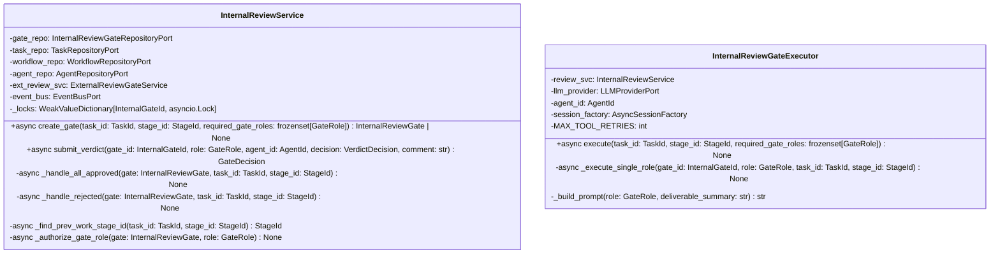

# 詳細設計書 — internal-review-gate / application

> feature: `internal-review-gate` / sub-feature: `application`
> 親業務仕様: [`../feature-spec.md`](../feature-spec.md)
> 関連: [`basic-design.md`](basic-design.md) / [`../../stage-executor/application/detailed-design.md`](../../stage-executor/application/detailed-design.md)（§確定 G: Executor 配置先・long-running coroutine 方式）
> 担当 Issue: [#164 feat(M5-B): InternalReviewGate infrastructure実装](https://github.com/bakufu-dev/bakufu/issues/164)

## 本書の役割

本書は **階層 3: internal-review-gate / application の詳細設計**（Module-level Detailed Design）を凍結する。M5-B の実装者が参照する **構造契約・確定事項・MSG 文言** を確定する。ジェンセン決定の 3 論点（①Executor 配置、②session_id 戦略、③差し戻し先 Stage 決定責務）を §確定 A〜G に展開する。

**書くこと**:
- クラス属性・型・制約（構造契約の詳細）
- `§確定 A〜G`（ジェンセン決定論点 + M5-B 固有の実装方針）
- MSG 確定文言（実装者が改変できない契約）

**書かないこと**:
- ソースコードそのもの / 疑似コード

## 記述ルール（必ず守ること）

詳細設計に **疑似コード・サンプル実装（python/ts/sh/yaml 等の言語コードブロック）を書かない**。

## クラス設計（詳細）

### Service: InternalReviewService

| 属性 | 型 | 意図 |
|---|---|---|
| `gate_repo` | `InternalReviewGateRepositoryPort` | Gate の CRUD |
| `task_repo` | `TaskRepositoryPort` | Task の取得・差し戻し保存 |
| `workflow_repo` | `WorkflowRepositoryPort` | DAG traversal 用 Workflow 取得 |
| `agent_repo` | `AgentRepositoryPort` | GateRole 権限認可（T1 対策）|
| `ext_review_svc` | `ExternalReviewGateService` | ALL_APPROVED → ExternalReviewGate 生成委譲 |
| `event_bus` | `EventBusPort` | Gate 状態変化 Domain Event 発行 |
| `_locks` | `WeakValueDictionary[InternalGateId, asyncio.Lock]` | Gate ID ごとの Lost Update 防止ロック。弱参照により Gate 確定後の GC 自動回収でメモリリークを防ぐ（§確定 H）|

**ふるまいの不変条件**:
- `create_gate()`: `required_gate_roles` が空集合なら `None` を返す（Gate を生成しない）
- `create_gate()`: 同一 `(task_id, stage_id)` の PENDING Gate が既存なら生成せず既存 Gate を返す（べき等、§確定 F）
- `submit_verdict()`: 呼び出し前に `_authorize_gate_role(agent_id, role)` で認可確認（A01 対策）
- `submit_verdict()`: `gate_decision == ALL_APPROVED` なら `_handle_all_approved()` を呼ぶ（同一 Tx 内）
- `submit_verdict()`: `gate_decision == REJECTED` なら `_handle_rejected()` を呼ぶ（同一 Tx 内）

### Executor: InternalReviewGateExecutor（`infrastructure/reviewers/`）

| 属性 | 型 | 意図 |
|---|---|---|
| `review_svc` | `InternalReviewService` | Verdict 提出 + Gate 決定 後処理 |
| `llm_provider` | `LLMProviderPort` | GateRole 審査 LLM 呼び出し（`chat_with_tools` を使用）|
| `agent_id` | `AgentId` | InternalReviewGateExecutor 自身のエージェント ID（各 GateRole の `agent_id` に使用）|
| `session_factory` | `AsyncSessionFactory`（`async_sessionmaker[AsyncSession]`）| GateRole ごとの独立 DB セッション生成元（§確定 I）|
| `MAX_TOOL_RETRIES` | `int`（定数: `2`）| `submit_verdict` ツール未呼び出し時の最大再指示回数（§確定 D）|

**`execute()` のふるまい**:
1. `review_svc.create_gate(task_id, stage_id, required_gate_roles)` で Gate を生成・保存
2. `asyncio.gather(*tasks, return_exceptions=True)` で全 GateRole を並列呼び出し（§確定 B）
3. gather 結果に例外が含まれる場合は最初の例外を再送出（StageExecutorService が Task.block() に帰着）
4. 正常完了の場合は `None` を return（Task 連携は `submit_verdict()` 内で完結）

**`_execute_single_role()` のふるまい**:
1. `_build_prompt(role, deliverable_summary)` でプロンプトを構築（§確定 E）
2. `session_id = uuid4()` を生成（§確定 A）
3. `llm_provider.chat_with_tools(prompt, tools=[submit_verdict_tool_schema], session_id=session_id)` で LLM を呼び出す
4. LLM 応答に `submit_verdict` ツール呼び出しが含まれるか確認（§確定 D）
   - あり: ツール引数 `decision` / `reason` を取得 → `InternalReviewService.submit_verdict()` を呼ぶ
   - なし: 再指示メッセージを追加して LLM に再送信（最大 `MAX_TOOL_RETRIES` 回）→ 超過時は `REJECTED`（§確定 D）

## 確定事項（先送り撤廃）

### 確定 A: session_id は GateRole ごとに独立した新規 UUID v4（ジェンセン決定 ②）

INTERNAL_REVIEW の各 GateRole 呼び出しに `session_id = uuid4()` を使用する。WORK Stage の session_id（Stage ID を流用）とは異なる戦略を採用する。

**根拠**:
- 複数 GateRole は独立した観点で並列審査する（feature-spec.md R1-B: 1 GateRole = 独立した判定）。同一 session に複数 GateRole の会話が混在すると LLM コンテキストが相互汚染され、独立性が失われる
- 各 GateRole は deliverable の内容と審査観点のみを必要とし、他 GateRole の判定結果を入力として必要としない（競合的評価を避ける設計）
- 新規 UUID v4 の生成はステートレスであり、SessionLost リトライ時も同じ戦略で対応可能

### 確定 B: 並列実行は `asyncio.gather(return_exceptions=True)` を採用。`gate_already_decided` 例外は無視する

全 GateRole の `_execute_single_role()` を `asyncio.gather(return_exceptions=True)` で並列実行する。

**根拠**:
- `return_exceptions=True`: gather タスクの一部が例外を送出しても他のタスクをキャンセルせずに最後まで実行する。1 GateRole の LLM エラーが他 GateRole の判定を妨げない（M4 Fail Soft パターンと同様の設計方針）
- REJECTED が確定した後も残りの GateRole が並列実行を継続するが、`submit_verdict()` 内で `gate_decision != PENDING` を domain 層が `InternalReviewGateInvariantViolation(kind='gate_already_decided')` で拒否する。これは「後続 GateRole が REJECTED 確定後に Verdict 提出を試みた」という**正常業務経路**であり、LLM エラーと区別して無視しなければならない
- `asyncio.gather` は単一 asyncio イベントループ内で完結するため、追加スレッドや外部プロセスが不要（tech-stack.md §LLM Adapter 方針と整合）

**例外フィルタリング規則（§確定B/C の矛盾を解消）**:

| gather 結果の例外型 | 処理方針 |
|------------------|---------|
| `InternalReviewGateInvariantViolation(kind='gate_already_decided')` | **無視**（REJECTED 確定後の後続 Verdict 提出による正常業務例外）|
| `LLMProviderError` 系（SessionLost / RateLimited / Auth / Timeout / Process）| **再送出**（StageExecutorService REQ-ME-002 が Task.block() に帰着）|
| その他の例外 | **再送出**（予期しない障害として上位に委譲）|

`execute()` は gather 結果を走査し、上記ルールで例外を分類する。`gate_already_decided` 以外の例外が存在する場合は最初の非 `gate_already_decided` 例外を再送出する。

**REJECTED 後の gather 継続について（fire-and-forget との違い）**:
execute() は `await asyncio.gather(...)` を最後まで待機してから return する。REJECTED が確定した時点で Task 差し戻しは `submit_verdict()` 内で完結しているため、残りの gather タスクが完了するまでの待機時間は LLM の応答時間のみ。Semaphore は全 gather タスク完了後に release される（design rationale: stage-executor §確定 G「なぜ long-running coroutine か」参照）。

### 確定 C: REJECTED 後の残り GateRole 呼び出しは interrupt しない

REJECTED Verdict が確定した後も、`asyncio.gather(return_exceptions=True)` で起動中の他 GateRole タスクはキャンセルせずに完走させる。

**根拠**:
- キャンセル（`task.cancel()`）を注入する実装は `_execute_single_role()` に shared state（gate_decision チェック）が必要になり、Executor の設計が複雑化する
- 残り GateRole が完走して `submit_verdict()` を呼んでも、domain 層が `kind='gate_already_decided'` で拒否するため副作用がない
- MVP スコープでは GateRole 数は最大 3〜5 程度（feature-spec.md §14 パフォーマンス）。キャンセルによる時間短縮より設計のシンプルさを優先（KISS 原則）

### 確定 D: LLM 判定の取得は `submit_verdict` ツール呼び出し登録方式（ジェンセン決定）

テキスト解析方式（正規表現パターンマッチング）を廃止し、**LLM ツール呼び出し（function calling）** で判定を受け取る。`_execute_single_role()` は LLM に `submit_verdict` ツールを提供し、LLM がそのツールを呼び出すことで `VerdictDecision` を確定する。

**ツール定義（LLM に提供する tool schema）**:

| フィールド | 値 |
|---------|---|
| `tool_name` | `"submit_verdict"` |
| `description` | "審査判定を登録する。レビュー完了時に **必ず** 呼び出すこと。テキストのみの返答は無効。" |
| `parameters.decision` | `Literal["APPROVED", "REJECTED"]`（必須）|
| `parameters.reason` | `str`（必須、審査根拠・フィードバック、500 文字以内）|

> **注意**: `submit_verdict` ツール名は LLM に提供する tool schema の名前であり、`InternalReviewService.submit_verdict()` Python メソッドとは別物。両者を区別するため、本設計書では LLM ツールを `[LLM tool] submit_verdict`、Python メソッドを `InternalReviewService.submit_verdict()` と表記する。

**判定取得フロー（`_execute_single_role()` 内、リトライ含む）**:

| ステップ | 操作 |
|---------|------|
| 1 | 試行ごとのプロンプトを構築（下記「再指示プロンプト注入内容」参照）→ `LLMProviderPort.chat_with_tools(prompt, tools=[submit_verdict_tool_schema], session_id=uuid4())` を呼ぶ（§確定 A の session_id 戦略を踏襲）|
| 2 | LLM 応答に `[LLM tool] submit_verdict` ツール呼び出しが含まれているか確認 |
| 3a（呼び出しあり）| ツール引数 `decision: "APPROVED"\|"REJECTED"` / `reason: str` を取得 → `VerdictDecision` に変換 → `InternalReviewService.submit_verdict(gate_id, role, agent_id, decision, comment=reason)` を呼ぶ |
| 3b（呼び出しなし）| `prev_response_summary` に今回の LLM 応答テキスト先頭 200 文字を保持。リトライカウントをインクリメント。「再指示プロンプト注入内容」の次試行プロンプトをシステムが構築してステップ 1 に戻る |
| 4（リトライ超過）| 3 回全て未登録の場合: 「3 回全て未登録時の処理」を実行（下記参照）|

**再指示プロンプトの注入内容（`_execute_single_role()` がシステムとして自動構築）**:

コンテキスト注入は `_execute_single_role()` の**システム責務**であり、LLM の自由裁量に委ねない。LLM が「前回何を間違えたか・なぜ登録が必要か」を把握した状態で再試行できることを保証する（ai-team 実証済み経験知、ジェンセン決定）。

| 試行回数 | LLM に送信するプロンプト | 注入情報 |
|--------|----------------------|---------|
| 初回（試行 1）| `_build_prompt(role, deliverable_summary)` の出力（§確定 E）— "{deliverable_summary} を審査し、必ず `submit_verdict(decision, reason)` ツールを呼び出せ" を含む完全プロンプト | `deliverable_summary`（`task.current_deliverable.content` / §確定 E §取得元）|
| 再指示 1 回目（試行 2）| "前回の応答で判定ツールの呼び出しが確認できませんでした。理由: {tool_not_called}。前回応答の要約: {prev_response_summary}。必ず `submit_verdict` ツールを呼び出して判定を登録してください。" | `tool_not_called`（固定文言: "ツールを呼び出さずテキストのみで応答しました"）/ `prev_response_summary`（初回 LLM 応答の先頭 200 文字）|
| 再指示 2 回目（試行 3）| "前回の応答でも判定ツールの呼び出しが確認できませんでした。理由: {tool_not_called}。前回応答の要約: {prev_response_summary}。**これが最終機会です。** 必ず `submit_verdict` ツールを呼び出してください。この後ツールを呼び出さない場合、システムが自動的に REJECTED として登録します。" | 同上 + "これが最終機会" の明示 |

**注入変数の定義**:

| 変数 | 内容 | 生成責務 |
|-----|------|---------|
| `{tool_not_called}` | 固定文言: "ツールを呼び出さずテキストのみで応答しました" | システム（`_execute_single_role()` がハードコード）|
| `{prev_response_summary}` | 前回 LLM 応答テキストの先頭 200 文字（Fail Safe: 空の場合は "（前回応答なし）"）| システム（`_execute_single_role()` が前回応答をトランケートして注入）|

> **重要制約（T3 対策）**: `{prev_response_summary}` は先頭 200 文字のトランケートであり、raw LLM 出力全体を保持・ログ出力しない。200 文字を超えた部分は切り捨て、`logger` には `prev_response_length`（整数）のみ記録する。

**リトライ設計**:

| 項目 | 値 |
|-----|---|
| `MAX_TOOL_RETRIES` 定数 | `2`（クラス定数として定義、テスト時に差し替え可能）|
| 最大 LLM 呼び出し回数 | 3 回（試行 1 + 再指示試行 2 + 再指示試行 3）|
| リトライ超過時の判定 | `VerdictDecision.REJECTED`（feature-spec.md R1-F: ambiguous → REJECTED として扱う）|
| リトライ超過時のログ | `logger.warning` で `gate_id` / `role` / `retry_count` / `event="tool_not_called_all_retries"` を記録（raw LLM 出力はログ禁止）|

**3 回全て未登録時の処理**:

| 処理 | 内容 |
|-----|------|
| Verdict 登録 | `decision=REJECTED`、`reason="[SYSTEM] 全試行でツール未呼び出し——判定未登録（ambiguous 扱い）"` で `InternalReviewService.submit_verdict()` を呼ぶ |
| audit_log 記録 | `gate_id` / `role` / `retry_count=3` / `event="tool_not_called_all_retries"` / `timestamp` を audit_log に記録（§確定 J に基づくシステム側の強制記録）|
| `logger.warning` | `gate_id` / `role` / `retry_count` / `event` のみを記録（T3 対策: raw LLM 応答テキスト禁止）|

**`LLMProviderPort` への影響（M5-A 後方互換）**:

| メソッド | 戻り値 | 用途 | 状態 |
|---------|--------|------|------|
| `chat(messages, system, session_id)` | `ChatResult`（`tool_calls` は空リスト）| 既存 WORK Stage の LLM 実行 | M5-A 定義済み。変更なし |
| `chat_with_tools(messages, tools, system, session_id)` | `ChatResult`（`tool_calls: list[ToolCall]` にツール呼び出し情報が格納）| GateRole 審査の `submit_verdict` ツール呼び出し（M5-B）| M5-B で追加。既存 `chat()` との後方互換を保つ新 overload |

`_execute_single_role()` は `chat_with_tools()` の戻り値 `result.tool_calls` を走査し、`name == "submit_verdict"` のエントリを探す。文字列 JSON パースは行わない（Heisenberg 指摘 §却下6 の根本解決）。`ToolCall` の構造は `llm-client/domain/basic-design.md §ToolCall VO` で凍結。

**根拠**:
- 構造化ツール呼び出しはテキスト解析より解釈が安定する。LLM 出力テキストの言い回しに依存せず、型付き引数（`"APPROVED"` / `"REJECTED"` の 2 値 Literal）として確定される（まこちゃん経験知）
- 正規表現パターンマッチングは "条件付き承認" / "事実上の承認" 等の曖昧表現を誤判定するリスクを根絶できない（ヘルスバーグ指摘 §却下5 の根本解決）
- 最大 2 回のリトライは「ツールを提供したにもかかわらず呼び出さない」という LLM の異常動作に対する graceful fallback。3 回超えは LLM 異常と見なし Fail Safe で REJECTED
- `_parse_verdict_decision()` メソッドは廃止。テキスト解析ロジックを排除することで解析誤り起因のバグを設計レベルで排除する

### 確定 E: GateRole プロンプトテンプレートの構造と `deliverable_summary` 取得元

`_build_prompt(role: GateRole, deliverable_summary: str) -> str` が使用するテンプレートを凍結する。

**プロンプト構造**（`infrastructure/reviewers/prompts/default.py` に定義）:

| セクション | 内容 |
|-----------|------|
| システムロール | "あなたは {role} の専門家として、以下の成果物をレビューしてください。" |
| 成果物 | "{deliverable_summary}" |
| 審査指示 | "レビュー完了後、**必ず** `submit_verdict` ツールを呼び出して判定を登録してください。テキストのみの返答は無効として再指示されます。" |
| 判定基準 | "`decision` は `APPROVED` または `REJECTED` の 2 値のみ。条件付き承認・曖昧な判定は `REJECTED` として登録してください。" |
| フィードバック指示 | "`reason` に審査根拠とフィードバックを 500 文字以内で記述してください。" |

role 別のカスタムテンプレート（`prompts/{role}.py`）が存在しない場合は `prompts/default.py` を使用する（現時点では全 role が default テンプレートを使用）。将来、特定 GateRole（例: security）に審査観点の詳細指示が必要な場合は role 別テンプレートを追加する（YAGNI: 現時点では default のみで十分）。

**`deliverable_summary` の取得元（凍結）**:

`_execute_single_role()` が `_build_prompt()` に渡す `deliverable_summary` の取得元を以下の通り凍結する（申し送り#3 撤廃）。

| ステップ | 操作 |
|---------|------|
| 1 | `TaskRepository.find_by_id(task_id)` で Task を取得 |
| 2 | `task.current_deliverable` が `None` の場合は `IllegalTaskStateError` を送出（Fail Fast）|
| 3 | `task.current_deliverable.body_markdown`（`str`）を `deliverable_summary` として `_build_prompt()` に渡す |

**根拠**: INTERNAL_REVIEW Stage の審査対象は「直前の WORK Stage が生成した成果物テキスト」である（feature-spec.md §7 R1-C）。`Task.current_deliverable` は domain 設計（`task/domain/detailed-design.md §Aggregate Root: Task`）で「`current_stage_id` に対応する最新成果物スナップショット」を返す派生プロパティとして凍結されており（`deliverables.get(current_stage_id)`）、`Deliverable.body_markdown`（`str`）がマークダウン形式の成果物本文を保持する。実装 PR で取得元を変更することは設計変更であり、別 PR + 設計書更新が必要。`task.deliverables[stage_id]` のような直接 dict アクセスは Tell, Don't Ask 違反であり禁止。

### 確定 F: `create_gate()` の事前条件とべき等性（既存 PENDING Gate の重複生成防止）

`create_gate(task_id, stage_id, required_gate_roles)` 呼び出し時の事前条件確認と分岐:

| 状況 | 動作 |
|-----|------|
| `required_gate_roles` が空集合 | `None` を返す（Gate を生成しない）|
| `task.status` が `IN_PROGRESS` 以外（`PENDING` / `BLOCKED` / `DONE` / `CANCELLED` / `AWAITING_EXTERNAL_REVIEW`）| `IllegalTaskStateError` を送出（Fail Fast: 非実行中 Task への Gate 生成を禁止）|
| 既存 PENDING Gate が存在する | 既存 Gate をそのまま返す（新規生成しない、べき等）|
| `task.status == IN_PROGRESS` かつ既存 PENDING Gate なし | 新規 Gate を生成・保存して返す |

**事前条件の確認順序**: 空集合チェック → Task.status チェック（`TaskRepository.find_by_id` で取得）→ 既存 PENDING Gate チェック（`gate_repo.find_by_task_and_stage` で取得）→ 新規生成。

**根拠**:
- Task.status 事前条件: Task が `IN_PROGRESS` 以外（BLOCKED / DONE / CANCELLED 等）の状態に新たな Gate を生成すると、並行する別処理との競合や二重 Gate 生成の業務バグが発生する（Tabriz 指摘 §却下8）。`task.status != IN_PROGRESS` の場合は Gate 生成を拒否して Fail Fast する
- TaskStatus enum の実際の値（`domain/value_objects/enums.py` StrEnum 6 値）: `PENDING / IN_PROGRESS / AWAITING_EXTERNAL_REVIEW / BLOCKED / DONE / CANCELLED`。`RUNNING` / `REJECTED` / `COMPLETED` は存在しない（ヘルスバーグ指摘 §却下5）
- べき等保証: StageWorker の retry や crash recovery で `create_gate()` が複数回呼ばれるケースを安全に処理する。同一 `(task_id, stage_id)` の PENDING Gate が複数生成される業務バグを application 層で物理防止する（repository/detailed-design.md §申し送り #2 の対応）

### 確定 G: `InternalReviewGateExecutor` は `infrastructure/reviewers/` に配置（ジェンセン決定 ①）

M5-B は `backend/src/bakufu/infrastructure/reviewers/internal_review_gate_executor.py` に `InternalReviewGateExecutor` を実装する。`InternalReviewGateExecutorPort`（application/ports/）の structural subtype として `typing.Protocol` の構造的部分型マッチングで充足する。

**根拠**: stage-executor/application/detailed-design.md §確定 G で凍結済み（"M5-B は `infrastructure/reviewers/internal_review_gate_executor.py` にこの Protocol を実装する"）。Port の依存方向（application → domain ← infrastructure）を保全する。

`infrastructure/bootstrap.py` の DI 配線更新（Stage 6.5 の `StageWorker` 初期化時に `InternalReviewGateExecutor` インスタンスを `StageExecutorService` に注入）は M5-B の実装 PR で行う。設計書変更は不要。

**差し戻し先 Stage 決定はダウン application 層責務（ジェンセン決定 ③）**:

`_find_prev_work_stage_id(task_id, stage_id)` の処理:

| ステップ | 操作 |
|---------|------|
| 1 | `TaskRepository.find_by_id(task_id)` で Task を取得 → `workflow_id` を確認 |
| 2 | `WorkflowRepository.find_by_id(workflow_id)` で Workflow を取得 |
| 3 | `workflow.transitions` DAG を逆引きして `stage_id` の直前ノードを検索 |
| 4 | 直前ノードの `Stage.kind == WORK` を確認 |
| 5 | 見つかった前段 WORK Stage の `id` を返す |

前段 WORK Stage が見つからない場合（Workflow 設計バグ）は `IllegalWorkflowStructureError` を送出（Fail Fast）。domain の `task.rollback_to_stage(prev_stage_id)` には確定済みの `StageId` を渡す（domain 層は DAG traversal を知らない）。

### 確定 H: `submit_verdict()` は `asyncio.Lock(gate_id)` で Lost Update を防止する（`WeakValueDictionary` 採用）

`InternalReviewService` は Gate ID をキーとした `asyncio.Lock` テーブル（`_locks: WeakValueDictionary[InternalGateId, asyncio.Lock]`）をインスタンス属性として保持する。`submit_verdict()` は Gate の read-modify-write シーケンス（`find_by_id → gate.submit_verdict → save`）をこの Lock で直列化する。

| 状況 | 動作 |
|-----|------|
| 同一 Gate への並列 `submit_verdict()` 呼び出し | Lock を取得したコルーチンのみが read-modify-write を実行。他コルーチンは Lock 解放まで待機 |
| Lock の取得・解放 | `async with self._locks.setdefault(gate_id, asyncio.Lock()):` で管理。例外時も `async with` が確実に Lock を解放する |
| Gate 確定（ALL_APPROVED / REJECTED）後の Lock エントリ | `WeakValueDictionary` の弱参照により、同一 Gate への `submit_verdict()` が全て完了して Lock オブジェクトへの strong reference がなくなった時点で GC に自動回収される。常駐 StageWorker プロセスで Gate 数が増加しても `_locks` dict が無限蓄積するメモリリークを構造的に排除する |
| Gate 確定後の後続 `submit_verdict()` | GC 後に Lock が再生成されても `gate_already_decided` 例外で即拒否（§確定 B フィルタ）。新規 Lock 生成 → 即解放で functional には等価 |

**根拠**: `asyncio.gather(return_exceptions=True)` で並列起動した複数の `_execute_single_role()` が同一 Gate に対して `submit_verdict()` を並列呼び出しする（§確定 B）。Repository の `save()` は DELETE/bulk INSERT semantics（repository/detailed-design.md §確定 A）であり、Lock なしでは後着コルーチンが先着の変更を上書きする Lost Update が発生する。`asyncio.Lock` は単一 asyncio イベントループ内で完結し、追加スレッド・外部ロックは不要。`WeakValueDictionary`（[Python docs](https://docs.python.org/3/library/weakref.html#weakref.WeakValueDictionary)）は value オブジェクトへの strong reference が消えた時点で自動的にエントリを削除するため、「削除タイミングのロジック記述」を GC に委譲できる（ヘルスバーグ指摘 §却下3）。

### 確定 I: `InternalReviewGateExecutor` は `session_factory` を注入し GateRole ごとに独立した `AsyncSession` を使用する

`InternalReviewGateExecutor` は `session_factory`（`async_sessionmaker[AsyncSession]`）を属性として保持する。各 `_execute_single_role()` の呼び出し先頭で `async with self.session_factory() as session:` により独立した `AsyncSession` を生成し、その session スコープ内で LLM 呼び出しと `submit_verdict()` を実行する。

| 制約 | 内容 |
|-----|------|
| セッション共有禁止 | `execute()` で生成した単一 `AsyncSession` を複数 GateRole タスク間で共有してはならない |
| セッション生成タイミング | `_execute_single_role()` の先頭で毎回 `session_factory()` から新規生成 |
| セッション管理 | `async with` コンテキストマネージャで管理。例外時も自動 close・rollback される |
| session の流し方 | `_execute_single_role()` が session スコープ内で session-aware な repository/service を呼ぶ。具体的な受け渡し方法（constructor / context var 等）は実装 PR で確定するが、session の GateRole 間共有は禁止（本 §の制約が優先）|

**根拠**: SQLAlchemy の `AsyncSession` はコルーチン内での直列使用を前提とする（[SQLAlchemy asyncio doc](https://docs.sqlalchemy.org/en/20/orm/extensions/asyncio.html)）。`asyncio.gather()` で並列起動した複数コルーチンが単一 `AsyncSession` を共有すると、内部ステートが破損して `MissingGreenlet` や `DetachedInstanceError` 等の実行時エラーを引き起こす。`session_factory`（`async_sessionmaker`）は複数回呼び出し可能なファクトリであり、GateRole ごとに独立したセッションを生成する（ヘルスバーグ指摘 §却下2）。

### 確定 J: Gate 決定時に構造化ログ（`logger.info`）を記録する（OWASP A09 対応、MVP）

> **【ジェンセン決定】audit_log Port は MVP スコープ外（未実装）。`logger.info` + JSON formatter による構造化ログで代替する（MVP）。フォーマル audit_log Port の実装は Phase 2 以降のスコープとする。**

`InternalReviewService.submit_verdict()` は Gate が `ALL_APPROVED` または `REJECTED` に遷移した時点で `logger.info` による構造化ログを出力する。Port / Repository / テーブルは設けない。

| イベント | 構造化ログに含む情報 |
|---------|------------------|
| ALL_APPROVED 遷移 | `task_id` / `gate_id` / `decision=ALL_APPROVED` / 全 Verdict の `role` と `decision` / `timestamp` |
| REJECTED 遷移 | `task_id` / `gate_id` / `decision=REJECTED` / 拒否した `role` / `timestamp` |

**禁止事項**: Verdict の `comment` を構造化ログに含めてはならない（raw / masked 問わず）。上のフィールド表に `comment` は存在しない。`gate.verdicts[-1].comment` はメモリ上の raw 文字列であり、`MaskedText` TypeDecorator は SQLAlchemy の `process_bind_param`（永続化時）に初めて作動するため、永続化前時点では「マスキング済み」ではない。comment をログに書こうとすること自体が T3 違反（Tabriz 指摘 §却下1）。

**根拠**: OWASP A09（Security Logging and Monitoring Failures）。Gate の ALL_APPROVED / REJECTED 遷移は業務上の重要イベントであり、事後調査・不正検出のために記録が必要（Tabriz 指摘 §却下9）。MVP では `logger.info` + JSON formatter（`docs/design/threat-model.md §A09`）で要件を充足する。audit_log 専用 Port の実装は Phase 2 以降に持ち越す（ジェンセン決定）。

## ユーザー向けメッセージの確定文言

### プレフィックス統一

| プレフィックス | 意味 |
|---|---|
| `[FAIL]` | 処理中止を伴う失敗 |
| `[OK]` | 成功完了 |

### MSG 確定文言表

| ID | 例外型 | 出力先 | 文言（1 行目: failure / 2 行目: next action）|
|----|------|-------|---|
| MSG-IRG-A001 | `InternalReviewGateNotFoundError` | HTTP API 404 / CLI stderr | `[FAIL] InternalReviewGate {gate_id} が見つかりません。` / `Next: gate_id を確認し、タスクの実行状態を 'bakufu admin list-tasks' で確認してください。` |
| MSG-IRG-A002 | `UnauthorizedGateRoleError` | HTTP API 403 / CLI stderr | `[FAIL] エージェント {agent_id} は GateRole '{role}' の審査権限を持っていません。` / `Next: Agent の role_profile に '{role}' が含まれているか確認し、権限を付与してから再試行してください。` |
| MSG-IRG-A003 | `IllegalWorkflowStructureError` | CLI stderr / audit_log | `[FAIL] Task {task_id} の前段 WORK Stage が Workflow DAG に存在しません（stage_id: {stage_id}）。` / `Next: Workflow 設計を確認してください。INTERNAL_REVIEW Stage の直前に WORK Stage が必要です。` |

## データ構造（永続化キー）

新規テーブルなし — 理由: 本 sub-feature の永続化スキーマは repository sub-feature で定義済み（[`../repository/detailed-design.md §データ構造`](../repository/detailed-design.md)）。application / infrastructure 層はテーブルを追加しない。

使用するテーブル:

| テーブル | 用途 |
|---|---|
| `internal_review_gates` / `internal_review_gate_verdicts` | Gate CRUD（repository sub-feature で定義）|
| `tasks` | Task 差し戻し・状態更新 |
| `workflows` | DAG traversal |

## API エンドポイント詳細

該当なし — 理由: 本 sub-feature は application / infrastructure 層のみ。HTTP API エンドポイントは将来の `internal-review-gate/http-api/` sub-feature で凍結する。

## Known Issues（申し送り）

### 申し送り #1: M5-A の `_NullInternalReviewGateExecutor` スタブの除去

`stage_executor_service/_dispatcher.py` が `_NullInternalReviewGateExecutor`（M5-A stub）を使用している。M5-B 実装 PR で `bootstrap.py` の DI 配線を `InternalReviewGateExecutor` に切り替え、stub は削除する。設計書の変更は不要（実装の変更のみ）。

### 申し送り #2: REJECTED 後の残り GateRole gather 待機時間

§確定 C の設計により、REJECTED 確定後も残りの GateRole LLM 呼び出しが完走するまで `execute()` がブロックする。GateRole が 3〜5 件で各 LLM 応答が数秒〜数十秒の場合、Semaphore が最大 LLM 応答時間分余分に占有される。MVP スコープでは許容範囲内だが、将来的に GateRole が 10 件以上になる場合は REJECTED 時のキャンセル機構（`asyncio.Event` による cooperative cancellation）を別 PR で検討すること。

## 出典・参考

- ジェンセン決定（M5-B 工程1タスク分析後の3論点）:
  ①Executor配置: `infrastructure/reviewers/`, ②session_id: GateRole別独立UUID, ③差し戻し先: application層DAG traversal
- [`../../stage-executor/application/detailed-design.md §確定 G`](../../stage-executor/application/detailed-design.md) — InternalReviewGateExecutorPort 定義・long-running coroutine 設計理由
- [`../domain/detailed-design.md §確定 F`](../domain/detailed-design.md) — ambiguous → REJECTED（feature-spec.md R1-F の実装）
- [`../domain/detailed-design.md §確定 I`](../domain/detailed-design.md) — application 層責務一覧（GateRole 権限認可）
- [Python asyncio.gather](https://docs.python.org/3/library/asyncio-task.html#asyncio.gather) — return_exceptions=True の動作
- [typing.Protocol](https://docs.python.org/3/library/typing.html#typing.Protocol) — structural subtyping
