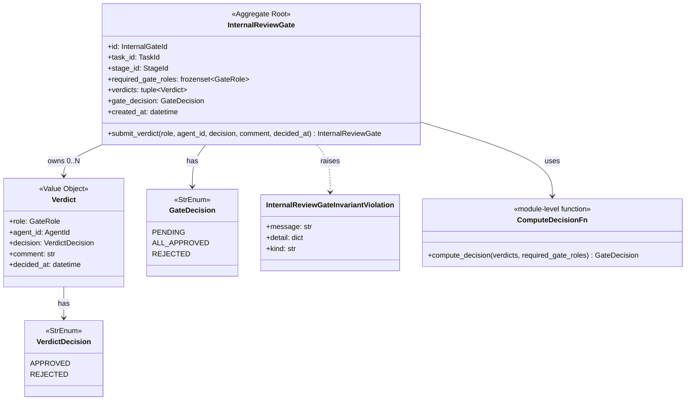
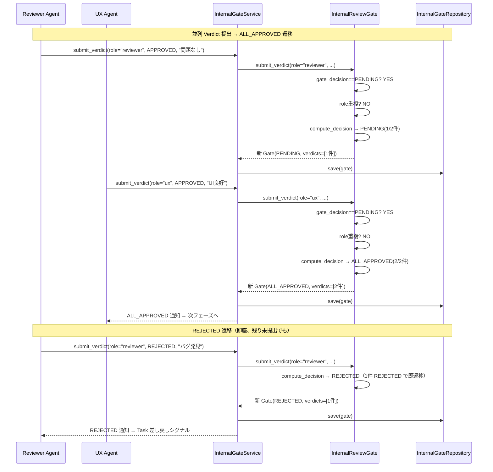
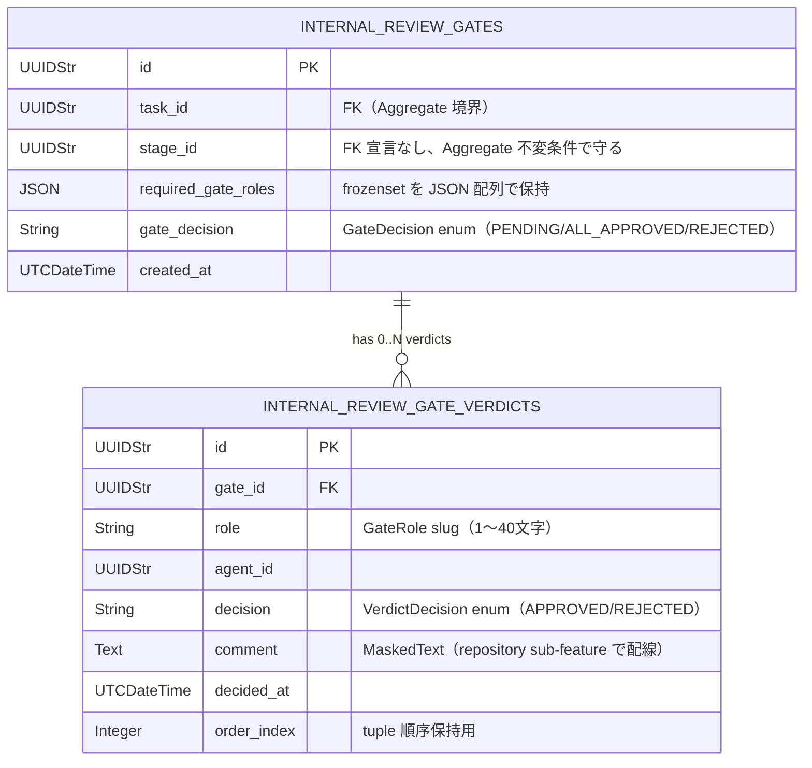

# 基本設計書 — internal-review-gate / domain

> feature: `internal-review-gate` / sub-feature: `domain`
> 親 spec: [../feature-spec.md](../feature-spec.md) §9 受入基準 1〜12
> 関連: [`docs/design/domain-model.md`](../../../design/domain-model.md) §InternalReviewGate（本 PR で追加）/ [`../../external-review-gate/`](../../external-review-gate/)（踏襲元パターン）/ [`../../workflow/`](../../workflow/)（Stage.required_gate_roles 追加先）

## §モジュール契約（機能要件）

| 要件ID | 概要 | 入力 | 処理 | 出力 | エラー時 | 親 spec 参照 |
|--------|------|------|------|------|---------|-------------|
| REQ-IRG-001 | InternalReviewGate 構築 | id / task_id / stage_id / required_gate_roles（frozenset[str]、1件以上）/ verdicts（既定 []）/ gate_decision（既定 PENDING）/ created_at | Pydantic 型バリデーション → model_validator で不変条件 4 種検査（①required_gate_roles 非空 ②Verdict の role が required_gate_roles に含まれる ③同一 GateRole の Verdict 重複なし ④gate_decision と verdicts の整合性）| valid な InternalReviewGate インスタンス | `InternalReviewGateInvariantViolation` | §9 AC#2 |
| REQ-IRG-002 | Verdict 提出（submit_verdict）| 現 Gate + role（GateRole）/ agent_id / decision（VerdictDecision）/ comment（0〜5000文字）/ decided_at | ①gate_decision が PENDING か確認（確定済みなら拒否）②同一 role の重複確認（既存なら拒否）③comment 長検査 ④新 Verdict を追加した新リストで仮 Gate 構築 ⑤compute_decision で gate_decision を更新 | 新 InternalReviewGate インスタンス | `InternalReviewGateInvariantViolation(kind='gate_already_decided' / 'role_already_submitted' / 'comment_too_long')` | §9 AC#3〜7, 11 |
| REQ-IRG-003 | 全体判断算出（compute_decision）（内部）| verdicts / required_gate_roles | ①いずれかの Verdict が REJECTED なら GateDecision.REJECTED ②全 required_gate_roles の Verdict が APPROVED なら GateDecision.ALL_APPROVED ③それ以外は GateDecision.PENDING | GateDecision | 該当なし | §9 AC#4〜5 |
| REQ-IRG-004 | 不変条件検査（4 種）| Gate 現状属性 | ①required_gate_roles 非空 ②Verdict の role が required_gate_roles に含まれる ③同一 GateRole の Verdict 重複なし ④gate_decision と verdicts の整合性（ALL_APPROVED なら全 required 提出済み + 全 APPROVED / REJECTED なら 1 件以上 REJECTED）| None（検査通過）| `InternalReviewGateInvariantViolation` | §9 AC#2〜7 |

## 記述ルール（必ず守ること）

基本設計に**疑似コード・サンプル実装（python/ts/sh/yaml 等の言語コードブロック）を書かない**。
ソースコードと二重管理になりメンテナンスコストしか生まない。
必要なのは構造契約（クラス・モジュール・データの関係）であり、実装の細部は [detailed-design.md](detailed-design.md) で凍結する。

## モジュール構成

| 機能 ID | モジュール | ディレクトリ | 責務 |
|--------|----------|------------|------|
| REQ-IRG-001〜004 | `InternalReviewGate` Aggregate Root | `backend/src/bakufu/domain/internal_review_gate/internal_review_gate.py` | Gate の属性・不変条件・submit_verdict ふるまい |
| REQ-IRG-004 | 不変条件 helper | `backend/src/bakufu/domain/internal_review_gate/aggregate_validators.py` | 4 種不変条件 helper 関数（ExternalReviewGate 同パターン）|
| REQ-IRG-002〜003 | `state_machine.py` | `backend/src/bakufu/domain/internal_review_gate/state_machine.py` | enum-based decision table / `compute_decision(verdicts, required_gate_roles) -> GateDecision` |
| REQ-IRG-001 | `InternalReviewGateInvariantViolation` 例外 | `backend/src/bakufu/domain/exceptions.py`（既存ファイル更新）| 2 行エラー構造（6 兄弟と同パターン）|
| 共通 | `GateDecision` / `VerdictDecision` enum + `Verdict` VO | `backend/src/bakufu/domain/value_objects.py`（既存ファイル更新）| Pydantic v2 frozen + StrEnum |
| 公開 API | re-export | `backend/src/bakufu/domain/internal_review_gate/__init__.py` | `InternalReviewGate` / `InternalReviewGateInvariantViolation` / `GateDecision` / `VerdictDecision` を re-export |

```
ディレクトリ構造（本 feature で追加・変更されるファイル）:

.
├── backend/
│   ├── src/
│   │   └── bakufu/
│   │       └── domain/
│   │           ├── internal_review_gate/        # 新規ディレクトリ（external_review_gate と同パターン）
│   │           │   ├── __init__.py
│   │           │   ├── internal_review_gate.py
│   │           │   ├── aggregate_validators.py
│   │           │   └── state_machine.py
│   │           ├── exceptions.py                # 既存更新: InternalReviewGateInvariantViolation 追加
│   │           └── value_objects.py             # 既存更新: GateDecision / VerdictDecision enum + Verdict VO 追加
│   └── tests/
│       ├── factories/
│       │   └── internal_review_gate.py          # 新規: GateFactory / VerdictFactory
│       └── domain/
│           └── internal_review_gate/
│               ├── __init__.py
│               └── test_internal_review_gate/   # 新規ディレクトリ（500 行ルール、最初から分割）
│                   ├── __init__.py
│                   ├── test_construction.py     # 構築 + Pydantic 型検査 + 不変条件
│                   ├── test_submit_verdict.py   # submit_verdict 正常系 + 異常系
│                   └── test_decision_logic.py   # compute_decision / GateDecision 遷移
└── docs/
    └── features/
        └── internal-review-gate/                # 本 feature 設計書 5 本
```

## クラス設計（概要）



**凝集のポイント**:

- InternalReviewGate は frozen（Pydantic v2 `model_config.frozen=True`）
- `submit_verdict` は **新インスタンスを返す**（pre-validate 方式、ExternalReviewGate 同パターン）
- `compute_decision` は `state_machine.py` のモジュールスコープ関数として独立（`Final` でロック）
- `_validate_*` helper 4 種は `aggregate_validators.py` で module-level 関数として独立
- `task_id` / `stage_id` / `agent_id` 参照整合性は **application 層責務**（Aggregate 内では参照のみ保持）
- **Task Aggregate を一切 import しない**（Aggregate 境界保護）

## 処理フロー

### ユースケース 1: Gate 生成

1. application 層が Stage 完了を検知し `InternalGateService.create(task_id, stage_id, required_gate_roles)` を呼ぶ
2. `required_gate_roles` が空集合なら Gate を生成しない（application 層の責務）
3. `InternalReviewGate(id=uuid4(), task_id=..., stage_id=..., required_gate_roles=..., verdicts=[], gate_decision=PENDING, created_at=now)` を構築
4. Pydantic 型バリデーション → `model_validator(mode='after')` で 4 不変条件検査が走る
5. valid なら `InternalGateRepository.save(gate)`（将来の repository sub-feature）

### ユースケース 2: Verdict 提出（submit_verdict）

1. application 層が `gate.submit_verdict(role, agent_id, decision, comment, decided_at)` を呼ぶ
2. `gate_decision == PENDING` か検査（確定済みなら即 `kind='gate_already_decided'` raise）
3. 同一 `role` の Verdict 重複確認（既存なら `kind='role_already_submitted'` raise）
4. `comment` 長検査（5001文字以上なら `kind='comment_too_long'` raise）
5. 新 Verdict を追加した新 verdicts タプルで `compute_decision(verdicts, required_gate_roles)` を呼び `gate_decision` を更新
6. `InternalReviewGate.model_validate(updated_dict)` で不変条件検査
7. 新インスタンスを返す

### ユースケース 3: ALL_APPROVED 後の次フェーズ連携

1. application 層が `submit_verdict` の戻り値の `gate_decision` を確認
2. `gate_decision == ALL_APPROVED` なら ExternalReviewGate 生成または次 Stage 遷移を実行
3. `gate_decision == REJECTED` なら Task 差し戻しシグナルを発行

## シーケンス図



## アーキテクチャへの影響

- `docs/design/domain-model.md`: §InternalReviewGate を**本 PR で追加**（未記載のため）
- `docs/features/workflow/domain/basic-design.md`: Stage の `required_gate_roles` 属性追加（別 feature で先行更新）
- 既存 feature への波及: なし。ExternalReviewGate / Task 等は本 feature を import しない（依存方向: InternalReviewGate → 既存 ID 型 + VerdictDecision VO のみ）
- `Task` と `InternalReviewGate` の関係: `Task "1" o-- "N" InternalReviewGate`（Task が複数の InternalReviewGate を持つ、複数ラウンド対応）

## 外部連携

該当なし — 理由: domain 層のみ。HTTP API / Webhook 等の外部通信は将来の sub-feature で扱う。

| 連携先 | 目的 | プロトコル | 認証 | タイムアウト / リトライ |
|-------|------|----------|-----|--------------------|
| 該当なし | — | — | — | — |

## UX 設計

該当なし — 理由: domain 層、UI なし。Gate 状態表示 UI は将来の `internal-review-gate/ui/` sub-feature で扱う。

| シナリオ | 期待される挙動 |
|---------|------------|
| 該当なし | — |

**アクセシビリティ方針**: 該当なし。

## セキュリティ設計

### 脅威モデル

| 想定攻撃者 | 攻撃経路 | 保護資産 | 対策 |
|-----------|---------|---------|------|
| **T1: 不正 GateRole 文字列による Aggregate 汚染** | 任意文字列を GateRole として submit_verdict → required_gate_roles 外の role で Aggregate 状態汚染を試みる | Gate の不変条件 | Pydantic 型強制（slug pattern バリデーション、1〜40文字小文字英数字ハイフン）+ REQ-IRG-004 不変条件②で全 Verdict role を検査 |
| **T2: ambiguous 判定の悪用（意図的に曖昧にして APPROVED 扱いを狙う）** | LLM 出力の曖昧な表現をそのまま Verdict として提出 | Gate の品質保証機能 | R1-F で VerdictDecision は APPROVED / REJECTED の 2 値のみ。caller（application 層）が "ambiguous" を REJECTED に変換する責務。domain 層は 2 値型を型強制で保証 |
| **T3: Verdict comment への secret 混入** | GateRole Agent が API key / webhook URL を含むコメントを提出 → 永続化 → ログ漏洩 | API key / webhook token | Aggregate 内では raw 保持（domain 層責務外）。Repository 永続化前マスキング必須（repository sub-feature で実施） |

### OWASP Top 10 対応

| # | カテゴリ | 対応状況 |
|---|---------|---------|
| A01 | Broken Access Control | 該当なし（domain 層）|
| A02 | Cryptographic Failures | **適用**: `verdicts[*].comment` の永続化前マスキング（後続 repository sub-feature で配線）|
| A03 | Injection | **適用**: Pydantic 型強制 + GateRole slug パターンバリデーション + StrEnum |
| A04 | Insecure Design | **適用**: pre-validate 方式 / frozen model / compute_decision / 4 不変条件の多重防衛 |
| A08 | Data Integrity Failures | **適用**: frozen model / pre-validate / compute_decision 整合性 + 4 重防衛 |

## ER 図

参考の概形（永続化は将来の repository sub-feature で凍結）:



masking 対象（将来の repository sub-feature 責務、本 PR スコープ外）:
- `internal_review_gate_verdicts.comment`: `MaskedText`

## エラーハンドリング方針

| 例外種別 | 処理方針 | ユーザーへの通知 |
|---------|---------|----------------|
| `InternalReviewGateInvariantViolation(kind='gate_already_decided')` | application 層で catch、HTTP API 層で 409 Conflict | MSG-IRG-002 |
| `InternalReviewGateInvariantViolation(kind='role_already_submitted')` | application 層で catch、HTTP API 層で 409 Conflict | MSG-IRG-001 |
| `InternalReviewGateInvariantViolation(kind='comment_too_long')` | application 層で catch、422 にマッピング | MSG-IRG-003 |
| `InternalReviewGateInvariantViolation(kind='invalid_role')` | application 層で catch、422 にマッピング | MSG-IRG-004 |
| `pydantic.ValidationError` | application 層で catch、422 にマッピング | 汎用 Pydantic エラー |
| その他 | 握り潰さない、application 層へ伝播 | 汎用エラーメッセージ |

全 `InternalReviewGateInvariantViolation` は `[FAIL] ...` + `Next: ...` の 2 行構造（業務ルール R1-G）。

## MSG 一覧（ID のみ、確定文言は detailed-design.md で凍結）

| ID | 概要 | `kind` 値 |
|----|-----|----------|
| MSG-IRG-001 | GateRole 重複提出エラー | `role_already_submitted` |
| MSG-IRG-002 | Gate 確定済みエラー | `gate_already_decided` |
| MSG-IRG-003 | コメント文字数超過エラー | `comment_too_long` |
| MSG-IRG-004 | GateRole 無効エラー（required_gate_roles に含まれない）| `invalid_role` |
