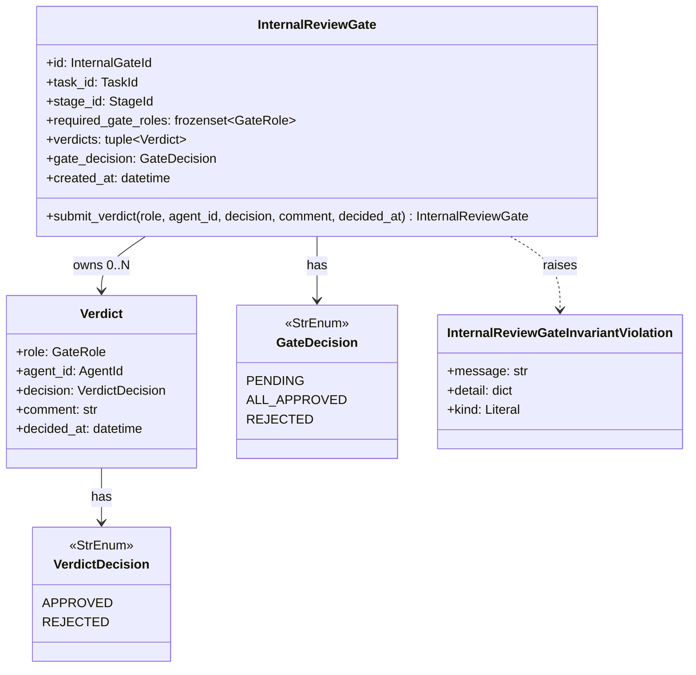

# 詳細設計書 — internal-review-gate / domain

> feature: `internal-review-gate` / sub-feature: `domain`
> 親 spec: [../feature-spec.md](../feature-spec.md)
> 関連: [basic-design.md](basic-design.md) / [`../../external-review-gate/domain/detailed-design.md`](../../external-review-gate/domain/detailed-design.md)（踏襲元パターン）

## 記述ルール（必ず守ること）

詳細設計に**疑似コード・サンプル実装（python/ts/sh/yaml 等の言語コードブロック）を書かない**。
ソースコードと二重管理になりメンテナンスコストしか生まない。
必要なのは「構造契約（属性名・型・制約）」と「確定文言（メッセージ文字列）」と「実装の意図」。

## クラス設計（詳細）

### Aggregate Root: InternalReviewGate

| 属性 | 型 | 制約 | 意図 |
|----|----|----|----|
| `id` | `InternalGateId`（UUIDv4）| 不変 | 一意識別 |
| `task_id` | `TaskId`（UUIDv4）| 不変、参照のみ | 対象タスク（参照整合性は application 層）|
| `stage_id` | `StageId`（UUIDv4）| 不変、参照のみ | 審査対象 Stage（同上）|
| `required_gate_roles` | `frozenset[GateRole]` | 不変、1件以上、各要素は slug パターン（§確定 E）| Workflow 設計時に確定した審査観点集合 |
| `verdicts` | `tuple[Verdict, ...]` | Pydantic v2 で tuple（frozen list 相当）、0件以上 | 提出済み Verdict の順序保持リスト |
| `gate_decision` | `GateDecision` | enum 3 値（PENDING / ALL_APPROVED / REJECTED）| Gate 全体の判断状態 |
| `created_at` | `datetime` | UTC、tz-aware、不変 | Gate 起票時刻 |

`model_config`:
- `frozen = True`
- `arbitrary_types_allowed = False`
- `extra = 'forbid'`

**不変条件（model_validator(mode='after')）**: 4 種

1. `_validate_required_gate_roles_nonempty` — required_gate_roles が非空であること（field_validator で空集合拒否）
2. `_validate_verdict_roles_in_required` — 全 Verdict の role が required_gate_roles のいずれかに含まれること
3. `_validate_no_duplicate_roles` — 同一 GateRole の Verdict が重複しないこと（Counter で重複検出）
4. `_validate_gate_decision_consistency` — gate_decision と verdicts の整合性（ALL_APPROVED: 全 required 提出済み + 全 APPROVED / REJECTED: 1 件以上 REJECTED / PENDING: それ以外）

**ふるまい（1 種、新インスタンス返却）**:
- `submit_verdict(role: GateRole, agent_id: AgentId, decision: VerdictDecision, comment: str, decided_at: datetime) -> InternalReviewGate`: 不変条件検査 → 新 Verdict 追加 → compute_decision → 新インスタンス返却

### Verdict VO（`domain/value_objects.py` 既存ファイル更新）

| 属性 | 型 | 制約 | 意図 |
|----|----|----|----|
| `role` | `GateRole`（str alias）| required_gate_roles のいずれかと一致（Aggregate 側で検査）| 提出した GateRole エージェントの観点識別子 |
| `agent_id` | `AgentId`（UUIDv4）| 不変 | 提出したエージェントの識別 |
| `decision` | `VerdictDecision` | APPROVED / REJECTED の 2 値 | 判定結果 |
| `comment` | `str` | 0〜5000文字、NFC 正規化 | フィードバックコメント（空可）|
| `decided_at` | `datetime` | UTC、tz-aware | Verdict 提出時刻（application 層で生成して引数渡し）|

`model_config`: frozen / extra='forbid' / arbitrary_types_allowed=False。

### Module: state_machine（`domain/internal_review_gate/state_machine.py`）

`compute_decision` 関数の判断ロジック（decision table）:

| 条件 | 優先度 | 結果 |
|------|-------|------|
| verdicts のいずれかが `VerdictDecision.REJECTED` | 最高（即時）| `GateDecision.REJECTED` |
| required_gate_roles の全 GateRole が `VerdictDecision.APPROVED` で提出済み | 高 | `GateDecision.ALL_APPROVED` |
| それ以外（未提出の GateRole が存在する）| 低 | `GateDecision.PENDING` |

| 関数 | 引数 | 戻り値 | 制約 |
|----|----|----|----|
| `compute_decision(verdicts: tuple[Verdict, ...], required_gate_roles: frozenset[GateRole]) -> GateDecision` | verdicts（提出済みリスト）/ required_gate_roles | GateDecision | 純粋関数。副作用なし |

ExternalReviewGate の state_machine と同じく `Final` + `MappingProxyType` でロック。compute_decision のロジックは module-level 定数の decision table として実装し、後続 PR による遷移追加を物理的に難しくする。

### Exception: InternalReviewGateInvariantViolation

| 属性 | 型 | 制約 |
|----|----|----|
| `message` | `str` | MSG-IRG-NNN 由来の文言（2 行構造）|
| `detail` | `dict[str, object]` | 違反の文脈 |
| `kind` | `Literal['role_already_submitted', 'gate_already_decided', 'comment_too_long', 'invalid_role', 'required_gate_roles_empty', 'verdict_role_invalid', 'duplicate_role_verdict', 'gate_decision_inconsistent']` | 違反種別 |

`Exception` 継承。`domain/exceptions.py` の他の例外（6 兄弟 + ExternalReviewGate）と統一フォーマット。

### Enum 追加（`domain/value_objects.py`）

| Enum | 値 | 用途 |
|---|---|---|
| `GateDecision` | PENDING / ALL_APPROVED / REJECTED | InternalReviewGate.gate_decision |
| `VerdictDecision` | APPROVED / REJECTED | Verdict.decision（2 値のみ、§確定 F）|

## 確定事項（先送り撤廃）

### 確定 A: submit_verdict × gate_decision の処理方針

`submit_verdict` が呼ばれたときの処理順を静的に凍結:

| ステップ | 条件 | 結果 |
|---------|------|------|
| 1. gate_decision 検査 | `gate_decision != PENDING` | `kind='gate_already_decided'` raise |
| 2. role 重複検査 | `role` が既存 verdicts に存在する | `kind='role_already_submitted'` raise |
| 3. comment 長検査 | `len(NFC(comment)) > 5000` | `kind='comment_too_long'` raise |
| 4. 新 Verdict 追加 | 上記通過 | 新 verdicts タプル生成 |
| 5. compute_decision | — | 新 gate_decision を算出 |
| 6. model_validate | — | 不変条件 4 種を model_validator で検査 |
| 7. 新インスタンス返却 | 不変条件通過 | 新 InternalReviewGate |

### 確定 B: pre-validate 方式（ExternalReviewGate 同パターン継承）

`submit_verdict` の手順:

| ステップ | 操作 |
|---------|------|
| 1 | 入口検査（gate_already_decided / role_already_submitted / comment_too_long）|
| 2 | `self.model_dump(mode='python')` で現状を dict 化 |
| 3 | 新 Verdict を追加し、compute_decision で gate_decision を更新 |
| 4 | `InternalReviewGate.model_validate(updated_dict)` を呼ぶ — `model_validator(mode='after')` が走る |
| 5 | 失敗時は `ValidationError` を `InternalReviewGateInvariantViolation` に変換して raise（元 Gate は変更されない）|

`model_copy(update=...)` は採用しない（6 兄弟同方針）。

### 確定 C: GateDecision 遷移の完全静的決定

REJECTED は APPROVED より優先度が高い（即時遷移）。1 件の REJECTED で ALL_APPROVED への道が閉じる設計は「明確な承認のみ前進を許可する（R1-F）」業務ルールと整合する。

| gate_decision 遷移 | 条件 |
|------------------|------|
| PENDING → REJECTED | 任意の Verdict が REJECTED |
| PENDING → ALL_APPROVED | 全 required_gate_roles の Verdict が APPROVED |
| PENDING → PENDING | 上記以外（未提出の GateRole が残る）|
| ALL_APPROVED / REJECTED → ANY | 禁止（submit_verdict 入口で gate_already_decided raise）|

### 確定 D: 不変条件 4 種の詳細検査ロジック

| 不変条件 | 検査タイミング | 判定ロジック |
|---------|------------|------------|
| ①required_gate_roles 非空 | field_validator / model_validator | `len(required_gate_roles) == 0` → raise |
| ②Verdict role が required_gate_roles に含まれる | model_validator | `all(v.role in required_gate_roles for v in verdicts)` が False → raise |
| ③同一 GateRole の Verdict 重複なし | model_validator | `Counter(v.role for v in verdicts)` の max > 1 → raise |
| ④gate_decision と verdicts の整合性 | model_validator | ALL_APPROVED: 全 required 提出済み + 全 APPROVED / REJECTED: 1件以上 REJECTED / PENDING: それ以外 |

### 確定 E: GateRole の文字列制約（slug パターン）

| 制約 | 内容 |
|------|------|
| 文字種 | 1〜40文字の小文字英数字とハイフンのみ |
| 先頭文字 | 数字先頭禁止 |
| ハイフン | 連続禁止（`--` 等）|
| 典型例 | `"reviewer"` / `"ux"` / `"security"` / `"code-review"` / `"accessibility"` |

Pydantic field_validator で slug パターン（正規表現）バリデーションを実装。`kind='invalid_role'` で raise。

### 確定 F: VerdictDecision は 2 値のみ（ambiguous 判定 = REJECTED 扱い）

`submit_verdict` の `decision` パラメータは `VerdictDecision` 型のみ受け付ける（APPROVED / REJECTED の 2 値）。

caller（application 層）が LLM 出力から判断を変換する責務を持つ:

| LLM 出力の分類 | caller の変換結果 |
|------------|----------------|
| 明確な承認表現（"承認" / "LGTM" / "OK" 等）| `VerdictDecision.APPROVED` |
| 明確な却下表現（"却下" / "NG" / "要修正" 等）| `VerdictDecision.REJECTED` |
| 曖昧な表現（"条件付き" / "どちらでも" 等）| `VerdictDecision.REJECTED`（§確定 R1-F）|

domain 層は 2 値型を Pydantic 型強制で保証。"ambiguous" 文字列を `VerdictDecision` として渡そうとすると `pydantic.ValidationError` が発生する。

### 確定 G: comment の正規化パイプライン

| 段階 | 動作 |
|------|------|
| 1 | 引数 `comment` を受け取る |
| 2 | `unicodedata.normalize('NFC', ...)` で NFC 正規化 |
| 3 | `len(normalized)` で Unicode コードポイント数を計上（**strip は適用しない**）|
| 4 | 範囲判定（`0 <= length <= 5000`）、5001 文字以上は `kind='comment_too_long'` raise |
| 5 | 通過時のみ `comment = normalized` として Verdict に保持 |

ExternalReviewGate の `feedback_text` 正規化パイプラインと同方針（NFC 正規化のみ、strip しない）。

### 確定 H: エラーメッセージ 2 行構造の統一規約

ExternalReviewGate の §確定 I（Room §確定 I 踏襲）と完全に同パターン:

| プレフィックス | 意味 |
|-------------|-----|
| `[FAIL]` | 処理中止を伴う失敗 |

全 MSG-IRG-001〜004 で「1 行目: 失敗内容（What）」+「2 行目: 次に何をすべきか（Next Action）」の 2 行構造を採用。test-design.md TC-UT-IRG-XXX で `assert "Next:" in str(exc)` を CI 物理保証。

### 確定 I: Aggregate 内検査と application 層検査の責務分離

| 検査項目 | Aggregate 内 | application 層 |
|---|---|---|
| gate_decision PENDING のみ Verdict 提出可 | ✓（submit_verdict 入口）| ✗ |
| required_gate_roles 非空 | ✓（field_validator）| ✗（ただし空集合なら Gate 非生成は application 層責務）|
| Verdict role が required_gate_roles に含まれる | ✓（不変条件②）| ✗ |
| 同一 GateRole 重複なし | ✓（不変条件③）| ✗ |
| gate_decision と verdicts の整合性 | ✓（不変条件④）| ✗ |
| task_id の Task 存在 | ✗ | ✓（InternalGateService.create() で TaskRepository.find_by_id）|
| stage_id の Stage 存在 | ✗ | ✓（同上 WorkflowRepository.find_by_id）|
| agent_id の Agent 存在 | ✗ | ✓（同上 AgentRepository.find_by_id）|
| Gate ALL_APPROVED → Task 次フェーズ連携 | ✗ | ✓（InternalGateService が submit_verdict 戻り値を確認して実行）|
| Gate REJECTED → Task 差し戻し | ✗ | ✓（同上）|

### 確定 J: テスト責務の 3 ファイル分割（500 行ルール準拠）

ExternalReviewGate（4 ファイル）の教訓を踏まえ、本 feature は最初から 3 ファイル分割:

| ファイル | 責務 |
|---|---|
| `test_internal_review_gate/test_construction.py` | 構築 + Pydantic 型検査 + frozen + extra='forbid' + 不変条件 4 種 |
| `test_internal_review_gate/test_submit_verdict.py` | submit_verdict 正常系 + 異常系（gate_already_decided / role_already_submitted / comment_too_long / invalid_role）+ MSG 文言照合 |
| `test_internal_review_gate/test_decision_logic.py` | compute_decision 全条件 + ALL_APPROVED / REJECTED 遷移 + 境界値 |

各ファイル 200 行を目安、500 行ルール厳守。

## ユーザー向けメッセージの確定文言

### プレフィックス統一

| プレフィックス | 意味 |
|--------------|-----|
| `[FAIL]` | 処理中止を伴う失敗 |

### MSG 確定文言表

各メッセージは **「失敗内容（What）」+「次に何をすべきか（Next Action）」の 2 行構造**を採用する（§確定 H、ExternalReviewGate §確定 I 踏襲）。

| ID | 例外型 | 出力先 | 文言（1 行目: failure / 2 行目: next action）|
|----|------|-------|---|
| MSG-IRG-001 | `InternalReviewGateInvariantViolation(kind='role_already_submitted')` | stderr | `[FAIL] GateRole "{role}" は既に判定を提出済みです。` / `Next: 別の GateRole エージェントとして判定を提出してください。` |
| MSG-IRG-002 | `InternalReviewGateInvariantViolation(kind='gate_already_decided')` | stderr | `[FAIL] InternalReviewGate は既に判断確定済みです（{gate_decision}）。` / `Next: 新しい Gate が生成されるまでお待ちください。` |
| MSG-IRG-003 | `InternalReviewGateInvariantViolation(kind='comment_too_long')` | stderr | `[FAIL] コメントが文字数上限（5000文字）を超えています（{length}文字）。` / `Next: 5000文字以内に短縮してください。` |
| MSG-IRG-004 | `InternalReviewGateInvariantViolation(kind='invalid_role')` | stderr | `[FAIL] GateRole "{role}" は本 Gate の required_gate_roles に含まれていません。` / `Next: 有効な GateRole（{required_gate_roles}）で提出してください。` |

##### 「Next:」行の役割（フィードバック原則、ExternalReviewGate 踏襲）

- 例外 message / API レスポンスの `error.next_action` / CLI stderr 2 行目に**同一文言**
- i18n 入口、将来の http-api sub-feature で国際化キーとして利用
- test-design.md TC-UT-IRG-NNN で `assert "Next:" in str(exc)` を CI 物理保証

メッセージはプレースホルダ `{...}` を f-string 形式で展開。

## データ構造（永続化キー）

該当なし — 理由: 本 feature は domain 層のみで永続化スキーマは含まない。永続化は将来の `internal-review-gate/repository/` sub-feature で扱う。参考の概形は basic-design.md §ER 図 を参照。

masking 対象（将来の repository sub-feature 責務、本 PR スコープ外）: `internal_review_gate_verdicts.comment`。

## API エンドポイント詳細

該当なし — 理由: 本 feature は domain 層のみ。API は将来の `internal-review-gate/http-api/` sub-feature で凍結する。

## Known Issues（申し送り）

### 申し送り #1: Repository 配線時の `verdicts[*].comment` マスキング

将来の repository sub-feature で `internal_review_gate_verdicts.comment` カラムを `MaskedText` で配線する責務（ExternalReviewGate repository / agent-repository PR #43 の Schneier #3 実適用パターンを踏襲）。本 PR では VO 構造定義まで、Repository 配線は範囲外。

### 申し送り #2: Workflow.Stage.required_gate_roles 属性追加

`feature/workflow` の `domain/basic-design.md` 更新が先行する必要がある。Stage に `required_gate_roles: frozenset[str]` 属性が追加されていない現状では、UC-IRG-001（CEO が Stage に required_gate_roles を設定できる）の business logic が成立しない。本 PR スコープ外だが、設計書更新は別 PR で先行させる。

### 申し送り #3: Gate ALL_APPROVED / REJECTED → Task 連携の application 層実装

`InternalGateService.submit_verdict()` 完了後の gate_decision 確認 → `task.advance()` / `task.rollback_stage()` dispatch は application 層 `InternalGateService` の責務。本 PR は domain 層のみ（Task Aggregate を import しない）。

## 出典・参考

- [`../../external-review-gate/domain/detailed-design.md`](../../external-review-gate/domain/detailed-design.md) — 踏襲元パターン（pre-validate / frozen / state_machine / 2 行エラー構造）
- [`../../task/detailed-design.md`](../../task/detailed-design.md) §確定 A-2 — dispatch 表パターンの先例
- [`../../room/detailed-design.md`](../../room/detailed-design.md) §確定 I — 例外型統一規約 + MSG 2 行構造の先例
- [Pydantic v2 — model_validator / model_validate](https://docs.pydantic.dev/latest/concepts/validators/)
- [Pydantic v2 — frozen models](https://docs.pydantic.dev/latest/concepts/models/)
