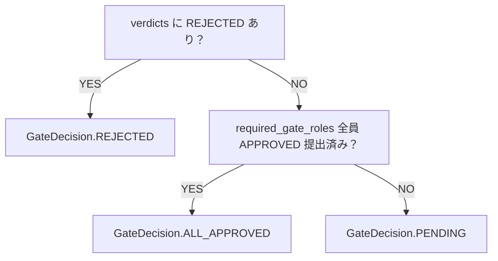

# テスト設計書 — internal-review-gate / domain

<!-- feature: internal-review-gate / sub-feature: domain -->
<!-- 配置先: docs/features/internal-review-gate/domain/test-design.md -->
<!-- 対象範囲: REQ-IRG-001〜004 / MSG-IRG-001〜004 / 親 spec §9 受入基準 1〜12 / 詳細設計 §確定 A〜J / compute_decision 全条件 + 4 不変条件 + GateDecision 遷移 + VerdictDecision 2 値 + comment 境界値 + 2 行エラー構造 -->

本 sub-feature は domain 層の Aggregate Root（InternalReviewGate）+ VO（Verdict）+ enum（GateDecision / VerdictDecision）+ 例外（InternalReviewGateInvariantViolation）に閉じる。HTTP API / CLI / UI の公開エントリポイントは持たないため、E2E は親 [`../system-test-design.md`](../system-test-design.md) が管理する（TC-ST-IRG-001〜004）。本 sub-feature のテストは **ユニット主体 + Aggregate 内 module 連携 + compute_decision 全条件網羅 + 業務ルール物理保証** で構成する。

ExternalReviewGate domain と完全に同じ規約を踏襲（外部 I/O ゼロ・factory に `_meta.synthetic = True` の `WeakValueDictionary` レジストリ）。**最初から 3 ファイル分割**（500 行ルール、詳細設計 §確定 J 準拠）。

## テストマトリクス

| 要件ID | 実装アーティファクト | テストケースID | テストレベル | 種別 | 受入基準 |
|--------|-------------------|---------------|------------|------|---------|
| REQ-IRG-001（構築）| `InternalReviewGate.__init__` / `model_validator(mode='after')` | TC-UT-IRG-001 | ユニット | 正常系 | 2 |
| REQ-IRG-001（空集合拒否）| required_gate_roles 空集合 → raise | TC-UT-IRG-002 | ユニット | 異常系 | 2 |
| REQ-IRG-002（submit_verdict 正常系）| `submit_verdict` APPROVED 提出 → PENDING 継続 | TC-UT-IRG-003 | ユニット | 正常系 | 3 |
| REQ-IRG-002 + REQ-IRG-003（ALL_APPROVED）| 全 GateRole APPROVED → ALL_APPROVED 遷移 | TC-UT-IRG-004 | ユニット | 正常系 | 4 |
| REQ-IRG-002 + REQ-IRG-003（REJECTED）| 1件 REJECTED → REJECTED 遷移（残り未提出でも即遷移）| TC-UT-IRG-005 | ユニット | 正常系 | 5 |
| REQ-IRG-002（role 重複拒否）| 同一 GateRole 重複提出 → raise | TC-UT-IRG-006 | ユニット | 異常系 | 6 |
| REQ-IRG-002（確定後拒否）| ALL_APPROVED 確定後の追加 Verdict → raise | TC-UT-IRG-007 | ユニット | 異常系 | 7 |
| REQ-IRG-002（comment 境界値）| comment 5000文字（OK）/ 5001文字（NG）| TC-UT-IRG-008 | ユニット | 境界値 | 11 |
| REQ-IRG-004（不変条件①: required_gate_roles 非空）| required_gate_roles 空集合 → raise | TC-UT-IRG-002 | ユニット | 異常系 | 2 |
| REQ-IRG-004（不変条件②: Verdict role が required_gate_roles に含まれる）| 非含有 role で提出 → raise | TC-UT-IRG-009 | ユニット | 異常系 | 3 |
| REQ-IRG-004（不変条件③: 同一 GateRole の Verdict 重複なし）| 同一 GateRole 重複提出 → raise | TC-UT-IRG-006 | ユニット | 異常系 | 6 |
| REQ-IRG-004（不変条件④: gate_decision と verdicts の整合性）| gate_decision / verdicts 整合性違反（不正状態直接構築）| TC-UT-IRG-010 | ユニット | 異常系 | 4, 5 |
| MSG-IRG-001（role_already_submitted）| 重複提出 → `[FAIL]...` + `Next:` | TC-UT-IRG-006 | ユニット | 異常系 | 6 |
| MSG-IRG-002（gate_already_decided）| 確定後提出 → `[FAIL]...` + `Next:` | TC-UT-IRG-007 | ユニット | 異常系 | 7 |
| MSG-IRG-003（comment_too_long）| 5001文字 comment → `[FAIL]...` + `Next:` | TC-UT-IRG-008 | ユニット | 異常系 | 11 |
| MSG-IRG-004（invalid_role）| 無効 role → `[FAIL]...` + `Next:` | TC-UT-IRG-009 | ユニット | 異常系 | Q-3 |
| §確定 C（GateDecision 遷移 静的決定）| compute_decision 全条件 | TC-UT-IRG-004, TC-UT-IRG-005 | ユニット | 正常系 | 4, 5 |
| §確定 F（VerdictDecision 2 値のみ）| ambiguous 文字列は型エラー | TC-UT-IRG-011 | ユニット | 異常系 | Q-3 |
| §確定 G（comment NFC + strip しない）| 前後改行保持、NFC 合成形 / 分解形同一視 | TC-UT-IRG-012 | ユニット | 正常系 | Q-3 |
| §確定 H（2 行エラー構造）| 全 MSG-IRG で `Next:` hint 物理保証 | TC-UT-IRG-013〜016 | ユニット | 異常系 | Q-3 |
| §確定 I（責務分離）| 参照整合性は Aggregate 内で強制しない | TC-UT-IRG-017 | ユニット | 正常系 | Q-3 |
| frozen 不変性 | `gate.gate_decision = X` 直接代入拒否 | TC-UT-IRG-018 | ユニット | 異常系 | Q-3 |
| frozen 構造的等価 | 同一属性 Gate 2 インスタンスが `==` True | TC-UT-IRG-019 | ユニット | 正常系 | Q-3 |
| `extra='forbid'` | 未知フィールド拒否 | TC-UT-IRG-020 | ユニット | 異常系 | Q-3 |
| 結合シナリオ 1 | Gate lifecycle 完走（PENDING → ALL_APPROVED）| TC-IT-IRG-001 | 結合 | 正常系 | 2, 3, 4 |
| 結合シナリオ 2 | REJECTED 経路（1件 REJECTED → 即遷移）| TC-IT-IRG-002 | 結合 | 正常系 | 5 |

**マトリクス充足の証拠**:

- REQ-IRG-001〜004 すべてに最低 1 件のテストケース
- **compute_decision 全 3 条件網羅**: REJECTED 即遷移（TC-UT-IRG-005）/ ALL_APPROVED（TC-UT-IRG-004）/ PENDING 継続（TC-UT-IRG-003）
- **不変条件 4 種**: required_gate_roles 非空（TC-UT-IRG-002）/ Verdict role 含有（TC-UT-IRG-009）/ 重複なし（TC-UT-IRG-006）/ gate_decision 整合性（TC-UT-IRG-010）
- **MSG 2 行構造 + Next: hint（§確定 H）**: TC-UT-IRG-013〜016 で全 4 MSG-IRG で `assert "Next:" in str(exc)` を CI 強制
- 親 spec 受入基準 1〜12 すべてに unit/integration または system-test ケース

## 外部 I/O 依存マップ

| 外部 I/O | 用途 | raw fixture | factory | characterization 状態 |
|--------|-----|------------|---------|---------------------|
| **該当なし** | Gate / Verdict は domain 層単独で外部 I/O を持たない（HTTP / DB / ファイル / 時刻 / LLM いずれも未依存）| — | — | **不要（外部 I/O ゼロ）** |
| `unicodedata.normalize('NFC', ...)` | comment 正規化 | — | — | 不要（CPython 標準ライブラリ仕様）|
| `datetime.now(UTC)` | `decided_at`（application 層で生成して引数渡し）| — | — | 不要（Aggregate 内で時刻を取得しない）|

**factory（合成データ）**:

| factory | 出力 | `_meta.synthetic` 付与 |
|--------|-----|------------------|
| `GateFactory` | `InternalReviewGate`（valid デフォルト = `gate_decision=PENDING`、`verdicts=[]`、`required_gate_roles={"reviewer","ux","security"}`）| `True` |
| `AllApprovedGateFactory` | `InternalReviewGate`（gate_decision=ALL_APPROVED、全 required_gate_roles の APPROVED Verdict 付き）| `True` |
| `RejectedGateFactory` | `InternalReviewGate`（gate_decision=REJECTED、1件以上の REJECTED Verdict 付き）| `True` |
| `VerdictFactory` | `Verdict`（valid デフォルト = decision=APPROVED、comment=''）| `True` |

## システムテストケース

システムテスト（E2E）は親 [`../system-test-design.md`](../system-test-design.md) が管理する（TC-ST-IRG-001〜004）。本 sub-feature（domain）は domain 層単独で外部 I/O を持たないため、E2E テストケースはここでは定義しない。

| テストID | ペルソナ | シナリオ | 操作手順 | 期待結果 |
|---------|---------|---------|---------|---------|
| 該当なし — E2E は親 system-test-design.md が管理 | — | — | — | — |

## 結合テストケース

domain 層単独の本 feature では「結合」を **Aggregate 内 module 連携 + Gate lifecycle 完走シナリオ** と定義。外部 I/O ゼロ。

| テストID | 対象モジュール連携 | 使用 fixture | 前提条件 | 操作 | 期待結果 |
|---------|------------------|--------------|---------|------|---------|
| TC-IT-IRG-001 | Gate lifecycle 完走（PENDING → ALL_APPROVED）| GateFactory + VerdictFactory | required_gate_roles={"reviewer","ux"} の Gate | 1) reviewer が APPROVED 提出（PENDING 継続、verdicts=[1件]）→ 2) ux が APPROVED 提出（ALL_APPROVED 遷移、verdicts=[2件]）→ 3) ALL_APPROVED 後に追加 Verdict 試行（MSG-IRG-002 raise）| ALL_APPROVED 遷移完走、追加 Verdict 拒否、全属性の整合性保持 |
| TC-IT-IRG-002 | REJECTED 経路（1件 REJECTED → 即遷移、残り未提出でも）| GateFactory | required_gate_roles={"reviewer","ux","security"} の Gate | 1) reviewer が REJECTED 提出（REJECTED 遷移、verdicts=[1件]）→ 2) REJECTED 後に ux が APPROVED 提出試行（MSG-IRG-002 raise）| REJECTED 即遷移、残り未提出でも追加不可、フィードバック comment が記録される |

## ユニットテストケース

`tests/factories/internal_review_gate.py` の factory 経由で入力を生成。

### 構築 + 不変条件（test_construction.py、受入基準 1, 2）

| テストID | 対象 | 種別 | 入力 | 期待結果 |
|---------|-----|------|------|---------|
| TC-UT-IRG-001 | `Gate(...)` 正常構築（3 GateRole 指定）| 正常系 | required_gate_roles={"reviewer","ux","security"}, verdicts=[], gate_decision=PENDING | 構築成功、`gate_decision=PENDING`、`verdicts=tuple()`、`created_at` tz-aware UTC |
| TC-UT-IRG-002 | required_gate_roles 空集合 → raise | 異常系 | required_gate_roles=frozenset() | `InternalReviewGateInvariantViolation`（kind='required_gate_roles_empty'）|
| TC-UT-IRG-010 | gate_decision / verdicts 整合性違反（不正状態直接構築）| 異常系 | gate_decision=ALL_APPROVED + verdicts=[]（不整合）/ gate_decision=PENDING + REJECTED Verdict 付き（不整合）| 各々 `InternalReviewGateInvariantViolation`（kind='gate_decision_inconsistent'）|
| TC-UT-IRG-018 | frozen 不変性 | 異常系 | `gate.gate_decision = ALL_APPROVED` 直接代入 | `pydantic.ValidationError`（frozen instance への代入拒否）|
| TC-UT-IRG-019 | frozen 構造的等価 / hash | 正常系 | 全属性同値の Gate 2 インスタンス | `==` True、`hash()` 一致 |
| TC-UT-IRG-020 | `extra='forbid'` 未知フィールド拒否 | 異常系 | `Gate.model_validate({...,'unknown': 'x'})` | `pydantic.ValidationError`（extra 違反）|

### submit_verdict 正常系 + 異常系（test_submit_verdict.py、受入基準 3〜7, 11）

| テストID | 対象 | 種別 | 入力 | 期待結果 |
|---------|-----|------|------|---------|
| TC-UT-IRG-003 | APPROVED Verdict 提出（1/3 提出）→ PENDING 継続 | 正常系 | required_gate_roles={"reviewer","ux","security"} の Gate、reviewer が APPROVED 提出 | 新 Gate の gate_decision=PENDING、verdicts=[1件]、元 Gate 不変 |
| TC-UT-IRG-004 | 全 GateRole APPROVED 提出 → ALL_APPROVED 遷移 | 正常系 | 2 GateRole の Gate、両 GateRole が APPROVED 提出 | 最終 Gate の gate_decision=ALL_APPROVED、verdicts=[2件] |
| TC-UT-IRG-005 | 1件 REJECTED → REJECTED 遷移（残り未提出でも即遷移）| 正常系 | 3 GateRole の Gate、security が REJECTED 提出（reviewer / ux は未提出）| gate_decision=REJECTED、verdicts=[1件]（残り 2 件未提出）、comment 記録 |
| TC-UT-IRG-006 | 同一 GateRole 重複提出 → raise | 異常系 | PENDING Gate に reviewer APPROVED 提出済み → 再度 reviewer から提出 | `InternalReviewGateInvariantViolation(kind='role_already_submitted')`、MSG-IRG-001 |
| TC-UT-IRG-007 | ALL_APPROVED 確定後の追加 Verdict → raise | 異常系 | ALL_APPROVED の Gate に追加 Verdict 提出 | `InternalReviewGateInvariantViolation(kind='gate_already_decided')`、MSG-IRG-002 |
| TC-UT-IRG-008 | comment 境界値テスト | 境界値 | comment='' (OK) / "a"*5000 (OK) / "a"*5001 (NG) / NFC 後 5000文字 (OK) | 0 / 5000 文字は提出成功、5001 文字は MSG-IRG-003 |
| TC-UT-IRG-009 | required_gate_roles 非含有 role で提出 → raise | 異常系 | required_gate_roles={"reviewer","ux"} の Gate に role="security" で提出 | `InternalReviewGateInvariantViolation(kind='invalid_role')`、MSG-IRG-004 |
| TC-UT-IRG-011 | VerdictDecision 2 値のみ（§確定 F）| 異常系 | `decision="ambiguous"` / `decision="maybe"` 等の不正値 | `pydantic.ValidationError`（VerdictDecision 型違反）|
| TC-UT-IRG-012 | comment の NFC + strip しない（§確定 G）| 正常系 | comment='承認\n前後改行あり\n'（前後改行）/ 分解形 NFC → 合成形 | 構築成功、改行・空白保持、NFC 合成形で保持 |
| TC-UT-IRG-017 | application 層責務（参照整合性は Aggregate で強制しない）| 正常系 | 存在しない task_id / stage_id / agent_id を渡して Gate 構築 / Verdict 提出 | 構築・提出成功（Aggregate は VO 型保持のみ）|

### compute_decision + GateDecision 遷移（test_decision_logic.py、受入基準 4, 5）



| テストID | 対象 | 種別 | 入力 | 期待結果 |
|---------|-----|------|------|---------|
| TC-UT-IRG-004（再掲）| compute_decision → ALL_APPROVED | 正常系 | 全 required_gate_roles APPROVED | GateDecision.ALL_APPROVED |
| TC-UT-IRG-005（再掲）| compute_decision → REJECTED（即時）| 正常系 | 1件 REJECTED（残り未提出）| GateDecision.REJECTED |
| TC-UT-IRG-003（再掲）| compute_decision → PENDING | 正常系 | 一部 APPROVED（全員ではない）| GateDecision.PENDING |

### MSG 2 行構造 + Next: hint（全 4 MSG-IRG、Q-3 / §確定 H）

| テストID | 対象 | 種別 | 入力 | 期待結果 |
|---------|-----|------|------|---------|
| TC-UT-IRG-013 | MSG-IRG-001 (role_already_submitted) Next: hint | 異常系 | 同一 role 重複提出 | 1 行目: `[FAIL] GateRole` で始まる、2 行目: **`Next:`** + `"別の GateRole" in str(exc)` |
| TC-UT-IRG-014 | MSG-IRG-002 (gate_already_decided) Next: hint | 異常系 | 確定済み Gate に追加 Verdict | 1 行目: `[FAIL] InternalReviewGate は既に` で始まる、2 行目: **`Next:`** + `"新しい Gate" in str(exc)` |
| TC-UT-IRG-015 | MSG-IRG-003 (comment_too_long) Next: hint | 異常系 | comment 5001文字 | 1 行目: `[FAIL] コメントが文字数上限` で始まる、2 行目: **`Next:`** + `"5000文字以内" in str(exc)` |
| TC-UT-IRG-016 | MSG-IRG-004 (invalid_role) Next: hint | 異常系 | required_gate_roles 非含有 role | 1 行目: `[FAIL] GateRole` + `required_gate_roles に含まれていません` 、2 行目: **`Next:`** + `"有効な GateRole" in str(exc)` |

## カバレッジ基準

- REQ-IRG-001〜004 すべてに最低 1 件のテストケース
- **compute_decision 全 3 条件**が独立した正常系で網羅（REJECTED 即遷移 / ALL_APPROVED / PENDING 継続）
- **不変条件 4 種** 全種に独立 unit ケース（required_gate_roles 非空 / Verdict role 含有 / 重複なし / gate_decision 整合性）
- **MSG 2 行構造 + Next: hint**: TC-UT-IRG-013〜016 で全 4 MSG-IRG で `assert "Next:" in str(exc)` を CI 強制
- **Q-3（内部実装契約の物理保証）**: frozen 不変性（TC-UT-IRG-018）/ 構造的等価（TC-UT-IRG-019）/ extra='forbid'（TC-UT-IRG-020）/ VerdictDecision 2 値のみ（TC-UT-IRG-011）/ comment NFC（TC-UT-IRG-012）/ MSG 2 行構造（TC-UT-IRG-013〜016）/ 責務分離（TC-UT-IRG-017）で全件 CI 強制
- **T1〜T3 の各脅威が最低 1 件のテストケースで有効性を確認**:
  - T1（不正 GateRole）: TC-UT-IRG-009 で invalid_role raise を確認
  - T2（ambiguous 悪用）: TC-UT-IRG-011 で VerdictDecision 型エラーを確認
  - T3（secret 混入）: Aggregate 内では raw 保持のみ（Repository sub-feature で MaskedText 確認）
- 親 spec 受入基準 #1〜#12 すべてに unit / integration / system-test ケース（#8〜#10, #12 は system-test-design.md で管理）
- Q-2（feature-spec §10）: `domain/internal_review_gate/` カバレッジ **90% 以上**

## テストディレクトリ構造

```
backend/
  tests/
    factories/
      internal_review_gate.py                  # 新規: GateFactory / AllApprovedGateFactory /
                                               # RejectedGateFactory / VerdictFactory
    domain/
      internal_review_gate/
        __init__.py
        test_integration.py                    # TC-IT-IRG-001/002（Gate lifecycle 完走シナリオ）
        test_internal_review_gate/             # 3 ファイル分割（最初から、500 行ルール）
          __init__.py
          test_construction.py                 # TC-UT-IRG-001/002/010/018/019/020
          test_submit_verdict.py               # TC-UT-IRG-003/004/005/006/007/008/009/011/012/017/013〜016
          test_decision_logic.py               # compute_decision 全条件（TC-UT-IRG-003/004/005 再掲）
```

## 人間が動作確認できるタイミング

- CI 統合後: `gh pr checks` で全ジョブ緑
- ローカル: `cd backend && uv run pytest tests/domain/internal_review_gate/ -v` → 全テスト緑
- 不変条件違反の実観測: 重複提出で MSG-IRG-001 が出ることを目視
- ALL_APPROVED の実観測: 全 GateRole APPROVED 提出後に gate_decision=ALL_APPROVED を目視
- REJECTED 即遷移の実観測: 1件 REJECTED 提出で gate_decision=REJECTED（残り未提出でも）を目視
- comment 境界値の実観測: 5000文字で成功、5001文字で MSG-IRG-003 を目視

## 未決課題・要起票 characterization task

| # | タスク | 起票先 | 備考 |
|---|-------|--------|------|
| 申し送り #1 | `verdicts[*].comment` の `MaskedText` 配線 | `internal-review-gate/repository/`（将来起票）| ExternalReviewGate repository / agent-repository PR #43 の Schneier #3 実適用パターンを踏襲 |
| 申し送り #2 | `Workflow.Stage.required_gate_roles` 属性追加 | `feature/workflow`（別 PR 先行）| domain 設計書更新が先行必須 |
| 申し送り #3 | Gate ALL_APPROVED / REJECTED → Task 連携 application 層実装 | `feature/internal-review-gate-application`（後続起票）| InternalGateService.submit_verdict() 完了後の task.advance() / task.rollback_stage() dispatch |

## レビュー観点（テスト設計レビュー時）

- [ ] REQ-IRG-001〜004 すべてに 1 件以上のテストケース
- [ ] **compute_decision 全 3 条件**が独立した正常系で網羅
- [ ] **不変条件 4 種** 全種に独立 unit ケース
- [ ] **MSG 2 行構造 + Next: hint**: TC-UT-IRG-013〜016 で全 4 MSG-IRG で `assert "Next:" in str(exc)` を CI 強制
- [ ] REJECTED 即遷移（残り未提出でも）が TC-UT-IRG-005 で物理確認
- [ ] VerdictDecision 2 値のみが TC-UT-IRG-011 で型エラーとして物理確認
- [ ] frozen 不変性 + 構造的等価 + extra='forbid' が独立検証
- [ ] T1〜T3 の各脅威が最低 1 件のテストケースで確認
- [ ] 後続申し送り 3 件（Repository マスキング配線 / Workflow Stage 属性追加 / application 層 Task 連携）が PR 本文に明示
