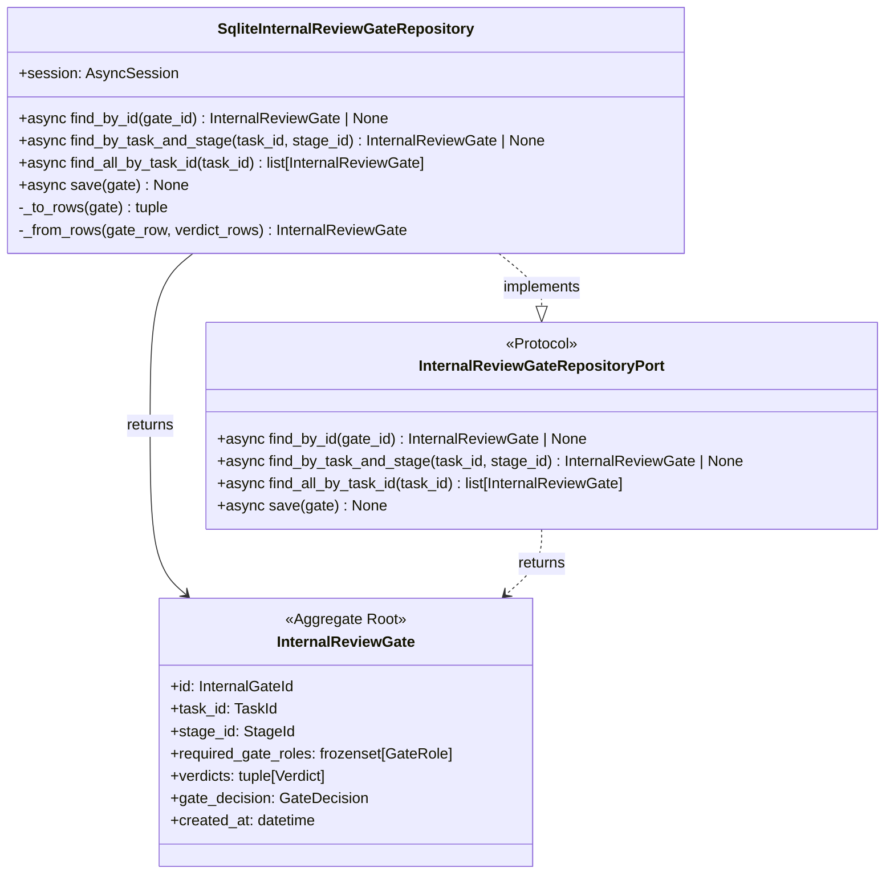
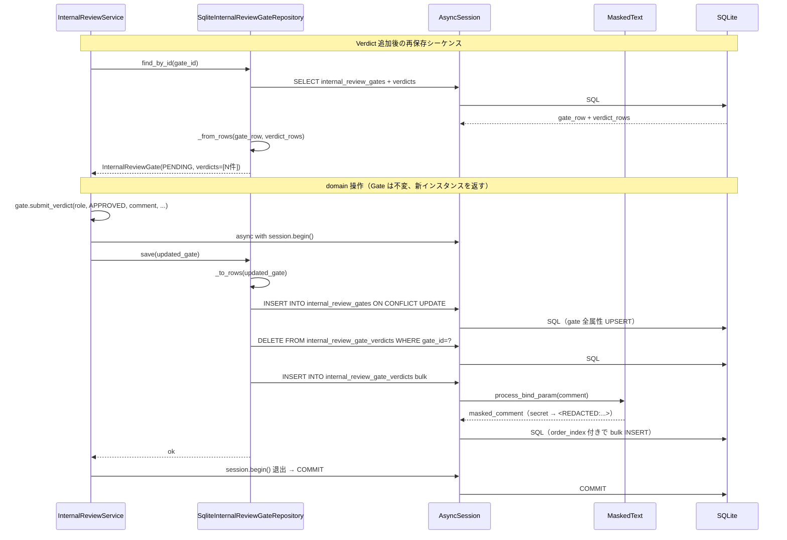
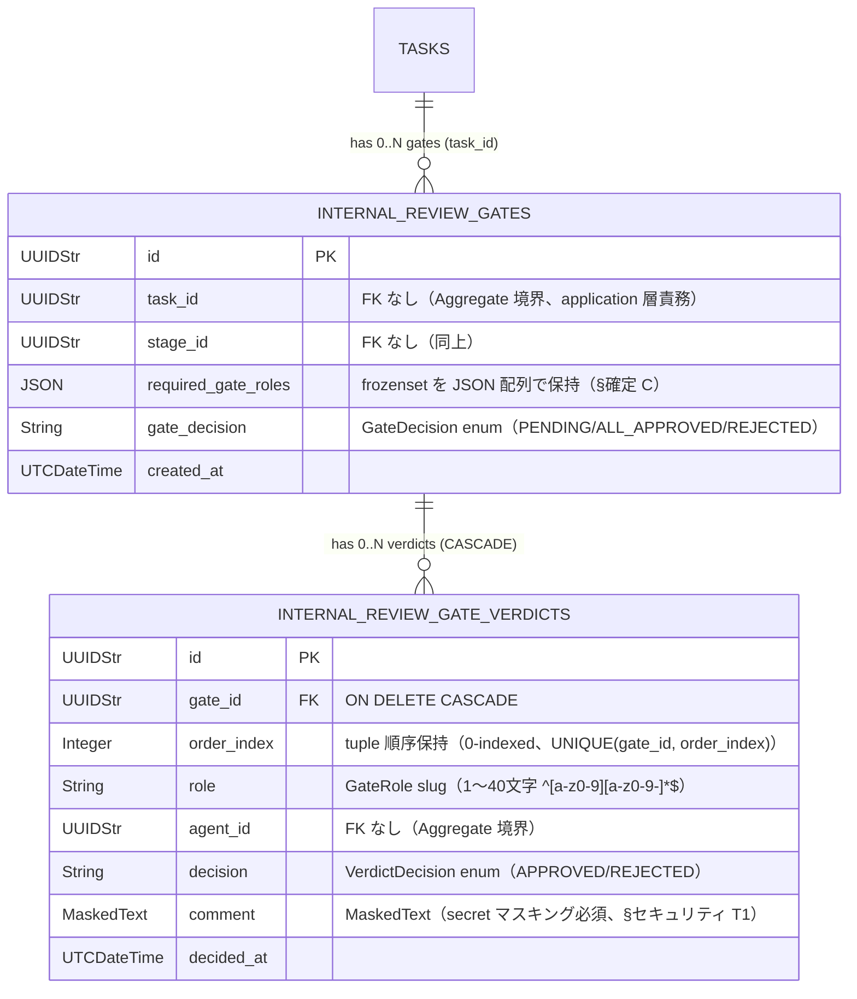

# 基本設計書 — internal-review-gate / repository

> feature: `internal-review-gate` / sub-feature: `repository`
> 親業務仕様: [`../feature-spec.md`](../feature-spec.md)
> 関連: [`../domain/basic-design.md`](../domain/basic-design.md) / [`../domain/detailed-design.md §ER 図`](../domain/detailed-design.md) / [`../../room/repository/basic-design.md`](../../room/repository/basic-design.md)（踏襲元パターン）
> 担当 Issue: [#164 feat(M5-B): InternalReviewGate infrastructure実装](https://github.com/bakufu-dev/bakufu/issues/164)

## 本書の役割

本書は **階層 3: internal-review-gate / repository の基本設計**（Module-level Basic Design）を凍結する。InternalReviewGate Aggregate（domain sub-feature で実装済み）の永続化レイヤーを設計し、SQLite への CRUD 操作と masking 配線を確定する。

**書くこと**:
- モジュール構成（Port + SQLite 実装 + Alembic migration）
- モジュール契約（機能要件の入出力）
- クラス設計（概要）
- 処理フロー / シーケンス図 / ER 図 / セキュリティ設計

**書かないこと**（後段の設計書へ追い出す）:
- 属性の型・制約 → [`detailed-design.md §確定事項`](detailed-design.md)
- MSG 確定文言 → [`detailed-design.md §MSG 確定文言表`](detailed-design.md)

## 記述ルール（必ず守ること）

基本設計に **疑似コード・サンプル実装（python/ts/sh/yaml 等の言語コードブロック）を書かない**。
ソースコードと二重管理になりメンテナンスコストしか生まない。

## §モジュール契約（機能要件）

> 本 §は親 [`feature-spec.md`](../feature-spec.md) §9 受入基準 #12（再起動跨ぎ保持）および業務ルール R1-A（独立 Aggregate）と紐付く。

| 要件 ID | 要件 | 入力 | 処理 | 出力 | エラー時 |
|--------|------|------|------|------|---------|
| REQ-IRG-R001 | `InternalReviewGateRepositoryPort` を `application/ports/internal_review_gate_repository.py` に定義する | — | `find_by_id` / `find_by_task_and_stage` / `find_all_by_task_id` / `save` の 4 method を `async def` で宣言、`@runtime_checkable` なし（room §確定 R1-A 踏襲） | Protocol 型 | — |
| REQ-IRG-R002 | `SqliteInternalReviewGateRepository` が `InternalReviewGateRepositoryPort` Protocol を満たす | `AsyncSession` | 4 method を SQLite + SQLAlchemy AsyncSession で実装。`verdicts[*].comment` は `MaskedText` TypeDecorator 経由でマスキング（§セキュリティ設計 T1） | Protocol 充足（pyright strict pass） | — |
| REQ-IRG-R003 | `save(gate)` が同一 Tx 内で `internal_review_gates` UPSERT + `internal_review_gate_verdicts` DELETE/bulk INSERT を行う | `InternalReviewGate` | (1) `internal_review_gates` UPSERT（gate 全属性）、(2) `internal_review_gate_verdicts` DELETE（gate_id 一致）、(3) `internal_review_gate_verdicts` bulk INSERT（verdicts タプルの全要素を order_index 付きで登録）| None（Tx は呼び出し側 service が `async with session.begin()` で管理） | `sqlalchemy.IntegrityError` を上位伝播 |
| REQ-IRG-R004 | Alembic revision `0016_internal_review_gate` で 2 テーブル追加 | `alembic upgrade head` | `internal_review_gates` + `internal_review_gate_verdicts` テーブル作成、FK 設定、非 UNIQUE INDEX 設定、`down_revision="0015_deliverable_records"` | Migration 適用成功 | `alembic.util.exc.CommandError` / `sqlalchemy.exc.OperationalError` |

**依存先**:
- 親 [`feature-spec.md`](../feature-spec.md) §7 業務ルール R1-A〜G（永続化保持 / verdicts masking）
- [`domain/`](../domain/) sub-feature の `InternalReviewGate` / `GateDecision` / `VerdictDecision` / `Verdict` Aggregate（M1 マージ済み）
- `feature/persistence-foundation`（`MaskedText` TypeDecorator、domain_event_outbox、WAL mode）

## モジュール構成

| 機能 ID | モジュール | ディレクトリ | 責務 |
|--------|----------|------------|------|
| REQ-IRG-R001 | `InternalReviewGateRepositoryPort` Protocol | `backend/src/bakufu/application/ports/internal_review_gate_repository.py` | Repository Port 定義（4 method）|
| REQ-IRG-R002 | `SqliteInternalReviewGateRepository` | `backend/src/bakufu/infrastructure/persistence/sqlite/repositories/internal_review_gate_repository.py` | SQLite 実装、§確定 A〜E |
| REQ-IRG-R002 | テーブル定義 (gates) | `backend/src/bakufu/infrastructure/persistence/sqlite/tables/internal_review_gates.py` | `InternalReviewGateRow` SQLAlchemy 宣言的マッピング |
| REQ-IRG-R002 | テーブル定義 (verdicts) | `backend/src/bakufu/infrastructure/persistence/sqlite/tables/internal_review_gate_verdicts.py` | `InternalReviewGateVerdictRow` SQLAlchemy 宣言的マッピング（`MaskedText` comment）|
| REQ-IRG-R004 | Alembic revision 0016 | `backend/alembic/versions/0016_internal_review_gate.py` | 2 テーブル追加、FK、非 UNIQUE INDEX |

```
ディレクトリ構造（本 sub-feature で追加・変更されるファイル）:

.
├── backend/
│   ├── alembic/
│   │   └── versions/
│   │       └── 0016_internal_review_gate.py             # 新規: 2 テーブル + FK + INDEX
│   ├── src/
│   │   └── bakufu/
│   │       ├── application/
│   │       │   └── ports/
│   │       │       └── internal_review_gate_repository.py # 新規: Protocol（4 method）
│   │       └── infrastructure/
│   │           └── persistence/
│   │               └── sqlite/
│   │                   ├── repositories/
│   │                   │   └── internal_review_gate_repository.py # 新規: SqliteInternalReviewGateRepository
│   │                   └── tables/
│   │                       ├── internal_review_gates.py           # 新規: InternalReviewGateRow
│   │                       └── internal_review_gate_verdicts.py   # 新規: InternalReviewGateVerdictRow (MaskedText comment)
│   └── tests/
│       └── infrastructure/
│           └── persistence/
│               └── sqlite/
│                   └── repositories/
│                       └── test_internal_review_gate_repository/  # 新規ディレクトリ（500 行ルール）
│                           ├── __init__.py
│                           ├── test_protocol_crud.py
│                           ├── test_save_semantics.py
│                           └── test_masking_comment.py
└── docs/
    └── features/
        └── internal-review-gate/
            └── repository/                                 # 本 sub-feature 設計書 3 本
```

## クラス設計（概要）



**凝集のポイント**:
- `InternalReviewGateRepositoryPort` は application 層に置き、domain は知らない（empire-repo §確定 A 踏襲）
- `SqliteInternalReviewGateRepository` は infrastructure 層、Protocol を型レベルで満たす
- domain ↔ row 変換は `_to_rows()` / `_from_rows()` の private method（room-repo §確定 C 踏襲）
- `save()` は同一 Tx 内で delete-then-insert（room-repo §確定 B 踏襲）
- Verdict タプルの tuple 順序は `order_index` カラムで保証
- `verdicts[*].comment` は `internal_review_gate_verdicts.comment` カラムで `MaskedText` TypeDecorator を経由し永続化前マスキング必須（feature-spec.md §13 機密レベル「高」）

## 処理フロー

### ユースケース 1: Gate の新規保存（PENDING 初期状態）

1. application 層 `InternalReviewService.create_gate(task_id, stage_id, required_gate_roles)` が Gate を構築
2. `required_gate_roles` が空集合なら Gate を生成しない（application 層の責務、feature-spec.md §9 #10）
3. service が `async with session.begin():` で UoW 境界を開く
4. service が `InternalReviewGateRepositoryPort.save(gate)` を呼ぶ
5. `SqliteInternalReviewGateRepository.save(gate)` が以下を順次実行（同一 Tx 内）:
   - `_to_rows(gate)` で `gate_row` / `verdict_rows` を分離
   - `internal_review_gates` UPSERT（gate_id に conflct → UPDATE）
   - `internal_review_gate_verdicts` DELETE（`gate_id` 一致の全行）
   - `internal_review_gate_verdicts` bulk INSERT（0 件の場合も正常）
6. `session.begin()` ブロック退出で commit

### ユースケース 2: Verdict 追加後の Gate 再保存（verdicts ≥ 1）

1. application 層が `InternalReviewGateRepositoryPort.find_by_id(gate_id)` で既存 Gate を復元
2. domain 操作: `gate.submit_verdict(role, agent_id, decision, comment, decided_at)` → 新 Gate
3. service が `save(updated_gate)` を呼ぶ
4. `save()` が同一 Tx 内で `internal_review_gates` UPSERT + `internal_review_gate_verdicts` DELETE/bulk INSERT
5. comment は `MaskedText.process_bind_param()` 経由でマスキングされてから INSERT

### ユースケース 3: Gate の復元（find_by_id）

1. application 層が `find_by_id(gate_id)` を呼ぶ
2. `SqliteInternalReviewGateRepository.find_by_id(gate_id)`:
   - `SELECT * FROM internal_review_gates WHERE id = :gate_id`（不在なら `None`）
   - `SELECT * FROM internal_review_gate_verdicts WHERE gate_id = :gate_id ORDER BY order_index ASC`
   - `_from_rows(gate_row, verdict_rows)` で Aggregate 復元
3. verdicts は `order_index` 昇順で tuple に組み立て（挿入順を保持）

### ユースケース 4: Task に紐づく全 Gate の取得（差し戻し履歴確認）

1. application 層が `find_all_by_task_id(task_id)` を呼ぶ
2. `SELECT * FROM internal_review_gates WHERE task_id = :task_id ORDER BY created_at ASC`
3. 各 gate_id に対して verdicts を取得して Aggregate 復元
4. 複数ラウンド（差し戻し → 再提出）の履歴が `created_at` 昇順で返る

## シーケンス図



## アーキテクチャへの影響

- `docs/design/architecture.md`: `InternalReviewGateRepositoryPort` を application/ports に追記、`SqliteInternalReviewGateRepository` を infrastructure に追記（本 PR で同一コミット）
- `docs/design/domain-model.md` への変更: なし（ER 図は domain/basic-design.md §ER 図 で参考として既定義）
- 既存 feature への波及:
  - `feature/persistence-foundation`（`MaskedText` TypeDecorator + WAL mode）の上に乗る
  - `feature/internal-review-gate/domain/`（InternalReviewGate Aggregate）: domain 設計書は変更しない
  - 既存 Alembic chain: `0015_deliverable_records` → `0016_internal_review_gate`（新規追加）

## 外部連携

該当なし — 理由: infrastructure 層に閉じる。外部 HTTP / Webhook 等の通信は持たない。

| 連携先 | 目的 | プロトコル | 認証 | タイムアウト / リトライ |
|-------|------|----------|-----|--------------------|
| 該当なし | — | — | — | — |

## UX 設計

該当なし — 理由: UI を持たない infrastructure 層。Gate 状態表示 UI は将来の `internal-review-gate/ui/` sub-feature で扱う。

| シナリオ | 期待される挙動 |
|---------|------------|
| 該当なし | — |

**アクセシビリティ方針**: 該当なし。

## セキュリティ設計

### 脅威モデル

詳細な信頼境界は [`docs/design/threat-model.md`](../../../design/threat-model.md)。本 sub-feature 範囲では以下の 3 件。

| 想定攻撃者 | 攻撃経路 | 保護資産 | 対策 |
|-----------|---------|---------|------|
| **T1: `verdicts.comment` 経由の secret 漏洩**（feature-spec.md §13 機密レベル「高」）| GateRole Agent が LLM 出力として API key / webhook URL 等を含む comment を生成 → Repository 経由で DB 永続化 → DB 直読み / バックアップ / 監査ログ経路でトークン流出 | API key / Discord webhook token / OAuth token | `internal_review_gate_verdicts.comment` を **`MaskedText`** TypeDecorator で宣言し、`process_bind_param` で `MaskingGateway.mask()` 経由マスキング（`<REDACTED:DISCORD_WEBHOOK>` / `<REDACTED:ANTHROPIC_KEY>` 等）。CI 三層防衛 Layer 1 + Layer 2 で `MaskedText` 必須を物理保証 |
| **T2: verdicts タプル順序の改ざんによる compute_decision 破壊**（DB UNIQUE + order_index による物理防衛）| 直 SQL 流入 / マイグレーション失敗等で `order_index` が重複した verdict 行が INSERT される → `_from_rows` 復元時に verdicts タプル順序が非決定的 → compute_decision の再現性破壊 | InternalReviewGate の決定整合性 | `internal_review_gate_verdicts(gate_id, order_index)` UNIQUE 制約で物理拒否 → IntegrityError 上位伝播 |
| **T3: Tx 半端終了による Gate 状態不整合**（WAL crash safety + Tx 原子性）| `save()` 中に SQLite クラッシュ → `internal_review_gates` UPSERT 完了 + `internal_review_gate_verdicts` DELETE のみで終了 → Gate 本体と verdicts 行が不整合 | InternalReviewGate の整合性 | 同一 Tx 内 delete-then-insert（room-repo §確定 B 踏襲）+ M2 WAL crash safety + foreign_keys ON。Tx 全体が ATOMIC |

### OWASP Top 10 対応

| # | カテゴリ | 対応状況 |
|---|---------|---------|
| A01 | Broken Access Control | 該当なし（infrastructure 層、認可は application 層責務） |
| A02 | Cryptographic Failures | **適用**: `internal_review_gate_verdicts.comment` の `MaskedText` による永続化前マスキング（feature-spec.md §13 高機密レベルの実装）|
| A03 | Injection | **適用**: SQLAlchemy ORM 経由で SQL injection 防御。raw SQL は使わない |
| A04 | Insecure Design | **適用**: Repository ポート分離 + delete-then-insert + DB UNIQUE(gate_id, order_index) による多層防衛 |
| A05 | Security Misconfiguration | M2 永続化基盤の PRAGMA 強制（WAL / foreign_keys ON）の上に乗る |
| A06 | Vulnerable Components | SQLAlchemy 2.x / Alembic — persistence-foundation で pip-audit 確認済み。本 PR で新規依存なし |
| A07 | Auth Failures | 該当なし |
| A08 | Data Integrity Failures | **適用**: foreign_keys ON + ON DELETE CASCADE で参照整合性、Tx 原子性、UNIQUE(gate_id, order_index) で verdict 順序保証 |
| A09 | Logging Failures | **適用**: `verdicts.comment` のマスキングにより SQL ログ / 監査ログ経路で secret 漏洩なし |
| A10 | SSRF | 該当なし（外部 URL fetch なし）|

## ER 図



UNIQUE 制約 / INDEX:
- `internal_review_gate_verdicts(gate_id, order_index)` UNIQUE: tuple 順序一意性（§確定 B の DELETE/INSERT により実質は毎回再計算）
- `internal_review_gate_verdicts(gate_id, role)` UNIQUE: 同 Gate 内の GateRole 重複は DB レベルでも物理防衛（Aggregate 不変条件の二重防衛）
- `internal_review_gates(task_id, stage_id)` 非 UNIQUE INDEX: `find_by_task_and_stage` の高速検索用

masking 対象カラム: `internal_review_gate_verdicts.comment`（`MaskedText`）。CI 三層防衛で物理保証。

## エラーハンドリング方針

| 例外種別 | 処理方針 | ユーザーへの通知 |
|---------|---------|----------------|
| `sqlalchemy.IntegrityError`（FK CASCADE / UNIQUE 違反）| application 層に伝播、HTTP API 層で 409 Conflict | application 層 MSG |
| `sqlalchemy.OperationalError`（接続切断、ロック timeout）| application 層に伝播、HTTP API 層で 503 | 汎用エラー |
| `pydantic.ValidationError`（`_from_rows` 内での Aggregate 復元失敗）| Repository 内で catch せず application 層に伝播、データ破損として扱う | 汎用エラー |
| その他 | 握り潰さない、application 層へ伝播 | 汎用エラーメッセージ |

**Repository 内で明示的な commit / rollback はしない**: 呼び出し側 service が `async with session.begin():` で UoW 境界を管理（room-repo §確定 B 踏襲）。

## ユーザー向けメッセージ一覧

| ID | 種別 | メッセージ（要旨） | 表示条件 |
|---|---|---|---|
| MSG-IRG-R001 | エラー | Gate not found | `find_by_id` 等で Gate が存在しない場合（application 層が catch して 404） |

確定文言は [`detailed-design.md §MSG 確定文言表`](detailed-design.md) で凍結する。

## 依存関係

| 区分 | 依存 | バージョン方針 | 備考 |
|---|---|---|---|
| ランタイム | Python 3.12+ | `pyproject.toml` | 既存 |
| ORM | SQLAlchemy 2.x async | `pyproject.toml` | 既存（persistence-foundation）|
| Migration | Alembic | `pyproject.toml` | 既存 |
| Masking | `MaskedText` TypeDecorator | `feature/persistence-foundation` 実装済み | 既存 |
| Domain | `InternalReviewGate` / `Verdict` Aggregate | `feature/internal-review-gate/domain` M1 実装済み | 既存 |
