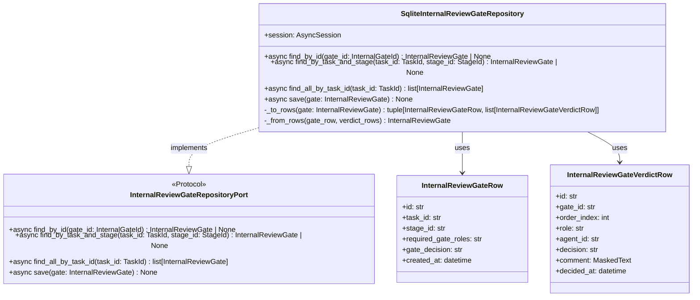

# 詳細設計書 — internal-review-gate / repository

> feature: `internal-review-gate` / sub-feature: `repository`
> 親業務仕様: [`../feature-spec.md`](../feature-spec.md)
> 関連: [`basic-design.md`](basic-design.md) / [`../../room/repository/detailed-design.md`](../../room/repository/detailed-design.md)（踏襲元パターン）
> 担当 Issue: [#164 feat(M5-B): InternalReviewGate infrastructure実装](https://github.com/bakufu-dev/bakufu/issues/164)

## 本書の役割

本書は **階層 3: internal-review-gate / repository の詳細設計**（Module-level Detailed Design）を凍結する。[`basic-design.md`](basic-design.md) で凍結されたモジュール基本設計を、実装直前の **構造契約・確定事項・MSG 文言** として詳細化する。実装 PR は本書を改変せず参照する。

**書くこと**:
- クラス・サービスの属性・型・制約（構造契約の詳細）
- `§確定 A〜E`（実装方針の確定）
- MSG 確定文言（実装者が改変できない契約）

**書かないこと**:
- 業務ルールの議論（feature-spec.md §7 で凍結済み）
- ソースコードそのもの

## 記述ルール（必ず守ること）

詳細設計に **疑似コード・サンプル実装（python/ts/sh/yaml 等の言語コードブロック）を書かない**。
ソースコードと二重管理になりメンテナンスコストしか生まない。

## クラス設計（詳細）

### Protocol: InternalReviewGateRepositoryPort

| method | 引数 | 戻り値 | 制約 |
|--------|------|------|------|
| `find_by_id` | `gate_id: InternalGateId` | `InternalReviewGate \| None` | async def、不在なら None |
| `find_by_task_and_stage` | `task_id: TaskId`, `stage_id: StageId` | `InternalReviewGate \| None` | async def、同一 (task_id, stage_id) は高々 1 件（PENDING Gate は 1 件のみ、複数 REJECTED 履歴は find_all_by_task_id で取得）|
| `find_all_by_task_id` | `task_id: TaskId` | `list[InternalReviewGate]` | async def、created_at 昇順。複数ラウンド（差し戻し履歴）を全件返す |
| `save` | `gate: InternalReviewGate` | `None` | async def、UPSERT + DELETE/INSERT、呼び出し側が session.begin() で Tx 管理 |

### Row: InternalReviewGateRow（`tables/internal_review_gates.py`）

| カラム | 型 | 制約 | 意図 |
|--------|---|------|------|
| `id` | `String(36)` | PK、UUID v4 文字列 | Gate 一意識別子 |
| `task_id` | `String(36)` | NOT NULL、非 UNIQUE INDEX | FK 宣言なし（Aggregate 境界） |
| `stage_id` | `String(36)` | NOT NULL | FK 宣言なし（同上） |
| `required_gate_roles` | `JSON` | NOT NULL | frozenset → JSON 配列（§確定 C）|
| `gate_decision` | `String(20)` | NOT NULL、DEFAULT `'PENDING'` | GateDecision enum 文字列 |
| `created_at` | `DateTime(timezone=True)` | NOT NULL | UTC、tz-aware |

### Row: InternalReviewGateVerdictRow（`tables/internal_review_gate_verdicts.py`）

| カラム | 型 | 制約 | 意図 |
|--------|---|------|------|
| `id` | `String(36)` | PK、UUID v4 文字列 | Verdict 行一意識別子（Aggregate には現れない実装上の識別子、§確定 D）|
| `gate_id` | `String(36)` | FK → `internal_review_gates.id` ON DELETE CASCADE、NOT NULL | 親 Gate |
| `order_index` | `Integer` | NOT NULL、UNIQUE(gate_id, order_index) | verdicts タプルの挿入順保持（0-indexed）|
| `role` | `String(40)` | NOT NULL、UNIQUE(gate_id, role) | GateRole slug（domain §確定 E パターン）|
| `agent_id` | `String(36)` | NOT NULL | FK 宣言なし（Aggregate 境界）|
| `decision` | `String(10)` | NOT NULL | VerdictDecision enum（APPROVED / REJECTED）|
| `comment` | `MaskedText` | NOT NULL、DEFAULT `''` | **`MaskedText` TypeDecorator 必須**（§セキュリティ T1）|
| `decided_at` | `DateTime(timezone=True)` | NOT NULL | UTC、tz-aware |

## 確定事項（先送り撤廃）

### 確定 A: `save()` は UPSERT + DELETE/bulk INSERT（room-repo §確定 B 踏襲）

| ステップ | 操作 |
|---------|------|
| 1 | `internal_review_gates` に対して `INSERT ON CONFLICT(id) DO UPDATE SET ...`（全属性 UPSERT）|
| 2 | `DELETE FROM internal_review_gate_verdicts WHERE gate_id = :gate_id`（全 verdict 行を一括削除）|
| 3 | `INSERT INTO internal_review_gate_verdicts` bulk（verdicts タプルを `enumerate()` で `order_index` 付与）|

**根拠**: InternalReviewGate は frozen Aggregate（submit_verdict が新インスタンスを返す）。UPSERT + DELETE-then-INSERT により、verdicts タプルの「今の全量」を正確に反映する。partial UPDATE は verdicts の tuple 整合性を破壊する可能性があるため採用しない（room-repo §確定 B と同方針）。

### 確定 B: Tx 境界は呼び出し側 service が管理

Repository 内で `session.commit()` / `session.rollback()` を呼ばない。呼び出し側 `InternalReviewService` が `async with session.begin():` で UoW 境界を管理する（room-repo §確定 B 踏襲）。

**根拠**: 1 回の business operation（Gate 保存 + Task 状態更新）を同一 Tx で行う場合、Repository が commit 権を持つと composite service の Tx atomicity が失われる。

### 確定 C: `required_gate_roles` は JSON 配列で保持

`frozenset[GateRole]` を `JSON` TypeDecorator でシリアライズする（`list[str]` にして JSON 配列化）。読み出し時は `frozenset(row.required_gate_roles)` で復元。

**根拠**: SQLite に frozenset を直接格納する型がないため JSON が最もシンプル。インデックスや検索対象ではなく整合性チェック用データのため、JSON TEXT として格納する非正規化で十分。正規化（roles テーブル分割）は YAGNI（将来の検索要件が生じたときに別 PR で対応）。

### 確定 D: `internal_review_gate_verdicts.id` は行一意識別子（Aggregate 非公開）

`InternalReviewGateVerdictRow.id` は SQLite の行 PK（UUID v4 を Repository 層で生成）であり、domain の `Verdict` VO には対応する属性がない。`_to_rows()` で `uuid4()` を生成して付与する。`_from_rows()` では row の `id` は無視して `Verdict` VO を復元する。

**根拠**: domain の `Verdict` VO は不変 VO であり PK を持たない設計（domain/detailed-design.md §Verdict VO）。永続化レイヤーの実装詳細を domain に漏洩させない（Clean Architecture の依存方向保護）。

### 確定 E: `find_by_task_and_stage` は「最新の PENDING Gate」を返す

同一 `(task_id, stage_id)` に対して PENDING 状態の Gate は同時に 1 件のみ存在する（業務ルール）。複数ラウンドの場合、旧 Gate は REJECTED 状態で残留し、新 Gate が PENDING で生成される。`find_by_task_and_stage` は `WHERE task_id=? AND stage_id=? AND gate_decision='PENDING' LIMIT 1` で検索する。差し戻し履歴の全件参照は `find_all_by_task_id` で行う。

**根拠**: application 層（InternalReviewService）の主要なユースケースは「現在の PENDING Gate を特定してからの操作」である。PENDING 条件を Repository 側で絞り込むことで、application 層が全件取得後にフィルタリングする N+1 を防ぐ。

## データ構造（永続化キー）

### テーブル: `internal_review_gates`

| 項目 | 内容 |
|-----|------|
| PK | `id`（UUID v4 文字列）|
| INDEX | `(task_id, stage_id)` 非 UNIQUE INDEX（`find_by_task_and_stage` 高速化）|
| INDEX | `task_id` 非 UNIQUE INDEX（`find_all_by_task_id` 高速化）|
| FK | なし（Aggregate 境界保護）|

### テーブル: `internal_review_gate_verdicts`

| 項目 | 内容 |
|-----|------|
| PK | `id`（UUID v4 文字列）|
| UNIQUE | `(gate_id, order_index)`（tuple 順序一意性）|
| UNIQUE | `(gate_id, role)`（同 Gate 内 GateRole 重複禁止、Aggregate 不変条件の DB 二重防衛）|
| FK | `gate_id` → `internal_review_gates.id` ON DELETE CASCADE |
| masking | `comment` → `MaskedText` TypeDecorator（§確定 A T1、CI 三層防衛で物理保証）|

### Alembic revision

| 項目 | 内容 |
|-----|------|
| revision | `0016_internal_review_gate` |
| down_revision | `"0015_deliverable_records"` |
| 操作 | `op.create_table('internal_review_gates', ...)` + `op.create_table('internal_review_gate_verdicts', ...)` + INDEX 3 件 + UNIQUE 2 件 |
| downgrade | `op.drop_table('internal_review_gate_verdicts')` → `op.drop_table('internal_review_gates')`（FK CASCADE があるため逆順）|

## ユーザー向けメッセージの確定文言

### MSG 確定文言表

| ID | 例外型 | 出力先 | 文言（1 行目: failure / 2 行目: next action）|
|----|------|-------|---|
| MSG-IRG-R001 | `InternalReviewGateNotFoundError`（application 層定義）| HTTP API 404 / CLI stderr | `[FAIL] InternalReviewGate {gate_id} が見つかりません。` / `Next: gate_id を確認し、タスクの実行状態を 'bakufu admin list-tasks' で確認してください。` |

## API エンドポイント詳細

該当なし — 理由: 本 sub-feature は Repository 層のみ。HTTP API エンドポイントは将来の `internal-review-gate/http-api/` sub-feature で凍結する。

## Known Issues（申し送り）

### 申し送り #1: `required_gate_roles` の JSON 保持と将来の検索

現時点では `required_gate_roles` を JSON 配列として TEXT に保持するため、「特定の GateRole を含む Gate を検索する」SQL が効率的に書けない。将来、管理 UI で GateRole 別の統計を見たい要件が生じた場合は `internal_review_gate_roles` 正規化テーブルを別 Alembic revision で追加することを推奨する。本 PR では YAGNI 原則に従い JSON 保持を採用。

### 申し送り #2: `find_by_task_and_stage` の PENDING Gate 1 件制約

複数ラウンド（差し戻し後の再実行）で同一 `(task_id, stage_id)` に PENDING Gate が複数生成される業務バグが発生した場合、`find_by_task_and_stage` が `LIMIT 1` で先頭 1 件を返すことで隠蔽される可能性がある。InternalReviewService の `create_gate()` で「既存 PENDING Gate が存在する場合は生成しない」ガード（Fail Fast）を必ず実装し、DB レベルではなく application 層で一意性を保証すること（application/basic-design.md REQ-IRG-A001 で確定）。

## 出典・参考

- [`../../room/repository/detailed-design.md`](../../room/repository/detailed-design.md) — 踏襲元パターン（UPSERT / delete-then-insert / Protocol / MaskedText）
- [`../../room/repository/basic-design.md`](../../room/repository/basic-design.md) — ER 図パターン
- [`../domain/detailed-design.md`](../domain/detailed-design.md) — Aggregate 属性・Verdict VO 属性の原典
- [SQLAlchemy 2.x AsyncSession](https://docs.sqlalchemy.org/en/20/orm/extensions/asyncio.html)
- [Alembic autogenerate](https://alembic.sqlalchemy.org/en/latest/autogenerate.html)
- feature-spec.md §13 扱うデータと機密レベル（verdicts.comment の高機密レベル根拠）
