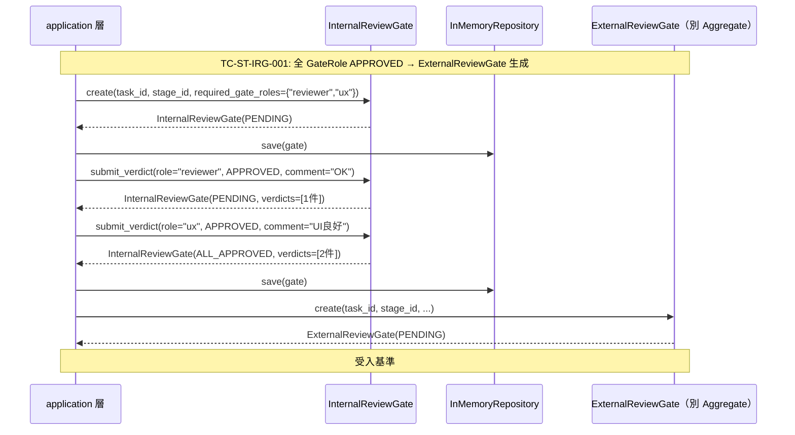
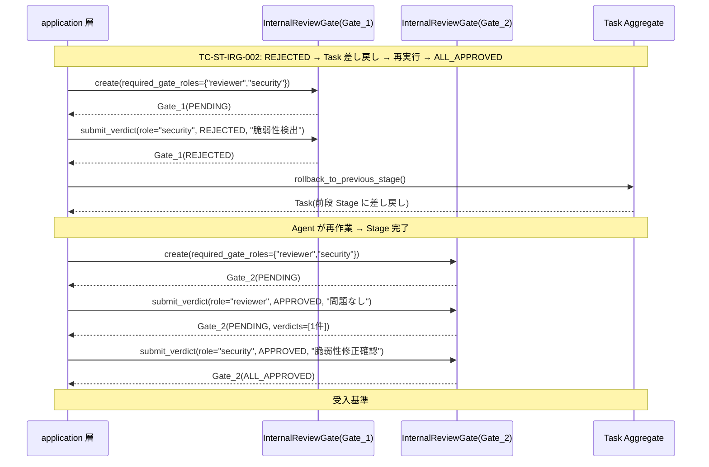

# システムテスト戦略 — internal-review-gate

> 関連: feature-spec.md §9 受入基準 8〜10, 12（受入基準 1〜7, 11 は domain IT/UT — [`domain/test-design.md`](domain/test-design.md) が担当）
> 対象: UC-IRG-002〜006（InternalReviewGate ライフサイクル全体 E2E）

本ドキュメントは InternalReviewGate **業務概念全体** のシステムテスト戦略を凍結する。sub-feature（domain）の IT / UT はそれぞれの `test-design.md` が担当する。

## 観察主体

| ペルソナ | 観察対象 |
|---------|---------|
| 個人開発者 CEO（堀川さん想定）| Workflow 設計時の required_gate_roles 設定 / 最終的な Gate 状態の正確性 |
| GateRole エージェント（Reviewer / UX / Security 担当 Agent）| Verdict 提出後の Gate 状態遷移 / 差し戻しシグナルの確認 |

## 検証方法の定義

| 検証対象 | 検証手段 |
|---------|---------|
| UC-IRG-002〜005（Gate 生成・Verdict 提出・遷移）| InMemoryRepository + application 層直接呼び出し |
| UC-IRG-006（再起動跨ぎ保持）| 実 SQLite（`tempfile` による一時 DB）/ アプリ再起動シミュレーション |
| required_gate_roles 空集合（受入基準 #10）| InMemoryRepository + application 層 Gate 生成ロジック直接呼び出し |

## システムテストケース

| テストID | ペルソナ | シナリオ | 操作手順 | 期待結果 | 紐付く受入基準 |
|---------|---------|---------|---------|---------|------------|
| TC-ST-IRG-001 | GateRole エージェント / CEO | Stage 到達 → Gate 生成 → 全 GateRole APPROVED → ExternalReviewGate 生成 | 1) required_gate_roles={"reviewer","ux"} で Gate 生成（PENDING）→ 2) reviewer が APPROVED 提出（PENDING 継続）→ 3) ux が APPROVED 提出（ALL_APPROVED 遷移）→ 4) application 層が ExternalReviewGate を生成 | Gate が ALL_APPROVED、ExternalReviewGate が PENDING で生成される | #8 |
| TC-ST-IRG-002 | GateRole エージェント / CEO | REJECTED → Task 差し戻し → 再 Stage 実行 → 全 APPROVED | 1) Gate 生成（PENDING）→ 2) security が REJECTED 提出（REJECTED 遷移）→ 3) application 層が Task 差し戻しシグナルを検出 → 4) Agent が再作業 → 5) 新 Gate 生成（PENDING）→ 6) 全 GateRole APPROVED → ALL_APPROVED 遷移 | 旧 Gate は REJECTED として履歴保持、新 Gate が ALL_APPROVED へ遷移する | #9 |
| TC-ST-IRG-003 | application 層 | required_gate_roles 空集合の Stage では Gate が生成されない | 1) required_gate_roles=frozenset() の Stage 設定 → 2) application 層が Gate 生成ロジックを呼び出す | InternalReviewGate が生成されない（application 層が空集合チェックでスキップ）| #10 |
| TC-ST-IRG-004 | application 層 | Gate の状態が再起動後も保持される | 1) PENDING Gate を SQLite に保存 → 2) アプリ再起動シミュレーション（DB 再接続）→ 3) `find_by_id` で復元 → 4) 復元 Gate が元 Gate と構造的等価（id / task_id / stage_id / required_gate_roles / verdicts / gate_decision / created_at 全属性一致）| 再起動後も Gate の全属性が保持されている | #12 |

## シナリオフロー図（TC-ST-IRG-002: REJECTED → 差し戻しサイクル）

## カバレッジ基準

受入基準 #1〜#12 の全件が最低 1 件のテストケースで検証される:

| 受入基準 | 検証担当 | テストケース |
|---------|---------|-----------|
| #1（required_gate_roles 設定）| domain UT | TC-UT-IRG-001 |
| #2（Gate 生成・PENDING 初期状態）| domain UT | TC-UT-IRG-002 |
| #3（APPROVED Verdict 提出・記録）| domain UT | TC-UT-IRG-003 |
| #4（全 APPROVED → ALL_APPROVED）| domain UT | TC-UT-IRG-004 |
| #5（REJECTED → REJECTED 遷移）| domain UT | TC-UT-IRG-005 |
| #6（同一 GateRole 重複提出拒否）| domain UT | TC-UT-IRG-006 |
| #7（確定後 Verdict 拒否）| domain UT | TC-UT-IRG-007 |
| #8（ALL_APPROVED 後の次フェーズ）| **TC-ST-IRG-001** |  |
| #9（REJECTED 後の Task 差し戻し）| **TC-ST-IRG-002** |  |
| #10（空集合 Gate 非生成）| **TC-ST-IRG-003** |  |
| #11（comment 文字数境界）| domain UT | TC-UT-IRG-008 |
| #12（再起動跨ぎ保持）| **TC-ST-IRG-004** |  |
