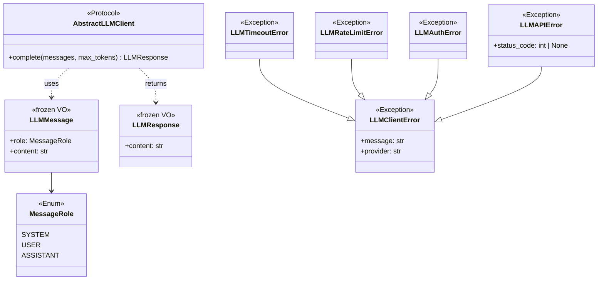
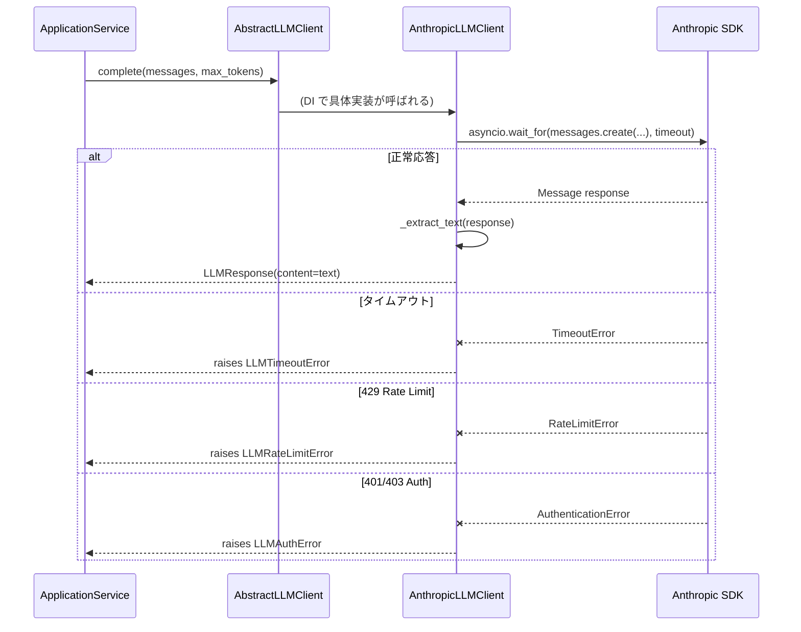

# 基本設計書 — llm-client / domain

> feature: `llm-client`（業務概念）/ sub-feature: `domain`
> 親業務仕様: [`../feature-spec.md`](../feature-spec.md)
> 関連 Issue: [#144 feat(llm-client): 横断利用可能な LLM クライアント基盤](https://github.com/bakufu-dev/bakufu/issues/144)
> 凍結済み設計: [`docs/design/tech-stack.md`](../../../design/tech-stack.md) §LLM Adapter

## 記述ルール（必ず守ること）

基本設計に**疑似コード・サンプル実装（python/ts/sh/yaml 等の言語コードブロック）を書かない**。
ソースコードと二重管理になりメンテナンスコストしか生まない。
必要なのは構造契約（クラス・モジュール・データの関係）であり、実装の細部は [`detailed-design.md`](detailed-design.md) で凍結する。

## §モジュール契約（機能要件）

本 sub-feature が満たすべき機能要件（入力 / 処理 / 出力 / エラー時）を凍結する。業務根拠は [`../feature-spec.md §9 受入基準`](../feature-spec.md) を参照。

### REQ-LC-001: LLM へのテキスト補完要求

| 項目 | 内容 |
|---|---|
| 入力 | `messages: tuple[LLMMessage, ...]`（1 件以上）、`max_tokens: int`（1 以上）|
| 処理 | `AbstractLLMClient` Protocol を実装した具体クライアントが LLM API を非同期呼び出しし、テキスト応答を返す |
| 出力 | `LLMResponse`（`content: str`）|
| エラー時 | タイムアウト → `LLMTimeoutError`（MSG-LC-001）/ レート制限 → `LLMRateLimitError`（MSG-LC-002）/ 認証失敗 → `LLMAuthError`（MSG-LC-003）/ その他 API エラー → `LLMAPIError`（MSG-LC-004）|

### REQ-LC-002: LLMMessage 値オブジェクトの構築

| 項目 | 内容 |
|---|---|
| 入力 | `role: MessageRole`（`system` / `user` / `assistant`）、`content: str`（1 文字以上）|
| 処理 | Pydantic バリデーション → frozen モデルとしてインスタンス化 |
| 出力 | `LLMMessage` インスタンス（不変）|
| エラー時 | `content` 空文字 → `LLMMessageValidationError`（MSG-LC-005）|

### REQ-LC-003: LLMResponse 値オブジェクトの構築

| 項目 | 内容 |
|---|---|
| 入力 | `content: str`（具体クライアントが LLM から受け取った応答テキスト）|
| 処理 | Pydantic バリデーション → frozen モデルとしてインスタンス化 |
| 出力 | `LLMResponse` インスタンス（不変）|
| エラー時 | `content` 空文字の場合は具体クライアントが警告ログを出力し、フォールバック文字列で `LLMResponse` を構築する（MSG-LC-006）|

---

## モジュール構成

| 機能 ID | モジュール | ディレクトリ | 責務 |
|---|---|---|---|
| REQ-LC-001 | `AbstractLLMClient` Protocol | `backend/src/bakufu/application/ports/llm_client.py` | LLM 呼び出し契約（Port）。全 feature が依存するインターフェース |
| REQ-LC-002, 003 | `LLMMessage` / `LLMResponse` VO | `backend/src/bakufu/domain/value_objects.py`（既存ファイル追記）| LLM 通信の値オブジェクト |
| REQ-LC-001〜004 | `LLMClientError` 階層 | `backend/src/bakufu/domain/errors.py`（既存ファイル追記）| LLM 呼び出し例外の基底クラスとサブクラス |

```
本 sub-feature で追加・変更されるファイル:

backend/src/bakufu/
├── application/
│   └── ports/
│       └── llm_client.py               # 新規: AbstractLLMClient Protocol
└── domain/
    ├── value_objects.py                 # 追記: LLMMessage / LLMResponse / MessageRole
    └── errors.py                        # 追記: LLMClientError 例外階層
```

## ユーザー向けメッセージ一覧

本 sub-feature は API / CLI からエンドユーザーに直接表示するメッセージを持たない。以下はログ出力・例外メッセージとして Application Service が利用する内部メッセージである。

| ID | 種別 | メッセージ（要旨） | 表示条件 |
|---|---|---|---|
| MSG-LC-001 | エラー | LLM API タイムアウト | `asyncio.TimeoutError` 発生時 |
| MSG-LC-002 | エラー | レート制限超過 | HTTP 429 応答時 |
| MSG-LC-003 | エラー | API 認証失敗 | HTTP 401 / 403 応答時 |
| MSG-LC-004 | エラー | LLM API 汎用エラー | 上記以外の API エラー時 |
| MSG-LC-005 | エラー | LLMMessage.content が空文字 | REQ-LC-002 バリデーション失敗時 |
| MSG-LC-006 | 警告 | LLM 応答テキストが空 | LLM が text block を返さなかった時 |

各メッセージの確定文言は [`detailed-design.md §MSG 確定文言表`](detailed-design.md) で凍結する。

## 依存関係

| 区分 | 依存 | バージョン方針 | 備考 |
|---|---|---|---|
| ランタイム | Python 3.12+ | `pyproject.toml` | 既存 |
| ランタイム | pydantic v2 | `pyproject.toml` | 既存。frozen VO に使用 |
| ランタイム | `anthropic` SDK | `backend/pyproject.toml` に追加 | Phase 1 採用。infrastructure sub-feature の依存だが port 定義層は SDK に依存しない |
| ランタイム | `openai` SDK | 同上 | Phase 1 採用 |

**注意**: `application/ports/llm_client.py`（本 sub-feature）は `anthropic` / `openai` SDK を **import しない**。SDK への依存は `infrastructure/` に封じ込める。本 sub-feature は純粋な型・Protocol 定義のみ。

## クラス設計（概要）



**凝集のポイント**:
- `AbstractLLMClient` は `application/ports/` に置き、SDK への依存ゼロを維持する。これにより protocol を消費する Application Service（`ValidationService` 等）が SDK に依存しない
- `LLMClientError` 階層は `domain/errors.py` に置く。domain の例外は SDK 非依存であり、呼び出し元が `except LLMClientError` で一括捕捉または `except LLMTimeoutError` で個別捕捉できる
- `LLMMessage` / `LLMResponse` は frozen Pydantic VO。変更不能により並行処理での意図しない状態変更を防ぐ

## 処理フロー

### ユースケース 1: UC-LC-001 — LLM テキスト補完

1. Application Service が `LLMMessage` を構築してタプルに積む
2. Service が DI で注入された `AbstractLLMClient.complete(messages, max_tokens)` を呼ぶ
3. 具体実装（`ClaudeCodeLLMClient` / `CodexLLMClient` 等）が `asyncio.wait_for()` でタイムアウト付き SDK 呼び出しを実行（処理は infrastructure sub-feature で定義）
4. SDK が応答を返したら具体実装が `LLMResponse` を構築して返却
5. SDK がエラーを返したら具体実装が `LLMClientError` サブクラスに変換して raise
6. Service が `LLMResponse.content` を受け取り業務ロジックを継続

### ユースケース 2: UC-LC-003 — エラーハンドリング

1. `complete()` が `LLMTimeoutError` / `LLMRateLimitError` / `LLMAuthError` / `LLMAPIError` を raise
2. 呼び出し元 Service が catch して業務エラーに変換（例: `DeliverableRecordError`）
3. リトライ戦略は呼び出し元 Service の責務（本 feature は raise するのみ）

## シーケンス図



## アーキテクチャへの影響

- [`docs/design/domain-model.md`](../../../design/domain-model.md) への変更: `LLMMessage` / `LLMResponse` VO と `LLMClientError` 例外階層を §Value Object / §Domain Errors に追記
- [`docs/design/tech-stack.md`](../../../design/tech-stack.md) への変更: §LLM Adapter に `AbstractLLMClient`（HTTP API）vs `LLMProviderPort`（CLI subprocess）の役割区分を明記（同一 PR で更新）
- 既存 feature への波及: `ai-validation`（Issue #123）は `LLMProviderPort`（CLI subprocess）を DI で受け取る設計に移行済み（PR #148）

## 外部連携

| 連携先 | 目的 | プロトコル | 認証 | タイムアウト / リトライ |
|---|---|---|---|---|
| Anthropic API | テキスト補完（claude-3-5-sonnet 等）| HTTPS（anthropic SDK 経由）| API Key（SecretStr）| タイムアウト: `LLMClientConfig.timeout_seconds`（デフォルト 30s）/ リトライ: 呼び出し元 Service が責任 |
| OpenAI API | テキスト補完（gpt-4o 等）| HTTPS（openai SDK 経由）| API Key（SecretStr）| 同上 |

## UX 設計

該当なし — 理由: 本 sub-feature はバックエンド内部 Port 定義のみ。エンドユーザーへの直接 UI は持たない。

## セキュリティ設計

### 脅威モデル

| 想定攻撃者 | 攻撃経路 | 保護資産 | 対策 |
|---|---|---|---|
| **T1: 内部コード誤実装** | `LLMClientConfig.api_key` を `str()` で出力 | API キー平文漏洩 | `SecretStr` 採用（R1-2）。`str(config)` で `**********` を返す Pydantic 仕様で防護（Phase 2 HTTP API アプローチでのみ適用。Phase 1 CLI subprocess では API キー不要）|
| **T2: SDK 依存の漏洩** | application/ports が SDK 固有例外を再 raise | 呼び出し元が SDK に依存 | `LLMClientError` 階層への変換（R1-3）。infrastructure が SDK 例外を catch して変換する責務を持つ |

詳細な信頼境界は [`docs/design/threat-model.md`](../../../design/threat-model.md)。

## ER 図

該当なし — 理由: 本 sub-feature は永続化を持たない（LLM 呼び出しの Port 定義と VO 定義のみ）。

## エラーハンドリング方針

| 例外種別 | 処理方針 | ユーザーへの通知 |
|---|---|---|
| `LLMTimeoutError` | 呼び出し元 Service が catch し、業務エラーに変換してログ出力 | MSG-LC-001（ログ）|
| `LLMRateLimitError` | 同上。リトライ戦略は Service が決定 | MSG-LC-002（ログ）|
| `LLMAuthError` | 同上。リトライしない。設定不備として扱う | MSG-LC-003（ログ）|
| `LLMAPIError` | 同上 | MSG-LC-004（ログ）|
| `LLMMessageValidationError` | Fail Fast。呼び出し元が空文字メッセージを渡した設計バグ | MSG-LC-005（例外 raise）|
