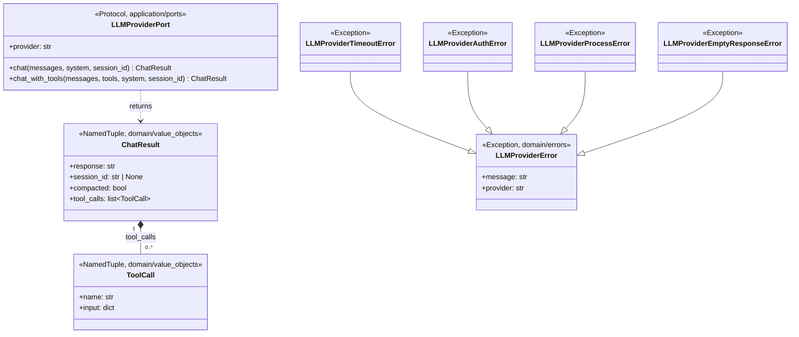
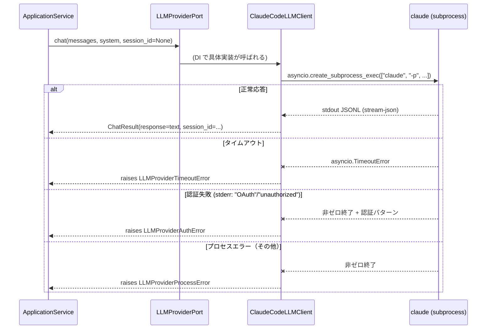

# 基本設計書 — llm-client / domain

> feature: `llm-client`（業務概念）/ sub-feature: `domain`
> 親業務仕様: [`../feature-spec.md`](../feature-spec.md)
> 関連 Issue: [#144 feat(llm-client): 横断利用可能な LLM クライアント基盤](https://github.com/bakufu-dev/bakufu/issues/144)
> 凍結済み設計: [`docs/design/tech-stack.md`](../../../design/tech-stack.md) §LLM Adapter

## 記述ルール（必ず守ること）

基本設計に**疑似コード・サンプル実装（python/ts/sh/yaml 等の言語コードブロック）を書かない**。
ソースコードと二重管理になりメンテナンスコストしか生まない。
必要なのは構造契約（クラス・モジュール・データの関係）であり、実装の細部は [`detailed-design.md`](detailed-design.md) で凍結する。

## §モジュール契約（機能要件）

本 sub-feature が満たすべき機能要件（入力 / 処理 / 出力 / エラー時）を凍結する。業務根拠は [`../feature-spec.md §9 受入基準`](../feature-spec.md) を参照。

### REQ-LC-001: LLMProviderPort 経由の LLM テキスト補完

| 項目 | 内容 |
|---|---|
| 入力 | `messages: list[dict]`（1 件以上）、`system: str`（評価者ロール指示）、`use_tools: bool`（デフォルト False）、`agent_name: str`（デフォルト ""）、`session_id: str \| None`（セッション継続 ID）|
| 処理 | `LLMProviderPort` Protocol を実装した具体クライアントが CLI サブプロセスを起動し、テキスト応答を返す |
| 出力 | `ChatResult`（`response: str`、`session_id: str \| None`、`compacted: bool`）|
| エラー時 | タイムアウト → `LLMProviderTimeoutError`（MSG-LC-001）/ 認証失敗 → `LLMProviderAuthError`（MSG-LC-003）/ プロセスエラー → `LLMProviderProcessError`（MSG-LC-004）/ 空応答 → `LLMProviderEmptyResponseError`（MSG-LC-006）|

### REQ-LC-002: ChatResult VO の定義

| 項目 | 内容 |
|---|---|
| 入力 | `response: str`（LLM 応答テキスト）、`session_id: str \| None`（CLI セッション ID）、`compacted: bool`（コンテキスト圧縮フラグ）、`tool_calls: list[ToolCall]`（ツール呼び出し結果リスト、デフォルト空リスト）|
| 処理 | `NamedTuple` として不変 VO を定義する |
| 出力 | `ChatResult` インスタンス |
| エラー時 | 該当なし |

### REQ-LC-004: ToolCall VO の定義（M5-B 追加）

| 項目 | 内容 |
|---|---|
| 入力 | `name: str`（ツール名）、`input: dict[str, object]`（ツール呼び出し引数）|
| 処理 | `NamedTuple` として不変 VO を定義する。`chat_with_tools()` が返す `ChatResult.tool_calls` の要素型として使用する |
| 出力 | `ToolCall` インスタンス |
| エラー時 | 該当なし |

### REQ-LC-003: LLMProviderError 階層の定義

| 項目 | 内容 |
|---|---|
| 入力 | `message: str`（人間可読エラー説明）、`provider: str`（`"claude-code"` / `"codex"`）|
| 処理 | CLI サブプロセス呼び出し時に発生する例外を `LLMProviderError` 基底クラスと 4 サブクラス（Timeout / Auth / Process / EmptyResponse）として定義する |
| 出力 | 例外階層 |
| エラー時 | 該当なし |

---

## モジュール構成

| 機能 ID | モジュール | ディレクトリ | 責務 |
|---|---|---|---|
| REQ-LC-001 | `LLMProviderPort` | `backend/src/bakufu/application/ports/llm_provider_port.py` | LLM CLI 呼び出し契約（Port）。全 feature が依存するインターフェース |
| REQ-LC-002 | `ChatResult` VO | `backend/src/bakufu/domain/value_objects/chat_result.py` | LLM CLI 応答の値オブジェクト（NamedTuple）。`tool_calls: list[ToolCall]` フィールドを持つ（M5-B 追加）|
| REQ-LC-003 | `LLMProviderError` 階層 | `backend/src/bakufu/domain/errors.py`（追記）| LLM CLI 呼び出し例外の基底クラスとサブクラス |
| REQ-LC-004 | `ToolCall` VO | `backend/src/bakufu/domain/value_objects/chat_result.py`（同ファイル）| LLM ツール呼び出し結果の値オブジェクト（NamedTuple）。`name: str` / `input: dict[str, object]`（M5-B 追加）|

```
本 sub-feature で追加・変更されるファイル:

backend/src/bakufu/
├── application/
│   └── ports/
│       └── llm_provider_port.py         # 新規: LLMProviderPort Protocol
└── domain/
    ├── value_objects.py                 # 追記: ChatResult VO
    └── errors.py                        # 追記: LLMProviderError 例外階層
```

## ユーザー向けメッセージ一覧

本 sub-feature は API / CLI からエンドユーザーに直接表示するメッセージを持たない。以下はログ出力・例外メッセージとして Application Service が利用する内部メッセージである。

| ID | 種別 | メッセージ（要旨）| 表示条件 |
|---|---|---|---|
| MSG-LC-001 | エラー | LLM CLI タイムアウト | `asyncio.TimeoutError` 発生時 |
| MSG-LC-003 | エラー | LLM CLI 認証失敗 | stderr 認証パターン検出時 |
| MSG-LC-004 | エラー | LLM CLI プロセスエラー | 非ゼロ終了コード（非認証）時 |
| MSG-LC-006 | 警告 | LLM CLI 空応答 | stdout から応答テキスト取得不可時 |

各メッセージの確定文言は [`detailed-design.md §MSG 確定文言表`](detailed-design.md) で凍結する。

## 依存関係

| 区分 | 依存 | バージョン方針 | 備考 |
|---|---|---|---|
| ランタイム | Python 3.12+ | `pyproject.toml` | 既存 |
| ランタイム | pydantic v2 | `pyproject.toml` | 既存。domain VO で必要な場合に使用 |

**注意**: `application/ports/llm_provider_port.py`（本 sub-feature）は `anthropic` / `openai` SDK を **import しない**。SDK への依存は `infrastructure/` に封じ込める。本 sub-feature は純粋な型・Protocol 定義のみ。CLI サブプロセスを利用するため Phase 1 では API キー不要。

## クラス設計（概要）



**凝集のポイント**:
- `LLMProviderPort` は `application/ports/` に置き、CLI ツールへの依存ゼロを維持する。これにより protocol を消費する Application Service（`ValidationService` 等）がサブプロセス実装に依存しない
- `LLMProviderError` 階層は `domain/errors.py` に置く。domain の例外は CLI 実装非依存であり、呼び出し元が `except LLMProviderError` で一括捕捉または各サブクラスで個別捕捉できる
- `ChatResult` は `NamedTuple` による不変 VO。`session_id` はセッション継続のために保持し、`compacted` はコンテキスト圧縮の発生を呼び出し元に通知する

## 処理フロー

### ユースケース 1: UC-LC-001 — LLM テキスト補完

1. Application Service が `_llm_provider.chat(messages, system, session_id=None)` を呼ぶ
2. DI で注入された具体実装（`ClaudeCodeLLMClient` 等）が CLI サブプロセスを起動する（処理は infrastructure sub-feature で定義）
3. CLI が JSONL 形式でストリーム応答を返したら具体実装が `ChatResult` を構築して返却
4. CLI がエラーを返したら具体実装が `LLMProviderError` サブクラスに変換して raise
5. Service が `result.response` を受け取り業務ロジックを継続

### ユースケース 2: UC-LC-003 — エラーハンドリング

1. `chat()` が `LLMProviderTimeoutError` / `LLMProviderAuthError` / `LLMProviderProcessError` / `LLMProviderEmptyResponseError` を raise
2. 呼び出し元 Service が catch して業務エラーに変換（例: `DeliverableRecordError`）
3. リトライ戦略は呼び出し元 Service の責務（本 feature は raise するのみ）

## シーケンス図



## アーキテクチャへの影響

- [`docs/design/domain-model.md`](../../../design/domain-model.md) への変更: `ChatResult` VO と `LLMProviderError` 例外階層を §Value Object / §Domain Errors に追記
- [`docs/design/tech-stack.md`](../../../design/tech-stack.md) への変更: §LLM Adapter に `LLMProviderPort`（CLI subprocess）の役割区分を明記（同一 PR で更新）
- 既存 feature への波及: `ai-validation`（Issue #123）は `LLMProviderPort`（CLI subprocess）を DI で受け取る設計に移行済み（PR #148）
- `infrastructure` sub-feature は `LLMProviderPort` を実装する `ClaudeCodeLLMClient` / `CodexLLMClient` を提供する

## 外部連携

| 連携先 | 目的 | プロトコル | 認証 | タイムアウト / リトライ |
|---|---|---|---|---|
| `claude` CLI | テキスト補完（claude-code）| サブプロセス（stdin/stdout）| OAuth（API キー不要）| タイムアウト: infrastructure で設定 / リトライ: 呼び出し元 Service が責任 |
| `codex` CLI | テキスト補完（codex）| サブプロセス（stdin/stdout）| サブスクリプション認証（API キー不要）| 同上 |

**注意**: Anthropic API（HTTP）・OpenAI API（HTTP）は Phase 1 対象外。Phase 2 将来検討。

## UX 設計

該当なし — 理由: 本 sub-feature はバックエンド内部 Port 定義のみ。エンドユーザーへの直接 UI は持たない。

## セキュリティ設計

### 脅威モデル

| 想定攻撃者 | 攻撃経路 | 保護資産 | 対策 |
|---|---|---|---|
| **T1: 内部コード誤実装** | `provider: str` にクレデンシャルを埋め込む | 認証情報漏洩 | domain 型にクレデンシャルフィールドを持たせない設計。`provider` はプロバイダー名のみを保持する |
| **T2: CLI 実装の漏洩** | infrastructure が CLI 固有例外を再 raise | 呼び出し元が実装詳細に依存 | `LLMProviderError` 階層への変換（R1-3）。infrastructure が CLI 例外を catch して変換する責務を持つ |

詳細な信頼境界は [`docs/design/threat-model.md`](../../../design/threat-model.md)。サブプロセスセキュリティの確定 CMD-EXEC は [`../infrastructure/basic-design.md §確定 CMD-EXEC`](../infrastructure/basic-design.md) を参照。

## ER 図

該当なし — 理由: 本 sub-feature は永続化を持たない（LLM 呼び出しの Port 定義と VO 定義のみ）。

## エラーハンドリング方針

| 例外種別 | 処理方針 | ユーザーへの通知 |
|---|---|---|
| `LLMProviderTimeoutError` | 呼び出し元 Service が catch し、業務エラーに変換してログ出力 | MSG-LC-001（ログ）|
| `LLMProviderAuthError` | 同上。リトライしない。認証設定不備として扱う | MSG-LC-003（ログ）|
| `LLMProviderProcessError` | 同上 | MSG-LC-004（ログ）|
| `LLMProviderEmptyResponseError` | 同上。CLI が空応答を返した場合に警告 | MSG-LC-006（ログ）|
