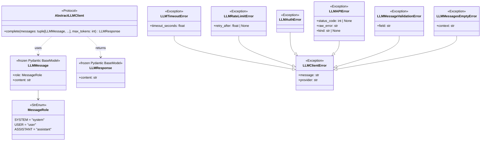

# 詳細設計書 — llm-client / domain

> feature: `llm-client` / sub-feature: `domain`
> 親業務仕様: [`../feature-spec.md`](../feature-spec.md)
> 関連: [`basic-design.md`](basic-design.md)

## 本書の役割

本書は **階層 3: モジュール（sub-feature）の詳細設計**（Module-level Detailed Design）を凍結する。[`basic-design.md`](basic-design.md) で凍結されたモジュール基本設計を、実装直前の **構造契約・確定文言・型制約** として詳細化する。実装 PR は本書を改変せず参照する。設計変更が必要なら本書を先に更新する PR を立てる。

## 記述ルール（必ず守ること）

詳細設計に**疑似コード・サンプル実装（python/ts/sh/yaml 等の言語コードブロック）を書かない**。
必要なのは「構造契約（属性名・型・制約）」と「確定文言（メッセージ文字列）」と「実装の意図（なぜこの API 形になるか）」のみ。

## クラス設計（詳細）

**注記 — `LLMConfigError` は本 sub-feature（domain/errors.py）に存在しない**:
`LLMConfigError` は設定不備を表すインフラ例外であり `infrastructure/llm/config.py` に定義する。`LLMClientError`（LLM API 呼び出し失敗）とは別系統（直接 `Exception` を継承）。呼び出し元は `except LLMClientError` では catch できない。詳細は [`../infrastructure/detailed-design.md §LLMConfigError`](../infrastructure/detailed-design.md)。

---

### Protocol: AbstractLLMClient

**配置先**: `backend/src/bakufu/application/ports/llm_client.py`

| メソッド | シグネチャ | 制約 | 意図 |
|---|---|---|---|
| `complete` | `async def complete(messages: tuple[LLMMessage, ...], max_tokens: int) -> LLMResponse` | `messages` 1 件以上、`max_tokens` 1 以上 | LLM への単発テキスト補完要求。非同期のみ（sync variant 不要）|

**不変条件**:
- `messages` は空タプルを渡せない（呼び出し元が Fail Fast として検証）
- `max_tokens` は 1 以上（0 以下は `LLMAPIError` の原因になるため Fail Fast）

**設計意図（なぜ `tuple` か）**:
- `list` は可変。`tuple` にすることで呼び出し元が渡した後にメッセージ列が変更される危険を排除する
- Pydantic frozen VO と一貫したイミュータブル設計

**設計意図（なぜ `typing.Protocol` か）**:
- 既存 Repository Port（`AgentRepository` 等）が全て `typing.Protocol` を採用している。`abc.ABC` は `domain/ports/json_schema_validator.py` のみの例外（domain invariant 検査専用）。本 Port は Application Service が DI で消費するため `application/ports/` + `Protocol` が一貫したパターン
- `@runtime_checkable` は付けない（`isinstance` チェックは duck typing で不要。既存 Port と同一方針）

---

### Value Object: LLMMessage

**配置先**: `backend/src/bakufu/domain/value_objects.py`（既存ファイル追記）

| 属性 | 型 | 制約 | 意図 |
|---|---|---|---|
| `role` | `MessageRole` | required | system / user / assistant のいずれか |
| `content` | `str` | `min_length=1`（空文字禁止）| メッセージ本文。空文字は `LLMMessageValidationError` |

**不変条件**:
- `frozen=True`（Pydantic `model_config`）。インスタンス生成後の属性変更は禁止
- `role` は `MessageRole` 列挙値のみ受け付ける

---

### Value Object: LLMResponse

**配置先**: `backend/src/bakufu/domain/value_objects.py`（既存ファイル追記）

| 属性 | 型 | 制約 | 意図 |
|---|---|---|---|
| `content` | `str` | `min_length=1`（空文字禁止）| LLM から返ってきたテキスト応答 |

**不変条件**:
- `frozen=True`
- `content` が空文字の場合は infrastructure 側が `LLMAPIError(kind='empty_response')` を raise して `LLMResponse` を構築しない（Fail Fast）。空 `LLMResponse` は型システム上存在できない

**設計意図（なぜ `min_length=1` か）**:
- LLM が空応答を返すのは失敗ケース（API policy 拒否 / token 枯渇 / safety filter）。silently フォールバック文字列に置換すると、呼び出し元 Service がフォールバックと本物の応答を区別できなくなり `if "no text response" in content:` のような fragile な分岐が業務ロジックに散在する（ヘルスバーグ §致命的欠陥 3 の教訓）
- Fail Fast 原則: 不正な状態を引きずらず即 raise する

**設計意図（なぜ `ChatResult` NamedTuple ではなく Pydantic VO か）**:
- ai-team の `ChatResult(response, session_id, compacted)` は session 管理フィールドを含む。本 feature は 1 req = 1 resp（R1-4）でセッション管理不要のため `session_id` / `compacted` は持たない
- 他の bakufu VO（`AgentId` 等）と同じく Pydantic frozen model で型安全性・バリデーション一貫性を確保

---

### Enum: MessageRole

**配置先**: `backend/src/bakufu/domain/value_objects.py`（既存ファイル追記）

| 値 | 文字列表現 | 意図 |
|---|---|---|
| `SYSTEM` | `"system"` | システムプロンプト（LLM への指示・制約）|
| `USER` | `"user"` | ユーザー発話（評価対象テキスト等）|
| `ASSISTANT` | `"assistant"` | アシスタント（LLM）の応答（Few-shot 例示に使用）|

**設計意図（なぜ `StrEnum` か）**:
- Anthropic SDK / OpenAI SDK ともに `messages` の `role` フィールドに文字列 `"system"` / `"user"` / `"assistant"` を要求する
- `StrEnum` にすることで `MessageRole.USER == "user"` が成立し、SDK へ渡す際の `.value` 変換を省略できる

---

### Exception: LLMClientError 階層

**配置先**: `backend/src/bakufu/domain/errors.py`（既存ファイル追記）

#### LLMClientError（基底クラス）

| 属性 | 型 | 制約 | 意図 |
|---|---|---|---|
| `message` | `str` | required | 人間可読エラー説明（MSG-LC-NNN の確定文言）|
| `provider` | `str` | required | エラー発生プロバイダ名（`"anthropic"` / `"openai"`）|

#### LLMTimeoutError（LLMClientError のサブクラス）

| 属性 | 型 | 制約 | 意図 |
|---|---|---|---|
| `timeout_seconds` | `float` | required | 設定されていたタイムアウト秒数（ログ・デバッグ用）|

**変換条件**: `asyncio.TimeoutError` 発生時

#### LLMRateLimitError（LLMClientError のサブクラス）

| 属性 | 型 | 制約 | 意図 |
|---|---|---|---|
| `retry_after` | `float \| None` | optional | API が返した Retry-After ヘッダ値（秒数）。None なら不明 |

**変換条件**: HTTP 429 応答、または SDK の `RateLimitError` 相当

#### LLMAuthError（LLMClientError のサブクラス）

追加属性なし。基底クラスの `message` / `provider` のみ。

**変換条件**: HTTP 401 / 403 応答、または SDK の `AuthenticationError` 相当

#### LLMAPIError（LLMClientError のサブクラス）

| 属性 | 型 | 制約 | 意図 |
|---|---|---|---|
| `status_code` | `int \| None` | optional | HTTP ステータスコード。不明な場合は None |
| `raw_error` | `str` | required | SDK 例外の `str()` 表現（デバッグ用。`masking.mask()` 適用後のみ格納可）|
| `kind` | `str \| None` | optional, default `None` | エラーの種別識別子。`"empty_response"` は LLM が空テキストを返した場合のみ使用 |

**変換条件**: 上記 3 種以外の SDK 例外・API エラー。および LLM が空応答を返したとき（`kind='empty_response'`）

**設計意図（`raw_error` をなぜ含めるか）**:
- 本 feature が予期しない API エラーを握り潰さないように `str(sdk_error)` を保持する
- `raw_error` には `masking.mask()` 適用後の文字列のみ格納する（API キー平文格納は禁止）

**設計意図（`kind='empty_response'` を LLMAPIError で表現する理由）**:
- 空応答は新たな例外クラスを追加するほどの独立した概念ではなく、`LLMAPIError` の特殊ケース
- `kind` フィールドにより呼び出し元が `except LLMAPIError as e: if e.kind == 'empty_response':` で選択的にハンドリングできる

#### LLMMessageValidationError（LLMClientError のサブクラス）

| 属性 | 型 | 制約 | 意図 |
|---|---|---|---|
| `field` | `str` | required | バリデーション失敗したフィールド名（`"content"` 固定）|

**変換条件**: `LLMMessage` 構築時に `content` が空文字（Pydantic `min_length=1` 違反）

**責務**: 単一メッセージの `content` 空文字のみ。`messages` リスト全体が空になるケースは `LLMMessagesEmptyError` で処理する。

#### LLMMessagesEmptyError（LLMClientError のサブクラス）

| 属性 | 型 | 制約 | 意図 |
|---|---|---|---|
| `context` | `str` | required | 空になった経緯の説明（例: `"all messages are system role for Anthropic"`）|

**変換条件**: Anthropic `_convert_messages` で system role を除外した結果 `messages` リストが空になったとき

**責務**: `LLMMessageValidationError`（個別メッセージの content 問題）との責務分離。`LLMMessagesEmptyError` は「呼び出し元が system role のみ渡した」という設計上の誤り（Fail Fast）。

---

## 確定事項（先送り撤廃）

### 確定 A: AbstractLLMClient の配置先は `application/ports/`

[`../feature-spec.md §7 R1-1`](../feature-spec.md) + ジェンセン工程1確認（2026-05-01）にて確定。

**根拠**:
1. 既存 Repository Port 10 ファイルが全て `application/ports/` に存在する（`AgentRepository` 〜 `WorkflowRepository`）
2. `domain/ports/` は `json_schema_validator.py` のみ（domain invariant 検査専用として機能分離）
3. `AbstractLLMClient` は Application Service が DI で消費する I/O Port → `application/ports/` が自然
4. `domain/ports/` に混在させると将来エンジニアが「Repository は application/ports なのに LLM は domain/ports」で迷う（ヘルスバーグ 旧 PR #143 §問題3 の教訓）

### 確定 B: LLMResponse は session_id / compacted フィールドを持たない

ai-team の `ChatResult(response, session_id, compacted)` との差異を明確化する。

**根拠**: 本 feature は 1 req = 1 resp（R1-4）。セッション管理は `LLMProviderPort`（subprocess CLI）の責務。`compacted` は claude-code-client の圧縮機能フラグで、HTTP API 直接呼び出しには存在しない概念。

### 確定 C: MessageRole は StrEnum を採用

**根拠**: Anthropic SDK (`messages=[{"role": "user", ...}]`) / OpenAI SDK (`messages=[{"role": "user", ...}]`) ともに `role` は文字列。`StrEnum` により `MessageRole.USER` が `"user"` と等価になり、SDK への渡し時に `.value` 変換が不要。Enum の typo 防止と SDK 互換性を両立。

### 確定 D: max_tokens の上限値はデフォルトを設けず呼び出し元が必ず指定する

ai-team の `MAX_TOKENS = 4096` 固定値は採用しない。

**根拠**: [`../feature-spec.md §7 R1-5`](../feature-spec.md)。評価タスク（512）とチャットタスク（4096）で必要なトークン数が異なる。factory や config にデフォルト値を持たせることは禁止。呼び出し元 Service がタスクの性質に応じて指定する責務を持つ。

### 確定 E: `raw_error` は `masking.mask()` 適用後文字列のみ格納

`LLMAPIError.raw_error` に SDK 例外の `str()` 表現を格納する際、API キーを含む可能性がある文字列をそのまま格納することは禁止。infrastructure が `masking.mask(str(sdk_error))` を呼び出した結果のみを格納する。

**根拠**: [`docs/design/threat-model.md §主要資産`](../../../design/threat-model.md)「`BAKUFU_ANTHROPIC_API_KEY` / `BAKUFU_OPENAI_API_KEY`」行の機密性（高）対策。Tabriz セキュリティレビュー BUG-SEC-1 にて `masking.mask_secrets()` は存在しないことが確認済み。正しい関数名は `masking.mask()`（`backend/src/bakufu/infrastructure/security/masking.py` の `__all__` 参照）。

### 確定 F: LLMResponse.content は min_length=1（空文字禁止、Fail Fast）

LLM が空応答を返したとき infrastructure が `LLMAPIError(kind='empty_response')` を raise し、空の `LLMResponse` を構築しない。フォールバック文字列への silently 置換は禁止。

**根拠**: ヘルスバーグ §致命的欠陥 3 の教訓。呼び出し元 Service が `LLMResponse.content` に常に意味あるテキストが存在することを前提にできる。fragile な `if "no text response" in content:` 分岐が業務ロジックに散在するのを防ぐ。

---

## 設計判断の補足

### なぜ `tuple[LLMMessage, ...]` か（`list[LLMMessage]` ではなく）

- `list` は可変コンテナ。呼び出し元が `messages` リストを渡した後に別スレッドで変更する可能性がある
- `tuple` は不変。`LLMMessage` 自体も `frozen=True` のため、メッセージ列全体がイミュータブルになる
- Python の `typing.Protocol` は `tuple[LLMMessage, ...]` を正しくサポートする

### なぜ `LLMClientError` を `domain/errors.py` に置くか（`application/` ではなく）

- domain 層の例外（`AgentInvariantViolation` 等）は既に `domain/errors.py` に集約されている
- `LLMClientError` は「LLM 呼び出し基盤の設計上の不変条件違反または外部 I/O 失敗」であり、application layer の業務ロジックエラーではない
- infrastructure が raise し、application が catch するエラーの型が `application/` に置かれていると依存方向が逆転する（infrastructure → application の import が発生）

### なぜ `LLMConfigError` は `domain/errors.py` に含まないか

- `LLMConfigError` はアプリ起動時の設定不備（env var 欠如等）を表す。これは「LLM API 呼び出し失敗」ではなくインフラ設定エラーであり、`LLMClientError` の is-a 関係が成立しない
- 配置先: `infrastructure/llm/config.py`（`LLMClientConfig` と同居）
- 継承: `Exception` を直接継承（`LLMClientError` は継承しない）
- 呼び出し元は `except LLMClientError:` では catch できない。アプリ起動時に Fail Fast するため通常の業務ロジックが catch する必要はない

---

## ユーザー向けメッセージの確定文言

本 sub-feature のメッセージは全てログ出力または例外 `message` 属性として使用する内部メッセージ。エンドユーザーへの直接表示は行わない。

### プレフィックス統一

| プレフィックス | 意味 |
|---|---|
| `[FAIL]` | 処理中止を伴う失敗 |

### MSG 確定文言表

| ID | 出力先 | 文言（2行構造）|
|---|---|---|
| MSG-LC-001 | `logger.warning` + `LLMTimeoutError.message` | `[FAIL] LLM API call timed out after {timeout_seconds}s (provider={provider})` `Next: Retry with exponential backoff, or increase BAKUFU_LLM_TIMEOUT_SECONDS.` |
| MSG-LC-002 | `logger.warning` + `LLMRateLimitError.message` | `[FAIL] LLM API rate limit exceeded (provider={provider}, retry_after={retry_after}s)` `Next: Wait {retry_after}s before retrying, or reduce request frequency.` |
| MSG-LC-003 | `logger.error` + `LLMAuthError.message` | `[FAIL] LLM API authentication failed (provider={provider})` `Next: Set BAKUFU_{PROVIDER}_API_KEY to a valid API key and restart.` |
| MSG-LC-004 | `logger.error` + `LLMAPIError.message` | `[FAIL] LLM API error (provider={provider}, status={status_code})` `Next: Check provider status page and inspect raw_error for details.` |
| MSG-LC-005 | `LLMMessageValidationError.message` | `[FAIL] LLMMessage.{field} must not be empty.` `Next: Provide a non-empty {field} when constructing LLMMessage.` |
| MSG-LC-006 | `logger.error` + `LLMAPIError.message`（kind='empty_response'）| `[FAIL] LLM returned no text content (provider={provider}, kind=empty_response)` `Next: Retry the request or inspect the LLM provider status for content filtering.` |
| MSG-LC-010 | `logger.error` + `LLMMessagesEmptyError.message` | `[FAIL] No user/assistant messages remain after system role filtering (provider={provider})` `Next: Include at least one user or assistant message in addition to system messages.` |

**MSG-LC-003 / MSG-LC-008 の `{PROVIDER}` プレースホルダ**: `provider.upper()` で展開すること（例: `anthropic` → `ANTHROPIC`）。これにより実際の環境変数名 `BAKUFU_ANTHROPIC_API_KEY` と一致する（Tabriz ADV-1 対応）。

---

## データ構造（永続化キー）

該当なし — 理由: 本 sub-feature は永続化を持たない（Port 定義と VO・例外の定義のみ）。

## API エンドポイント詳細

該当なし — 理由: 本 sub-feature は HTTP エンドポイントを持たない（内部 Port 定義のみ）。

## 出典・参考

- Anthropic SDK ドキュメント: https://docs.anthropic.com/ja/api/messages
- OpenAI API ドキュメント: https://platform.openai.com/docs/api-reference/chat/create
- Python `typing.Protocol` 仕様: https://docs.python.org/3/library/typing.html#typing.Protocol
- Pydantic v2 frozen model: https://docs.pydantic.dev/latest/concepts/models/#faux-immutability
- Python `StrEnum`（3.11+）: https://docs.python.org/3/library/enum.html#enum.StrEnum
- ai-team 実証済みパターン（`src/llm/base.py` / `src/llm/anthropic_client.py`）: kkm-horikawa/ai-team（参照のみ、本設計は bakufu アーキテクチャに合わせて独立設計）
