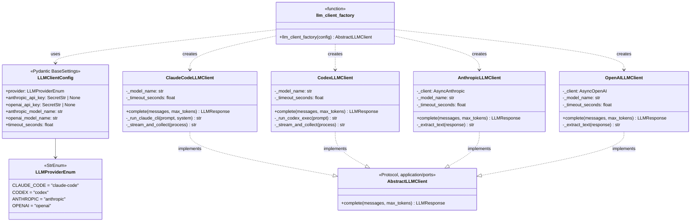
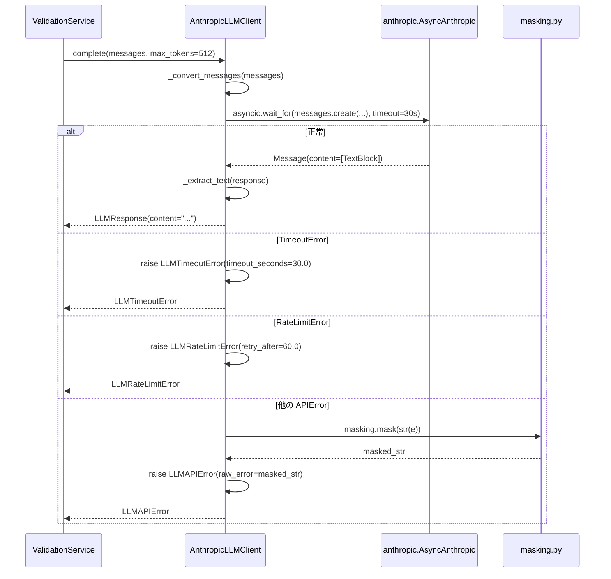

# 基本設計書 — llm-client / infrastructure

> feature: `llm-client`（業務概念）/ sub-feature: `infrastructure`
> 親業務仕様: [`../feature-spec.md`](../feature-spec.md)
> 関連 Issue: [#144 feat(llm-client): 横断利用可能な LLM クライアント基盤](https://github.com/bakufu-dev/bakufu/issues/144)
> 凍結済み設計: [`docs/design/tech-stack.md`](../../../design/tech-stack.md) §LLM Adapter / [`../domain/basic-design.md`](../domain/basic-design.md) §AbstractLLMClient

## 記述ルール（必ず守ること）

基本設計に**疑似コード・サンプル実装（python/ts/sh/yaml 等の言語コードブロック）を書かない**。
ソースコードと二重管理になりメンテナンスコストしか生まない。
必要なのは構造契約（クラス・モジュール・データの関係）であり、実装の細部は [`detailed-design.md`](detailed-design.md) で凍結する。

## §モジュール契約（機能要件）

本 sub-feature が満たすべき機能要件（入力 / 処理 / 出力 / エラー時）を凍結する。業務根拠は [`../feature-spec.md §9 受入基準`](../feature-spec.md) を参照。

### REQ-LC-011: Anthropic LLM クライアントの実装

| 項目 | 内容 |
|---|---|
| 入力 | `messages: tuple[LLMMessage, ...]`、`max_tokens: int`、`LLMClientConfig`（DI 注入）|
| 処理 | `anthropic.AsyncAnthropic` で `messages.create()` を非同期呼び出し。`asyncio.wait_for()` でタイムアウト制御。応答から `_extract_text()` でテキスト抽出 |
| 出力 | `LLMResponse(content=text)` |
| エラー時 | `asyncio.TimeoutError` → `LLMTimeoutError` / `anthropic.RateLimitError` → `LLMRateLimitError` / `anthropic.AuthenticationError` → `LLMAuthError` / その他 `anthropic.APIError` → `LLMAPIError`（MSG-LC-001〜004）/ LLM 空応答 → `LLMAPIError(kind='empty_response')`（MSG-LC-006）/ `_convert_messages` 後 messages リスト空 → `LLMMessagesEmptyError`（MSG-LC-010）|

### REQ-LC-012: OpenAI LLM クライアントの実装

| 項目 | 内容 |
|---|---|
| 入力 | `messages: tuple[LLMMessage, ...]`、`max_tokens: int`、`LLMClientConfig`（DI 注入）|
| 処理 | `openai.AsyncOpenAI` で `chat.completions.create()` を非同期呼び出し。`asyncio.wait_for()` でタイムアウト制御 |
| 出力 | `LLMResponse(content=text)` |
| エラー時 | `asyncio.TimeoutError` → `LLMTimeoutError` / `openai.RateLimitError` → `LLMRateLimitError` / `openai.AuthenticationError` → `LLMAuthError` / その他 `openai.APIError` → `LLMAPIError`（MSG-LC-001〜004）/ LLM 空応答（`content=None`）→ `LLMAPIError(kind='empty_response')`（MSG-LC-006）|

### REQ-LC-013: LLM クライアント設定の構築

| 項目 | 内容 |
|---|---|
| 入力 | 環境変数（`BAKUFU_LLM_PROVIDER` / `BAKUFU_ANTHROPIC_API_KEY` / `BAKUFU_OPENAI_API_KEY` / `BAKUFU_ANTHROPIC_MODEL_NAME` / `BAKUFU_OPENAI_MODEL_NAME` / `BAKUFU_LLM_TIMEOUT_SECONDS` / `BAKUFU_LLM_CLI_MODEL`）|
| 処理 | Pydantic `BaseSettings` で環境変数を読み込み、`LLMClientConfig` を構築する |
| 出力 | `LLMClientConfig` インスタンス |
| エラー時 | 必須環境変数（`BAKUFU_LLM_PROVIDER`）が未設定 → `LLMConfigError`（MSG-LC-007）/ API キーが未設定かつ SDK プロバイダが選択されている → `LLMConfigError`（MSG-LC-008）|

### REQ-LC-014: LLM クライアント factory

| 項目 | 内容 |
|---|---|
| 入力 | `config: LLMClientConfig` |
| 処理 | `config.provider` に基づいて `ClaudeCodeLLMClient` / `CodexLLMClient` / `AnthropicLLMClient` / `OpenAILLMClient` を選択して返す |
| 出力 | `AbstractLLMClient` を実装したインスタンス |
| エラー時 | 未知のプロバイダ名 → `LLMConfigError`（MSG-LC-009）|

### REQ-LC-015: Claude Code CLI クライアントの実装（Phase 1 必須）

| 項目 | 内容 |
|---|---|
| 入力 | `messages: tuple[LLMMessage, ...]`、`max_tokens: int`、`model_name: str`（オプション、`LLMClientConfig.cli_model_name`）|
| 処理 | `asyncio.create_subprocess_exec` で `claude -p <prompt> --system-prompt <system> --model <model> --output-format stream-json --verbose --tools ""` を起動。stdout を JSONL で非同期読み込み。`event_type="result"` の `result` フィールドに最終テキスト。`asyncio.wait_for()` でタイムアウト制御 |
| 出力 | `LLMResponse(content=text)` |
| 認証 | Claude Code OAuthトークン（環境変数 `CLAUDE_HOME` 等で自動認証）。APIキー不要 |
| エラー時 | `asyncio.TimeoutError` → `LLMTimeoutError` / 非ゼロ終了コード → `LLMAPIError` / 空応答 → `LLMAPIError(kind='empty_response')`（MSG-LC-006）|

### REQ-LC-016: Codex CLI クライアントの実装（Phase 1 必須）

| 項目 | 内容 |
|---|---|
| 入力 | `messages: tuple[LLMMessage, ...]`、`max_tokens: int` |
| 処理 | `asyncio.create_subprocess_exec` で `codex exec --json --skip-git-repo-check --ephemeral --dangerously-bypass-approvals-and-sandbox <prompt>` を起動。stdout を JSONL で非同期読み込み。`item.type == "agent_message"` から応答テキスト抽出 |
| 出力 | `LLMResponse(content=text)` |
| 認証 | OpenAIサブスクリプション認証（ローカルインストール済み Codex CLI が自動認証）。APIキー不要 |
| エラー時 | `asyncio.TimeoutError` → `LLMTimeoutError` / 非ゼロ終了コード → `LLMAPIError` / 空応答 → `LLMAPIError(kind='empty_response')`（MSG-LC-006）/ セッション再開失敗 → 新規セッションでリトライ（Codex resume 失敗パターン対応）|

---

## モジュール構成

| 機能 ID | モジュール | ディレクトリ | 責務 |
|---|---|---|---|
| REQ-LC-015 | `ClaudeCodeLLMClient` | `backend/src/bakufu/infrastructure/llm/claude_code_llm_client.py` | Claude Code CLI サブプロセス統合。`AbstractLLMClient` 実装。**Phase 1 必須** |
| REQ-LC-016 | `CodexLLMClient` | `backend/src/bakufu/infrastructure/llm/codex_llm_client.py` | Codex CLI サブプロセス統合。`AbstractLLMClient` 実装。**Phase 1 必須** |
| REQ-LC-011 | `AnthropicLLMClient` | `backend/src/bakufu/infrastructure/llm/anthropic_llm_client.py` | Anthropic SDK 統合。`AbstractLLMClient` 実装（Phase 2 オプション）|
| REQ-LC-012 | `OpenAILLMClient` | `backend/src/bakufu/infrastructure/llm/openai_llm_client.py` | OpenAI SDK 統合。`AbstractLLMClient` 実装（Phase 2 オプション）|
| REQ-LC-013 | `LLMClientConfig` | `backend/src/bakufu/infrastructure/llm/config.py` | 環境変数ベースの設定 VO（Pydantic BaseSettings）|
| REQ-LC-014 | `llm_client_factory` | `backend/src/bakufu/infrastructure/llm/factory.py` | プロバイダ選択・インスタンス生成（CLI / SDK 両対応）|
| — | `LLMProviderEnum` | `backend/src/bakufu/infrastructure/llm/config.py` | プロバイダ種別列挙（`claude-code` / `codex` / `anthropic` / `openai`）|
| — | `__init__.py` | `backend/src/bakufu/infrastructure/llm/__init__.py` | パッケージ公開インターフェース（`llm_client_factory` / `LLMClientConfig` のみ export）|

```
本 sub-feature で追加・変更されるファイル:

backend/src/bakufu/
├── infrastructure/
│   └── llm/                                    # 新規ディレクトリ
│       ├── __init__.py                          # 新規: factory / config のみ公開
│       ├── claude_code_llm_client.py            # 新規: ClaudeCodeLLMClient (Phase 1 必須)
│       ├── codex_llm_client.py                  # 新規: CodexLLMClient (Phase 1 必須)
│       ├── anthropic_llm_client.py              # 新規: AnthropicLLMClient (Phase 2 オプション)
│       ├── openai_llm_client.py                 # 新規: OpenAILLMClient (Phase 2 オプション)
│       ├── config.py                            # 新規: LLMClientConfig / LLMProviderEnum
│       └── factory.py                           # 新規: llm_client_factory
└── (application/ports/llm_client.py は domain sub-feature で追加済み)
```

## ユーザー向けメッセージ一覧

本 sub-feature のメッセージも内部メッセージ（ログ・例外）。エンドユーザー向けの API レスポンスには表示しない。

| ID | 種別 | メッセージ（要旨）| 表示条件 |
|---|---|---|---|
| MSG-LC-006 | エラー | LLM 応答テキスト空→ `LLMAPIError(kind='empty_response')` raise | Anthropic: TextBlock 0件 / OpenAI: content=None 時 |
| MSG-LC-007 | エラー | `BAKUFU_LLM_PROVIDER` 未設定 | `LLMClientConfig` 構築時 |
| MSG-LC-008 | エラー | 選択プロバイダの API キーが未設定 | `LLMClientConfig` 構築時 |
| MSG-LC-009 | エラー | 未知のプロバイダ名 | `llm_client_factory` 呼び出し時 |
| MSG-LC-010 | エラー | system role 除外後 messages リスト空 → `LLMMessagesEmptyError` raise | Anthropic `_convert_messages` で非system メッセージが0件になった時 |

各メッセージの確定文言は [`detailed-design.md §MSG 確定文言表`](detailed-design.md) で凍結する。

## 依存関係

| 区分 | 依存 | バージョン方針 | 備考 |
|---|---|---|---|
| ランタイム | Python 3.12+ | `pyproject.toml` | 既存 |
| ランタイム | pydantic v2 + pydantic-settings | `backend/pyproject.toml` に追加 | `BaseSettings` 使用。pydantic-settings は pydantic v2 系で別パッケージ |
| ランタイム | `anthropic` SDK | `backend/pyproject.toml` に追加 | `anthropic.AsyncAnthropic` 使用 |
| ランタイム | `openai` SDK | `backend/pyproject.toml` に追加 | `openai.AsyncOpenAI` 使用 |
| 内部依存 | `AbstractLLMClient` Port | `bakufu.application.ports.llm_client` | domain sub-feature で定義（依存方向: infrastructure → application/ports）|
| 内部依存 | `LLMMessage` / `LLMResponse` / `LLMClientError` 階層 | `bakufu.domain` | domain sub-feature で定義 |

## クラス設計（概要）



**凝集のポイント**:
- 全クライアントは `AbstractLLMClient` Protocol を実装。pyright strict が Protocol 適合を静的検証する
- `ClaudeCodeLLMClient` / `CodexLLMClient` は CLIサブプロセス（OAuthトークン/サブスク認証）。**APIキー不要**（Phase 1 必須）
- `AnthropicLLMClient` / `OpenAILLMClient` は SDK + APIキー方式（Phase 2 将来オプション）
- `_stream_and_collect()` は各 CLI クライアントのプライベートメソッド。JSONL フォーマットが異なるため共通化しない（Composition over Inheritance）
- `LLMClientConfig` は Pydantic BaseSettings を継承。CLI プロバイダは APIキー設定不要（`SecretStr` フィールドは `optional`）
- 参照実装: `kkm-horikawa/ai-team` の `claude_code_client.py` / `codex_cli_client.py`（https://github.com/kkm-horikawa/ai-team）

## 処理フロー

### ユースケース 1: UC-LC-001 — Anthropic LLM 呼び出し

1. `AnthropicLLMClient.complete(messages, max_tokens)` が呼ばれる
2. `LLMMessage` タプルを Anthropic SDK の `messages` 形式（`[{"role": str, "content": str}]`）に変換
3. `system` role のメッセージを `system` パラメータに分離（Anthropic API 仕様）
4. `asyncio.wait_for(self._client.messages.create(...), timeout=self._timeout_seconds)` を実行
5. 応答から `_extract_text(response)` でテキスト抽出
6. `LLMResponse(content=text)` を返す
7. エラー時は `LLMClientError` サブクラスに変換して raise

### ユースケース 2: UC-LC-002 — プロバイダ切り替え

1. 環境変数 `BAKUFU_LLM_PROVIDER=anthropic` or `openai` を設定
2. アプリ起動時に `LLMClientConfig.model_validate({'provider': os.environ[...]})` を実行
3. `llm_client_factory(config)` が `config.provider` を参照して対応クライアントを返す
4. DI コンテナ / アプリケーション初期化コードが返されたクライアントを Service に注入

### ユースケース 3: UC-LC-003 — エラー変換フロー（Anthropic）

1. `asyncio.TimeoutError` → `LLMTimeoutError(timeout_seconds=config.timeout_seconds)` に変換
2. `anthropic.RateLimitError` → `LLMRateLimitError(retry_after=...)` に変換（Retry-After ヘッダ値があれば設定）
3. `anthropic.AuthenticationError` → `LLMAuthError` に変換
4. その他 `anthropic.APIError` → `LLMAPIError(status_code=..., raw_error=masking(str(e)))` に変換

## シーケンス図



## アーキテクチャへの影響

- [`docs/design/domain-model.md`](../../../design/domain-model.md) への変更: `infrastructure/llm/` パッケージを §モジュール配置 に追記
- [`docs/design/tech-stack.md`](../../../design/tech-stack.md) への変更: §LLM Adapter に `AbstractLLMClient` と `LLMProviderPort` の役割区分、`anthropic` / `openai` SDK の追加依存を明記（同一 PR で更新）
- 既存 feature への波及: `ai-validation`（Issue #123）は本 feature 完了後に `AbstractLLMClient` を DI で受け取る設計に変更

## 外部連携

| 連携先 | 目的 | プロトコル | 認証 | タイムアウト |
|---|---|---|---|---|
| `claude` CLI プロセス | テキスト補完（Phase 1）| CLIサブプロセス（stdout JSONL）| Claude Code OAuthトークン（自動認証、APIキー不要）| `LLMClientConfig.timeout_seconds`（デフォルト 3600s）|
| `codex` CLI プロセス | テキスト補完（Phase 1）| CLIサブプロセス（stdout JSONL）| OpenAIサブスクリプション認証（自動認証、APIキー不要）| 同上 |
| `api.anthropic.com` | テキスト補完（Phase 2 オプション）| HTTPS | `BAKUFU_ANTHROPIC_API_KEY`（SecretStr）| 同上（デフォルト 30s）|
| `api.openai.com` | テキスト補完（Phase 2 オプション）| HTTPS | `BAKUFU_OPENAI_API_KEY`（SecretStr）| 同上 |

## UX 設計

該当なし — 理由: 本 sub-feature はバックエンド infrastructure 実装のみ。エンドユーザーへの直接 UI は持たない。

## セキュリティ設計

### 脅威モデル

| 想定攻撃者 | 攻撃経路 | 保護資産 | 対策 |
|---|---|---|---|
| **T1: 内部コード誤実装** | `config.anthropic_api_key.get_secret_value()` をログ出力 | API キー平文漏洩 | `SecretStr` 採用（R1-2）。ログ出力時は `config.anthropic_api_key`（masked）を使用 |
| **T2: エラーメッセージ経由の漏洩** | `LLMAPIError.raw_error` に API キーを含む SDK エラーメッセージをそのまま格納 | API キー漏洩 | `raw_error` 格納前に `masking.py` を通す（確定 E）|
| **T3: 環境変数の意図せぬ伝搬** | 他の subprocess へ API キーが漏洩 | API キー平文漏洩 | HTTP API 直接呼び出しのため subprocess 不使用。SDK が HTTPS で送信するのみ |

詳細な信頼境界は [`docs/design/threat-model.md`](../../../design/threat-model.md)。

## ER 図

該当なし — 理由: 本 sub-feature は永続化を持たない。

## エラーハンドリング方針

| 例外種別 | 処理方針 | ユーザーへの通知 |
|---|---|---|
| `LLMConfigError` | アプリ起動時に Fail Fast（設定不備は起動不能）| MSG-LC-007〜009（stderr）|
| `LLMTimeoutError` | 呼び出し元 Service に伝播 | MSG-LC-001（ログ）|
| `LLMRateLimitError` | 同上 | MSG-LC-002（ログ）|
| `LLMAuthError` | 同上（リトライ不要）| MSG-LC-003（ログ）|
| `LLMAPIError` | 同上 | MSG-LC-004（ログ）|
