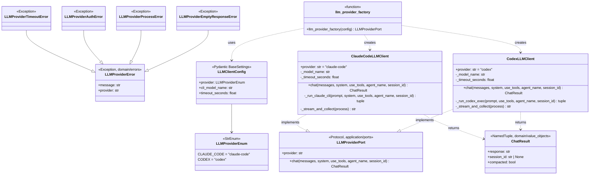
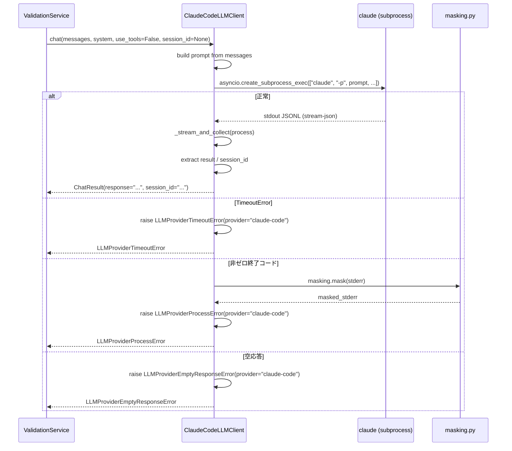

# 基本設計書 — llm-client / infrastructure

> feature: `llm-client`（業務概念）/ sub-feature: `infrastructure`
> 親業務仕様: [`../feature-spec.md`](../feature-spec.md)
> 関連 Issue: [#144 feat(llm-client): 横断利用可能な LLM クライアント基盤](https://github.com/bakufu-dev/bakufu/issues/144)
> 凍結済み設計: [`docs/design/tech-stack.md`](../../../design/tech-stack.md) §LLM Adapter / [`../domain/basic-design.md`](../domain/basic-design.md)

## 記述ルール（必ず守ること）

基本設計に**疑似コード・サンプル実装（python/ts/sh/yaml 等の言語コードブロック）を書かない**。
ソースコードと二重管理になりメンテナンスコストしか生まない。
必要なのは構造契約（クラス・モジュール・データの関係）であり、実装の細部は [`detailed-design.md`](detailed-design.md) で凍結する。

## §モジュール契約（機能要件）

本 sub-feature が満たすべき機能要件（入力 / 処理 / 出力 / エラー時）を凍結する。業務根拠は [`../feature-spec.md §9 受入基準`](../feature-spec.md) を参照。

### REQ-LC-013: LLM クライアント設定の構築

| 項目 | 内容 |
|---|---|
| 入力 | 環境変数（`BAKUFU_LLM_PROVIDER` / `BAKUFU_LLM_CLI_MODEL` / `BAKUFU_LLM_TIMEOUT_SECONDS`）|
| 処理 | Pydantic `BaseSettings` で環境変数を読み込み、`LLMClientConfig` を構築する |
| 出力 | `LLMClientConfig` インスタンス |
| エラー時 | 必須環境変数（`BAKUFU_LLM_PROVIDER`）が未設定 → `LLMConfigError`（MSG-LC-007）/ 未知のプロバイダ名 → `LLMConfigError`（MSG-LC-009）|

### REQ-LC-014: LLM プロバイダ factory

| 項目 | 内容 |
|---|---|
| 入力 | `config: LLMClientConfig` |
| 処理 | `config.provider` に基づいて `ClaudeCodeLLMClient` / `CodexLLMClient` を選択して返す |
| 出力 | `LLMProviderPort` を実装したインスタンス |
| エラー時 | 未知のプロバイダ名 → `LLMConfigError`（MSG-LC-009）|

### REQ-LC-015: Claude Code CLI クライアントの実装

| 項目 | 内容 |
|---|---|
| 入力 | `messages: list[dict]`、`system: str`、`use_tools: bool`、`agent_name: str`、`session_id: str \| None`（`LLMClientConfig` DI 注入）|
| 処理 | `asyncio.create_subprocess_exec` で `claude -p <prompt> --system-prompt <system> --model <model_name> --output-format stream-json --verbose --tools ""` を起動。`use_tools=True` の場合は `--permission-mode bypassPermissions` を追加し `--tools ""` は省略。セッション継続時は `--resume <session_id>`、新規時は `--session-id <new_uuid>`。stdout を JSONL で非同期読み込み。`event_type="result"` の `result` フィールドに最終テキスト。`asyncio.wait_for()` でタイムアウト制御 |
| 出力 | `ChatResult(response=text, session_id=session_id, compacted=compacted)` |
| 認証 | Claude Code OAuthトークン（`CLAUDE_HOME` 等で自動認証）。APIキー不要 |
| エラー時 | `asyncio.TimeoutError` → `LLMProviderTimeoutError` / 非ゼロ終了コード → `LLMProviderProcessError` / 空応答 → `LLMProviderEmptyResponseError`（MSG-LC-006）|

### REQ-LC-016: Codex CLI クライアントの実装

| 項目 | 内容 |
|---|---|
| 入力 | `messages: list[dict]`、`system: str`、`use_tools: bool`、`agent_name: str`、`session_id: str \| None`（`LLMClientConfig` DI 注入）|
| 処理 | `asyncio.create_subprocess_exec` で `codex exec --json --skip-git-repo-check --ephemeral --dangerously-bypass-approvals-and-sandbox <prompt>` を起動。stdout を JSONL で非同期読み込み。`item.type == "agent_message"` から応答テキスト抽出。`asyncio.wait_for()` でタイムアウト制御 |
| 出力 | `ChatResult(response=text, session_id=None, compacted=False)` |
| 認証 | OpenAIサブスクリプション認証（ローカルインストール済み Codex CLI が自動認証）。APIキー不要 |
| エラー時 | `asyncio.TimeoutError` → `LLMProviderTimeoutError` / 非ゼロ終了コード → `LLMProviderProcessError` / 空応答 → `LLMProviderEmptyResponseError`（MSG-LC-006）|
| セキュリティ注記 | `--dangerously-bypass-approvals-and-sandbox` フラグの技術的根拠は §確定 SEC5 を参照 |

### REQ-LC-017: LLMProviderPort Protocol の定義

| 項目 | 内容 |
|---|---|
| 入力 | — |
| 処理 | CLI サブプロセス統合クライアントの共通インターフェースを Protocol として定義する |
| 出力 | `LLMProviderPort` Protocol（`provider: str` プロパティ + `async chat()` メソッド）|
| エラー時 | — |

### REQ-LC-018: ChatResult VO の定義

| 項目 | 内容 |
|---|---|
| 入力 | `response: str`、`session_id: str \| None`、`compacted: bool`（デフォルト `False`）|
| 処理 | `NamedTuple` として不変 VO を定義する |
| 出力 | `ChatResult` インスタンス |
| エラー時 | — |

### REQ-LC-019: LLMProviderError 階層の定義

| 項目 | 内容 |
|---|---|
| 入力 | `message: str`、`provider: str` |
| 処理 | CLI サブプロセス呼び出し時の例外を `LLMProviderError` 基底クラスとサブクラス階層として定義する |
| 出力 | `LLMProviderError` + 4 サブクラス（Timeout / Auth / Process / EmptyResponse）|
| エラー時 | — |

---

## モジュール構成

| 機能 ID | モジュール | ディレクトリ | 責務 |
|---|---|---|---|
| REQ-LC-017 | `LLMProviderPort` | `backend/src/bakufu/application/ports/llm_provider_port.py` | CLI サブプロセス統合の Port（Protocol）。`provider: str` プロパティ + `chat()` メソッド |
| REQ-LC-018 | `ChatResult` | `backend/src/bakufu/domain/value_objects.py`（追記）| LLM CLI 応答の値オブジェクト（NamedTuple）|
| REQ-LC-019 | `LLMProviderError` 階層 | `backend/src/bakufu/domain/errors.py`（追記）| CLI サブプロセス例外の基底クラスとサブクラス |
| REQ-LC-015 | `ClaudeCodeLLMClient` | `backend/src/bakufu/infrastructure/llm/claude_code_llm_client.py` | Claude Code CLI サブプロセス統合。`LLMProviderPort` 実装 |
| REQ-LC-016 | `CodexLLMClient` | `backend/src/bakufu/infrastructure/llm/codex_llm_client.py` | Codex CLI サブプロセス統合。`LLMProviderPort` 実装 |
| REQ-LC-013 | `LLMClientConfig` | `backend/src/bakufu/infrastructure/llm/config.py` | 環境変数ベースの設定 VO（Pydantic BaseSettings）。APIキーフィールドなし |
| REQ-LC-014 | `llm_provider_factory` | `backend/src/bakufu/infrastructure/llm/factory.py` | プロバイダ選択・インスタンス生成（CLI のみ）|
| — | `LLMProviderEnum` | `backend/src/bakufu/infrastructure/llm/config.py` | プロバイダ種別列挙（`claude-code` / `codex` のみ）|
| — | `__init__.py` | `backend/src/bakufu/infrastructure/llm/__init__.py` | パッケージ公開インターフェース（`llm_provider_factory` / `LLMClientConfig` のみ export）|

```
本 sub-feature で追加・変更されるファイル:

backend/src/bakufu/
├── application/
│   └── ports/
│       └── llm_provider_port.py            # 新規: LLMProviderPort Protocol
├── domain/
│   ├── value_objects.py                    # 追記: ChatResult NamedTuple
│   └── errors.py                           # 追記: LLMProviderError 例外階層
└── infrastructure/
    └── llm/                                # 新規ディレクトリ
        ├── __init__.py                     # 新規: factory / config のみ公開
        ├── claude_code_llm_client.py       # 新規: ClaudeCodeLLMClient
        ├── codex_llm_client.py             # 新規: CodexLLMClient
        ├── config.py                       # 新規: LLMClientConfig / LLMProviderEnum
        └── factory.py                      # 新規: llm_provider_factory
```

## ユーザー向けメッセージ一覧

本 sub-feature のメッセージも内部メッセージ（ログ・例外）。エンドユーザー向けの API レスポンスには表示しない。

| ID | 種別 | メッセージ（要旨）| 表示条件 |
|---|---|---|---|
| MSG-LC-006 | エラー | LLM 応答テキスト空 → `LLMProviderEmptyResponseError` raise | CLI stdout から応答テキストが取得できなかった時 |
| MSG-LC-007 | エラー | `BAKUFU_LLM_PROVIDER` 未設定 | `LLMClientConfig` 構築時 |
| MSG-LC-009 | エラー | 未知のプロバイダ名 | `llm_provider_factory` 呼び出し時 |

各メッセージの確定文言は [`detailed-design.md §MSG 確定文言表`](detailed-design.md) で凍結する。

## 依存関係

| 区分 | 依存 | バージョン方針 | 備考 |
|---|---|---|---|
| ランタイム | Python 3.12+ | `pyproject.toml` | 既存 |
| ランタイム | pydantic v2 + pydantic-settings | `backend/pyproject.toml` | `BaseSettings` 使用 |
| 外部コマンド | `claude` CLI | システムインストール済み | Claude Code OAuthトークン認証。APIキー不要 |
| 外部コマンド | `codex` CLI | システムインストール済み | OpenAIサブスクリプション認証。APIキー不要 |
| 内部依存 | `LLMProviderPort` Port | `bakufu.application.ports.llm_provider_port` | 本 sub-feature で新規定義 |
| 内部依存 | `ChatResult` / `LLMProviderError` 階層 | `bakufu.domain` | 本 sub-feature で追記 |

**注意**: `anthropic` SDK / `openai` SDK への依存は**一切ない**。全 LLM 呼び出しは CLI サブプロセス経由のみ。

## クラス設計（概要）



**凝集のポイント**:
- 全クライアントは `LLMProviderPort` Protocol を実装。`provider: str` プロパティで呼び出し元（`ValidationService` 等）がプロバイダ名を取得可能（Issue D 対応）
- `ClaudeCodeLLMClient` / `CodexLLMClient` ともに CLI サブプロセス（OAuthトークン / サブスク認証）。**APIキー不要**
- `_stream_and_collect()` は各クライアントのプライベートメソッド。JSONL フォーマットが異なるため共通化しない（Composition over Inheritance）
- `LLMClientConfig` は Pydantic BaseSettings を継承。`anthropic_api_key` / `openai_api_key` フィールドは持たない
- 参照実装: `kkm-horikawa/ai-team` の `claude_code_client.py` / `codex_cli_client.py`（https://github.com/kkm-horikawa/ai-team）

## 処理フロー

### ユースケース 1: UC-LC-001 — Claude Code CLI 呼び出し

1. `ClaudeCodeLLMClient.chat(messages, system, use_tools=False, agent_name="", session_id=None)` が呼ばれる
2. `messages` リストから最終ユーザーメッセージをプロンプト文字列に変換
3. `asyncio.create_subprocess_exec` で `claude` CLI をリスト引数形式で起動（§確定 CMD-EXEC 準拠）
4. `_stream_and_collect(process)` で stdout JSONL を非同期読み込み
5. `event_type="result"` エントリから `result` と `session_id` / `is_error` を抽出
6. `ChatResult(response=text, session_id=session_id, compacted=compacted)` を返す
7. エラー時は `LLMProviderError` サブクラスに変換して raise

### ユースケース 2: UC-LC-002 — プロバイダ切り替え

1. 環境変数 `BAKUFU_LLM_PROVIDER=claude-code` または `codex` を設定
2. アプリ起動時に `LLMClientConfig` を構築
3. `llm_provider_factory(config)` が `config.provider` を参照して対応クライアントを返す
4. DI コンテナ / アプリケーション初期化コードが返されたクライアントを Service に注入

### ユースケース 3: UC-LC-003 — エラー変換フロー（CLI）

1. `asyncio.TimeoutError` → `LLMProviderTimeoutError(message=..., provider=self.provider)` に変換
2. 非ゼロ終了コード → `LLMProviderProcessError(message=..., provider=self.provider)` に変換
3. 空応答 stdout → `LLMProviderEmptyResponseError(message=..., provider=self.provider)` に変換

## シーケンス図



## アーキテクチャへの影響

- [`docs/design/domain-model.md`](../../../design/domain-model.md) への変更: `infrastructure/llm/` パッケージを §モジュール配置 に追記
- [`docs/design/tech-stack.md`](../../../design/tech-stack.md) への変更: §LLM Adapter に `LLMProviderPort`（CLI subprocess 専用）の役割区分を明記。`anthropic` / `openai` SDK 依存を削除（同一 PR で更新）
- 既存 feature への波及: `ai-validation` は本 feature 完了後に `LLMProviderPort` を DI で受け取る設計。`ValidationService` は `self._llm_provider.provider` でプロバイダ名を取得できる

## 外部連携

| 連携先 | 目的 | プロトコル | 認証 | タイムアウト |
|---|---|---|---|---|
| `claude` CLI プロセス | テキスト補完 | CLIサブプロセス（stdout JSONL / stream-json）| Claude Code OAuthトークン（自動認証、APIキー不要）| `LLMClientConfig.timeout_seconds`（デフォルト 3600s）|
| `codex` CLI プロセス | テキスト補完 | CLIサブプロセス（stdout JSONL）| OpenAIサブスクリプション認証（自動認証、APIキー不要）| 同上 |

## UX 設計

該当なし — 理由: 本 sub-feature はバックエンド infrastructure 実装のみ。エンドユーザーへの直接 UI は持たない。

## セキュリティ設計

### §確定 CMD-EXEC — サブプロセス実行規則

- ALWAYS `asyncio.create_subprocess_exec(*cmd_list, ...)` を使用し、引数はリスト形式で渡す（文字列連結禁止）
- NEVER `shell=True` を使用しない
- プロンプト文字列はリストの単一要素として渡す（シェル解釈されない）
- サブプロセスを起動できるのは `ClaudeCodeLLMClient` / `CodexLLMClient` のみ（本 feature 内）
- subprocess の環境変数はallow-listで管理（`PATH`, `HOME`, `LANG`, `BAKUFU_*`）。詳細は `tech-stack.md §subprocess 環境変数ハンドリング` を参照

### §確定 SEC5 — Codex `--dangerously-bypass-approvals-and-sandbox` 技術的根拠

**根拠**: `codex exec` はデフォルトでファイル操作・プロセス実行等の操作に対してインタラクティブな承認ダイアログを表示する。バッチ処理（非インタラクティブ）モードではこのダイアログに応答できないため、`--dangerously-bypass-approvals-and-sandbox` が必須となる。

**緩和策**:
- `--ephemeral` フラグにより呼び出しごとに新規コンテキストを生成。永続状態なし
- プロンプトは ai-validation §確定B 定義の `--- BEGIN CONTENT ---` / `--- END CONTENT ---` デリミタで囲まれる
- プロンプトは JSON のみ応答を指示し、コード実行を要求しない
- stderr は masking.py を通してからログ保存

**リスク受容判断**: テキスト評価ユースケース（DeliverableRecord の内容評価）においてデリミタ + JSON のみプロンプト構造が多層防御を提供するため、リスクを受容する。DeliverableRecord の内容に敵対的な命令が含まれていた場合もデリミタ + JSON 強制によりコマンド実行の連鎖を防ぐ。

### 脅威モデル

| ID | 想定攻撃者 | 攻撃経路 | 保護資産 | 対策 |
|---|---|---|---|---|
| T1 | 内部コード誤実装 | `LLMClientConfig` のフィールドをログ出力 | APIキー漏洩 | 本設計に APIキーフィールドなし。`LLMClientConfig` は秘密フィールドを持たない |
| T2 | エラーメッセージ経由の漏洩 | `LLMProviderError.message` に認証トークン詳細を含む | 認証トークン / パス漏洩 | `LLMProviderError.message` はサニタイズ済みエラー種別情報のみ。stderr は masking.py 経由で保存 |
| T3 | 環境変数の意図せぬ伝搬 | 子サブプロセスが親の全環境変数（秘密情報含む）を継承 | 秘密情報の CLI プロセスへの漏洩 | サブプロセスの env は allow-list 管理（`PATH`, `HOME`, `LANG`, `BAKUFU_*`）。詳細は `tech-stack.md §subprocess 環境変数ハンドリング` |
| T4 | stderr 漏洩 | CLI の stderr に認証エラー詳細が含まれる | ログへの認証情報漏洩 | stderr を個別捕捉し、masking.py 経由でフィルタ後に保存 |
| T5 | シェルインジェクション（プロンプト経由）| プロンプト文字列をシェルコマンドに文字列連結 | 任意コマンド実行 | §確定 CMD-EXEC: 常に subprocess exec 形式（リスト引数、`shell=True` 禁止）|
| T6 | Codex サンドボックスバイパス | `--dangerously-bypass-approvals-and-sandbox` がコード実行承認なしで動作 | システム整合性 | §確定 SEC5: `--ephemeral` + デリミタ分離 + JSON のみプロンプトで緩和 |

詳細な信頼境界は [`docs/design/threat-model.md`](../../../design/threat-model.md)。

## ER 図

該当なし — 理由: 本 sub-feature は永続化を持たない。

## エラーハンドリング方針

| 例外種別 | 処理方針 | ユーザーへの通知 |
|---|---|---|
| `LLMConfigError` | アプリ起動時に Fail Fast（設定不備は起動不能）| MSG-LC-007〜009（stderr）|
| `LLMProviderTimeoutError` | 呼び出し元 Service に伝播 | MSG-LC-001（ログ）|
| `LLMProviderAuthError` | 同上（リトライ不要）| MSG-LC-003（ログ）|
| `LLMProviderProcessError` | 同上 | MSG-LC-004（ログ）|
| `LLMProviderEmptyResponseError` | 同上 | MSG-LC-006（ログ）|
