# 詳細設計書 — llm-client / infrastructure

> feature: `llm-client` / sub-feature: `infrastructure`
> 親業務仕様: [`../feature-spec.md`](../feature-spec.md)
> 関連: [`basic-design.md`](basic-design.md) / [`../domain/detailed-design.md`](../domain/detailed-design.md)

## 本書の役割

本書は **階層 3: モジュール（sub-feature）の詳細設計**（Module-level Detailed Design）を凍結する。[`basic-design.md`](basic-design.md) で凍結されたモジュール基本設計を、実装直前の **構造契約・確定文言・型制約・SDK 統合パターン** として詳細化する。

## 記述ルール（必ず守ること）

詳細設計に**疑似コード・サンプル実装（python/ts/sh/yaml 等の言語コードブロック）を書かない**。
必要なのは「構造契約（属性名・型・制約）」と「確定文言（メッセージ文字列）」と「実装の意図（なぜこの API 形になるか）」のみ。

## クラス設計（詳細）

```mermaid
classDiagram
    class AnthropicLLMClient {
        -_client: anthropic.AsyncAnthropic
        -_model_name: str
        -_timeout_seconds: float
        +complete(messages: tuple[LLMMessage, ...], max_tokens: int) LLMResponse
        -_extract_text(response: anthropic.types.Message) str
        -_convert_messages(messages: tuple[LLMMessage, ...]) tuple[list[dict], str | None]
    }

    class OpenAILLMClient {
        -_client: openai.AsyncOpenAI
        -_model_name: str
        -_timeout_seconds: float
        +complete(messages: tuple[LLMMessage, ...], max_tokens: int) LLMResponse
        -_extract_text(response: openai.types.chat.ChatCompletion) str
        -_convert_messages(messages: tuple[LLMMessage, ...]) list[dict]
    }

    class LLMClientConfig {
        <<Pydantic BaseSettings>>
        +provider: LLMProviderEnum
        +anthropic_api_key: SecretStr | None
        +openai_api_key: SecretStr | None
        +anthropic_model_name: str
        +openai_model_name: str
        +timeout_seconds: float
        +model_config: SettingsConfigDict
    }

    class LLMProviderEnum {
        <<StrEnum>>
        ANTHROPIC = "anthropic"
        OPENAI = "openai"
    }

    class LLMConfigError {
        <<Exception, infrastructure/llm/config.py>>
        +field: str
        +message: str
    }
```

**注記 — `LLMConfigError` の継承関係**:
`LLMConfigError` は `Exception` を直接継承する（`LLMClientError` のサブクラスではない）。設定エラーは LLM API 呼び出し失敗とは別概念。呼び出し元は `except LLMClientError:` では catch できない。詳細は [`../domain/detailed-design.md §設計判断の補足`](../domain/detailed-design.md)。

---

### Class: AnthropicLLMClient

**配置先**: `backend/src/bakufu/infrastructure/llm/anthropic_llm_client.py`

| 属性 | 型 | 制約 | 意図 |
|---|---|---|---|
| `_client` | `anthropic.AsyncAnthropic` | private, required | SDK クライアントインスタンス。`__init__` で `api_key=config.anthropic_api_key.get_secret_value()` を渡して初期化 |
| `_model_name` | `str` | private, required | `LLMClientConfig.anthropic_model_name` から注入（例: `"claude-3-5-sonnet-20241022"`）|
| `_timeout_seconds` | `float` | private, required | `LLMClientConfig.timeout_seconds` から注入 |

**メソッド仕様**:

| メソッド | 引数 | 戻り値 | 説明 |
|---|---|---|---|
| `complete` | `messages: tuple[LLMMessage, ...]`, `max_tokens: int` | `LLMResponse` | Protocol 実装。`_convert_messages` → `asyncio.wait_for(messages.create(...))` → `_extract_text` の順で処理 |
| `_extract_text` | `response: anthropic.types.Message` | `str` | `response.content` の `TextBlock` を探して `.text` を返す。TextBlock が 0 件の場合は `LLMAPIError(kind='empty_response')` を raise（MSG-LC-006）|
| `_convert_messages` | `messages: tuple[LLMMessage, ...]` | `tuple[list[dict], str \| None]` | `MessageRole.SYSTEM` のメッセージを `system` 引数に分離（結合して `\n\n` で繋ぐ）、残りを `messages` リストに変換。Anthropic API は `messages` に `system` role を含められないため |

**不変条件**:
- `_convert_messages` 後に `messages` リスト（system 除外済み）が空になる場合は `LLMMessagesEmptyError` を raise（MSG-LC-010）
- `messages.create()` への `model` は `_model_name`、`max_tokens` は呼び出し元が渡した値をそのまま使用（固定値禁止）

---

### Class: OpenAILLMClient

**配置先**: `backend/src/bakufu/infrastructure/llm/openai_llm_client.py`

| 属性 | 型 | 制約 | 意図 |
|---|---|---|---|
| `_client` | `openai.AsyncOpenAI` | private, required | SDK クライアントインスタンス。`api_key=config.openai_api_key.get_secret_value()` で初期化 |
| `_model_name` | `str` | private, required | `LLMClientConfig.openai_model_name` から注入（例: `"gpt-4o-mini"`）|
| `_timeout_seconds` | `float` | private, required | `LLMClientConfig.timeout_seconds` から注入 |

**メソッド仕様**:

| メソッド | 引数 | 戻り値 | 説明 |
|---|---|---|---|
| `complete` | `messages: tuple[LLMMessage, ...]`, `max_tokens: int` | `LLMResponse` | Protocol 実装。`_convert_messages` → `asyncio.wait_for(chat.completions.create(...))` → `_extract_text` の順で処理 |
| `_extract_text` | `response: openai.types.chat.ChatCompletion` | `str` | `response.choices[0].message.content` を返す。`None` または空文字の場合は `LLMAPIError(kind='empty_response')` を raise（MSG-LC-006）|
| `_convert_messages` | `messages: tuple[LLMMessage, ...]` | `list[dict]` | OpenAI API は `system` role を `messages` リストに含めてよいため、そのまま `[{"role": m.role, "content": m.content}]` に変換 |

---

### Class: LLMClientConfig

**配置先**: `backend/src/bakufu/infrastructure/llm/config.py`

| 属性 | 型 | 制約 | 環境変数 | 意図 |
|---|---|---|---|---|
| `provider` | `LLMProviderEnum` | required | `BAKUFU_LLM_PROVIDER` | プロバイダ選択。未設定なら起動時 Fail Fast |
| `anthropic_api_key` | `SecretStr \| None` | optional | `BAKUFU_ANTHROPIC_API_KEY` | `provider=anthropic` のとき必須。未設定なら `LLMConfigError`（MSG-LC-008）|
| `openai_api_key` | `SecretStr \| None` | optional | `BAKUFU_OPENAI_API_KEY` | `provider=openai` のとき必須。未設定なら `LLMConfigError`（MSG-LC-008）|
| `anthropic_model_name` | `str` | required | `BAKUFU_ANTHROPIC_MODEL_NAME` | デフォルト `"claude-3-5-sonnet-20241022"`（確定 C）。プロバイダ別に独立して上書き可能 |
| `openai_model_name` | `str` | required | `BAKUFU_OPENAI_MODEL_NAME` | デフォルト `"gpt-4o-mini"`（確定 C）。プロバイダ別に独立して上書き可能 |
| `timeout_seconds` | `float` | required, 1.0 以上 | `BAKUFU_LLM_TIMEOUT_SECONDS` | デフォルト `30.0` |

**不変条件**:
- `model_validate` 後に `model_validator(mode='after')` で: `provider == ANTHROPIC` かつ `anthropic_api_key is None` → `LLMConfigError`（MSG-LC-008）、`provider == OPENAI` かつ `openai_api_key is None` → `LLMConfigError`（MSG-LC-008）
- `SettingsConfigDict(env_prefix='BAKUFU_', env_file='.env', env_file_encoding='utf-8')` を設定（開発時 `.env` ファイルからも読み込み可能）

---

### Function: llm_client_factory

**配置先**: `backend/src/bakufu/infrastructure/llm/factory.py`

| 引数 | 型 | 制約 |
|---|---|---|
| `config` | `LLMClientConfig` | required |

| 戻り値 | 型 |
|---|---|
| クライアントインスタンス | `AbstractLLMClient`（Protocol）|

**処理フロー**:
1. `config.provider == LLMProviderEnum.ANTHROPIC` → `AnthropicLLMClient(config)` を返す（`_model_name = config.anthropic_model_name`）
2. `config.provider == LLMProviderEnum.OPENAI` → `OpenAILLMClient(config)` を返す（`_model_name = config.openai_model_name`）
3. その他（`LLMProviderEnum` の将来拡張で来る可能性）→ `LLMConfigError(MSG-LC-009)` を raise

---

## 確定事項（先送り撤廃）

### 確定 A: `asyncio.wait_for()` でタイムアウト制御（SDK 内蔵のタイムアウトは使わない）

ai-team `anthropic_client.py:L31` の実証済みパターンを踏襲する。

**根拠**:
- Anthropic SDK / OpenAI SDK にも `timeout` パラメータはあるが、`asyncio.wait_for()` との二重制御になる
- `asyncio.wait_for()` は Python 標準ライブラリで、SDK 非依存のタイムアウト制御ができる
- `asyncio.TimeoutError` を確実に raise できるため、`LLMTimeoutError` への変換が明確

### 確定 B: 対応 SDK バージョン

| SDK | 最小バージョン | 根拠 |
|---|---|---|
| `anthropic` | `>=0.40.0` | `anthropic.AsyncAnthropic` / `anthropic.types.Message` / `anthropic.APIError` が安定化したバージョン。[公式 Python SDK changelog](https://github.com/anthropics/anthropic-sdk-python/blob/main/CHANGELOG.md) 参照 |
| `openai` | `>=1.30.0` | `openai.AsyncOpenAI` / `chat.completions.create` / `openai.APIError` が安定した v1 系。`max_completion_tokens` は `>=1.30.0` で利用可能。[公式 Python SDK changelog](https://github.com/openai/openai-python/blob/main/CHANGELOG.md) 参照 |
| `pydantic-settings` | `>=2.0.0` | pydantic v2 系の `BaseSettings`。pydantic v2 以降は別パッケージに分離されている。[公式ドキュメント](https://docs.pydantic.dev/latest/concepts/pydantic_settings/) 参照 |

`backend/pyproject.toml` の `dependencies` に追加:
- `anthropic>=0.40.0`
- `openai>=1.30.0`
- `pydantic-settings>=2.0.0`

### 確定 C: プロバイダ別モデル名（`BAKUFU_ANTHROPIC_MODEL_NAME` / `BAKUFU_OPENAI_MODEL_NAME`）

単一の `BAKUFU_LLM_MODEL_NAME` は採用しない。プロバイダ別に独立した環境変数を持つ。

| プロバイダ | 環境変数 | デフォルト値 | 根拠 |
|---|---|---|---|
| Anthropic | `BAKUFU_ANTHROPIC_MODEL_NAME` | `"claude-3-5-sonnet-20241022"` | ai-team での実績。コスト・品質・速度バランス最適（[Anthropic モデル比較](https://docs.anthropic.com/ja/docs/about-claude/models)）|
| OpenAI | `BAKUFU_OPENAI_MODEL_NAME` | `"gpt-4o-mini"` | コスト効率が高く評価・分類タスクに十分（[OpenAI モデル比較](https://platform.openai.com/docs/models)）|

**根拠（なぜ分離するか）**: 単一 `BAKUFU_LLM_MODEL_NAME` の場合、Anthropic → OpenAI 切り替え時に model_name も同時に変えなければならず設定ミスが発生しやすい。また将来 `ai-validation` が Anthropic、別 feature が OpenAI を同時使用するシナリオで対応できない（ヘルスバーグ §重大欠陥 6 の教訓）。

### 確定 D: `_extract_text` は空応答時に Fail Fast（`LLMAPIError(kind='empty_response')`）

LLM が空テキストを返した場合（Anthropic: TextBlock 0 件、OpenAI: `choices[0].message.content is None`）、フォールバック文字列への silently 置換は禁止。`LLMAPIError(kind='empty_response')` を raise する。

**根拠**: [`../domain/detailed-design.md §確定 F`](../domain/detailed-design.md)。呼び出し元 Service に「LLM が応答を返さなかった」という情報を伝える。フォールバック文字列ではその情報が消失し、業務ロジックが誤判断する危険がある。

### 確定 E: `LLMAPIError.raw_error` は `masking.mask()` 適用後のみ格納

SDK 例外の `str(e)` を `raw_error` に格納する前に `bakufu.infrastructure.security.masking` の `masking.mask()` を呼ぶ。`masking.mask_secrets()` は存在しないため使用禁止。

**根拠**: Tabriz セキュリティレビュー BUG-SEC-1 で `mask_secrets()` が存在しないことが確認された（`masking.py` の `__all__` は `mask` / `mask_in` のみ）。正しい呼び出し: `masking.mask(str(sdk_error))`。API キーが SDK エラーメッセージに含まれる場合（例: Anthropic の `AuthenticationError`）に平文漏洩を防ぐ。

### 確定 F: Anthropic の `system` role 分離方針

Anthropic API の `messages.create()` は `messages` リストに `system` role を含めることを禁止しており、`system` パラメータで別途渡す必要がある。

**変換ルール（`_convert_messages` の戻り値 `tuple[list[dict], str | None]`）**:
1. `MessageRole.SYSTEM` のメッセージを全て抽出し、`content` を `\n\n` で結合して `system` 文字列を構築
2. 残りの `user` / `assistant` メッセージを `list[dict]` として構築
3. `system` メッセージが 0 件の場合は `str | None` の `None` を返す（SDK デフォルト動作）
4. `system` メッセージが複数件の場合は結合（複数 `system` ブロックを Anthropic API は受け付けないため）
5. 手順 2 の結果リストが空の場合は `LLMMessagesEmptyError` を raise（Fail Fast）

OpenAI は `system` role をそのまま `messages` リストに含めてよい（差分あり）。OpenAI の `_convert_messages` 戻り値は `list[dict]`（Anthropic との差分）。

### 確定 G: `__init__.py` の公開 API

`backend/src/bakufu/infrastructure/llm/__init__.py` は以下のみを export する:

| export 名 | 実体 |
|---|---|
| `llm_client_factory` | `factory.py` の関数 |
| `LLMClientConfig` | `config.py` の Pydantic モデル |
| `LLMProviderEnum` | `config.py` の StrEnum |

`AnthropicLLMClient` / `OpenAILLMClient` は外部から直接インスタンス化することを禁止（factory 経由のみ）。呼び出し元は `AbstractLLMClient` Protocol 型で受け取る。

---

## 設計判断の補足

### なぜ `_convert_messages` を private メソッドにするか

- SDK のメッセージ形式変換は「AnthropicLLMClient の実装詳細」。Protocol 定義（`AbstractLLMClient`）には存在しない
- テストで `_convert_messages` の出力を直接検証したい場合は `AnthropicLLMClient` を具体型として参照する（Protocol 型では不可）
- Composition over Inheritance: 変換ロジックを共通基底クラスに持たせると、OpenAI の変換方式が変わったときに基底クラスの変更が他の実装に影響する

### なぜ `LLMClientConfig` を Pydantic BaseSettings にするか

- 既存の bakufu 設定管理と一貫性を保つ（将来 `Settings` 統合時に接続しやすい）
- 環境変数 → `SecretStr` の自動変換を Pydantic が処理するため、自前の解析ロジックが不要
- `.env` ファイルサポートにより開発環境でのテストが容易

### なぜ `timeout_seconds` をクライアントインスタンスに保持するか（呼び出し時に渡さない）

- タイムアウトはプロバイダ設定の一部（`LLMClientConfig`）であり、呼び出し側のビジネスロジックではない
- `complete(messages, max_tokens, timeout=...)` にすると呼び出し元 Service が毎回タイムアウト値を意識する必要がある（不要な責務移転）
- `max_tokens` は「タスクの性質」に依存するため呼び出し元が指定する。`timeout_seconds` は「インフラ設定」に依存するため設定から注入する

---

## ユーザー向けメッセージの確定文言

### プレフィックス統一

| プレフィックス | 意味 |
|---|---|
| `[FAIL]` | 処理中止を伴う失敗 |

### MSG 確定文言表（infrastructure 固有 MSG-LC-007〜009）

| ID | 出力先 | 文言（2行構造）|
|---|---|---|
| MSG-LC-007 | `LLMConfigError.message` + stderr | `[FAIL] BAKUFU_LLM_PROVIDER is not set.` `Next: Set BAKUFU_LLM_PROVIDER=anthropic or BAKUFU_LLM_PROVIDER=openai.` |
| MSG-LC-008 | `LLMConfigError.message` + stderr | `[FAIL] API key for provider={provider} is not set.` `Next: Set BAKUFU_{provider.upper()}_API_KEY to a valid API key.` |
| MSG-LC-009 | `LLMConfigError.message` + stderr | `[FAIL] Unknown LLM provider: {provider}. Supported: anthropic, openai.` `Next: Set BAKUFU_LLM_PROVIDER=anthropic or BAKUFU_LLM_PROVIDER=openai.` |

**MSG-LC-008 注記**: `{provider.upper()}` で展開すること（例: `provider="anthropic"` → `BAKUFU_ANTHROPIC_API_KEY`）。小文字 `{provider}` のまま展開すると実際の環境変数名 `BAKUFU_ANTHROPIC_API_KEY` と大文字小文字が不一致になりインシデント対応時に誤案内する（Tabriz ADV-1 対応）。

### domain/detailed-design.md §MSG 確定文言表 の再掲（本 sub-feature が出力するもの）

| ID | 出力先 | 文言（2行構造）|
|---|---|---|
| MSG-LC-001 | `logger.warning` + `LLMTimeoutError.message` | `[FAIL] LLM API call timed out after {timeout_seconds}s (provider={provider})` `Next: Retry with exponential backoff, or increase BAKUFU_LLM_TIMEOUT_SECONDS.` |
| MSG-LC-002 | `logger.warning` + `LLMRateLimitError.message` | `[FAIL] LLM API rate limit exceeded (provider={provider}, retry_after={retry_after}s)` `Next: Wait {retry_after}s before retrying, or reduce request frequency.` |
| MSG-LC-003 | `logger.error` + `LLMAuthError.message` | `[FAIL] LLM API authentication failed (provider={provider})` `Next: Set BAKUFU_{provider.upper()}_API_KEY to a valid API key and restart.` |
| MSG-LC-004 | `logger.error` + `LLMAPIError.message` | `[FAIL] LLM API error (provider={provider}, status={status_code})` `Next: Check provider status page and inspect raw_error for details.` |
| MSG-LC-005 | `LLMMessageValidationError.message` | `[FAIL] LLMMessage.{field} must not be empty.` `Next: Provide a non-empty {field} when constructing LLMMessage.` |
| MSG-LC-006 | `logger.error` + `LLMAPIError.message`（kind='empty_response'）| `[FAIL] LLM returned no text content (provider={provider}, kind=empty_response)` `Next: Retry the request or inspect the LLM provider status for content filtering.` |
| MSG-LC-010 | `logger.error` + `LLMMessagesEmptyError.message` | `[FAIL] No user/assistant messages remain after system role filtering (provider={provider})` `Next: Include at least one user or assistant message in addition to system messages.` |

---

## データ構造（永続化キー）

該当なし — 理由: 本 sub-feature は永続化を持たない（LLM API 呼び出しのみ）。

## API エンドポイント詳細

該当なし — 理由: 本 sub-feature は HTTP エンドポイントを持たない。

---

## 出典・参考

- Anthropic Python SDK: https://github.com/anthropics/anthropic-sdk-python
- Anthropic Messages API: https://docs.anthropic.com/ja/api/messages
- Anthropic モデル一覧: https://docs.anthropic.com/ja/docs/about-claude/models
- OpenAI Python SDK: https://github.com/openai/openai-python
- OpenAI Chat Completions API: https://platform.openai.com/docs/api-reference/chat/create
- OpenAI モデル一覧: https://platform.openai.com/docs/models
- Pydantic Settings: https://docs.pydantic.dev/latest/concepts/pydantic_settings/
- Python asyncio.wait_for: https://docs.python.org/3/library/asyncio-task.html#asyncio.wait_for
- ai-team 実証済みパターン（`src/llm/anthropic_client.py`）: kkm-horikawa/ai-team（`asyncio.wait_for` / `_extract_text` パターンの出典）
