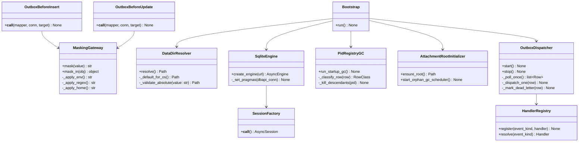
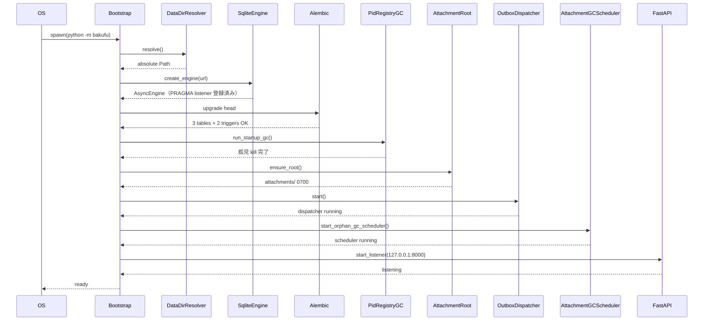
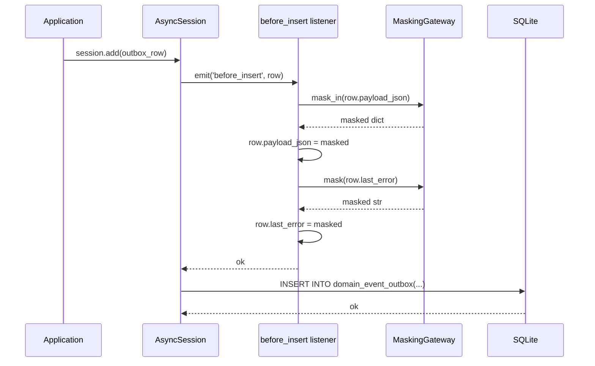
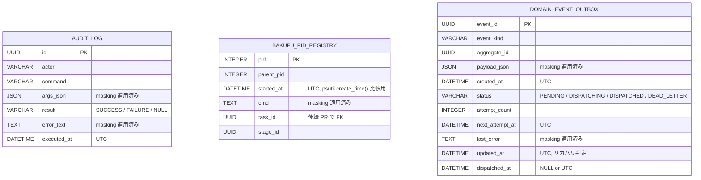

# 基本設計書

> feature: `persistence-foundation`
> 関連: [requirements.md](requirements.md) / [`tech-stack.md`](../../architecture/tech-stack.md) §ORM / [`storage.md`](../../architecture/domain-model/storage.md) §シークレットマスキング規則

## 記述ルール（必ず守ること）

基本設計に**疑似コード・サンプル実装（python/ts/sh/yaml 等の言語コードブロック）を書かない**。
ソースコードと二重管理になりメンテナンスコストしか生まない。
必要なのは構造契約（クラス・モジュール・データの関係）であり、実装の細部は [detailed-design.md](detailed-design.md) で凍結する。

## モジュール構成

| 機能 ID | モジュール | ディレクトリ | 責務 |
|--------|----------|------------|------|
| REQ-PF-001 | `data_dir` | `backend/src/bakufu/infrastructure/config/data_dir.py` | `BAKUFU_DATA_DIR` 解決、絶対パス強制、OS 別既定 |
| REQ-PF-002 | `engine` | `backend/src/bakufu/infrastructure/persistence/sqlite/engine.py` | async engine 生成、PRAGMA 強制 |
| REQ-PF-003 | `session` | `backend/src/bakufu/infrastructure/persistence/sqlite/session.py` | `AsyncSession` factory、UoW 境界 |
| REQ-PF-003 | `base` | `backend/src/bakufu/infrastructure/persistence/sqlite/base.py` | declarative base、UTC 強制 datetime / UUID Type Decorator |
| REQ-PF-004 | Alembic 設定 | `backend/alembic/env.py` / `alembic.ini` / `versions/0001_init.py` | 初回 revision: 3 テーブル + 2 トリガ |
| REQ-PF-005 | `masking` | `backend/src/bakufu/infrastructure/security/masking.py` | 環境変数 + 9 種正規表現 + ホームパスの単一ゲートウェイ |
| REQ-PF-005 | `masked_env` | `backend/src/bakufu/infrastructure/security/masked_env.py` | 起動時に環境変数値をパターン辞書化 |
| REQ-PF-006 | `outbox_tables` | `backend/src/bakufu/infrastructure/persistence/sqlite/tables/outbox.py` | `domain_event_outbox` table 定義 + `before_insert` / `before_update` listener 配線 |
| REQ-PF-007 | `dispatcher` | `backend/src/bakufu/infrastructure/persistence/sqlite/outbox/dispatcher.py` | polling / 状態マーキング / リカバリ条件 / dead-letter |
| REQ-PF-007 | `handler_registry` | `backend/src/bakufu/infrastructure/persistence/sqlite/outbox/handler_registry.py` | event_kind → handler の登録レジストリ（空 OK） |
| REQ-PF-008 | `pid_registry_tables` | `backend/src/bakufu/infrastructure/persistence/sqlite/tables/pid_registry.py` | `bakufu_pid_registry` table 定義 |
| REQ-PF-008 | `pid_gc` | `backend/src/bakufu/infrastructure/persistence/sqlite/pid_gc.py` | 起動時 GC スケルトン（`psutil` 連携） |
| REQ-PF-008 | `audit_log_tables` | `backend/src/bakufu/infrastructure/persistence/sqlite/tables/audit_log.py` | `audit_log` table 定義 + masking listener 配線 |
| REQ-PF-009 | `attachment_root` | `backend/src/bakufu/infrastructure/storage/attachment_root.py` | アタッチメント FS ルート初期化 + パーミッション強制 + 孤児 GC スケジューラ枠 |
| REQ-PF-010 | `bootstrap` | `backend/src/bakufu/main.py` | 起動シーケンス 8 段階の順序凍結 |
| 共通 | 例外 | `backend/src/bakufu/infrastructure/exceptions.py` | `BakufuConfigError` / `BakufuMigrationError` |

```
ディレクトリ構造（本 feature で追加・変更されるファイル）:

.
├── backend/
│   ├── alembic/                                  # 新規ディレクトリ
│   │   ├── env.py
│   │   ├── script.py.mako
│   │   └── versions/
│   │       └── 0001_init_audit_pid_outbox.py
│   ├── alembic.ini                               # 新規
│   ├── src/
│   │   └── bakufu/
│   │       ├── infrastructure/                   # 新規ディレクトリ
│   │       │   ├── __init__.py
│   │       │   ├── exceptions.py
│   │       │   ├── config/
│   │       │   │   ├── __init__.py
│   │       │   │   └── data_dir.py
│   │       │   ├── persistence/
│   │       │   │   ├── __init__.py
│   │       │   │   └── sqlite/
│   │       │   │       ├── __init__.py
│   │       │   │       ├── engine.py
│   │       │   │       ├── session.py
│   │       │   │       ├── base.py
│   │       │   │       ├── pid_gc.py
│   │       │   │       ├── tables/
│   │       │   │       │   ├── __init__.py
│   │       │   │       │   ├── audit_log.py
│   │       │   │       │   ├── pid_registry.py
│   │       │   │       │   └── outbox.py
│   │       │   │       └── outbox/
│   │       │   │           ├── __init__.py
│   │       │   │           ├── dispatcher.py
│   │       │   │           └── handler_registry.py
│   │       │   ├── security/
│   │       │   │   ├── __init__.py
│   │       │   │   ├── masking.py
│   │       │   │   └── masked_env.py
│   │       │   └── storage/
│   │       │       ├── __init__.py
│   │       │       └── attachment_root.py
│   │       └── main.py                           # 既存更新（または新規）: 起動シーケンス 8 段階
│   └── tests/
│       └── infrastructure/
│           ├── __init__.py
│           ├── config/
│           │   └── test_data_dir.py
│           ├── persistence/
│           │   └── sqlite/
│           │       ├── test_engine_pragma.py
│           │       ├── test_session.py
│           │       ├── test_audit_log_trigger.py
│           │       ├── test_pid_gc.py
│           │       └── outbox/
│           │           ├── test_dispatcher.py
│           │           └── test_masking_listener.py
│           ├── security/
│           │   └── test_masking.py
│           └── test_bootstrap_sequence.py
└── docs/
    └── features/
        └── persistence-foundation/               # 本 feature 設計書 4 本
```

## クラス設計（概要）



**凝集のポイント**:
- マスキングは `MaskingGateway` 単一ゲートウェイに集約（責務散在防止）
- SQLAlchemy event listener は table 単位で 1 箇所に登録（`tables/outbox.py` / `tables/audit_log.py`）
- PRAGMA 強制は engine 層のみ（接続 listener で毎接続適用）
- 起動シーケンスは `Bootstrap` クラス 1 つに閉じ、各段階失敗は Fail Fast で即終了
- domain 層への侵入なし（infrastructure layer は domain を import するが、domain は infrastructure を知らない）

## 処理フロー

### ユースケース 1: Backend 起動

1. `python -m bakufu` でプロセス起動
2. `Bootstrap.run()` が起動シーケンス 8 段階を順次実行
3. (1) `DataDirResolver.resolve()` で DATA_DIR を絶対パス確定 → singleton 保持
4. (2) `SqliteEngine.create_engine()` で async engine 生成 + PRAGMA listener 登録
5. (3) Alembic `upgrade head` で初回 revision 適用（3 テーブル + 2 トリガ）
6. (4) `PidRegistryGC.run_startup_gc()` で前回プロセス孤児 kill + テーブル整理
7. (5) `AttachmentRootInitializer.ensure_root()` で `<DATA_DIR>/attachments/` を 0700 で作成
8. (6) `OutboxDispatcher.start()` で 1 秒間隔の polling task を asyncio.create_task で起動
9. (7) `AttachmentRootInitializer.start_orphan_gc_scheduler()` で 24h 周期の GC タスク起動
10. (8) FastAPI / WebSocket リスナを `127.0.0.1:8000` で開始
11. 各段階で例外発生 → 即時 exit 非 0（後続段階に進まない）

### ユースケース 2: Aggregate 永続化（後続 Repository PR が利用）

1. application 層が `async with session_factory() as session, session.begin():` で UoW 境界を開く
2. Aggregate の Repository が `session.add(row)` または `session.execute(stmt)` で書き込み
3. `session.flush()` のタイミングで SQLAlchemy event listener が走る
4. `before_insert` / `before_update` listener が masking ゲートウェイを呼び出し対象フィールドを上書き
5. 実 INSERT / UPDATE が DB に発行される（masking 後の値）
6. session.begin() ブロック退出で commit、例外なら rollback

### ユースケース 3: Outbox イベント配送

1. Aggregate の保存 Tx と同一 Tx で `domain_event_outbox` 行を INSERT（後続 Repository PR の責務）
2. Tx commit で行が PENDING + `next_attempt_at=now()` で永続化
3. `OutboxDispatcher` の polling task が 1 秒間隔で SELECT
4. PENDING 行を取得 → `status=DISPATCHING` + `updated_at=now()` で更新
5. Handler レジストリから `event_kind` に対応する handler を解決
6. Handler 実行 → 成功時 `status=DISPATCHED`、失敗時 `attempt_count += 1` + backoff
7. 5 回失敗で `status=DEAD_LETTER` + `OutboxDeadLettered` event を別行に追記（dead-letter 専用通知用）

### ユースケース 4: Backend クラッシュ後の起動

1. クラッシュにより `bakufu_pid_registry` に孤児 PID が残存、`domain_event_outbox` に `DISPATCHING` 行が残存
2. 再起動時の Bootstrap で:
3. (4) `PidRegistryGC` が `psutil.create_time()` と `started_at` を比較し、一致なら子孫を SIGTERM → SIGKILL → DELETE
4. (6) `OutboxDispatcher` 起動後、polling SQL の `(DISPATCHING AND updated_at < now() - 5min)` 条件で **`DISPATCHING` のまま放置された行を強制再取得**（[`events-and-outbox.md`](../../architecture/domain-model/events-and-outbox.md) §Dispatcher の動作）

### ユースケース 5: マスキングの永続化前適用

1. application 層が `Outbox` 行を作る（直接 INSERT または ORM 経由）
2. SQLAlchemy が `before_insert` event を listener に通知
3. listener は `target.payload_json` / `target.last_error` を取得
4. `MaskingGateway.mask_in(payload_json)` で再帰的に masking 適用
5. `MaskingGateway.mask(last_error)` で文字列に masking 適用
6. listener が target の値を masking 後の値で上書き
7. SQLAlchemy が masking 後の値で実 INSERT を発行

## シーケンス図

### 起動シーケンス



### マスキング配線



## アーキテクチャへの影響

- `docs/architecture/domain-model.md` への変更: モジュール配置案の `infrastructure/persistence/sqlite/` 配下が本 Issue で実体化される（モジュール配置案そのものは凍結済みで変更不要）
- `docs/architecture/tech-stack.md` への変更: なし（SQLAlchemy 2.x / Alembic は既存確定）
- `docs/architecture/domain-model/storage.md` への変更: なし（マスキング規則は既存確定で本 Issue は配線実装のみ）
- `docs/architecture/domain-model/events-and-outbox.md` への変更: §`domain_event_outbox` の `payload_json` / `last_error` マスキングが SQLAlchemy event listener で**強制ゲートウェイ化**される旨を本 PR で 1 行追記
- 既存 feature への波及: なし。empire / workflow / agent / room の domain 層は本 Issue を import しない（依存方向: domain ← infrastructure）

## 外部連携

該当なし — 理由: infrastructure 層のうち永続化基盤に閉じる。外部システムへの通信は発生しない（LLM Adapter / Notifier は別 feature）。

| 連携先 | 目的 | プロトコル | 認証 | タイムアウト / リトライ |
|-------|------|----------|-----|--------------------|
| 該当なし | — | — | — | — |

## UX 設計

該当なし — 理由: UI を持たない infrastructure 層。

| シナリオ | 期待される挙動 |
|---------|------------|
| 該当なし | — |

**アクセシビリティ方針**: 該当なし（UI なし）。

## セキュリティ設計

### 脅威モデル

詳細な信頼境界は [`docs/architecture/threat-model.md`](../../architecture/threat-model.md)。本 feature 範囲では以下の 5 件。

| 想定攻撃者 | 攻撃経路 | 保護資産 | 対策 |
|-----------|---------|---------|------|
| **T1: 永続化前マスキングの呼び忘れ** | application 層 / Repository が直 INSERT してマスキングゲートウェイを経由しない | OAuth トークン / API key | SQLAlchemy `before_insert` / `before_update` event listener で**強制ゲートウェイ化**（OWASP A02）。raw SQL 経路でも listener が走る |
| **T2: `audit_log` の改ざん / 削除** | DB ファイルに直接 SQL を流して DELETE / UPDATE | 監査証跡 | SQLite トリガで `BEFORE DELETE → RAISE(ABORT)`、UPDATE は `result` / `error_text` の null 埋めのみ許可（OWASP A08） |
| **T3: 相対 `BAKUFU_DATA_DIR` による cwd 依存攻撃** | 攻撃者が cwd を制御してデータを別ディレクトリに置かせる | DB ファイル / アタッチメント | 起動時に絶対パス強制 + Fail Fast（OWASP A05） |
| **T4: subprocess 孤児 kill の他プロジェクト誤射** | 同一 OS ユーザーが別プロジェクトで起動した CLI を bakufu の起動時 GC が誤って kill | 他プロジェクトの動作 | `psutil.Process.create_time()` を `started_at` と比較し、不一致なら保護（テーブルから DELETE のみ、kill しない）。`recursive=True` で子孫追跡 |
| **T5: SQLite ファイルの権限不足による secret 流出** | 他 OS ユーザー / プログラムが `bakufu.db` を読み取り | 全 Aggregate / audit_log | 起動時に DB ファイル / WAL ファイル / `attachments/` ディレクトリを `0600` / `0700` 強制（POSIX）。Windows は `%LOCALAPPDATA%` のホーム配下を信頼（OWASP A05） |

### OWASP Top 10 対応

| # | カテゴリ | 対応状況 |
|---|---------|---------|
| A01 | Broken Access Control | 該当なし（infrastructure 層、認可は別 feature） |
| A02 | Cryptographic Failures | **適用**: マスキングゲートウェイで API key / OAuth トークンを永続化前に伏字化 |
| A03 | Injection | **適用**: SQLAlchemy ORM 経由で SQL injection 防御。raw SQL は使わない |
| A04 | Insecure Design | **適用**: pre-validate / Fail Fast（DATA_DIR / engine / migration の各段階） |
| A05 | Security Misconfiguration | **適用**: PRAGMA 強制 / file mode 0600 / 0700 / Alembic 適用必須 |
| A06 | Vulnerable Components | SQLAlchemy 2.x / Alembic / aiosqlite / psutil（pip-audit で監視） |
| A07 | Auth Failures | 該当なし |
| A08 | Data Integrity Failures | **適用**: `audit_log` 追記 only + DELETE 拒否トリガ |
| A09 | Logging Failures | **適用**: マスキング適用ログ、Outbox `last_error` masking |
| A10 | SSRF | 該当なし（外部 URL fetch なし） |

## ER 図



トリガ:

- `audit_log_no_delete`: `BEFORE DELETE ON audit_log → RAISE(ABORT, 'audit_log is append-only')`
- `audit_log_update_restricted`: `BEFORE UPDATE ON audit_log WHEN OLD.result IS NOT NULL → RAISE(ABORT)`

## エラーハンドリング方針

| 例外種別 | 処理方針 | ユーザーへの通知 |
|---------|---------|----------------|
| `BakufuConfigError`（DATA_DIR / engine / migration） | 起動段階の Fail Fast、プロセス exit | MSG-PF-001 / MSG-PF-002 / MSG-PF-004（stderr） |
| `BakufuMigrationError` | 同上 | MSG-PF-004 |
| SQLite IntegrityError（外部キー違反等） | application 層に伝播、HTTP 409 Conflict にマッピング（後続 feature） | 個別 feature の MSG |
| `psutil.AccessDenied`（pid_gc） | WARN ログ、当該行は次回 GC で再試行 | MSG-PF-007（ログのみ、UI 通知なし） |
| Handler 例外（Outbox Dispatcher 内） | `attempt_count += 1` + backoff、5 回で dead-letter | dead-letter 経路で Discord 通知（後続 feature） |
| その他 | 握り潰さない、application 層 / Bootstrap 層へ伝播 | 汎用エラーメッセージ |
