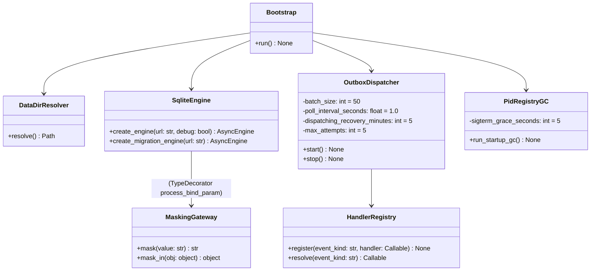

# 詳細設計書

> feature: `persistence-foundation`
> 関連: [basic-design.md](basic-design.md) / [`tech-stack.md`](../../architecture/tech-stack.md) §ORM / [`storage.md`](../../architecture/domain-model/storage.md) §シークレットマスキング規則 / [`events-and-outbox.md`](../../architecture/domain-model/events-and-outbox.md) §`domain_event_outbox`

## 記述ルール（必ず守ること）

詳細設計に**疑似コード・サンプル実装（python/ts/sh/yaml 等の言語コードブロック）を書かない**。
ソースコードと二重管理になりメンテナンスコストしか生まない。
必要なのは「構造契約（属性名・型・制約）」と「確定文言（メッセージ文字列）」と「実装の意図」。

## トピック別補章（500 行ルール準拠のディレクトリ分割）

本書は infrastructure 層の確定事項全体の **index**。詳細はトピック別に [`detailed-design/`](detailed-design/) 配下のサブファイルで凍結する（Norman 指摘 R-N7「500 行ルール / トピック別ディレクトリ分割」対応）。

| サブファイル | 内容 | 主な凍結項目 |
|---|---|---|
| [`detailed-design/modules.md`](detailed-design/modules.md) | Module 別仕様（関数表 / 属性 / カラム） | 14 Module 全件 |
| [`detailed-design/pragma.md`](detailed-design/pragma.md) | PRAGMA + dual connection | 確定 D-1〜D-4（PRAGMA 8 件、application / migration 接続分離、Schneier 重大 2） |
| [`detailed-design/masking.md`](detailed-design/masking.md) | マスキング契約 | 確定 A（9 種正規表現）+ 確定 F（Fail-Secure、Schneier 重大 1） |
| [`detailed-design/triggers.md`](detailed-design/triggers.md) | TypeDecorator 配線 + SQLite トリガ | 確定 B（`MaskedJSONEncoded` / `MaskedText` の `process_bind_param`、event listener から反転 — [`requirements-analysis.md`](requirements-analysis.md) §確定 R1-D 参照）+ 確定 C（`audit_log` 不変性トリガ） |
| [`detailed-design/bootstrap.md`](detailed-design/bootstrap.md) | Backend 起動シーケンス | 確定 E（pid_gc）+ 確定 G（8 段階順序 + INFO ログ）+ 確定 J（cleanup、Schneier 中等 4）+ 確定 L（umask、Schneier 中等 1） |
| [`detailed-design/outbox.md`](detailed-design/outbox.md) | Outbox Dispatcher Fail Loud | 確定 K（空 handler レジストリ WARN、Schneier 中等 3） |
| [`detailed-design/handoff.md`](detailed-design/handoff.md) | Schneier 申し送り + 依存方向 | 確定 H（申し送り 6 項目実装ステータス）+ 確定 I（依存方向の物理保証） |
| [`detailed-design/messages.md`](detailed-design/messages.md) | MSG 確定文言表 | MSG-PF-001〜008（2 行構造、Norman R5 整合） |
| [`detailed-design/persistence-keys.md`](detailed-design/persistence-keys.md) | データ構造（永続化キー） | Alembic 初回 revision キー構造、3 テーブル + 1 INDEX + 2 トリガ |

## クラス設計（概要）

各クラスの詳細属性・関数表は [`detailed-design/modules.md`](detailed-design/modules.md) を参照。

## 確定事項（先送り撤廃）— サマリ

各確定の概要を表で示し、詳細は対応するサブファイルで凍結する。

| 確定 | 概要 | 詳細サブファイル |
|---|---|---|
| 確定 A | マスキング 9 種正規表現 + 環境変数 + ホームパスの 3 段階適用順序 | [`masking.md`](detailed-design/masking.md) |
| 確定 B | SQLAlchemy TypeDecorator (`MaskedJSONEncoded` / `MaskedText`) の `process_bind_param` 配線（旧 event listener 採用案を [`requirements-analysis.md`](requirements-analysis.md) §確定 R1-D で反転却下） | [`triggers.md`](detailed-design/triggers.md) |
| 確定 C | SQLite トリガで `audit_log` の DELETE 拒否 + UPDATE 制限（Alembic 初回 revision で発行） | [`triggers.md`](detailed-design/triggers.md) |
| 確定 D | PRAGMA 8 件 SET（`defensive=ON` 含む）+ application / migration 接続分離（dual connection） | [`pragma.md`](detailed-design/pragma.md) |
| 確定 E | pid_registry 起動時 GC の 8 段階手順、`psutil.create_time()` で PID 衝突対策 | [`bootstrap.md`](detailed-design/bootstrap.md) |
| 確定 F | マスキング Fail-Secure 契約（`<REDACTED:MASK_ERROR>` / `<REDACTED:LISTENER_ERROR>` / `<REDACTED:MASK_OVERFLOW>` で完全置換、生データを書く経路ゼロ）+ env 辞書ロード Fail Fast | [`masking.md`](detailed-design/masking.md) |
| 確定 G | Backend 起動シーケンス 8 段階の順序保証 + INFO / FATAL / WARN ログ + `<DATA_DIR>/logs/bakufu.log` 出力 | [`bootstrap.md`](detailed-design/bootstrap.md) |
| 確定 H | Schneier 申し送り 6 項目の実装ステータス（本 PR で 4 項目配線、後続 PR に 2 項目継承） | [`handoff.md`](detailed-design/handoff.md) |
| 確定 I | domain → infrastructure 依存方向の物理保証（CI script + dependency direction test） | [`handoff.md`](detailed-design/handoff.md) |
| 確定 J | Bootstrap 起動失敗時の `try / finally` cleanup（LIFO cancel + engine.dispose() + ログ flush） | [`bootstrap.md`](detailed-design/bootstrap.md) |
| 確定 K | Outbox Dispatcher 空 handler レジストリ稼働時の Fail Loud WARN（3 タイミング、ログ・スパム抑止） | [`outbox.md`](detailed-design/outbox.md) |
| 確定 L | Bootstrap 入口で `os.umask(0o077)` を SET（WAL / SHM ファイル 0o600 を物理保証、POSIX のみ） | [`bootstrap.md`](detailed-design/bootstrap.md) |

## 設計判断の補足

### なぜ TypeDecorator が event listener より優れるか（PR #23 BUG-PF-001 で反転）

旧設計は「event listener が raw SQL 経路でも走る」前提で `event.listens_for(TableClass, 'before_insert')` 方式を採用していた。しかし PR #23 BUG-PF-001 の技術検証で **SQLAlchemy 2.x の Core `insert(table).values({...})` の inline values は ORM mapper を経由しないため `before_insert` listener が発火しない**ことが判明した（TC-IT-PF-020 旧 xfail strict=True）。raw SQL 経路で生 secret が永続化される脱出経路が残るため、Schneier 申し送り #6 の契約が破綻する。

リーナス commit `4b882bf` で **`MaskedJSONEncoded` / `MaskedText` TypeDecorator** に切替え、`process_bind_param` フックで Core / ORM 両経路を確実に捕捉する設計に反転した（TC-IT-PF-020 PASSED で物理保証）。詳細経緯は [`requirements-analysis.md`](requirements-analysis.md) §確定 R1-D。

「属性追加時の漏れ」リスク（旧設計が TypeDecorator を却下した理由）は CI 三層防衛（grep guard + アーキテクチャテスト + storage.md 逆引き表の運用ルール）で物理保証する。詳細は [`detailed-design/triggers.md`](detailed-design/triggers.md) §確定 B。

### なぜ `audit_log` を DELETE トリガで止めるか

DDD の Aggregate Root は「コードレベルで不変条件を強制」するが、SQLite ファイルに直接 SQL を流す経路（`sqlite3` CLI 等）はコードを経由しない。SQLite トリガはデータベースレベルの最後の防衛線で、「攻撃者が DB ファイルに直接アクセスして DELETE する」経路を物理的に塞ぐ（OWASP A08 Data Integrity Failures）。トリガ自身が DROP される経路は確定 D の `defensive=ON` で塞ぐ。

### なぜ Outbox Dispatcher の Handler を本 PR で実装しないか

Handler は event_kind ごとに副作用が異なる:

- `DirectiveIssued` → Task 生成（次 Tx）
- `TaskAssigned` → WebSocket ブロードキャスト + LLM Adapter 呼び出し
- `ExternalReviewRequested` → Gate 生成 + Discord Notifier
- `OutboxDeadLettered` → Discord 通知（dead-letter 専用）

これらを 1 PR にまとめると WebSocket / Notifier / LLM Adapter / Gate Aggregate の依存が一気に発生し、レビュー帯域を圧迫する。Dispatcher 骨格 + 空レジストリで止め、Handler は `feature/{event-kind}-handler` の小粒 PR で個別に register する。空レジストリ稼働時の Fail Loud は確定 K（[`outbox.md`](detailed-design/outbox.md)）で凍結。

### なぜ起動シーケンスを Bootstrap クラスに集約するか

`main.py` に手続き的に書くと、各段階の失敗ハンドリングが分散して `try/except` が散在する。`Bootstrap` クラスに 1 つにまとめることで:

1. 起動順序が 1 箇所に閉じる（読み手が順序を即座に把握できる）
2. テストで `Bootstrap.run()` を呼ぶと起動シーケンスを単体テストできる
3. 段階追加時に Bootstrap 内のメソッド追加だけで完結

### なぜ pid_registry GC で `psutil.AccessDenied` を WARN にするか

OS 側で他プロセスへのアクセス権が拒否されるケースは複数あり得る（root プロセスの操作、別ユーザーの操作）。当該行を DELETE してしまうと**起動するたびに孤児が増える**経路ができる。WARN ログで運用者に知らせつつ、テーブルに残して次回 GC でリトライする方が運用上安全。

## API エンドポイント詳細

該当なし — 理由: 本 feature は infrastructure 層のみ。HTTP API は `feature/http-api` で凍結する。

## 出典・参考

- [SQLAlchemy 2.0 — async / AsyncEngine / AsyncSession](https://docs.sqlalchemy.org/en/20/orm/extensions/asyncio.html) — async engine / session の公式実装根拠
- [SQLAlchemy 2.0 — TypeDecorator / process_bind_param](https://docs.sqlalchemy.org/en/20/core/custom_types.html#augmenting-existing-types) — TypeDecorator 配線の公式 API（確定 B 採用）
- [SQLAlchemy 2.0 — Events / before_insert / before_update](https://docs.sqlalchemy.org/en/20/orm/events.html) — 旧 event listener 案の公式 API（PR #23 BUG-PF-001 で反転却下、参照のみ）
- [SQLAlchemy 2.0 — connect event for PRAGMA](https://docs.sqlalchemy.org/en/20/dialects/sqlite.html#foreign-key-support) — PRAGMA SET の公式パターン
- [SQLite PRAGMA Statements](https://www.sqlite.org/pragma.html) — `journal_mode=WAL` / `foreign_keys` / `busy_timeout` / `defensive` / `writable_schema` 等の公式仕様
- [SQLite Trigger — RAISE(ABORT)](https://www.sqlite.org/lang_createtrigger.html) — `audit_log` DELETE 拒否トリガの実装根拠
- [Alembic Tutorial](https://alembic.sqlalchemy.org/en/latest/tutorial.html) — migration / revision 管理の公式
- [psutil — Process.create_time / children](https://psutil.readthedocs.io/en/latest/#psutil.Process.create_time) — PID 衝突対策の公式 API
- [OWASP Secure Coding Practices](https://owasp.org/www-project-secure-coding-practices-quick-reference-guide/) — Fail Securely 原則（確定 F の根拠）
- [`docs/architecture/domain-model/storage.md`](../../architecture/domain-model/storage.md) — シークレットマスキング規則の集約先（`infrastructure/security/masking.py`）
- [`docs/architecture/domain-model/events-and-outbox.md`](../../architecture/domain-model/events-and-outbox.md) — Outbox 行スキーマ + Dispatcher 動作 + リカバリ条件
- [`docs/architecture/threat-model.md`](../../architecture/threat-model.md) — 信頼境界 / OWASP Top 10 / 攻撃面 A1〜A5 / Schneier 申し送り
