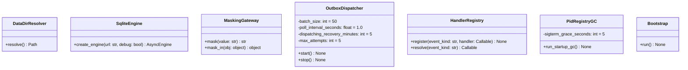

# 詳細設計書

> feature: `persistence-foundation`
> 関連: [basic-design.md](basic-design.md) / [`tech-stack.md`](../../architecture/tech-stack.md) §ORM / [`storage.md`](../../architecture/domain-model/storage.md) §シークレットマスキング規則 / [`events-and-outbox.md`](../../architecture/domain-model/events-and-outbox.md) §`domain_event_outbox`

## 記述ルール（必ず守ること）

詳細設計に**疑似コード・サンプル実装（python/ts/sh/yaml 等の言語コードブロック）を書かない**。
ソースコードと二重管理になりメンテナンスコストしか生まない。
必要なのは「構造契約（属性名・型・制約）」と「確定文言（メッセージ文字列）」と「実装の意図」。

## クラス設計（詳細）



### Module: `infrastructure/config/data_dir.py`

| 関数 | 引数 | 戻り値 | 制約 |
|----|----|----|----|
| `resolve()` | なし | `pathlib.Path` | 絶対パス、解決済み（symlink 展開後） |
| `_default_for_os()` | なし | `pathlib.Path` | Linux/macOS: `${XDG_DATA_HOME:-$HOME/.local/share}/bakufu` / Windows: `%LOCALAPPDATA%\bakufu` |
| `_validate_absolute(value: str)` | `str` | `pathlib.Path` | 相対パス / NUL バイト / `..` を含む値で `BakufuConfigError(MSG-PF-001)` |

**module 状態**:
- `_resolved: pathlib.Path | None = None`（singleton キャッシュ、`resolve()` 初回呼び出しで確定）

### Module: `infrastructure/persistence/sqlite/engine.py`

| 関数 | 引数 | 戻り値 | 制約 |
|----|----|----|----|
| `create_engine(url: str, debug: bool = False)` | url, debug | `AsyncEngine` | `sqlalchemy.ext.asyncio.create_async_engine` を呼び、接続 listener で PRAGMA を SET |
| `_set_pragmas(dbapi_conn, _connection_record)` | DBAPI conn, connection record | None | event listener、PRAGMA 5 件を SET |

**PRAGMA SET 順序（固定）**:

1. `PRAGMA journal_mode=WAL` — 最初に WAL モード切替（他 PRAGMA より先）
2. `PRAGMA foreign_keys=ON` — 接続ごとに ON（既定 OFF のため必須）
3. `PRAGMA busy_timeout=5000` — ms 単位
4. `PRAGMA synchronous=NORMAL` — WAL モード下で安全
5. `PRAGMA temp_store=MEMORY` — 一時テーブルのメモリ化

**根拠**: SQLite の `journal_mode=WAL` は接続レベル設定だが永続化される（DB ファイルメタデータ）。`foreign_keys` は接続レベルで毎接続 SET 必須。busy_timeout は接続レベル。詳細は [SQLite PRAGMA](https://www.sqlite.org/pragma.html) 公式参照。

### Module: `infrastructure/persistence/sqlite/session.py`

| 関数 | 引数 | 戻り値 | 制約 |
|----|----|----|----|
| `make_session_factory(engine: AsyncEngine)` | engine | `async_sessionmaker[AsyncSession]` | `expire_on_commit=False`, `autoflush=False`, `class_=AsyncSession` |

**module 状態**:
- `session_factory: async_sessionmaker[AsyncSession] | None = None`（singleton、Bootstrap が engine 生成後に初期化）

### Module: `infrastructure/persistence/sqlite/base.py`

| 名前 | 種別 | 内容 |
|----|----|----|
| `Base` | declarative base | `DeclarativeBase` を継承した bakufu 共通 base |
| `UUIDStr` | TypeDecorator | UUID を `CHAR(32)` hex 形式で永続化、Python 側は `uuid.UUID` |
| `UTCDateTime` | TypeDecorator | datetime を UTC で永続化、tz-aware を要求（naive datetime は Fail Fast） |
| `JSONEncoded` | TypeDecorator | dict / list を JSON 文字列で永続化（`json.dumps(..., ensure_ascii=False, sort_keys=True)`） |

### Module: `infrastructure/persistence/sqlite/tables/audit_log.py`

| カラム | 型 | 制約 | 意図 |
|----|----|----|----|
| `id` | `UUIDStr` | PK, NOT NULL | UUIDv4 |
| `actor` | `String(255)` | NOT NULL | OS ユーザー名 + ホスト名 |
| `command` | `String(64)` | NOT NULL | enum string（`retry-task` / `cancel-task` / `retry-event` / `list-blocked` / `list-dead-letters`） |
| `args_json` | `JSONEncoded` | NOT NULL | masking 適用済み |
| `result` | `String(16)` | NULL | NULL → SUCCESS / FAILURE |
| `error_text` | `Text` | NULL | masking 適用済み |
| `executed_at` | `UTCDateTime` | NOT NULL | UTC |

**event listener 配線**: `before_insert` / `before_update` で `target.args_json` / `target.error_text` に `MaskingGateway.mask_in()` / `mask()` を適用してから INSERT / UPDATE。

### Module: `infrastructure/persistence/sqlite/tables/pid_registry.py`

| カラム | 型 | 制約 | 意図 |
|----|----|----|----|
| `pid` | `Integer` | PK, NOT NULL | OS の PID |
| `parent_pid` | `Integer` | NOT NULL | bakufu Backend 自身の `os.getpid()` |
| `started_at` | `UTCDateTime` | NOT NULL | `psutil.Process.create_time()` 値（PID 衝突対策の比較キー） |
| `cmd` | `Text` | NOT NULL | masking 適用済み |
| `task_id` | `UUIDStr` | NULL | task と紐づく場合（後続 PR で FK 追加） |
| `stage_id` | `UUIDStr` | NULL | stage と紐づく場合 |

**event listener 配線**: `before_insert` / `before_update` で `target.cmd` に `MaskingGateway.mask()` を適用。

### Module: `infrastructure/persistence/sqlite/tables/outbox.py`

| カラム | 型 | 制約 | 意図 |
|----|----|----|----|
| `event_id` | `UUIDStr` | PK, NOT NULL | UUIDv4、Handler 冪等性キー |
| `event_kind` | `String(64)` | NOT NULL | `DirectiveIssued` 等の enum string |
| `aggregate_id` | `UUIDStr` | NOT NULL | 発火元 Aggregate |
| `payload_json` | `JSONEncoded` | NOT NULL | masking 適用済み |
| `created_at` | `UTCDateTime` | NOT NULL | UTC |
| `status` | `String(16)` | NOT NULL | `PENDING` / `DISPATCHING` / `DISPATCHED` / `DEAD_LETTER` |
| `attempt_count` | `Integer` | NOT NULL DEFAULT 0 | リトライ回数 |
| `next_attempt_at` | `UTCDateTime` | NOT NULL | UTC |
| `last_error` | `Text` | NULL | masking 適用済み |
| `updated_at` | `UTCDateTime` | NOT NULL | UTC、リカバリ判定用 |
| `dispatched_at` | `UTCDateTime` | NULL | UTC |

**INDEX**: `(status, next_attempt_at)`（polling SQL の最適化）

**event listener 配線**: `before_insert` / `before_update` で `target.payload_json` / `target.last_error` に `MaskingGateway.mask_in()` / `mask()` を適用。

### Module: `infrastructure/security/masking.py`

| 関数 | 引数 | 戻り値 | 制約 |
|----|----|----|----|
| `mask(value: str)` | str | str | 起動時に compile 済みの正規表現 + 環境変数辞書を順次適用 |
| `mask_in(obj: object)` | dict / list / str / int / None | 同型 | dict / list を再帰走査、str に対して `mask()` を適用 |

**適用順序（厳守、[`storage.md`](../../architecture/domain-model/storage.md) §適用順序）**:

1. **環境変数値の伏字化**（最も具体的）— 起動時 `_load_env_patterns()` が実施
2. **正規表現パターンマッチ**（9 種、§確定 A の表）
3. **ホームパス置換**（`$HOME` 絶対パス → `<HOME>`）

### Module: `infrastructure/security/masked_env.py`

| 関数 | 引数 | 戻り値 | 制約 |
|----|----|----|----|
| `load_env_patterns()` | なし | `list[tuple[str, re.Pattern]]` | 起動時に 1 回呼ばれる、`os.environ` から既知 env キーの値を取り長さ 8 以上ならパターン辞書化 |

**対象環境変数**（`storage.md` 既存定義に従う）:

`ANTHROPIC_API_KEY` / `OPENAI_API_KEY` / `GEMINI_API_KEY` / `GH_TOKEN` / `GITHUB_TOKEN` / `OAUTH_CLIENT_SECRET` / `BAKUFU_DB_KEY`

長さ 8 以上の値のみパターン化（短すぎる値は誤マッチを起こす）。値は `re.escape()` でエスケープしてから compile。

### Module: `infrastructure/persistence/sqlite/outbox/dispatcher.py`

| 属性 | 型 | 値 |
|----|----|----|
| `batch_size` | `int` | `50`（1 ポーリングで取得する最大行数） |
| `poll_interval_seconds` | `float` | `1.0` |
| `dispatching_recovery_minutes` | `int` | `5`（DISPATCHING 行の強制再取得判定） |
| `max_attempts` | `int` | `5`（dead-letter 化閾値） |

**polling SQL（pseudo、構造のみ）**:

```
SELECT *
FROM domain_event_outbox
WHERE (status='PENDING' AND next_attempt_at <= :now)
   OR (status='DISPATCHING' AND updated_at < :now - INTERVAL '5 minutes')
ORDER BY next_attempt_at ASC
LIMIT :batch_size
```

（実装は SQLAlchemy 2.x の `select()` で書き、SQLite 上で動作）

**backoff スケジュール**:

| attempt_count | 次の `next_attempt_at` (now + ...) |
|---|---|
| 1 | 10 秒 |
| 2 | 1 分 |
| 3 | 5 分 |
| 4 | 30 分 |
| 5 | 30 分 |
| 6 以上 | dead-letter（次の試行はしない） |

`events-and-outbox.md` §Retry 戦略 と同一。

### Module: `infrastructure/persistence/sqlite/outbox/handler_registry.py`

| 関数 | 引数 | 戻り値 | 制約 |
|----|----|----|----|
| `register(event_kind: str, handler: Callable)` | event_kind, async handler | None | 既存登録があれば上書き禁止（`KeyError` raise）、テスト時は `clear()` で初期化 |
| `resolve(event_kind: str)` | event_kind | `Callable` | 未登録なら `HandlerNotRegisteredError`（dispatcher は warn ログ + 行を再 PENDING に戻す） |

**module 状態**:
- `_handlers: dict[str, Callable] = {}`

本 Issue では Handler 実装を **登録しない**（空レジストリ）。後続 PR が `feature/{event-kind}-handler` で個別に register する。

### Module: `infrastructure/persistence/sqlite/pid_gc.py`

| 関数 | 引数 | 戻り値 | 制約 |
|----|----|----|----|
| `run_startup_gc()` | なし | None | テーブル全行に対し `_classify_row` → 孤児なら `_kill_descendants` |
| `_classify_row(row)` | row | `Literal['orphan_kill', 'protected', 'absent']` | `psutil.Process(pid).create_time()` と `started_at` を比較 |
| `_kill_descendants(pid: int)` | pid | None | `psutil.Process(pid).children(recursive=True)` で SIGTERM → 5s grace → SIGKILL |

**判定ロジック**:

| 状況 | psutil 結果 | 判定 |
|----|----|----|
| プロセスが存在しない | `psutil.NoSuchProcess` | `absent` — テーブルから DELETE のみ |
| プロセスが存在し `create_time()` が `started_at` と一致 | OK | `orphan_kill` — 子孫含めて kill + DELETE |
| プロセスが存在し `create_time()` が `started_at` と不一致 | OK | `protected` — PID 再利用された別プロセス、テーブルから DELETE のみ（kill しない） |
| 権限不足 | `psutil.AccessDenied` | WARN ログ、当該行は次回 GC で再試行（DELETE しない） |

### Module: `infrastructure/storage/attachment_root.py`

| 関数 | 引数 | 戻り値 | 制約 |
|----|----|----|----|
| `ensure_root()` | なし | `pathlib.Path` | `<DATA_DIR>/attachments/` を作成、POSIX なら `0700` で chmod |
| `start_orphan_gc_scheduler()` | なし | `asyncio.Task` | 24h 周期の GC タスクを起動（実 GC は本 Issue では空実装、後続 `feature/attachment-store` PR が中身を実装） |

### Module: `infrastructure/exceptions.py`

| 例外 | 継承元 | 用途 |
|----|----|----|
| `BakufuConfigError` | `Exception` | DATA_DIR / engine / migration 設定エラー |
| `BakufuMigrationError` | `BakufuConfigError` | Alembic migration 失敗専用 |
| `HandlerNotRegisteredError` | `KeyError` | Handler レジストリで未登録 event_kind |

### Module: `main.py`（Bootstrap）

| 関数 | 引数 | 戻り値 | 制約 |
|----|----|----|----|
| `Bootstrap.run()` | なし | None | 起動シーケンス 8 段階を順次実行、各段階失敗で `sys.exit(1)` |

8 段階の実装は §確定 R1-C の順序通り。各段階の前後でログを出力（masking 適用済み）。

## 確定事項（先送り撤廃）

### 確定 A: マスキング 9 種正規表現 + 環境変数 + ホームパス

[`storage.md`](../../architecture/domain-model/storage.md) §マスキング対象パターン の表を本 feature の `masking.py` に**そのまま**実装する。改変・追加は本 Issue では行わない（追加が必要な場合は別 Issue で `storage.md` 更新 + 同期 PR）。

#### 9 種の正規表現（凍結）

| 種別 | 正規表現 | 置換後 |
|----|----|----|
| Anthropic API key | `sk-ant-(api03-)?[A-Za-z0-9_\-]{40,}` | `<REDACTED:ANTHROPIC_KEY>` |
| OpenAI API key | `sk-[A-Za-z0-9]{20,}`（`sk-ant-` を除く、negative lookahead） | `<REDACTED:OPENAI_KEY>` |
| GitHub PAT | `(ghp\|gho\|ghu\|ghs\|ghr)_[A-Za-z0-9]{36,}` | `<REDACTED:GITHUB_PAT>` |
| GitHub fine-grained PAT | `github_pat_[A-Za-z0-9_]{82,}` | `<REDACTED:GITHUB_PAT>` |
| AWS Access Key | `AKIA[0-9A-Z]{16}` | `<REDACTED:AWS_ACCESS_KEY>` |
| AWS Secret | `aws_secret_access_key\s*=\s*[A-Za-z0-9/+=]{40}` | `<REDACTED:AWS_SECRET>` |
| Slack token | `xox[baprs]-[A-Za-z0-9-]{10,}` | `<REDACTED:SLACK_TOKEN>` |
| Discord bot token | `[MN][A-Za-z\d]{23,}\.[\w-]{6}\.[\w-]{27,}` | `<REDACTED:DISCORD_TOKEN>` |
| Bearer / Authorization | `(?i)(authorization\s*:\s*bearer\s+)[A-Za-z0-9._\-]+` | `\1<REDACTED:BEARER>` |

#### 適用順序（厳守）

1. 環境変数値（最も具体的、長さ 8 以上のみ）
2. 正規表現 9 種（リスト順は OpenAI が `sk-ant-` を除く必要があるため Anthropic を先に適用）
3. ホームパス（`$HOME` 絶対パス → `<HOME>`）

### 確定 B: SQLAlchemy event listener の登録方式

table モジュール内で `event.listens_for(TableClass, 'before_insert')` / `'before_update'` をデコレータとして登録する。listener 関数は table モジュールの module-level に定義し、外部から差し替え不可（テスト時は `event.remove()` で削除可）。

理由:

- table 定義と listener が同一ファイルにあり、属性追加時に listener 内のフィールドリストを更新する責務が明確
- SQLAlchemy の event API は import 時に listener が登録される（lazy import を避ける）
- pyright strict で listener の引数型（`Mapper`, `Connection`, `Target`）を明示

### 確定 C: SQLite トリガ（`audit_log` 不変性）

Alembic 初回 revision で以下の SQL を発行:

```sql
CREATE TRIGGER audit_log_no_delete
BEFORE DELETE ON audit_log
FOR EACH ROW
BEGIN
    SELECT RAISE(ABORT, 'audit_log is append-only');
END;

CREATE TRIGGER audit_log_update_restricted
BEFORE UPDATE ON audit_log
FOR EACH ROW
WHEN OLD.result IS NOT NULL
BEGIN
    SELECT RAISE(ABORT, 'audit_log result is immutable once set');
END;
```

UPDATE は `result` / `error_text` を NULL → 値 にする 1 回のみ許可（実行完了時）。すでに値が入っている行への UPDATE は拒否。

### 確定 D: PRAGMA SET の順序と引き金

接続ごとに `event.listens_for(engine.sync_engine, 'connect')` で発火。順序:

1. `PRAGMA journal_mode=WAL` — 他 PRAGMA より先
2. `PRAGMA foreign_keys=ON` — 接続レベル
3. `PRAGMA busy_timeout=5000`
4. `PRAGMA synchronous=NORMAL`
5. `PRAGMA temp_store=MEMORY`

WAL モードはデータベースレベル永続化される（DB ファイルメタデータ）が、他は接続レベル。`foreign_keys` は SQLite 既定 OFF のため毎接続 SET 必須。

### 確定 E: pid_registry 起動時 GC の順序と保護条件

| 段階 | 動作 |
|----|----|
| 1 | テーブルから全行 SELECT |
| 2 | 各行の `pid` を `psutil.Process(pid)` でアクセス試行 |
| 3 | `psutil.NoSuchProcess` → `absent` 判定、テーブルから DELETE（kill しない） |
| 4 | `psutil.AccessDenied` → WARN ログ、当該行は **DELETE しない**（次回 GC で再試行） |
| 5 | プロセス存在 → `create_time()` を `started_at` と比較 |
| 6 | 不一致 → `protected` 判定、テーブルから DELETE（kill しない、PID 再利用された別プロセス） |
| 7 | 一致 → `orphan_kill` 判定、`children(recursive=True)` で子孫列挙 |
| 8 | SIGTERM 送出 → 5 秒 grace → SIGKILL → テーブルから DELETE |

**「process_iter で claude プロセスを kill する」実装の禁止**を明文化（[`tech-stack.md`](../../architecture/tech-stack.md) §子孫追跡 と同方針）。bakufu 起動前に同一ユーザーが手動で起動した CLI を巻き込まない。

### 確定 F: マスキング適用が「成功」となる条件

`MaskingGateway.mask()` / `mask_in()` は**例外を投げない契約**。万一の異常時はフォールバック:

| 状況 | フォールバック |
|----|----|
| `mask_in` が想定外の型（datetime, bytes 等）に出会う | str に変換してから `mask()` 適用 |
| 環境変数辞書ロード失敗 | 空辞書として継続、WARN ログ |
| 正規表現マッチ中の例外（理論上発生しない） | catch して `<REDACTED:UNKNOWN>` でフォールバック、WARN ログ |

これは listener が masking 経由で永続化を**止めない**契約。masking が失敗した場合に Outbox 行が永続化されない方が運用上問題が大きい（dead-letter 化経路もマスキング経由のため、masking 失敗で全 Outbox が止まると bakufu 全体が機能停止）。

### 確定 G: Backend 起動シーケンスの順序保証（§確定 R1-C 再掲、実装側）

| 順 | 段階 | 失敗時の挙動 | 後続段階 |
|---|---|---|---|
| 1 | DATA_DIR 解決 | `BakufuConfigError(MSG-PF-001)` raise → exit 1 | スキップ |
| 2 | engine 初期化 | `BakufuConfigError(MSG-PF-002)` raise → exit 1 | スキップ |
| 3 | Alembic upgrade head | `BakufuMigrationError(MSG-PF-004)` raise → exit 1 | スキップ |
| 4 | pid_registry GC | `psutil` 例外は WARN ログ → 続行（致命的でない） | 続行 |
| 5 | attachments FS 初期化 | `BakufuConfigError(MSG-PF-003)` raise → exit 1 | スキップ |
| 6 | Outbox Dispatcher 起動 | asyncio.create_task の例外 → exit 1 | スキップ |
| 7 | attachments 孤児 GC スケジューラ起動 | asyncio.create_task の例外 → exit 1 | スキップ |
| 8 | FastAPI / WebSocket リスナ開始 | バインド失敗 → exit 1 | — |

段階 4 のみ非 fatal（孤児 GC が一部失敗しても次回 GC で回収可能）。それ以外は Fail Fast。

### 確定 H: Schneier 申し送り 6 項目の実装ステータス

| # | 項目 | 本 PR | 後続 PR |
|---|---|---|---|
| 1 | `BAKUFU_DATA_DIR` 絶対パス | ✓ `data_dir.py` で実装 + 結合テスト | — |
| 2 | H10 TOCTOU | ✗ | `feature/skill-loader` で skill 読み込み直前再検証 |
| 3 | `Persona.prompt_body` Repository マスキング | △ event listener hook 構造のみ提供 | `feature/agent-repository` で `agents` テーブルに対し listener 登録 |
| 4 | `audit_log` DELETE 拒否 | ✓ Alembic 初回 revision でトリガ作成 + 結合テスト | — |
| 5 | `bakufu_pid_registry` 0600 | ✓ テーブル + GC スケルトン + パーミッション強制 | LLM Adapter 側で実 spawn / kill 配線（`feature/llm-adapter`） |
| 6 | Outbox `payload_json` / `last_error` マスキング | ✓ event listener で強制ゲートウェイ化 + 結合テスト | — |

「△」項目は hook を提供するに留まり、実適用は対応 Aggregate Repository PR の責務。本 Issue の設計書に「申し送りを継承」と明記する。

### 確定 I: 依存方向の物理保証

domain 層から infrastructure 層への import が 0 件であることを以下で保証:

1. CI script: `grep -rn 'from bakufu.infrastructure' backend/src/bakufu/domain/` の結果が空であること
2. テスト: `tests/architecture/test_dependency_direction.py` が `bakufu.domain.*` の全モジュールを import し、`bakufu.infrastructure.*` の名前が module 属性に含まれないことを検証

これにより、後続 Repository PR で誰かが `domain/` 内に infrastructure 参照を持ち込んでも CI で落ちる。

## 設計判断の補足

### なぜ event listener が TypeDecorator より優れるか

`MaskedString` 型を作って `Column(MaskedString)` で宣言する方式は、属性追加時に「型を指定し忘れる」経路がある（特に `prompt_body: str` の単純カラムが masking 対象になることを忘れる）。`event.listens_for(target, 'before_insert')` で table 単位に listener を登録する方式は、**新カラム追加時に masking 対象なら listener 内のフィールドリストに 1 行追加するだけ**で配線が完了する。

また、raw SQL（`session.execute(insert(table).values(...))` 等）の経路でも listener は走るため、ORM mapper を経由しない経路でも masking が適用される（多層防御）。

### なぜ `audit_log` を DELETE トリガで止めるか

DDD の Aggregate Root は「コードレベルで不変条件を強制」するが、SQLite ファイルに直接 SQL を流す経路（`sqlite3` CLI 等）はコードを経由しない。SQLite トリガはデータベースレベルの最後の防衛線で、「攻撃者が DB ファイルに直接アクセスして DELETE する」経路を物理的に塞ぐ（OWASP A08 Data Integrity Failures）。

### なぜ Outbox Dispatcher の Handler を本 PR で実装しないか

Handler は event_kind ごとに副作用が異なる:

- `DirectiveIssued` → Task 生成（次 Tx）
- `TaskAssigned` → WebSocket ブロードキャスト + LLM Adapter 呼び出し
- `ExternalReviewRequested` → Gate 生成 + Discord Notifier
- `OutboxDeadLettered` → Discord 通知（dead-letter 専用）

これらを 1 PR にまとめると WebSocket / Notifier / LLM Adapter / Gate Aggregate の依存が一気に発生し、レビュー帯域を圧迫する。Dispatcher 骨格 + 空レジストリで止め、Handler は `feature/{event-kind}-handler` の小粒 PR で個別に register する。

### なぜ起動シーケンスを Bootstrap クラスに集約するか

`main.py` に手続き的に書くと、各段階の失敗ハンドリングが分散して `try/except` が散在する。`Bootstrap` クラスに 1 つにまとめることで:

1. 起動順序が 1 箇所に閉じる（読み手が順序を即座に把握できる）
2. テストで `Bootstrap.run()` を呼ぶと起動シーケンスを単体テストできる
3. 段階追加時に Bootstrap 内のメソッド追加だけで完結

### なぜ pid_registry GC で `psutil.AccessDenied` を WARN にするか

OS 側で他プロセスへのアクセス権が拒否されるケースは複数あり得る（root プロセスの操作、別ユーザーの操作）。当該行を DELETE してしまうと**起動するたびに孤児が増える**経路ができる。WARN ログで運用者に知らせつつ、テーブルに残して次回 GC でリトライする方が運用上安全。

## ユーザー向けメッセージの確定文言

### プレフィックス統一

| プレフィックス | 意味 |
|--------------|-----|
| `[FAIL]` | 処理中止を伴う失敗（startup 段階） |
| `[WARN]` | 警告（処理は継続） |
| `[INFO]` | 情報提供（処理は継続） |

### MSG 確定文言表

| ID | 出力先 | 文言 |
|----|------|----|
| MSG-PF-001 | stderr / startup ログ | `[FAIL] BAKUFU_DATA_DIR must be an absolute path (got: {value})` — `{value}` はホームパス置換適用後 |
| MSG-PF-002 | stderr / startup ログ | `[FAIL] SQLite engine initialization failed: {reason}` |
| MSG-PF-003 | stderr / startup ログ | `[FAIL] Attachment FS root initialization failed at {path}: {reason}` |
| MSG-PF-004 | stderr / startup ログ | `[FAIL] Alembic migration failed: {reason}` |
| MSG-PF-005 | SQLite トリガ raise message | `audit_log is append-only` / `audit_log result is immutable once set` |
| MSG-PF-006 | WARN ログ | `[WARN] Masking gateway fallback applied: {kind}` — `{kind}` は `unknown_type` / `regex_failure` 等 |
| MSG-PF-007 | WARN ログ | `[WARN] pid_registry GC: psutil.AccessDenied for pid={pid}, retry next cycle` |

メッセージは ASCII 範囲。日本語化は UI 側 i18n（Phase 2、UI に届くメッセージのみ）。

## データ構造（永続化キー）

### `audit_log` テーブル

requirements.md §データモデル + §確定 C のトリガを参照。

### `bakufu_pid_registry` テーブル

requirements.md §データモデル を参照。

### `domain_event_outbox` テーブル

requirements.md §データモデル + §確定 A のマスキング適用先 を参照。

### Alembic 初回 revision キー構造

revision id: `0001`（自動生成 hash でも可、固定 ID `0001_init_audit_pid_outbox` を推奨）

| 操作 | 対象 |
|----|----|
| `op.create_table('audit_log', ...)` | 7 カラム |
| `op.create_table('bakufu_pid_registry', ...)` | 6 カラム |
| `op.create_table('domain_event_outbox', ...)` | 11 カラム |
| `op.create_index('ix_outbox_status_next_attempt', 'domain_event_outbox', ['status', 'next_attempt_at'])` | INDEX |
| `op.execute("CREATE TRIGGER audit_log_no_delete ...")` | DELETE 拒否トリガ |
| `op.execute("CREATE TRIGGER audit_log_update_restricted ...")` | UPDATE 制限トリガ |

`downgrade()` は `op.drop_table` / `op.execute("DROP TRIGGER ...")` で逆順に実行（Phase 2 のロールバック耐性）。

## API エンドポイント詳細

該当なし — 理由: 本 feature は infrastructure 層のみ。HTTP API は `feature/http-api` で凍結する。

## 出典・参考

- [SQLAlchemy 2.0 — async / AsyncEngine / AsyncSession](https://docs.sqlalchemy.org/en/20/orm/extensions/asyncio.html) — async engine / session の公式実装根拠
- [SQLAlchemy 2.0 — Events / before_insert / before_update](https://docs.sqlalchemy.org/en/20/orm/events.html) — listener 配線の公式 API
- [SQLAlchemy 2.0 — connect event for PRAGMA](https://docs.sqlalchemy.org/en/20/dialects/sqlite.html#foreign-key-support) — PRAGMA SET の公式パターン
- [SQLite PRAGMA Statements](https://www.sqlite.org/pragma.html) — `journal_mode=WAL` / `foreign_keys` / `busy_timeout` 等の公式仕様
- [SQLite Trigger — RAISE(ABORT)](https://www.sqlite.org/lang_createtrigger.html) — `audit_log` DELETE 拒否トリガの実装根拠
- [Alembic Tutorial](https://alembic.sqlalchemy.org/en/latest/tutorial.html) — migration / revision 管理の公式
- [psutil — Process.create_time / children](https://psutil.readthedocs.io/en/latest/#psutil.Process.create_time) — PID 衝突対策の公式 API
- [`docs/architecture/domain-model/storage.md`](../../architecture/domain-model/storage.md) — シークレットマスキング規則の集約先（`infrastructure/security/masking.py`）
- [`docs/architecture/domain-model/events-and-outbox.md`](../../architecture/domain-model/events-and-outbox.md) — Outbox 行スキーマ + Dispatcher 動作 + リカバリ条件
- [`docs/architecture/threat-model.md`](../../architecture/threat-model.md) — 信頼境界 / OWASP Top 10 / 攻撃面 A1〜A5 / Schneier 申し送り
