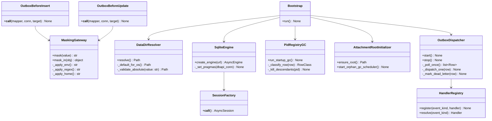
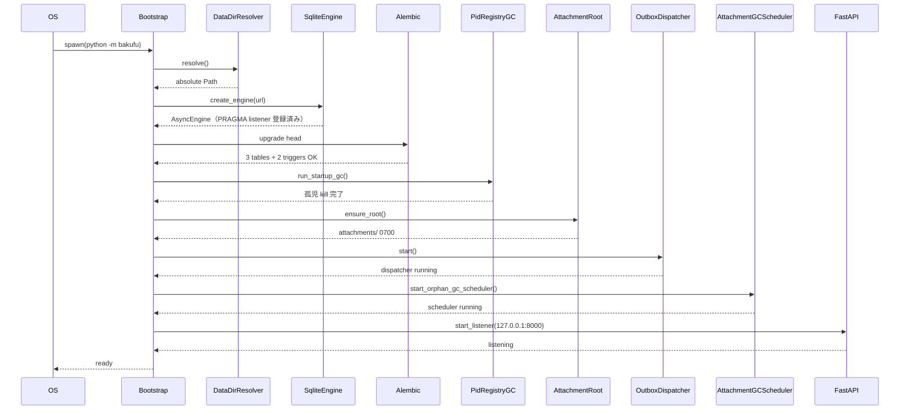
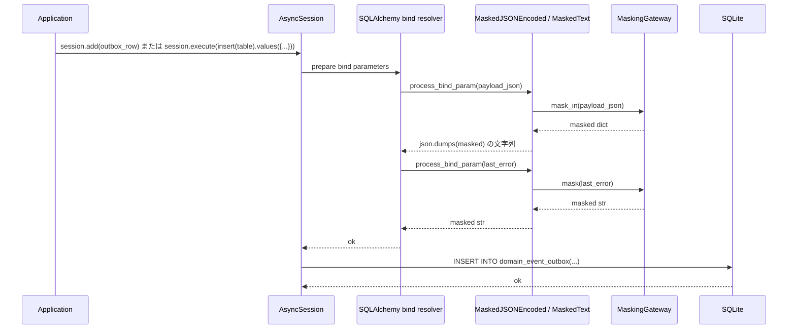
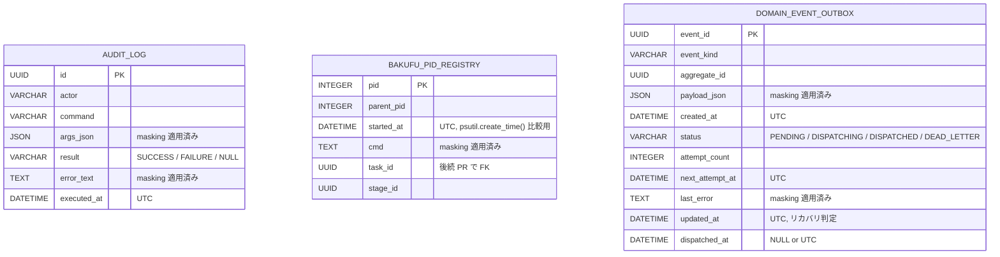

# 基本設計書 — persistence-foundation / domain

> feature: `persistence-foundation` / sub-feature: `domain`
> 親 spec: [`../feature-spec.md`](../feature-spec.md) §9 受入基準 1〜12 / §10 Q-1〜Q-3
> 関連: [`docs/design/tech-stack.md`](../../../design/tech-stack.md) §ORM / [`docs/design/domain-model/storage.md`](../../../design/domain-model/storage.md) §シークレットマスキング規則

## §モジュール契約（機能要件）

| 要件ID | 概要 | 入力 | 処理 | 出力 | エラー時 | 親 spec 参照 |
|--------|------|------|------|------|---------|-------------|
| REQ-PF-001 | データルート解決 | 環境変数 `BAKUFU_DATA_DIR`（`os.environ`）、OS 種別 | `BAKUFU_DATA_DIR` が設定されていれば絶対パス検証 → 未設定時は OS 別既定 → `Path.resolve()` で正規化 → singleton 保持 | `pathlib.Path`（絶対パス、解決済み） | 相対パス / NULL バイト / `..` を含む値 → `BakufuConfigError(MSG-PF-001)` Fail Fast | §9 AC#1, AC#2 |
| REQ-PF-002 | SQLite engine 初期化 | REQ-PF-001 の DATA_DIR | async engine 生成 + 接続イベントで PRAGMA 8 件 SET（§確定 R1-E）+ DB ファイル権限検出・警告・修復（§確定 R1-F） | `AsyncEngine`（singleton） | engine 生成失敗 / PRAGMA 失敗 → `BakufuConfigError(MSG-PF-002)` | §9 AC#3 |
| REQ-PF-003 | AsyncSession factory | REQ-PF-002 の engine | `async_sessionmaker(engine, expire_on_commit=False, autoflush=False)` で factory 構築 | `async_sessionmaker[AsyncSession]` | session 内例外 → `session.begin()` が自動 rollback、上位に伝播 | —（内部基盤） |
| REQ-PF-004 | Alembic 初回 migration | REQ-PF-002 の engine | `alembic upgrade head` 相当を起動時実行。初回 revision: `audit_log` / `bakufu_pid_registry` / `domain_event_outbox` の 3 テーブル + 2 トリガ | 3 テーブル + 2 トリガが SQLite に存在する状態 | migration 失敗 → `BakufuMigrationError(MSG-PF-004)` | §9 AC#4, AC#5 |
| REQ-PF-005 | マスキング単一ゲートウェイ | 任意の文字列 / dict / list | 適用順序: (1) 環境変数値の完全一致置換 → (2) 9 種正規表現適用 → (3) `$HOME` 絶対パスを `<HOME>` 置換 | masking 適用済みの文字列 / dict / list | 内部例外 → `<REDACTED:MASK_ERROR>` で完全置換（Fail-Secure、§確定 R1-H）。env 辞書ロード失敗 → `BakufuConfigError(MSG-PF-008)` Fail Fast | §9 AC#6 |
| REQ-PF-006 | SQLAlchemy TypeDecorator 配線 | masking 対象カラムへの bind parameter（INSERT / UPDATE、Core / ORM 両経路） | `MaskedJSONEncoded` / `MaskedText` の `process_bind_param` フックが発火 → `MaskingGateway.mask_in()` / `mask()` を呼び出し masking 後の値を返す | masking 後の値が永続化（生 secret が DB 行に到達する経路ゼロ） | `process_bind_param` 内例外 → `<REDACTED:LISTENER_ERROR>` で完全置換（Fail-Secure） | §9 AC#7 |
| REQ-PF-007 | Outbox Dispatcher 骨格 | `domain_event_outbox` テーブルの状態 | 1 秒間隔で polling SQL: `PENDING AND next_attempt_at <= now` OR `DISPATCHING AND updated_at < now - 5min` 行を取得 → Handler 解決 → 実行 → 成功 / 失敗状態更新 → 5 回失敗で DEAD_LETTER + `OutboxDeadLettered` 別行追記 | Outbox 行の状態遷移 | Handler 例外 → attempt_count + 1 + backoff + last_error 記録（masking 適用）。Dispatcher 例外 → WARN、次サイクルで再試行 | §9 AC#8, AC#9 |
| REQ-PF-008 | pid_registry 起動時 GC | `bakufu_pid_registry` テーブルの全 PID 行 | 各行の PID を `psutil.Process()` で取得 → `create_time()` を `started_at` と比較 → 一致なら子孫 SIGTERM → 5 秒 grace → SIGKILL → DELETE。不一致（PID 再利用）→ DELETE のみ | 孤児プロセスが kill された状態 + テーブル整合状態 | `psutil.NoSuchProcess` → DELETE のみ。`psutil.AccessDenied` → WARN + 行残し | §9 AC#10 |
| REQ-PF-009 | アタッチメント FS ルート初期化 | REQ-PF-001 の DATA_DIR | `<DATA_DIR>/attachments/` を `mkdir(parents=True, exist_ok=True)` で作成 + POSIX で `0700` 強制 + 24h 周期 GC スケジューラ起動 | アタッチメントディレクトリが正しい権限で存在する状態 | 作成失敗 → 例外 raise、プロセス終了 | §9 AC#11 |
| REQ-PF-010 | 起動シーケンス凍結 | プロセス起動時の環境 | §確定 R1-C の 8 段階を `main.py` で順次実行。各段階失敗時 Fail Fast（段階 4 のみ非 fatal / WARN）| Backend が正常起動した状態 | 各段階で例外 → プロセス終了（exit 非 0）、後続段階は走らない | §9 AC#12 |

## 記述ルール（必ず守ること）

基本設計に**疑似コード・サンプル実装（python/ts/sh/yaml 等の言語コードブロック）を書かない**。
ソースコードと二重管理になりメンテナンスコストしか生まない。
必要なのは構造契約（クラス・モジュール・データの関係）であり、実装の細部は [detailed-design.md](detailed-design.md) で凍結する。

## モジュール構成

| 機能 ID | モジュール | ディレクトリ | 責務 |
|--------|----------|------------|------|
| REQ-PF-001 | `data_dir` | `backend/src/bakufu/infrastructure/config/data_dir.py` | `BAKUFU_DATA_DIR` 解決、絶対パス強制、OS 別既定 |
| REQ-PF-002 | `engine` | `backend/src/bakufu/infrastructure/persistence/sqlite/engine.py` | async engine 生成、PRAGMA 強制 |
| REQ-PF-003 | `session` | `backend/src/bakufu/infrastructure/persistence/sqlite/session.py` | `AsyncSession` factory、UoW 境界 |
| REQ-PF-003 | `base` | `backend/src/bakufu/infrastructure/persistence/sqlite/base.py` | declarative base、UTC 強制 datetime / UUID Type Decorator |
| REQ-PF-004 | Alembic 設定 | `backend/alembic/env.py` / `alembic.ini` / `versions/0001_init.py` | 初回 revision: 3 テーブル + 2 トリガ |
| REQ-PF-005 | `masking` | `backend/src/bakufu/infrastructure/security/masking.py` | 環境変数 + 9 種正規表現 + ホームパスの単一ゲートウェイ |
| REQ-PF-005 | `masked_env` | `backend/src/bakufu/infrastructure/security/masked_env.py` | 起動時に環境変数値をパターン辞書化 |
| REQ-PF-006 | `outbox_tables` | `backend/src/bakufu/infrastructure/persistence/sqlite/tables/outbox.py` | `domain_event_outbox` table 定義 + `MaskedJSONEncoded` / `MaskedText` TypeDecorator 宣言（`process_bind_param` で Core / ORM 両経路 masking 強制、[`detailed-design/triggers.md`](detailed-design/triggers.md) §確定 B） |
| REQ-PF-007 | `dispatcher` | `backend/src/bakufu/infrastructure/persistence/sqlite/outbox/dispatcher.py` | polling / 状態マーキング / リカバリ条件 / dead-letter |
| REQ-PF-007 | `handler_registry` | `backend/src/bakufu/infrastructure/persistence/sqlite/outbox/handler_registry.py` | event_kind → handler の登録レジストリ（空 OK） |
| REQ-PF-008 | `pid_registry_tables` | `backend/src/bakufu/infrastructure/persistence/sqlite/tables/pid_registry.py` | `bakufu_pid_registry` table 定義 |
| REQ-PF-008 | `pid_gc` | `backend/src/bakufu/infrastructure/persistence/sqlite/pid_gc.py` | 起動時 GC スケルトン（`psutil` 連携） |
| REQ-PF-008 | `audit_log_tables` | `backend/src/bakufu/infrastructure/persistence/sqlite/tables/audit_log.py` | `audit_log` table 定義 + `MaskedJSONEncoded` / `MaskedText` TypeDecorator 宣言（masking 強制ゲートウェイ） |
| REQ-PF-009 | `attachment_root` | `backend/src/bakufu/infrastructure/storage/attachment_root.py` | アタッチメント FS ルート初期化 + パーミッション強制 + 孤児 GC スケジューラ枠 |
| REQ-PF-010 | `bootstrap` | `backend/src/bakufu/main.py` | 起動シーケンス 8 段階の順序凍結 |
| 共通 | 例外 | `backend/src/bakufu/infrastructure/exceptions.py` | `BakufuConfigError` / `BakufuMigrationError` |

```
ディレクトリ構造（本 feature で追加・変更されるファイル）:

.
├── backend/
│   ├── alembic/                                  # 新規ディレクトリ
│   │   ├── env.py
│   │   ├── script.py.mako
│   │   └── versions/
│   │       └── 0001_init_audit_pid_outbox.py
│   ├── alembic.ini                               # 新規
│   ├── src/
│   │   └── bakufu/
│   │       ├── infrastructure/                   # 新規ディレクトリ
│   │       │   ├── __init__.py
│   │       │   ├── exceptions.py
│   │       │   ├── config/
│   │       │   │   ├── __init__.py
│   │       │   │   └── data_dir.py
│   │       │   ├── persistence/
│   │       │   │   ├── __init__.py
│   │       │   │   └── sqlite/
│   │       │   │       ├── __init__.py
│   │       │   │       ├── engine.py
│   │       │   │       ├── session.py
│   │       │   │       ├── base.py
│   │       │   │       ├── pid_gc.py
│   │       │   │       ├── tables/
│   │       │   │       │   ├── __init__.py
│   │       │   │       │   ├── audit_log.py
│   │       │   │       │   ├── pid_registry.py
│   │       │   │       │   └── outbox.py
│   │       │   │       └── outbox/
│   │       │   │           ├── __init__.py
│   │       │   │           ├── dispatcher.py
│   │       │   │           └── handler_registry.py
│   │       │   ├── security/
│   │       │   │   ├── __init__.py
│   │       │   │   ├── masking.py
│   │       │   │   └── masked_env.py
│   │       │   └── storage/
│   │       │       ├── __init__.py
│   │       │       └── attachment_root.py
│   │       └── main.py                           # 既存更新（または新規）: 起動シーケンス 8 段階
│   └── tests/
│       └── infrastructure/
│           ├── __init__.py
│           ├── config/
│           │   └── test_data_dir.py
│           ├── persistence/
│           │   └── sqlite/
│           │       ├── test_engine_pragma.py
│           │       ├── test_session.py
│           │       ├── test_audit_log_trigger.py
│           │       ├── test_pid_gc.py
│           │       └── outbox/
│           │           ├── test_dispatcher.py
│           │           └── test_masking_typedecorator.py
│           ├── security/
│           │   └── test_masking.py
│           └── test_bootstrap_sequence.py
└── docs/
    └── features/
        └── persistence-foundation/               # 本 feature 設計書 4 本
```

## クラス設計（概要）



**凝集のポイント**:
- マスキングは `MaskingGateway` 単一ゲートウェイに集約（責務散在防止）
- SQLAlchemy TypeDecorator (`MaskedJSONEncoded` / `MaskedText`) は base.py 1 箇所に定義し、各 table がカラム宣言時に参照（属性追加時の漏れは CI grep + arch test で物理保証、[`detailed-design/triggers.md`](detailed-design/triggers.md) §確定 B）
- PRAGMA 強制は engine 層のみ（接続 listener で毎接続適用）
- 起動シーケンスは `Bootstrap` クラス 1 つに閉じ、各段階失敗は Fail Fast で即終了
- domain 層への侵入なし（infrastructure layer は domain を import するが、domain は infrastructure を知らない）

## 処理フロー

### ユースケース 1: Backend 起動

1. `python -m bakufu` でプロセス起動
2. `Bootstrap.run()` が以下を実行
3. **(stage 0、stage 1 より前)** `os.umask(0o077)` を SET（Schneier 中等 1 対応、WAL / SHM ファイル 0o600 確保）
4. (1) `DataDirResolver.resolve()` で DATA_DIR を絶対パス確定 → singleton 保持。INFO ログ「stage 1/8 started/completed」
5. (2) `SqliteEngine.create_engine()` で application 用 async engine を生成 + PRAGMA 8 件 listener 登録（`defensive=ON` / `writable_schema=OFF` / `trusted_schema=OFF` を含む）。DB ファイル権限の検出 + 警告 + 修復（Schneier 重大 3 対応）。INFO ログ「stage 2/8」
6. (3) **migration 専用 engine を `defensive=OFF` で生成** → Alembic `upgrade head` で初回 revision 適用（3 テーブル + 2 トリガ）→ migration engine `dispose()`（dual connection、Schneier 重大 2 対応）。INFO ログ「stage 3/8」
7. (4) `PidRegistryGC.run_startup_gc()` で前回プロセス孤児 kill + テーブル整理。`psutil.AccessDenied` は WARN（致命的でない）。INFO ログ「stage 4/8」
8. (5) `AttachmentRootInitializer.ensure_root()` で `<DATA_DIR>/attachments/` を 0700 で作成。INFO ログ「stage 5/8」
9. (6) `OutboxDispatcher.start()` で 1 秒間隔の polling task を asyncio.create_task で起動。**handler レジストリが空なら WARN ログ**（Schneier 中等 3 対応）。INFO ログ「stage 6/8」
10. (7) `AttachmentRootInitializer.start_orphan_gc_scheduler()` で 24h 周期の GC タスク起動。INFO ログ「stage 7/8」
11. (8) FastAPI / WebSocket リスナを `127.0.0.1:8000` で開始。INFO ログ「stage 8/8 ... bakufu Backend ready」
12. 各段階で例外発生 → `try / finally` で **段階 6 / 7 の task を LIFO で cancel** + engine `dispose()` + 構造化ログ flush → exit 非 0（Schneier 中等 4 対応）

### ユースケース 2: Aggregate 永続化（後続 Repository PR が利用）

1. application 層が `async with session_factory() as session, session.begin():` で UoW 境界を開く
2. Aggregate の Repository が `session.add(row)` または `session.execute(stmt)` で書き込み（Core / ORM どちらの経路でも可）
3. SQLAlchemy が bind parameter を解決する直前で `MaskedJSONEncoded` / `MaskedText` TypeDecorator の `process_bind_param` を発火
4. TypeDecorator が masking ゲートウェイ（`MaskingGateway.mask_in()` / `mask()`）を呼び出し、masking 後の値を bind value として返す
5. 実 INSERT / UPDATE が DB に発行される（masking 後の値、生 secret は到達しない）
6. session.begin() ブロック退出で commit、例外なら rollback

### ユースケース 3: Outbox イベント配送

1. Aggregate の保存 Tx と同一 Tx で `domain_event_outbox` 行を INSERT（後続 Repository PR の責務）
2. Tx commit で行が PENDING + `next_attempt_at=now()` で永続化
3. `OutboxDispatcher` の polling task が 1 秒間隔で SELECT
4. PENDING 行を取得 → `status=DISPATCHING` + `updated_at=now()` で更新
5. Handler レジストリから `event_kind` に対応する handler を解決
6. Handler 実行 → 成功時 `status=DISPATCHED`、失敗時 `attempt_count += 1` + backoff
7. 5 回失敗で `status=DEAD_LETTER` + `OutboxDeadLettered` event を別行に追記（dead-letter 専用通知用）

### ユースケース 4: Backend クラッシュ後の起動

1. クラッシュにより `bakufu_pid_registry` に孤児 PID が残存、`domain_event_outbox` に `DISPATCHING` 行が残存
2. 再起動時の Bootstrap で:
3. (4) `PidRegistryGC` が `psutil.create_time()` と `started_at` を比較し、一致なら子孫を SIGTERM → SIGKILL → DELETE
4. (6) `OutboxDispatcher` 起動後、polling SQL の `(DISPATCHING AND updated_at < now() - 5min)` 条件で **`DISPATCHING` のまま放置された行を強制再取得**（[`events-and-outbox.md`](../../design/domain-model/events-and-outbox.md) §Dispatcher の動作）

### ユースケース 5: マスキングの永続化前適用（TypeDecorator `process_bind_param` 経路）

1. application 層が `Outbox` 行を作る（Core `insert(table).values({...})` / ORM `session.add()` どちらの経路でも可）
2. SQLAlchemy が bind parameter を解決する直前で `MaskedJSONEncoded`（`payload_json`）と `MaskedText`（`last_error`）の `process_bind_param` フックを発火
3. `MaskedJSONEncoded.process_bind_param(payload_json, dialect)` が `MaskingGateway.mask_in(payload_json)` で再帰的に masking 適用 → JSON エンコードして bind value として返す
4. `MaskedText.process_bind_param(last_error, dialect)` が `MaskingGateway.mask(last_error)` で文字列に masking 適用 → bind value として返す
5. SQLAlchemy が masking 後の値で実 INSERT を発行（生 secret は DB 行に到達しない）

**配線方式の決定経緯**: 旧設計（`event.listens_for(target, 'before_insert')`）は PR #23 BUG-PF-001 で反転却下。Core `insert(table).values({...})` の inline values は ORM mapper を経由しないため `before_insert` listener が発火せず、raw SQL 経路で生 secret が永続化される脱出経路が残ることを TC-IT-PF-020（旧 xfail strict=True）で確認。リーナス commit `4b882bf` で TypeDecorator に切替え、TC-IT-PF-020 PASSED で物理保証。詳細は [`detailed-design/triggers.md`](detailed-design/triggers.md) §確定 B / [`../feature-spec.md`](../feature-spec.md) §確定 R1-D。

## シーケンス図

### 起動シーケンス



### マスキング配線（TypeDecorator `process_bind_param` 経路）



## アーキテクチャへの影響

- `docs/design/domain-model.md` への変更: モジュール配置案の `infrastructure/persistence/sqlite/` 配下が本 Issue で実体化される（モジュール配置案そのものは凍結済みで変更不要）
- `docs/design/tech-stack.md` への変更: なし（SQLAlchemy 2.x / Alembic は既存確定）
- `docs/design/domain-model/storage.md` への変更: なし（マスキング規則は既存確定で本 Issue は配線実装のみ）
- `docs/design/domain-model/events-and-outbox.md` への変更: §`domain_event_outbox` の `payload_json` / `last_error` マスキングが SQLAlchemy TypeDecorator (`MaskedJSONEncoded` / `MaskedText`) の `process_bind_param` で **Core / ORM 両経路で強制ゲートウェイ化**される旨を反映（旧 listener 案は PR #23 BUG-PF-001 で反転却下）
- 既存 feature への波及: なし。empire / workflow / agent / room の domain 層は本 Issue を import しない（依存方向: domain ← infrastructure）

## 外部連携

該当なし — 理由: infrastructure 層のうち永続化基盤に閉じる。外部システムへの通信は発生しない（LLM Adapter / Notifier は別 feature）。

| 連携先 | 目的 | プロトコル | 認証 | タイムアウト / リトライ |
|-------|------|----------|-----|--------------------|
| 該当なし | — | — | — | — |

## UX 設計

該当なし — 理由: UI を持たない infrastructure 層。

| シナリオ | 期待される挙動 |
|---------|------------|
| 該当なし | — |

**アクセシビリティ方針**: 該当なし（UI なし）。

## セキュリティ設計

### 脅威モデル

詳細な信頼境界は [`docs/design/threat-model.md`](../../design/threat-model.md)。本 feature 範囲では以下の **9 件**（Schneier 重大 4 + 中等 4 + 軽微 1 を脅威モデルに昇格）:

| 想定攻撃者 | 攻撃経路 | 保護資産 | 対策 |
|-----------|---------|---------|------|
| **T1: 永続化前マスキングの呼び忘れ** | application 層 / Repository が直 INSERT してマスキングゲートウェイを経由しない | OAuth トークン / API key | SQLAlchemy **TypeDecorator** (`MaskedJSONEncoded` / `MaskedText`) の `process_bind_param` で**強制ゲートウェイ化**（OWASP A02）。Core `insert(table).values(...)` / ORM `session.add()` 両経路で発火（PR #23 BUG-PF-001 で旧 event listener 案を反転却下、TC-IT-PF-020 PASSED で物理保証）。属性追加時の漏れは CI 三層防衛（grep guard + arch test + 逆引き表運用ルール）で物理保証 |
| **T2: `audit_log` の改ざん / 削除** | DB ファイルに直接 SQL を流して DELETE / UPDATE | 監査証跡 | SQLite トリガで `BEFORE DELETE → RAISE(ABORT)`、UPDATE は `result` / `error_text` の null 埋めのみ許可（OWASP A08） |
| **T3: 相対 `BAKUFU_DATA_DIR` による cwd 依存攻撃** | 攻撃者が cwd を制御してデータを別ディレクトリに置かせる | DB ファイル / アタッチメント | 起動時に絶対パス強制 + Fail Fast（OWASP A05） |
| **T4: subprocess 孤児 kill の他プロジェクト誤射** | 同一 OS ユーザーが別プロジェクトで起動した CLI を bakufu の起動時 GC が誤って kill | 他プロジェクトの動作 | `psutil.Process.create_time()` を `started_at` と比較し、不一致なら保護（テーブルから DELETE のみ、kill しない）。`recursive=True` で子孫追跡 |
| **T5: SQLite ファイルの権限不足による secret 流出** | 他 OS ユーザー / プログラムが `bakufu.db` を読み取り | 全 Aggregate / audit_log | DB ファイル権限の **検出 + 警告 + 修復**（サイレント chmod を廃止、Forensic 観点）。Bootstrap 入口で `os.umask(0o077)` SET により WAL / SHM が 0o600 で作られることを保証。Windows は `%LOCALAPPDATA%` のホーム配下を信頼（OWASP A05） |
| **T6: マスキングの fail-open 経路**（Schneier 重大 1） | listener 内例外 / 環境変数辞書ロード失敗で生 secret が永続化される | OAuth トークン / API key | `MaskingGateway` を **Fail-Secure 契約**（生データを書く経路ゼロ、`<REDACTED:MASK_ERROR>` 等で完全置換）。env 辞書ロード失敗は Fail Fast（OWASP A02） |
| **T7: SQLite トリガの DROP / `sqlite_master` 改ざん**（Schneier 重大 2） | application 接続から `DROP TRIGGER` / `UPDATE sqlite_master` を発行してトリガ削除 | `audit_log` 不変性 | application 接続で **PRAGMA `defensive=ON` / `writable_schema=OFF` / `trusted_schema=OFF`** を SET し runtime DDL を制限。Alembic migration 接続のみ別経路（dual connection）。技術的に困難な場合は OS ユーザー隔離 + DB 0600 で物理封鎖（OWASP A08） |
| **T8: `BAKUFU_DB_PATH` 任意パス書き込み**（Schneier 重大 4） | 環境変数で `/etc/passwd` / `../../sensitive/...` 等を指定 | 任意の filesystem | `BAKUFU_DB_PATH` 環境変数を**廃止**。DB パスは `<DATA_DIR>/bakufu.db` 固定（YAGNI、OWASP A04） |
| **T9: 空 handler レジストリ下の Outbox 滞留**（Schneier 中等 3） | dispatcher が起動するが handler 未登録で行が累積し気付かない | Outbox 健全性 / 運用者の状況把握 | 起動時に空レジストリ検出で WARN ログ、polling サイクルで PENDING 行検出時 WARN（重複抑止 1 サイクル 1 回）、PENDING > 100 件で滞留 WARN（OWASP A09） |

### OWASP Top 10 対応

| # | カテゴリ | 対応状況 |
|---|---------|---------|
| A01 | Broken Access Control | 該当なし（infrastructure 層、認可は別 feature） |
| A02 | Cryptographic Failures | **適用**: マスキングゲートウェイで API key / OAuth トークンを永続化前に伏字化、**Fail-Secure 契約**で生データを書く経路ゼロ |
| A03 | Injection | **適用**: SQLAlchemy ORM 経由で SQL injection 防御。raw SQL は使わない |
| A04 | Insecure Design | **適用**: pre-validate / Fail Fast（DATA_DIR / engine / migration の各段階）。`BAKUFU_DB_PATH` を廃止して攻撃面を減らす |
| A05 | Security Misconfiguration | **適用**: PRAGMA 8 件強制（`defensive=ON` / `writable_schema=OFF` 含む）/ file mode 0600 / 0700 / Alembic 適用必須 / `os.umask(0o077)` |
| A06 | Vulnerable Components | SQLAlchemy 2.x / Alembic / aiosqlite / psutil（pip-audit で監視） |
| A07 | Auth Failures | 該当なし |
| A08 | Data Integrity Failures | **適用**: `audit_log` 追記 only + DELETE / UPDATE 拒否トリガ + dual connection で runtime DDL 制限 |
| A09 | Logging Failures | **適用**: ログに含まれ得る機密情報（API key / OAuth token 等）を `MaskingGateway` で完全置換してから出力。永続化対象カラム: `domain_event_outbox.payload_json`（`MaskedJSONEncoded`）/ `domain_event_outbox.last_error`（`MaskedText`）/ `audit_log.args_json`（`MaskedJSONEncoded`）/ `audit_log.error_text`（`MaskedText`）。マスキング失敗時は `<REDACTED:MASK_ERROR>` で完全置換（Fail-Secure 契約、§確定 R1-H）し生データを書く経路ゼロを保証。対象ログ出力先: `<DATA_DIR>/logs/bakufu.log`（起動 8 段階 INFO）/ SQLAlchemy echo log（DEBUG 時）/ `audit_log` テーブル。空 handler / 滞留 WARN も本層で担保 |
| A10 | SSRF | 該当なし（外部 URL fetch なし） |

##### マスキング適用先 → 配線箇所の逆引き

[`storage.md`](../../design/domain-model/storage.md) §適用先 → 配線箇所の逆引き表 を参照。新規 Aggregate Repository PR は本表に行を追加する責務（masking 対象カラムが `MaskedJSONEncoded` / `MaskedText` 以外の型で永続化される PR は CI grep guard で自動却下 + コードレビューでも却下）。

## ER 図



トリガ:

- `audit_log_no_delete`: `BEFORE DELETE ON audit_log → RAISE(ABORT, 'audit_log is append-only')`
- `audit_log_update_restricted`: `BEFORE UPDATE ON audit_log WHEN OLD.result IS NOT NULL → RAISE(ABORT)`

## エラーハンドリング方針

| 例外種別 | 処理方針 | ユーザーへの通知 |
|---------|---------|----------------|
| `BakufuConfigError`（DATA_DIR / engine / migration） | 起動段階の Fail Fast、プロセス exit | MSG-PF-001 / MSG-PF-002 / MSG-PF-004（stderr） |
| `BakufuMigrationError` | 同上 | MSG-PF-004 |
| SQLite IntegrityError（外部キー違反等） | application 層に伝播、HTTP 409 Conflict にマッピング（後続 feature） | 個別 feature の MSG |
| `psutil.AccessDenied`（pid_gc） | WARN ログ、当該行は次回 GC で再試行 | MSG-PF-007（ログのみ、UI 通知なし） |
| Handler 例外（Outbox Dispatcher 内） | `attempt_count += 1` + backoff、5 回で dead-letter | dead-letter 経路で Discord 通知（後続 feature） |
| その他 | 握り潰さない、application 層 / Bootstrap 層へ伝播 | 汎用エラーメッセージ |
