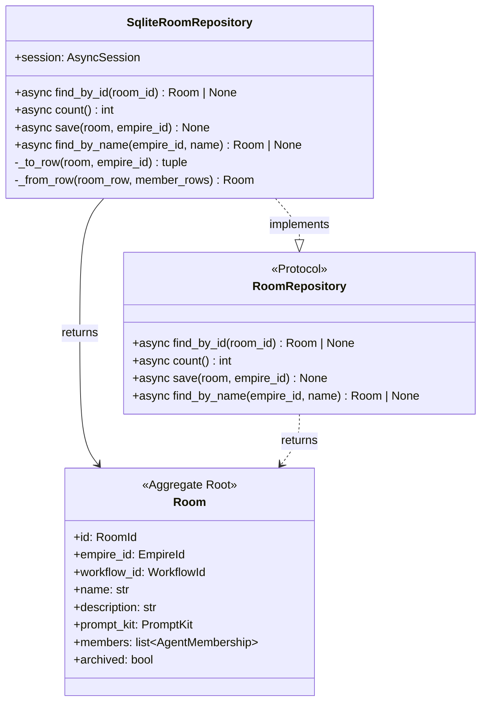
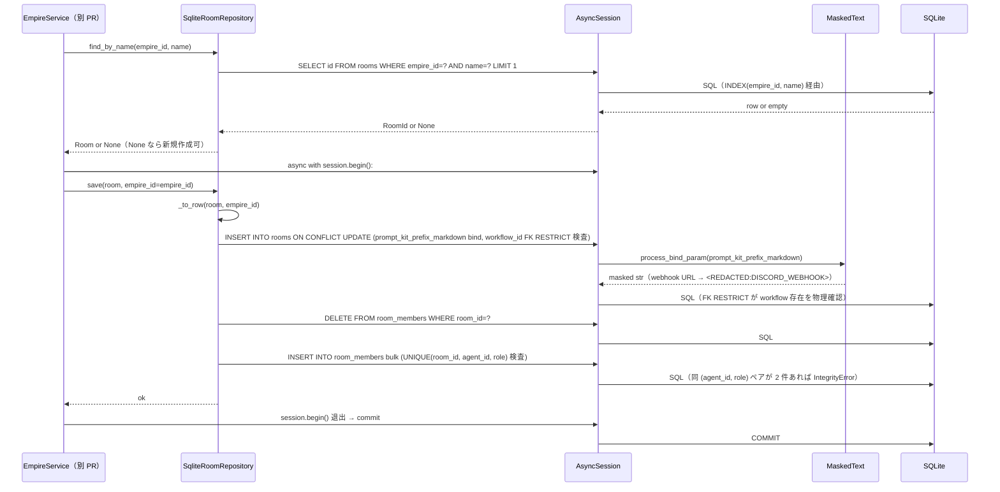
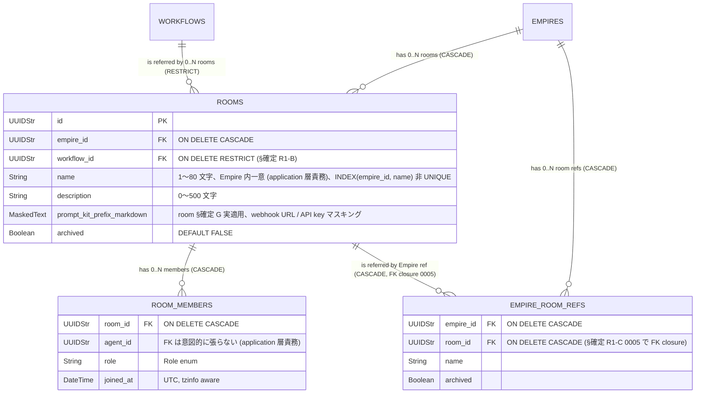

# 基本設計書

> feature: `room-repository`
> 関連: [requirements.md](requirements.md) / [`docs/features/empire-repository/`](../empire-repository/) **テンプレート真実源** / [`docs/features/workflow-repository/`](../workflow-repository/) **2 件目テンプレート** / [`docs/features/agent-repository/`](../agent-repository/) **3 件目テンプレート** / [`docs/features/room/`](../room/)

## 記述ルール（必ず守ること）

基本設計に**疑似コード・サンプル実装（python/ts/sh/yaml 等の言語コードブロック）を書かない**。
ソースコードと二重管理になりメンテナンスコストしか生まない。
必要なのは構造契約（クラス・モジュール・データの関係）であり、実装の細部は [detailed-design.md](detailed-design.md) で凍結する。

## モジュール構成

| 機能 ID | モジュール | ディレクトリ | 責務 |
|--------|----------|------------|------|
| REQ-RR-001 | `RoomRepository` Protocol | `backend/src/bakufu/application/ports/room_repository.py` | Repository ポート定義（4 method、empire-repo の 3 method + agent-repo §R1-C の `find_by_name`、§確定 R1-F） |
| REQ-RR-002 | `SqliteRoomRepository` | `backend/src/bakufu/infrastructure/persistence/sqlite/repositories/room_repository.py` | SQLite 実装、§確定 R1-A〜F |
| REQ-RR-003 | Alembic 0005 revision | `backend/alembic/versions/0005_room_aggregate.py` | 2 テーブル + UNIQUE + INDEX + FK 3 件追加、`down_revision="0004_agent_aggregate"`、`empire_room_refs.room_id` FK closure 同梱 |
| REQ-RR-004 | CI 三層防衛拡張 Layer 1 | `scripts/ci/check_masking_columns.sh`（既存ファイル更新）| Room 2 テーブル明示登録、`rooms.prompt_kit_prefix_markdown` の `MaskedText` 必須を assert（正のチェック）|
| REQ-RR-004 | CI 三層防衛拡張 Layer 2 | `backend/tests/architecture/test_masking_columns.py`（既存ファイル更新）| parametrize に Room 2 テーブル追加 |
| REQ-RR-005 | storage.md 逆引き表更新 | `docs/design/domain-model/storage.md`（既存ファイル更新）| Room 関連 2 行追加（既存 `PromptKit.prefix_markdown` 行を本 PR で実適用済みに更新） |
| REQ-RR-006 | empire-repo BUG-EMR-001 close 同期 | `docs/features/empire-repository/detailed-design.md`（既存ファイル更新）| §Known Issues §BUG-EMR-001 + §`empire_room_refs` テーブル §FK を張らない理由 を更新 |
| 共通 | tables/rooms.py / room_members.py | `backend/src/bakufu/infrastructure/persistence/sqlite/tables/` | 新規 2 ファイル |

```
ディレクトリ構造（本 feature で追加・変更されるファイル）:

.
├── backend/
│   ├── alembic/
│   │   └── versions/
│   │       └── 0005_room_aggregate.py             # 新規: 2 テーブル + UNIQUE + INDEX + FK 3 件 + empire_room_refs FK closure
│   ├── src/
│   │   └── bakufu/
│   │       ├── application/
│   │       │   └── ports/
│   │       │       └── room_repository.py         # 新規: Protocol（4 method）
│   │       └── infrastructure/
│   │           └── persistence/
│   │               └── sqlite/
│   │                   ├── repositories/
│   │                   │   └── room_repository.py # 新規: SqliteRoomRepository
│   │                   └── tables/
│   │                       ├── rooms.py           # 新規（prompt_kit_prefix_markdown は MaskedText、room §確定 G 実適用）
│   │                       └── room_members.py    # 新規（UNIQUE(room_id, agent_id, role)）
│   └── tests/
│       ├── infrastructure/
│       │   └── persistence/
│       │       └── sqlite/
│       │           └── repositories/
│       │               └── test_room_repository/   # 新規ディレクトリ（500 行ルール、最初から分割）
│       │                   ├── __init__.py
│       │                   ├── test_protocol_crud.py
│       │                   ├── test_save_semantics.py
│       │                   ├── test_constraints_arch.py
│       │                   └── test_masking_prompt_kit.py  # room §確定 G 実適用専用テスト
│       └── architecture/
│           └── test_masking_columns.py             # 既存更新: Room 2 テーブル parametrize 追加
├── scripts/
│   └── ci/
│       └── check_masking_columns.sh                # 既存更新: Room 2 テーブル明示登録
└── docs/
    ├── architecture/
    │   └── domain-model/
    │       └── storage.md                          # 既存更新: 逆引き表に Room 行追加
    └── features/
        ├── empire-repository/
        │   └── detailed-design.md                  # 既存更新: BUG-EMR-001 FK closure 完了同期
        └── room-repository/                        # 本 feature 設計書 5 本
```

## クラス設計（概要）



**凝集のポイント**:

- `RoomRepository` Protocol は application 層、domain は知らない（empire-repo §確定 A）
- `SqliteRoomRepository` は infrastructure 層、Protocol を型レベルで満たす
- domain ↔ row 変換は `_to_row()` / `_from_row()` の private method（empire-repo §確定 C）
- `save()` は同一 Tx 内で 2 テーブル delete-then-insert（empire-repo §確定 B、Room では 3 段階手順）
- 呼び出し側 service が `async with session.begin():` で UoW 境界を管理
- **`find_by_name(empire_id, name)` は第 4 method**、Empire スコープ検索（agent §R1-C 継承、§確定 R1-F）
- `Room` Aggregate は `empire_id` を直接保持しないが、Repository row 上では正規化のため `empire_id` カラムを持つ（room §確定で凍結された結合関係、後述）

##### `Room` Aggregate に `empire_id` を含めない理由（room domain 設計の継承）

room/detailed-design.md L41-49 で `Room` Aggregate Root の属性に `empire_id` は**含まれていない**（agent と異なる）。これは room §確定で「Room の所属 Empire は Empire Aggregate の `rooms: list[RoomRef]` 経由で表現される」と凍結されたため。

しかし Repository 永続化では:
- `find_by_id` で Room を取得した application 層が「この Room はどの Empire のものか」を即座に知るには **`empire_id` カラムが rooms 行に必要**（毎回 empire_room_refs を逆引きするのは N+1）
- `find_by_name(empire_id, name)` の SELECT が `WHERE empire_id=? AND name=?` で動くには `rooms.empire_id` が必要

そのため、**rows 層では `rooms.empire_id` カラムを持つが Aggregate `Room` には属性として現れない**。`_to_row` は `Empire` Aggregate から `rooms` を取り出した呼び出し元 service が引数で `empire_id` を渡す形（後述シーケンス図 L141-144）。

詳細は [detailed-design.md §確定 R1-H](detailed-design.md) で `_to_row(room, empire_id)` 契約として凍結する。

## 処理フロー

### ユースケース 1: Room の新規編成（save 経路、`EmpireService.establish_room()` 起点）

1. application 層 `EmpireService.establish_room(empire_id, name, description, workflow_id, prompt_kit, members)` を呼ぶ（本 PR スコープ外、別 PR）
2. application 層が `RoomRepository.find_by_name(empire_id, name)` で重複検査 → None なら新規作成、既存なら `RoomNameAlreadyExistsError` で 409
3. application 層が `WorkflowRepository.find_by_id(workflow_id)` で Workflow 存在検証（不在なら `WorkflowNotFoundError`）
4. `Room(id=uuid4(), workflow_id=workflow_id, name=name, description=description, prompt_kit=prompt_kit, members=[], archived=False)` を構築（pre-validate）
5. service が `async with session.begin():` で UoW 境界を開く
6. service が `RoomRepository.save(room, empire_id=empire_id)` を呼ぶ（**`empire_id` 引数経由**、§確定 R1-H）
7. `SqliteRoomRepository.save(room, empire_id)` が以下を順次実行（同一 Tx 内、3 段階）:
   - `_to_row(room, empire_id)` で `rooms_row` / `member_rows` に分離
   - rooms UPSERT（`prompt_kit_prefix_markdown` は `MaskedText` 経由で `MaskingGateway.mask()` 適用、room §確定 G 実適用）
   - room_members DELETE → bulk INSERT（`UNIQUE(room_id, agent_id, role)` が DB レベル一意性を保証、§確定 R1-D）
8. service が `EmpireRepository.find_by_id(empire_id)` で Empire を取得 → `empire.add_room_ref(...)` で RoomRef を追加 → `EmpireRepository.save(updated_empire)` で永続化（**同一 Tx**、empire_room_refs.room_id FK が `rooms.id` を物理参照、§確定 R1-C closure 後）
9. `session.begin()` ブロック退出で commit

### ユースケース 2: Room の取得（find_by_id 経路）

1. application 層が `RoomRepository.find_by_id(room_id)` を呼ぶ
2. `SqliteRoomRepository.find_by_id(room_id)` が以下を実行:
   - `SELECT * FROM rooms WHERE id = :room_id`（不在なら None）
   - `SELECT * FROM room_members WHERE room_id = :room_id ORDER BY agent_id, role`（§BUG-EMR-001 規約、複合 key 昇順で決定論的順序）
   - `_from_row(room_row, member_rows)` で Room 復元（**`prompt_kit_prefix_markdown` は masked 文字列のまま** で `PromptKit` 構築、不可逆性、申し送り）
3. valid な Room を返却（pre-validate 通過）

### ユースケース 3: Room の Empire 内一意検索（find_by_name 経路、§確定 R1-F）

1. application 層 `EmpireService.establish_room()` 内で `RoomRepository.find_by_name(empire_id, name)` を呼ぶ
2. `SqliteRoomRepository.find_by_name(empire_id, name)`:
   - `SELECT id FROM rooms WHERE empire_id = :empire_id AND name = :name LIMIT 1`（**INDEX(empire_id, name)** が効く、§確定 R1-F）
   - 不在なら None
   - 存在すれば `find_by_id(found_id)` を呼んで子テーブル含めて Room を復元
3. application 層が結果で重複判定（None → 新規作成可、Room → 409）

### ユースケース 4: Room の更新（save 経路、prompt_kit / members 変更等）

1. application 層が `find_by_id(room_id)` で既存 Room を取得
2. service が Room のドメイン操作（例: `room.update_prompt_kit(...)` / `room.add_member(...)`）で新 Room を構築（pre-validate 方式、room PR #22 で凍結）
3. service が `RoomRepository.save(updated_room, empire_id=empire_id)` を呼ぶ
4. ユースケース 1 と同じ手順で同一 Tx 内に delete-then-insert

### ユースケース 5: Room 件数取得（count 経路）

1. application 層が `RoomRepository.count()` を呼ぶ
2. `SqliteRoomRepository.count()` が `select(func.count()).select_from(RoomRow))` で SQL `COUNT(*)` 発行（empire-repo §確定 D 踏襲、Empire 制限なし、全 Empire 合計）
3. `scalar_one()` で `int` 取得

## シーケンス図



## アーキテクチャへの影響

- `docs/design/domain-model.md` への変更: なし
- `docs/design/domain-model/storage.md` への変更: **§逆引き表に Room 関連 2 行追加 + 既存 `PromptKit.prefix_markdown` 行を本 PR で実適用済みに更新**（§確定 R1-G、本 PR で同一コミット）
- `docs/design/domain-model/aggregates.md` への変更: なし（Room §定義は既存 PR #22 で凍結済み）
- `docs/design/migration-plan.md` への変更: なし（Room の Postgres 移行論点は本 PR 範囲外、ただし `op.batch_alter_table` の SQLite 特化挙動は将来の Postgres 移行時に Postgres ネイティブ ALTER TABLE で代替可能なため migration-plan.md §TODO-MIG-NNN への追記は不要）
- `docs/design/tech-stack.md` への変更: なし
- 既存 feature への波及:
  - `feature/persistence-foundation`（PR #23）の `MaskedText` TypeDecorator + room §確定 G hook 構造の上に乗る、本 PR で実適用配線
  - `feature/empire-repository`（PR #29 / #30）+ `feature/workflow-repository`（PR #41）+ `feature/agent-repository`（PR #45）テンプレート踏襲
  - `feature/empire-repository` 設計書を**本 PR で同期更新**（§Known Issues §BUG-EMR-001 FK closure 完了 + §`empire_room_refs` テーブル §FK を張らない理由 → 完了済み更新、REQ-RR-006）
  - `feature/room`（PR #22）の domain 層 Room / PromptKit / AgentMembership / RoomInvariantViolation を import するのみ、room 設計書は変更しない（room §確定 G 申し送りが「本 PR で実適用」なので、room/detailed-design.md L81 の文言更新は **設計書として正確に「実適用済み」を反映するため許容**だが、本 PR では room/detailed-design.md は触らず room-repository 側で完結させる方針）

## 外部連携

該当なし — 理由: infrastructure 層に閉じる。

| 連携先 | 目的 | プロトコル | 認証 | タイムアウト / リトライ |
|-------|------|----------|-----|--------------------|
| 該当なし | — | — | — | — |

## UX 設計

該当なし — 理由: UI を持たない infrastructure 層。

| シナリオ | 期待される挙動 |
|---------|------------|
| 該当なし | — |

**アクセシビリティ方針**: 該当なし。

## セキュリティ設計

### 脅威モデル

詳細な信頼境界は [`docs/design/threat-model.md`](../../design/threat-model.md)。本 feature 範囲では以下の 4 件。

| 想定攻撃者 | 攻撃経路 | 保護資産 | 対策 |
|-----------|---------|---------|------|
| **T1: `rooms.prompt_kit_prefix_markdown` 経由の secret 漏洩**（room §確定 G 中核）| CEO が PromptKit 設計時に prefix_markdown に「Discord webhook URL `https://discord.com/api/webhooks/...` で通知」と書く → Repository 経由で永続化 → DB 直読み / バックアップ / 監査ログ経路で webhook token 流出 | Discord webhook token / API key / GitHub PAT / OAuth token | `rooms.prompt_kit_prefix_markdown` を **`MaskedText`** で宣言、`process_bind_param` で `MaskingGateway.mask()` 経由マスキング（`<REDACTED:DISCORD_WEBHOOK>` / `<REDACTED:ANTHROPIC_KEY>` 等）。**room §確定 G の実適用**。CI 三層防衛 Layer 1 + Layer 2 で `MaskedText` 必須を物理保証 |
| **T2: `(agent_id, role)` 重複違反でデータ破損**（DB UNIQUE による二重防衛）| Aggregate 内 `_validate_member_unique` を迂回する経路（直 SQL 流入 / マイグレーション失敗 等）で `(room_id, agent_id, role)` が複数行 INSERT される → Aggregate 復元時に valid 判定が壊れて非決定的挙動 | Room の整合性 | DB レベル **`UNIQUE(room_id, agent_id, role)`** で INSERT/UPDATE を物理拒否 → IntegrityError、application 層が catch して 500 にマッピング（§確定 R1-D 二重防衛） |
| **T3: Workflow 削除による Room の dangling reference**（FK RESTRICT による物理保証）| application 層の検査を迂回する経路（admin CLI 直叩き / 直 SQL）で Workflow 行を削除 → 当該 Workflow を採用する Room が dangling reference 状態 → `find_by_id` で取得した Room の workflow_id が指す Workflow が存在しない、Pydantic 構築は通るが application 層が WorkflowNotFoundError | Room の参照整合性 | DB レベル **FK ON DELETE RESTRICT** で Workflow 削除を物理拒否 → IntegrityError、application 層が「先に全 Room を archive 又は別 Workflow に移行」する経路を強制（§確定 R1-B）|
| **T4: 永続化 Tx の半端終了による参照整合性破損** | `save()` 中に SQLite クラッシュ → `room_members` 行のみ INSERT されて `rooms` が DELETE のみで終了 | Room の整合性 | 同一 Tx 内の delete-then-insert（empire-repo §確定 B）+ M2 永続化基盤の WAL crash safety + foreign_keys ON。Tx 全体が ATOMIC、半端終了で rollback |

### OWASP Top 10 対応

| # | カテゴリ | 対応状況 |
|---|---------|---------|
| A01 | Broken Access Control | 該当なし（infrastructure 層、認可は別 feature） |
| A02 | Cryptographic Failures | **適用**: `rooms.prompt_kit_prefix_markdown` の Discord webhook URL / API key を `MaskedText` で永続化前マスキング（**room §確定 G 実適用**） |
| A03 | Injection | **適用**: SQLAlchemy ORM 経由で SQL injection 防御。raw SQL は使わない |
| A04 | Insecure Design | **適用**: Repository ポート分離 + delete-then-insert + DB UNIQUE(room_id, agent_id, role) + FK RESTRICT による多層防衛 |
| A05 | Security Misconfiguration | M2 永続化基盤の PRAGMA 強制の上に乗る |
| A06 | Vulnerable Components | SQLAlchemy 2.x / Alembic / aiosqlite — persistence-foundation PR #23 で pip-audit 確認済み（本 PR で新規依存なし）。**CVE-2025-6965（SQLite < 3.50.2）**: 本システムは SQLAlchemy ORM 経由のみ SQL を発行（A03 の raw SQL 禁止）しており、外部入力から SQL を inject する攻撃前提が物理遮断されるため直接の悪用経路なし。デプロイ環境の SQLite バージョンは **>= 3.50.2** を ops 要件とし、`docs/design/tech-stack.md` に制約を追記する |
| A07 | Auth Failures | 該当なし |
| A08 | Data Integrity Failures | **適用**: foreign_keys ON + ON DELETE CASCADE/RESTRICT で参照整合性、Tx 原子性、UNIQUE(room_id, agent_id, role) で member 二重防衛、empire_room_refs FK closure で Empire ↔ Room 整合性物理保証 |
| A09 | Logging Failures | **適用**: `rooms.prompt_kit_prefix_markdown` のマスキングにより SQL ログ / 監査ログ経路で webhook token 漏洩なし（room §確定 G 実適用の二次効果）|
| A10 | SSRF | 該当なし（外部 URL fetch なし）|

## ER 図



UNIQUE 制約 / INDEX:

- `room_members(room_id, agent_id, role)` UNIQUE: 同 Room 内で `(agent_id, role)` 重複禁止（**§確定 R1-D 二重防衛**）
- `rooms(empire_id, name)` 非 UNIQUE INDEX: `find_by_name` の Empire スコープ検索に使用（**§確定 R1-F**）
- `empire_room_refs.room_id → rooms.id` FK CASCADE: **§確定 R1-C**、BUG-EMR-001 close（`op.batch_alter_table` 経由）

masking 対象カラム: `rooms.prompt_kit_prefix_markdown` のみ（`MaskedText`、§確定 R1-E）。CI 三層防衛で物理保証。

## エラーハンドリング方針

| 例外種別 | 処理方針 | ユーザーへの通知 |
|---------|---------|----------------|
| `sqlalchemy.IntegrityError`（FK CASCADE / FK RESTRICT / UNIQUE(room_id, agent_id, role) 違反）| application 層に伝播、HTTP API 層で 409 Conflict | application 層 / HTTP API の MSG（別 feature） |
| `sqlalchemy.OperationalError`（接続切断、ロック timeout）| application 層に伝播、HTTP API 層で 503 | 同上 |
| `pydantic.ValidationError`（domain Room 構築時、`_from_row` 内で発生し得る）| Repository 内で catch せず application 層に伝播、データ破損として扱う | application 層 / HTTP API の MSG |
| その他 | 握り潰さない、application 層へ伝播 | 汎用エラーメッセージ |

**Repository 内で明示的な commit / rollback はしない**: 呼び出し側 service が `async with session.begin():` で UoW 境界を管理（empire-repo §確定 B 踏襲）。
