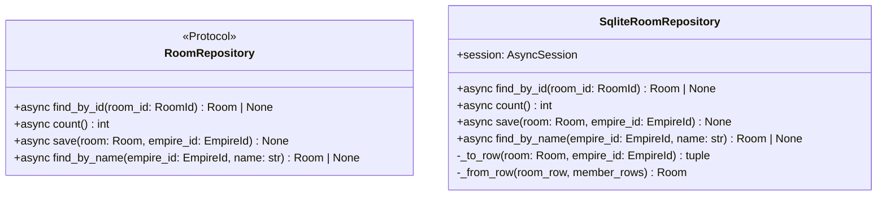

# 詳細設計書

> feature: `room-repository`
> 関連: [basic-design.md](basic-design.md) / [`docs/features/empire-repository/detailed-design.md`](../empire-repository/detailed-design.md) **テンプレート真実源** / [`docs/features/workflow-repository/detailed-design.md`](../workflow-repository/detailed-design.md) **2 件目テンプレート** / [`docs/features/agent-repository/detailed-design.md`](../agent-repository/detailed-design.md) **3 件目テンプレート** / [`docs/features/room/detailed-design.md`](../room/detailed-design.md)

## 記述ルール（必ず守ること）

詳細設計に**疑似コード・サンプル実装（python/ts/sh/yaml 等の言語コードブロック）を書かない**。
ソースコードと二重管理になりメンテナンスコストしか生まない。
必要なのは「構造契約（属性名・型・制約）」と「確定文言（メッセージ文字列）」と「実装の意図」。

## クラス設計（詳細）

### Protocol: RoomRepository（`application/ports/room_repository.py`）

| メソッド | 引数 | 戻り値 | 制約 |
|----|----|----|----|
| `find_by_id(room_id: RoomId)` | RoomId | `Room \| None` | 不在時 None。SQLAlchemy 例外は上位伝播 |
| `count()` | なし | `int` | 全 Room 数（empire-repo §確定 D 同 SQL `COUNT(*)` 契約） |
| `save(room: Room, empire_id: EmpireId)` | Room + EmpireId | None | 同一 Tx 内で rooms + room_members を delete-then-insert（empire-repo §確定 B 踏襲）。**`empire_id` は引数経由**（§確定 H、Room Aggregate に empire_id 属性がないため呼び出し側 service が渡す） |
| `find_by_name(empire_id: EmpireId, name: str)` | EmpireId + name 文字列 | `Room \| None` | **第 4 method**、Empire スコープでの一意検査（agent §R1-C 継承、§確定 F）。不在時 None。`INDEX(empire_id, name)` 経由 |

`@runtime_checkable` は付与しない（empire-repo §確定 A）。

### Class: SqliteRoomRepository（`infrastructure/persistence/sqlite/repositories/room_repository.py`）

| 属性 | 型 | 制約 |
|----|----|----|
| `session` | `AsyncSession` | コンストラクタで注入、Tx 境界は外側 service が管理 |

| 関数 | 引数 | 戻り値 | 制約 |
|----|----|----|----|
| `__init__(session: AsyncSession)` | session | None | session を保持するだけ、Tx は開かない |
| `find_by_id(room_id)` | RoomId | `Room \| None` | rooms SELECT → 不在なら None。存在すれば room_members を `ORDER BY agent_id, role` で SELECT（§BUG-EMR-001 規約、複合 key 昇順）→ `_from_row` で構築 |
| `count()` | なし | int | `select(func.count()).select_from(RoomRow)` で SQL `COUNT(*)`、`scalar_one()` で int 取得。**全行ロード+ Python `len()` パターン禁止** |
| `save(room, empire_id)` | Room + EmpireId | None | §確定 B の delete-then-insert（3 段階手順、後述） |
| `find_by_name(empire_id, name)` | EmpireId + str | `Room \| None` | `SELECT id FROM rooms WHERE empire_id = :empire_id AND name = :name LIMIT 1` で RoomId 取得 → 存在すれば `find_by_id(found_id)` で子テーブル含めて Room 復元（§確定 F）|
| `_to_row(room, empire_id)` | Room + EmpireId | `tuple[dict, list[dict]]` | (rooms_row, member_rows) に分離（empire-repo §確定 C、§確定 H で `empire_id` 引数経由を凍結） |
| `_from_row(room_row, member_rows)` | dict, list[dict] | Room | VO 構造で復元（§確定 J で `prompt_kit_prefix_markdown` の masked 復元を凍結） |

### Tables（既存 M2 永続化基盤の table モジュール群に追加）

| テーブル | モジュール | カラム |
|----|----|----|
| `rooms` | `infrastructure/persistence/sqlite/tables/rooms.py`（新規）| `id: UUIDStr PK` / `empire_id: UUIDStr FK CASCADE` / **`workflow_id: UUIDStr FK RESTRICT`** / `name: String(80) NOT NULL`（DB UNIQUE なし）/ `description: String(500) NOT NULL DEFAULT ''` / **`prompt_kit_prefix_markdown: MaskedText NOT NULL DEFAULT ''`** / `archived: Boolean NOT NULL DEFAULT FALSE` / **INDEX(empire_id, name) 非 UNIQUE** |
| `room_members` | `infrastructure/persistence/sqlite/tables/room_members.py`（新規）| `room_id: UUIDStr FK CASCADE PK` / `agent_id: UUIDStr PK NOT NULL`（FK は意図的に張らない、application 層責務）/ `role: String(32) PK NOT NULL` / `joined_at: DateTime(timezone=True) NOT NULL` / **UNIQUE(room_id, agent_id, role)**（PK 複合と一致、明示 UNIQUE 制約名で表現）|

すべて `bakufu.infrastructure.persistence.sqlite.base.Base` を継承。

##### `room_members` の主キー設計（複合 PK と UNIQUE 制約の関係）

`UNIQUE(room_id, agent_id, role)` は本 PR §確定 R1-D の二重防衛要件。同じ 3 カラムを **PK 複合** にすれば自動的に UNIQUE になるが、明示 `UniqueConstraint` を `__table_args__` で宣言することで:

1. CI Layer 2 arch test で `__table_args__` を走査して UNIQUE 制約の存在を assert できる（PK 由来の暗黙 UNIQUE は arch test で検出しにくい）
2. agent_providers の `UniqueConstraint("agent_id", "provider_kind", name="uq_agent_providers_pair")` パターンを踏襲（テンプレート責務）

採用方針: **複合 PK(room_id, agent_id, role) + 明示 `UniqueConstraint(name='uq_room_members_triplet')`**（agent_providers L100-104 同パターン）。

##### `room_members.joined_at` の timezone 設計

| 採用 | 不採用 | 理由 |
|---|---|---|
| **`DateTime(timezone=True)`** | `DateTime` naive | room §確定（[room/detailed-design.md L91](../room/detailed-design.md)）で `joined_at: datetime` は **UTC** と凍結済み。SQLAlchemy `DateTime(timezone=True)` で SQLite 上は ISO8601 文字列に保存（[SQLAlchemy DateTime](https://docs.sqlalchemy.org/en/20/core/type_basics.html#sqlalchemy.types.DateTime)）。aiosqlite が tzinfo を保持するため、`_from_row` で復元される `AgentMembership.joined_at` は aware datetime で Pydantic 型バリデーションを通過 |
| | `DEFAULT CURRENT_TIMESTAMP` | `joined_at` は domain 層で確定する値（`datetime.now(UTC)` を application 層 `RoomService.add_member` が渡す）。DB 側 default で再上書きすると application 層の意図と乖離 |

## 確定事項（先送り撤廃）

### 確定 A: empire-repo / workflow-repo / agent-repo テンプレート 100% 継承（再凍結）

empire-repository PR #29/#30 の §確定 A〜F + §Known Issues §BUG-EMR-001 規約 + workflow-repository PR #41 の §確定 E（CI 三層防衛 正のチェック）+ agent-repository PR #45 の §確定 R1-C（find_by_name 第 4 method）/ §確定 R1-D（DB レベル制約二重防衛）を**そのまま継承**。本 PR で再議論しない項目:

| empire/workflow/agent 確定 | 本 PR への適用 |
|---|---|
| empire §確定 A | `application/ports/room_repository.py` 新規、Protocol、`@runtime_checkable` なし |
| empire §確定 B | `save()` で rooms UPSERT + room_members DELETE/INSERT、Repository 内 commit/rollback なし |
| empire §確定 C | `_to_row` / `_from_row` を private method に閉じる |
| empire §確定 D | `count()` は SQL `COUNT(*)` 限定 |
| empire §確定 E | CI 三層防衛 Layer 1 + Layer 2 + Layer 3 全部に Room 2 テーブル明示登録 |
| empire §BUG-EMR-001 規約 | `find_by_id` 子テーブル SELECT は `ORDER BY agent_id, role` 必須（複合 key 昇順、決定論的順序の物理保証）|
| workflow §確定 E（正のチェック）| `rooms.prompt_kit_prefix_markdown` の `MaskedText` 必須を grep + arch test で物理保証 |
| agent §R1-C テンプレ | `find_by_name(empire_id, name)` 第 4 method 追加、Empire スコープ検索 |
| agent §R1-D テンプレ | DB レベル制約による二重防衛（本 PR では `UNIQUE(room_id, agent_id, role)`）|

### 確定 B: `save()` 3 段階手順（empire-repo §確定 B の Room 適用）

| 順 | 操作 | SQL（概要） |
|---|---|---|
| 1 | rooms UPSERT | `INSERT INTO rooms (id, empire_id, workflow_id, name, description, prompt_kit_prefix_markdown, archived) VALUES (...) ON CONFLICT (id) DO UPDATE SET workflow_id=..., name=..., description=..., prompt_kit_prefix_markdown=..., archived=...`（**`prompt_kit_prefix_markdown` は `MaskedText.process_bind_param` 経由でマスキング**、`workflow_id` FK RESTRICT が workflow 存在を物理確認）|
| 2 | room_members DELETE | `DELETE FROM room_members WHERE room_id = :room_id` |
| 3 | room_members bulk INSERT | `INSERT INTO room_members (room_id, agent_id, role, joined_at) VALUES ...`（room.members 件数分、`UNIQUE(room_id, agent_id, role)` が DB レベル一意性を保証）|

##### Tx 境界の責務分離（再凍結）

`SqliteRoomRepository.save()` は **明示的な commit / rollback をしない**。呼び出し側 service が `async with session.begin():` で UoW 境界を管理（empire-repo §確定 B 踏襲）。

##### `empire_id` 引数の必要性

`Room` Aggregate は `empire_id` 属性を持たない（room §確定で凍結、basic-design.md §クラス設計概要 §`Room` Aggregate に `empire_id` を含めない理由 参照）。Repository 永続化では `rooms.empire_id` カラムが必要なため、`save(room, empire_id)` で呼び出し側 service が渡す形（§確定 H 詳述）。

### 確定 C: domain ↔ row 変換契約（empire-repo §確定 C の Room 適用）

##### `_to_row(room: Room, empire_id: EmpireId)` 契約

| 入力 | 出力 |
|---|---|
| `Room`（Aggregate Root インスタンス） + `EmpireId` | `tuple[dict, list[dict]]` |

戻り値:
1. `rooms_row: dict[str, Any]` — `{'id': ..., 'empire_id': ..., 'workflow_id': ..., 'name': ..., 'description': ..., 'prompt_kit_prefix_markdown': room.prompt_kit.prefix_markdown, 'archived': ...}`
2. `member_rows: list[dict[str, Any]]` — 各 AgentMembership を `{'room_id': room.id, 'agent_id': ..., 'role': ..., 'joined_at': ...}` に変換

##### `_from_row(room_row, member_rows)` 契約

| 入力 | 出力 |
|---|---|
| `room_row: dict` / `member_rows: list[dict]` | `Room` |

戻り値: `Room(id=..., workflow_id=..., name=..., description=..., prompt_kit=PromptKit(prefix_markdown=masked_str), members=[AgentMembership(...) for ...], archived=...)`。Aggregate Root の不変条件は構築時の `model_validator(mode='after')` で再走（room PR #22 で凍結済み）。

**`empire_id` は `Room` Aggregate に戻さない**（属性として持たないため）。呼び出し側 service が `room_row['empire_id']` を別途参照する経路は本 Repository 契約の範囲外（必要なら別 method `find_empire_id_by_room_id` を追加するが、MVP では呼び出し側が自分で empire_id を保持しているため不要）。

##### masked `prompt_kit_prefix_markdown` 復元の不可逆性凍結（§確定 J）

`prompt_kit_prefix_markdown` は DB 上で masked された文字列で保存されているため、`_from_row` で読み出した値は raw 復元不能。`PromptKit(prefix_markdown=masked_str)` で構築するが、当該 Room を LLM Adapter に配送すると `<REDACTED:*>` が prompt に流れる。MVP では「CEO が PromptKit を再編集」運用、後続 `feature/llm-adapter` で警告経路を凍結（§Known Issues §申し送り）。

### 確定 D: `count()` SQL 契約（empire-repo §確定 D 踏襲）

| 採用 | 不採用 | 理由 |
|---|---|---|
| `count()`: `select(func.count()).select_from(RoomRow)` で SQL `COUNT(*)` 発行、`scalar_one()` で int 取得 | `select(RoomRow.id)` で全行を取得して Python `len(list(result.scalars().all()))` | empire-repo §確定 D 踏襲、後続 PR が真似する経路として残ると有害 |

### 確定 E: CI 三層防衛 Room 拡張（**正/負のチェック併用**、workflow-repo §確定 E パターン）

##### Layer 1: grep guard（`scripts/ci/check_masking_columns.sh`）

| 登録内容 | 期待結果 |
|---|---|
| `tables/rooms.py` の `prompt_kit_prefix_markdown` カラム宣言行に `MaskedText` が含まれる | grep ヒット必須 → pass（**正のチェック**、room §確定 G 実適用 grep 物理保証）|
| `tables/rooms.py` の `prompt_kit_prefix_markdown` 以外のカラムに `MaskedText` / `MaskedJSONEncoded` が登場しない | grep 1 ヒット限定 → pass（過剰マスキング防止）|
| `tables/room_members.py` 全体に `MaskedText` / `MaskedJSONEncoded` が登場しない | grep ゼロヒット → pass |

##### Layer 2: arch test（`backend/tests/architecture/test_masking_columns.py`）

| 入力 | 期待 assertion |
|---|---|
| `Base.metadata.tables['rooms']` の `prompt_kit_prefix_markdown` カラム | `column.type.__class__ is MaskedText`（**正のチェック**）|
| `Base.metadata.tables['rooms']` の `prompt_kit_prefix_markdown` 以外のカラム | `column.type.__class__` が `MaskedText` でも `MaskedJSONEncoded` でもない |
| `Base.metadata.tables['room_members']` | 全カラム masking なし |
| `Base.metadata.tables['rooms']` の `__table_args__` | `Index('ix_rooms_empire_id_name', 'empire_id', 'name')` を含む（INDEX 存在 assert）|
| `Base.metadata.tables['room_members']` の `__table_args__` | `UniqueConstraint('room_id', 'agent_id', 'role', name='uq_room_members_triplet')` を含む |

##### Layer 3: storage.md 逆引き表更新（REQ-RR-005）

`docs/architecture/domain-model/storage.md` §逆引き表に Room 関連 2 行追加（既存 `PromptKit.prefix_markdown` 行は本 PR で実適用済みに更新）。

### 確定 F: `find_by_name(empire_id, name)` 第 4 method 契約（agent §R1-C 継承詳細）

##### 採用方針: Empire スコープで `(empire_id, name)` 複合検索

| 候補 | 採否 | 理由 |
|---|---|---|
| **(a) `find_by_name(empire_id, name)` で `WHERE empire_id=? AND name=?`** | ✓ 採用 | room §確定で name 一意性は Empire 内、agent §R1-C と同論理 |
| (b) `find_by_name(name)` で全 Empire を検索 | ✗ 不採用 | 異 Empire で同 name を持つ Room が存在し得る、複数行返って判定が壊れる |
| (c) `find_by_id` を全件 SELECT して filter | ✗ 不採用 | N+1、後続 PR が真似すると数千 Room でメモリ枯渇 |

##### 実装契約

| 段階 | 動作 |
|---|---|
| 1 | `SELECT id FROM rooms WHERE empire_id = :empire_id AND name = :name LIMIT 1` で RoomId 取得（**INDEX(empire_id, name)** が効く）|
| 2 | 不在なら `None` を返す |
| 3 | 存在すれば `await self.find_by_id(found_id)` を呼んで子テーブル含めて Room 復元 |
| 4 | Room or `None` を返す |

### 確定 H: `save(room, empire_id)` の `empire_id` 引数経路凍結

##### 背景: `Room` Aggregate に `empire_id` 属性がない

room/detailed-design.md L41-49 で `Room` Aggregate Root の属性は `id` / `name` / `description` / `workflow_id` / `members` / `prompt_kit` / `archived` の 7 つ。**`empire_id` は含まれない**（Room の所属 Empire は Empire Aggregate の `rooms: list[RoomRef]` 経由で表現される）。

##### Repository 永続化での `empire_id` 必須性

`rooms.empire_id` カラムは:
- `find_by_name(empire_id, name)` の `WHERE` 句に必須（§確定 F）
- `empires.id` への FK CASCADE で「Empire 削除 → Room 連動削除」の参照整合性に必須

##### 解決方針: `save(room, empire_id)` で呼び出し側 service が渡す

| 候補 | 採否 | 理由 |
|---|---|---|
| **(a) `save(room: Room, empire_id: EmpireId)` で引数経由** | ✓ 採用 | application 層 `EmpireService.establish_room(empire_id, ...)` / `RoomService.update(...)` は呼び出し時点で `empire_id` を保持しているため引数で渡せる。Repository は単機能 |
| (b) `Room` Aggregate に `empire_id: EmpireId` 属性を追加 | ✗ 不採用 | room domain 設計（PR #22 マージ済み）の破壊的変更、room §確定の「Room の所属 Empire は Empire Aggregate の rooms 経由」凍結に違反 |
| (c) Repository が `empire_room_refs` を逆引きして `empire_id` を取得 | ✗ 不採用 | save 経路で逆引き SELECT が増える、N+1 + Repository が「自分の責務以外」を持つ |
| (d) `find_by_id` の戻り値を `tuple[Room, EmpireId]` にして save 時に再利用 | ✗ 不採用 | Protocol が複雑化、agent / empire / workflow と異なる契約になり後続 PR の混乱を招く |

##### 後続 Repository PR への申し送り

「Aggregate に外部 Aggregate ID 属性を持たない場合、Repository `save(aggregate, scope_id)` で引数経由」パターンを本 §確定 H で凍結。後続 PR で同パターンが必要になった場合（例: `feature/directive-repository` で Directive が target_room_id を持たない場合等）、本 §確定 H を真実源として参照。

### 確定 I: `workflow_id` FK ON DELETE RESTRICT（§確定 R1-B 詳細）

##### Alembic での生成

`op.create_table('rooms', ..., sa.Column('workflow_id', sa.CHAR(32), sa.ForeignKey('workflows.id', ondelete='RESTRICT'), nullable=False))`

##### 違反時の挙動

| 経路 | 違反検出層 | 例外 |
|---|---|---|
| application 層が Workflow を削除しようとする時に Room が残存 | DB FK RESTRICT | `sqlalchemy.IntegrityError`（FOREIGN KEY constraint failed）|
| application 層が `WorkflowService.delete(workflow_id)` で先に `RoomRepository.count_by_workflow(workflow_id)` を呼び 0 を確認 | application 層検査（後続 PR 責務）| `WorkflowInUseError`（後続 PR）|

二重防衛の意図: application 層検査が壊れた場合（直 SQL 流入 / バグ）の最終防衛線として DB レベルで物理拒否、Defense in Depth。

##### `count_by_workflow(workflow_id)` は本 PR で追加するか

**追加しない**。本 PR の Protocol は 4 method 確定（§確定 F）。`count_by_workflow` は `feature/workflow-application` 等で Workflow 削除前検査が必要になった時点で追加（YAGNI）。本 PR ではその時点で Repository 第 5 method 追加が容易な拡張ポイントを残すのみ。

### 確定 J: `prompt_kit_prefix_markdown` masking の不可逆性凍結（room §確定 G 実適用の副作用）

##### 採用方針: masking は永続化前のみ実施、復元時は復元できないことを許容

`rooms.prompt_kit_prefix_markdown` は **`MaskedText.process_bind_param` で永続化前マスキング**（agent §確定 H と完全同パターン）。`MaskingGateway.mask()` は不可逆操作で、DB から読み出した文字列から元の token は復元できない。

| シナリオ | 想定挙動 |
|---|---|
| `save(room, empire_id)` で raw `prefix_markdown='Discord webhook https://discord.com/api/webhooks/...'` を渡す | DB には `<REDACTED:DISCORD_WEBHOOK>` が永続化（適用順序は storage.md §マスキング規則の通り）|
| `find_by_id(room.id)` で復元 | `PromptKit.prefix_markdown` には masked 文字列が入る、Pydantic 構築は通過（PROMPT_KIT_PREFIX_MAX 内、文字種制約なし）|
| LLM Adapter が `PromptKit.prefix_markdown` を prompt に展開 | `<REDACTED:*>` がそのまま LLM に流れる、品質劣化 |

##### 申し送り（Room 後続申し送り #1）: LLM Adapter での masked 検出 + 警告

後続 `feature/llm-adapter` で「`PromptKit.prefix_markdown` に `<REDACTED:*>` を含む Room はログ警告 + 配送停止」契約を凍結する責務。本 PR では Repository 層の masking 不可逆性のみ凍結し、配送側は範囲外（agent §確定 H 申し送り #1 と同パターン）。

| 候補 | 採否 |
|---|---|
| (a) Repository が復元時に masked 検出して警告を上げる | ✗ 不採用（Repository は単機能 CRUD、警告は LLM Adapter / application 層責務）|
| (b) `PromptKit` VO 側で masked 検出 | ✗ 不採用（VO は raw / masked を区別せず保持、構造的制約のみ）|
| **(c) `feature/llm-adapter` で配送前検出 + 警告 + 配送停止** | ✓ **採用**（責務分離、本 PR は masking 適用のみで完結）|

### 確定 K: `empire_room_refs.room_id → rooms.id` FK closure 詳細（§確定 R1-C 詳述）

##### Alembic での FK 追加（SQLite ALTER TABLE 制約への対応）

SQLite は `ALTER TABLE ... ADD CONSTRAINT FOREIGN KEY` を直接サポートしない（[SQLite — ALTER TABLE](https://www.sqlite.org/lang_altertable.html) §制限事項）。Alembic は `op.batch_alter_table()` で内部 table 再作成（`CREATE TABLE new_t → INSERT SELECT → DROP old → RENAME`）して FK を追加する。

##### 0005 での実行手順

| 順 | 操作 | 対象 |
|---|---|---|
| 1 | `op.create_table('rooms', ...)` | rooms（workflow_id FK RESTRICT 込み）|
| 2 | `op.create_table('room_members', ...)` | room_members（room_id FK CASCADE 込み）|
| 3 | `op.create_index('ix_rooms_empire_id_name', 'rooms', ['empire_id', 'name'], unique=False)` | INDEX 非 UNIQUE |
| 4 | `with op.batch_alter_table('empire_room_refs', recreate='always') as batch_op: batch_op.create_foreign_key('fk_empire_room_refs_room_id', 'rooms', ['room_id'], ['id'], ondelete='CASCADE')` | **FK closure（BUG-EMR-001 close）**|

`recreate='always'` は SQLite で確実に table を再作成する指示（既存データは internal SELECT 経由で copy）。本番環境への影響なし（MVP 段階で本番 DB は存在しない、開発環境でも再 migration 可能）。

##### downgrade での逆順

| 順 | 操作 |
|---|---|
| 1 | `with op.batch_alter_table('empire_room_refs', recreate='always') as batch_op: batch_op.drop_constraint('fk_empire_room_refs_room_id', type_='foreignkey')` |
| 2 | `op.drop_index('ix_rooms_empire_id_name', table_name='rooms')` |
| 3 | `op.drop_table('room_members')` |
| 4 | `op.drop_table('rooms')` |

##### empire-repo BUG-EMR-001 同期更新（REQ-RR-006）

本 PR の同一コミットで `docs/features/empire-repository/detailed-design.md` を更新:

1. **§Known Issues §BUG-EMR-001**: 既存「RESOLVED in `feature/empire-repository-order-by`」マークの直下に**追記行**で「**FK closure also resolved in `feature/33-room-repository` Alembic 0005**」
2. **§`empire_room_refs` テーブル §Room テーブルへの FK を張らない理由**: 既存記述（歴史的経緯として残す）の末尾に「**※ FK closure 完了済み: `feature/33-room-repository` の Alembic 0005 で `op.batch_alter_table` 経由で追加**」追記

### 確定 L: テスト責務の 4 ファイル分割（empire-repo / workflow-repo / agent-repo 教訓を最初から反映）

empire-repo PR #29 で 506 行 → 500 行ルール違反でディレクトリ分割した教訓、agent-repo で最初から 4 分割した教訓を踏襲。本 PR は**最初から 4 ファイル分割**:

| ファイル | 責務 |
|---|---|
| `test_room_repository/test_protocol_crud.py` | save → find_by_id 経路の正常系、count() の SQL 契約、find_by_name の Empire スコープ検索（§確定 F） |
| `test_room_repository/test_save_semantics.py` | delete-then-insert の物理保証、ORDER BY 規約（§BUG-EMR-001 継承）、`empire_id` 引数経路（§確定 H）|
| `test_room_repository/test_constraints_arch.py` | UNIQUE(room_id, agent_id, role) / INDEX(empire_id, name) / FK 3 件（rooms.empire_id CASCADE / rooms.workflow_id RESTRICT / room_members.room_id CASCADE）/ empire_room_refs.room_id FK closure（BUG-EMR-001 close）/ pyright Protocol 充足 |
| `test_room_repository/test_masking_prompt_kit.py` | **room §確定 G 実適用専用**: raw `prefix_markdown` を渡して DB に `<REDACTED:*>` が永続化されることを raw SQL で物理確認、masking 不可逆性の物理確認 |

各ファイルは 200 行を目安、500 行ルール厳守。

## 設計判断の補足

### なぜ `rooms.name` に DB UNIQUE を張らないか

`rooms(empire_id, name)` の複合 UNIQUE を張ると、application 層が MSG-RM-NNN（後続 PR `RoomService` 系）を出す前に `IntegrityError` が raise され、ユーザー向けメッセージの統一が崩れる（agent §R1-B と同論理）。`find_by_name` 経由で application 層検査の経路を残し、DB UNIQUE は張らない。

`(room_id, agent_id, role)` の UNIQUE は別問題（§確定 R1-D）: こちらは Aggregate 内検査の最終防衛線として **DB レベルで物理拒否**することに意味がある（壊れたデータが Aggregate 復元時に valid 判定をすり抜ける経路を物理的に塞ぐ）。

### なぜ `workflow_id` FK は RESTRICT で `empire_id` FK は CASCADE か

| 関係 | 所有関係 | ON DELETE | 理由 |
|---|---|---|---|
| Empire → Room | Empire **owns** Room（room §確定で Empire Aggregate の `rooms: list[RoomRef]` 経由で表現） | CASCADE | Empire 削除 → 所属 Room も消える、所有者削除なら子も消えるのが自然 |
| Workflow → Room | Workflow は Room の**参照先**であって所有者ではない（room §確定 `workflow_id` は workflow を**選択する**）| **RESTRICT** | Workflow 削除で Room が勝手に消えるのは、workflow 設計の使い回しを破壊する不可逆データ損失 |

### なぜ `prompt_kit_prefix_markdown` を `MaskedText` にするか（room §確定 G 実適用の根拠）

CEO が PromptKit 設計時に prefix_markdown に「Discord webhook URL `https://discord.com/api/webhooks/...` で通知」と書く経路は現実にあり得る。masking しないと:

1. DB 直読み / バックアップで webhook token 流出（Discord webhook を悪用すれば任意のメッセージ送信）
2. SQL ログで token 流出
3. 監査ログで token 流出
4. 後続 PR の `find_all()` 系で token 流出

application 層でマスキングする方針は実装漏れリスクが高く、**永続化前の単一ゲートウェイ**（persistence-foundation §確定 R1-D）を信じて `MaskedText` で TypeDecorator 経由のマスキング強制が正解（agent §R1-B と同論理）。

### なぜ `room_members.agent_id` に FK を張らないか

room §確定（[aggregates.md §Room](../../architecture/domain-model/aggregates.md) L36 / [room/detailed-design.md L66](../room/detailed-design.md)）で「`members[*].agent_id` が指す Agent の存在は application 層 `RoomService.add_member` が `AgentRepository.find_by_id` で確認」と application 層責務として凍結済み。

加えて、Agent Aggregate は archived=True 状態でも row が残る（agent §確定）。FK CASCADE は危険（archived agent がいる Room の members が勝手に削除される）、RESTRICT も Room 編成時の柔軟性を損なう（archived agent を Room から削除できなくなる）。**FK を張らず application 層検査のみに統一**が正解。

### なぜ複合 PK + 明示 UniqueConstraint の二重宣言にするか（room_members）

複合 PK(room_id, agent_id, role) は SQLAlchemy 内部で暗黙の UNIQUE を作るが、CI Layer 2 arch test で `__table_args__` を走査して UNIQUE 制約の存在を assert できない（PK 由来の暗黙 UNIQUE は arch test で検出しにくい）。

明示 `UniqueConstraint(name='uq_room_members_triplet')` を `__table_args__` に書くことで:
1. arch test で「§確定 R1-D の二重防衛が物理保証されている」を CI で検査できる
2. agent_providers の `UniqueConstraint("agent_id", "provider_kind", name="uq_agent_providers_pair")` パターンを踏襲（テンプレート責務）

冗長性は許容、CI 物理保証の方が価値が高い。

## ユーザー向けメッセージの確定文言

該当なし — 理由: Repository は内部 API、ユーザー向けメッセージは application 層 / HTTP API 層が定義する。Repository は SQLAlchemy 例外 + `pydantic.ValidationError` を上位伝播するのみ。

## データ構造（永続化キー）

### `rooms` テーブル

| カラム | 型 | 制約 | 意図 |
|----|----|----|----|
| `id` | `UUIDStr` | PK, NOT NULL | RoomId |
| `empire_id` | `UUIDStr` | FK → `empires.id` ON DELETE CASCADE, NOT NULL | 所属 Empire |
| `workflow_id` | `UUIDStr` | **FK → `workflows.id` ON DELETE RESTRICT**, NOT NULL | 採用 Workflow（§確定 I）|
| `name` | `String(80)` | NOT NULL（DB UNIQUE なし、application 層責務）| 部屋名 |
| `description` | `String(500)` | NOT NULL DEFAULT '' | 用途説明 |
| `prompt_kit_prefix_markdown` | **`MaskedText`** | NOT NULL DEFAULT '' | PromptKit.prefix_markdown（**room §確定 G 実適用、§確定 J 不可逆性凍結**）|
| `archived` | `Boolean` | NOT NULL DEFAULT FALSE | アーカイブ状態 |
| INDEX | `(empire_id, name)` 非 UNIQUE | name `ix_rooms_empire_id_name` | **§確定 F**: find_by_name の Empire スコープ検索（左端プリフィックス）|

### `room_members` テーブル

| カラム | 型 | 制約 | 意図 |
|----|----|----|----|
| `room_id` | `UUIDStr` | PK 複合 / FK → `rooms.id` ON DELETE CASCADE, NOT NULL | 所属 Room |
| `agent_id` | `UUIDStr` | PK 複合, NOT NULL（FK は意図的に張らない、application 層責務）| Agent への参照 |
| `role` | `String(32)` | PK 複合, NOT NULL（Role enum）| ペアリング Role |
| `joined_at` | `DateTime(timezone=True)` | NOT NULL（UTC tzinfo aware）| 参加時刻 |
| UNIQUE | `(room_id, agent_id, role)` | name `uq_room_members_triplet` | **§確定 R1-D 二重防衛**（PK と一致するが arch test 検出のため明示宣言）|

### Alembic 5th revision キー構造（`0005_room_aggregate.py`）

| 項目 | 値 |
|----|----|
| revision id | `0005_room_aggregate`（固定）|
| down_revision | `0004_agent_aggregate`（agent-repo PR #45 で凍結済み）|

| 操作 | 対象 |
|----|----|
| `op.create_table('rooms', ...)` | 7 カラム + 2 FK（empire_id CASCADE / workflow_id RESTRICT）|
| `op.create_index('ix_rooms_empire_id_name', 'rooms', ['empire_id', 'name'], unique=False)` | 非 UNIQUE INDEX |
| `op.create_table('room_members', ...)` | 4 カラム + 複合 PK + UNIQUE(room_id, agent_id, role) + FK(room_id CASCADE) |
| **`with op.batch_alter_table('empire_room_refs', recreate='always') as batch_op: batch_op.create_foreign_key('fk_empire_room_refs_room_id', 'rooms', ['room_id'], ['id'], ondelete='CASCADE')`** | **FK closure（BUG-EMR-001 close）**|

`downgrade()` は逆順実行（FK closure drop → INDEX drop → room_members drop → rooms drop、CASCADE で子から先に削除）。

##### Alembic chain 一直線の物理保証

CI で head が分岐していないことを検査する既存スクリプト（M2 永続化基盤で凍結）が `0001 → 0002 → 0003 → 0004 → 0005` の単一 chain を assert。

## API エンドポイント詳細

該当なし — 理由: 本 feature は infrastructure 層のみ。HTTP API は `feature/http-api` で凍結する。

## Known Issues

### 申し送り #1: masked `prompt_kit_prefix_markdown` の LLM Adapter 配送経路（§確定 J）

`find_by_id` で復元される Room の `PromptKit.prefix_markdown` には masked 文字列が入る。LLM Adapter が prompt に展開すると `<REDACTED:*>` がそのまま流れて品質劣化。後続 `feature/llm-adapter` で「masked 検出 + ログ警告 + 配送停止」契約を凍結する責務（本 PR スコープ外、agent §確定 H 申し送り #1 と同パターン）。

### 申し送り #2: empire-repo BUG-EMR-001 closure（本 PR で物理 close、設計書同期）

本 PR の Alembic 0005 で `empire_room_refs.room_id → rooms.id` FK が物理追加され、empire-repo BUG-EMR-001 の FK closure 部分が完了する。同一コミットで empire-repository 設計書を更新（REQ-RR-006）。

## 出典・参考

- [SQLAlchemy 2.0 — async / AsyncEngine / AsyncSession](https://docs.sqlalchemy.org/en/20/orm/extensions/asyncio.html)
- [SQLAlchemy 2.0 — TypeDecorator](https://docs.sqlalchemy.org/en/20/core/custom_types.html#augmenting-existing-types) — `MaskedText` の `process_bind_param` 経路
- [SQLAlchemy 2.0 — DateTime（timezone=True）](https://docs.sqlalchemy.org/en/20/core/type_basics.html#sqlalchemy.types.DateTime) — `room_members.joined_at` の tzinfo 保持根拠
- [SQLite — Foreign Key Actions](https://www.sqlite.org/foreignkeys.html#fk_actions) — §確定 I の RESTRICT 挙動
- [SQLite — ALTER TABLE](https://www.sqlite.org/lang_altertable.html) — ADD CONSTRAINT 未サポート、`op.batch_alter_table` 必要性の根拠
- [SQLite — Query Planner](https://www.sqlite.org/queryplanner.html) — INDEX 左端プリフィックス原則（§確定 F）
- [Alembic — `batch_alter_table`](https://alembic.sqlalchemy.org/en/latest/batch.html) — §確定 K の SQLite FK 追加方法
- [`docs/features/persistence-foundation/`](../persistence-foundation/) — M2 永続化基盤（PR #23、`MaskedText` + room §確定 G hook 構造）
- [`docs/features/empire-repository/`](../empire-repository/) — **テンプレート真実源**（§確定 A〜F + §BUG-EMR-001 規約）
- [`docs/features/workflow-repository/`](../workflow-repository/) — **2 件目テンプレート**（masking 対象あり版、CI 三層防衛 正のチェック）
- [`docs/features/agent-repository/`](../agent-repository/) — **3 件目テンプレート**（§R1-C find_by_name 第 4 method / §R1-D DB レベル制約二重防衛）
- [`docs/features/room/`](../room/) — Room domain 設計（PR #22 マージ済み、§確定 F で `(agent_id, role)` 重複禁止 / §確定 G で PromptKit Repository マスキング申し送り）
- [`docs/architecture/domain-model/aggregates.md`](../../architecture/domain-model/aggregates.md) — Room 凍結済み設計
- [`docs/architecture/domain-model/storage.md`](../../architecture/domain-model/storage.md) — 逆引き表（本 PR で Room 行追加 + 既存 `PromptKit.prefix_markdown` 行を実適用済みに更新）
- [`docs/architecture/threat-model.md`](../../architecture/threat-model.md) — A02 / A04 / A08 / A09 対応根拠
