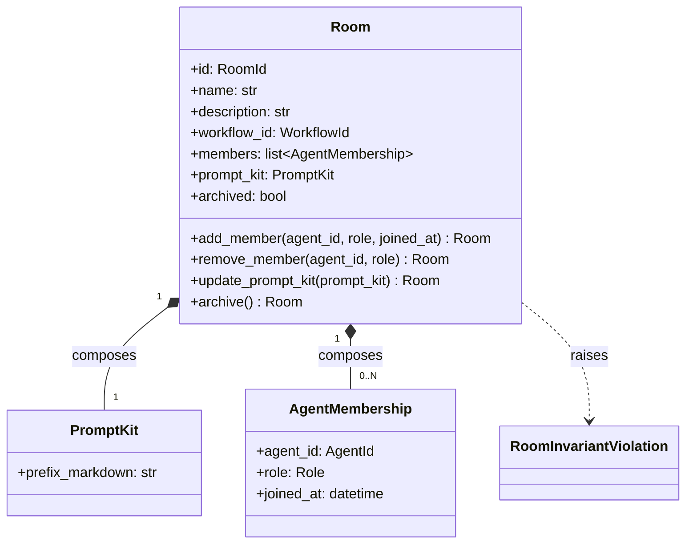
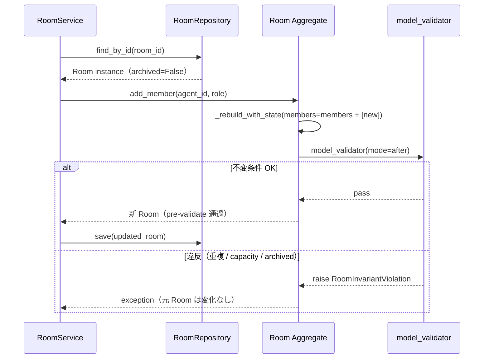
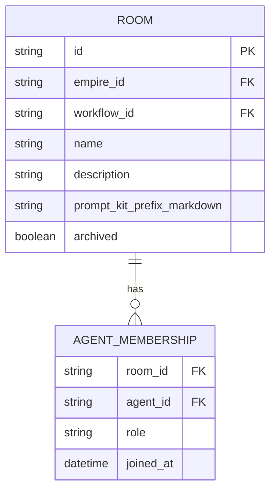

# 基本設計書

> feature: `room`
> 関連: [requirements.md](requirements.md) / [`docs/architecture/domain-model/aggregates.md`](../../architecture/domain-model/aggregates.md) §Room

## 記述ルール（必ず守ること）

基本設計に**疑似コード・サンプル実装（python/ts/sh/yaml 等の言語コードブロック）を書かない**。
ソースコードと二重管理になりメンテナンスコストしか生まない。
必要なのは構造契約（クラス・モジュール・データの関係）であり、実装の細部は [detailed-design.md](detailed-design.md) で凍結する。

## モジュール構成

| 機能 ID | モジュール | ディレクトリ | 責務 |
|--------|----------|------------|------|
| REQ-RM-001〜006 | `Room` Aggregate Root | `backend/src/bakufu/domain/room/room.py` | Room の属性・不変条件・ふるまい |
| REQ-RM-001, 004 | `PromptKit` VO | `backend/src/bakufu/domain/room/value_objects.py` | PromptKit 値オブジェクト（本 feature で属性確定） |
| 共通 | `RoomId` VO | `backend/src/bakufu/domain/value_objects.py`（既存ファイル更新） | RoomRef で先行定義された UUID 型をそのまま流用 |
| REQ-RM-006 | 不変条件 helper | `backend/src/bakufu/domain/room/aggregate_validators.py` | `_validate_name_range` / `_validate_description_length` / `_validate_member_unique` / `_validate_member_capacity` |
| REQ-RM-001 | `RoomInvariantViolation` 例外 | `backend/src/bakufu/domain/exceptions.py`（既存ファイル更新） | webhook auto-mask 強制（agent / workflow と同パターン） |
| 公開 API | re-export | `backend/src/bakufu/domain/room/__init__.py` | `Room` / `PromptKit` / `RoomInvariantViolation` を re-export |

```
ディレクトリ構造（本 feature で追加・変更されるファイル）:

.
├── backend/
│   ├── src/
│   │   └── bakufu/
│   │       └── domain/
│   │           ├── room/                       # 新規ディレクトリ（agent と同パターン）
│   │           │   ├── __init__.py             # 新規: 公開 API re-export
│   │           │   ├── room.py                 # 新規: Room Aggregate Root
│   │           │   ├── value_objects.py        # 新規: PromptKit VO
│   │           │   └── aggregate_validators.py # 新規: _validate_* helper
│   │           ├── value_objects.py            # 既存更新: RoomRef は既存、追記なし
│   │           └── exceptions.py               # 既存更新: RoomInvariantViolation 追加
│   └── tests/
│       └── domain/
│           └── room/
│               ├── __init__.py                 # 新規
│               └── test_room.py                # 新規: ユニットテスト
└── docs/
    ├── architecture/
    │   └── domain-model/
    │       ├── value-objects.md                # 既存更新: PromptKit 属性追記
    │       └── storage.md                      # 既存更新: マスキング適用先に PromptKit.prefix_markdown 追記
    └── features/
        └── room/                               # 本 feature 設計書 4 本
```

## クラス設計（概要）



**凝集のポイント**:
- PromptKit / AgentMembership は frozen VO で構造的等価判定
- Room 自身も frozen（Pydantic v2 `model_config.frozen=True`）
- 状態変更ふるまい（`add_member` / `remove_member` / `update_prompt_kit` / `archive`）は新インスタンスを返す（pre-validate 方式）
- `(agent_id, role)` 重複・capacity 上限・archived terminal は **Aggregate 内部で守る**（構造的不変条件）
- Workflow 参照整合性 / Agent 存在検証 / leader 必須性検査は **application 層責務**（外部知識を要するため）

## 処理フロー

### ユースケース 1: Room 設立（構築）

1. application 層が `EmpireService.establish_room(empire_id, name, description, workflow_id, prompt_kit)` を呼び出す
2. application 層が `RoomRepository.find_by_name(empire_id, name)` で名前重複検査（ヒットしたら `RoomNameAlreadyExistsError`）
3. application 層が `WorkflowRepository.find_by_id(workflow_id)` で Workflow 存在検証（不在なら `WorkflowNotFoundError`）
4. application 層が `Room(id=..., name=..., description=..., workflow_id=..., members=[], prompt_kit=..., archived=False)` を構築
5. Pydantic 型バリデーション → `model_validator(mode='after')` で `_validate_name_range` → `_validate_description_length` → `_validate_member_unique` → `_validate_member_capacity` の順に走行
6. valid なら `RoomRepository.save(room)` で永続化（永続化前に PromptKit.prefix_markdown のマスキング適用）

### ユースケース 2: メンバー追加（add_member）

1. application 層が `RoomService.add_member(room_id, agent_id, role)` を呼び出す
2. application 層が `RoomRepository.find_by_id(room_id)` / `AgentRepository.find_by_id(agent_id)` を取得（不在なら Fail Fast）
3. application 層が Workflow を取得し、`required_role` 集合に LEADER が含まれる Stage が存在する場合、追加後に `role == LEADER` の member が結果として 1 件以上残ることを検査
4. application 層が `room.add_member(agent_id, role, joined_at=now())` を呼ぶ
5. Aggregate 内で `members + [new_membership]` の dict を `_rebuild_with_state` 経由で構築 → `model_validate` で再構築 → 不変条件検査
6. 通過なら新 Room を返却。application 層が `RoomRepository.save(updated_room)`

### ユースケース 3: メンバー削除（remove_member）

1. application 層が `RoomService.remove_member(room_id, agent_id, role)` を呼び出す
2. application 層が `RoomRepository.find_by_id(room_id)` で Room 取得
3. Workflow を取得し、削除後に LEADER 0 件にならないかを検査（leader を要求する Workflow の場合）
4. application 層が `room.remove_member(agent_id, role)` を呼ぶ
5. Aggregate 内で対象 `(agent_id, role)` を除いた dict を構築 → `model_validate` で再構築 → 不変条件検査（不在なら `RoomInvariantViolation(kind='member_not_found')`）
6. 通過なら新 Room を返却

### ユースケース 4: PromptKit 更新（update_prompt_kit）

1. application 層が `RoomService.update_prompt_kit(room_id, prompt_kit)` を呼び出す
2. application 層が `RoomRepository.find_by_id(room_id)` で Room 取得
3. application 層が `room.update_prompt_kit(prompt_kit)` を呼ぶ
4. Aggregate 内で `prompt_kit` を差し替えた dict を構築 → `model_validate` で再構築（archived terminal チェックのみ実質的）
5. 通過なら新 Room を返却。application 層が `RoomRepository.save(updated_room)`（永続化時に prefix_markdown のマスキング適用）

### ユースケース 5: アーカイブ（archive）

1. application 層が `RoomService.archive(room_id)` を呼び出す
2. application 層が `room.archive()` を呼ぶ
3. Aggregate 内で `_rebuild_with_state(archived=True)` で新インスタンスを構築（状態に依らず実行、冪等）
4. 不変条件検査が走り通過時のみ新 Room を返す
5. application 層が `RoomRepository.save(updated_room)`

## シーケンス図



## アーキテクチャへの影響

- `docs/architecture/domain-model.md` への変更: なし（`mermaid classDiagram` の Room は既存）
- `docs/architecture/domain-model/value-objects.md` への変更: **`PromptKit` VO の属性確定（§確定 R1-E）を追記**
- `docs/architecture/domain-model/storage.md` への変更: **§シークレットマスキング規則 §適用先一覧に `Room.prompt_kit.prefix_markdown` を追記**
- `docs/architecture/tech-stack.md` への変更: なし
- 既存 feature への波及: なし。empire / workflow / agent は本 feature を import しない（依存方向は room → agent / workflow / empire ではなく、各 Aggregate 独立）

## 外部連携

該当なし — 理由: domain 層のみのため外部システムへの通信は発生しない。

| 連携先 | 目的 | プロトコル | 認証 | タイムアウト / リトライ |
|-------|------|----------|-----|--------------------|
| 該当なし | — | — | — | — |

## UX 設計

該当なし — 理由: domain 層のため UI は持たない。Room 編成 UI は `feature/room-ui` で扱う。

| シナリオ | 期待される挙動 |
|---------|------------|
| 該当なし | — |

**アクセシビリティ方針**: 該当なし（UI なし）。

## セキュリティ設計

### 脅威モデル

本 feature 範囲では以下の 2 件。詳細な信頼境界は [`docs/architecture/threat-model.md`](../../architecture/threat-model.md)。

| 想定攻撃者 | 攻撃経路 | 保護資産 | 対策 |
|-----------|---------|---------|------|
| **T1: PromptKit.prefix_markdown 経由の secret 漏洩** | UI / API から PromptKit に webhook URL / API key を貼り付け → DB 永続化 → ログ・監査経路へ流出 | OAuth トークン / Discord webhook token / API key | Aggregate 内ではマスキングしない（生入力を保持して UI で読み返す経路を確保）。**永続化前の単一ゲートウェイ**（[`storage.md`](../../architecture/domain-model/storage.md) §シークレットマスキング規則）で適用。本 PR で適用先一覧に PromptKit.prefix_markdown を追記する |
| **T2: PromptKit / Room.name に Discord webhook URL が混入した状態で `RoomInvariantViolation` を raise** | 不正入力で例外発生 → 例外 message / detail に Discord webhook URL がそのまま埋め込まれログ / Discord 通知に流出 | Discord webhook token | `RoomInvariantViolation` の `__init__` で `mask_discord_webhook` + `mask_discord_webhook_in` を `super().__init__` 前に強制適用。agent / workflow と同パターン（多層防御） |

### OWASP Top 10 対応

| # | カテゴリ | 対応状況 |
|---|---------|---------|
| A01 | Broken Access Control | 該当なし（domain 層） |
| A02 | Cryptographic Failures | **適用**: 永続化前マスキング（PromptKit.prefix_markdown）+ 例外 auto-mask（RoomInvariantViolation） |
| A03 | Injection | 該当なし（Pydantic 型強制） |
| A04 | Insecure Design | **適用**: pre-validate 方式 / frozen model / `(agent_id, role)` 重複・capacity 上限・archived terminal の構造的不変条件 |
| A05 | Security Misconfiguration | 該当なし |
| A06 | Vulnerable Components | Pydantic v2 / pyright |
| A07 | Auth Failures | 該当なし |
| A08 | Data Integrity Failures | **適用**: frozen model / pre-validate による不正状態の窓ゼロ化 |
| A09 | Logging Failures | **適用**: `RoomInvariantViolation` の auto-mask により例外ログから webhook URL が漏洩しない |
| A10 | SSRF | 該当なし（外部 URL fetch なし） |

## ER 図

該当なし — 理由: 本 feature は domain 層のみで永続化スキーマは含まない。永続化は `feature/room-repository` で扱う（M2 永続化基盤完了後）。参考の概形:



## エラーハンドリング方針

| 例外種別 | 処理方針 | ユーザーへの通知 |
|---------|---------|----------------|
| `RoomInvariantViolation` | application 層で catch、HTTP API 層で 400 / 422 にマッピング（別 feature） | MSG-RM-001 〜 007 |
| `pydantic.ValidationError` | 構築時の型違反。application 層で catch | MSG-RM-001（汎用） |
| その他 | 握り潰さない、application 層へ伝播 | 汎用エラーメッセージ |
