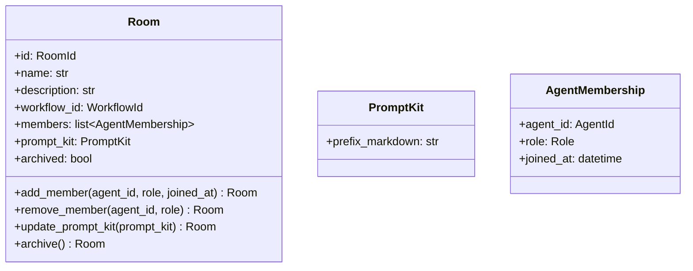

# 詳細設計書

> feature: `room`
> 関連: [basic-design.md](basic-design.md) / [`docs/design/domain-model/aggregates.md`](../../design/domain-model/aggregates.md) §Room

## 記述ルール（必ず守ること）

詳細設計に**疑似コード・サンプル実装（python/ts/sh/yaml 等の言語コードブロック）を書かない**。
ソースコードと二重管理になりメンテナンスコストしか生まない。
必要なのは「構造契約（属性名・型・制約）」と「確定文言（メッセージ文字列）」と「実装の意図」。

## クラス設計（詳細）

### Aggregate Root: Room

| 属性 | 型 | 制約 | 意図 |
|----|----|----|----|
| `id` | `RoomId`（UUIDv4） | 不変 | 一意識別 |
| `name` | `str` | 1〜80 文字（NFC 正規化、前後空白除去後） | 部屋名（"V モデル開発室" 等） |
| `description` | `str` | 0〜500 文字（NFC 正規化、前後空白除去後） | 部屋の用途説明 |
| `workflow_id` | `WorkflowId`（UUIDv4） | 不変、参照のみ | 採用するワークフロー定義 |
| `members` | `list[AgentMembership]` | 0〜50 件、`(agent_id, role)` 重複なし | 採用された Agent と Role の対応 |
| `prompt_kit` | `PromptKit`（VO） | — | 部屋固有のシステムプロンプト前置き |
| `archived` | `bool` | デフォルト False、terminal | アーカイブ状態 |

`model_config`:
- `frozen = True`
- `arbitrary_types_allowed = False`
- `extra = 'forbid'`

**不変条件（model_validator(mode='after')）**:
1. `name` の NFC + strip 適用後の length が 1〜80
2. `description` の NFC + strip 適用後の length が 0〜500
3. `members` の `(agent_id, role)` ペアに重複なし（**同一 `agent_id` の異なる Role は許容**）
4. `len(members) <= 50`
5. `archived == True` の Room に対する変更ふるまい（`add_member` / `remove_member` / `update_prompt_kit`）は terminal violation として `kind='room_archived'` を raise（archive 自身は冪等で実行可）

**不変条件（application 層責務、Aggregate 内では守らない）**:
- 同 Empire 内の他 Room との `name` 衝突なし — `RoomService.create()` が Repository SELECT で判定
- `workflow_id` が指す Workflow の存在 — `RoomService.create()` が `WorkflowRepository.find_by_id` で確認
- `members[*].agent_id` が指す Agent の存在 — `RoomService.add_member()` が `AgentRepository.find_by_id` で確認
- Workflow が leader を要求する場合の LEADER member 必須性 — `RoomService.add_member()` / `RoomService.remove_member()` / `RoomService.create()` が Workflow の `required_role` 集合と突合（§確定 R1-D）

**ふるまい**:
- `add_member(agent_id: AgentId, role: Role, joined_at: datetime) -> Room`: `(agent_id, role)` ペアの新 `AgentMembership` を `members` に append した新 Room を返す
- `remove_member(agent_id: AgentId, role: Role) -> Room`: 対象 `AgentMembership` を削除した新 Room を返す
- `update_prompt_kit(prompt_kit: PromptKit) -> Room`: `prompt_kit` を差し替えた新 Room を返す
- `archive() -> Room`: `archived=True` の**新 Room インスタンス**を返す。既に `archived=True` の Room に対しても同手順を踏み新インスタンスを返す（冪等性は結果状態の同値性で担保、オブジェクト同一性ではない）。詳細は §確定 D

### Value Object: PromptKit

| 属性 | 型 | 制約 |
|----|----|----|
| `prefix_markdown` | `str` | 0〜10000 文字（NFC 正規化のみ、strip しない — Markdown の前後改行を保持） |

`model_config.frozen = True`。`prefix_markdown` の永続化前マスキングは Repository 層で適用（[`storage.md`](../../design/domain-model/storage.md) §シークレットマスキング規則 — 本 PR で適用先一覧に追記）。

**agent の `Persona.prompt_body` と完全に同じ規約**: NFC 正規化のみ適用し、strip は行わない（Markdown の前後改行を保持するため）。長さ判定は NFC 後の `len()` で行う。

### Value Object: AgentMembership（既存、再掲）

| 属性 | 型 | 制約 |
|----|----|----|
| `agent_id` | `AgentId`（UUIDv4） | 既存 Agent を指す |
| `role` | `Role`（enum） | LEADER / DEVELOPER / TESTER / REVIEWER / UX / SECURITY / ASSISTANT / DISCUSSANT / WRITER / SITE_ADMIN |
| `joined_at` | `datetime` | UTC |

[`value-objects.md`](../../design/domain-model/value-objects.md) §AgentMembership で凍結済み。本 feature では再定義せず import のみ。

### Exception: RoomInvariantViolation

| 属性 | 型 | 制約 |
|----|----|----|
| `message` | `str` | MSG-RM-NNN 由来の文言（webhook URL は `<REDACTED:DISCORD_WEBHOOK>` 化済み） |
| `detail` | `dict[str, object]` | 違反の文脈（webhook URL は `mask_discord_webhook_in` で再帰的に伏字化済み） |
| `kind` | `Literal['name_range', 'description_too_long', 'member_duplicate', 'capacity_exceeded', 'member_not_found', 'room_archived']` | 違反種別。**`prompt_kit_too_long` は意図的に含めない** — PromptKit 長さ違反は §確定 I により `pydantic.ValidationError`（MSG-RM-007）として VO 構築段階で raise されるため、`RoomInvariantViolation.kind` に到達するパスが構造的に存在しない（デッドコード排除） |

`Exception` 継承。`domain/exceptions.py` の他の例外（empire / workflow / agent）と統一フォーマット。**`super().__init__` 前に `message` を `mask_discord_webhook` で、`detail` を `mask_discord_webhook_in` で伏字化する**（agent / workflow と同パターン、多層防御）。

## 確定事項（先送り撤廃）

### 確定 A: pre-validate 方式は Pydantic v2 model_validate 経由

`add_member` / `remove_member` / `update_prompt_kit` / `archive` 共通の手順:

1. `self.model_dump(mode='python')` で現状を dict 化
2. dict 内の該当キーを更新（`members` 追加 / 削除 / `prompt_kit` 差し替え / `archived=True` への置換）
3. `Room.model_validate(updated_dict)` を呼ぶ — `model_validator` が走る
4. 失敗時は `ValidationError` を `RoomInvariantViolation` に変換して raise

agent / workflow / empire と同じパターン。`model_copy(update=...)` は採用しない（Pydantic v2 仕様で `validate=False` が既定のため不変条件再検査が走らない）。

### 確定 B: 名前 / description の正規化パイプラインと長さ判定

empire §確定 B / agent §確定 E と完全に同一の正規化パイプラインを Room に適用する。

#### 正規化パイプライン（順序固定）

1. 入力 `raw` を受け取る
2. `normalized = unicodedata.normalize('NFC', raw)` で NFC 正規化
3. `cleaned = normalized.strip()` で前後の ASCII 空白 + Unicode 空白を除去
4. `length = len(cleaned)` で Unicode コードポイント数を計上
5. 範囲判定（`Room.name`: `1 <= length <= 80` / `Room.description`: `0 <= length <= 500`）
6. 通過時のみ属性として `cleaned` を保持

#### 適用範囲

| 属性 | 範囲 | 適用 |
|----|----|----|
| `Room.name` | 1〜80 文字（cleaned 後） | ✓ パイプライン全段 |
| `Room.description` | 0〜500 文字（cleaned 後） | ✓ パイプライン全段（空文字列許容） |
| `PromptKit.prefix_markdown` | 0〜10000 文字 | NFC 正規化のみ適用、**strip は行わない**（Markdown の前後改行を保持するため。agent `Persona.prompt_body` §確定 E と同方針） |

### 確定 C: members の容量上限 50 件

MVP の想定規模（V モデル開発室で 5 名、雑談部屋で 20 名程度）の数倍を上限に設定。`len(members) > 50` で `RoomInvariantViolation(kind='capacity_exceeded')`。Phase 2 で運用実績を見て調整。

### 確定 D: archive の冪等性と返り値

**返り値は常に新 `Room` インスタンス**。冪等性は「結果状態の同値性」（`new.archived == True`）として担保し、**オブジェクト同一性ではない**。agent §確定 D を完全踏襲。

実装手順（状態に依らず固定、`_rebuild_with_state` 経由）:

1. `self.model_dump(mode='python')` で現状を dict 化
2. dict 内の `archived` を `True` に差し替え
3. `Room.model_validate(updated_dict)` で新インスタンスを再構築（`model_validator(mode='after')` が走る）
4. 通過時のみ新 Room を返す

| 入力 Room の状態 | 返り値 | オブジェクト同一性 |
|----|----|----|
| `archived == False` | 新 `Room`（`archived = True`） | 別オブジェクト（`id()` が異なる） |
| `archived == True`（既に archived） | 新 `Room`（`archived = True`、属性は構造的等価） | **別オブジェクト**（`id()` が異なる） |

エラーにしない理由: UI からの誤操作 / API 再送 / リトライで例外を出すと UX が悪い。冪等な操作として扱う。

### 確定 E: archived terminal 違反の検査

`add_member` / `remove_member` / `update_prompt_kit` のいずれが呼ばれても、`self.archived == True` なら `RoomInvariantViolation(kind='room_archived')` を raise（Fail Fast、`_rebuild_with_state` 内に入る前にチェック）。

ただし `archive()` 自身は archived 状態でも通過する（§確定 D の冪等性）。

#### 「Room は terminal で再開なし」と書かない理由

unarchive 経路は Phase 2 で実装する可能性を残す。本 feature 範囲では `archived=True` への単方向遷移のみ実装し、Aggregate に「terminal」と決め打ちのコメントを書かない。Phase 2 で `unarchive()` ふるまいを追加する際、本 §確定 E の terminal 違反検査を緩和すれば良い設計とする。

### 確定 F: `(agent_id, role)` 重複検査と「同一 Agent 兼 複数 Role」の許容

`_validate_member_unique`:

1. `members` を走査し `(m.agent_id, m.role)` のペアを集合化
2. `len(set) < len(members)` なら `RoomInvariantViolation(kind='member_duplicate')` を raise

**同一 `agent_id` の異なる Role の重複追加は許容**する。例: 1 名の Agent が `LEADER` かつ `REVIEWER` を兼任する membership を 2 件持つことは正常状態。

#### 検査対象を `(agent_id, role)` ペアにする理由

- ai-team で「leader 兼 ux」のような兼任は実運用で頻出
- `agent_id` 単独を一意キーにすると兼任が不可能になり、同 Agent を異なる Role で複数回 add する API を設計する必要が生じる（YAGNI 違反）
- AgentMembership.joined_at を Role ごとに持てる構造（ Role に応じた参加時刻が異なる）も維持される

### 確定 G: PromptKit の VO 構造を「単一属性 VO」のまま維持する

`PromptKit` は MVP 時点で `prefix_markdown: str` 単一属性しか持たない。これを `Room.prompt_prefix: str` にフラット化せず VO のまま残す理由:

| 検討事項 | 判断 | 理由 |
|----|----|----|
| Phase 2 で `variables: dict[str, str]` を追加する余地 | 残す | テンプレ変数（`{{room_name}}` 展開等）の自然な追加経路 |
| Phase 2 で `role_specific_prefix: dict[Role, str]` を追加する余地 | 残す | Role に応じた追加プロンプト（leader 向けの方針 等） |
| Phase 2 で `sections: list[Section]` 構造化 | 残す | UI で「方針」「制約」「ガイドライン」をセクションごとに編集する経路 |

VO 化することで、これら拡張が VO 内部で局所化され Room Aggregate の不変条件・ふるまいに影響しない（agent の `Persona` VO と同設計判断）。

### 確定 H: `RoomInvariantViolation` の webhook auto-mask

agent / workflow と同じく `RoomInvariantViolation.__init__` で:

1. `super().__init__` 前に `mask_discord_webhook(message)` を message に適用
2. `detail` に対し `mask_discord_webhook_in(detail)` を再帰的に適用
3. `kind` は enum 文字列のため mask 対象外
4. その後 `super().__init__(masked_message)` を呼ぶ

これにより `RoomInvariantViolation` の `str(exc)` / `exc.detail` のいずれを取り出しても webhook URL が伏字化済みであることを物理的に保証する（多層防御）。

#### `RoomInvariantViolation` で webhook が混入する経路

| 経路 | 例 |
|----|----|
| `PromptKit.prefix_markdown` の長さ違反 | CEO が webhook URL を含む長文をペーストして 10000 文字超過 → 例外 detail に prefix_markdown が含まれる |
| `Room.description` の長さ違反 | description フィールドに webhook URL を貼り付け 500 文字超過 |
| `Room.name` の長さ違反 | name に webhook URL を貼り付け 80 文字超過 |

UI 側でも入力時マスキングを実装するが、本 Aggregate 層では「例外経路で漏れない」ことを単独で保証する責務を持つ。

### 確定 I: 例外型統一規約と「揺れ」の凍結

Norman 指摘 R3「`update_prompt_kit` 例外型の `RoomInvariantViolation` vs `ValidationError` 揺れ」を本節で凍結する。

##### 例外型の責務分離（凍結）

| 違反種別 | 例外型 | 発生レイヤ | 凍結する `kind` 値 |
|---|---|---|---|
| 構造的不変条件違反 | `RoomInvariantViolation` | Aggregate `model_validator(mode='after')` | `name_range` / `description_too_long` / `member_duplicate` / `capacity_exceeded` / `member_not_found` / `room_archived` |
| 型違反 / 必須欠落 | `pydantic.ValidationError` | Pydantic 型バリデーション（`mode='after'` より前） | — |
| VO 構築時違反（PromptKit 長さ等） | `pydantic.ValidationError` | `PromptKit` の `model_validator` | — |
| application 層の参照整合性違反 | `WorkflowNotFoundError` / `AgentNotFoundError` / `EmpireNotFoundError` / `RoomNotFoundError` / `LeaderRequiredError` / `RoomNameAlreadyExistsError` / `AgentNotInEmpireError` | `RoomService` / `EmpireService` | — |

##### `update_prompt_kit` ふるまいの例外型確定

PromptKit VO の長さ違反は **`PromptKit` の `model_validator` で `pydantic.ValidationError`** を raise（VO 構築時に完了）。`Room.update_prompt_kit(prompt_kit)` を呼ぶ時点では既に valid な VO のため、ここで raise されるのは:

| シナリオ | 例外型 | kind |
|---|---|---|
| `archived == True` の Room に `update_prompt_kit` 呼び出し | `RoomInvariantViolation` | `room_archived` |
| `prompt_kit` 引数が None / 型不一致 | `pydantic.ValidationError` | — |
| `prompt_kit` 引数の `prefix_markdown` 長さ違反 | **構築時点で `pydantic.ValidationError`**（`update_prompt_kit` 到達前に発生） | — |

呼び出し側（`RoomService.update_prompt_kit`）は **2 段階で catch**:

1. **VO 構築段階**: `PromptKit(prefix_markdown=...)` → `pydantic.ValidationError` を catch し MSG-RM-007 にマッピング
2. **Aggregate ふるまい段階**: `room.update_prompt_kit(pk)` → `RoomInvariantViolation(kind='room_archived')` を catch し MSG-RM-006 にマッピング

これにより**例外型の揺れがゼロ**で、catch 文が責務に応じて分離される。test-design.md は両段階を独立に検証する（TC-UT-RM-007 系で VO 構築時、TC-UT-RM-013 系で archived terminal）。

##### 「Aggregate 内検査と application 層検査が二重化に見える」の解消

| 検査項目 | Aggregate 内 | application 層 |
|---|---|---|
| `(agent_id, role)` 重複 | ✓（構造的） | ✗ |
| capacity 50 件 | ✓（構造的） | ✗ |
| archived terminal | ✓（構造的） | △（早期 Fail Fast、二重防御） |
| Workflow 参照整合性 | ✗ | ✓（外部知識） |
| Agent 存在 | ✗ | ✓（外部知識） |
| Workflow leader 必須性 | ✗ | ✓（外部知識） |
| Empire 内 name 一意 | ✗ | ✓（外部知識、`EmpireService`） |

「✓ + △」の `archived terminal` のみ二重化される。これは Aggregate 単体での `model_validator` による物理保証（誰が呼んでも違反を検出）と、application 層での早期 Fail Fast（DB アクセス前に return、UX 改善）の**目的が異なる**ため許容する。検査が散在しているのではなく、**多層防御として意図的に重ねている**。

## 設計判断の補足

### なぜ Workflow 参照整合性を Aggregate 内で守らないか

`workflow_id` が指す Workflow の存在は Repository SELECT を要する集合知識。Aggregate 内では「`workflow_id` が UUID 型として valid」までしか守らない。Repository 経由で確認する application 層責務（empire の `archive_room` で `room_id` の存在を Aggregate 内で守るのと対称な分離方針）。

### なぜ leader 必須性を Aggregate 内で守らないか

Workflow の全 Stage の `required_role` 集合知識を要する。Aggregate 単独では観測できない。`RoomService.add_member()` / `RoomService.remove_member()` / `RoomService.create()` の application 層が Workflow と突合する責務（agent の §確定 I `provider_kind` MVP gate と同じ責務分離）。

### なぜ archive を冪等にするか

UI / CLI で「アーカイブ」ボタンを連打したり、API 再送が発生したりするケースに対し、エラーを返すと運用がぎこちない。冪等にすることで操作回数に依らず最終状態が同じになり、UX とリトライ耐性が両立。empire / agent の archive と同方針。

### なぜ `members` を `Dict[AgentId, list[Role]]` にしないか

`AgentMembership.joined_at` を Role ごとに持てる構造（同一 Agent が異なる時刻に異なる Role で参加）を維持するため、list[AgentMembership] の素直な表現を採用。`(agent_id, role)` ペアの一意性は `_validate_member_unique` で守られる。

### なぜ `description` を 500 文字までに制限するか

UI の Room カード表示で 2〜3 行に収まる長さ。長文の方針記述は `PromptKit.prefix_markdown`（10000 文字まで）に分離する責務分担。

## ユーザー向けメッセージの確定文言

### プレフィックス統一

| プレフィックス | 意味 |
|--------------|-----|
| `[FAIL]` | 処理中止を伴う失敗 |
| `[OK]` | 成功完了 |

### MSG 確定文言表

各メッセージは **「失敗内容（What）」+「次に何をすべきか（Next Action）」の 2 行構造**を採用する。Norman 指摘 R2「フィードバック原則」（ユーザーが失敗から復旧する経路を必ず示す）に対応。例外 message は改行（`\n`）区切りで 2 行を保持する。

| ID | 例外型 | 文言（1 行目: failure / 2 行目: next action） |
|----|------|----|
| MSG-RM-001 | `RoomInvariantViolation(kind='name_range')` | `[FAIL] Room name must be 1-80 characters (got {length})` / `Next: Provide a name with 1-80 NFC-normalized characters; trim leading/trailing whitespace.` — `{length}` は §確定 B の正規化パイプライン（NFC + `strip()`）適用後の `len()` 値 |
| MSG-RM-002 | `RoomInvariantViolation(kind='description_too_long')` | `[FAIL] Room description must be 0-500 characters (got {length})` / `Next: Shorten the description to <=500 characters; move long content to PromptKit.prefix_markdown (10000 char limit).` — `{length}` は §確定 B の NFC + strip 適用後 |
| MSG-RM-003 | `RoomInvariantViolation(kind='member_duplicate')` | `[FAIL] Duplicate member: agent_id={agent_id}, role={role}` / `Next: Either skip this add (already a member) or use a different role to add the same agent in another capacity (e.g. leader + reviewer).` |
| MSG-RM-004 | `RoomInvariantViolation(kind='capacity_exceeded')` | `[FAIL] Room members capacity exceeded (got {count}, max 50)` / `Next: Remove unused members (e.g. archived agents) before adding more, or split the work across multiple Rooms.` |
| MSG-RM-005 | `RoomInvariantViolation(kind='member_not_found')` | `[FAIL] Member not found: agent_id={agent_id}, role={role}` / `Next: Verify the (agent_id, role) pair via GET /rooms/{room_id}/members; the agent may have been already removed or never had this role.` |
| MSG-RM-006 | `RoomInvariantViolation(kind='room_archived')` | `[FAIL] Cannot modify archived Room: room_id={room_id}` / `Next: Create a new Room; unarchive is not supported in MVP (Phase 2 will add RoomService.unarchive).` |
| MSG-RM-007 | `pydantic.ValidationError`（`PromptKit` 経由） | `[FAIL] PromptKit.prefix_markdown must be 0-10000 characters (got {length})` / `Next: Trim PromptKit content to <=10000 NFC-normalized characters; for richer prompts use Phase 2 sections (variables / role_specific_prefix / sections).` — `{length}` は §確定 B の通り `prefix_markdown` のみ NFC 正規化後の `len()`（strip は行わない） |

##### 「Next:」行の役割（フィードバック原則）

- **発行レイヤを跨いで一貫**: 例外 message / API レスポンスの `error.next_action` フィールド / UI の Toast 2 行目 / CLI の stderr 2 行目に**同一文言**を流す
- **i18n 入口**: Phase 2 で UI 側 i18n を入れる際、`MSG-RM-NNN.failure` / `MSG-RM-NNN.next` の 2 キー × 言語数で翻訳テーブルが作れる
- **検証可能性**: test-design.md の TC-UT-RM-NNN で `assert "Next:" in str(exc)` を含めることで「hint 必須」を CI で物理保証する

メッセージは ASCII 範囲（プレースホルダ `{...}` は f-string 形式）。日本語化は UI 側 i18n（Phase 2）。本 feature の例外メッセージは英語固定。

## データ構造（永続化キー）

該当なし — 理由: 本 feature は domain 層のみで永続化スキーマは含まない。永続化は `feature/room-repository` で扱う（M2 永続化基盤完了後）。

参考の概形:

| カラム | 型 | 制約 | 意図 |
|-------|----|----|----|
| `rooms.id` | `UUID` | PK | RoomId |
| `rooms.empire_id` | `UUID` | FK to `empires.id` | 所属 Empire |
| `rooms.workflow_id` | `UUID` | FK to `workflows.id` | 採用 Workflow |
| `rooms.name` | `VARCHAR(80)` | NOT NULL, UNIQUE(empire_id, name) | 部屋名（Empire 内一意は DB 制約でも担保） |
| `rooms.description` | `VARCHAR(500)` | NOT NULL DEFAULT '' | 用途説明 |
| `rooms.prompt_kit_prefix_markdown` | `TEXT` | NOT NULL DEFAULT '' | マスキング適用済み（Repository before_insert/before_update） |
| `rooms.archived` | `BOOLEAN` | NOT NULL DEFAULT FALSE | アーカイブ状態 |
| `room_members.room_id` | `UUID` | FK | 所属 Room |
| `room_members.agent_id` | `UUID` | FK | Agent への参照 |
| `room_members.role` | `VARCHAR` | NOT NULL | enum |
| `room_members.joined_at` | `DATETIME` | NOT NULL | UTC |
| `room_members` UNIQUE | `(room_id, agent_id, role)` | — | DB 制約でも `(agent_id, role)` 一意を担保 |

## API エンドポイント詳細

該当なし — 理由: 本 feature は domain 層のみ。API は `feature/http-api` で凍結する。

## 出典・参考

- [Pydantic v2 — model_validator / model_validate](https://docs.pydantic.dev/latest/concepts/validators/) — pre-validate 方式の実装根拠
- [Pydantic v2 — frozen models](https://docs.pydantic.dev/latest/concepts/models/) — 不変モデルの挙動
- [Unicode Standard Annex #15: Unicode Normalization Forms](https://unicode.org/reports/tr15/) — NFC 正規化の仕様根拠
- [`docs/design/domain-model/aggregates.md`](../../design/domain-model/aggregates.md) — Room 凍結済み設計
- [`docs/design/domain-model/storage.md`](../../design/domain-model/storage.md) — シークレットマスキング規則（`PromptKit.prefix_markdown` の Repository 永続化時に適用）
- [`docs/design/threat-model.md`](../../design/threat-model.md) — A02 / A04 / A09 対応根拠
- [`docs/features/agent/detailed-design.md`](../agent/detailed-design.md) §確定 D / E — archive 冪等性 + 名前正規化パイプラインの先例
- [`docs/features/empire/detailed-design.md`](../empire/detailed-design.md) §確定 B — 名前正規化パイプラインの最初の凍結
