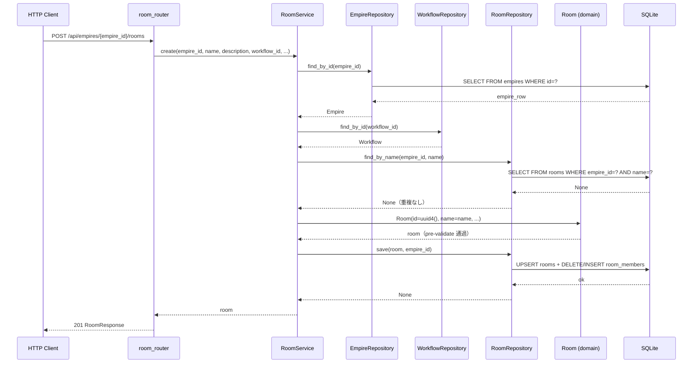

# 基本設計書

> feature: `room` / sub-feature: `http-api`
> 関連 Issue: [#57 feat(room-http-api): Room + Agent assignment HTTP API (M3)](https://github.com/bakufu-dev/bakufu/issues/57)
> 関連: [`../feature-spec.md`](../feature-spec.md) / [`../domain/basic-design.md`](../domain/basic-design.md) / [`../repository/basic-design.md`](../repository/basic-design.md) / [`../../http-api-foundation/http-api/basic-design.md`](../../http-api-foundation/http-api/basic-design.md)
> 凍結済み設計参照: [`docs/design/architecture.md §interfaces レイヤー詳細`](../../../design/architecture.md) / [`docs/design/threat-model.md`](../../../design/threat-model.md)

## 記述ルール（必ず守ること）

基本設計に**疑似コード・サンプル実装（python/ts/sh/yaml 等の言語コードブロック）を書かない**。
ソースコードと二重管理になりメンテナンスコストしか生まない。
必要なのは構造契約（クラス・モジュール・データの関係）であり、実装の細部は [detailed-design.md](detailed-design.md) で凍結する。

## モジュール構成

本 sub-feature で追加・変更するモジュール一覧。

| 機能 ID | モジュール | ディレクトリ | 責務 |
|--------|----------|------------|------|
| REQ-RM-HTTP-001〜010 | `room_router` | `backend/src/bakufu/interfaces/http/routers/rooms.py` | Room CRUD + Agent 割り当て/解除 + Role オーバーライド CRUD エンドポイント（10 本）|
| REQ-RM-HTTP-001〜007 | `RoomService` | `backend/src/bakufu/application/services/room_service.py` | 全 CRUD メソッド + `assign_agent` に `custom_refs` パラメータ追加・マッチング検証呼び出しを統合 |
| REQ-RM-HTTP-006（内部）| `RoomMatchingService` | `backend/src/bakufu/application/services/room_matching_service.py`（新規）| マッチング検証ロジック（`validate_coverage` / `resolve_effective_refs`）。`RoomService.assign_agent` から内部呼び出し。[`../../deliverable-template/room-matching/basic-design.md`](../../deliverable-template/room-matching/basic-design.md) 参照 |
| REQ-RM-HTTP-008〜010 | `RoomRoleOverrideService` | `backend/src/bakufu/application/services/room_role_override_service.py`（新規）| オーバーライド CRUD（`upsert_override` / `delete_override` / `find_overrides`）。[`../../deliverable-template/room-matching/basic-design.md`](../../deliverable-template/room-matching/basic-design.md) 参照 |
| REQ-RM-HTTP-001〜010 | `RoomSchemas` | `backend/src/bakufu/interfaces/http/schemas/room.py` | Pydantic v2 リクエスト / レスポンスモデル。`AgentAssignRequest` に `custom_refs` 追加、`RoomRoleOverrideRequest` / `RoomRoleOverrideResponse` / `RoomRoleOverrideListResponse` を追加 |
| 横断 | `room 例外ハンドラ群` | `backend/src/bakufu/interfaces/http/error_handlers/room.py`（既存追記）| `RoomDeliverableMatchingError` → `ErrorResponse(code="deliverable_matching_failed", detail.missing=[...])` 422 変換を追加 |
| REQ-RM-HTTP-002 | `RoomRepository.find_all_by_empire` 拡張 | `backend/src/bakufu/application/ports/room_repository.py`（既存）| `find_all_by_empire(empire_id) → list[Room]` メソッド（確定済み）|
| REQ-RM-HTTP-002 | `SqliteRoomRepository.find_all_by_empire` 実装 | `backend/src/bakufu/infrastructure/persistence/sqlite/repositories/room_repository.py`（既存）| `SELECT * FROM rooms WHERE empire_id=?`（確定済み）|

```
本 sub-feature で追加・変更されるファイル:

backend/
└── src/bakufu/
    ├── application/
    │   ├── ports/
    │   │   └── room_repository.py              # 既存追記: find_all_by_empire() 追加
    │   ├── exceptions/
    │   │   └── room_exceptions.py              # 新規: RoomNotFoundError / RoomNameAlreadyExistsError / RoomArchivedError / WorkflowNotFoundError / AgentNotFoundError
    │   └── services/
    │       └── room_service.py                 # 既存追記: create / find_all_by_empire / find_by_id / update / archive / assign_agent / unassign_agent
    ├── infrastructure/persistence/sqlite/repositories/
    │   └── room_repository.py                  # 既存追記: find_all_by_empire() 実装
    └── interfaces/http/
        ├── error_handlers.py                   # 既存追記: room 例外ハンドラ群
        ├── routers/
        │   └── rooms.py                        # 新規: 7 エンドポイント
        └── schemas/
            └── room.py                         # 新規: RoomCreate / RoomUpdate / AgentAssignRequest / RoomResponse / RoomListResponse
```

## モジュール契約（機能要件）

本 sub-feature が提供するモジュールの入出力契約を凍結する。各 REQ-RM-HTTP-NNN は親 [`../feature-spec.md §5`](../feature-spec.md) ユースケース UC-RM-NNN と 1:1 または N:1 で対応する（孤児要件を作らない）。

### REQ-RM-HTTP-001: Room 作成（POST /api/empires/{empire_id}/rooms）

| 項目 | 内容 |
|---|---|
| 入力 | パスパラメータ `empire_id: UUID` / リクエスト Body `RoomCreate(name: str, description: str, workflow_id: UUID, prompt_kit_prefix_markdown: str)`（description・prompt_kit_prefix_markdown は空文字デフォルト）|
| 処理 | `RoomService.create(empire_id, name, description, workflow_id, prompt_kit_prefix_markdown)` → 1) Empire 存在確認（不在 → `EmpireNotFoundError` 404）2) Workflow 存在確認（不在 → `WorkflowNotFoundError` 404）3) 同 Empire 内 name 重複確認（`find_by_name`、重複 → `RoomNameAlreadyExistsError` 409）4) `Room(...)` 構築（R1-1/R1-2/R1-3/R1-4 検査）→ 5) `RoomRepository.save(room, empire_id)` |
| 出力 | HTTP 201, `RoomResponse`（id / name / description / workflow_id / members / prompt_kit_prefix_markdown / archived）|
| エラー時 | Empire 不在 → 404 / Workflow 不在 → 404 / name 重複 → 409 (MSG-RM-HTTP-001) / name 範囲違反 → 422 / 不正 UUID → 422 |

### REQ-RM-HTTP-002: Room 一覧取得（GET /api/empires/{empire_id}/rooms）

| 項目 | 内容 |
|---|---|
| 入力 | パスパラメータ `empire_id: UUID` |
| 処理 | `RoomService.find_all_by_empire(empire_id)` → Empire 存在確認 → `RoomRepository.find_all_by_empire(empire_id)` で Empire スコープ全件取得 |
| 出力 | HTTP 200, `RoomListResponse(items: list[RoomResponse], total: int)`（空リストも 200 で返す）|
| エラー時 | Empire 不在 → 404 / 不正 UUID → 422 |

### REQ-RM-HTTP-003: Room 単件取得（GET /api/rooms/{room_id}）

| 項目 | 内容 |
|---|---|
| 入力 | パスパラメータ `room_id: UUID` |
| 処理 | `RoomService.find_by_id(room_id)` → `RoomRepository.find_by_id(room_id)` → 不在 → `RoomNotFoundError` |
| 出力 | HTTP 200, `RoomResponse` |
| エラー時 | 不在 → 404 (MSG-RM-HTTP-002) / 不正 UUID → 422 |

### REQ-RM-HTTP-004: Room 更新（PATCH /api/rooms/{room_id}）

| 項目 | 内容 |
|---|---|
| 入力 | パスパラメータ `room_id: UUID` + `RoomUpdate(name: str \| None, description: str \| None, prompt_kit_prefix_markdown: str \| None)`（None は変更なし）|
| 処理 | `RoomService.update(room_id, name, description, prompt_kit_prefix_markdown)` → 1) `find_by_id` → 不在 → 404 / archived → 409 2) 変更フィールドのみ差し替えた `Room(...)` 再構築（pre-validate）3) `RoomRepository.save(updated_room, empire_id)` |
| 出力 | HTTP 200, 更新済み `RoomResponse` |
| エラー時 | 不在 → 404 / アーカイブ済み → 409 (MSG-RM-HTTP-003) / name 範囲違反 → 422 / 不正 UUID → 422 |

### REQ-RM-HTTP-005: Room アーカイブ（DELETE /api/rooms/{room_id}）

| 項目 | 内容 |
|---|---|
| 入力 | パスパラメータ `room_id: UUID` |
| 処理 | `RoomService.archive(room_id)` → `find_by_id` → `room.archive()` → `RoomRepository.save(archived_room, empire_id)` |
| 出力 | HTTP 204 No Content |
| エラー時 | 不在 → 404 (MSG-RM-HTTP-002) / 不正 UUID → 422 |

### REQ-RM-HTTP-006: Agent 割り当て（POST /api/rooms/{room_id}/agents）

| 項目 | 内容 |
|---|---|
| 入力 | パスパラメータ `room_id: UUID` + リクエスト Body `AgentAssignRequest(agent_id: UUID, role: str, custom_refs: list[DeliverableTemplateRefCreate] \| None = None)` |
| 処理 | `RoomService.assign_agent(room_id, agent_id, role, custom_refs)` → **`async with session.begin():` ブロック内**で以下を一括実行: 1) Room 存在確認・archived 確認 2) Agent 存在確認（不在 → `AgentNotFoundError` 404）3) `empire_id` 取得（`find_empire_id_by_room_id`）4) Workflow 取得（`workflow_repo.find_by_id(room.workflow_id)`）5) `RoomMatchingService.resolve_effective_refs(room_id, empire_id, role, custom_refs)` で有効 refs 決定（優先順位: custom_refs → RoomRoleOverride → RoleProfile → 空）6) `missing = RoomMatchingService.validate_coverage(workflow, effective_refs)` → `if missing: raise RoomDeliverableMatchingError(room_id, role, missing)` 7) `room.add_member(membership)` （`(agent_id, role)` 重複 → `RoomInvariantViolation` 422 / capacity 超過 → 422）8) `RoomRepository.save(updated_room, empire_id)` + `if custom_refs is not None: RoomRoleOverrideRepository.save(override)` を同一トランザクションで実行。全 async I/O を単一 `begin()` に包み BUG-001（autobegin 競合）を防止する |
| 出力 | HTTP 201, 更新済み `RoomResponse` |
| エラー時 | Room 不在 → 404 / Room アーカイブ済み → 409 (MSG-RM-HTTP-003) / Agent 不在 → 404 (MSG-RM-HTTP-004) / マッチング失敗 → 422 (MSG-RM-HTTP-008) / `(agent_id, role)` 重複 → 422 / capacity 超過 → 422 / 不正 UUID → 422 |
| 親 spec 参照 | UC-RM-013, UC-RM-015 |

### REQ-RM-HTTP-007: Agent 割り当て解除（DELETE /api/rooms/{room_id}/agents/{agent_id}/roles/{role}）

| 項目 | 内容 |
|---|---|
| 入力 | パスパラメータ `room_id: UUID` / `agent_id: UUID` / `role: str`（Role enum 値。同一 agent_id の複数 role を区別するため、パスで一意識別）|
| 処理 | `RoomService.unassign_agent(room_id, agent_id, role)` → 1) Room 存在確認・archived 確認 2) `room.remove_member(agent_id, role)` （不在 → `RoomInvariantViolation(kind='member_not_found')` 404）3) `RoomRepository.save(updated_room, empire_id)` |
| 出力 | HTTP 204 No Content |
| エラー時 | Room 不在 → 404 (MSG-RM-HTTP-002) / Room アーカイブ済み → 409 (MSG-RM-HTTP-003) / membership 不在 → 404 (MSG-RM-HTTP-005) / 不正 UUID → 422 |

### REQ-RM-HTTP-008: Room レベル RoleProfile オーバーライド設定（PUT /api/rooms/{room_id}/role-overrides/{role}）

| 項目 | 内容 |
|---|---|
| 入力 | パスパラメータ `room_id: UUID` / `role: str`（Role enum 値） + リクエスト Body `RoomRoleOverrideRequest(deliverable_template_refs: list[DeliverableTemplateRefCreate])` |
| 処理 | `RoomRoleOverrideService.upsert_override(room_id, role, refs)` → Room 存在確認 → archived 確認 → UPSERT |
| 出力 | HTTP 200, `RoomRoleOverrideResponse(room_id, role, deliverable_template_refs)` |
| エラー時 | Room 不在 → 404 / アーカイブ済み → 409 / 不正 UUID → 422 / 不正 role 文字列 → 422 / validation_error（`InvalidRoleError` 経由）|
| 親 spec 参照 | UC-RM-016 |

### REQ-RM-HTTP-009: Room レベル RoleProfile オーバーライド削除（DELETE /api/rooms/{room_id}/role-overrides/{role}）

| 項目 | 内容 |
|---|---|
| 入力 | パスパラメータ `room_id: UUID` / `role: str` |
| 処理 | `RoomRoleOverrideService.delete_override(room_id, role)` → Room 存在確認 → delete（不在は no-op） |
| 出力 | HTTP 204 No Content |
| エラー時 | Room 不在 → 404 / アーカイブ済み → 409 / 不正 UUID → 422 / 不正 role 文字列 → 422 / validation_error（`InvalidRoleError` 経由）|
| 親 spec 参照 | UC-RM-016 |

### REQ-RM-HTTP-010: Room レベル RoleProfile オーバーライド一覧取得（GET /api/rooms/{room_id}/role-overrides）

| 項目 | 内容 |
|---|---|
| 入力 | パスパラメータ `room_id: UUID` |
| 処理 | `RoomRoleOverrideService.find_overrides(room_id)` → Room 存在確認 → 全件取得（ORDER BY role ASC）|
| 出力 | HTTP 200, `RoomRoleOverrideListResponse(items: list[RoomRoleOverrideResponse], total: int)` |
| エラー時 | Room 不在 → 404 / 不正 UUID → 422 |
| 親 spec 参照 | UC-RM-017 |

## ユーザー向けメッセージ一覧

確定文言は [`detailed-design.md §MSG 確定文言表`](detailed-design.md) で凍結する。

| ID | 種別 | 条件 | HTTP ステータス |
|---|---|---|---|
| MSG-RM-HTTP-001 | エラー（競合）| 同 Empire 内で同名 Room が既に存在する（R1-8 違反）| 409 |
| MSG-RM-HTTP-002 | エラー（不在）| Room が見つからない | 404 |
| MSG-RM-HTTP-003 | エラー（競合）| アーカイブ済み Room への更新 / Agent 操作（R1-5 違反）| 409 |
| MSG-RM-HTTP-004 | エラー（不在）| Agent が見つからない | 404 |
| MSG-RM-HTTP-005 | エラー（不在）| 指定した membership が Room に存在しない | 404 |
| MSG-RM-HTTP-006 | エラー（不在）| Workflow が見つからない | 404 |
| MSG-RM-HTTP-007 | エラー（検証）| `RoomInvariantViolation` の業務ルール違反本文 | 422 |
| MSG-RM-HTTP-008 | エラー（検証）| DeliverableTemplate カバレッジ不足（R1-11 違反）。`error.detail.missing` に不足 Stage / template を詳細列挙 | 422 |

## 依存関係

| 区分 | 依存 | バージョン方針 | 備考 |
|---|---|---|---|
| ランタイム | Python 3.12+ | pyproject.toml | 既存 |
| HTTP フレームワーク | FastAPI / Pydantic v2 / httpx | pyproject.toml | http-api-foundation で確定済み |
| DI パターン | `get_session()` / `get_room_service()` / `get_room_matching_service()` / `get_room_role_override_service()` | http-api-foundation 確定E | `dependencies.py` に各 factory を追記（`RoomMatchingService` / `RoomRoleOverrideService` は Issue #120 で追加）|
| application 例外 | `RoomNotFoundError` / `RoomNameAlreadyExistsError` / `RoomArchivedError` / `WorkflowNotFoundError` / `AgentNotFoundError` / `RoomDeliverableMatchingError` | #57 + #120 で定義 | `application/exceptions/room_exceptions.py`（#120 で `RoomDeliverableMatchingError` 追記）|
| room-matching | `RoomMatchingService` / `RoomRoleOverrideService` / `RoomRoleOverrideRepository` / `RoomRoleOverride` VO | Issue #120 で新規追加 | [`deliverable-template/room-matching/basic-design.md`](../../deliverable-template/room-matching/basic-design.md) 参照 |
| domain | `Room` / `RoomId` / `RoomInvariantViolation` / `AgentMembership` / `PromptKit` / `Role` | M1 確定 | room domain sub-feature（Issue #18）|
| repository | `RoomRepository` Protocol / `SqliteRoomRepository` | M2 確定 + 本 PR で `find_all_by_empire` 追記 | room repository sub-feature（Issue #33）|
| 基盤 | http-api-foundation（ErrorResponse / lifespan / CSRF / CORS）| M3-A 確定（Issue #55）| 全 error handler / app.state.session_factory を引き継ぐ |
| empire 参照 | `EmpireRepository.find_by_id`（Empire 存在確認）/ `EmpireNotFoundError` | empire http-api（Issue #56）確定 | Empire 不在時 404 を返すため |

## クラス設計（概要）

```mermaid
classDiagram
    class RoomRouter {
        <<FastAPI APIRouter>>
        +POST /api/empires/{empire_id}/rooms
        +GET /api/empires/{empire_id}/rooms
        +GET /api/rooms/{room_id}
        +PATCH /api/rooms/{room_id}
        +DELETE /api/rooms/{room_id}
        +POST /api/rooms/{room_id}/agents
        +DELETE /api/rooms/{room_id}/agents/{agent_id}/roles/{role}
        +PUT /api/rooms/{room_id}/role-overrides/{role}
        +DELETE /api/rooms/{room_id}/role-overrides/{role}
        +GET /api/rooms/{room_id}/role-overrides
    }
    class RoomService {
        -_room_repo: RoomRepository
        -_empire_repo: EmpireRepository
        -_workflow_repo: WorkflowRepository
        -_agent_repo: AgentRepository
        -_matching_svc: RoomMatchingService
        -_override_repo: RoomRoleOverrideRepository
        +__init__(room_repo, empire_repo, workflow_repo, agent_repo, matching_svc, override_repo)
        +create(empire_id, name, description, workflow_id, prompt_kit_prefix_markdown) Room
        +find_all_by_empire(empire_id) list~Room~
        +find_by_id(room_id) Room
        +update(room_id, name, description, prompt_kit_prefix_markdown) Room
        +archive(room_id) None
        +assign_agent(room_id, agent_id, role, custom_refs: tuple~DeliverableTemplateRef~ | None) Room
        +unassign_agent(room_id, agent_id, role) None
    }
    class RoomRepository {
        <<Protocol>>
        +find_by_id(room_id) Room | None
        +find_by_name(empire_id, name) Room | None
        +find_all_by_empire(empire_id) list~Room~
        +count() int
        +save(room, empire_id) None
    }
    class RoomCreate {
        <<Pydantic BaseModel>>
        +name: str
        +description: str
        +workflow_id: UUID
        +prompt_kit_prefix_markdown: str
    }
    class RoomUpdate {
        <<Pydantic BaseModel>>
        +name: str | None
        +description: str | None
        +prompt_kit_prefix_markdown: str | None
    }
    class AgentAssignRequest {
        <<Pydantic BaseModel>>
        +agent_id: UUID
        +role: str
        +custom_refs: list~DeliverableTemplateRefCreate~ | None
    }
    class RoomRoleOverrideRequest {
        <<Pydantic BaseModel>>
        +deliverable_template_refs: list~DeliverableTemplateRefCreate~
    }
    class RoomRoleOverrideResponse {
        <<Pydantic BaseModel>>
        +room_id: str
        +role: str
        +deliverable_template_refs: list~DeliverableTemplateRefResponse~
    }
    class RoomRoleOverrideListResponse {
        <<Pydantic BaseModel>>
        +items: list~RoomRoleOverrideResponse~
        +total: int
    }
    class RoomResponse {
        <<Pydantic BaseModel>>
        +id: str
        +name: str
        +description: str
        +workflow_id: str
        +members: list~MemberResponse~
        +prompt_kit_prefix_markdown: str
        +archived: bool
    }
    class RoomListResponse {
        <<Pydantic BaseModel>>
        +items: list~RoomResponse~
        +total: int
    }
    class MemberResponse {
        <<Pydantic BaseModel>>
        +agent_id: str
        +role: str
        +joined_at: str
    }

    RoomRouter --> RoomService : uses (DI)
    RoomRouter --> RoomRoleOverrideService : uses (DI, override endpoints)
    RoomService --> RoomRepository : uses (Port)
    RoomService --> RoomMatchingService : uses (matching validation, internal)
    RoomRouter ..> RoomCreate : deserializes
    RoomRouter ..> RoomUpdate : deserializes
    RoomRouter ..> AgentAssignRequest : deserializes
    RoomRouter ..> RoomRoleOverrideRequest : deserializes
    RoomRouter ..> RoomResponse : serializes
    RoomRouter ..> RoomListResponse : serializes
```

## 処理フロー

### ユースケース 1: Room 作成（POST /api/empires/{empire_id}/rooms）

1. Router が `empire_id: UUID` をパスパラメータとして受け取る（不正形式 → 422、業務ルール R1-10）
2. Router が `RoomCreate` を Pydantic でデシリアライズ（422 on 失敗）
3. `get_room_service()` DI で `RoomService` を取得
4. `RoomService.create(empire_id, name, description, workflow_id, prompt_kit_prefix_markdown)` 呼び出し
5. Empire 存在確認（`EmpireRepository.find_by_id` → None → `EmpireNotFoundError` → 404）
6. Workflow 存在確認（`WorkflowRepository.find_by_id` → None → `WorkflowNotFoundError` → 404）
7. Empire スコープ name 重複確認（`RoomRepository.find_by_name(empire_id, name)` → 存在 → `RoomNameAlreadyExistsError` → 409）
8. `Room(id=uuid4(), name=name, ...)` 構築（R1-1〜R1-4 失敗時 `RoomInvariantViolation` → 422）
9. `async with session.begin()`: `RoomRepository.save(room, empire_id)` → `MaskedText` で prefix_markdown マスキング適用（業務ルール R1-9）
10. HTTP 201, `RoomResponse` を返す

### ユースケース 2: Room 一覧取得（GET /api/empires/{empire_id}/rooms）

1. `empire_id: UUID` パスパラメータ取得（不正形式 → 422）
2. Empire 存在確認（不在 → 404）
3. `RoomService.find_all_by_empire(empire_id)` → `RoomRepository.find_all_by_empire(empire_id)`
4. `list[Room]` を `list[RoomResponse]` にマップ
5. `RoomListResponse(items=..., total=len(...))` で HTTP 200

### ユースケース 3: Room 単件取得（GET /api/rooms/{room_id}）

1. `room_id: UUID` 取得（不正形式 → 422）
2. `RoomService.find_by_id(room_id)` → None → 404
3. `RoomResponse` で HTTP 200

### ユースケース 4: Room 更新（PATCH /api/rooms/{room_id}）

1. `room_id: UUID` + `RoomUpdate` 取得
2. `RoomService.update(room_id, ...)` → `find_by_id` → None → 404 / archived → 409
3. 変更フィールドのみ差し替えた `Room(...)` 再構築（pre-validate、R1-1/R1-2 検査）
4. `async with session.begin()`: `RoomRepository.save(updated_room, empire_id)`
5. `RoomResponse` で HTTP 200

### ユースケース 5: Room アーカイブ（DELETE /api/rooms/{room_id}）

1. `room_id: UUID` 取得（不正形式 → 422）
2. `RoomService.archive(room_id)` → `find_by_id` → None → 404
3. `room.archive()` → `archived=True` の新 Room（冪等）
4. `async with session.begin()`: `RoomRepository.save(archived_room, empire_id)`
5. HTTP 204 No Content

### ユースケース 6: Agent 割り当て（POST /api/rooms/{room_id}/agents）

1. `room_id: UUID` + `AgentAssignRequest` 取得（不正形式 → 422）
2. `RoomService.assign_agent(room_id, agent_id, role)` 呼び出し
3. Room 存在確認（不在 → 404）/ archived 確認（archived → 409）
4. Agent 存在確認（`AgentRepository.find_by_id` → None → `AgentNotFoundError` → 404）
5. `room.add_member(agent_id, role, joined_at=now())` → `RoomInvariantViolation` 発生時 → 422
6. `async with session.begin()`: `RoomRepository.save(updated_room, empire_id)`
7. HTTP 201, 更新済み `RoomResponse`

### ユースケース 7: Agent 割り当て解除（DELETE /api/rooms/{room_id}/agents/{agent_id}/roles/{role}）

1. `room_id: UUID` / `agent_id: UUID` / `role: str` パスパラメータ取得（不正 UUID → 422）
2. `RoomService.unassign_agent(room_id, agent_id, role)` 呼び出し
3. Room 存在確認（不在 → 404）/ archived 確認（archived → 409）
4. `room.remove_member(agent_id, role)` → `RoomInvariantViolation(kind='member_not_found')` → 404
5. `async with session.begin()`: `RoomRepository.save(updated_room, empire_id)`
6. HTTP 204 No Content

## シーケンス図



## アーキテクチャへの影響

- **`docs/design/architecture.md`**: 変更なし（http-api-foundation で routers/ の配置はすでに明示済み）
- **`docs/design/tech-stack.md`**: 変更なし
- **`room/repository/basic-design.md`**: `find_all_by_empire()` メソッド追加（本 PR で実施、既存 Protocol に追記）
- 既存 feature への波及: `error_handlers.py` に room 専用ハンドラを追記するが、既存ハンドラ（HTTPException / ValidationError / generic / empire 専用）は変更しない

## 外部連携

| 連携先 | 目的 | プロトコル | 認証 | タイムアウト / リトライ |
|-------|------|----------|-----|---------------------|
| 該当なし | — | — | — | — |

外部連携なし — 理由: Room HTTP API は SQLite ローカル永続化のみで完結し、外部 API 呼び出しを行わない。

## UX 設計

| シナリオ | 期待される挙動 |
|---------|------------|
| Empire に Room がゼロで GET /api/empires/{empire_id}/rooms | `{"items": [], "total": 0}` で 200（エラーではない）|
| 同名 Room を同 Empire に POST | 409 `{"error": {"code": "conflict", "message": "Room name already exists in this empire."}}` |
| アーカイブ済み Room に PATCH | 409 `{"error": {"code": "conflict", "message": "Room is archived and cannot be modified."}}` |
| 不正 UUID でパスパラメータ | 422 FastAPI validation_error |
| 存在しない Agent を割り当て | 404 `{"error": {"code": "not_found", "message": "Agent not found."}}` |
| 同一 (agent_id, role) を二重割り当て | 422 `RoomInvariantViolation` の業務ルール違反本文 |
| DELETE /api/rooms/{room_id}/agents/{agent_id}/roles/LEADER で割り当て解除 | 204 No Content（role がパスで明示され認知負荷を最小化）|

**アクセシビリティ方針**: 該当なし（HTTP API のため）。

## セキュリティ設計

### 脅威モデル

| 想定攻撃者 | 攻撃経路 | 保護資産 | 対策 |
|-----------|---------|---------|------|
| **T1: CSRF 経由での Room 改ざん** | ブラウザ経由の不正 POST / PATCH / DELETE | Room の状態整合性 | http-api-foundation 確定D: CSRF Origin 検証ミドルウェア（Origin ヘッダ不一致なら 403）|
| **T2: スタックトレース露出** | 500 エラーレスポンスへのスタックトレース混入 | 内部実装情報 | http-api-foundation 確定A: generic_exception_handler が `internal_error` のみを返す |
| **T3: 不正 UUID によるパスインジェクション** | `empire_id` / `room_id` / `agent_id` に不正値を注入 | DB 整合性 | FastAPI `UUID` 型強制（422 on 不正形式、業務ルール R1-10）+ SQLAlchemy ORM |
| **T4: PromptKit 経由の secret 流出** | POST / PATCH で `prompt_kit_prefix_markdown` に webhook URL を含めて永続化 | Discord webhook token / API key | `MaskedText` TypeDecorator（room §確定 G 実適用済み）で永続化前マスキング。レスポンス返却時は masked 文字列のまま |

### OWASP Top 10 対応

| # | カテゴリ | 対応状況 |
|---|---------|---------|
| A01 | Broken Access Control | loopback バインド（`127.0.0.1:8000`）+ CSRF Origin 検証（http-api-foundation 確定D）|
| A02 | Cryptographic Failures | **該当**: `prompt_kit_prefix_markdown` は `MaskedText` 経由で永続化前マスキング（T4 対策）|
| A03 | Injection | SQLAlchemy ORM 経由（raw SQL 不使用）|
| A04 | Insecure Design | domain の pre-validate + frozen Room で不整合状態を物理的に防止 |
| A05 | Security Misconfiguration | http-api-foundation の lifespan / CORS 設定を引き継ぐ |
| A06 | Vulnerable Components | 依存 CVE は CI `pip-audit` で監視 |
| A07 | Auth Failures | MVP 設計上 意図的な認証なし（loopback バインドで代替）|
| A08 | Data Integrity Failures | delete-then-insert + UoW（repository sub-feature 確定済み）|
| A09 | Logging Failures | 内部エラーは application 層でログ、スタックトレースはレスポンスに含めない |
| A10 | SSRF | 該当なし（外部 URL fetch なし）|

## ER 図

本 sub-feature は DB スキーマを変更しない。ER は [`../repository/basic-design.md §ER 図`](../repository/basic-design.md) を参照。

## エラーハンドリング方針

| 例外種別 | 発生箇所 | 処理方針 | HTTP ステータス |
|---------|---------|---------|---------------|
| `RoomNotFoundError` | `RoomService.find_by_id`（None 時）| `error_handlers.py` 専用ハンドラ → HTTP 404 | 404 |
| `RoomNameAlreadyExistsError` | `RoomService.create`（name 重複時）| 専用ハンドラ → HTTP 409 (MSG-RM-HTTP-001) | 409 |
| `RoomArchivedError` | `RoomService.update` / `assign_agent` / `unassign_agent`（archived 時）| 専用ハンドラ → HTTP 409 (MSG-RM-HTTP-003) | 409 |
| `WorkflowNotFoundError` | `RoomService.create`（Workflow 不在時）| 専用ハンドラ → HTTP 404 (MSG-RM-HTTP-006) | 404 |
| `AgentNotFoundError` | `RoomService.assign_agent`（Agent 不在時）| 専用ハンドラ → HTTP 404 (MSG-RM-HTTP-004) | 404 |
| `RoomInvariantViolation(kind='member_not_found')` | `room.remove_member`（不在 membership）| 専用ハンドラで `kind` を判定 → HTTP 404 (MSG-RM-HTTP-005) | 404 |
| `RoomInvariantViolation`（その他）| domain Room（名前範囲 / 重複 / 容量違反）| 専用ハンドラ → HTTP 422 (MSG-RM-HTTP-007) | 422 |
| `RequestValidationError` | FastAPI Pydantic（入力形式不正）| http-api-foundation の既存ハンドラ | 422 |
| その他例外 | どこでも | http-api-foundation generic_exception_handler | 500（スタックトレース非露出）|

Router 内に `try/except` は書かない（http-api-foundation architecture 規律）。
