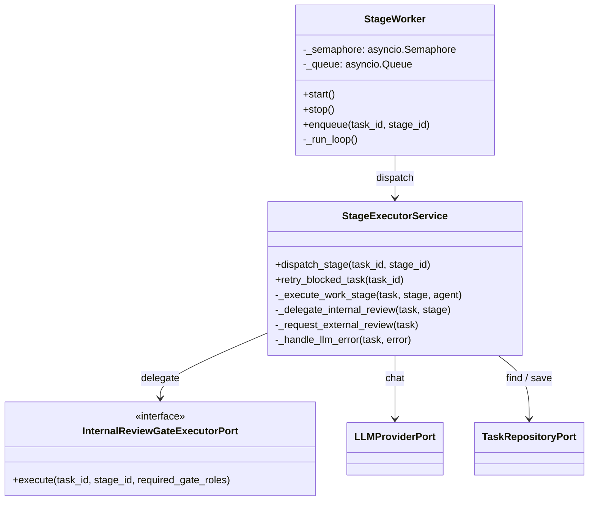
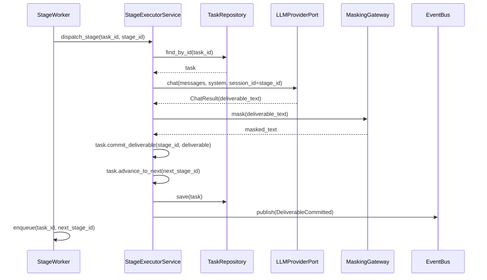
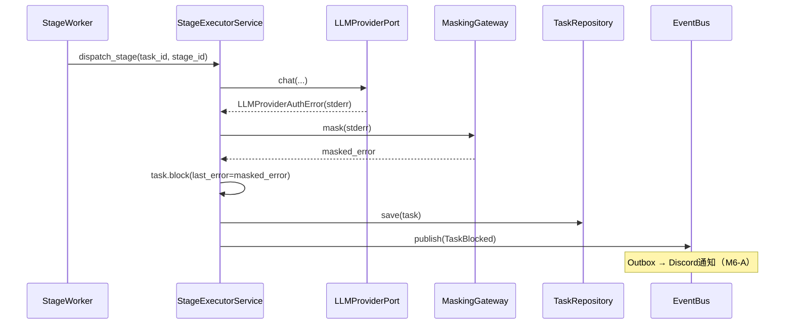
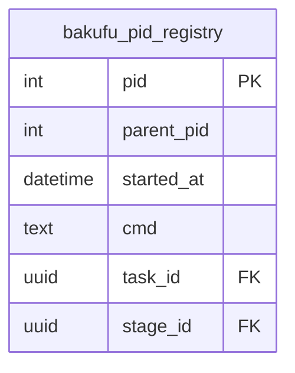

# 基本設計書

> feature: `stage-executor` / sub-feature: `application`
> 親業務仕様: [`../feature-spec.md`](../feature-spec.md)
> 関連: [`detailed-design.md`](detailed-design.md)

## 本書の役割

本書は **階層 3: stage-executor / application の基本設計**（Module-level Basic Design）を凍結する。階層 1 の [`docs/design/architecture.md`](../../../design/architecture.md) で凍結された application レイヤーの責務を、Stage 実行ループというモジュールレベルに展開する（Vモデル「基本設計」工程の階層的トップダウン分解）。

機能要件（REQ-ME-NNN、入力 / 処理 / 出力 / エラー時の入出力契約）は本書 §モジュール契約 として統合する（旧 `requirements.md` は廃止）。本書は **構造契約と処理フローを凍結する** — 「どのモジュールが・どの順で・何を担うか」のレベルで凍結する。

**書くこと**:
- モジュール構成（機能 ID → ディレクトリ → 責務）
- モジュール契約（機能要件の入出力、業務記述）
- クラス設計（概要、属性名のみ列挙、型・制約は detailed-design.md）
- 処理フロー（ユースケース単位、設計戦略レベル）
- シーケンス図 / セキュリティ設計 / エラーハンドリング方針

**書かないこと**（後段の設計書へ追い出す）:
- メソッド呼び出しの細部 → [`detailed-design.md`](detailed-design.md) §確定事項
- 属性の型・制約 → [`detailed-design.md`](detailed-design.md) §クラス設計（詳細）
- MSG 確定文言 → [`detailed-design.md`](detailed-design.md) §MSG 確定文言表

## 記述ルール（必ず守ること）

基本設計に **疑似コード・サンプル実装（言語コードブロック）を書かない**。
ソースコードと二重管理になりメンテナンスコストしか生まない。
必要なのは構造契約（クラス・モジュール・データの関係）であり、実装の細部は [`detailed-design.md`](detailed-design.md) で凍結する。

## モジュール構成

| 機能 ID | モジュール | ディレクトリ | 責務 |
|---|---|---|---|
| REQ-ME-001, REQ-ME-002, REQ-ME-003, REQ-ME-004 | StageExecutorService | `backend/src/bakufu/application/services/` | StageKind 分岐・LLM 呼び出し委譲・エラー分類・Task 状態操作 |
| REQ-ME-005 | StageExecutorService（retry エントリ）| `backend/src/bakufu/application/services/` | BLOCKED Task 回復エントリポイント（M5-C #165 が利用）|
| REQ-ME-006 | StageWorker | `backend/src/bakufu/infrastructure/worker/` | asyncio Queue consumer・並行数セマフォ・Bootstrap 登録 |
| REQ-ME-007 | InternalReviewGateExecutorPort | `backend/src/bakufu/application/ports/` | M5-B #164 との委譲契約（本 Issue で凍結、実装は M5-B）|

```
本 sub-feature で追加・変更されるファイル:

backend/src/bakufu/
├── application/
│   ├── ports/
│   │   └── internal_review_gate_executor_port.py   # 新規: M5-B との委譲契約（REQ-ME-007）
│   └── services/
│       └── stage_executor_service.py                # 新規: StageKind dispatch + retry entry（REQ-ME-001〜005）
└── infrastructure/
    ├── bootstrap.py                                  # 変更: Stage 6.5 StageWorker 登録を追加
    └── worker/
        └── stage_worker.py                          # 新規: asyncio Queue + Semaphore consumer（REQ-ME-006）
```

## モジュール契約（機能要件）

本 sub-feature が提供するモジュールの入出力契約を凍結する。各 REQ-ME-NNN は親 [`feature-spec.md §5`](../feature-spec.md) ユースケース UC-ME-NNN と 1:1 または N:1 で対応する。

### REQ-ME-001: WORK Stage LLM 実行

| 項目 | 内容 |
|---|---|
| 入力 | Task（current_stage_id が WORK Stage を指す）・割り当て済み Agent・Workflow（Stage 定義含む）|
| 処理 | Agent の role_profile（システムプロンプト）と Stage の required_deliverables（成果物定義）を組み合わせて LLMProviderPort.chat() を呼び出す。session_id = Stage ID。応答（deliverable）を masking gateway 経由で Task.commit_deliverable() に渡す。次 Stage が存在すれば Task.advance_to_next() を呼び出す。終端 Stage であれば Task.complete() を呼び出す |
| 出力 | Task が次 Stage に進んだ（IN_PROGRESS）または Task が DONE になった状態 |
| エラー時 | LLMProviderError 5 分類に応じてリトライ戦略を実行（R1-4）。最終的に回復不能な場合は Task.block(last_error=マスキング済みエラー情報) を呼び出す。MSG-ME-001 を Conversation に system message として保存する |

### REQ-ME-002: INTERNAL_REVIEW Stage 委譲

| 項目 | 内容 |
|---|---|
| 入力 | Task（current_stage_id が INTERNAL_REVIEW Stage を指す）・Stage 定義（required_gate_roles）|
| 処理 | InternalReviewGateExecutorPort.execute() を呼び出して実行を委譲する。委譲後の制御は InternalReviewGateExecutor（M5-B）が担う。委譲インターフェースの詳細は REQ-ME-007 を参照 |
| 出力 | 委譲完了（非同期）。実際の Gate 判定結果は M5-B が Task 状態を操作する |
| エラー時 | InternalReviewGateExecutorPort.execute() が例外を送出した場合は Task.block() に帰着。MSG-ME-002 を Conversation に system message として保存する |

### REQ-ME-003: EXTERNAL_REVIEW Stage 遷移

| 項目 | 内容 |
|---|---|
| 入力 | Task（current_stage_id が EXTERNAL_REVIEW Stage を指す）|
| 処理 | Task.request_external_review() を呼び出す。ExternalReviewGate の生成・Discord 通知は ExternalReviewGateService に委譲する（TaskAssigned ドメインイベント経由の Outbox 配送を通じて）|
| 出力 | Task が AWAITING_EXTERNAL_REVIEW になった状態 |
| エラー時 | 該当なし — 理由: Task.request_external_review() は状態遷移のみで外部副作用なし。ExternalReviewGate 生成失敗は ExternalReviewGateService の責務 |

### REQ-ME-004: LLMProviderError 5 分類 → Task BLOCKED

| 項目 | 内容 |
|---|---|
| 入力 | LLMProviderError サブクラス（SessionLost / RateLimited / AuthExpired / Timeout / Unknown）|
| 処理 | エラー分類に応じて tech-stack.md §LLM Adapter 運用方針のリトライ戦略を実行。最終的に回復不能と判定したら masking gateway でエラー情報をマスキングし Task.block(last_error=...) を呼び出す |
| 出力 | Task が BLOCKED になった状態。last_error にマスキング済みエラー情報が保存された状態 |
| エラー時 | 該当なし — 理由: 本 REQ はエラー処理 REQ そのもの。Task.block() が失敗した場合は上位に伝播（Bootstrap レベルの障害）|

### REQ-ME-005: BLOCKED Task retry エントリポイント

| 項目 | 内容 |
|---|---|
| 入力 | task_id（BLOCKED 状態の Task を識別する）|
| 処理 | Task を TaskRepository から取得。Task.status が BLOCKED でなければ拒否（R1-5）。Task.unblock_retry() を呼び出して IN_PROGRESS に戻す。最後の Stage を asyncio Queue に再投入する。audit_log に操作を記録する |
| 出力 | Task が IN_PROGRESS になった状態。最後の Stage が Queue に積まれた状態 |
| エラー時 | Task が BLOCKED でない → MSG-ME-003 を返す。Task が存在しない → MSG-ME-004 を返す |

### REQ-ME-006: StageWorker 並行数制御

| 項目 | 内容 |
|---|---|
| 入力 | asyncio Queue へのステージ実行要求（task_id / stage_id）|
| 処理 | asyncio Semaphore（BAKUFU_MAX_CONCURRENT_STAGES）を acquire して StageExecutorService のディスパッチを呼び出す。acquire できない場合は Queue でキューイングして待機する |
| 出力 | ステージ実行完了後に Semaphore を release して次のキューアイテムを処理 |
| エラー時 | StageExecutorService が例外を送出した場合は Semaphore を release して次のキューアイテムに進む（エラー処理は StageExecutorService 側で Task.block() 済み）|

### REQ-ME-007: InternalReviewGateExecutorPort 委譲インターフェース凍結

| 項目 | 内容 |
|---|---|
| 入力 | 該当なし — 本 REQ はインターフェース定義（Port）|
| 処理 | `InternalReviewGateExecutorPort` を `application/ports/` に定義する。M5-B #164 はこの Port を実装する `InternalReviewGateExecutor` を `infrastructure/` に配置する |
| 出力 | Port 定義（M5-B が実装できる契約）|
| エラー時 | 該当なし — 理由: Port 定義はインターフェースのみ。具体的なエラー処理は M5-B の実装側と REQ-ME-002 で定義する |

## ユーザー向けメッセージ一覧

| ID | 種別 | メッセージ（要旨）| 表示条件 |
|---|---|---|---|
| MSG-ME-001 | エラー | LLM 実行エラー（エラー分類 + last_error）| WORK Stage で LLMProviderError → BLOCKED |
| MSG-ME-002 | エラー | InternalReviewGate executor 委譲エラー | INTERNAL_REVIEW Stage で InternalReviewGateExecutorPort が例外 |
| MSG-ME-003 | エラー | retry 対象 Task が BLOCKED 状態でない | retry-task 呼び出し時に Task.status ≠ BLOCKED |
| MSG-ME-004 | エラー | retry 対象 Task が存在しない | retry-task 呼び出し時に TaskRepository が Task を発見できない |

各メッセージの確定文言は [`detailed-design.md §MSG 確定文言表`](detailed-design.md) で凍結する。

## 依存関係

| 区分 | 依存 | バージョン方針 | 備考 |
|---|---|---|---|
| ランタイム | Python 3.12+ | pyproject.toml | 既存 |
| Domain | task / workflow / agent / external-review-gate domain | — | 既存（M1 完了）|
| Repository Port | TaskRepositoryPort / WorkflowRepositoryPort / AgentRepositoryPort | — | 既存（M2 完了）|
| LLM Port | LLMProviderPort / ClaudeCodeLLMClient | — | 既存（llm-client feature）|
| EventBus Port | EventBusPort | — | 既存（M4 完了）|
| masking | MaskingGateway（infrastructure/security/masking.py）| — | 既存 |
| pid_registry | bakufu_pid_registry テーブル / GC（infrastructure/）| — | 既存 |
| 外部 Port（新規）| InternalReviewGateExecutorPort | — | 本 Issue で定義、M5-B で実装 |
| asyncio | asyncio.Queue / asyncio.Semaphore | Python 標準ライブラリ | 追加依存なし |

## クラス設計（概要）



**凝集のポイント**:
- StageExecutorService は StageKind の分岐判断と LLM エラー分類をカプセル化する。Semaphore・Queue 管理は StageWorker に委ねる（責務の分離）
- InternalReviewGateExecutorPort は Port パターンで依存性を逆転させる。M5-B の実装が application 層に逆依存しない

## 処理フロー

### UC-ME-001: WORK Stage LLM 実行

1. StageWorker が Queue から（task_id, stage_id）を取り出し Semaphore を acquire
2. StageExecutorService.dispatch_stage() を呼び出す
3. Task と Stage を取得。Stage.kind = WORK を確認
4. Agent（role_profile）と Stage（required_deliverables）を取得してシステムプロンプトを構成
5. LLMProviderPort.chat() を呼び出す（session_id = stage_id）
6. 応答を masking gateway 経由で deliverable に変換
7. Task.commit_deliverable() を呼び出す
8. Workflow の Transition を評価して次 Stage を決定
9. 次 Stage あり → Task.advance_to_next() → StageWorker.enqueue(task_id, next_stage_id)
10. 終端 Stage → Task.complete() → Domain Event 発火（TaskCompleted）

### UC-ME-002: INTERNAL_REVIEW Stage 委譲

1. StageWorker が Queue から（task_id, stage_id）を取り出し Semaphore を acquire
2. StageExecutorService.dispatch_stage() を呼び出す
3. Stage.kind = INTERNAL_REVIEW を確認
4. InternalReviewGateExecutorPort.execute(task_id, stage_id, required_gate_roles) を呼び出す
5. Semaphore は InternalReviewGateExecutor が完了を通知するまで release しない（詳細は M5-B で確定）

### UC-ME-003: EXTERNAL_REVIEW Stage 遷移

1. StageWorker が Queue から（task_id, stage_id）を取り出し Semaphore を acquire
2. StageExecutorService.dispatch_stage() を呼び出す
3. Stage.kind = EXTERNAL_REVIEW を確認
4. Task.request_external_review() を呼び出す
5. TaskRepository.save(task) を呼び出す
6. Semaphore を release（ExternalReviewGate の生成・Discord 通知は Outbox Dispatcher が非同期処理）

### UC-ME-004: エラー発生 → BLOCKED

1. _execute_work_stage() 内で LLMProviderError が発生
2. _handle_llm_error() がエラー分類を判定
3. リトライ戦略を実行（SessionLost: 1回再投入 / RateLimited: backoff 3回 / AuthExpired: 即 BLOCK）
4. 最終的に回復不能と判定したら masking gateway でエラー情報をマスキング
5. Task.block(last_error=...) を呼び出す
6. TaskRepository.save(task) を呼び出す
7. Domain Event 発火（TaskBlocked）→ Outbox 経由で Discord 通知（M6-A で実装）

### UC-ME-005: BLOCKED Task retry

1. admin CLI または UI が StageExecutorService.retry_blocked_task(task_id) を呼び出す
2. TaskRepository.find_by_id(task_id) で Task を取得
3. Task.status ≠ BLOCKED → MSG-ME-003 を返す（Fail Fast）
4. Task.unblock_retry() を呼び出す
5. TaskRepository.save(task) を呼び出す
6. StageWorker.enqueue(task_id, task.current_stage_id) で最後の Stage を再キュー
7. audit_log に操作者・操作内容を記録

## シーケンス図

### WORK Stage 実行（正常系）



### LLMProviderError → BLOCKED（AuthExpired）



## アーキテクチャへの影響

- [`docs/design/architecture.md`](../../../design/architecture.md) への変更: application レイヤーの services に `StageExecutorService`、ports に `InternalReviewGateExecutorPort` を追記。infrastructure レイヤーに `worker/stage_worker.py` を追記（同 PR で更新）
- [`docs/design/tech-stack.md`](../../../design/tech-stack.md) への変更: §確定 SE-A（StageWorker asyncio 設計）・§確定 SE-B（Bootstrap Stage 6.5）を追記（同 PR で更新）
- 既存 feature への波及:
  - `bootstrap.py`: Stage 6.5 として StageWorker 起動を追加
  - `task_service.py`: StageExecutorService が TaskRepositoryPort を共有（DI 設計変更なし）

## 外部連携

| 連携先 | 目的 | プロトコル | 認証 | タイムアウト / リトライ |
|---|---|---|---|---|
| Claude Code CLI | WORK Stage の deliverable 生成 | asyncio.create_subprocess_exec | OAuth（`~/.claude/` 設定）| タイムアウト 10 分。詳細は tech-stack.md §LLM Adapter 運用方針 |
| InternalReviewGateExecutor（M5-B）| INTERNAL_REVIEW Stage 実行委譲 | プロセス内 Port 呼び出し | — | M5-B 詳細設計で確定 |
| ExternalReviewGateService | EXTERNAL_REVIEW Gate 生成委譲 | プロセス内メソッド呼び出し | — | 同期呼び出し、副作用は Outbox 経由 |

## UX 設計

該当なし — 理由: 本 sub-feature は bakufu バックグラウンド処理（asyncio Worker）であり、直接のユーザー操作インターフェースを持たない。BLOCKED 状態の通知は Discord（M6-A）、retry 操作は admin CLI（M5-C）が担う。

**アクセシビリティ方針**: 該当なし — 理由: バックグラウンド処理のため。

## セキュリティ設計

### 脅威モデル

| 想定攻撃者 | 攻撃経路 | 保護資産 | 対策 |
|---|---|---|---|
| **T1: LLM 出力による secret 漏洩** | Claude Code CLI の stdout に secret が混入 → DB 永続化 | deliverable・last_error に含まれる secret | masking gateway（`infrastructure/security/masking.py`）を永続化前の単一ゲートウェイとして強制通過。直接 Repository に保存するルートは設計書で禁止 |
| **T2: subprocess による環境変数漏洩** | 子プロセスに親の `os.environ` を全継承 → LLM が出力に含めて流出 | AWS_ACCESS_KEY_ID 等の環境変数 | allow list 方式で PATH / HOME / LANG / BAKUFU_* のみ引き継ぎ（tech-stack.md §subprocess 環境変数ハンドリング）|
| **T3: 孤児 subprocess によるリソース枯渇** | Backend クラッシュ後に subprocess が残留 | CPU / メモリ | pid_registry テーブル + Bootstrap Stage 4 GC。spawn 時に INSERT、完了時に DELETE |
| **T4: BLOCKED recovery の不正操作** | interfaces 層が直接 Task.unblock_retry() を呼び出す | audit_log の完全性 | StageExecutorService.retry_blocked_task() 経由のみ許可。domain への直接アクセスは interfaces レイヤーの規律で物理的に禁止 |

詳細な信頼境界は [`docs/design/threat-model.md`](../../../design/threat-model.md)。

## ER 図



`bakufu_pid_registry` テーブルは既存（pid_registry feature）。本 sub-feature は spawn 時に INSERT、完了時に DELETE、クラッシュ時は Bootstrap Stage 4 GC が処理する。新規テーブルの追加なし。

## エラーハンドリング方針

| 例外種別 | 処理方針 | ユーザーへの通知 |
|---|---|---|
| LLMProviderSessionLostError | 新規 session_id で 1 回のみ再投入。再投入失敗 → Task.block() | MSG-ME-001（Conversation system message）|
| LLMProviderRateLimitedError | exponential backoff 最大 3 回。3 回失敗 → Task.block() | MSG-ME-001（Conversation system message）|
| LLMProviderAuthExpiredError | リトライなし。即 Task.block() | MSG-ME-001（Conversation system message）|
| LLMProviderTimeoutError | SIGTERM→5 秒 grace→SIGKILL → SessionLost 相当に合流 | MSG-ME-001（Conversation system message）|
| LLMProviderUnknownError | リトライなし。即 Task.block() | MSG-ME-001（Conversation system message）|
| InternalReviewGateExecutorPort 例外 | Task.block() | MSG-ME-002（Conversation system message）|
| TaskRepository 例外（find / save）| 上位に伝播（Bootstrap レベルの障害、StageWorker は次のキューアイテムをスキップ）| 該当なし（infrastructure 障害として別途ログ）|
