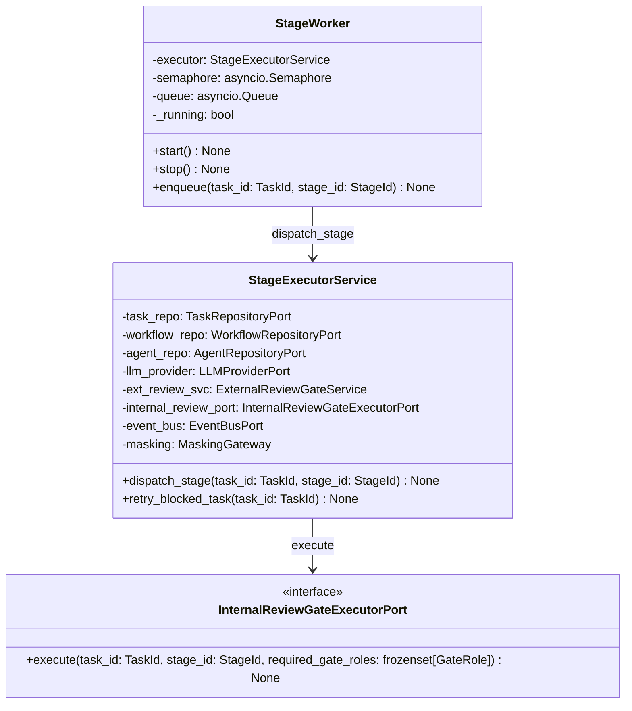

# 詳細設計書

> feature: `stage-executor` / sub-feature: `application`
> 親業務仕様: [`../feature-spec.md`](../feature-spec.md)
> 関連: [`basic-design.md`](basic-design.md)

## 本書の役割

本書は **階層 3: stage-executor / application の詳細設計**（Module-level Detailed Design）を凍結する。[`basic-design.md`](basic-design.md) で凍結されたモジュール基本設計を、実装直前の **構造契約・確定文言・キー構造** として詳細化する。実装 PR は本書を改変せず参照する。設計変更が必要なら本書を先に更新する PR を立てる。

**書くこと**:
- クラス・サービスの属性・型・制約（構造契約の詳細）
- 親 [`feature-spec.md §7`](../feature-spec.md) 確定 R1-X を実装方針として展開した `§確定 A` 〜 `§確定 G`
- MSG 確定文言（実装者が改変できない契約）

**書かないこと**:
- 業務ルールの議論（採用根拠は feature-spec.md §7 で凍結済み）
- ソースコードそのもの（実装 PR で書く）

## 記述ルール（必ず守ること）

詳細設計に **疑似コード・サンプル実装（言語コードブロック）を書かない**。
ソースコードと二重管理になりメンテナンスコストしか生まない。

## クラス設計（詳細）

### Service: StageExecutorService

| 属性 | 型 | 意図 |
|---|---|---|
| `task_repo` | `TaskRepositoryPort` | Task の取得・保存 |
| `workflow_repo` | `WorkflowRepositoryPort` | Workflow・Stage 定義の取得 |
| `agent_repo` | `AgentRepositoryPort` | Agent の role_profile 取得 |
| `llm_provider` | `LLMProviderPort` | Claude Code CLI 呼び出し |
| `ext_review_svc` | `ExternalReviewGateService` | EXTERNAL_REVIEW Gate 生成委譲 |
| `internal_review_port` | `InternalReviewGateExecutorPort` | INTERNAL_REVIEW 実行委譲（M5-B） |
| `event_bus` | `EventBusPort` | Domain Event 発行（WebSocket broadcast）|
| `masking` | `MaskingGateway` | stdout/stderr のマスキング |

**不変条件**:
- `dispatch_stage()` 呼び出し時点で Task.status = IN_PROGRESS であること（Fail Fast）
- `retry_blocked_task()` 呼び出し時点で Task.status = BLOCKED であること（Fail Fast）

**ふるまい**:
- `dispatch_stage(task_id, stage_id) -> None`: Stage.kind に応じて WORK / INTERNAL_REVIEW / EXTERNAL_REVIEW の 3 分岐を実行する。LLMProviderError はエラー分類ロジックに委譲し最終的に Task.block() に帰着させる
- `retry_blocked_task(task_id) -> None`: Task.status = BLOCKED を検証し Task.unblock_retry() を呼び出して最後の Stage を StageWorker に再キューする

### Worker: StageWorker

| 属性 | 型 | 制約 | 意図 |
|---|---|---|---|
| `executor` | `StageExecutorService` | 必須 | 実際の Stage 実行ロジック |
| `semaphore` | `asyncio.Semaphore` | value = BAKUFU_MAX_CONCURRENT_STAGES (≥1) | 並行数制御 |
| `queue` | `asyncio.Queue[tuple[TaskId, StageId]]` | サイズ上限なし（backpressure は Semaphore で制御）| Stage 実行要求のキュー |
| `_running` | `bool` | 起動中 = True | shutdown 制御フラグ |

**ふるまい**:
- `start() -> None`: asyncio.create_task で `_run_loop()` をスケジュール
- `stop() -> None`: `_running = False` をセットし、Queue に sentinel を投入して loop を終了させる。実行中の Stage subprocess には SIGTERM を送出し graceful drain する
- `enqueue(task_id, stage_id) -> None`: Queue に追加。呼び出し元は非ブロッキング

### Port: InternalReviewGateExecutorPort

| 属性 | 型 | 意図 |
|---|---|---|
| （インターフェースのみ、属性なし）| — | — |

**ふるまい**:
- `execute(task_id, stage_id, required_gate_roles) -> None`: **Gate 判定完了（全 GateRole が APPROVED または 1 件でも REJECTED）まで `await` するlong-running coroutine**。呼び出し元 StageWorker は `await execute()` の返却をもって Semaphore を release する。Gate の判定結果（APPROVED / REJECTED）に基づく Task 状態の操作（advance_to_next / 差し戻し）は M5-B の実装が execute() の内部で完結させる。タイムアウト・エラー時は例外を送出し、呼び出し元 REQ-ME-002 のエラーハンドリングが Task.block() に帰着させる

## 確定事項（先送り撤廃）

### 確定 A: StageWorker は asyncio.Queue + asyncio.Semaphore を採用する

asyncio.Queue で要求をバッファリングし、asyncio.Semaphore で並行数（BAKUFU_MAX_CONCURRENT_STAGES）を制御する。

**根拠**:
- `asyncio.Queue`: 単一 asyncio イベントループ内でノンブロッキングなキューイングを実現。既存スタック（FastAPI / asyncio）と追加依存なしで統合できる
- `asyncio.Semaphore`: Queue consumer が acquire → dispatch_stage → release のサイクルを繰り返すことで、上限超過時のキューイングが自然に成立する
- 代替案（asyncio.TaskGroup / asyncio.gather）は並行数制御が煩雑になるため不採用。スレッドプール（concurrent.futures）は GIL 回避が目的でなく、asyncio ループとの統合コストが高いため不採用

出典: Python 公式ドキュメント — [asyncio Queues](https://docs.python.org/3/library/asyncio-queue.html) / [asyncio Synchronization Primitives](https://docs.python.org/3/library/asyncio-sync.html)

### 確定 B: session_id = Stage ID（UUID v4）とする

LLM 呼び出しの `--session-id` に Stage ID の UUID 文字列をそのまま使用する。

**根拠**:
- Stage ごとにコンテキストを独立させる（feature-spec.md R1-1）
- Stage ID は Task 内で不変かつ一意であるため、session_id の再生成・衝突管理が不要
- SessionLost リトライ時は新規 UUID v4 を生成して再投入する（Stage ID とは別物）。再投入の session_id は `stage_executor_sessions` テーブルに保存しないためステートレス

出典: Claude Code CLI `--session-id` オプション仕様（`claude --help` 参照）

### 確定 C: StageWorker は Bootstrap Stage 6.5 として asyncio.create_task で登録する

`backend/src/bakufu/infrastructure/bootstrap.py` に `_stage_6_5_stage_worker()` メソッドを追加し、Outbox Dispatcher（Stage 6）と FastAPI listener（Stage 8）の間に配置する。

**根拠**:
- Stage 6（Outbox Dispatcher）が起動済みであることが前提。Stage 実行が発火する Domain Event（DeliverableCommitted / TaskBlocked 等）が Outbox 経由で正しく配送される順序を保証する
- Stage 8（FastAPI listener）より前に起動することで、HTTP API から Directive を受け付けた瞬間から Stage 実行が可能になる
- asyncio.create_task を使うことで FastAPI event loop と同一ループで動作し、追加スレッドや外部プロセスが不要

### 確定 D: BAKUFU_MAX_CONCURRENT_STAGES デフォルト = 1（MVP シリアル実行）

環境変数 `BAKUFU_MAX_CONCURRENT_STAGES` から整数値を読み込む。未設定時・不正値時は 1 にフォールバックする。最大値制限は設けない（ops 判断に委ねる）。

**根拠**:
- MVP の検証対象は「Vモデル工程と外部レビューゲートの正しさ」（feature-spec.md R1-6）
- 並列実行は git worktree 分離が前提となり、現在の Workspace 設計が存在しない（Phase 2 以降）
- デフォルト 1 はシリアル実行のため、競合状態・レース条件が発生しない

### 確定 E: RateLimited backoff は固定値とする（MVP は環境変数化しない）

backoff 待機時間: 第 1 回 1 分 → 第 2 回 5 分 → 第 3 回 15 分（tech-stack.md §LLM Adapter 運用方針の確定値）。設定値の環境変数化は MVP では行わない（feature-spec.md Q-OPEN-3 解決）。

**根拠**:
- backoff 値は LLM プロバイダの Rate Limit 回復特性に依存しており、ユーザーが調整することは期待されない
- YAGNI 原則。必要が生じれば Phase 2 で環境変数化する

### 確定 F: Task 状態の検証は Fail Fast で行う

`dispatch_stage()` 冒頭で `Task.status ≠ IN_PROGRESS` の場合は即座に例外を送出する。`retry_blocked_task()` 冒頭で `Task.status ≠ BLOCKED` の場合は MSG-ME-003 を返す。

**根拠**:
- 不正な状態で LLM 呼び出しを行うと副作用（pid_registry 登録・deliverable 生成）が発生してしまう
- Fail Fast 原則（`docs/design/architecture.md` §設計原則）に従う

### 確定 G: InternalReviewGateExecutorPort は typing.Protocol で定義する

`application/ports/internal_review_gate_executor_port.py` に `typing.Protocol` として定義する。M5-B は `infrastructure/reviewers/internal_review_gate_executor.py` にこの Protocol を実装する。Protocol を使うことで M5-B が `application/` を import しない（依存方向の保全）。

**根拠**:
- 既存 Port 定義の慣習に従う（`LLMProviderPort` が同様の Pattern）
- `runtime_checkable` を付与して `isinstance()` 検証を可能にする（テスト時の型チェック）

出典: Python 公式 — [typing.Protocol](https://docs.python.org/3/library/typing.html#typing.Protocol)

### 確定 H: LLMProviderError 5 分類と実装クラスのマッピング（ヘルスバーグ指摘を受けて凍結）

`backend/src/bakufu/domain/exceptions/llm_provider.py` に存在するクラスと、feature-spec.md R1-4 が定義する 5 分類の対応を確定する。実装者はこのマッピング表に従ってクラスを追加・活用すること。

| 5 分類 | 採用クラス名 | 既存 / 新規 | 判定根拠 |
|---|---|---|---|
| SessionLost | `LLMProviderSessionLostError` | **新規追加**（`LLMProviderError` 継承）| stderr に `"session not found"` / `"unknown session"` を含む |
| RateLimited | `LLMProviderRateLimitedError` | **新規追加**（`LLMProviderError` 継承）| stderr に `"rate limit"` / HTTP 429 相当のメッセージを含む |
| AuthExpired | `LLMProviderAuthError` | **既存活用**（クラス名は `AuthError` で確定、`AuthExpired` にリネームしない）| stderr に `"OAuth"` / `"unauthorized"` / `"authentication"` を含む |
| Timeout | `LLMProviderTimeoutError` | **既存活用** | asyncio.TimeoutError / プロセス無応答 10 分 |
| Unknown | `LLMProviderProcessError` | **既存活用**（Unknown の catch-all として位置付けを明確化）| 上記いずれにも該当しない非ゼロ exit code / stderr パターン |

**既存クラスの位置付け確定**:

| 既存クラス | 5 分類での位置付け |
|---|---|
| `LLMProviderAuthError` | AuthExpired 分類に対応（名称変更なし）|
| `LLMProviderTimeoutError` | Timeout 分類に対応（変更なし）|
| `LLMProviderProcessError` | Unknown 分類の catch-all として使用（セマンティクスを明確化するのみ、クラス削除なし）|
| `LLMProviderEmptyResponseError` | **独立保持**。CLI が正常終了（exit 0）したにもかかわらず deliverable が空の場合。5 分類の Unknown に帰属させず、「LLM が応答を返したが内容が空」という独立した異常系として扱う。リトライ戦略: Unknown 相当（即 BLOCKED）|

**実装担当への指示**:
- `LLMProviderSessionLostError` / `LLMProviderRateLimitedError` の 2 クラスを `domain/exceptions/llm_provider.py` に追加すること
- `LLMProviderAuthError` / `LLMProviderTimeoutError` / `LLMProviderProcessError` / `LLMProviderEmptyResponseError` はクラス名・継承関係を変更しない
- 実装着手前にこの 2 クラスの追加と `tests/factories/llm_provider_error.py` への factory 追加を完了させること（test-design.md 実装前提条件 TBD-1 対応）

**根拠**:
- `LLMProviderProcessError` を Unknown の catch-all として使用することで既存テストを破壊しない（Boy Scout Rule: 触ったコードは来た時より綺麗にして帰れ、ただし既存テストを壊すリファクタリングは別 PR で行う）
- `LLMProviderEmptyResponseError` を独立保持する理由: 空応答は「プロバイダが通信できない」とは異なる業務上の異常であり、将来的に「空応答の場合は再プロンプトを試みる」という別リトライ戦略が必要になる可能性がある（YAGNI 違反にならない範囲で拡張の余地を保全）

### 確定 I: `LLMProviderPort` に `chat_with_tools()` を追加する（M5-B 拡張、Boy Scout Rule 対応）

M5-B（InternalReviewGate application sub-feature）は `LLMProviderPort` に `chat_with_tools()` メソッドを追加する。これは GateRole 審査の `submit_verdict` ツール呼び出し方式（internal-review-gate/application/detailed-design.md §確定 D）のために必要な拡張である。

| メソッド | シグネチャ（概要）| 戻り値 | 用途 | 状態 |
|---------|---------------|--------|------|------|
| `chat(messages, system, session_id)` | 既存シグネチャを維持 | `ChatResult`（`tool_calls` は常に空リスト `[]`）| WORK Stage の LLM 実行 | M5-A 定義済み。変更なし |
| `chat_with_tools(messages, tools, system, session_id)` | `tools` パラメータ（tool schema リスト）を追加 | `ChatResult`（`tool_calls: list[ToolCall]` に LLM が呼び出したツール情報が格納される）| GateRole 審査の `submit_verdict` ツール呼び出し（M5-B）| M5-B で新規追加 |

**戻り値の構造化型（凍結）**:

`chat_with_tools()` は `ChatResult` を返す。`ChatResult` に M5-B で追加された `tool_calls: list[ToolCall]` フィールドが含まれる。呼び出し元は `result.tool_calls` を走査して `name == "submit_verdict"` のエントリを検索する。文字列 JSON パース（`json.loads(result.response)`）は禁止（Heisenberg 指摘 §却下6 の根本解決）。

`ToolCall` VO の定義は `llm-client/domain/basic-design.md §ToolCall VO` で凍結。フィールド:
- `name: str` — ツール名（例: `"submit_verdict"`）
- `input: dict[str, object]` — ツール呼び出し引数（例: `{"decision": "APPROVED", "reason": "..."}`）

**後方互換保証**: `chat()` の既存シグネチャ・呼び出し元・テストは変更しない。`chat_with_tools()` は Protocol の新 method として追加するのみ（既存実装クラスに `NotImplementedError` の default 実装を追加することで後方互換を保つ）。`chat()` の戻り値 `ChatResult.tool_calls` は空リスト `[]` で固定（呼び出し元が `chat()` から tool_calls を参照する必要はない）。

**影響範囲**:
- `backend/src/bakufu/application/ports/llm_provider_port.py`: `chat_with_tools()` method を Protocol に追加
- `backend/src/bakufu/domain/value_objects/chat_result.py`: `ChatResult` に `tool_calls: list[ToolCall]` フィールド追加、`ToolCall` VO 新規定義（またはインポート）
- `backend/src/bakufu/infrastructure/claude_code/claude_code_llm_provider.py`（既存実装）: `chat_with_tools()` を実装追加
- M5-B 実装 PR のスコープ（本 §で設計書に凍結し、実装は M5-B 実装 PR で行う）

**根拠**: `LLMProviderPort` は M5-A で定義した凍結契約だが、M5-B が新機能（ツール呼び出し）を必要とするため Boy Scout Rule に従い同一 PR で設計書を更新する（ヘルスバーグ指摘 §却下4）。文字列 JSON パースを排除し構造化型を採用することで、LLM 実装の変更に対する耐性が上がる（Heisenberg 指摘 §却下6）。

### 確定 J: StageWorker 起動時 IN_PROGRESS 孤立 Task リカバリスキャン（M5-C 追加、2026-05-02 ジェンセン決定）

**背景**: admin-cli の `retry-task` コマンドは Task を BLOCKED → IN_PROGRESS に変更して DB に保存するが、admin-cli は別プロセスであるためサーバーの `asyncio.Queue` に Task を投入する手段を持たない。StageWorker は Queue 依存型（ポーリングなし）であるため、明示的にキューに投入されない Task は再起動前まで実行されない。`retry-task` の end-to-end を成立させるため、StageWorker 起動時に IN_PROGRESS 孤立 Task をスキャンしてキューに再投入する機構を追加する（Q-OPEN-2 解決策 Option A）。

**リカバリスキャンの仕様（凍結）**:

| 項目 | 内容 |
|---|---|
| 実行タイミング | StageWorker 起動時（`start()` メソッドの冒頭、Queue 処理ループ開始前）|
| スキャン対象 | `TaskStatus.IN_PROGRESS` の全 Task（`TaskRepositoryPort.list_by_status(IN_PROGRESS)` で取得）|
| 処理内容 | 該当 Task を `asyncio.Queue.put()` で逐次投入（同期的に全件投入後にループ開始）|
| Queue 上限 | Queue `maxsize` を超える件数が存在する場合は `put()` で自然に await（backpressure 発生は正常動作）|
| ログ出力 | `[INFO] StageWorker: 起動時リカバリスキャン — {n} 件の IN_PROGRESS Task をキューに投入しました。` |
| 0 件の場合 | `[INFO] StageWorker: 起動時リカバリスキャン — 孤立 Task なし。` |

**保証する不変条件**:
- サーバー再起動後、IN_PROGRESS 状態の孤立 Task は StageWorker が必ず拾い直す
- `retry-task` で BLOCKED → IN_PROGRESS にした Task は次回サーバー起動時に自動的に実行が再開される

**冪等性**: 起動時は Queue が空であるため、同一 Task がキューに二重投入される状況は発生しない。

**影響範囲（M5-C 実装スコープ）**:

| 変更対象 | 変更内容 |
|---|---|
| `backend/src/bakufu/infrastructure/worker/stage_worker.py` | `start()` 冒頭に IN_PROGRESS スキャン + キュー投入ロジックを追加 |
| `backend/src/bakufu/application/ports/task_repository.py` | `list_by_status(status: TaskStatus) -> list[Task]` メソッドを追加（未定義の場合）|
| `backend/src/bakufu/infrastructure/persistence/sqlite/repositories/task_repository.py` | 上記 Port 追加に伴う実装追加 |

**根拠**: ジェンセン決定（2026-05-02）。ヘルスバーグ指摘 PR #174 Critical 2「StageWorker に起動時リカバリスキャン機構がなく `retry-task` が機能不全」の根本解決。詳細設計の凍結は本 §で完結し、admin-cli feature-spec.md Q-OPEN-2 は本 PR でクローズ。

## 設計判断の補足

### なぜ ExternalReviewGateService に委譲し StageExecutorService が Gate を直接生成しないのか

ExternalReviewGate は独立した Aggregate Root（`feature/external-review-gate` feature-spec.md R1-A で凍結）。StageExecutorService が Gate の生成詳細（attachments / snapshot 凍結 / Discord 通知 webhook 設定等）を知ることは責務の混在になる。Tell, Don't Ask 原則に従い、Task に「外部レビューを要求する」と命令し、Gate 生成の詳細は ExternalReviewGateService が知っている。

### なぜ InternalReviewGateExecutorPort.execute() は long-running coroutine なのか

InternalReviewGate は並列 Agent 審査であり、全 Agent が判定を完了するまで StageWorker の concurrency slot を占有すべきである。`await execute()` の返却をもって Semaphore を release することで、「同時に実行中の Stage 数」という並行数の意味と実際の動作が一致する。

fire-and-forget 方式（execute() が即 return してコールバック経由で完了通知）も検討したが、コールバックを Port シグネチャに含めると `(task_id, stage_id, required_gate_roles, done_callback: Callable)` という複雑な契約になり、M5-B の実装者が誤ってコールバックを呼ばない実装をした場合に Semaphore が永久に解放されないデッドロックが発生する。long-running coroutine 方式はエラー時にも例外が `await` 元に伝播するため、呼び出し元の REQ-ME-002 エラーハンドリングが確実に機能する。

## ユーザー向けメッセージの確定文言

[`basic-design.md §ユーザー向けメッセージ一覧`](basic-design.md) で ID のみ定義した MSG を、本書で **正確な文言** として凍結する。実装者が勝手に改変できない契約。変更は本書の更新 PR のみで許可。

### プレフィックス統一

| プレフィックス | 意味 |
|---|---|
| `[FAIL]` | 処理中止を伴う失敗 |
| `[OK]` | 成功完了 |
| `[SKIP]` | 冪等実行による省略 |
| `[WARN]` | 警告（処理は継続）|
| `[INFO]` | 情報提供（処理は継続）|

### MSG 確定文言表

| ID | 出力先 | 文言（2 行構造）|
|---|---|---|
| MSG-ME-001 | Conversation system message | `[FAIL] Stage execution failed: {error_kind} — {masked_error_summary}` / `Next: run 'bakufu admin retry-task {task_id}' after resolving the issue, or 'bakufu admin cancel-task {task_id} --reason <reason>'` |
| MSG-ME-002 | Conversation system message | `[FAIL] Internal review gate execution failed: {masked_error_summary}` / `Next: run 'bakufu admin retry-task {task_id}' after resolving the issue` |
| MSG-ME-003 | 呼び出し元（admin CLI / API レスポンス）| `[FAIL] Task {task_id} is not BLOCKED (current status: {status})` / `Next: verify the task_id and its current status with 'bakufu admin list-blocked'` |
| MSG-ME-004 | 呼び出し元（admin CLI / API レスポンス）| `[FAIL] Task {task_id} not found` / `Next: verify the task_id with 'bakufu admin list-blocked'` |

## データ構造（永続化キー）

### 新規テーブルなし

本 sub-feature は新規 DB テーブルを追加しない。使用するテーブルは以下の既存テーブルのみ:

| テーブル | 用途 | 参照先 |
|---|---|---|
| `tasks` | Task 状態の取得・更新（status / current_stage_id / last_error 等）| feature/task/repository |
| `bakufu_pid_registry` | subprocess spawn 時に INSERT、完了時に DELETE | feature/persistence-foundation |
| `domain_event_outbox` | Domain Event 永続化（TaskBlocked / DeliverableCommitted 等）| feature/persistence-foundation |

## API エンドポイント詳細

### POST /api/tasks/{task_id}/retry（M5-C #165 が実装）

本 sub-feature では API エンドポイントを追加しない。`StageExecutorService.retry_blocked_task()` は `interfaces/` 層の admin CLI（M5-C）または将来の UI（M6-B）から呼び出される。エンドポイント定義は M5-C の設計書で凍結する。

## 出典・参考

- Python 公式 asyncio ドキュメント: https://docs.python.org/3/library/asyncio.html
- asyncio Queue: https://docs.python.org/3/library/asyncio-queue.html
- asyncio Synchronization: https://docs.python.org/3/library/asyncio-sync.html
- typing.Protocol: https://docs.python.org/3/library/typing.html#typing.Protocol
- psutil ドキュメント（pid_registry GC で使用）: https://psutil.readthedocs.io/
- bakufu tech-stack.md §LLM Adapter 運用方針（リトライ戦略・backoff 値・孤児 GC 判定基準）
- bakufu feature-spec.md §7 確定 R1-1〜R1-8（業務ルールの根拠）
