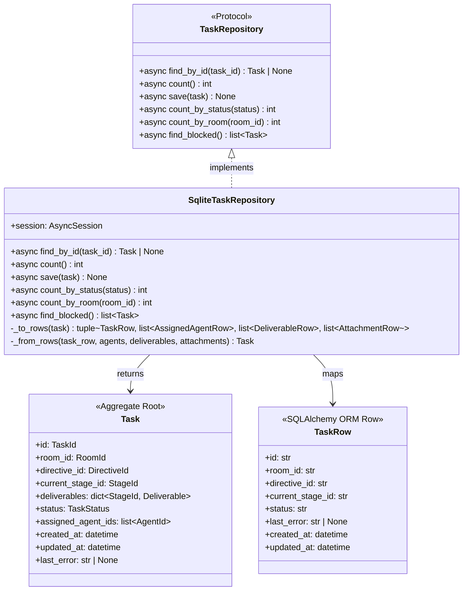
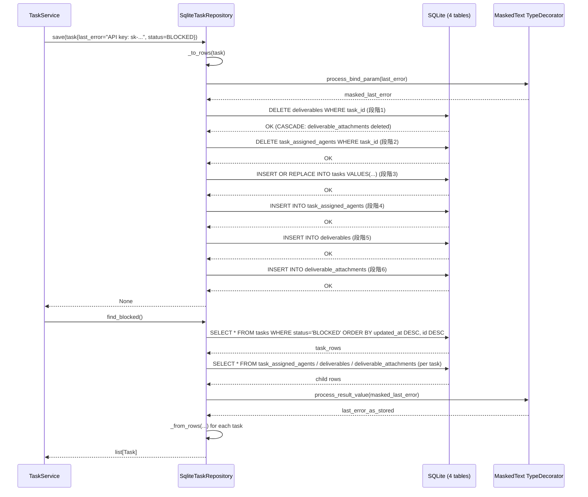
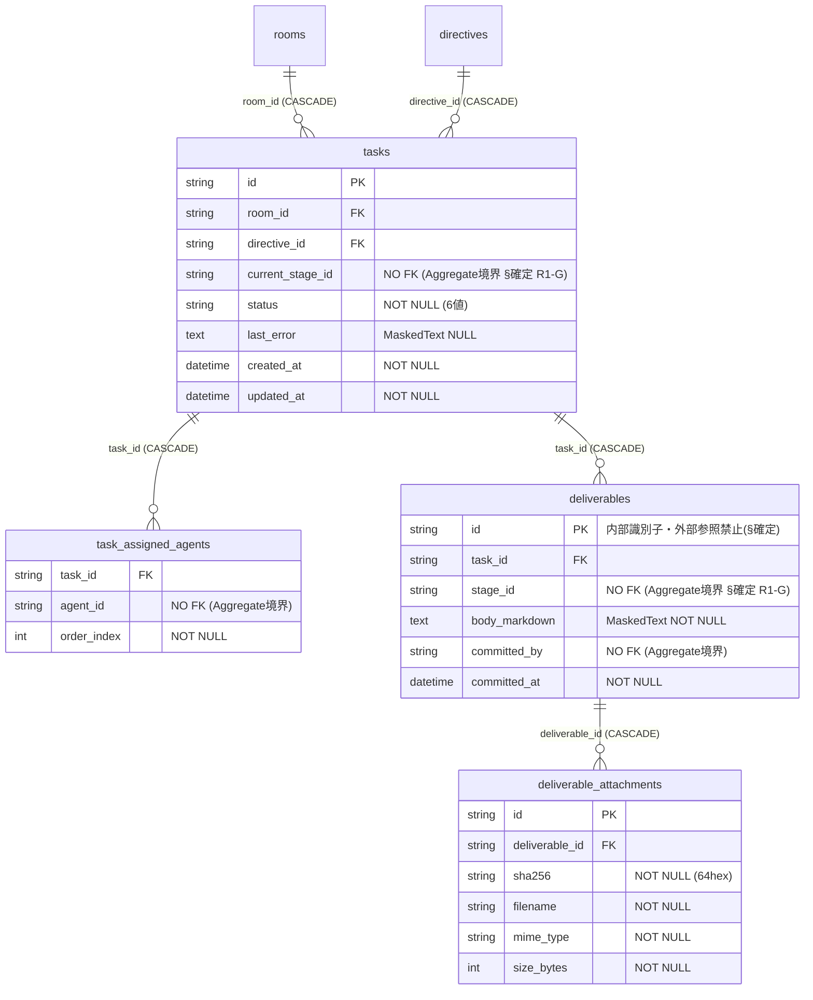

# 基本設計書

> feature: `task-repository`
> 関連: [requirements.md](requirements.md) / [`docs/features/empire-repository/`](../empire-repository/) **テンプレート真実源** / [`docs/features/directive-repository/`](../directive-repository/) **直近テンプレート** / [`docs/features/task/`](../task/)

## 記述ルール（必ず守ること）

基本設計に**疑似コード・サンプル実装（python/ts/sh/yaml 等の言語コードブロック）を書かない**。
ソースコードと二重管理になりメンテナンスコストしか生まない。
必要なのは構造契約（クラス・モジュール・データの関係）であり、実装の細部は [detailed-design.md](detailed-design.md) で凍結する。

## モジュール構成

| 機能 ID | モジュール | ディレクトリ | 責務 |
|--------|----------|------------|------|
| REQ-TR-001 | `TaskRepository` Protocol | `backend/src/bakufu/application/ports/task_repository.py` | Repository ポート定義（6 method）|
| REQ-TR-002 | `SqliteTaskRepository` | `backend/src/bakufu/infrastructure/persistence/sqlite/repositories/task_repository.py` | SQLite 実装、§確定 R1-A〜H 全適用 |
| REQ-TR-003 | Alembic 0007 revision | `backend/alembic/versions/0007_task_aggregate.py` | 4 テーブル + INDEX + BUG-DRR-001 FK closure、`down_revision="0006_directive_aggregate"`（`conversations`/`conversation_messages` は §BUG-TR-002 凍結済みのため除外） |
| REQ-TR-004 | CI 三層防衛拡張 Layer 1 | `scripts/ci/check_masking_columns.sh`（既存ファイル更新）| Task 関連 2 テーブル明示登録（`conversation_messages` は §BUG-TR-002 除外） |
| REQ-TR-004 | CI 三層防衛拡張 Layer 2 | `backend/tests/architecture/test_masking_columns.py`（既存ファイル更新）| parametrize に Task 関連 2 カラム追加 |
| REQ-TR-005 | storage.md 逆引き表更新 | `docs/architecture/domain-model/storage.md`（既存ファイル更新）| Task 関連行追加・後続表記を本 PR 配線完了に更新 |
| REQ-TR-006 | directive-repository §BUG-DRR-001 更新 | `docs/features/directive-repository/detailed-design.md`（既存ファイル更新）| status OPEN → RESOLVED |
| 共通 | `tables/tasks.py` | `backend/src/bakufu/infrastructure/persistence/sqlite/tables/` | `tasks` テーブル ORM 定義（last_error は MaskedText） |
| 共通 | `tables/task_assigned_agents.py` | 同上 | `task_assigned_agents` テーブル ORM 定義 |
| 共通 | `tables/deliverables.py` | 同上 | `deliverables` テーブル ORM 定義（body_markdown は MaskedText） |
| 共通 | `tables/deliverable_attachments.py` | 同上 | `deliverable_attachments` テーブル ORM 定義 |

```
ディレクトリ構造（本 feature で追加・変更されるファイル）:

.
├── backend/
│   ├── alembic/
│   │   └── versions/
│   │       └── 0007_task_aggregate.py                          # 新規: 6 テーブル + INDEX + BUG-DRR-001 FK closure
│   ├── src/
│   │   └── bakufu/
│   │       ├── application/
│   │       │   └── ports/
│   │       │       └── task_repository.py                      # 新規: Protocol（6 method）
│   │       └── infrastructure/
│   │           └── persistence/
│   │               └── sqlite/
│   │                   ├── repositories/
│   │                   │   └── task_repository.py              # 新規: SqliteTaskRepository
│   │                   └── tables/
│   │                       ├── tasks.py                        # 新規（last_error は MaskedText）
│   │                       ├── task_assigned_agents.py         # 新規
│   │                       ├── deliverables.py                 # 新規（body_markdown は MaskedText）
│   │                       └── deliverable_attachments.py      # 新規
│   │                       # conversations.py / conversation_messages.py は §BUG-TR-002 凍結済みのため除外
│   └── tests/
│       ├── infrastructure/
│       │   └── persistence/
│       │       └── sqlite/
│       │           └── repositories/
│       │               └── test_task_repository/               # 新規ディレクトリ（500 行ルール対応）
│       │                   ├── __init__.py
│       │                   ├── conftest.py                     # seeded_task_context fixture
│       │                   ├── test_protocol_crud.py           # TC-UT-TR-001〜009 + LIFECYCLE
│       │                   ├── test_find_blocked.py            # find_blocked / count_by_* 専用
│       │                   ├── test_count_methods.py           # count() / count_by_status / count_by_room SQL保証
│       │                   ├── test_save_child_tables.py       # 4 テーブル save() 6 段階 DELETE+UPSERT+INSERT
│       │                   └── test_masking_fields.py          # 2 MaskedText カラム専用（§確定 R1-E）
│       └── architecture/
│           └── test_masking_columns.py                         # 既存更新: Task 関連 2 カラム parametrize 追加
├── scripts/
│   └── ci/
│       └── check_masking_columns.sh                            # 既存更新: Task 関連 3 エントリ追加
└── docs/
    ├── architecture/
    │   └── domain-model/
    │       └── storage.md                                      # 既存更新: Task 関連行追加・後続表記更新
    └── features/
        ├── task-repository/                                     # 本 feature 設計書 4 本
        └── directive-repository/
            └── detailed-design.md                              # 既存更新: §BUG-DRR-001 closure 済みに更新
```

## クラス設計（概要）



**凝集のポイント**:
- `TaskRepository` は `typing.Protocol` で定義。`@runtime_checkable` なし（empire §確定 A 踏襲）
- `SqliteTaskRepository` は `AsyncSession` をコンストラクタで受け取る（依存性注入）
- `_to_rows` / `_from_rows` は private に閉じる（empire §確定 C 踏襲）
- 4 テーブルにまたがるため mapping method は複数 Row を tuple で扱う（directive の 1 テーブルから拡張）

## 処理フロー

### ユースケース 1: Task 永続化（save）

1. application 層（`TaskService`）が `Task(id=..., status=PENDING, ...)` を持つ
2. `TaskRepository.save(task)` を呼び出す
3. `_to_rows(task)` で 4 種類の Row に変換（`last_error` は MaskedText TypeDecorator が `process_bind_param` でマスキング）
4. §確定 R1-B の 6 段階を順次実行（DELETE 2 段 → tasks UPSERT → INSERT 3 段）
5. 成功: `None` 返却

### ユースケース 2: Task 復元（find_by_id）

1. application 層が `TaskRepository.find_by_id(task_id)` を呼び出す
2. `SELECT * FROM tasks WHERE id = :task_id` で `TaskRow` を取得
3. 不在: `None` 返却
4. 存在: 3 子テーブルを各 SELECT して Row 一覧取得（§確定 R1-H ORDER BY 各テーブルに適用）
5. `_from_rows(task_row, ...)` で `Task` インスタンスに変換（`last_error` は MaskedText `process_result_value`）
6. `Task` 返却

### ユースケース 3: BLOCKED Task 一覧取得（find_blocked）

1. application 層（`TaskService.find_blocked_tasks()`）が `TaskRepository.find_blocked()` を呼び出す
2. `SELECT * FROM tasks WHERE status = 'BLOCKED' ORDER BY updated_at DESC, id DESC`（§確定 R1-H BUG-EMR-001 準拠）
3. 各 TaskRow に対して子テーブルを個別 SELECT → `_from_rows()` で Task 復元
4. `list[Task]` 返却（空の場合 `[]`）

### ユースケース 4: Task の状態遷移後 save（save after block / unblock_retry）

1. application 層が `task.block(reason, last_error)` で新 Task インスタンスを取得（status=BLOCKED, last_error='...'）
2. `TaskRepository.save(updated_task)` を呼び出す
3. §確定 R1-B の 9 段階で tasks UPSERT（status / last_error / updated_at 更新）
4. 成功: `None` 返却

## シーケンス図



## アーキテクチャへの影響

- `docs/architecture/domain-model/storage.md` への変更: §逆引き表に Task 関連行追加・後続表記更新（本 PR で実施）
- `docs/architecture/tech-stack.md` への変更: なし（既存スタックのみ使用）
- 既存 feature への波及:
  - directive-repository: §BUG-DRR-001 を RESOLVED に更新（本 PR で実施）
  - CI (`check_masking_columns.sh`, `test_masking_columns.py`): 既存ファイルに Task 関連 2 カラム追加（`conversation_messages` は §BUG-TR-002 除外）
  - storage.md: 逆引き表更新のみ（2 行更新 + 1 行追加、`Conversation.messages[].body_markdown` は据え置き）

## 外部連携

| 連携先 | 目的 | プロトコル | 認証 | タイムアウト / リトライ |
|-------|------|----------|-----|--------------------|
| 該当なし | infrastructure 層、外部通信なし | — | — | — |

## UX 設計

該当なし — 理由: UI を持たない（infrastructure 層 Repository）。

| シナリオ | 期待される挙動 |
|---------|------------|
| 該当なし | — |

**アクセシビリティ方針**: 該当なし。

## セキュリティ設計

### 脅威モデル

| 想定攻撃者 | 攻撃経路 | 保護資産 | 対策 |
|-----------|---------|---------|------|
| **T1: 内部脅威（DB 直接参照）** | SQLite ファイルへの直接アクセス / DB dump で masking カラムを読み取り | `tasks.last_error`（API key / auth token 混入の可能性）/ `deliverables.body_markdown`（Agent 出力に secret 混入）（`conversation_messages.body_markdown` は §BUG-TR-002 凍結済み — 将来追加時に本表に追記） | `MaskedText` TypeDecorator で `process_bind_param` 時点でマスキング。DB に raw text が保存されない |
| **T2: ログ経由漏洩** | SQLAlchemy echo ログ / アプリログに bind param が出力される | 2 masking カラムに混入した secret（`tasks.last_error` / `deliverables.body_markdown`）| `MaskedText` が bind param 生成前にマスキング → ログに masking 済みテキストが流れる |
| **T3: 実装漏れ（TypeDecorator 未適用）** | 後続 PR が 2 masking カラムのいずれかを `Text` 型に変更 | 2 masking カラムの masking 保証 | CI 三層防衛（grep guard + arch test + storage.md 逆引き表）が自動検出して PR ブロック |

### OWASP Top 10 対応

| # | カテゴリ | 対応状況 |
|---|---------|---------|
| A01 | Broken Access Control | 該当なし（infrastructure 層、アクセス制御は application / HTTP API 層） |
| A02 | Cryptographic Failures | **対応**: `tasks.last_error` / `deliverables.body_markdown` を `MaskedText` TypeDecorator でマスキング（AES ではなく `MaskingGateway.mask()` の pattern masking — secret pattern を `<REDACTED>` 化）。`conversation_messages.body_markdown` は §BUG-TR-002 凍結済み — 将来追加時に対応 |
| A03 | Injection | **対応**: SQLAlchemy ORM の parameterized query のみ使用、raw SQL 不使用 |
| A04 | Insecure Design | **対応**: TypeDecorator 強制 + CI 三層防衛で「マスキング忘れ」を設計レベルで排除 |
| A05 | Security Misconfiguration | 該当なし（外部接続なし） |
| A06 | Vulnerable Components | SQLAlchemy 2.x / Alembic を pyproject.toml で pin。CVE-2025-6965（SQLite < 3.50.2 メモリ破壊、CVSS 7.2-9.8）: SQLAlchemy ORM parameterized query 経由で直接 SQL 注入攻撃前提を物理遮断 + SQLite >= 3.50.2 ops 要件（tech-stack.md 凍結、room-repository PR #47 で確立済み）|
| A07 | Auth Failures | 該当なし（Repository 層、認証は別 feature） |
| A08 | Data Integrity Failures | **対応**: FK 制約（room_id → rooms.id CASCADE / directive_id → directives.id CASCADE 等）+ NOT NULL + UNIQUE で整合性保証 |
| A09 | Logging Failures | **対応**: `MaskedText` により bind param 生成前にマスキング → SQLAlchemy echo ログに masked テキストが流れる |
| A10 | SSRF | 該当なし（外部通信なし）|

## ER 図



## エラーハンドリング方針

| 例外種別 | 処理方針 | ユーザーへの通知 |
|---------|---------|----------------|
| `sqlalchemy.IntegrityError`（FK 違反: room_id / directive_id が存在しない）| 上位伝播（Repository は catch しない）| application 層が `TaskNotFoundError` / HTTP 404 にマッピング（別 feature） |
| `sqlalchemy.IntegrityError`（UNIQUE 違反: `task_assigned_agents.(task_id, agent_id)` 重複）| 上位伝播 | application 層 Fail Fast（Aggregate 不変条件 `_validate_assigned_agents_unique` で事前防止） |
| `sqlalchemy.IntegrityError`（UNIQUE 違反: `deliverables.(task_id, stage_id)` 重複）| 上位伝播 | §確定 R1-B の DELETE → INSERT 順序で正常系では発生しない（save() 設計不変条件） |
| `sqlalchemy.IntegrityError`（NOT NULL 違反）| 上位伝播 | application 層 Fail Fast（Task Aggregate の不変条件で事前防止） |
| `sqlalchemy.OperationalError`（DB 接続失敗 / WAL ロックタイムアウト） | 上位伝播 | `BakufuStorageError`（infrastructure 層）→ HTTP 503（別 feature） |
