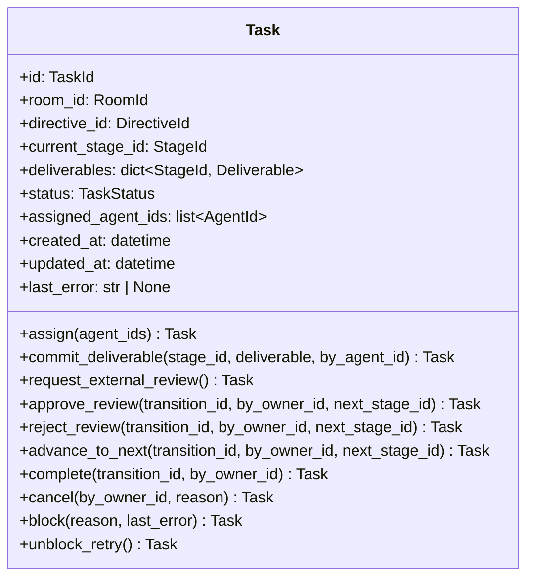

# 詳細設計書

> feature: `task`
> 関連: [basic-design.md](basic-design.md) / [`docs/architecture/domain-model/aggregates.md`](../../architecture/domain-model/aggregates.md) §Task / [`storage.md`](../../architecture/domain-model/storage.md) §Deliverable / §Attachment

## 記述ルール（必ず守ること）

詳細設計に**疑似コード・サンプル実装（python/ts/sh/yaml 等の言語コードブロック）を書かない**。
ソースコードと二重管理になりメンテナンスコストしか生まない。
必要なのは「構造契約（属性名・型・制約）」と「確定文言（メッセージ文字列）」と「実装の意図」。

## クラス設計（詳細）

### Aggregate Root: Task

| 属性 | 型 | 制約 | 意図 |
|----|----|----|----|
| `id` | `TaskId`（UUIDv4） | 不変 | 一意識別 |
| `room_id` | `RoomId`（UUIDv4） | 不変、参照のみ | 所属する Room（参照整合性は application 層） |
| `directive_id` | `DirectiveId`（UUIDv4） | 不変、参照のみ | 起点となった Directive |
| `current_stage_id` | `StageId`（UUIDv4） | 参照のみ。Workflow 内存在検証は application 層 | 現 Stage |
| `deliverables` | `dict[StageId, Deliverable]` | dict 型レベルで key 一意性、空 dict 既定。同 Stage への 2 回目 commit は dict 上書き（§確定 R1-E） | Stage ごとの最新成果物スナップショット |
| `status` | `TaskStatus` | 6 値（PENDING / IN_PROGRESS / AWAITING_EXTERNAL_REVIEW / BLOCKED / DONE / CANCELLED） | 全体状態 |
| `assigned_agent_ids` | `list[AgentId]` | 重複なし、最大 5 件 | 現 Stage に割当中の Agent（順序保持、empire の `agents` と同方針） |
| `created_at` | `datetime` | UTC、tz-aware（naive datetime は `pydantic.ValidationError`） | 起票時刻 |
| `updated_at` | `datetime` | UTC、tz-aware、`created_at ≤ updated_at` | 最終更新時刻 |
| `last_error` | `str \| None` | None or 1〜10000 文字（NFC 正規化のみ・strip しない、空文字列禁止）。`status == BLOCKED` ⇔ 非空文字列 | LLM Adapter の例外メッセージ（BLOCKED 隔離理由） |

`model_config`:
- `frozen = True`
- `arbitrary_types_allowed = False`
- `extra = 'forbid'`

**不変条件（model_validator(mode='after')）**:
1. `_validate_assigned_agents_unique` — `assigned_agent_ids` に重複なし
2. `_validate_assigned_agents_capacity` — `len(assigned_agent_ids) <= 5`
3. `_validate_last_error_consistency` — `status == BLOCKED ⇔ last_error is not None and last_error != ''`、`status != BLOCKED ⇔ last_error is None`
4. `_validate_blocked_has_last_error` — `status == BLOCKED` のとき `last_error` の NFC 正規化後 length が 1〜10000
5. `_validate_timestamp_order` — `created_at <= updated_at`

**不変条件（application 層責務、Aggregate 内では守らない、§確定 R1-A）**:
- `current_stage_id` の Workflow 内存在 — `TaskService` が `WorkflowRepository.find_by_id` で確認
- `assigned_agent_ids` の各 AgentId が Room.members 内 — 同上、`RoomRepository.find_by_id` で確認
- `transition_id` / `next_stage_id` の Workflow 内存在 — `TaskService.approve_review()` / `reject_review()` / `advance_to_next()` / `complete()` で確認
- 現 Stage の `kind == EXTERNAL_REVIEW`（`request_external_review` 呼び出し前提） — `TaskService.request_external_review()` で確認
- `commit_deliverable` の `by_agent_id` が `assigned_agent_ids` 内 — `TaskService.commit_deliverable()` で確認
- 現 Stage の `kind` が終端（`complete` 呼び出し前提） — `TaskService.complete()` で確認

**ふるまい**（全 10 種、すべて新インスタンス返却。**method 名 = action 名で 1:1 対応**、§確定 A-2 の dispatch 表で凍結）:
- `assign(agent_ids: list[AgentId]) -> Task`: PENDING → IN_PROGRESS、`assigned_agent_ids` 更新
- `commit_deliverable(stage_id: StageId, deliverable: Deliverable, by_agent_id: AgentId) -> Task`: IN_PROGRESS の自己遷移、`deliverables[stage_id] = deliverable` を更新
- `request_external_review() -> Task`: IN_PROGRESS → AWAITING_EXTERNAL_REVIEW
- `approve_review(transition_id: TransitionId, by_owner_id: OwnerId, next_stage_id: StageId) -> Task`: AWAITING_EXTERNAL_REVIEW → IN_PROGRESS（Gate APPROVED 経路、`next_stage_id` は次 Stage）
- `reject_review(transition_id: TransitionId, by_owner_id: OwnerId, next_stage_id: StageId) -> Task`: AWAITING_EXTERNAL_REVIEW → IN_PROGRESS（Gate REJECTED 経路、`next_stage_id` は差し戻し先 Stage）
- `advance_to_next(transition_id: TransitionId, by_owner_id: OwnerId, next_stage_id: StageId) -> Task`: IN_PROGRESS の自己遷移、`current_stage_id = next_stage_id`（EXTERNAL_REVIEW を経由しない通常進行）
- `complete(transition_id: TransitionId, by_owner_id: OwnerId) -> Task`: IN_PROGRESS → DONE（terminal、`current_stage_id` は終端 Stage のまま不変）
- `cancel(by_owner_id: OwnerId, reason: str) -> Task`: PENDING / IN_PROGRESS / AWAITING_EXTERNAL_REVIEW / BLOCKED → CANCELLED
- `block(reason: str, last_error: str) -> Task`: IN_PROGRESS → BLOCKED、`last_error` 必須
- `unblock_retry() -> Task`: BLOCKED → IN_PROGRESS、`last_error=None`

### Module: state_machine（`domain/task/state_machine.py`）

state machine の決定表（§確定 R1-A）。**`Mapping[tuple[TaskStatus, str], TaskStatus]`** として module-level 定数で凍結。**action 名 = Task method 名と 1:1 対応**（§確定 A-2 dispatch 表で凍結、揺れゼロ）。

| key（`(current_status, action)`） | value（`next_status`） |
|---|---|
| `(PENDING, 'assign')` | `IN_PROGRESS` |
| `(PENDING, 'cancel')` | `CANCELLED` |
| `(IN_PROGRESS, 'commit_deliverable')` | `IN_PROGRESS`（自己遷移、deliverables 更新のみ） |
| `(IN_PROGRESS, 'request_external_review')` | `AWAITING_EXTERNAL_REVIEW` |
| `(IN_PROGRESS, 'advance_to_next')` | `IN_PROGRESS`（自己遷移、current_stage_id 更新） |
| `(IN_PROGRESS, 'complete')` | `DONE` |
| `(IN_PROGRESS, 'block')` | `BLOCKED` |
| `(IN_PROGRESS, 'cancel')` | `CANCELLED` |
| `(AWAITING_EXTERNAL_REVIEW, 'approve_review')` | `IN_PROGRESS` |
| `(AWAITING_EXTERNAL_REVIEW, 'reject_review')` | `IN_PROGRESS` |
| `(AWAITING_EXTERNAL_REVIEW, 'cancel')` | `CANCELLED` |
| `(BLOCKED, 'unblock_retry')` | `IN_PROGRESS` |
| `(BLOCKED, 'cancel')` | `CANCELLED` |

合計 **13 遷移を明示列挙**。それ以外の `(status, action)` 組合せは **table に存在しない** ことで明示禁止（lookup 失敗 → caller が `TaskInvariantViolation` を raise）。

| 関数 | 引数 | 戻り値 | 制約 |
|----|----|----|----|
| `lookup(current_status: TaskStatus, action: str) -> TaskStatus` | `(current_status, action)` | `TaskStatus`（許可遷移先） | table 不在時は `KeyError` を raise（caller の `task.py` 側で `TaskInvariantViolation(kind='state_transition_invalid')` に変換） |

`action` は `Literal['assign', 'commit_deliverable', 'request_external_review', 'approve_review', 'reject_review', 'advance_to_next', 'complete', 'block', 'unblock_retry', 'cancel']` の **10 値**で型レベル制約。**Task の 10 method 名と 1:1 対応**（§確定 A-2 dispatch 表）。

### Exception: TaskInvariantViolation

| 属性 | 型 | 制約 |
|----|----|----|
| `message` | `str` | MSG-TS-NNN 由来の文言（webhook URL は `<REDACTED:DISCORD_WEBHOOK>` 化済み） |
| `detail` | `dict[str, object]` | 違反の文脈（webhook URL は `mask_discord_webhook_in` で再帰的に伏字化済み） |
| `kind` | `Literal['terminal_violation', 'state_transition_invalid', 'assigned_agents_unique', 'assigned_agents_capacity', 'last_error_consistency', 'blocked_requires_last_error', 'timestamp_order']` | 違反種別 |

`Exception` 継承。`domain/exceptions.py` の他の例外（empire / workflow / agent / room / directive）と統一フォーマット。**`super().__init__` 前に `message` を `mask_discord_webhook` で、`detail` を `mask_discord_webhook_in` で伏字化する**（5 兄弟と同パターン、多層防御、§確定 R1-F）。

### VO: Deliverable（`domain/value_objects.py` 既存ファイル更新、§確定 R1-E）

| 属性 | 型 | 制約 |
|----|----|----|
| `stage_id` | `StageId`（UUIDv4） | 不変 |
| `body_markdown` | `str` | 0〜1,000,000 文字。永続化前マスキング対象（task-repository PR #35 で `MaskedText` 配線） |
| `attachments` | `list[Attachment]` | 0 件以上、frozen list（Pydantic v2 で immutable コンテナ） |
| `committed_by` | `AgentId`（UUIDv4） | 不変 |
| `committed_at` | `datetime` | UTC、tz-aware |

`model_config`: frozen / extra='forbid' / arbitrary_types_allowed=False。

### VO: Attachment（同上）

| 属性 | 型 | 制約 |
|----|----|----|
| `sha256` | `str` | 正規表現 `^[a-f0-9]{64}$`（小文字 hex 64 文字） |
| `filename` | `str` | 1〜255 文字、storage.md §filename サニタイズ規則 6 項目すべて準拠 |
| `mime_type` | `str` | storage.md §MIME ホワイトリスト 7 種のいずれか |
| `size_bytes` | `int` | 0 ≤ x ≤ 10485760（10 MiB） |

`field_validator` で各検査:
- `sha256`: regex match
- `filename`: NFC 正規化 → 文字数 → 拒否文字 → 拒否シーケンス → Windows 予約名 → `os.path.basename()` 一致の 6 段階検査（storage.md §filename サニタイズ規則）
- `mime_type`: ホワイトリスト集合内
- `size_bytes`: 範囲

## 確定事項（先送り撤廃）

### 確定 A: pre-validate 方式は Pydantic v2 model_validate 経由（5 兄弟と同パターン）

各ふるまいの手順:

1. terminal 検査（DONE / CANCELLED → `TaskInvariantViolation(kind='terminal_violation')` を raise）
2. state machine table lookup（**自分の method 名 = action 名で `state_machine.lookup(self.status, '<method_name>')` を呼ぶ**、§確定 A-2、lookup 失敗 → `state_transition_invalid` で raise）
3. `self.model_dump(mode='python')` で現状を dict 化
4. dict 内の該当属性を新値で更新（status / assigned_agent_ids / deliverables / current_stage_id / last_error / updated_at）
5. `Task.model_validate(updated_dict)` を呼ぶ — `model_validator(mode='after')` が走る
6. 失敗時は `ValidationError` を `TaskInvariantViolation` に変換して raise（pre-validate なので元 Task は変更されない）

`model_copy(update=...)` は採用しない（5 兄弟同方針）。

### 確定 A-2: Method × current_status → action 名 dispatch 表（**揺れ撤廃の凍結**、Steve 指摘 R2 応答）

##### 採用方針: **(B) 専用 method 分離**（method 名 = action 名で 1:1 対応、`gate_decision: ReviewDecision` 引数追加は不採用）

Task の各 method が呼ばれたとき、内部で「current_status を見て action を組み立てる」**動的 dispatch を排除**する。method × current_status の組み合わせに対する許可遷移は以下の表で**完全に静的**に決まる（dispatch ロジック不要、引数による分岐なし）:

| method | PENDING | IN_PROGRESS | AWAITING_EXTERNAL_REVIEW | BLOCKED | DONE | CANCELLED |
|---|---|---|---|---|---|---|
| `assign` | → IN_PROGRESS | ✗ | ✗ | ✗ | ✗ | ✗ |
| `commit_deliverable` | ✗ | → IN_PROGRESS（自己） | ✗ | ✗ | ✗ | ✗ |
| `request_external_review` | ✗ | → AWAITING_EXTERNAL_REVIEW | ✗ | ✗ | ✗ | ✗ |
| `approve_review` | ✗ | ✗ | **→ IN_PROGRESS（次 Stage）** | ✗ | ✗ | ✗ |
| `reject_review` | ✗ | ✗ | **→ IN_PROGRESS（差し戻し先 Stage）** | ✗ | ✗ | ✗ |
| `advance_to_next` | ✗ | → IN_PROGRESS（自己） | ✗ | ✗ | ✗ | ✗ |
| `complete` | ✗ | → DONE（terminal） | ✗ | ✗ | ✗ | ✗ |
| `cancel` | → CANCELLED | → CANCELLED | → CANCELLED | → CANCELLED | ✗ | ✗ |
| `block` | ✗ | → BLOCKED | ✗ | ✗ | ✗ | ✗ |
| `unblock_retry` | ✗ | ✗ | ✗ | → IN_PROGRESS | ✗ | ✗ |

**読み方**: 各 method（行）と current_status（列）の交点が
- `→ <next_status>`: 許可遷移、§確定 B の state machine table に対応行が存在
- `✗`: 不正、§確定 B table に行なし → `state_transition_invalid` で Fail Fast
- DONE / CANCELLED の列はすべて `✗`（§確定 R1-B の terminal violation で先頭 Fail Fast、state machine table にも到達しない）

合計 **13 ✓ 遷移**（§確定 B の 13 行と完全一致）+ 47 ✗ セル。**`✓ 13 = state machine table 13 = lookup 成功経路 13`** で 3 表の整合性が常時保証される（後続 PR が table に行を追加するとき、本 dispatch 表 + state machine table + テストの 3 箇所を**必ず同期更新する責務**）。

##### `AWAITING_EXTERNAL_REVIEW` 起点の dispatch を **専用 method 分離**で凍結する根拠

| 採用 | 不採用 | 理由 |
|---|---|---|
| **(B) 専用 method 分離: `approve_review` / `reject_review` の 2 method** | **(A) `advance(transition_id, gate_decision: ReviewDecision)` 引数追加** | (A) は `gate_decision` で内部分岐するため method 内ロジックが複雑化、Tell Don't Ask 違反（呼び出し側が「Gate の decision を Task に問い合わせて分岐」する読み方になりやすい）。さらに Task が `ReviewDecision`（Gate Aggregate VO）を import することになり**Aggregate 境界違反**（empire-repo PR #29 §確定 A の依存方向違反と同じ匂い）|
| | (C) `advance(transition_id, action: Literal['approve_review', 'reject_review'])` 引数追加 | action を文字列引数で渡すのは「method 名がランタイム値」になる anti-pattern。method 名で意図を表明する DDD 原則に反する |

##### 3 PR 連鎖で本凍結が前提となる根拠（Steve 指摘 R2 の凍結要求）

本 §確定 A-2 が後続 3 PR の前提となる:

| 後続 PR | 本凍結への依存 |
|---|---|
| `feature/task-repository`（Issue #35） | `tasks.status` の遷移ログ / `audit_log` の `command` 列で **method 名 = action 名 = audit 操作名**として SQL レベル一致を保証（揺れた action 名 / method 名が混在すると audit ログの集計が壊れる） |
| `feature/external-review-gate-aggregate`（後続 Issue 起票） | Gate の `approve(by_owner_id, comment)` / `reject(by_owner_id, comment)` ふるまいが完了したとき、application 層 `GateService` が **`task.approve_review(...)`** / **`task.reject_review(...)`** を呼ぶ。method 名が Gate 側 ふるまい名と直交対称（`approve` ↔ `approve_review`、`reject` ↔ `reject_review`）で、application 層の dispatch 実装が `if gate.decision == APPROVED: task.approve_review(...)` と一意に決まる |
| `feature/external-review-gate-repository`（後続 Issue 起票） | `external_review_gates.decision` の 4 値（PENDING/APPROVED/REJECTED/CANCELLED）と Task method の 1:1 対応を application 層で実装する際、**Task method 数 10 + Gate decision 値 4 が直交独立**で凍結される（Gate decision 値が 5 種に増えても Task method を増やすだけ） |

本確定により、Task / Gate の Aggregate 境界 + dispatch logic が application 層に明示的に閉じる構造を凍結する。

### 確定 B: state machine table のロック方式

`state_machine.py` の table は **module-level の `Final[Mapping]`** として定義し、import 時に凍結する:

| 措置 | 内容 |
|---|---|
| `Final` 型注釈 | pyright が再代入を検出 |
| `MappingProxyType` ラップ | runtime 上で setitem を拒否 |
| 公開 API は `lookup()` 関数のみ | table を直接公開しない（責務散在防止） |

table の追加・削除は本ファイルの修正 PR を要する。後続 PR が「assign を BLOCKED でも呼べる」等の遷移追加を試みると、本ファイル修正 + テスト修正が同期して必要になり、誤った遷移追加を物理的に難しくする。

### 確定 C: `last_error` の正規化パイプラインと長さ判定

`Persona.prompt_body` / `PromptKit.prefix_markdown` / `Directive.text` と同じく **NFC 正規化のみ、strip しない**:

#### 正規化パイプライン（`block(reason, last_error)` 内、順序固定）

1. 引数 `last_error: str` を受け取る
2. `normalized = unicodedata.normalize('NFC', last_error)` で NFC 正規化
3. `length = len(normalized)` で Unicode コードポイント数を計上（**strip は適用しない**）
4. 範囲判定（`1 <= length <= 10000`）
5. 通過時のみ `Task.last_error = normalized` で保持

#### `last_error` を strip しない理由

- LLM Adapter のエラーメッセージは複数行の stack trace を含む可能性
- `'AuthExpired: token rotation failed\n  at AnthropicClient.send\n  at Dispatcher.dispatch'` のような構造を保持
- agent §確定 E §適用範囲表で `Persona.prompt_body` を strip しないと凍結した先例と同方針

#### コンストラクタ経路の不変条件（永続化からの復元時）

`Task(status=BLOCKED, last_error='...')` での直接構築でも `_validate_blocked_has_last_error` が走る。Repository が壊れた行（`status=BLOCKED` で `last_error=None`）を返した場合、構築時点で Fail Fast。

### 確定 D: `unblock_retry()` の `last_error` クリア（§確定 R1-D 詳細）

`unblock_retry()` は state machine 上 BLOCKED → IN_PROGRESS の遷移。`_rebuild_with_state(status=IN_PROGRESS, last_error=None, updated_at=now)` で **`last_error` を必ず None にリセット**する。

| 入力 Task | 期待される新 Task |
|---|---|
| status=BLOCKED, last_error='AuthExpired: ...' | status=IN_PROGRESS, last_error=None |

`_validate_last_error_consistency` で「status != BLOCKED ⇔ last_error is None」が保証されるため、これを破る経路は構造的に存在しない。

### 確定 E: `cancel()` の任意遷移（§確定 R1-A 補足）

state machine table で `(PENDING, 'cancel')` / `(IN_PROGRESS, 'cancel')` / `(AWAITING_EXTERNAL_REVIEW, 'cancel')` / `(BLOCKED, 'cancel')` の 4 行をすべて `CANCELLED` に明示マッピング。

| 採用 | 不採用 | 理由 |
|---|---|---|
| **(a) 4 行を明示列挙** | (b) `cancel()` ふるまい内で `if self.status == DONE/CANCELLED: raise` だけ書いて state machine table を経由しない | (b) は terminal 検査と state machine 検査の責務を分散させる。table に明示することで「どの状態から cancel 可能か」が一覧で読める設計書になる |
| | (c) `cancel(force: bool=False)` のように force flag を追加 | DONE / CANCELLED から cancel する業務シナリオはない（既に terminal）。force flag は YAGNI |

### 確定 F: `assigned_agent_ids` の重複チェックは Aggregate 内（room §確定 R1-D の継承）

| 検査項目 | Aggregate 内 | application 層 |
|---|---|---|
| `assigned_agent_ids` 重複（同 AgentId が 2 回） | ✓（構造的、`_validate_assigned_agents_unique`） | ✗ |
| `assigned_agent_ids` 容量（最大 5 件） | ✓（構造的、`_validate_assigned_agents_capacity`） | ✗ |
| 各 AgentId が Room.members 内 | ✗ | ✓（外部知識、`RoomRepository.find_by_id`） |

room §確定 R1-D で「`members` 重複チェックは Aggregate 内、参照整合性は application 層」と凍結した先例と同パターン。

### 確定 G: `commit_deliverable` の `by_agent_id` 検査の責務分離

| 検査項目 | Aggregate 内 | application 層 |
|---|---|---|
| `by_agent_id` が `assigned_agent_ids` 内 | ✗ | ✓（`TaskService.commit_deliverable()` で確認） |
| `by_agent_id` が valid な UUID | ✓（Pydantic 型） | — |

理由: `assigned_agent_ids` 検査は Aggregate 内属性での自己整合性検査だが、`by_agent_id` はふるまい引数で「呼び出し側が責任を持って渡す」値。directive §確定 G の `target_room_id` を application 層で検査する先例と同方針。

ただし「`assigned_agent_ids = []` の Task に `commit_deliverable` を呼べるか」については、Aggregate 内では `by_agent_id` を見ないため呼べてしまう。これは state machine 上 `IN_PROGRESS` 遷移を経るには必ず `assign` で `assigned_agent_ids` を埋める必要があり、`PENDING + commit_deliverable` は `state_transition_invalid` で弾かれる。よって構造的に `assigned_agent_ids = []` のままで `commit_deliverable` には到達しない。

### 確定 H: `_rebuild_with_state` ふるまいの返り値型と元 Task 不変性

各ふるまいは `Task` を新インスタンスとして返す。empire / workflow / agent / room / directive と同じく frozen の制約上、状態変更は新インスタンス返却。

| 入力 Task | ふるまい | 返り値 | 元 Task |
|---|---|---|---|
| status=PENDING, assigned_agent_ids=[] | `assign([agent_a])` | 新 Task（status=IN_PROGRESS, assigned_agent_ids=[agent_a]） | 不変 |
| status=IN_PROGRESS, deliverables={} | `commit_deliverable(stage_a, d_1, agent_a)` | 新 Task（deliverables={stage_a: d_1}） | 不変 |
| status=DONE | 任意のふるまい | 例外 raise | 不変 |

冪等性は持たない — 同じ assign を 2 回呼ぶと 1 回目は OK（PENDING → IN_PROGRESS）、2 回目は state machine lookup 失敗（IN_PROGRESS から assign は table に不在）。「2 回目は no-op」設計は state machine table を複雑化するため不採用（directive §確定 D の冪等性なし契約と同方針）。

### 確定 I: `TaskInvariantViolation` の webhook auto-mask 経路（§確定 R1-F 詳細）

5 兄弟と同じく `TaskInvariantViolation.__init__` で:

1. `super().__init__` 前に `mask_discord_webhook(message)` を message に適用
2. `detail` に対し `mask_discord_webhook_in(detail)` を再帰的に適用
3. `kind` は enum 文字列のため mask 対象外
4. その後 `super().__init__(masked_message)` を呼ぶ

これにより `TaskInvariantViolation` の `str(exc)` / `exc.detail` のいずれを取り出しても webhook URL が伏字化済みであることを物理的に保証する（多層防御）。

#### `TaskInvariantViolation` で webhook が混入する経路

| 経路 | 例 |
|----|----|
| `block` ふるまいで last_error に webhook を含む文字列 | LLM Adapter エラーが webhook URL を含む長文の場合、length 違反 + webhook 漏洩のリスク → 例外 detail に last_error の prefix が含まれる |
| `state_transition_invalid` 例外の detail | 不正遷移時に Task の現状を detail に含める実装で、もし `last_error` を detail に乗せたら漏洩経路になる → `mask_discord_webhook_in(detail)` で守る |
| `commit_deliverable` で deliverable.body_markdown に webhook | Deliverable VO 自体は raw 保持だが、TaskInvariantViolation 経路で detail に乗ると漏洩 → 同上で守る |

UI 側 / Repository 側でも入力時マスキング / 永続化前マスキングを実装するが、本 Aggregate 層では「例外経路で漏れない」ことを単独で保証する責務を持つ（多層防御）。

### 確定 J: 例外型統一規約と「揺れ」の凍結（room §確定 I 踏襲）

| 違反種別 | 例外型 | 発生レイヤ | 凍結する `kind` 値 |
|---|---|---|---|
| terminal 違反 | `TaskInvariantViolation` | 各ふるまい入口 | `terminal_violation` |
| state machine 不正遷移 | `TaskInvariantViolation` | 各ふるまい中の lookup | `state_transition_invalid` |
| 構造的不変条件違反 | `TaskInvariantViolation` | `model_validator(mode='after')` | `assigned_agents_unique` / `assigned_agents_capacity` / `last_error_consistency` / `blocked_requires_last_error` / `timestamp_order` |
| 型違反 / 必須欠落 | `pydantic.ValidationError` | Pydantic 型バリデーション（`mode='after'` より前） | — |
| application 層の参照整合性違反 | `TaskNotFoundError` 等 | `TaskService` 系 | — |

##### MSG ID と例外型の対応（凍結）

| MSG ID | 例外型 | kind |
|---|---|---|
| MSG-TS-001 | `TaskInvariantViolation` | `terminal_violation` |
| MSG-TS-002 | `TaskInvariantViolation` | `state_transition_invalid` |
| MSG-TS-003 | `TaskInvariantViolation` | `assigned_agents_unique` |
| MSG-TS-004 | `TaskInvariantViolation` | `assigned_agents_capacity` |
| MSG-TS-005 | `TaskInvariantViolation` | `last_error_consistency` |
| MSG-TS-006 | `TaskInvariantViolation` | `blocked_requires_last_error` |
| MSG-TS-007 | `TaskInvariantViolation` | `timestamp_order` |
| MSG-TS-008 | `pydantic.ValidationError` | （型違反全般、kind 概念なし） |
| MSG-TS-009 | `pydantic.ValidationError` | （Attachment サニタイズ / ホワイトリスト違反） |
| MSG-TS-010 | `TaskNotFoundError` | （application 層） |

### 確定 K: 「Aggregate 内検査と application 層検査」の責務分離マトリクス

| 検査項目 | Aggregate 内 | application 層 |
|---|---|---|
| `assigned_agent_ids` 重複なし | ✓（`_validate_assigned_agents_unique`） | ✗ |
| `assigned_agent_ids` 容量 ≤ 5 | ✓（`_validate_assigned_agents_capacity`） | ✗ |
| `last_error` consistency（status との整合） | ✓（`_validate_last_error_consistency`） | ✗ |
| BLOCKED 時 `last_error` 必須 | ✓（`_validate_blocked_has_last_error`） | ✗ |
| `created_at <= updated_at` | ✓（`_validate_timestamp_order`） | ✗ |
| state machine 遷移ルール | ✓（state_machine.py + 各ふるまい入口） | ✗ |
| terminal 検査（DONE / CANCELLED） | ✓（各ふるまい入口） | ✗ |
| `current_stage_id` の Workflow 内存在 | ✗ | ✓（`TaskService.approve_review()` / `reject_review()` / `advance_to_next()` / `complete()` で `WorkflowRepository.find_by_id`） |
| `assigned_agent_ids` 各 AgentId が Room.members 内 | ✗ | ✓（`TaskService.assign()` で `RoomRepository.find_by_id`） |
| `transition_id` / `next_stage_id` の Workflow 内存在 | ✗ | ✓（同上、Stage 進行系 4 method 共通） |
| 現 Stage の `kind == EXTERNAL_REVIEW`（request_external_review 前提） | ✗ | ✓（`TaskService.request_external_review()` で `WorkflowRepository.find_by_id`） |
| 現 Stage の `kind` が終端（complete 前提） | ✗ | ✓（`TaskService.complete()` で `WorkflowRepository.find_by_id` + Workflow.transitions に出辺なし or terminal Stage 集合に含まれることを確認） |
| `commit_deliverable` の `by_agent_id` が `assigned_agent_ids` 内 | ✗ | ✓（`TaskService.commit_deliverable()` で確認、§確定 G） |
| Gate decision → Task method dispatch（APPROVED → `approve_review`、REJECTED → `reject_review`） | ✗ | ✓（`GateService.approve()` / `reject()` 完了後の連鎖呼び出し、§確定 A-2 の 3 PR 連鎖契約） |

## 設計判断の補足

### なぜ state machine を decision table 化するか

`if-elif` 分岐実装の問題:

- 6 status × 10 method = **60 経路** のうち実際に許可されるのは **13 遷移** のみ
- 残り 47 経路は「許可されない」を if 分岐で書くと暗黙の拒否経路になり、後続 PR で「`unblock_retry` を IN_PROGRESS でも呼べる」等の誤実装が紛れ込む退行リスクが高い
- 設計書で「table に存在しない遷移は禁止」と明示することで、code review / test 設計時に「許可される 13 経路のみを網羅」が機械的に確認できる

state machine table を **`Final` + `MappingProxyType`** で凍結する（§確定 B）ことで、後続 PR の遷移追加を物理的に難しくし、設計書の修正と同期して行わせる。

### なぜ `advance` を 4 method（`approve_review` / `reject_review` / `advance_to_next` / `complete`）に分解するか

§確定 A-2 で凍結した通り、初版設計では `advance(transition_id, by_owner_id, next_stage_id, is_terminal: bool)` の単一 method が以下の 4 経路で振る舞いを変える設計だった:

| current_status | 引数条件 | 旧 action 名 |
|---|---|---|
| `IN_PROGRESS` | `is_terminal=False` | `advance_to_next` |
| `IN_PROGRESS` | `is_terminal=True` | `advance_to_done` |
| `AWAITING_EXTERNAL_REVIEW` | `gate_decision=APPROVED` | `gate_approved` |
| `AWAITING_EXTERNAL_REVIEW` | `gate_decision=REJECTED` | `gate_rejected` |

これは **method 内部で current_status と引数を見て action を組み立てる暗黙の dispatch** が走る設計で、3 つの問題を抱えていた:

| 問題 | 内容 |
|---|---|
| **(1) Tell, Don't Ask 違反** | application 層が `task.status` / `gate.decision` を見てから `task.advance(..., gate_decision=APPROVED)` と引数を組み立てる読み方になり、Task に「どう振る舞うか」を伝える形ではなく「Task の状態を見て分岐」する読み方になりやすい |
| **(2) Aggregate 境界違反** | Task が `ReviewDecision`（Gate Aggregate VO）を import することになり、依存方向 `domain ← application ← infrastructure` のうち domain 内で別 Aggregate VO を import する逆方向流入が発生する |
| **(3) 3 PR 連鎖の前提が揺れる** | task-repository / external-review-gate-aggregate / external-review-gate-repository の 3 PR が「method × current_status → action」の対応を**個別に解釈**することになり、整合性の局所最適化を後続 PR で繰り返す退行リスクが高い |

専用 method 分離（§確定 A-2 採用）により:

- method 名が**呼び出し側の意図を直接表明**（`task.approve_review(...)` ↔ `task.reject_review(...)`、Tell Don't Ask 遵守）
- Task は `ReviewDecision` を**一切 import しない**（Aggregate 境界保護）
- method × current_status → action が **1:1 静的対応**で揺れゼロ（dispatch 表で凍結）
- 3 PR 連鎖の前提が「Gate decision → Task method 名」の単一の対応関係（APPROVED → `approve_review` / REJECTED → `reject_review`）で全 PR が同じ参照源を読む

method 数は 7 → 10 に増えるが、各 method の責務が単一化し、test の網羅性も向上する（method ごとに正常系・異常系を独立して test、§test-design.md 参照）。

### なぜ `assigned_agent_ids` を List で保持するか

empire の `agents: list[AgentRef]` で**順序保持**を凍結済み（割当順が UI 表示順を決める）。Set にすると Pydantic v2 の serialize で順序が非決定論になり、Repository 永続化時に diff ノイズが出る。List + 重複チェック helper で凍結（§確定 F）。

### なぜ `cancel(by_owner_id, reason)` の reason を Aggregate 属性として持たないか

`cancel(by_owner_id, reason)` の `reason` は audit 情報。Aggregate 属性として持たない理由:

- `reason` を持つと「CANCELLED の Task の reason は何か」が業務上見えるが、MVP では UI に CANCELLED Task の reason 表示は出ない
- audit_log（admin CLI 経由のすべての操作を記録、storage.md §Admin CLI 監査ログ）に application 層が記録する責務
- Aggregate を pure data に保ちたい（reason 引数は監査用 metadata）

### なぜ `created_at` / `updated_at` を引数で受け取るか

`datetime.now(timezone.utc)` を Aggregate 内で自動生成すると freezegun 等での test 制御が必要。application 層で生成して引数渡しすることで Aggregate 自体は時刻に依存しない pure data になり、test 容易性が向上（directive §設計判断補足の `created_at` 議論と同方針）。

### なぜ `Deliverable` / `Attachment` を本 PR で導入するか

`storage.md` §Deliverable / §Attachment で属性定義は凍結済みだが、Pydantic v2 BaseModel として実体化されていない。Task Aggregate が `deliverables: dict[StageId, Deliverable]` で参照するため、forward reference で逃げると後続 PR で `model_rebuild` が必要になり構造が複雑化。本 PR で同時に導入する（§確定 R1-E）。

### なぜ自己遷移（`commit_deliverable` / `advance_to_next`）を state machine に明示列挙するか

state を変えない自己遷移を table に載せるのは、**「IN_PROGRESS でのみ許可」を表で読めるようにするため**（§確定 A-2 dispatch 表 + §確定 B lookup の整合性）。PENDING / AWAITING / BLOCKED / DONE / CANCELLED で呼べば lookup 失敗 → `state_transition_invalid` で Fail Fast、code review が機械的になる。

## ユーザー向けメッセージの確定文言

### プレフィックス統一

| プレフィックス | 意味 |
|--------------|-----|
| `[FAIL]` | 処理中止を伴う失敗 |
| `[OK]` | 成功完了 |

### MSG 確定文言表

各メッセージは **「失敗内容（What）」+「次に何をすべきか（Next Action）」の 2 行構造**を採用する（§確定 J、room §確定 I 踏襲）。例外 message は改行（`\n`）区切りで 2 行を保持する。

| ID | 例外型 | 文言（1 行目: failure / 2 行目: next action） |
|----|------|----|
| MSG-TS-001 | `TaskInvariantViolation(kind='terminal_violation')` | `[FAIL] Task is in terminal state {status} and cannot be modified: task_id={task_id}` / `Next: Check Task status before invoking behaviors; DONE/CANCELLED Tasks are immutable.` |
| MSG-TS-002 | `TaskInvariantViolation(kind='state_transition_invalid')` | `[FAIL] Invalid state transition: {current_status} cannot perform '{action}' (allowed actions from {current_status}: {allowed_actions})` / `Next: Verify Task lifecycle; review state_machine.py for the allowed transitions table.` |
| MSG-TS-003 | `TaskInvariantViolation(kind='assigned_agents_unique')` | `[FAIL] Task assigned_agent_ids must not contain duplicates: duplicates={duplicate_ids}` / `Next: Deduplicate the agent_ids list before calling assign(); each Agent may appear at most once.` |
| MSG-TS-004 | `TaskInvariantViolation(kind='assigned_agents_capacity')` | `[FAIL] Task assigned_agent_ids exceeds capacity: got {count}, max 5` / `Next: Reduce the number of assigned agents to <=5; split work into multiple Tasks if more parallelism is needed.` |
| MSG-TS-005 | `TaskInvariantViolation(kind='last_error_consistency')` | `[FAIL] Task last_error consistency violation: status={status} but last_error={last_error_present}` / `Next: last_error must be a non-empty string when status==BLOCKED, and None otherwise; check Repository row integrity.` |
| MSG-TS-006 | `TaskInvariantViolation(kind='blocked_requires_last_error')` | `[FAIL] Task block() requires non-empty last_error (got NFC-normalized length={length})` / `Next: Provide a non-empty last_error string (1-10000 chars) describing why the Task is blocked; an empty string is rejected.` |
| MSG-TS-007 | `TaskInvariantViolation(kind='timestamp_order')` | `[FAIL] Task timestamp order violation: created_at={created_at} > updated_at={updated_at}` / `Next: Verify timestamp generation; updated_at must be >= created_at, both UTC tz-aware.` |
| MSG-TS-008 | `pydantic.ValidationError`（Task VO 構築時） | `[FAIL] Task type validation failed: {field}={value!r}` / `Next: Verify field types — id/room_id/directive_id/current_stage_id are UUIDv4, status is TaskStatus enum, timestamps are UTC tz-aware.` — Pydantic 標準のメッセージに 2 行構造を application 層でラップ |
| MSG-TS-009 | `pydantic.ValidationError`（Attachment 構築時） | `[FAIL] Attachment validation failed: {field}={value!r} ({reason})` / `Next: Verify sha256 (64 hex), filename (sanitized), mime_type (whitelist), size_bytes (<=10MiB) per storage.md.` |
| MSG-TS-010 | `TaskNotFoundError`（application 層） | `[FAIL] Task not found: task_id={task_id}` / `Next: Verify the task_id via GET /tasks; the Task may have been deleted or never created.` |

##### 「Next:」行の役割（フィードバック原則）

- **発行レイヤを跨いで一貫**: 例外 message / API レスポンスの `error.next_action` フィールド / UI の Toast 2 行目 / CLI の stderr 2 行目に**同一文言**を流す
- **i18n 入口**: Phase 2 で UI 側 i18n を入れる際、`MSG-TS-NNN.failure` / `MSG-TS-NNN.next` の 2 キー × 言語数で翻訳テーブルが作れる
- **検証可能性**: test-design.md の TC-UT-TS-NNN で `assert "Next:" in str(exc)` を含めることで「hint 必須」を CI で物理保証する

メッセージは ASCII 範囲（プレースホルダ `{...}` は f-string 形式）。日本語化は UI 側 i18n（Phase 2）。本 feature の例外メッセージは英語固定。

## データ構造（永続化キー）

該当なし — 理由: 本 feature は domain 層のみで永続化スキーマは含まない。永続化は `feature/task-repository`（Issue #35）で扱う（M2 永続化基盤完了後）。

参考の概形:

| カラム | 型 | 制約 | 意図 |
|-------|----|----|----|
| `tasks.id` | `UUIDStr` | PK | TaskId |
| `tasks.room_id` | `UUIDStr` | FK to `rooms.id` | 所属 Room |
| `tasks.directive_id` | `UUIDStr` | FK to `directives.id` | 起点 Directive |
| `tasks.current_stage_id` | `UUIDStr` | NOT NULL（FK 宣言なし、workflow-repository §確定 J 同方針で循環参照回避） | 現 Stage |
| `tasks.status` | `String(32)` | NOT NULL（TaskStatus enum string） | 全体状態 |
| `tasks.last_error` | **`MaskedText`** | NULL or 1〜10000 文字（masking 適用済み） | BLOCKED 隔離理由（storage.md §逆引き表に登録済み） |
| `tasks.created_at` / `updated_at` | `UTCDateTime` | NOT NULL | 監査用 |
| `task_deliverables.body_markdown` | **`MaskedText`** | NOT NULL | masking 対象（storage.md §逆引き表に登録済み） |
| `task_assigned_agents.order_index` | `Integer` | list 順序保持用（empire の room_refs パターン） | — |

## API エンドポイント詳細

該当なし — 理由: 本 feature は domain 層のみ。API は `feature/http-api` で凍結する。

## 出典・参考

- [Pydantic v2 — model_validator / model_validate](https://docs.pydantic.dev/latest/concepts/validators/) — pre-validate 方式の実装根拠
- [Pydantic v2 — frozen models](https://docs.pydantic.dev/latest/concepts/models/) — 不変モデルの挙動
- [Pydantic v2 — StrEnum](https://docs.pydantic.dev/latest/api/standard_library_types/#enum) — TaskStatus / LLMErrorKind 実装根拠
- [Python typing.Literal / Final](https://docs.python.org/3/library/typing.html#typing.Final) — state_machine.py の table 凍結根拠
- [types.MappingProxyType](https://docs.python.org/3/library/types.html#types.MappingProxyType) — runtime 上で Mapping を read-only 化する根拠
- [Unicode Standard Annex #15: Unicode Normalization Forms](https://unicode.org/reports/tr15/) — NFC 正規化の仕様根拠
- [`docs/architecture/domain-model/aggregates.md`](../../architecture/domain-model/aggregates.md) — Task / ExternalReviewGate 凍結済み設計
- [`docs/architecture/domain-model/value-objects.md`](../../architecture/domain-model/value-objects.md) — TaskStatus / LLMErrorKind 凍結済み列挙
- [`docs/architecture/domain-model/storage.md`](../../architecture/domain-model/storage.md) — Deliverable / Attachment 凍結済み + シークレットマスキング規則（`Task.last_error` / `Deliverable.body_markdown` の Repository 永続化時に適用、`feature/task-repository` で配線）
- [`docs/architecture/threat-model.md`](../../architecture/threat-model.md) — A02 / A04 / A09 対応根拠
- [`docs/features/agent/detailed-design.md`](../agent/detailed-design.md) §確定 D / E — pre-validate 方式 / NFC 正規化の先例
- [`docs/features/room/detailed-design.md`](../room/detailed-design.md) §確定 I — 例外型統一規約 + MSG 2 行構造の先例
- [`docs/features/directive/detailed-design.md`](../directive/detailed-design.md) §確定 A〜H — 5 兄弟目の Aggregate パターンの先例
- [Martin Fowler — Replacing Throwing Exceptions with Notification in Validations](https://martinfowler.com/articles/replaceThrowWithNotification.html) — 一般理論として参考（本 PR は Fail Fast 方式採用）
