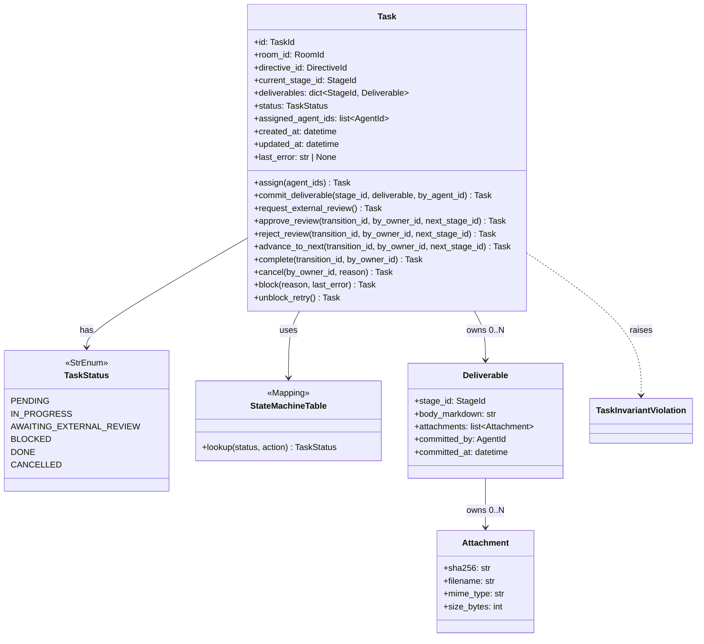
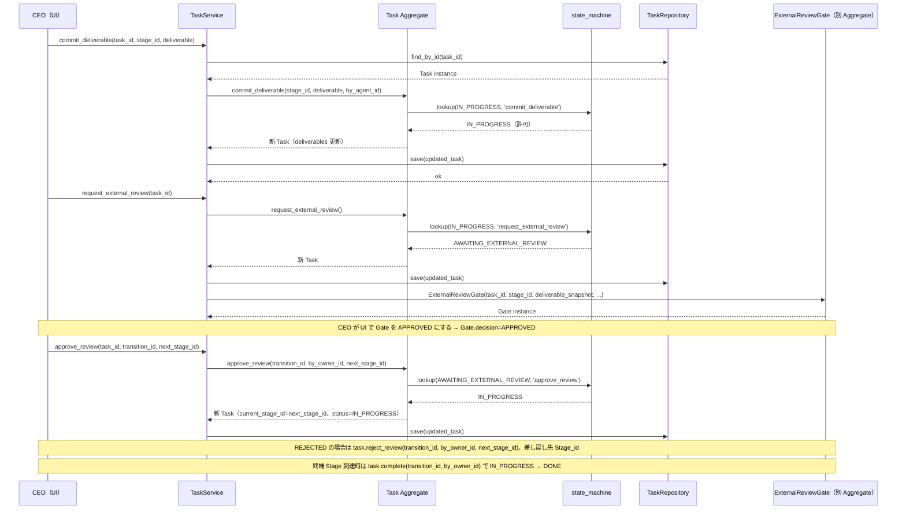
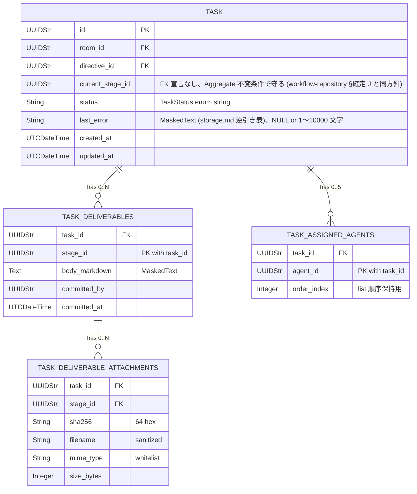

# 基本設計書 — task / domain

> feature: `task`（業務概念）/ sub-feature: `domain`
> 親業務仕様: [`../feature-spec.md`](../feature-spec.md)
> 関連 Issue: [#37 feat(task): Task Aggregate Root (M1)](https://github.com/bakufu-dev/bakufu/issues/37)
> 凍結済み設計: [`docs/design/domain-model/aggregates.md`](../../../design/domain-model/aggregates.md) §Task / [`docs/design/domain-model/storage.md`](../../../design/domain-model/storage.md) §Deliverable / §Attachment

## 記述ルール（必ず守ること）

基本設計に**疑似コード・サンプル実装（python/ts/sh/yaml 等の言語コードブロック）を書かない**。
ソースコードと二重管理になりメンテナンスコストしか生まない。
必要なのは構造契約（クラス・モジュール・データの関係）であり、実装の細部は [detailed-design.md](detailed-design.md) で凍結する。

## モジュール構成

| 機能 ID | モジュール | ディレクトリ | 責務 |
|--------|----------|------------|------|
| REQ-TS-001〜009 | `Task` Aggregate Root | `backend/src/bakufu/domain/task/task.py` | Task の属性・不変条件・**ふるまい 10 種**（method 名 = action 名で 1:1 対応、detailed-design §確定 A-2） |
| REQ-TS-009 | 不変条件 helper | `backend/src/bakufu/domain/task/aggregate_validators.py` | `_validate_assigned_agents_unique` / `_validate_assigned_agents_capacity` / `_validate_last_error_consistency` / `_validate_blocked_has_last_error` / `_validate_timestamp_order` |
| REQ-TS-002〜008（state machine） | `state_machine.py` | `backend/src/bakufu/domain/task/state_machine.py` | enum-based decision table（§確定 R1-A）+ `lookup(current_status, action) -> next_status` 関数 |
| REQ-TS-001 | `TaskInvariantViolation` 例外 | `backend/src/bakufu/domain/exceptions.py`（既存ファイル更新） | webhook auto-mask 強制（5 兄弟と同パターン） |
| REQ-TS-010 | `Deliverable` / `Attachment` VO | `backend/src/bakufu/domain/value_objects.py`（既存ファイル更新） | Pydantic v2 frozen model + sanitize / whitelist |
| REQ-TS-011 | `TaskStatus` / `LLMErrorKind` enum | `backend/src/bakufu/domain/value_objects.py`（同上） | StrEnum（既存 Role / StageKind / TransitionCondition と同階層） |
| 公開 API | re-export | `backend/src/bakufu/domain/task/__init__.py` | `Task` / `TaskInvariantViolation` / `TaskStatus` を re-export |

```
ディレクトリ構造（本 feature で追加・変更されるファイル）:

.
├── backend/
│   ├── src/
│   │   └── bakufu/
│   │       └── domain/
│   │           ├── task/                       # 新規ディレクトリ（room / directive と同パターン、追加で state_machine.py を持つ）
│   │           │   ├── __init__.py             # 新規: 公開 API re-export
│   │           │   ├── task.py                 # 新規: Task Aggregate Root
│   │           │   ├── aggregate_validators.py # 新規: _validate_* helper 5 種
│   │           │   └── state_machine.py        # 新規: enum-based decision table（§確定 R1-A）
│   │           ├── exceptions.py               # 既存更新: TaskInvariantViolation 追加
│   │           └── value_objects.py            # 既存更新: TaskStatus / LLMErrorKind enum + Deliverable / Attachment VO 追加
│   └── tests/
│       ├── factories/
│       │   └── task.py                         # 新規: TaskFactory / BlockedTaskFactory / DoneTaskFactory / DeliverableFactory / AttachmentFactory
│       └── domain/
│           └── task/
│               ├── __init__.py                 # 新規
│               └── test_task/                  # 新規ディレクトリ（500 行ルール、empire-repo PR #29 Norman 教訓を最初から反映）
│                   ├── __init__.py
│                   ├── test_construction.py    # TC-UT-TS-001/002/014/015 + Pydantic 型検査
│                   ├── test_state_machine.py   # TC-UT-TS-003〜008/030〜035 + state machine 全 13 遷移網羅（10 method × current_status の dispatch 表）
│                   ├── test_invariants.py      # TC-UT-TS-009/010/011 + auto-mask
│                   └── test_vo.py              # TC-UT-TS-012/013 + Deliverable / Attachment VO
└── docs/
    └── features/
        └── task/                               # 本 feature 設計書 5 本
```

## クラス設計（概要）



**凝集のポイント**:

- Task 自身は frozen（Pydantic v2 `model_config.frozen=True`）
- 状態変更ふるまい **10 種**（`assign` / `commit_deliverable` / `request_external_review` / `approve_review` / `reject_review` / `advance_to_next` / `complete` / `cancel` / `block` / `unblock_retry`）は **すべて新インスタンスを返す**（pre-validate 方式）。**method 名 = state machine action 名で 1:1 対応**（detailed-design §確定 A-2 dispatch 表で凍結、`advance` 単一 method による暗黙 dispatch は不採用）
- state machine table（§確定 R1-A）は `state_machine.py` モジュールスコープの Mapping として独立
- `_validate_*` helper 5 種は `aggregate_validators.py` で module-level 関数として独立（agent / room と同パターン、test 側で経路網羅）
- `current_stage_id` / `transition_id` の Workflow 内存在検証は **application 層責務**（外部知識を要するため、§確定 R1-A の責務分離）
- `Deliverable` / `Attachment` VO は frozen + extra='forbid'、サニタイズ / ホワイトリストは Pydantic `field_validator` で実装

## 処理フロー

### ユースケース 1: Task 起票（DirectiveService.issue 経由、domain 単独）

1. directive #28 の `DirectiveService.issue(raw_text, target_room_id)` が呼ばれる
2. application 層が Directive 構築 + DirectiveRepository.save 後、Task を生成:
   - `Task(id=uuid4(), room_id=directive.target_room_id, directive_id=directive.id, current_stage_id=workflow.entry_stage_id, deliverables={}, status=TaskStatus.PENDING, assigned_agent_ids=[], created_at=now, updated_at=now, last_error=None)`
3. Pydantic 型バリデーション → `model_validator(mode='after')` で `_validate_assigned_agents_unique`（空 list は OK）→ `_validate_last_error_consistency`（status=PENDING なので last_error=None で OK）→ `_validate_timestamp_order` の順
4. valid なら `TaskRepository.save(task)`（task-repository PR #35 で配線、本 feature スコープ外）
5. `directive.link_task(task.id)` で Directive ↔ Task 紐付け

### ユースケース 2: Agent 割当（assign）

1. application 層 `TaskService.assign(task_id, agent_ids)` が `TaskRepository.find_by_id` で Task 取得
2. application 層が `agent_ids` の各 AgentId が Room.members 内に存在することを検証（外部知識、Aggregate 内では守らない）
3. `task.assign(agent_ids)` を呼び出し
4. Aggregate 内:
   - terminal 検査（DONE / CANCELLED → `terminal_violation` で raise）
   - state machine lookup `(self.status, 'assign')` → PENDING のときのみ IN_PROGRESS に遷移、他は `state_transition_invalid`
   - `_rebuild_with_state(status=IN_PROGRESS, assigned_agent_ids=agent_ids, updated_at=now)` で新 Task 構築
   - `model_validator` 走行（`_validate_assigned_agents_unique` / `_validate_assigned_agents_capacity`）
5. valid なら新 Task を返却、application 層が `TaskRepository.save(updated_task)`

### ユースケース 3: 成果物 commit（commit_deliverable）

1. application 層 `TaskService.commit_deliverable(task_id, stage_id, deliverable, by_agent_id)` が呼ばれる
2. application 層が `by_agent_id` が `task.assigned_agent_ids` 内にあることを検証（外部 Agent からの commit 防止、Aggregate 内では守らない選択肢もあるが本 PR §設計判断補足で議論）
3. `task.commit_deliverable(stage_id, deliverable, by_agent_id)` を呼ぶ
4. Aggregate 内:
   - terminal 検査
   - state machine lookup `(self.status, 'commit_deliverable')` → IN_PROGRESS のときのみ許可
   - `deliverables[stage_id] = deliverable` で dict 更新（既存値は上書き、§確定 R1-E の「Stage ごとに最新の成果物 1 件」設計）
   - `_rebuild_with_state(deliverables=updated_dict, updated_at=now)`
5. valid なら新 Task 返却

### ユースケース 4: External Review 要求 → 承認連鎖（**専用 method 分離**、detailed-design §確定 A-2）

1. Agent が Stage の成果物を commit 完了 → `TaskService.request_external_review(task_id)` が呼ばれる
2. application 層が現 Stage の `kind == EXTERNAL_REVIEW` を検証（外部知識、Aggregate 内では守らない）
3. `task.request_external_review()` → IN_PROGRESS → AWAITING_EXTERNAL_REVIEW
4. application 層が `ExternalReviewGate(task_id=task.id, stage_id=task.current_stage_id, deliverable_snapshot=task.deliverables[stage_id], ...)` を構築（別 Aggregate、本 PR スコープ外）
5. CEO が UI で Gate を APPROVED / REJECTED → application 層 `GateService.approve()` / `reject()` 完了後、**Gate decision → Task method の dispatch を application 層が静的に実行**:
   - Gate APPROVED → `task.approve_review(transition_id, by_owner_id, next_stage_id)` → AWAITING_EXTERNAL_REVIEW → IN_PROGRESS（`next_stage_id` は次 Stage）
   - Gate REJECTED → `task.reject_review(transition_id, by_owner_id, next_stage_id)` → AWAITING_EXTERNAL_REVIEW → IN_PROGRESS（`next_stage_id` は差し戻し先）
6. 終端 Stage + APPROVED の場合 → `task.approve_review(...)` で IN_PROGRESS に戻った後、application 層が次の advance を判定し `task.complete(transition_id, by_owner_id)` → IN_PROGRESS → DONE（terminal）。EXTERNAL_REVIEW を経由しない通常 Stage 進行は `task.advance_to_next(...)`（IN_PROGRESS の自己遷移）

##### Task / Gate Aggregate 境界の凍結

| 責務 | 担当 | 補足 |
|---|---|---|
| Gate decision の確定（`approve` / `reject` ふるまい）| `ExternalReviewGate` Aggregate（後続 Issue） | Gate 内で `decision` 値遷移、Task は知らない |
| Gate decision → Task method の dispatch | `GateService` application 層（後続 Issue） | `if gate.decision == APPROVED: task.approve_review(...)` の静的分岐、Task が `ReviewDecision` を import しないことで Aggregate 境界を保つ |
| Task の state 遷移 | `Task` Aggregate（本 PR） | method 名 = action 名で 1:1 静的、揺れゼロ |

### ユースケース 5: BLOCKED 隔離 → 復旧

1. Dispatcher が Stage 実行中 → LLM Adapter が `AuthExpired` を返す
2. application 層 `TaskService.block(task_id, reason='LLM auth expired', last_error='AuthExpired: ...')` → `task.block(reason, last_error)`
3. Aggregate 内:
   - terminal 検査
   - state machine lookup `(self.status, 'block')` → IN_PROGRESS のときのみ許可
   - `last_error` の NFC 正規化 → 空文字列検査（§確定 R1-C） → `_rebuild_with_state(status=BLOCKED, last_error=normalized, updated_at=now)`
4. CEO が `bakufu admin task list-blocked` で BLOCKED Task 一覧確認 → 環境変数を更新
5. CEO が `bakufu admin task retry-task <task_id>` → application 層 `TaskService.retry(task_id)` → `task.unblock_retry()` → BLOCKED → IN_PROGRESS、`last_error=None`（§確定 R1-D）

### ユースケース 6: 中止（cancel）

1. CEO が UI / CLI で Task を `cancel`（任意時点、PENDING / IN_PROGRESS / AWAITING_EXTERNAL_REVIEW / BLOCKED の 4 状態から可能）
2. application 層 `TaskService.cancel(task_id, by_owner_id, reason)` → `task.cancel(by_owner_id, reason)`
3. Aggregate 内: terminal 検査 → state machine lookup `(self.status, 'cancel')` → 4 状態すべて CANCELLED 遷移を許可 → `_rebuild_with_state(status=CANCELLED, last_error=None, updated_at=now)`
4. application 層が `audit_log` に `reason` を記録（Aggregate は reason を保持しない）

## シーケンス図



## アーキテクチャへの影響

- `docs/design/domain-model.md` への変更: なし（Task の `mermaid classDiagram` は既に存在）
- `docs/design/domain-model/aggregates.md` への変更: なし（§Task は既に凍結済み、本 feature は実装の追従）
- `docs/design/domain-model/value-objects.md` への変更: §列挙型一覧の `TaskStatus` / `LLMErrorKind` 行は既に存在、本 feature で Python 実体化
- `docs/design/domain-model/storage.md` への変更: §逆引き表に `Task.last_error: MaskedText` / `Deliverable.body_markdown: MaskedText` 行は既に登録済み（**本 feature では追記しない**。後続 `feature/task-repository` PR #35 で永続化テーブル定義と同時に配線確認する責務分離）
- `docs/design/tech-stack.md` への変更: なし
- 既存 feature への波及: なし。empire / workflow / agent / room / directive は本 feature を import しない（依存方向: task → 既存 ID 型 + Workflow Stage 集合の参照のみ）

## 外部連携

該当なし — 理由: domain 層のみのため外部システムへの通信は発生しない。

| 連携先 | 目的 | プロトコル | 認証 | タイムアウト / リトライ |
|-------|------|----------|-----|--------------------|
| 該当なし | — | — | — | — |

## UX 設計

該当なし — 理由: domain 層のため UI は持たない。Task 進行 UI は `feature/chat-ui`（Phase 2）で扱う。

| シナリオ | 期待される挙動 |
|---------|------------|
| 該当なし | — |

**アクセシビリティ方針**: 該当なし（UI なし）。

## セキュリティ設計

### 脅威モデル

本 feature 範囲では以下の 4 件。詳細な信頼境界は [`docs/design/threat-model.md`](../../../design/threat-model.md)。

| 想定攻撃者 | 攻撃経路 | 保護資産 | 対策 |
|-----------|---------|---------|------|
| **T1: Task.last_error 経由の secret 漏洩** | LLM Adapter が API key / OAuth token を含むエラーメッセージを返却 → `block(reason, last_error)` 経由で Task に保持 → DB 永続化 → ログ・監査経路へ流出 | API key / OAuth token / Discord webhook | Aggregate 内ではマスキングしない（生 last_error を保持して admin CLI が見る経路を確保）。**永続化前の単一ゲートウェイ**で TypeDecorator `MaskedText` 経由で適用（task-repository PR #35 で `tasks.last_error` カラムを `MaskedText` 型として宣言する責務） |
| **T2: Deliverable.body_markdown 経由の secret 漏洩** | Agent が成果物に webhook URL / API key を埋め込む → DB 永続化 → ログへ流出 | 同上 | T1 と同経路、`deliverables.body_markdown` カラムを `MaskedText` 型として宣言（task-repository PR #35） |
| **T3: TaskInvariantViolation の例外経路で webhook URL 流出** | `last_error` に webhook URL を含む状態で `state_transition_invalid` raise → 例外 detail に full last_error が埋め込まれログ・Discord 通知に流出 | Discord webhook token | `TaskInvariantViolation.__init__` で `mask_discord_webhook` + `mask_discord_webhook_in` を `super().__init__` 前に強制適用。5 兄弟と同パターン（多層防御、§確定 R1-F） |
| **T4: state machine bypass 攻撃（誤呼び出し / 並行性）** | application 層が誤った順序でふるまいを呼ぶ（例: BLOCKED でない Task に `unblock_retry`） → state machine 不整合状態で永続化 | Task の整合性 | state machine table lookup の **失敗時 Fail Fast**（§確定 R1-A）+ terminal 検査（§確定 R1-B）+ `_validate_last_error_consistency`（§確定 R1-D）の 3 重防衛。**並行性は Repository 層の楽観排他 / Tx 境界で守る**（task-repository PR #35 責務、本 PR スコープ外） |

### OWASP Top 10 対応

| # | カテゴリ | 対応状況 |
|---|---------|---------|
| A01 | Broken Access Control | 該当なし（domain 層） |
| A02 | Cryptographic Failures | **適用**: 永続化前マスキング（`Task.last_error` / `Deliverable.body_markdown`、後続 task-repository PR #35 で配線）+ 例外 auto-mask（TaskInvariantViolation） |
| A03 | Injection | 該当なし（Pydantic 型強制 + StrEnum） |
| A04 | Insecure Design | **適用**: pre-validate 方式 / frozen model / state machine decision table / terminal 検査の 4 重防衛 |
| A05 | Security Misconfiguration | 該当なし |
| A06 | Vulnerable Components | Pydantic v2 / pyright |
| A07 | Auth Failures | 該当なし |
| A08 | Data Integrity Failures | **適用**: frozen model / pre-validate / state machine による不正状態の窓ゼロ化 |
| A09 | Logging Failures | **適用**: `TaskInvariantViolation` の auto-mask により例外ログから webhook URL が漏洩しない |
| A10 | SSRF | 該当なし（外部 URL fetch なし、Attachment は filesystem 配置） |

## ER 図

該当なし — 理由: 本 feature は domain 層のみで永続化スキーマは含まない。永続化は `feature/task-repository`（Issue #35）で扱う（M2 永続化基盤完了後）。参考の概形:



masking 対象: `tasks.last_error` / `task_deliverables.body_markdown` の 2 カラムのみ（CI 三層防衛で物理保証する責務は task-repository PR #35）。

## エラーハンドリング方針

| 例外種別 | 処理方針 | ユーザーへの通知 |
|---------|---------|----------------|
| `TaskInvariantViolation(kind='terminal_violation')` | application 層で catch、HTTP API 層で 409 Conflict（terminal）にマッピング（別 feature） | MSG-TS-001 |
| `TaskInvariantViolation(kind='state_transition_invalid')` | 同上、422 にマッピング | MSG-TS-002 |
| `TaskInvariantViolation(kind='assigned_agents_unique' / 'assigned_agents_capacity')` | 422 | MSG-TS-003 / 004 |
| `TaskInvariantViolation(kind='last_error_consistency' / 'blocked_requires_last_error')` | 500 Internal Server Error（データ破損 or 実装バグ） | MSG-TS-005 / 006 |
| `TaskInvariantViolation(kind='timestamp_order')` | 500（同上） | MSG-TS-007 |
| `pydantic.ValidationError` | 構築時の型違反。application 層で catch、422 にマッピング | MSG-TS-008 / 009 |
| `TaskNotFoundError` | application 層 `TaskService` の参照整合性違反、404 にマッピング | MSG-TS-010 |
| その他 | 握り潰さない、application 層へ伝播 | 汎用エラーメッセージ |
