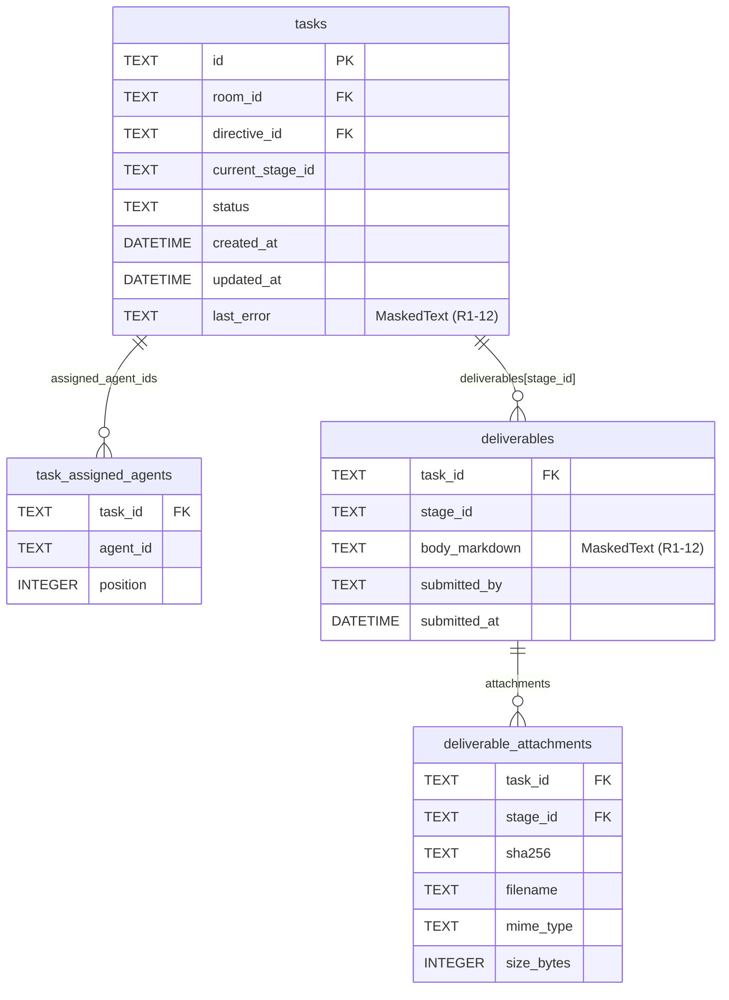

# 基本設計書

> feature: `task` / sub-feature: `http-api`
> 関連 Issue: [#60 feat(task-http-api): Directive + Task lifecycle HTTP API (M3)](https://github.com/bakufu-dev/bakufu/issues/60)
> 関連: [`../feature-spec.md`](../feature-spec.md) / [`../domain/basic-design.md`](../domain/basic-design.md) / [`../repository/basic-design.md`](../repository/basic-design.md) / [`../../http-api-foundation/http-api/basic-design.md`](../../http-api-foundation/http-api/basic-design.md)
> 凍結済み設計参照: [`docs/design/architecture.md §interfaces レイヤー詳細`](../../../design/architecture.md) / [`docs/design/threat-model.md`](../../../design/threat-model.md)

## 記述ルール（必ず守ること）

基本設計に**疑似コード・サンプル実装（python/ts/sh/yaml 等の言語コードブロック）を書かない**。
ソースコードと二重管理になりメンテナンスコストしか生まない。
必要なのは構造契約（クラス・モジュール・データの関係）であり、実装の細部は [detailed-design.md](detailed-design.md) で凍結する。

## 前提条件（実装着手前に充足すること）

本 sub-feature の実装前に以下の変更が必要である（directive/http-api の前提条件と共通）:

| 前提 | 対象ファイル | 内容 |
|-----|------------|------|
| **P-1: task_exceptions.py 新規作成** | `backend/src/bakufu/application/exceptions/task_exceptions.py` | `TaskNotFoundError` / `TaskStateConflictError` を新規定義する（Issue #60 で同時作成）|
| **P-2: TaskRepository.find_all_by_room 追加** | `backend/src/bakufu/application/ports/task_repository.py` | `find_all_by_room(room_id: RoomId) -> list[Task]` を Protocol に追加する（Issue #60 で同時更新）|

## モジュール構成

本 sub-feature で追加・変更するモジュール一覧。

| 機能 ID | モジュール | ディレクトリ | 責務 |
|--------|----------|------------|------|
| REQ-TS-HTTP-001〜006 | `task_router` | `backend/src/bakufu/interfaces/http/routers/tasks.py` | Task 取得・ライフサイクル操作エンドポイント（6 本）|
| REQ-TS-HTTP-001〜006 | `TaskService` | `backend/src/bakufu/application/services/task_service.py` | 骨格実装済み。本 sub-feature で全メソッドを肉付け |
| REQ-TS-HTTP-001〜006 | `TaskSchemas` | `backend/src/bakufu/interfaces/http/schemas/task.py` | Pydantic v2 リクエスト / レスポンスモデル（新規ファイル）|
| 横断 | `task 例外ハンドラ群` | `backend/src/bakufu/interfaces/http/error_handlers.py`（既存追記）| `TaskNotFoundError` / `TaskStateConflictError` / `TaskInvariantViolation` → `ErrorResponse` 変換 |
| 横断 | `application 例外定義` | `backend/src/bakufu/application/exceptions/task_exceptions.py`（前提 P-1）| `TaskNotFoundError` / `TaskStateConflictError` |

```
本 sub-feature で追加・変更されるファイル:

backend/
└── src/bakufu/
    ├── application/
    │   ├── exceptions/
    │   │   └── task_exceptions.py              # 新規: TaskNotFoundError / TaskStateConflictError (P-1)
    │   ├── ports/
    │   │   └── task_repository.py              # 既存追記: find_all_by_room() 追加 (P-2)
    │   └── services/
    │       └── task_service.py                 # 既存追記: 全メソッドを肉付け
    └── interfaces/http/
        ├── dependencies.py                     # 既存追記: get_task_service() 追加
        ├── error_handlers.py                   # 既存追記: task 例外ハンドラ群追加
        ├── routers/
        │   └── tasks.py                        # 新規: 6 エンドポイント
        └── schemas/
            └── task.py                         # 新規: Pydantic スキーマ群
```

## モジュール契約（機能要件）

本 sub-feature が提供するモジュールの入出力契約を凍結する。各 REQ-TS-HTTP-NNN は親 [`../feature-spec.md §5`](../feature-spec.md) ユースケース UC-TS-NNN と 1:1 または N:1 で対応する（孤児要件なし）。

### REQ-TS-HTTP-001: Task 単件取得（GET /api/tasks/{task_id}）

| 項目 | 内容 |
|---|---|
| 入力 | パスパラメータ `task_id: UUID` |
| 処理 | `TaskService.find_by_id(task_id)` → `TaskRepository.find_by_id(task_id)` → None → `TaskNotFoundError` |
| 出力 | HTTP 200, `TaskResponse`（id / room_id / directive_id / current_stage_id / status / assigned_agent_ids / last_error（masked）/ created_at / updated_at）|
| エラー時 | 不在 → 404 (MSG-TS-HTTP-001) / 不正 UUID → 422 |

### REQ-TS-HTTP-002: Room の Task 一覧取得（GET /api/rooms/{room_id}/tasks）

| 項目 | 内容 |
|---|---|
| 入力 | パスパラメータ `room_id: UUID` |
| 処理 | `TaskService.find_all_by_room(room_id)` → `TaskRepository.find_all_by_room(room_id)` → `list[Task]`（空リスト含む）|
| 出力 | HTTP 200, `TaskListResponse(items: list[TaskResponse], total: int)` |
| エラー時 | 不正 UUID → 422（Room 不在チェックは行わない — Room 不在時は空リストを返す）|

### REQ-TS-HTTP-003: Agent 割り当て（POST /api/tasks/{task_id}/assign）

| 項目 | 内容 |
|---|---|
| 入力 | パスパラメータ `task_id: UUID` / リクエスト Body `TaskAssign`（`agent_ids: list[UUID]`）|
| 処理 | `TaskService.assign(task_id, agent_ids)` → 1) `find_by_id` → 不在 → `TaskNotFoundError` 2) `task.assign(agent_ids)` → `TaskInvariantViolation`（terminal / 重複 / 上限）または `TaskStateConflictError`（状態遷移不可）3) `TaskRepository.save(updated_task)` |
| 出力 | HTTP 200, `TaskResponse`（status=IN_PROGRESS）|
| エラー時 | 不在 → 404 (MSG-TS-HTTP-001) / terminal 状態または遷移不可 → 409 (MSG-TS-HTTP-002) / 重複・上限違反 → 422 (MSG-TS-HTTP-003) / 不正 UUID → 422 |

### REQ-TS-HTTP-004: Task キャンセル（PATCH /api/tasks/{task_id}/cancel）

| 項目 | 内容 |
|---|---|
| 入力 | パスパラメータ `task_id: UUID` |
| 処理 | `TaskService.cancel(task_id)` → 1) `find_by_id` → 不在 → `TaskNotFoundError` 2) `task.cancel()` → `TaskInvariantViolation(kind='terminal_violation')` / 遷移不可 3) `TaskRepository.save(cancelled_task)` |
| 出力 | HTTP 200, `TaskResponse`（status=CANCELLED）|
| エラー時 | 不在 → 404 (MSG-TS-HTTP-001) / terminal / 遷移不可 → 409 (MSG-TS-HTTP-002) / 不正 UUID → 422 |

### REQ-TS-HTTP-005: BLOCKED Task の復旧（PATCH /api/tasks/{task_id}/unblock）

| 項目 | 内容 |
|---|---|
| 入力 | パスパラメータ `task_id: UUID` |
| 処理 | `TaskService.unblock_retry(task_id)` → 1) `find_by_id` → 不在 → `TaskNotFoundError` 2) `task.unblock_retry()` → 遷移不可（BLOCKED 以外から呼び出し等）→ `TaskStateConflictError` 3) `TaskRepository.save(unblocked_task)` |
| 出力 | HTTP 200, `TaskResponse`（status=IN_PROGRESS, last_error=null）|
| エラー時 | 不在 → 404 (MSG-TS-HTTP-001) / terminal / 遷移不可 → 409 (MSG-TS-HTTP-002) / 不正 UUID → 422 |

### REQ-TS-HTTP-006: 成果物 commit（POST /api/tasks/{task_id}/deliverables/{stage_id}）

| 項目 | 内容 |
|---|---|
| 入力 | パスパラメータ `task_id: UUID` / `stage_id: UUID` / リクエスト Body `DeliverableCreate`（`body_markdown: str`、`attachments: list[AttachmentCreate] \| None`、`submitted_by: UUID`）|
| 処理 | `TaskService.commit_deliverable(task_id, stage_id, deliverable_create)` → 1) `find_by_id` → 不在 → `TaskNotFoundError` 2) `Deliverable(...)` 構築 3) `task.commit_deliverable(stage_id, deliverable, submitted_by)` → `TaskInvariantViolation` / `TaskStateConflictError` 4) `TaskRepository.save(updated_task)` |
| 出力 | HTTP 200, `TaskResponse`（`deliverables[stage_id]` 更新済み）|
| エラー時 | 不在 → 404 (MSG-TS-HTTP-001) / terminal / 遷移不可 → 409 (MSG-TS-HTTP-002) / Deliverable / Attachment 業務ルール違反 → 422 (MSG-TS-HTTP-003) / 不正 UUID → 422 |

## ユーザー向けメッセージ一覧

確定文言は [`detailed-design.md §MSG 確定文言表`](detailed-design.md) で凍結する。

| ID | 種別 | 条件 | HTTP ステータス |
|---|---|---|---|
| MSG-TS-HTTP-001 | エラー（不在）| Task が見つからない | 404 |
| MSG-TS-HTTP-002 | エラー（競合）| terminal 状態（DONE/CANCELLED）からの操作 / state machine 上の不正遷移 | 409 |
| MSG-TS-HTTP-003 | エラー（検証）| `TaskInvariantViolation` の業務ルール違反本文（割当重複・上限・Deliverable 制約等）| 422 |

## 依存関係

| 区分 | 依存 | バージョン方針 | 備考 |
|---|---|---|---|
| ランタイム | Python 3.12+ | pyproject.toml | 既存 |
| HTTP フレームワーク | FastAPI / Pydantic v2 / httpx | pyproject.toml | http-api-foundation で確定済み |
| DI パターン | `get_session()` / `get_task_service()` | http-api-foundation 確定 | `dependencies.py` に `get_task_service()` を追加 |
| application 例外 | `TaskNotFoundError` / `TaskStateConflictError` | 本 PR で新規定義（P-1）| `application/exceptions/task_exceptions.py` |
| domain | `Task` / `TaskId` / `TaskStatus` / `TaskAction` / `TaskInvariantViolation` / `Deliverable` / `Attachment` / `state_machine` | M1 確定 | task domain sub-feature（Issue #37）|
| repository | `TaskRepository` Protocol（`find_all_by_room` 追加後）| M2 確定 + 本 PR で Protocol 拡張（P-2）| task repository sub-feature（Issue #35）|
| masking | `application.security.masking.mask()` | http-api-foundation 確定（Issue #59 §確定I）| `last_error` / `body_markdown` のHTTPレスポンスマスキング（defense-in-depth）|
| 基盤 | http-api-foundation（ErrorResponse / lifespan / CSRF / CORS）| M3-A 確定（Issue #55）| 全 error handler / app.state.session_factory を引き継ぐ |

## クラス設計（概要）

```mermaid
classDiagram
    class TaskRouter {
        <<FastAPI APIRouter>>
        +GET /api/tasks/{task_id}
        +GET /api/rooms/{room_id}/tasks
        +POST /api/tasks/{task_id}/assign
        +PATCH /api/tasks/{task_id}/cancel
        +PATCH /api/tasks/{task_id}/unblock
        +POST /api/tasks/{task_id}/deliverables/{stage_id}
    }
    class TaskService {
        -_task_repo: TaskRepository
        -_session: AsyncSession
        +__init__(task_repo, session)
        +find_by_id(task_id) Task
        +find_all_by_room(room_id) list~Task~
        +assign(task_id, agent_ids) Task
        +cancel(task_id) Task
        +unblock_retry(task_id) Task
        +commit_deliverable(task_id, stage_id, deliverable_create) Task
    }
    class TaskRepository {
        <<Protocol>>
        +find_by_id(task_id) Task | None
        +find_all_by_room(room_id) list~Task~
        +save(task) None
        +count() int
        +count_by_status(status) int
        +count_by_room(room_id) int
        +find_blocked() list~Task~
    }
    class TaskAssign {
        <<Pydantic BaseModel>>
        +agent_ids: list~UUID~
    }
    class DeliverableCreate {
        <<Pydantic BaseModel>>
        +body_markdown: str
        +submitted_by: UUID
        +attachments: list~AttachmentCreate~ | None
    }
    class AttachmentCreate {
        <<Pydantic BaseModel>>
        +sha256: str
        +filename: str
        +mime_type: str
        +size_bytes: int
    }
    class TaskResponse {
        <<Pydantic BaseModel>>
        +id: str
        +room_id: str
        +directive_id: str
        +current_stage_id: str
        +status: str
        +assigned_agent_ids: list~str~
        +last_error: str | None
        +deliverables: dict~str, DeliverableResponse~
        +created_at: str
        +updated_at: str
    }
    class DeliverableResponse {
        <<Pydantic BaseModel>>
        +stage_id: str
        +body_markdown: str
        +submitted_by: str
        +submitted_at: str
        +attachments: list~AttachmentResponse~
    }
    class AttachmentResponse {
        <<Pydantic BaseModel>>
        +sha256: str
        +filename: str
        +mime_type: str
        +size_bytes: int
    }
    class TaskListResponse {
        <<Pydantic BaseModel>>
        +items: list~TaskResponse~
        +total: int
    }

    TaskRouter --> TaskService : uses (DI)
    TaskService --> TaskRepository : uses (Port)
    TaskRouter ..> TaskAssign : deserializes
    TaskRouter ..> DeliverableCreate : deserializes
    TaskRouter ..> TaskResponse : serializes
    TaskRouter ..> TaskListResponse : serializes
```

## 処理フロー

### ユースケース 1: Task 単件取得（GET /api/tasks/{task_id}）

1. Router が `task_id: UUID` をパスパラメータとして受け取る（不正形式 → 422）
2. `TaskService.find_by_id(task_id)` 呼び出し
3. `TaskRepository.find_by_id(task_id)` → None → `TaskNotFoundError` → 404
4. `TaskResponse` を構築（`last_error` / `body_markdown` は `mask()` 適用）
5. HTTP 200 を返す

### ユースケース 2: Room の Task 一覧取得（GET /api/rooms/{room_id}/tasks）

1. Router が `room_id: UUID` をパスパラメータとして受け取る（不正形式 → 422）
2. `TaskService.find_all_by_room(room_id)` 呼び出し
3. `TaskRepository.find_all_by_room(room_id)` → `list[Task]`（0 件以上）
4. `TaskListResponse(items=[...], total=len(tasks))` を構築
5. HTTP 200 を返す（Room 不在でも 200 + 空リスト）

### ユースケース 3: Agent 割り当て（POST /api/tasks/{task_id}/assign）

1. Router が `task_id: UUID` + `TaskAssign` を受け取る
2. `TaskService.assign(task_id, agent_ids)` 呼び出し
3. `find_by_id` → 不在 → `TaskNotFoundError` → 404
4. `task.assign(agent_ids)` 呼び出し
   - terminal 状態（DONE/CANCELLED）→ `TaskInvariantViolation(kind='terminal_violation')` → TaskStateConflictError → 409
   - state machine テーブルに遷移なし → `TaskInvariantViolation(kind='state_transition_invalid')` → TaskStateConflictError → 409
   - 重複割当・5件超過 → `TaskInvariantViolation(kind='assigned_agents_*')` → 422
5. `TaskRepository.save(updated_task)` — `async with session.begin()` 内
6. HTTP 200 `TaskResponse` を返す

### ユースケース 4: Task キャンセル（PATCH /api/tasks/{task_id}/cancel）

1. Router が `task_id: UUID` を受け取る
2. `TaskService.cancel(task_id)` → `find_by_id` → `task.cancel()` → `TaskRepository.save`
3. terminal 状態からの cancel → TaskStateConflictError → 409
4. HTTP 200 `TaskResponse`（status=CANCELLED）を返す

### ユースケース 5: BLOCKED Task 復旧（PATCH /api/tasks/{task_id}/unblock）

1. Router が `task_id: UUID` を受け取る
2. `TaskService.unblock_retry(task_id)` → `find_by_id` → `task.unblock_retry()` → `TaskRepository.save`
3. BLOCKED 以外からの unblock_retry → TaskStateConflictError → 409
4. HTTP 200 `TaskResponse`（status=IN_PROGRESS, last_error=null）を返す

### ユースケース 6: 成果物 commit（POST /api/tasks/{task_id}/deliverables/{stage_id}）

1. Router が `task_id` / `stage_id` / `DeliverableCreate` を受け取る
2. `Deliverable(...)` を domain VO として構築（`AttachmentInvariantViolation` → 422）
3. `TaskService.commit_deliverable(task_id, stage_id, deliverable, submitted_by)` 呼び出し
4. `task.commit_deliverable(stage_id, deliverable, by_agent_id)` → 状態不正 → TaskStateConflictError → 409
5. `TaskRepository.save(updated_task)` — `async with session.begin()` 内
6. HTTP 200 `TaskResponse`（deliverables 更新済み）を返す

## エラーハンドリング方針

| 例外クラス | 発生源 | HTTP | ErrorResponse.code | メッセージ |
|----------|-------|------|--------------------|---------|
| `TaskNotFoundError` | TaskService | 404 | `not_found` | MSG-TS-HTTP-001 |
| `TaskStateConflictError` | TaskService（domain 例外を wrap）| 409 | `conflict` | MSG-TS-HTTP-002 |
| `TaskInvariantViolation`（terminal / 遷移不可 以外）| Task domain | 422 | `validation_error` | MSG-TS-HTTP-003 |
| `DirectiveInvariantViolation` | Directive domain | 422 | `validation_error` | MSG-DR-HTTP-001（directive router 経由）|
| Pydantic `ValidationError` | RequestBody | 422 | `validation_error` | Pydantic 標準 |
| 不正 UUID | パスパラメータ | 422 | `validation_error` | Pydantic 標準 |

**TaskInvariantViolation の分岐判定**（TaskService 内）:

- `kind in ('terminal_violation', 'state_transition_invalid')` → `TaskStateConflictError` を raise（409）
- それ以外の kind（`assigned_agents_unique` / `assigned_agents_capacity` / `blocked_requires_last_error` 等）→ `TaskInvariantViolation` をそのまま伝播させ error_handlers.py が 422 に変換

## セキュリティ設計

### 脅威モデル

| 想定攻撃者 | 攻撃経路 | 保護資産 | 対策 |
|---|---|---|---|
| **T1: CSRF 経由での Task 状態操作** | ブラウザ経由の不正 POST / PATCH | Task の状態整合性 | http-api-foundation 確定D: CSRF Origin 検証ミドルウェア（Origin ヘッダ不一致なら 403）|
| **T2: スタックトレース露出** | 500 エラーレスポンスへのスタックトレース混入 | 内部実装情報 | http-api-foundation 確定A: generic_exception_handler が `internal_error` のみを返す |
| **T3: 不正 UUID によるパスインジェクション** | `task_id` / `stage_id` / `room_id` に不正値を注入 | DB 整合性 | FastAPI `UUID` 型強制（422 on 不正形式）+ SQLAlchemy ORM（raw SQL 不使用）|
| **T4: last_error / body_markdown 経由での秘密情報漏洩（A02）** | CEO / Agent が API key / GitHub PAT / webhook URL を `last_error` / `body_markdown` に含めた場合、または DB への raw token 直接 INSERT バイパスが発生した場合、HTTP レスポンスに raw token が露出 | API key / GitHub PAT / webhook token | `TaskResponse.last_error` / `DeliverableResponse.body_markdown` の `@field_serializer` が GET / POST / PATCH 全レスポンスパスで `application.security.masking.mask()` を呼び出す（mode 制限なし・冪等）。DB バイパス経路でも R1-12 が独立防御として機能する（§確定A 凍結）|

### OWASP Top 10 対応

| # | カテゴリ | 対応状況 |
|---|---|---|
| A01 | Broken Access Control | loopback バインド（`127.0.0.1:8000`）+ CSRF Origin 検証（http-api-foundation 確定D）|
| A02 | Cryptographic Failures | **Task.last_error / Deliverable.body_markdown**: `field_serializer` が GET / POST / PATCH 全レスポンスパスで `mask()` を呼び出す（T4 / §確定A 凍結）。DB 永続化前も MaskedText TypeDecorator で二重防御（R1-12）|
| A03 | Injection | SQLAlchemy ORM 経由（raw SQL 不使用）|
| A04 | Insecure Design | domain の pre-validate + frozen Task で不整合状態を物理的に防止。state machine decision table で不正遷移を拒否 |
| A05 | Security Misconfiguration | http-api-foundation の lifespan / CORS 設定を引き継ぐ |
| A06 | Vulnerable Components | 依存 CVE は CI `pip-audit` で監視 |
| A07 | Auth Failures | MVP 設計上 意図的な認証なし（loopback バインドで代替）|
| A08 | Data Integrity Failures | `async with session.begin()` + UoW でアトミック永続化。例外時は自動ロールバック |
| A09 | Logging Failures | 内部エラーは application 層でログ、スタックトレースはレスポンスに含めない |
| A10 | SSRF | 該当なし — Task 業務概念は外部通信を持たない（LLM 送信は `feature/llm-adapter` 責務）|

## ER 図（影響範囲）


