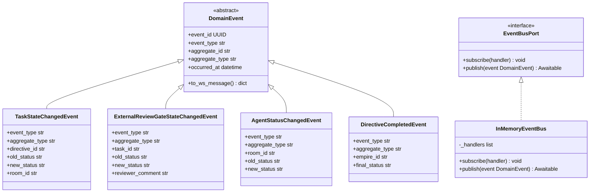
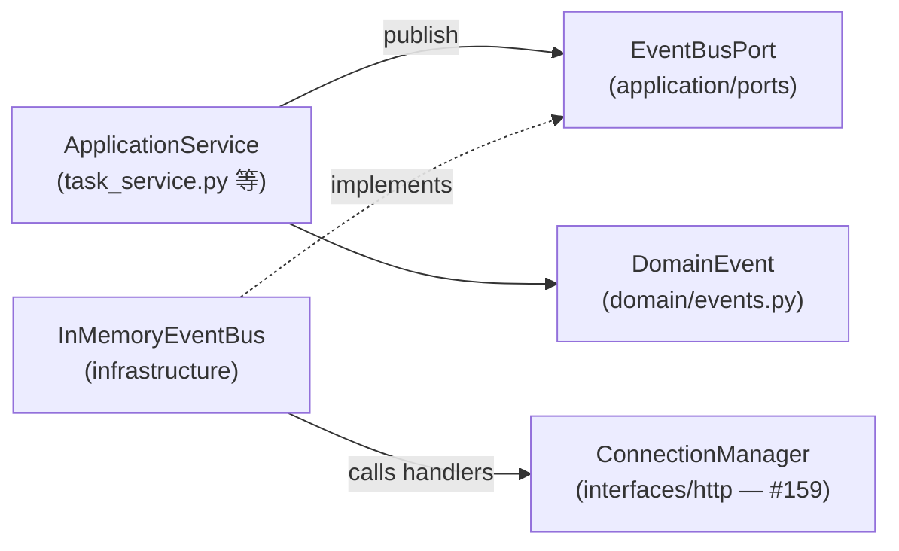
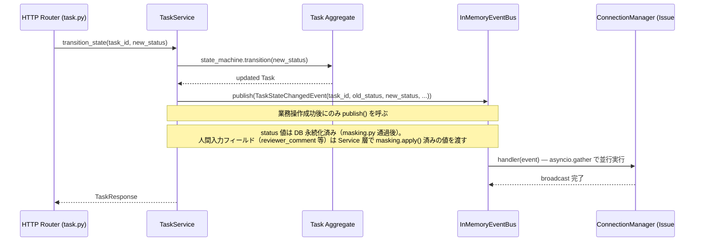

# 基本設計書

> feature: `websocket-broadcast` / sub-feature: `domain`
> 親業務仕様: [`../feature-spec.md`](../feature-spec.md)
> 関連 Issue: [#158 feat(websocket-broadcast): Domain Event基盤](https://github.com/bakufu-dev/bakufu/issues/158)
> 関連: [`detailed-design.md`](detailed-design.md) / [`test-design.md`](test-design.md)

## 本書の役割

本書は **階層 3: モジュール（sub-feature domain）の基本設計**（Module-level Basic Design）を凍結する。DDD の Domain Event パターンを bakufu に導入し、EventBus Port（application 層）と InMemoryEventBus 実装（infrastructure 層）を確立する。

機能要件（REQ-WSB-NNN）は本書 §モジュール契約 として統合される。本書は **構造契約と処理フローを凍結する** — 「どのモジュールが・どの順で・何を担うか」のレベルで凍結する。

**書くこと**:
- モジュール構成（機能 ID → ディレクトリ → 責務）
- モジュール契約（機能要件の入出力、業務記述）
- クラス設計（概要）
- 処理フロー（ユースケース単位）
- シーケンス図 / エラーハンドリング方針

**書かないこと**（後段の設計書へ追い出す）:
- 属性の型・制約 → [`detailed-design.md`](detailed-design.md) §クラス設計（詳細）
- 確定実装方針の詳細 → [`detailed-design.md`](detailed-design.md) §確定事項
- 疑似コード・サンプル実装（言語コードブロック）→ 実装 PR

## モジュール構成

| 機能 ID | モジュール | ディレクトリ | 責務 |
|---|---|---|---|
| REQ-WSB-001 | `domain_event` | `domain/events.py` | `DomainEvent` 抽象基底クラス |
| REQ-WSB-002 | `task_events` | `domain/events.py` | `TaskStateChangedEvent` |
| REQ-WSB-003 | `gate_events` | `domain/events.py` | `ExternalReviewGateStateChangedEvent` |
| REQ-WSB-004 | `agent_events` | `domain/events.py` | `AgentStatusChangedEvent` |
| REQ-WSB-005 | `directive_events` | `domain/events.py` | `DirectiveCompletedEvent` |
| REQ-WSB-006 | `event_bus_port` | `application/ports/event_bus.py` | `EventBusPort` インターフェース |
| REQ-WSB-007 | `in_memory_event_bus` | `infrastructure/event_bus.py` | `InMemoryEventBus` 実装 |
| REQ-WSB-008 | `service_integration` | `application/services/task_service.py` / `application/services/external_review_gate_service.py` | M4: TaskService・ExternalReviewGateService への `publish()` 統合（AgentService / DirectiveService は M5 Phase 2）|

```
backend/src/bakufu/
├── domain/
│   └── events.py                                # REQ-WSB-001〜005: DomainEvent + 各具体Event
├── application/
│   └── ports/
│       └── event_bus.py                         # REQ-WSB-006: EventBusPort interface
│   └── services/
│       ├── task_service.py                      # REQ-WSB-008: cancel()/unblock_retry()/commit_deliverable() に publish() 追加（M4）
│       ├── external_review_gate_service.py      # REQ-WSB-008: approve()/reject() に publish() 追加（M4）
│       ├── agent_service.py                     # REQ-WSB-008: update_status() は M5 Phase 2 で追加（未実装）
│       └── directive_service.py                 # REQ-WSB-008: complete()/fail() は M5 Phase 2 で追加（未実装）
└── infrastructure/
    └── event_bus.py                             # REQ-WSB-007: InMemoryEventBus 実装
```

## モジュール契約（機能要件）

各 REQ-WSB-NNN は親 [`feature-spec.md §5`](../feature-spec.md) ユースケース UC-WSB-NNN と対応する（孤児要件なし）。

### REQ-WSB-001: DomainEvent 抽象基底クラス

| 項目 | 内容 |
|---|---|
| 入力 | Aggregate 固有のフィールド（具体 Event クラスから継承）|
| 処理 | 共通フィールド（event_id / event_type / aggregate_id / aggregate_type / occurred_at）を保持する。`to_ws_message()` メソッドで WebSocket 送信用 dict を生成する |
| 出力 | `to_ws_message()` → `{"event_type": str, "aggregate_id": str, "aggregate_type": str, "occurred_at": str(ISO8601), "payload": dict}` |
| エラー時 | 具体 Event クラスの必須フィールド未設定 → Pydantic バリデーションエラー（Fail Fast）|

**紐付く UC**: UC-WSB-001〜004 の共通基盤

### REQ-WSB-002: TaskStateChangedEvent

| 項目 | 内容 |
|---|---|
| 入力 | task_id / directive_id / old_status / new_status / room_id |
| 処理 | `event_type = "task.state_changed"` を固定。`payload` に task_id / directive_id / old_status / new_status / room_id を格納する |
| 出力 | `to_ws_message()` で生成される JSON の `payload` に上記フィールドを含む |
| エラー時 | 必須フィールド未設定 → Pydantic バリデーションエラー |

**紐付く UC**: UC-WSB-001

### REQ-WSB-003: ExternalReviewGateStateChangedEvent

| 項目 | 内容 |
|---|---|
| 入力 | gate_id / task_id / old_status / new_status / reviewer_comment（任意）|
| 処理 | `event_type = "external_review_gate.state_changed"` を固定。`payload` に gate_id / task_id / old_status / new_status / reviewer_comment を格納する |
| 出力 | `to_ws_message()` で生成される JSON の `payload` に上記フィールドを含む |
| エラー時 | 必須フィールド未設定 → Pydantic バリデーションエラー |

**紐付く UC**: UC-WSB-002

### REQ-WSB-004: AgentStatusChangedEvent

| 項目 | 内容 |
|---|---|
| 入力 | agent_id / room_id / old_status / new_status |
| 処理 | `event_type = "agent.status_changed"` を固定。`payload` に agent_id / room_id / old_status / new_status を格納する |
| 出力 | `to_ws_message()` で生成される JSON の `payload` に上記フィールドを含む |
| エラー時 | 必須フィールド未設定 → Pydantic バリデーションエラー |

**紐付く UC**: UC-WSB-003

### REQ-WSB-005: DirectiveCompletedEvent

| 項目 | 内容 |
|---|---|
| 入力 | directive_id / empire_id / final_status |
| 処理 | `event_type = "directive.completed"` を固定。`payload` に directive_id / empire_id / final_status を格納する |
| 出力 | `to_ws_message()` で生成される JSON の `payload` に上記フィールドを含む |
| エラー時 | 必須フィールド未設定 → Pydantic バリデーションエラー |

**紐付く UC**: UC-WSB-004

### REQ-WSB-006: EventBusPort インターフェース

| 項目 | 内容 |
|---|---|
| 入力 | `subscribe(handler)`: ハンドラ関数（`Callable[[DomainEvent], Awaitable[None]]`）/ `publish(event)`: DomainEvent インスタンス |
| 処理 | `subscribe()` は購読者ハンドラをリストに追加する。`publish()` は全購読者ハンドラに event を配信する。Port パターンなので実装詳細は持たない |
| 出力 | `subscribe()` → None / `publish()` → Awaitable[None] |
| エラー時 | 該当なし（インターフェース定義のため実行時ロジックなし）|

**紐付く UC**: UC-WSB-001〜004 の共通インフラ

### REQ-WSB-007: InMemoryEventBus 実装

| 項目 | 内容 |
|---|---|
| 入力 | `subscribe(handler)`: ハンドラ関数 / `publish(event)`: DomainEvent インスタンス |
| 処理 | `_handlers` リストを保持する。`subscribe()` は `_handlers.append(handler)` する。`publish()` は `asyncio.gather()` で全ハンドラを並行実行する。個別ハンドラのエラーはログ記録し他ハンドラの実行を継続する（Fail Soft）|
| 出力 | `publish()` → Awaitable[None]（全ハンドラ実行完了後に resolve）|
| エラー時 | 個別ハンドラの例外 → ログ記録・継続（他ハンドラをブロックしない）。EventBus 自体の内部エラー → 例外を伝播 |

**紐付く UC**: UC-WSB-001〜004 の共通インフラ

### REQ-WSB-008: ApplicationService への event publish 統合

**M4 スコープ（実装済みメソッドのみ）**:

| Service | 対象メソッド（M4） | 発行 Event |
|---|---|---|
| `TaskService` | `cancel()` / `unblock_retry()` / `commit_deliverable()` | `TaskStateChangedEvent` |
| `ExternalReviewGateService` | `approve()` / `reject()` | `ExternalReviewGateStateChangedEvent` |
| `AgentService` | — M5 Phase 2: `update_status()` 未実装のため対象外 | `AgentStatusChangedEvent` |
| `DirectiveService` | — M5 Phase 2: `complete()` / `fail()` 未実装のため対象外 | `DirectiveCompletedEvent` |

| 項目 | 内容 |
|---|---|
| 入力 | `EventBusPort` インスタンス（`__init__` で DI 注入）/ 状態変化操作の完了 |
| 処理 | M4 スコープの各メソッドが操作完了後に対応する DomainEvent を生成し `event_bus.publish()` を呼ぶ。操作失敗時は publish() を呼ばない。AgentService / DirectiveService は M5 で `update_status()` / `complete()` / `fail()` 実装時に本 REQ-WSB-008 を拡張して統合する |
| 出力 | 該当なし（publish は副作用として実行）|
| エラー時 | publish() の失敗はログ記録・業務操作の結果には影響させない（通知失敗が業務トランザクションをロールバックしない）|

**紐付く UC**: UC-WSB-001〜004（AgentService: UC-WSB-003 は M5、DirectiveService: UC-WSB-004 は M5）

## クラス設計（概要）



### 依存関係図



依存方向: `interfaces → application → domain ← infrastructure`（Clean Architecture 規律を維持）

## 処理フロー

### UC-WSB-001: Task 状態遷移 → WebSocket 配信



### EventBusPort の DI 注入フロー（Issue #159 の dependencies.py で確定）

- `app.py` lifespan で `InMemoryEventBus` を生成し `app.state.event_bus` に保持する
- `dependencies.py` に `get_event_bus()` DI ファクトリを追加する（Issue #159 実装）
- `dependencies.py` の `get_*_service()` ファクトリが `event_bus` を受け取り Service に注入する

## セキュリティ設計

### OWASP Top 10 対応マッピング

| OWASP | リスク | 本設計での対応 |
|---|---|---|
| A01 Broken Access Control | EventBus への不正アクセス | HTTP エンドポイントなし・EventBus は application 層内部 Port → **攻撃面ゼロ** |
| A03 Injection | DomainEvent payload へのシークレット流入 | Pydantic v2 型バリデーション（Fail Fast）; 人間入力フィールド（`reviewer_comment`）は Service 層で `masking.apply()` 適用後に DomainEvent を生成する |
| A04 Insecure Design | publish() 失敗が業務操作をロールバックする | Fail Soft 設計は [`feature-spec.md §7 R1-4`](../feature-spec.md) で意図的に採用。WebSocket 通知失敗が業務の一貫性を崩さない |
| A09 Security Logging | EventBus 内部エラーの追跡不能 | MSG-WSB-001（WARNING）/ MSG-WSB-002（DEBUG）をモニタリング起点として記録 |

### 攻撃面（Attack Surface）

本 sub-feature は **外部攻撃面ゼロ** を持つ:

- HTTP エンドポイントなし（EventBus は application 層内部 Port — interfaces から直接アクセスされない）
- 外部通信なし（DB アクセスなし・LLM 呼び出しなし）
- EventBus は asyncio イベントループ内のみで動作し、プロセス外に露出しない

### masking 責務の明示

DomainEvent payload へのシークレット混入を防ぐため、masking 責務を以下の通り確定する:

| フィールド種別 | masking 責務 | 根拠 |
|---|---|---|
| Aggregate の状態値（status enum 等）| DB 永続化時に `infrastructure/security/masking.py` を通過済みのため **再 masking 不要** | `tech-stack.md §masking gateway` — 永続化前 masking が保証されている |
| 人間入力テキスト（`reviewer_comment` 等）| **Service 層で DomainEvent 生成前に `masking.apply()` を明示呼び出しする** | 直接ユーザー入力のため DB 経由 masking が保証されない。トークン / URL の不意の貼り込みリスク |

## エラーハンドリング方針

| エラーシナリオ | 対応方針 |
|---|---|
| DomainEvent 生成時のバリデーション失敗（必須フィールド欠落）| Fail Fast — 例外を伝播。Service の呼び出し元（Router）が 500 として受け取る |
| `publish()` 内の個別ハンドラ例外 | Fail Soft — ログ記録し他ハンドラ継続。業務操作（Task 遷移等）はすでに完了済みのため、通知失敗でロールバックしない |
| EventBus 未接続（`app.state.event_bus` 未初期化）| Fail Fast — `get_event_bus()` が例外を発火。lifespan 起動失敗として検知 |

## ユーザー向けメッセージ一覧

| ID | 種別 | メッセージ（要旨）| 表示条件 |
|---|---|---|---|
| MSG-WSB-001 | ログ（WARNING）| `EventBus handler error: {exception}` — ハンドラ例外発生 | InMemoryEventBus がハンドラエラーをキャッチ時 |
| MSG-WSB-002 | ログ（DEBUG）| `DomainEvent published: {event_type} / {aggregate_id}` — Event 発行成功 | publish() 完了時 |
