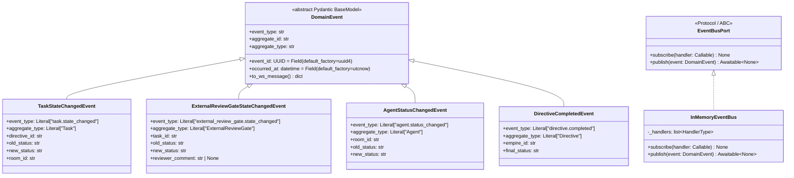

# 詳細設計書

> feature: `websocket-broadcast` / sub-feature: `domain`
> 親業務仕様: [`../feature-spec.md`](../feature-spec.md)
> 関連 Issue: [#158 feat(websocket-broadcast): Domain Event基盤](https://github.com/bakufu-dev/bakufu/issues/158)
> 関連: [`basic-design.md`](basic-design.md)

## 本書の役割

本書は **階層 3: モジュール（sub-feature domain）の詳細設計**（Module-level Detailed Design）を凍結する。[`basic-design.md`](basic-design.md) で凍結されたモジュール基本設計を、実装直前の **構造契約・確定事項・クラス詳細** として詳細化する。実装 PR は本書を改変せず参照する。設計変更が必要なら本書を先に更新する PR を立てる。

**書くこと**:
- 親 [`feature-spec.md §7`](../feature-spec.md) 確定 R1-X を実装方針として展開する `§確定 A` / `§確定 B` ...
- クラス設計（詳細）— 属性・型・制約
- MSG 確定文言（実装者が改変できない契約）
- 不変条件（Invariant）

**書かないこと**:
- ソースコードそのもの（疑似コード・サンプル実装を含む）→ 実装 PR
- 業務ルールの採用根拠の議論 → 親 `feature-spec.md §7`

## クラス設計（詳細）



### DomainEvent 基底クラス（詳細）

| 属性 | 型 | デフォルト | 制約 |
|---|---|---|---|
| `event_id` | `UUID` | `uuid4()` 自動生成 | 不変（設定後変更禁止）|
| `event_type` | `str` | 具体 Event クラスの `Literal` で固定 | 非空文字列、`"<aggregate>.<action>"` 形式 |
| `aggregate_id` | `str` | 必須（呼び出し元が設定）| 非空文字列 |
| `aggregate_type` | `str` | 具体 Event クラスの `Literal` で固定 | 非空文字列 |
| `occurred_at` | `datetime` | `datetime.now(UTC)` 自動生成 | UTC タイムゾーン付き datetime |

**`to_ws_message()` の出力仕様**:

| キー | 型 | 内容 |
|---|---|---|
| `event_type` | `str` | Aggregate.action 形式の識別子 |
| `aggregate_id` | `str` | 発火元 Aggregate の UUID 文字列 |
| `aggregate_type` | `str` | 発火元 Aggregate 種別 |
| `occurred_at` | `str` | ISO 8601 UTC 形式（例: `"2026-05-02T10:30:00.000Z"`）|
| `payload` | `dict` | 具体 Event クラスのフィールドから `event_id / event_type / aggregate_id / aggregate_type / occurred_at` を除いた残余フィールド |

**不変条件**:
- `event_id` は生成後に変更しない
- `occurred_at` は生成時の UTC 時刻で固定する
- `payload` にシークレット（API キー / パスワード / トークン）を格納しない（masking gateway 通過後の状態データのみ）

### TaskStateChangedEvent（詳細）

| 属性 | 型 | 制約 |
|---|---|---|
| `event_type` | `Literal["task.state_changed"]` | 固定値 |
| `aggregate_type` | `Literal["Task"]` | 固定値 |
| `directive_id` | `str` | 非空文字列。Task が属する Directive の ID |
| `old_status` | `str` | 遷移前の TaskStatus enum 値の文字列表現 |
| `new_status` | `str` | 遷移後の TaskStatus enum 値の文字列表現 |
| `room_id` | `str` | Task が実行される Room の ID |

### ExternalReviewGateStateChangedEvent（詳細）

| 属性 | 型 | 制約 |
|---|---|---|
| `event_type` | `Literal["external_review_gate.state_changed"]` | 固定値 |
| `aggregate_type` | `Literal["ExternalReviewGate"]` | 固定値 |
| `task_id` | `str` | Gate が紐付く Task の ID |
| `old_status` | `str` | 遷移前の ReviewGateStatus 文字列表現 |
| `new_status` | `str` | 遷移後の ReviewGateStatus 文字列表現 |
| `reviewer_comment` | `str \| None` | 承認 / 却下コメント（任意）。`None` 許容。**人間入力フィールドのため Service 層で `masking.apply()` 適用後の値を渡すこと**（§確定 F 参照）|

### AgentStatusChangedEvent（詳細）

| 属性 | 型 | 制約 |
|---|---|---|
| `event_type` | `Literal["agent.status_changed"]` | 固定値 |
| `aggregate_type` | `Literal["Agent"]` | 固定値 |
| `room_id` | `str` | Agent が所属する Room の ID |
| `old_status` | `str` | 遷移前の AgentStatus 文字列表現 |
| `new_status` | `str` | 遷移後の AgentStatus 文字列表現 |

### DirectiveCompletedEvent（詳細）

| 属性 | 型 | 制約 |
|---|---|---|
| `event_type` | `Literal["directive.completed"]` | 固定値 |
| `aggregate_type` | `Literal["Directive"]` | 固定値 |
| `empire_id` | `str` | Directive が属する Empire の ID |
| `final_status` | `str` | 完了時の DirectiveStatus 文字列表現（DONE / FAILED / CANCELLED）|

### EventBusPort（詳細）

| メソッド | シグネチャ | 制約 |
|---|---|---|
| `subscribe` | `(handler: Callable[[DomainEvent], Awaitable[None]]) -> None` | ハンドラは async callable である必要がある |
| `publish` | `(event: DomainEvent) -> Awaitable[None]` | 全購読者ハンドラに event を配信する責務を持つ |

**実装選択**: `Protocol` クラスを使用する（`abc.ABC` ではなく）。

**理由**: Python の `Protocol` は構造的部分型（structural subtyping）をサポートし、`InMemoryEventBus` が明示的に `EventBusPort` を継承する必要がない。将来の実装（Redis EventBus 等）を同様に `Protocol` 適合として扱える。pyright strict でも `Protocol` が型安全に機能する。

### InMemoryEventBus（詳細）

| 属性 / メソッド | 型 | 制約 |
|---|---|---|
| `_handlers` | `list[Callable[[DomainEvent], Awaitable[None]]]` | プライベート。外部から直接変更禁止 |
| `subscribe(handler)` | → `None` | スレッドセーフ不要（asyncio シングルスレッド前提）|
| `publish(event)` | → `Awaitable[None]` | `asyncio.gather(*[h(event) for h in self._handlers], return_exceptions=True)` で並行実行。`return_exceptions=True` により個別ハンドラエラーを例外として収集し、ログ記録後継続する |

**不変条件**:
- `publish()` の呼び出しは asyncio イベントループ内（`async def` 内）から行う
- ハンドラの登録順序は保証するが、並行実行のため完了順序は不定

## 確定事項（先送り撤廃）

### 確定 A: DomainEvent は Pydantic BaseModel として定義する

親 `feature-spec.md §7 R1-3` の実装方針。`dataclasses.dataclass` との比較:

| 観点 | Pydantic BaseModel | dataclasses.dataclass |
|---|---|---|
| バリデーション | Pydantic v2 で自動検証 | 手動実装が必要 |
| dict 変換 | `model_dump()` で一発 | `asdict()` |
| 既存コードとの整合 | ✅ 全 Schema が Pydantic v2 使用中 | ✗ 混在になる |

**採用**: `Pydantic BaseModel`。

### 確定 B: event_type 値の文字列定数一覧

| 定数 | 値 | 対応クラス |
|---|---|---|
| - | `"task.state_changed"` | `TaskStateChangedEvent` |
| - | `"external_review_gate.state_changed"` | `ExternalReviewGateStateChangedEvent` |
| - | `"agent.status_changed"` | `AgentStatusChangedEvent` |
| - | `"directive.completed"` | `DirectiveCompletedEvent` |

各クラスの `event_type` フィールドは `Literal["<value>"]` 型で定義し、文字列を変更不能とする。

### 確定 C: occurred_at は UTC タイムゾーン付きで生成する

`datetime.now(timezone.utc)` を使用する。`datetime.utcnow()`（非推奨）は使わない。`to_ws_message()` での ISO 8601 出力は `occurred_at.isoformat()` を使い末尾に `Z` を付与する（例: `"2026-05-02T10:30:00.000000+00:00"` または `"2026-05-02T10:30:00Z"`）。

### 確定 D: InMemoryEventBus.publish() のエラーハンドリング

`asyncio.gather(*handlers, return_exceptions=True)` の戻り値を走査し、`BaseException` のインスタンスを `logger.warning("EventBus handler error: %s", exc)` でログ記録する。他ハンドラの実行は継続する（Fail Soft）。

**理由**: WebSocket ブロードキャストハンドラのエラー（クライアント切断 = `WebSocketDisconnect`）が、他クライアントへの通知や業務操作の完了を妨げてはならない。

### 確定 E: ApplicationService への EventBusPort 注入

各 Service の `__init__` に `event_bus: EventBusPort` 引数を追加する。`None` デフォルトは許容しない（Fail Fast）。`dependencies.py` に `get_event_bus()` を追加し `app.state.event_bus` から取得する（Issue #159 実装）。

```
TaskService.__init__(
    repo: TaskRepositoryPort,
    event_bus: EventBusPort,
    ...
)
```

各 Service の状態変化メソッドで業務操作成功後に `await event_bus.publish(Event(...))` を呼ぶ。操作失敗時は `publish()` を呼ばない。

### 確定 F: DomainEvent payload の masking ポリシー

`basic-design.md §masking 責務の明示` の実装方針。

| フィールド種別 | masking 適用タイミング | 対象フィールド |
|---|---|---|
| Aggregate 状態値（status enum 文字列）| DB 永続化時に `infrastructure/security/masking.py` 通過済み。DomainEvent 生成時の再 masking 不要 | `old_status` / `new_status` / `final_status` 全般 |
| 人間入力テキスト | **Service 層で DomainEvent 生成前に `masking.apply(value)` を呼ぶ**。`None` の場合は呼ばない | `ExternalReviewGateStateChangedEvent.reviewer_comment` |

**実装要件**: `ExternalReviewGateService.approve()` / `reject()` は `reviewer_comment` を受け取った際、`TaskStateChangedEvent` 生成前ではなく、`ExternalReviewGateStateChangedEvent` 生成時の引数として `masking.apply(reviewer_comment)` 適用済みの値を渡す。

**理由**: `reviewer_comment` はユーザーが直接入力するテキストであり、API キー / トークン / パスワードの不意のペーストリスクがある。DB 永続化フローを経由しないため masking gateway を通過しない。WebSocket ペイロードとして全クライアントにブロードキャストされるため、シークレット露出の影響範囲が広い。

## MSG 確定文言表

| ID | ログレベル | メッセージテンプレート | 記録箇所 |
|---|---|---|---|
| MSG-WSB-001 | `WARNING` | `EventBus handler error: {exc_type}: {exc_message}` | `InMemoryEventBus.publish()` — ハンドラ例外キャッチ時 |
| MSG-WSB-002 | `DEBUG` | `DomainEvent published: {event_type} aggregate_id={aggregate_id}` | `InMemoryEventBus.publish()` — 配信完了時 |
