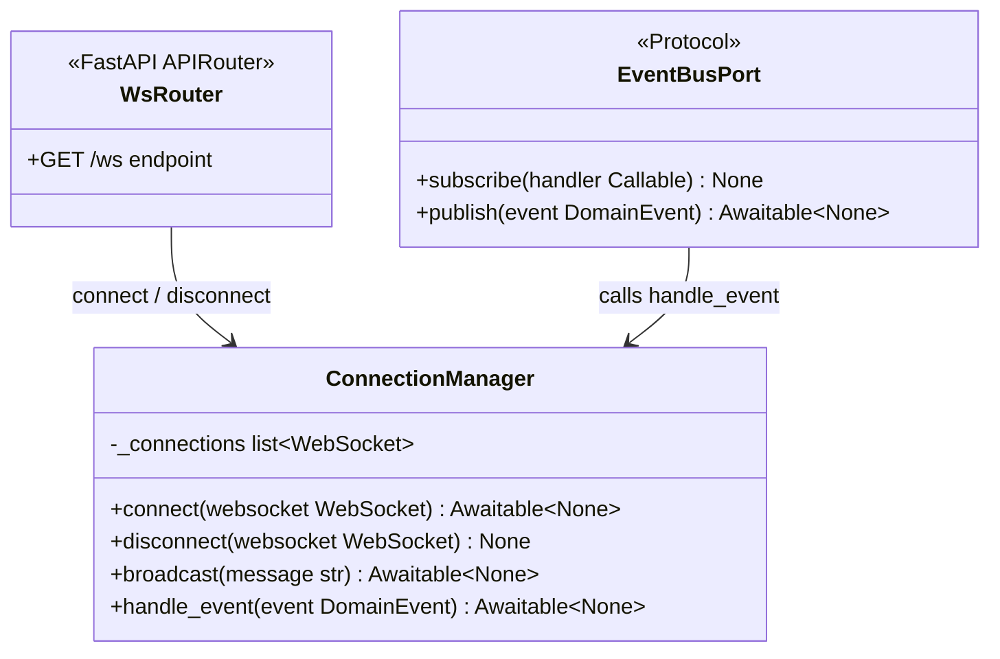
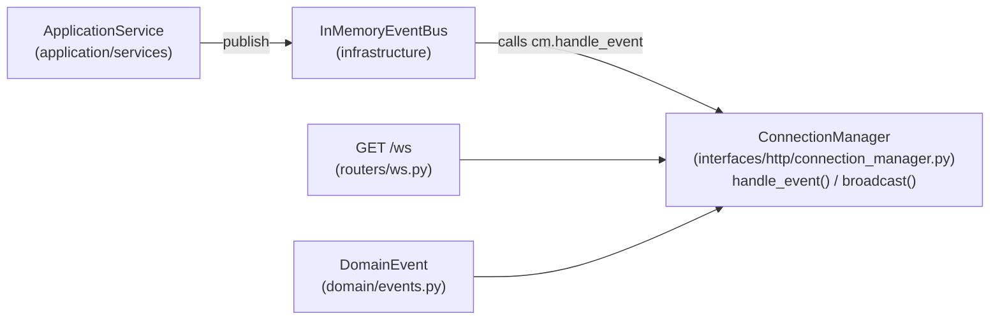
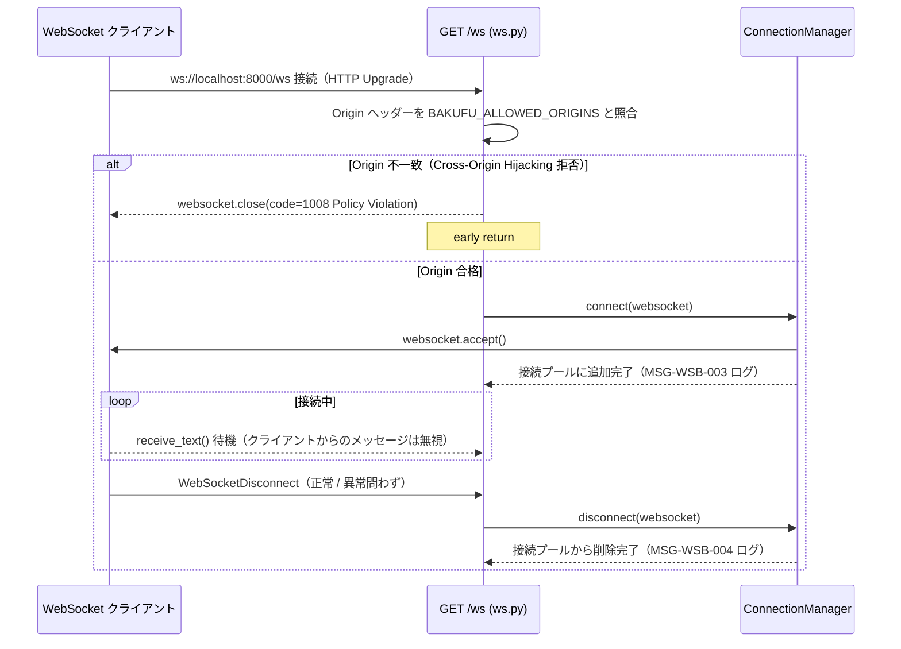
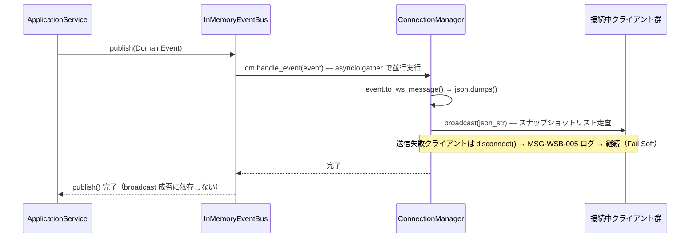
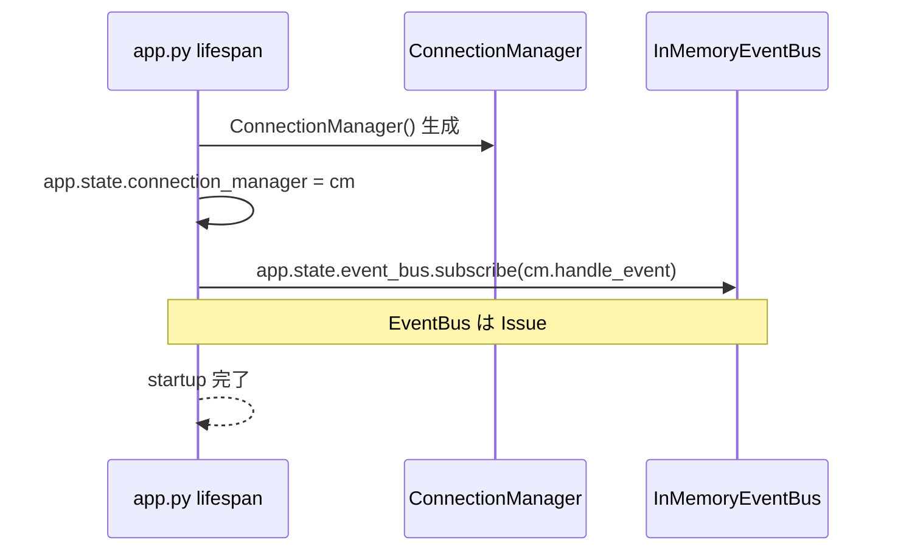

# 基本設計書

> feature: `websocket-broadcast` / sub-feature: `http-api`
> 親業務仕様: [`../feature-spec.md`](../feature-spec.md)
> 関連 Issue: [#159 feat(websocket-broadcast): WebSocket endpoint + ConnectionManager](https://github.com/bakufu-dev/bakufu/issues/159)
> 関連: [`detailed-design.md`](detailed-design.md) / [`test-design.md`](test-design.md)

## 本書の役割

本書は **階層 3: モジュール（sub-feature http-api）の基本設計**（Module-level Basic Design）を凍結する。Issue #158 で確立した EventBus / DomainEvent 基盤の上に、WebSocket endpoint と ConnectionManager を実装する。CEO や UI 開発者がリアルタイムイベントを受信するための interfaces 層接点を確立する。

機能要件（REQ-WSB-009〜012）は本書 §モジュール契約 として統合される。本書は **構造契約と処理フローを凍結する** — 「どのモジュールが・どの順で・何を担うか」のレベルで凍結する。

**書くこと**:
- モジュール構成（機能 ID → ディレクトリ → 責務）
- モジュール契約（機能要件の入出力、業務記述）
- クラス設計（概要）
- 処理フロー（ユースケース単位）
- シーケンス図 / エラーハンドリング方針

**書かないこと**（後段の設計書へ追い出す）:
- 属性の型・制約 → [`detailed-design.md`](detailed-design.md) §クラス設計（詳細）
- 確定実装方針の詳細 → [`detailed-design.md`](detailed-design.md) §確定事項
- 疑似コード・サンプル実装（言語コードブロック）→ 実装 PR

## モジュール構成

| 機能 ID | モジュール | ディレクトリ | 責務 |
|---|---|---|---|
| REQ-WSB-009 | `connection_manager` | `interfaces/http/connection_manager.py` | WebSocket 接続プールの管理・ブロードキャスト |
| REQ-WSB-010 | `ws_bridge` | `interfaces/http/connection_manager.py` | EventBus → WebSocket 変換ハンドラ（`DomainEvent.to_ws_message()` → JSON → `broadcast()`）|
| REQ-WSB-011 | `ws_router` | `interfaces/http/routers/ws.py` | `GET /ws` WebSocket エンドポイント定義 |
| REQ-WSB-012 | `lifespan_integration` | `interfaces/http/app.py` | lifespan への ConnectionManager 初期化 + EventBus bridge 登録 |

```
backend/src/bakufu/interfaces/http/
├── connection_manager.py          # REQ-WSB-009: ConnectionManager クラス
│                                  # REQ-WSB-010: make_ws_bridge_handler() ファクトリ
├── app.py                         # REQ-WSB-012: lifespan に CM 初期化 + subscribe() 追加
└── routers/
    └── ws.py                      # REQ-WSB-011: GET /ws WebSocket エンドポイント
```

## モジュール契約（機能要件）

各 REQ-WSB-NNN は親 [`feature-spec.md §5`](../feature-spec.md) ユースケース UC-WSB-NNN と対応する（孤児要件なし）。

### REQ-WSB-009: ConnectionManager

| 項目 | 内容 |
|---|---|
| 入力 | `connect(websocket)`: FastAPI `WebSocket` インスタンス / `disconnect(websocket)`: FastAPI `WebSocket` インスタンス / `broadcast(message)`: JSON 文字列 |
| 処理 | `connect()` は WebSocket を `accept()` し接続プールに追加する。`disconnect()` は接続プールから削除する。`broadcast()` は接続プール全クライアントにメッセージを送信する。送信失敗（切断済みクライアント等）は `disconnect()` を呼んで除去し、残存クライアントへの配信を継続する（Fail Soft）|
| 出力 | `connect()` → None（`accept()` 完了）/ `disconnect()` → None / `broadcast()` → None（全クライアント処理完了）|
| エラー時 | `broadcast()` 内の個別クライアント送信例外 → 失敗クライアントを接続プールから除去してログ記録（MSG-WSB-005）し次クライアントへ継続。業務操作のトランザクションには影響しない |

**紐付く UC**: UC-WSB-001 / UC-WSB-002 / UC-WSB-005

### REQ-WSB-010: EventBus → WebSocket bridge handler

| 項目 | 内容 |
|---|---|
| 入力 | `DomainEvent` インスタンス（`EventBusPort` の handler として `InMemoryEventBus` から呼ばれる）|
| 処理 | `ConnectionManager.handle_event(event)` メソッドとして実装する。`event.to_ws_message()` で dict を生成し JSON 文字列に変換して `self.broadcast()` を呼ぶ。lifespan で `event_bus.subscribe(cm.handle_event)` と登録する（bound method が `EventBusPort.subscribe()` の handler シグネチャに適合）|
| 出力 | None（副作用として WebSocket 配信を実行）|
| エラー時 | `ConnectionManager.broadcast()` 内の個別クライアント例外は Fail Soft で処理済み（REQ-WSB-009）。`handle_event` 自体のエラーは `InMemoryEventBus` の Fail Soft（MSG-WSB-001）で捕捉され、他ハンドラへは伝播しない |

**紐付く UC**: UC-WSB-001 / UC-WSB-002

### REQ-WSB-011: `GET /ws` WebSocket エンドポイント

| 項目 | 内容 |
|---|---|
| 入力 | WebSocket 接続リクエスト（クライアントの `ws://localhost:8000/ws` 接続 HTTP Upgrade）|
| 処理 | ① `websocket.headers.get("origin")` を `BAKUFU_ALLOWED_ORIGINS` と照合し、不一致なら `await websocket.close(code=1008)` → return（早期拒否）。② Origin 合格後に `ConnectionManager.connect(websocket)` で接続を受け入れ接続プールに登録する。③ ループで `receive_text()` を待機し（MVP ではクライアントからのメッセージを無視する）、`WebSocketDisconnect` を捕捉したら `ConnectionManager.disconnect(websocket)` を呼ぶ |
| 出力 | 接続維持中は WebSocket コネクションをオープン状態に保つ。切断時は graceful close |
| エラー時 | `WebSocketDisconnect` → `ConnectionManager.disconnect()` を呼んで接続プールから削除。例外を再 raise しない（接続切断は正常フロー）|

**紐付く UC**: UC-WSB-005

### REQ-WSB-012: lifespan 統合

| 項目 | 内容 |
|---|---|
| 入力 | FastAPI アプリケーションの startup イベント |
| 処理 | `ConnectionManager` インスタンスを生成し `app.state.connection_manager` に保持する。`app.state.event_bus.subscribe(cm.handle_event)` で bound method を EventBus に登録する。`cm.handle_event` は `EventBusPort` handler シグネチャ `(event: DomainEvent) -> Awaitable[None]` に適合する |
| 出力 | `app.state.connection_manager` の設定完了。EventBus に bridge handler が登録済み |
| エラー時 | 初期化は IO なしのため例外なく完了する。`get_connection_manager()` が `app.state.connection_manager` 未設定時は `BakufuConfigError` を raise して Fail Fast（リクエスト処理時に明示的エラーとして検知）|

**紐付く UC**: UC-WSB-001 / UC-WSB-002 / UC-WSB-005

## クラス設計（概要）



### 依存関係図



依存方向: `interfaces → application/ports（EventBusPort）→ domain ← infrastructure`（Clean Architecture 規律を維持）

**interfaces レイヤー内の依存制約**:
- `ws.py` は `ConnectionManager` を使用するが `DomainEvent` を直接 import しない（`handle_event` メソッドに封じ込める）
- `connection_manager.py` は `DomainEvent` を `handle_event` のシグネチャ型注釈のみで参照する。domain 層への依存は型注釈レベルに留め、実行時の結合を最小化する

## 処理フロー

### UC-WSB-005: WebSocket 接続確立・維持・切断



### UC-WSB-001/002: Domain Event → WebSocket 配信



### lifespan 初期化フロー（REQ-WSB-012）



## セキュリティ設計

### OWASP Top 10 対応マッピング

| OWASP | リスク | 本設計での対応 |
|---|---|---|
| A01 Broken Access Control | WebSocket 接続の不正利用 / Cross-Origin WebSocket Hijacking | `127.0.0.1` バインド前提（loopback 専用）。加えて `ws.py` エンドポイント内で `Origin` ヘッダーを `BAKUFU_ALLOWED_ORIGINS` と照合し、不一致なら `websocket.close(code=1008)` で即時拒否する（`BaseHTTPMiddleware` は WebSocket scope を処理しないため `CsrfOriginMiddleware` には委譲できない）|
| A03 Injection | クライアントからの不正メッセージ | `ws.py` は受信メッセージを読み取るが処理しない。業務操作はすべて REST API 経由。コマンドインジェクション経路なし |
| A04 Insecure Design | 切断クライアントへの送信でブロードキャスト全体が止まる | Fail Soft 設計（feature-spec.md R1-5）。`broadcast()` は失敗クライアントを除去して継続。1 接続の切断が他クライアントをブロックしない |
| A09 Security Logging | 接続・切断・エラーの追跡不能 | MSG-WSB-003〜005 でログ記録（接続数・切断・送信失敗）|

### 攻撃面（Attack Surface）

| 項目 | 内容 |
|---|---|
| エンドポイント | `GET /ws` 単一エンドポイントのみ（R1-1）。認証不要（R1-6）。loopback バインド前提 |
| 受信メッセージ処理 | MVP では無視。処理ロジックがないためコマンドインジェクション経路なし |
| ブロードキャスト内容 | `DomainEvent.to_ws_message()` 出力のみ。masking gateway 通過済みの state data（domain sub-feature §確定F 保証）|
| Origin 検証 | `ws.py` エンドポイント内で明示的に実施。`websocket.headers.get("origin")` を `BAKUFU_ALLOWED_ORIGINS` と照合し、不一致なら `websocket.close(code=1008)` → return（`CsrfOriginMiddleware` は WebSocket scope を処理しないため委譲不可。detailed-design.md §確定E 参照）|

## エラーハンドリング方針

| エラーシナリオ | 対応方針 |
|---|---|
| `WebSocketDisconnect` during receive loop | `ConnectionManager.disconnect()` を呼んで接続プール削除。例外を再 raise しない（切断は正常フロー）|
| `broadcast()` 内の個別クライアント送信例外 | Fail Soft — 失敗クライアントを `disconnect()` → MSG-WSB-005 ログ → 次クライアントへ継続 |
| `app.state.connection_manager` 未初期化 | Fail Fast — `get_connection_manager()` が `BakufuConfigError("ConnectionManager is not initialized. Check lifespan startup.")` を raise。リクエスト処理時に明示的エラーとして検知（detailed-design.md §get_connection_manager() 参照）|
| bridge handler が `broadcast()` 呼び出し中に例外 | `InMemoryEventBus` の Fail Soft（MSG-WSB-001）で捕捉。他 EventBus ハンドラへは影響しない |

## ユーザー向けメッセージ一覧

| ID | 種別 | メッセージ（要旨）| 表示条件 |
|---|---|---|---|
| MSG-WSB-003 | ログ（INFO）| `WebSocket client connected: total={count}` | `ConnectionManager.connect()` — accept 完了後 |
| MSG-WSB-004 | ログ（INFO）| `WebSocket client disconnected: total={count}` | `ConnectionManager.disconnect()` — 削除完了後 |
| MSG-WSB-005 | ログ（WARNING）| `WebSocket broadcast failed for client: {exc_type}: {exc_message}` | `ConnectionManager.broadcast()` — 個別送信例外時 |
