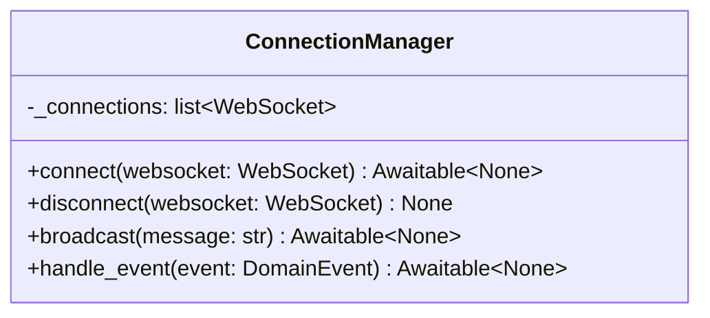

# 詳細設計書

> feature: `websocket-broadcast` / sub-feature: `http-api`
> 親業務仕様: [`../feature-spec.md`](../feature-spec.md)
> 関連 Issue: [#159 feat(websocket-broadcast): WebSocket endpoint + ConnectionManager](https://github.com/bakufu-dev/bakufu/issues/159)
> 関連: [`basic-design.md`](basic-design.md)

## 本書の役割

本書は **階層 3: モジュール（sub-feature http-api）の詳細設計**（Module-level Detailed Design）を凍結する。[`basic-design.md`](basic-design.md) で凍結されたモジュール基本設計を、実装直前の **構造契約・確定事項・クラス詳細** として詳細化する。実装 PR は本書を改変せず参照する。設計変更が必要なら本書を先に更新する PR を立てる。

**書くこと**:
- クラス設計（詳細）— 属性・型・制約
- MSG 確定文言（実装者が改変できない契約）
- 不変条件（Invariant）
- 確定事項（先送り撤廃）

**書かないこと**:
- ソースコードそのもの（疑似コード・サンプル実装を含む）→ 実装 PR
- 業務ルールの採用根拠の議論 → 親 `feature-spec.md §7`

## クラス設計（詳細）

### ConnectionManager（詳細）

| 属性 / メソッド | 型 | 制約 |
|---|---|---|
| `_connections` | `list[WebSocket]` | プライベート。外部から直接変更禁止。asyncio シングルスレッド前提のためスレッドセーフ不要 |
| `connect(websocket)` | `async def → None` | `await websocket.accept()` 完了後に `_connections.append(websocket)` する（§確定D）|
| `disconnect(websocket)` | `def → None` | `if websocket in _connections` ガード後に `_connections.remove(websocket)` する。二重削除で `ValueError` が出ないよう存在チェック必須 |
| `broadcast(message)` | `async def → None` | `list(_connections)` でスナップショットを取り走査する（§確定B）。各クライアントに `await ws.send_text(message)` を呼ぶ。例外時は `disconnect(ws)` → `logger.warning(MSG-WSB-005)` → 継続（Fail Soft）|
| `handle_event(event)` | `async def → None` | `DomainEvent` を受け取り `json.dumps(event.to_ws_message())` で JSON 文字列を生成し `broadcast(json_str)` を呼ぶ。`EventBusPort.subscribe()` の handler シグネチャ `(event: DomainEvent) -> Awaitable[None]` に適合する bound method として lifespan で `event_bus.subscribe(cm.handle_event)` に渡す（§確定C）|

**不変条件**:
- `connect()` の `accept()` は1回のみ。重複 connect の防止は Router 側責務
- `broadcast()` は `_connections` が空でも例外なく完了する（空リストのループは no-op）
- `broadcast()` 走査中は `list(_connections)` スナップショットを使用し、走査対象リストへの変更による `RuntimeError` を防ぐ

### ConnectionManager.handle_event（詳細）

| 項目 | 内容 |
|---|---|
| シグネチャ | `async def handle_event(self, event: DomainEvent) -> None` |
| 実体 | `ConnectionManager` インスタンスのメソッド。`event_bus.subscribe(cm.handle_event)` として渡すと bound method となり `self`（`_connections` プール）を自然にキャプチャする（§確定C）|
| 処理 | `json.dumps(event.to_ws_message())` で JSON 文字列を生成し `self.broadcast(json_str)` を呼ぶ |
| JSON 直列化の制約 | `DomainEvent.to_ws_message()` は `event_id`（UUID）と `occurred_at`（datetime）を文字列変換済みの dict を返す（`domain/detailed-design.md §DomainEvent 基底クラス` 仕様）。`json.dumps` は標準ライブラリ `json` のみ使用。カスタムエンコーダ不要 |
| `EventBusPort` 適合 | bound method `cm.handle_event` は `Callable[[DomainEvent], Awaitable[None]]` 型（`EventBusPort.subscribe()` の handler 引数型に適合）|

### `GET /ws` エンドポイント（詳細）

| 項目 | 内容 |
|---|---|
| パス | `/ws` |
| プロトコル | WebSocket（HTTP Upgrade）|
| DI 依存 | `websocket: WebSocket`（FastAPI framework inject）/ `cm: Annotated[ConnectionManager, Depends(get_connection_manager)]` |
| 処理フロー | `await cm.connect(websocket)` → `try` ブロック内で `while True: await websocket.receive_text()` → `except WebSocketDisconnect: cm.disconnect(websocket)` |
| 受信メッセージ | `receive_text()` の戻り値を捨てる（MVP では UI → サーバーの WebSocket 経由操作なし）|
| 正常切断（code=1000/1001）| `WebSocketDisconnect` として捕捉し `cm.disconnect()` を呼ぶ |
| 異常切断（任意 code）| 同様に `WebSocketDisconnect` として捕捉し `cm.disconnect()` を呼ぶ |
| エラーを再 raise するか | しない（切断は正常フロー。Router の try/except は error_handlers.py の外に例外を出さない）|

### `get_connection_manager()` DI ファクトリ（詳細）

| 項目 | 内容 |
|---|---|
| 配置先 | `interfaces/http/dependencies.py` |
| シグネチャ | `(request: Request) -> ConnectionManager` |
| 処理 | `return request.app.state.connection_manager` |
| エラー時 | `app.state.connection_manager` 未設定 → `BakufuConfigError("ConnectionManager is not initialized. Check lifespan startup.")` を raise → Fail Fast（リクエスト処理時に明示的エラーとして検知）|

## 確定事項（先送り撤廃）

### 確定 A: 接続プールのデータ構造は `list[WebSocket]` とする

`set[WebSocket]` との比較:

| 観点 | `list[WebSocket]` | `set[WebSocket]` |
|---|---|---|
| MVP 接続数 | 1〜数接続で O(n) 削除は問題なし | 同上 |
| WebSocket hashable 保証 | 不要 | FastAPI `WebSocket` の hashable 実装に依存（実装詳細への依存）|
| FastAPI 公式リファレンス | `list` 使用（https://fastapi.tiangolo.com/advanced/websockets/#handling-disconnections-and-multiple-clients）| 非標準 |
| 走査順序 | 追加順保証（デバッグ容易）| 不定 |

**採用**: `list[WebSocket]`。FastAPI 公式ドキュメント準拠。MVP スケールで性能問題なし。

### 確定 B: `broadcast()` はスナップショットリストを走査する

`broadcast()` は `list(_connections)` でスナップショットを取ってから走査する。

**理由**: `await send_text()` で asyncio イベントループに制御が渡る可能性がある。スナップショット走査により走査中の `_connections` 変更（他コルーチンによる `disconnect()` 等）による `RuntimeError` を防ぐ。asyncio の協調的マルチタスク前提でも安全性を保つ。

### 確定 C: EventBus bridge handler は `ConnectionManager.handle_event` bound method とする

lifespan で `event_bus.subscribe(cm.handle_event)` と記述し、`cm` インスタンスの bound method を直接 EventBus に登録する。

**理由**: `EventBusPort.subscribe()` の handler シグネチャは `(event: DomainEvent) -> Awaitable[None]` の 1 引数関数。bound method `cm.handle_event` はこのシグネチャに自然に適合し、`self`（`_connections` プール）をキャプチャする。モジュールレベル関数 `make_ws_bridge_handler(cm)` は公開関数禁止原則（Tell, Don't Ask / 責務はクラスに閉じろ）に違反する。メソッドとして `ConnectionManager` に閉じることで責務が明確になり、ファクトリ関数という間接レイヤーが不要になる。

### 確定 D: `connect()` は `accept()` 完了後に接続プールに追加する

`await websocket.accept()` が完了してから `_connections.append(websocket)` を実行する。

**理由**: `accept()` 失敗（クライアントが接続を即断した場合等）で未 accept の WebSocket が接続プールに混入しない。accept 完了を「接続有効」の条件とし、`broadcast()` 走査対象から除外する。

### 確定 E: WebSocket の Origin 検証は `ws.py` エンドポイント内で明示的に実施する

`GET /ws` エンドポイントは接続受け入れ前に `websocket.headers.get("origin")` を読み取る。`Origin` ヘッダーが **存在しかつ** `BAKUFU_ALLOWED_ORIGINS` に含まれない場合のみ `await websocket.close(code=1008)` で拒否する。`Origin` ヘッダーが存在しない場合（`None`）は通過を許可する。

| 処理ステップ | 内容 |
|---|---|
| Origin 読み取り | `origin = websocket.headers.get("origin")` — 不在時は `None` |
| 許可リスト取得 | `app.state.allowed_origins`（lifespan で `BAKUFU_ALLOWED_ORIGINS` から設定）|
| 検証条件 | `origin is not None and origin not in allowed_origins` → `await websocket.close(code=1008)` → return |
| 合格時 | `await cm.connect(websocket)` に進む（`origin is None` の通過含む）|

**Origin ヘッダー不在（`None`）を通過させる根拠**:

Origin ヘッダーはブラウザ固有の仕様（[RFC 6454](https://datatracker.ietf.org/doc/html/rfc6454)、[Fetch API](https://fetch.spec.whatwg.org/)）。ブラウザは Cross-Origin リクエストに必ず Origin を付与するが、CLI ツール・AI agent は Origin ヘッダーを送信しない。

| クライアント種別 | Origin ヘッダー | 本設計での扱い |
|---|---|---|
| ブラウザ（正規: `http://localhost:5173`）| `http://localhost:5173` | 許可リスト合格 → 通過 |
| ブラウザ（Cross-Origin: `https://attacker.com`）| `https://attacker.com` | 許可リスト不一致 → close(1008)拒否 |
| CLI ツール（`websocat`, `python-websockets` 等）| 不在（`None`）| `None` 扱い → 通過 |
| AI agent（bakufu 自身のサブプロセス等）| 不在（`None`）| `None` 扱い → 通過 |
| 文字列 `"null"`（iframe からのリクエスト等）| `"null"` | 許可リスト不一致 → close(1008)拒否 |

**MVP ゴールとの整合**: bakufu の MVP ゴールは bakufu 自身が自立的に開発指示を行うシステム（feature-spec.md §3 ビジョン）。bakufu サブプロセスや AI agent が WebSocket で bakufu UI の状態をリアルタイム受信するユースケースは MVP スコープ内であり、Origin なしクライアントの接続を許容する必要がある。

**Cross-Origin Hijacking 防衛線の有効性**: この決定によって Cross-Origin WebSocket Hijacking の防衛線は失われない。ブラウザは仕様上 Origin を必ず送信するため、攻撃者がブラウザ経由で接続する場合は `origin not in allowed_origins` の検証で確実に拒否される。Origin ヘッダーを省略して接続できるのは CLI/agent のみであり、それは意図した接続者だ。

**BaseHTTPMiddleware の非適用根拠**: `CsrfOriginMiddleware` は `BaseHTTPMiddleware` を継承している。Starlette の `BaseHTTPMiddleware.__call__` は `scope["type"] != "http"` の場合（WebSocket は `scope["type"] == "websocket"`）に `dispatch()` を呼ばずそのまま通過させる。また GET は `_SAFE_METHODS` に含まれるため二重にスキップされる。WebSocket 接続は `CsrfOriginMiddleware` の検証を一切受けないため、ws.py での明示検証が必須（OWASP A01）。WebSocket close code 1008（Policy Violation）は RFC 6455 の標準コード。

### 確定 F: `ws.py` は `receive_text()` ループで切断を検知する

`while True: await websocket.receive_text()` ループで接続を維持し、`WebSocketDisconnect` 例外でループを抜けて切断処理を行う。

**理由**: FastAPI WebSocket は受信待機中にクライアント切断が発生すると `WebSocketDisconnect` を発火する（uvicorn/starlette 実装）。`receive_text()` は MVP では受信データを処理しないが、接続維持とバックプレッシャー制御のためにループが必要。`receive_bytes()` ではなく `receive_text()` を使用するのは、MVP のクライアントが text frame のみを送信する想定のため。

## MSG 確定文言表

| ID | ログレベル | メッセージテンプレート | 記録箇所 |
|---|---|---|---|
| MSG-WSB-003 | `INFO` | `WebSocket client connected: total={count}` | `ConnectionManager.connect()` — `accept()` 完了・追加後 |
| MSG-WSB-004 | `INFO` | `WebSocket client disconnected: total={count}` | `ConnectionManager.disconnect()` — 削除完了後 |
| MSG-WSB-005 | `WARNING` | `WebSocket broadcast failed for client: {exc_type}: {exc_message}` | `ConnectionManager.broadcast()` — 個別クライアント送信例外時 |
