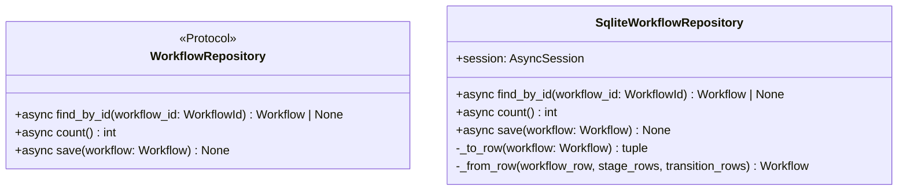

# 詳細設計書

> feature: `workflow-repository`
> 関連: [basic-design.md](basic-design.md) / [`docs/features/empire-repository/detailed-design.md`](../empire-repository/detailed-design.md) **テンプレート真実源** / [`docs/features/workflow/detailed-design.md`](../workflow/detailed-design.md) （domain VO 凍結済み）

## 記述ルール（必ず守ること）

詳細設計に**疑似コード・サンプル実装（python/ts/sh/yaml 等の言語コードブロック）を書かない**。
ソースコードと二重管理になりメンテナンスコストしか生まない。
必要なのは「構造契約（属性名・型・制約）」と「確定文言（メッセージ文字列）」と「実装の意図」。

## クラス設計（詳細）

### Protocol: WorkflowRepository（`application/ports/workflow_repository.py`）

| メソッド | 引数 | 戻り値 | 制約 |
|----|----|----|----|
| `find_by_id(workflow_id: WorkflowId)` | WorkflowId | `Workflow \| None` | 不在時 None。SQLAlchemy 例外は上位伝播 |
| `count()` | なし | `int` | 全 Workflow 数（empire-repo §確定 D 同 SQL `COUNT(*)` 契約） |
| `save(workflow: Workflow)` | Workflow | None | 同一 Tx 内で workflows + workflow_stages + workflow_transitions を delete-then-insert（empire-repo §確定 B 踏襲） |

`@runtime_checkable` は付与しない（empire-repo §確定 A、Python 3.12 typing.Protocol の duck typing で十分）。

### Class: SqliteWorkflowRepository（`infrastructure/persistence/sqlite/repositories/workflow_repository.py`）

| 属性 | 型 | 制約 |
|----|----|----|
| `session` | `AsyncSession` | コンストラクタで注入、Tx 境界は外側 service が管理（empire-repo §確定 B） |

| 関数 | 引数 | 戻り値 | 制約 |
|----|----|----|----|
| `__init__(session: AsyncSession)` | session | None | session を保持するだけ、Tx は開かない |
| `find_by_id(workflow_id)` | WorkflowId | `Workflow \| None` | workflows SELECT → 不在なら None。存在すれば workflow_stages を `ORDER BY stage_id` / workflow_transitions を `ORDER BY transition_id` で SELECT（[basic-design.md](basic-design.md) §ユースケース 2 が真実源、empire-repo §Known Issues §BUG-EMR-001 規約を本 PR 設計段階から適用）→ `_from_row` で構築 |
| `count()` | なし | int | `select(func.count()).select_from(WorkflowRow)` で SQL `COUNT(*)` 発行、`scalar_one()` で int 取得。**全行ロード+ Python `len()` パターンは禁止**（empire-repo §確定 D 補強の凍結） |
| `save(workflow)` | Workflow | None | §確定 B の delete-then-insert（5 段階手順、後述） |
| `_to_row(workflow)` | Workflow | `tuple[dict, list[dict], list[dict]]` | (workflows_row, stage_rows, transition_rows) に分離（§確定 C） |
| `_from_row(workflow_row, stage_rows, transition_rows)` | dict, list[dict], list[dict] | Workflow | VO 構造で復元（§確定 C + §確定 G〜I の双方向変換） |

### Tables（既存 M2 永続化基盤の table モジュール群に追加）

| テーブル | モジュール | カラム |
|----|----|----|
| `workflows` | `infrastructure/persistence/sqlite/tables/workflows.py`（新規） | `id: UUIDStr PK` / `name: String(80) NOT NULL` / `entry_stage_id: UUIDStr NOT NULL`（FK 宣言なし、§確定 J） |
| `workflow_stages` | `infrastructure/persistence/sqlite/tables/workflow_stages.py`（新規） | `workflow_id: UUIDStr FK CASCADE` / `stage_id: UUIDStr` / `name: String(80)` / `kind: String(32)` / `roles_csv: String(255)` / `deliverable_template: Text` / `completion_policy_json: JSONEncoded` / **`notify_channels_json: MaskedJSONEncoded`** / UNIQUE(workflow_id, stage_id) |
| `workflow_transitions` | `infrastructure/persistence/sqlite/tables/workflow_transitions.py`（新規） | `workflow_id: UUIDStr FK CASCADE` / `transition_id: UUIDStr` / `from_stage_id: UUIDStr` / `to_stage_id: UUIDStr` / `condition: String(32)` / `label: String(80)` / UNIQUE(workflow_id, transition_id) |

すべて `bakufu.infrastructure.persistence.sqlite.base.Base` を継承。

## 確定事項（先送り撤廃）

### 確定 A: empire-repository テンプレート 100% 継承（再凍結）

empire-repository PR #29 / #30 の §確定 A（Repository ポート配置）/ §確定 B（save delete-then-insert）/ §確定 C（domain ↔ row 変換 private method）/ §確定 D（count SQL `COUNT(*)` 契約）/ §確定 E（CI 三層防衛拡張）/ §確定 F（テンプレート責務凍結）/ §Known Issues §BUG-EMR-001 規約（find_by_id `ORDER BY` 必須）を本 PR で**そのまま継承**する。

本 PR で再議論しない項目:

| empire-repo 確定 | 本 PR への適用 |
|---|---|
| §確定 A | `application/ports/workflow_repository.py` 新規、Protocol 3 メソッド `async def`、`@runtime_checkable` なし |
| §確定 B | `save()` で workflows UPSERT + workflow_stages DELETE→INSERT + workflow_transitions DELETE→INSERT、Repository 内 commit / rollback なし |
| §確定 C | `_to_row` / `_from_row` を Repository クラス内 private method に閉じる |
| §確定 D | `count()` は `select(func.count()).select_from(WorkflowRow)` の SQL `COUNT(*)` 限定 |
| §確定 E | CI 三層防衛 Layer 1 + Layer 2 + Layer 3 全部に Workflow 3 テーブル明示登録 |
| §Known Issues §BUG-EMR-001 規約 | `find_by_id` 子テーブル SELECT は `ORDER BY stage_id` / `ORDER BY transition_id` を必ず発行、test 側は `sorted(..., key=lambda s: s.id)` で list 比較 |

### 確定 B: `save()` 手順（5 段階凍結、empire-repo §確定 B の Workflow 適用）

参照型カラム（`workflow_stages` / `workflow_transitions`）の更新は **同一 Tx 内で `DELETE WHERE workflow_id=?` → 全件 `INSERT`**。

##### 手順（凍結、`SqliteWorkflowRepository.save()` の内部）

| 順 | 操作 | SQL（概要） |
|---|---|---|
| 1 | workflows UPSERT | `INSERT INTO workflows (id, name, entry_stage_id) VALUES (...) ON CONFLICT (id) DO UPDATE SET name=EXCLUDED.name, entry_stage_id=EXCLUDED.entry_stage_id` |
| 2 | workflow_stages DELETE | `DELETE FROM workflow_stages WHERE workflow_id = :workflow_id` |
| 3 | workflow_stages bulk INSERT | `INSERT INTO workflow_stages (workflow_id, stage_id, name, kind, roles_csv, deliverable_template, completion_policy_json, notify_channels_json) VALUES ...`（workflow.stages 件数分、`notify_channels_json` は `MaskedJSONEncoded.process_bind_param` 経由でマスキング後 JSON） |
| 4 | workflow_transitions DELETE | `DELETE FROM workflow_transitions WHERE workflow_id = :workflow_id` |
| 5 | workflow_transitions bulk INSERT | `INSERT INTO workflow_transitions (workflow_id, transition_id, from_stage_id, to_stage_id, condition, label) VALUES ...`（workflow.transitions 件数分） |

##### Tx 境界の責務分離（再凍結）

`SqliteWorkflowRepository.save()` は **明示的な commit / rollback をしない**。呼び出し側 service が `async with session.begin():` で UoW 境界を管理（empire-repo §確定 B 踏襲）。

### 確定 C: domain ↔ row 変換契約（empire-repo §確定 C の Workflow 適用）

##### `_to_row(workflow: Workflow)` 契約

| 入力 | 出力 |
|---|---|
| `Workflow`（Aggregate Root インスタンス） | `tuple[dict, list[dict], list[dict]]` |

戻り値:
1. `workflows_row: dict[str, Any]` — `{'id': ..., 'name': ..., 'entry_stage_id': ...}`
2. `stage_rows: list[dict[str, Any]]` — 各 Stage を `{'workflow_id': ..., 'stage_id': ..., 'name': ..., 'kind': ..., 'roles_csv': ..., 'deliverable_template': ..., 'completion_policy_json': ..., 'notify_channels_json': ...}` に変換
3. `transition_rows: list[dict[str, Any]]` — 各 Transition を `{'workflow_id': ..., 'transition_id': ..., 'from_stage_id': ..., 'to_stage_id': ..., 'condition': ..., 'label': ...}` に変換

##### `_from_row(workflow_row, stage_rows, transition_rows)` 契約

| 入力 | 出力 |
|---|---|
| `workflow_row: dict` / `stage_rows: list[dict]` / `transition_rows: list[dict]` | `Workflow` |

戻り値: `Workflow(id=..., name=..., stages=[...], transitions=[...], entry_stage_id=...)`。Aggregate Root の不変条件（DAG / 一意性 / capacity）は Workflow 構築時の `model_validator(mode='after')` + `dag_validators` で再走（Repository は再 validate しない契約だが、構築は valid な状態で行われる、workflow #16 で凍結済み）。

##### pyright strict pass のための型注釈

`_to_row` / `_from_row` の戻り値は明示的な型注釈（`dict[str, Any]` / `Workflow`）。SQLAlchemy `Row` を直接返さず dict 経由（domain 層 SQLAlchemy 非依存）。

### 確定 D: `count()` SQL 契約（empire-repo §確定 D 踏襲）

| 採用 | 不採用 | 理由 |
|---|---|---|
| `select(func.count()).select_from(WorkflowRow)` で SQL `COUNT(*)` 発行、`scalar_one()` で int 取得 | `select(WorkflowRow.id)` で全行を取得して Python `len(list(result.scalars().all()))` | 本 PR は workflow stage / transition が 100+ 件まで膨れる現実があり、empire-repo PR #29 で凍結された `COUNT(*)` 契約を継承する。**全行ロード+ Python `len()` パターン伝播禁止** |

### 確定 E: CI 三層防衛 Workflow 拡張（**正のチェック**を導入、empire の負のチェックと差分）

##### Layer 1: grep guard（`scripts/ci/check_masking_columns.sh`）

既存スクリプトに Workflow テーブル群を**明示登録**:

| 登録内容 | 期待結果 |
|---|---|
| `tables/workflow_stages.py` の `notify_channels_json` カラム宣言行に `MaskedJSONEncoded` が含まれる | grep ヒット必須 → pass（**正のチェック**） |
| `tables/workflows.py` 全体に `MaskedJSONEncoded` / `MaskedText` が登場しない | grep ゼロヒット → pass（負のチェック、empire と同パターン） |
| `tables/workflow_stages.py` の `notify_channels_json` 以外のカラムに `MaskedJSONEncoded` / `MaskedText` が登場しない | grep 1 ヒット限定 → pass（過剰マスキング防止） |
| `tables/workflow_transitions.py` 全体に `MaskedJSONEncoded` / `MaskedText` が登場しない | grep ゼロヒット → pass |

empire-repo は「Empire 3 テーブル全て masking 対象なし」のため負のチェックのみだったが、本 PR は `notify_channels_json` が masking 対象**ある**ため**正のチェック**（必須登録）を導入する。

##### Layer 2: arch test（`backend/tests/architecture/test_masking_columns.py`）

既存 parametrize に 3 テーブル追加:

| 入力 | 期待 assertion |
|---|---|
| `Base.metadata.tables['workflows']` | 全カラムの `column.type.__class__` が `MaskedJSONEncoded` でも `MaskedText` でもない（`UUIDStr` / `String` のみ） |
| `Base.metadata.tables['workflow_stages']` の `notify_channels_json` カラム | `column.type.__class__ is MaskedJSONEncoded`（**正のチェック**） |
| `Base.metadata.tables['workflow_stages']` の `notify_channels_json` 以外のカラム | `column.type.__class__` が `MaskedJSONEncoded` でも `MaskedText` でもない |
| `Base.metadata.tables['workflow_transitions']` | 全カラムの `column.type.__class__` が `MaskedJSONEncoded` でも `MaskedText` でもない |

##### Layer 3: storage.md 逆引き表更新（REQ-WFR-005）

`docs/architecture/domain-model/storage.md` §逆引き表に Workflow 関連 3 行追加:

| 行 | 内容 |
|---|---|
| `workflow_stages.notify_channels_json` | `MaskedJSONEncoded`、Discord webhook token マスキング、Schneier 申し送り #6 + workflow §Confirmation G の Repository 経路実適用 |
| `workflows` | masking 対象なし（明示登録、後続 PR が誤って `MaskedText` を追加しない gate） |
| `workflow_transitions` | masking 対象なし（同上） |

##### 後続 Repository PR のテンプレート責務（Workflow → 残 5 件）

本 PR は empire-repo に続く 2 件目のテンプレート PR。**masking 対象あり**の Repository テンプレートを確立する責務を持つ:

| 後続 PR | 想定 masking カラム |
|---|---|
| `feature/agent-repository` | `agent_providers.api_key_*` 系（masking 対象あり想定） |
| `feature/room-repository` | masking 対象なし想定（Empire と同パターン） |
| `feature/directive-repository` | masking 対象なし想定 |
| `feature/task-repository` | `task_deliverables.url` 系（外部 URL 含む可能性、要 application 層判定） |
| `feature/external-review-gate-repository` | webhook 関連カラム（masking 対象あり想定） |

各 PR は本 §確定 E の「正/負のチェック併用」を真似する。

### 確定 G: `Stage.required_role: frozenset[Role]` の永続化形式（roles_csv シリアライズ）

##### 採用形式: `roles_csv: String(255) NOT NULL`

| 採用 | 不採用 | 理由 |
|---|---|---|
| **(a) `roles_csv: String(255)`** にカンマ区切り（**sorted で決定論化**） | (b) 別テーブル `workflow_stage_roles(workflow_id, stage_id, role)` 正規化 | (b) は workflow_stage 1 件あたり SELECT が 4 段（workflows / stages / transitions / stage_roles）に増えて N+1 リスク。MVP で role 件数は最大 5 程度（workflow #16 §Role enum で凍結）でカンマ区切りカーディナリティが小さい |
| | (c) `JSONEncoded` で `["AGENT", "REVIEWER"]` 配列保存 | (c) は SQL レベル LIKE 検索ができない。MVP ではまだ検索しないが、将来「role を含む Stage を全 Workflow から横断検索」が想定される（後続 task-repository / report-repository 系）。CSV なら `LIKE '%AGENT%'` で索引可能（MVP では index 不要だが将来路を残す） |

##### `_to_row` 側の決定論化（重要）

`_to_row` 内で `frozenset[Role]` → `roles_csv` 変換するときは **`sorted([role.value for role in stage.required_role])` を `","` で join** する。frozenset の iteration 順序は実装依存で非決定論なので、sort なしだと同じ Stage が異なる `roles_csv` 文字列に変換され得る。delete-then-insert で再保存するたびに row 値が揺れて diff ノイズが出るのを防ぐ。

##### `_from_row` 側の復元

`roles_csv.split(",")` → 各文字列を `Role(s)` で enum に戻す → `frozenset(...)` で frozenset 化。空文字列は `Stage.required_role` の `model_validator` で `empty_required_role` として弾かれる（workflow domain #16 で凍結済み）ため、Repository が空文字列を許す処理を入れない（Fail Fast）。

##### 制約サイズ

`String(255)` の根拠: Role enum は最大 5 件（workflow #16 §Role 凍結）、enum 値は最大 32 文字、`5 × 32 + 4(comma) = 164` < 255 で十分余裕。後続 PR が Role enum を拡張しても 7 件以下なら破綻しない。

##### Role enum 値が区切り文字 `,` を含まない契約（CSV シリアライズ可逆性の前提）

CSV split/join が round-trip で壊れないのは **Role enum 値そのものに `,` が含まれない**ことを前提とする。本前提は workflow domain #16 で凍結済み: `domain/value_objects.py` の `Role(StrEnum)` 定義が **ASCII 大文字 + アンダースコアのみ**（`LEADER` / `DEVELOPER` / `TESTER` / `REVIEWER` / `UX` / `SECURITY` / `ASSISTANT` / `DISCUSSANT` / `WRITER` / `SITE_ADMIN` の 10 値、すべて `[A-Z_]+` 範囲）で、区切り文字 `,` は構造的に出現し得ない。

| 経路 | 前提が崩れる条件 | 防衛 |
|---|---|---|
| `_to_row`（join） | Role 値に `,` を含む値が後続 PR で追加される | workflow #16 で `Role(StrEnum)` を凍結（enum 値の追加 PR は同 feature の設計書修正と連動）+ 本詳細設計の本節を参照する責務 |
| `_from_row`（split） | DB から読み出した `roles_csv` に `,` を含む raw 値が混入 | enum コンストラクタ `Role(s)` で `s` が enum 値集合外なら `ValueError` → Fail Fast、Aggregate 不変条件まで到達しない |

後続 PR が Role enum 値を追加・変更する場合、本節を**逆引き参照**してエスケープ不要を確認する責務を持つ（CSV 採用の隠れた前提を明示するための逆方向参照、Norman R-N1 指摘の凍結）。enum 値に `,` を含めたい場合は、本詳細設計の §確定 G 採用判定（CSV vs 別テーブル）を再議論する PR を立てる必要がある（CSV エスケープ実装は不採用）。

### 確定 H: `Stage.notify_channels: list[NotifyChannel]` の永続化形式（**`MaskedJSONEncoded`** 経路）

##### 採用形式: `notify_channels_json: MaskedJSONEncoded NOT NULL DEFAULT '[]'`

| 採用 | 不採用 | 理由 |
|---|---|---|
| **`MaskedJSONEncoded`** で list 全体を JSON 化、`process_bind_param` で `MaskingGateway.mask_in()` 経由 webhook token マスキング | (b) `JSONEncoded`（masking なし）+ application 層でマスキング | application 層実装漏れで token 平文 DB 保存リスク。Schneier 申し送り #6（多層防御）に違反 |
| | (c) 別テーブル `workflow_stage_notify_channels` 正規化 | NotifyChannel は順序保持必要（NotifyChannel 通知順は workflow #16 で list 凍結）、別テーブル化すると `ORDER BY` 必須 + JOIN 増 |

##### 永続化前後のシリアライズ契約

| 経路 | 変換 |
|---|---|
| `_to_row` | `[notify_channel.model_dump(mode='json') for notify_channel in stage.notify_channels]` で list[dict] に変換 → `MaskedJSONEncoded.process_bind_param` が `json.dumps` 前に **`MaskingGateway.mask_in()`** を全 dict 値に再帰適用 → token 部分が `<REDACTED:DISCORD_WEBHOOK>` に置換された JSON 文字列が DB 保存 |
| `_from_row` | DB の masked JSON 文字列を `json.loads` → list[dict] → 各 dict から `NotifyChannel.model_validate(d)` で復元 |

##### `_from_row` 復元の重要な制約（不可逆性の凍結）

**masking は不可逆**。マスキング後の JSON から元の webhook URL は復元できない。`_from_row` で復元される `NotifyChannel.target` は `https://discord.com/api/webhooks/<REDACTED:DISCORD_WEBHOOK>` のような部分置換文字列となる可能性があり、`NotifyChannel._validate_target` の G7 正規表現を満たさず `pydantic.ValidationError` が発生し得る。

| シナリオ | 想定挙動 |
|---|---|
| save 後の find_by_id で復元 | masked target は G7 違反 → `pydantic.ValidationError` 発生 |

##### 結論: 同一プロセスで `save → find_by_id → 復元` できないことを前提に設計する

| 設計判断 | 根拠 |
|---|---|
| 復元時は `NotifyChannel` 構築せず、`mask_marker` 付き dict を返す簡易フォールバック…**は採用しない** | 復元結果が `Workflow` ではなく "壊れた Workflow" になり、Aggregate Root invariant の意味が崩れる |
| **採用**: masking は永続化前のみ実施、復元時は復元できないことを許容（ValidationError は application 層が catch、再 save では新しい webhook URL を CEO が再入力する運用） | masking の不可逆性は M2 永続化基盤で凍結済み（PR #23 §Schneier 申し送り #1）。復元できない情報は失われる前提が同基盤の契約 |

##### 申し送り（Workflow 後続申し送り #1）: 永続化された Workflow の通知再開には webhook 再登録が必要

CEO が Workflow 設計後に bakufu を再起動すると、`find_by_id` で復元される Workflow の `notify_channels.target` は masked 文字列。通知配送（別 feature `feature/notify-router`）はこの masked URL を使って HTTP POST しても `https://discord.com/api/webhooks/<REDACTED:DISCORD_WEBHOOK>` という不正 URL に対する送信失敗となる。

→ **後続 feature `feature/notify-router` で「masked target の通知配送スキップ + CEO への警告通知」契約を凍結**する。本 PR では Repository 層の masking 不可逆性を凍結するのみで、配送側は範囲外。

### 確定 I: `Stage.completion_policy: CompletionPolicy` の永続化形式（JSONEncoded）

##### 採用形式: `completion_policy_json: JSONEncoded NOT NULL`

| 採用 | 不採用 | 理由 |
|---|---|---|
| **`JSONEncoded`** で `{"kind": ..., "description": ...}` 形式 | (b) 別カラム `completion_policy_kind: String / completion_policy_description: Text` | (b) は CompletionPolicy が VO の「不可分の塊」なのを破壊。将来 `kind` バリエーション追加時にカラム追加が必要 |
| | (c) `MaskedJSONEncoded` | `description` は CEO 自由記述だが secret 流入リスクなし（マスキング対象 6 種に該当しない、Schneier #6 ガイドライン）。過剰マスキング禁止 |

##### masking 対象外の根拠（CI Layer 2 で物理保証）

| マスキング対象 6 種（Schneier #6） | `CompletionPolicy.description` が該当するか |
|---|---|
| Discord webhook | ✗ |
| API key | ✗ |
| OAuth token | ✗ |
| password | ✗（CEO が自由記述で「password」と入力した場合は別途運用ガイドラインで対応、Repository 層は感知しない） |
| 個人情報 | ✗ |
| credit card | ✗ |

→ `JSONEncoded`（masking なし）で凍結。本 PR §確定 E Layer 2 arch test で「`column.type.__class__ is JSONEncoded`」を assert（`MaskedJSONEncoded` ではないことの物理保証）。

##### シリアライズ契約

| 経路 | 変換 |
|---|---|
| `_to_row` | `stage.completion_policy.model_dump(mode='json')` で dict 化 |
| `_from_row` | DB dict を `CompletionPolicy.model_validate(d)` で復元、`kind` は `CompletionPolicyKind` Literal で型レベル検証 |

### 確定 J: `Workflow.entry_stage_id` は **DB レベル FK 宣言なし**（循環参照回避）

##### 問題: 自然な FK 設計だと workflows ↔ workflow_stages の循環参照

理想的には `workflows.entry_stage_id → workflow_stages.stage_id` の FK を張りたいが、これを宣言すると:

| 順序 | SQL |
|---|---|
| 1. INSERT workflows | `entry_stage_id` が未存在の stage_id を指す（FK 違反、即 fail） |
| 2. INSERT workflow_stages | `workflow_id` が未存在の workflow を指す（同様に FK 違反） |

INSERT 順序のどちらでも FK 違反が発生し、トランザクション内で deferred constraint を使う必要がある。SQLite の deferred constraint は `PRAGMA defer_foreign_keys` 経由で Tx 単位で有効化可能だが:

##### 採用方針: **DB レベル FK を宣言せず、Aggregate 内不変条件で守る**

| 採用 | 不採用 | 理由 |
|---|---|---|
| **(a) `workflows.entry_stage_id: UUIDStr NOT NULL`、FK 宣言なし。Workflow 構築時の `model_validator` で `entry_stage_id ∈ {stage.id for stage in stages}` を物理保証** | (b) DB レベル FK + `PRAGMA defer_foreign_keys=ON` を Tx 開始時に発行 | (b) は SQLite 仕様レベルで対応可能だが、将来 PostgreSQL に移行する際に同等の `DEFERRABLE INITIALLY DEFERRED` 宣言が必要、portability 低下。MVP は SQLite 単一だが M5+ で Postgres 移行が想定される |
| | (c) entry_stage_id を別テーブル `workflow_entry_points` に切り出し | テーブル数増加で対 Aggregate Root の責務が散逸、DDD 原則違反 |

workflow #16 で **Workflow 構築時の Aggregate 不変条件**として既に凍結済み（`dag_validators._validate_entry_stage_in_stages`）。本 PR ではその凍結を信頼して FK を張らない。

##### 申し送り（Workflow 後続申し送り #2）: PostgreSQL 移行時の対応指針 — **[RESOLVED in this PR]**

M5+ で PostgreSQL に移行する場合、以下のいずれかを採用:

| 候補 | 概要 |
|---|---|
| (i) FK + `DEFERRABLE INITIALLY DEFERRED` で Tx 末端で FK 検査 | Postgres standard、最も安全 |
| (ii) MVP と同じく FK 宣言なし、Aggregate 不変条件のみで担保 | M2 SQLite 段階の凍結を継続 |

**本 PR では (ii) で凍結**、移行時に再議論する事項を [`docs/architecture/migration-plan.md`](../../architecture/migration-plan.md) §TODO-MIG-001 に**本 PR 内で記録済み**（Norman R-N1 指摘 ②、申し送りの行き先を本 PR スコープで確定する責務を Commander から設計担当へ移譲）。後続 PR が「設計書のどこに方針が書かれていたか」を逆引きする経路を物理的に保証する。

##### `migration-plan.md` への流入元としての位置づけ

| 流入元 | 受け皿 |
|---|---|
| 本 §確定 J（workflows.entry_stage_id の DB FK 不採用） | [`migration-plan.md`](../../architecture/migration-plan.md) §TODO-MIG-001 |
| 本 §データ構造（永続化キー）（workflow_transitions.from_stage_id / to_stage_id の FK 不採用） | 同上（TODO-MIG-001 (b) で同方針として包含） |

`migration-plan.md` は本 PR で空ファイル + TODO 集約 1 件の状態で**新規作成**し、後続 Repository PR / domain PR が同じパターンで申し送りを受ける受け皿として凍結する。

### 確定 K: テスト責務の 3 ファイル分割（empire-repo PR #29 Norman 教訓）

empire-repo PR #29 で `test_empire_repository.py` 単一ファイル 506 行が 500 行ルール違反となり、ディレクトリ分割で対応した。本 PR は**最初から**ディレクトリ分割で着手する:

| ファイル | 責務 |
|---|---|
| `test_workflow_repository/test_protocol_crud.py` | save → find_by_id 経路の正常系、count() の SQL 契約 |
| `test_workflow_repository/test_save_semantics.py` | delete-then-insert の物理保証、`roles_csv` の sorted 決定論、`notify_channels_json` の masking 経路、`completion_policy_json` の往復 |
| `test_workflow_repository/test_constraints_arch.py` | UNIQUE 制約 / FK CASCADE / ORDER BY 物理保証 / pyright Protocol 充足 |

各ファイルは 200 行を目安、500 行ルール厳守。

## 設計判断の補足

### なぜ `roles_csv` を採用するか

VO `frozenset[Role]` を「JSON 配列」「正規化テーブル」「CSV」「flag bitmask」のどれで永続化するかは設計判断。本 PR は**カンマ区切り CSV + sorted で決定論化**を採用した。

| 観点 | JSON 配列 | 正規化テーブル | **CSV (採用)** | flag bitmask |
|---|---|---|---|---|
| 検索性 | △（JSON 関数依存） | ○（標準 SQL） | △（LIKE） | ○（AND） |
| 正規化 | × | ○ | × | × |
| MVP 単純性 | ○ | × | ○ | △ |
| 将来拡張 | ○ | ○ | △ | × |
| Aggregate VO 不可分性 | ○ | ×（再構成必要） | ○ | × |

MVP は単純性と Aggregate 不可分性を優先し CSV を採用、将来正規化が必要なら migration で `workflow_stage_roles` テーブルへ移行可能。

### なぜ `notify_channels_json` だけ MaskedJSONEncoded か

`workflow_stages` テーブルの 8 カラムのうち、Schneier 申し送り #6 のマスキング対象 6 種に該当する secret を運ぶのは `notify_channels_json` の `target`（Discord webhook URL の token segment）のみ。他の 7 カラムは:

| カラム | secret 含有 |
|---|---|
| `workflow_id` | UUID（識別子のみ） |
| `stage_id` | UUID |
| `name` | CEO 自由記述だが secret 流入想定なし |
| `kind` | enum |
| `roles_csv` | enum 列挙 |
| `deliverable_template` | Markdown テンプレ、CEO 設計時固定値、secret 流入想定なし |
| `completion_policy_json` | VO（kind enum + description 自由記述）、secret 流入想定なし |

過剰マスキング（`deliverable_template` まで `MaskedText` にする等）は CI Layer 2 が「対象なし」を assert することで防ぐ（empire-repo §確定 E）。

### なぜ entry_stage_id の FK を張らないか

§確定 J 参照。短く言うと**循環参照 + portability 問題**。Aggregate 不変条件で守る方式は workflow #16 で凍結済みで本 PR はその上に乗る。

### なぜテストを最初からディレクトリ分割するか

empire-repo PR #29 で 506 行に膨らんで 500 行ルール違反 → PR #29 内で test ディレクトリ分割する追加修正が発生（Norman 申し送り）。同じ手戻りを本 PR で繰り返さないため、basic-design.md §モジュール構成段階から `test_workflow_repository/` ディレクトリで設計を凍結。

## ユーザー向けメッセージの確定文言

該当なし — 理由: Repository は内部 API、ユーザー向けメッセージは application 層 / HTTP API 層が定義する。Repository は SQLAlchemy 例外 + `pydantic.ValidationError` を上位伝播するのみ。

## データ構造（永続化キー）

### `workflows` テーブル

| カラム | 型 | 制約 | 意図 |
|----|----|----|----|
| `id` | `UUIDStr` | PK, NOT NULL | WorkflowId |
| `name` | `String(80)` | NOT NULL | 表示名（Workflow 内一意は application 層責務） |
| `entry_stage_id` | `UUIDStr` | NOT NULL（FK 宣言なし、§確定 J） | 開始 Stage への参照、Aggregate 不変条件で守る |

### `workflow_stages` テーブル

| カラム | 型 | 制約 | 意図 |
|----|----|----|----|
| `workflow_id` | `UUIDStr` | FK → `workflows.id` ON DELETE CASCADE, NOT NULL | 所属 Workflow |
| `stage_id` | `UUIDStr` | NOT NULL | StageId |
| `name` | `String(80)` | NOT NULL | Stage 表示名 |
| `kind` | `String(32)` | NOT NULL | StageKind enum string（`WORK` / `INTERNAL_REVIEW` / `EXTERNAL_REVIEW`） |
| `roles_csv` | `String(255)` | NOT NULL | `frozenset[Role]` を sorted-CSV 化（§確定 G） |
| `deliverable_template` | `Text` | NOT NULL DEFAULT '' | Markdown テンプレ |
| `completion_policy_json` | `JSONEncoded` | NOT NULL | CompletionPolicy VO（§確定 I、masking 対象外） |
| `notify_channels_json` | **`MaskedJSONEncoded`** | NOT NULL DEFAULT '[]' | list[NotifyChannel]（§確定 H、process_bind_param で webhook token マスキング） |
| UNIQUE | `(workflow_id, stage_id)` | — | 同一 Workflow 内で stage_id 重複禁止 |

### `workflow_transitions` テーブル

| カラム | 型 | 制約 | 意図 |
|----|----|----|----|
| `workflow_id` | `UUIDStr` | FK → `workflows.id` ON DELETE CASCADE, NOT NULL | 所属 Workflow |
| `transition_id` | `UUIDStr` | NOT NULL | TransitionId |
| `from_stage_id` | `UUIDStr` | NOT NULL（FK 宣言なし、Aggregate 不変条件で守る） | from Stage 参照 |
| `to_stage_id` | `UUIDStr` | NOT NULL（FK 宣言なし、同上） | to Stage 参照 |
| `condition` | `String(32)` | NOT NULL | TransitionCondition enum（`APPROVED` / `REJECTED` / `CONDITIONAL` / `TIMEOUT`） |
| `label` | `String(80)` | NOT NULL DEFAULT '' | UI 表示ラベル |
| UNIQUE | `(workflow_id, transition_id)` | — | 同一 Workflow 内で transition_id 重複禁止 |

##### `from_stage_id` / `to_stage_id` の FK を張らない理由

`entry_stage_id` と同じく循環参照回避。Workflow 構築時の `dag_validators._validate_transition_refs` で `from_stage_id` / `to_stage_id` ∈ stages の id 集合を Aggregate 不変条件として保証（workflow #16 凍結済み）。

### Alembic 3rd revision キー構造（`0003_workflow_aggregate.py`）

| 項目 | 値 |
|----|----|
| revision id | `0003_workflow_aggregate`（固定） |
| down_revision | `0002_empire_aggregate`（empire-repo PR #29 / #30 で凍結） |

| 操作 | 対象 |
|----|----|
| `op.create_table('workflows', ...)` | 3 カラム |
| `op.create_table('workflow_stages', ...)` | 8 カラム + UNIQUE(workflow_id, stage_id) |
| `op.create_table('workflow_transitions', ...)` | 6 カラム + UNIQUE(workflow_id, transition_id) |

`downgrade()` は `op.drop_table` で逆順実行（workflow_transitions → workflow_stages → workflows、CASCADE で子から先に削除）。

##### Alembic chain 一直線の物理保証

CI で head が分岐していないことを検査する既存スクリプト（M2 永続化基盤で凍結）が `0001 → 0002 → 0003` の単一 chain を assert。本 PR が `down_revision="0002_empire_aggregate"` を strictly 宣言することで chain 整合性を保つ。

## API エンドポイント詳細

該当なし — 理由: 本 feature は infrastructure 層のみ。HTTP API は `feature/http-api` で凍結する。

## 出典・参考

- [SQLAlchemy 2.0 — async / AsyncEngine / AsyncSession](https://docs.sqlalchemy.org/en/20/orm/extensions/asyncio.html)
- [SQLAlchemy 2.0 — TypeDecorator](https://docs.sqlalchemy.org/en/20/core/custom_types.html#augmenting-existing-types) — `MaskedJSONEncoded` の `process_bind_param` 経路
- [SQLAlchemy 2.0 — `func.count()`](https://docs.sqlalchemy.org/en/20/core/functions.html#sqlalchemy.sql.functions.count) — count() SQL 契約
- [SQLite — Foreign Key Support](https://www.sqlite.org/foreignkeys.html) — deferred constraint と本 PR §確定 J の不採用根拠
- [SQLite — `ON DELETE CASCADE`](https://www.sqlite.org/foreignkeys.html#fk_actions) — workflow_stages / workflow_transitions の親子削除整合性
- [Alembic Tutorial](https://alembic.sqlalchemy.org/en/latest/tutorial.html) — migration / revision 管理
- [Pydantic v2 — `model_validate` / `model_dump(mode='json')`](https://docs.pydantic.dev/latest/concepts/serialization/) — `_to_row` / `_from_row` 双方向変換
- [Python typing.Protocol](https://docs.python.org/3/library/typing.html#typing.Protocol) — `@runtime_checkable` なしの duck typing
- [Hexagonal Architecture (Ports and Adapters)](https://alistair.cockburn.us/hexagonal-architecture/) — Repository ポート配置の根拠
- [`docs/features/persistence-foundation/`](../persistence-foundation/) — M2 永続化基盤（PR #23 マージ済み、`MaskedJSONEncoded` / `MaskingGateway` 実装）
- [`docs/features/empire-repository/`](../empire-repository/) — **テンプレート真実源**（PR #29 / #30 マージ済み、§確定 A〜F + §Known Issues §BUG-EMR-001 規約）
- [`docs/features/workflow/`](../workflow/) — Workflow domain 設計（PR #16 マージ済み、Aggregate 不変条件 + §Confirmation G で `frozenset[Role]` / `list[NotifyChannel]` / `CompletionPolicy` 凍結）
- [`docs/architecture/domain-model/aggregates.md`](../../architecture/domain-model/aggregates.md) — Workflow 凍結済み設計
- [`docs/architecture/domain-model/storage.md`](../../architecture/domain-model/storage.md) — 逆引き表（本 PR で Workflow 3 行追加）
- [`docs/architecture/threat-model.md`](../../architecture/threat-model.md) — A02 / A04 / A08 対応根拠
