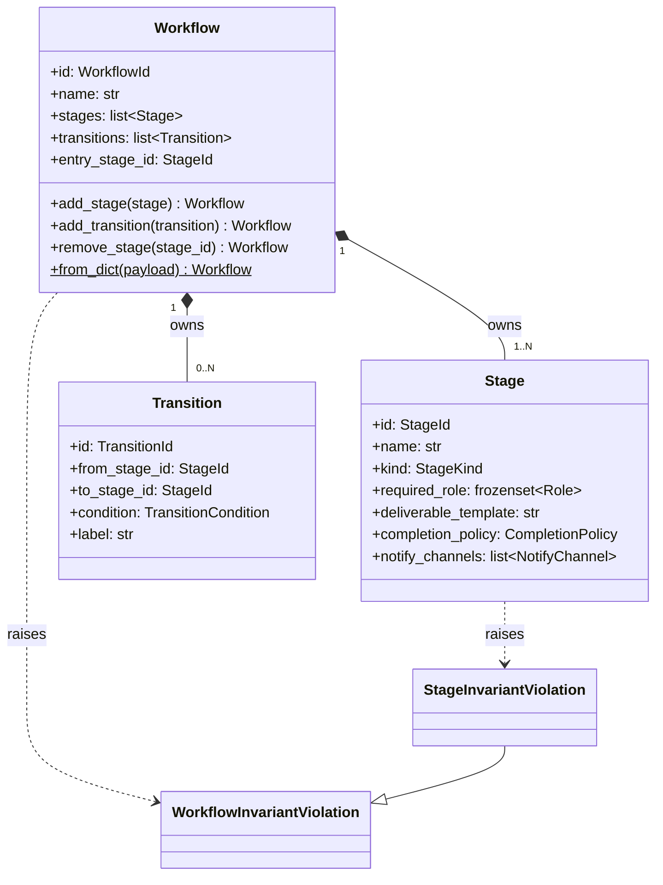
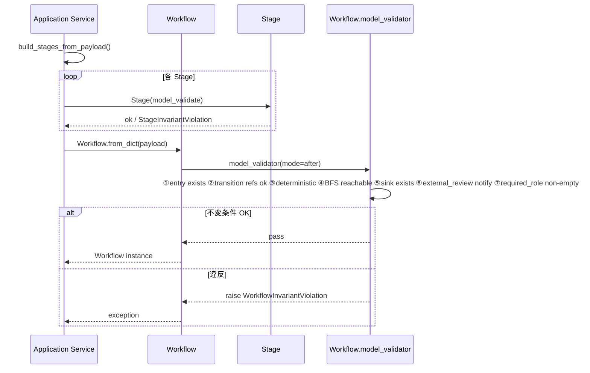
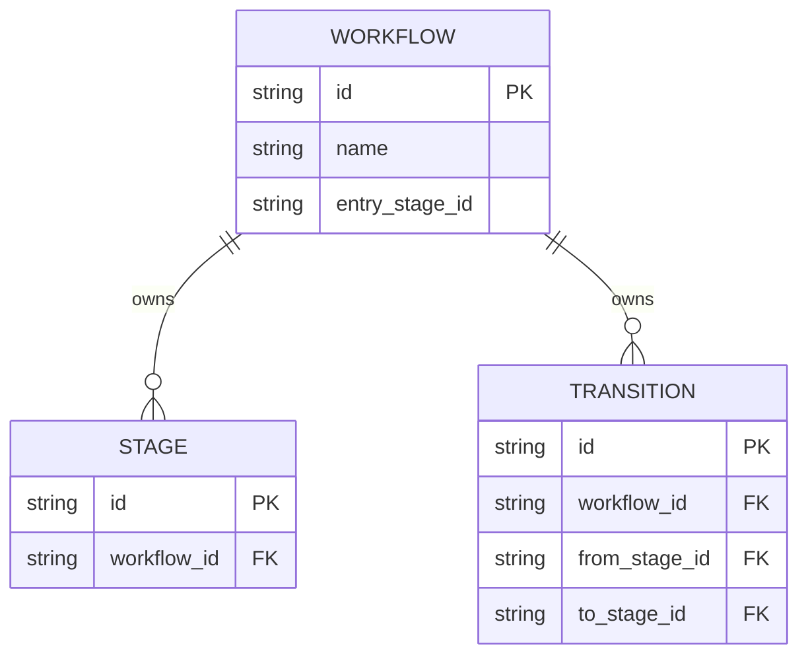

# 基本設計書

> feature: `workflow`
> 関連: [requirements.md](requirements.md) / [`docs/architecture/domain-model/aggregates.md`](../../architecture/domain-model/aggregates.md) §Workflow

## 記述ルール（必ず守ること）

基本設計に**疑似コード・サンプル実装（python/ts/sh/yaml 等の言語コードブロック）を書かない**。
ソースコードと二重管理になりメンテナンスコストしか生まない。
必要なのは構造契約（クラス・モジュール・データの関係）であり、実装の細部は [detailed-design.md](detailed-design.md) で凍結する。

## モジュール構成

| 機能 ID | モジュール | ディレクトリ | 責務 |
|--------|----------|------------|------|
| REQ-WF-001〜006 | `Workflow` Aggregate Root | `backend/src/bakufu/domain/workflow.py` | Workflow の属性・DAG 不変条件・ふるまい・bulk-import |
| REQ-WF-001, 002, 004, 007 | `Stage` Entity | 同上 | Stage の属性・自身の不変条件 |
| REQ-WF-001, 003 | `Transition` Entity | 同上 | Transition の属性 |
| REQ-WF-005 | DAG 検査ユーティリティ | 同上（Workflow 内 private 関数） | BFS 到達可能性検査・終端 Stage 検出 |
| REQ-WF-001 | `WorkflowInvariantViolation` / `StageInvariantViolation` | `backend/src/bakufu/domain/exceptions.py`（既存ファイル更新） | ドメイン例外 |
| 共通 | ID 型 / 列挙型 / VO（`StageKind` / `TransitionCondition` / `Role` / `CompletionPolicy` / `NotifyChannel`） | `backend/src/bakufu/domain/value_objects.py`（既存ファイル更新） | 既存定義に欠けているものを追加 |

```
ディレクトリ構造（本 feature で追加・変更されるファイル）:

.
└── backend/
    ├── src/
    │   └── bakufu/
    │       └── domain/
    │           ├── workflow.py          # 新規: Workflow / Stage / Transition
    │           ├── value_objects.py     # 既存更新: StageKind / TransitionCondition / Role / CompletionPolicy / NotifyChannel
    │           └── exceptions.py        # 既存更新: WorkflowInvariantViolation / StageInvariantViolation
    └── tests/
        └── domain/
            └── test_workflow.py         # 新規: ユニットテスト
```

## クラス設計（概要）



**凝集のポイント**:
- Stage / Transition は Workflow Aggregate 内部の Entity。外部から個別にアクセスせず、必ず Workflow 経由
- Workflow / Stage / Transition すべて Pydantic v2 frozen model。状態変更ふるまいは新インスタンスを返す
- DAG 不変条件は Workflow `model_validator(mode='after')` 内で集約検査。Stage 自身の不変条件（`required_role` 非空 / `EXTERNAL_REVIEW` の `notify_channels`）は Stage 自身の `model_validator` で先に検査される（二重防護）
- `from_dict` は **classmethod ファクトリ**。bulk import 時のみ「途中 valid」を要求しない

## 処理フロー

### ユースケース 1: V モデル開発室の Workflow 構築（from_dict）

1. application 層が `Workflow.from_dict(preset_payload)` を呼び出す
2. payload 内の Stage 配列を Pydantic で個別構築 — Stage 自身の不変条件（`required_role` 非空 / `EXTERNAL_REVIEW` の `notify_channels`）が走る
3. payload 内の Transition 配列を Pydantic で個別構築
4. Workflow を `model_validate(payload_with_built_entities)` で構築 — Workflow の DAG 不変条件 5 種が集約検査される
5. valid なら Workflow を返す

### ユースケース 2: Stage 追加（add_stage）

1. application 層が `workflow.add_stage(new_stage)` を呼び出す
2. 新 Stage 自身の不変条件は構築時に既に検査済み（呼び出し側が new_stage を作る時に通過している）
3. 現 `stages` に append した新リストを構築
4. `workflow.model_dump()` を取得し、`stages` を新リストに差し替え
5. `Workflow.model_validate(updated_dict)` で仮 Workflow を再構築 → DAG 不変条件検査
6. 通過時のみ仮 Workflow を返す

### ユースケース 3: Stage 削除（remove_stage）

1. `stage_id == entry_stage_id` なら即 raise（MSG-WF-010）
2. `stages` から該当 Stage を除外、`transitions` から `from_stage_id` または `to_stage_id` が一致するものを除外した新リストを構築
3. `model_validate` で仮 Workflow を再構築 → DAG 不変条件検査（孤立 Stage が生まれていないか等）
4. 通過時のみ返す

## シーケンス図



## アーキテクチャへの影響

- `docs/architecture/domain-model.md` への変更: なし（凍結済み設計に従う実装のみ）
- `docs/architecture/tech-stack.md` への変更: なし
- 既存 feature への波及: なし。後続 `feature/task` が Workflow 内 Stage を `current_stage_id` で参照する設計だが、本 feature 範囲では参照されないので波及なし

## 外部連携

該当なし — 理由: domain 層のみのため外部システムへの通信は発生しない。

| 連携先 | 目的 | プロトコル | 認証 | タイムアウト / リトライ |
|-------|------|----------|-----|--------------------|
| 該当なし | — | — | — | — |

## UX 設計

該当なし — 理由: domain 層のため UI は持たない。Workflow 編集 UI は `feature/workflow-ui`（Phase 2 react-flow 統合予定）で扱う。

| シナリオ | 期待される挙動 |
|---------|------------|
| 該当なし | — |

**アクセシビリティ方針**: 該当なし（UI なし）。

## セキュリティ設計

### 脅威モデル

本 feature 範囲では以下の 3 件。詳細な信頼境界は [`docs/architecture/threat-model.md`](../../architecture/threat-model.md) を参照。

| 想定攻撃者 | 攻撃経路 | 保護資産 | 対策 |
|-----------|---------|---------|------|
| **T1: 不正な JSON ペイロードによる Aggregate 破壊** | `from_dict()` 経路で UI / API から渡される dict | Workflow 整合性、Task 遷移の信頼性 | Pydantic 型強制で `Role` 名 / UUID 形式 / enum 値を Fail Fast で拒否。最終 validate で DAG 不変条件を二重検査 |
| **T2: 巨大 / 循環 Workflow による DoS** | 数千 Stage / Transition を含むペイロード | メモリ・検査時間 | MVP で `len(stages) <= 30` / `len(transitions) <= 60` のソフト上限を不変条件として追加（Phase 2 で運用調整） |
| **T3: Stage の `notify_channels` 経由の URL 注入** | webhook URL を悪意のある第三者 URL に向ける application バグ / 不正 payload | 通知経路 | `NotifyChannel` VO 内で URL スキーム allow list（`https://discord.com/api/webhooks/...` 等）を Pydantic validator で強制 |

### OWASP Top 10 対応

| # | カテゴリ | 対応状況 |
|---|---------|---------|
| A01 | Broken Access Control | 該当なし（domain 層に認可境界なし） |
| A02 | Cryptographic Failures | 該当なし |
| A03 | Injection | 該当なし（Pydantic 型強制で間接防御） |
| A04 | Insecure Design | **適用**: pre-validate 方式、frozen model、DAG 二重検査、Stage 自身の二重検査 |
| A05 | Security Misconfiguration | 該当なし |
| A06 | Vulnerable Components | Pydantic v2 / pyright を使用、依存監査は CI |
| A07 | Auth Failures | 該当なし |
| A08 | Data Integrity Failures | **適用**: frozen model で不変性を強制 |
| A09 | Logging Failures | 該当なし（ログ出力は application 層責務） |
| A10 | SSRF | **適用**: T3 の対策（NotifyChannel URL allow list） |

## ER 図

該当なし — 理由: 本 feature は domain 層のみで永続化スキーマは含まない。永続化は `feature/persistence` で扱う。参考の概形のみ:



## エラーハンドリング方針

| 例外種別 | 処理方針 | ユーザーへの通知 |
|---------|---------|----------------|
| `WorkflowInvariantViolation` | application 層で catch、HTTP API 層で 400 / 422 にマッピング（別 feature） | MSG-WF-001 〜 011 |
| `StageInvariantViolation` | 同上（`WorkflowInvariantViolation` のサブクラスとして処理可能） | MSG-WF-006 / 007 |
| `pydantic.ValidationError` | 構築時の型違反。application 層で catch、HTTP 422 にマッピング | MSG-WF-011（汎用） |
| その他の例外 | 握り潰さない、application 層へ伝播。Backend ルートで 500 として記録 | 汎用エラーメッセージ |
