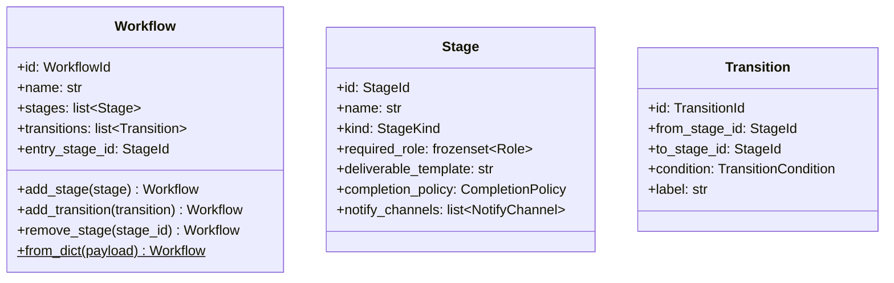

# 詳細設計書

> feature: `workflow`
> 関連: [basic-design.md](basic-design.md) / [`docs/architecture/domain-model/aggregates.md`](../../architecture/domain-model/aggregates.md) §Workflow

## 記述ルール（必ず守ること）

詳細設計に**疑似コード・サンプル実装（python/ts/sh/yaml 等の言語コードブロック）を書かない**。
ソースコードと二重管理になりメンテナンスコストしか生まない。
必要なのは「構造契約（属性名・型・制約）」と「確定文言（メッセージ文字列）」と「実装の意図」。

## クラス設計（詳細）



### Aggregate Root: Workflow

| 属性 | 型 | 制約 | 意図 |
|----|----|----|----|
| `id` | `WorkflowId`（UUIDv4） | 不変 | 一意識別 |
| `name` | `str` | 1〜80 文字（NFC 正規化、前後空白除去後） | 表示名（"V モデル開発フロー" 等） |
| `stages` | `list[Stage]` | 1〜30 件、`stage_id` の重複なし | 工程ノード集合（順序保持） |
| `transitions` | `list[Transition]` | 0〜60 件、`transition_id` の重複なし | 工程間遷移エッジ集合 |
| `entry_stage_id` | `StageId` | `stages` 内に存在 | Task 開始時の初期 Stage |

`model_config`:
- `frozen = True`
- `arbitrary_types_allowed = False`
- `extra = 'forbid'`

**不変条件（model_validator(mode='after') で集約検査）**:
1. `entry_stage_id` が `stages` 内に存在
2. 全 Transition の `from_stage_id` / `to_stage_id` が `stages` 内に存在
3. 同一 `(from_stage_id, condition)` の Transition 重複なし（決定論性）
4. `entry_stage_id` から BFS で全 Stage に到達可能（孤立 Stage 禁止）
5. 終端 Stage（外向き Transition なし）が 1 件以上存在
6. すべての Stage の `required_role` が空集合でない（Stage 自身の不変条件を集約検査として再確認）
7. すべての `EXTERNAL_REVIEW` Stage が `notify_channels` を持つ（同上）

**ふるまい**:
- `add_stage(stage: Stage) -> Workflow`: pre-validate で stages に追加した新 Workflow を返す
- `add_transition(transition: Transition) -> Workflow`: pre-validate で transitions に追加した新 Workflow を返す
- `remove_stage(stage_id: StageId) -> Workflow`: 関連 Transition も連鎖削除した新 Workflow を返す。`entry_stage_id` を指す Stage は削除不可（即 raise）
- `Workflow.from_dict(payload: dict) -> Workflow`（classmethod）: bulk-import ファクトリ。最終状態のみ validate

### Entity within Aggregate: Stage

| 属性 | 型 | 制約 |
|----|----|----|
| `id` | `StageId`（UUIDv4） | 不変 |
| `name` | `str` | 1〜80 文字（NFC 正規化済み） |
| `kind` | `StageKind` | enum: `WORK` / `INTERNAL_REVIEW` / `EXTERNAL_REVIEW` |
| `required_role` | `frozenset[Role]` | **空集合不可**、要素 1 件以上 |
| `deliverable_template` | `str` | 0〜10000 文字、Markdown |
| `completion_policy` | `CompletionPolicy`（VO） | — |
| `notify_channels` | `list[NotifyChannel]` | `kind == EXTERNAL_REVIEW` のとき非空、その他は空でも可 |

`model_validator(mode='after')` で:
- `required_role` の空集合違反 → `StageInvariantViolation(kind='empty_required_role')`
- `kind == EXTERNAL_REVIEW` かつ `notify_channels == []` → `StageInvariantViolation(kind='missing_notify')`

### Entity within Aggregate: Transition

| 属性 | 型 | 制約 |
|----|----|----|
| `id` | `TransitionId`（UUIDv4） | 不変 |
| `from_stage_id` | `StageId` | Workflow.stages 内に存在（Workflow 集約検査で確認） |
| `to_stage_id` | `StageId` | 同上 |
| `condition` | `TransitionCondition` | enum: `APPROVED` / `REJECTED` / `CONDITIONAL` / `TIMEOUT` |
| `label` | `str` | 0〜80 文字 |

Transition 単体では参照整合性を検査しない（Workflow 集約検査の責務）。

### Value Object: CompletionPolicy

| 属性 | 型 | 制約 |
|----|----|----|
| `kind` | `Literal['approved_by_reviewer', 'all_checklist_checked', 'manual']` | 完了判定ロジックの種別 |
| `description` | `str` | 0〜200 文字、人間可読の説明 |

### Value Object: NotifyChannel

| 属性 | 型 | 制約 |
|----|----|----|
| `kind` | `Literal['discord', 'slack', 'email']` | MVP は `discord` のみ実用、他はプレースホルダ |
| `target` | `str` | URL またはチャネル ID。`kind=='discord'` なら `https://discord.com/api/webhooks/...` 形式に限定（URL allow list） |

### Exception: WorkflowInvariantViolation

| 属性 | 型 | 制約 |
|----|----|----|
| `message` | `str` | MSG-WF-NNN 由来 |
| `detail` | `dict[str, object]` | 違反の文脈 |
| `kind` | `Literal['entry_not_in_stages', 'transition_ref_invalid', 'transition_duplicate', 'unreachable_stage', 'no_sink_stage', 'capacity_exceeded']` | Workflow レベルの違反種別 |

### Exception: StageInvariantViolation

`WorkflowInvariantViolation` のサブクラス。

| 属性 | 型 | 制約 |
|----|----|----|
| `kind` | `Literal['empty_required_role', 'missing_notify']` | Stage レベルの違反種別 |

## 確定事項（先送り撤廃）

### 確定 A: pre-validate 方式は Pydantic v2 model_validate 経由

`add_stage` / `add_transition` / `remove_stage` 共通の手順:

1. `self.model_dump(mode='python')` で現状を dict 化
2. dict 内の該当キー（`stages` / `transitions`）を更新
3. `Workflow.model_validate(updated_dict)` を呼ぶ — `model_validator(mode='after')` が走り、不変条件検査が再実行される
4. `model_validate` は失敗時に `ValidationError` を raise し、Workflow 内では `WorkflowInvariantViolation` に変換して raise する

`model_copy` は `validate=False` がデフォルトのため使用しない（`model_validate` を経由する）。

### 確定 B: BFS による到達可能性検査

`entry_stage_id` から `transitions` を辺として BFS を実行し、訪問済み Stage 集合を求める。`stages` 集合との差集合が空でなければ「孤立 Stage が存在」と判定。実装は標準ライブラリの `collections.deque` で十分（外部依存なし）。

DFS（再帰）は採用しない理由：将来 V > 1000 の Workflow を扱う場合に Python のデフォルト再帰深度（1000）を超える可能性、および循環があっても BFS は無限ループしないため安全側に倒す。

### 確定 C: 終端 Stage の検出

Stage を 1 件ずつ走査し、`from_stage_id == stage.id` の Transition が `transitions` 内に 0 件である Stage を「終端」と数える。BFS と同じ計算量 O(V+E)。

### 確定 D: from_dict のペイロード形式

```
{
  "id": "<uuid>",
  "name": "<str>",
  "entry_stage_id": "<uuid>",
  "stages": [
    {"id": "<uuid>", "name": "<str>", "kind": "WORK|INTERNAL_REVIEW|EXTERNAL_REVIEW",
     "required_role": ["LEADER", "UX"], "deliverable_template": "<markdown>",
     "completion_policy": {"kind": "approved_by_reviewer", "description": "..."},
     "notify_channels": [...]}
  ],
  "transitions": [
    {"id": "<uuid>", "from_stage_id": "<uuid>", "to_stage_id": "<uuid>",
     "condition": "APPROVED|REJECTED|CONDITIONAL|TIMEOUT", "label": "<str>"}
  ]
}
```

`required_role` は JSON 配列で受け取り、Pydantic validator が `frozenset[Role]` に変換する。

### 確定 E: 容量上限

`len(stages) <= 30` / `len(transitions) <= 60`。MVP の実用範囲（V モデル開発室のレンダリング例で stages=13、transitions=15 程度）の 2 倍を上限に設定。Phase 2 で運用実績を見て調整。

## 設計判断の補足

### なぜ Stage / Transition を Workflow 内部 Entity にするか

Stage / Transition は単独で意味を持たず、Workflow の整合性（DAG）の文脈でのみ valid。独立 Aggregate にすると Repository が分散し、「Stage 1 件追加」のたびに DAG 全体検査ができなくなる（Aggregate 跨ぎの整合性は結果整合になる = 不整合状態が短時間でも発生する）。

### なぜ DAG 検査を Aggregate 集約 + Stage 自身の二重防護にするか

Stage 自身の不変条件（`required_role` 非空 / `EXTERNAL_REVIEW` の `notify_channels`）は、Stage を **Workflow に追加せず単独で構築する場面**（テスト・プリセット定義）でも検出されるべき。`StageInvariantViolation` を Stage 自身が raise することで、Workflow 構築前に問題を発見できる。

### なぜ from_dict はクラスメソッドか

`Workflow()` コンストラクタに dict を渡す形だと、内部で Stage / Transition の構築順序を Pydantic に任せることになり、エラーメッセージが「どの Stage で失敗したか」を識別しにくい。`from_dict` の中で明示的に Stage を 1 件ずつ構築 → エラー時に index を含めて raise すれば、デバッグ容易性が大きく上がる。

### なぜ NotifyChannel に URL allow list を入れるか

`Stage.notify_channels` は外部 webhook URL を保持する。悪意ある UI / API リクエストで `target` を任意 URL に書き換えられると、bakufu Backend が任意の第三者サーバーに通知を送る経路（SSRF / データ漏洩）が成立する。VO レベルで URL スキームと host を allow list で制限することで、Aggregate 構築時に Fail Fast。

## ユーザー向けメッセージの確定文言

### プレフィックス統一

| プレフィックス | 意味 |
|--------------|-----|
| `[FAIL]` | 処理中止を伴う失敗 |
| `[OK]` | 成功完了 |

### MSG 確定文言表

| ID | 出力先 | 文言 |
|----|------|----|
| MSG-WF-001 | 例外 message / Toast | `[FAIL] Workflow name must be 1-80 characters (got {length})` |
| MSG-WF-002 | 例外 message | `[FAIL] entry_stage_id {id} not found in stages` |
| MSG-WF-003 | 例外 message | `[FAIL] Unreachable stages from entry: {stage_ids}` |
| MSG-WF-004 | 例外 message | `[FAIL] No sink stage; workflow has cycles only (entry={entry_stage_id})` |
| MSG-WF-005 | 例外 message | `[FAIL] Duplicate transition: from_stage={from_id}, condition={condition}` |
| MSG-WF-006 | 例外 message | `[FAIL] EXTERNAL_REVIEW stage {stage_id} must have at least one notify_channel` |
| MSG-WF-007 | 例外 message | `[FAIL] Stage {stage_id} required_role must not be empty` |
| MSG-WF-008 | 例外 message | `[FAIL] Stage id duplicate: {stage_id}` |
| MSG-WF-009 | 例外 message | `[FAIL] Transition references unknown stage: from={from_id}, to={to_id}` |
| MSG-WF-010 | 例外 message | `[FAIL] Cannot remove entry stage: {stage_id}` |
| MSG-WF-011 | 例外 message | `[FAIL] from_dict payload invalid: {detail}` |

メッセージ文字列は ASCII 範囲。日本語化は UI 側 i18n リソース（Phase 2）。

## データ構造（永続化キー）

該当なし — 理由: 本 feature は domain 層のみで永続化スキーマは含まない。永続化は `feature/persistence` で扱う。

参考の概形のみ:

| カラム | 型 | 制約 | 意図 |
|-------|----|----|----|
| `workflows.id` | `UUID` | PK | WorkflowId |
| `workflows.name` | `VARCHAR(80)` | NOT NULL | 表示名 |
| `workflows.entry_stage_id` | `UUID` | NOT NULL, FK to `stages.id` | エントリポイント |
| `stages.id` | `UUID` | PK | StageId |
| `stages.workflow_id` | `UUID` | FK to `workflows.id` | 所属 |
| `transitions.id` | `UUID` | PK | TransitionId |
| `transitions.workflow_id` | `UUID` | FK | 所属 |

詳細は `feature/persistence` で確定。

## API エンドポイント詳細

該当なし — 理由: 本 feature は domain 層のみ。API は `feature/http-api` で凍結する。

## 出典・参考

- [Pydantic v2 — model_validator / model_validate](https://docs.pydantic.dev/latest/concepts/validators/) — pre-validate 方式の実装根拠
- [Pydantic v2 — frozen models](https://docs.pydantic.dev/latest/concepts/models/#fields-with-non-hashable-default-values) — 不変モデルの挙動
- [Cormen et al., "Introduction to Algorithms" 3rd ed., Ch. 22](https://mitpress.mit.edu/9780262033848/) — BFS の正当性証明（到達可能性）
- [`docs/architecture/domain-model/aggregates.md`](../../architecture/domain-model/aggregates.md) — Workflow 凍結済み設計
- [`docs/architecture/domain-model/transactions.md`](../../architecture/domain-model/transactions.md) — V モデル開発室の Workflow レンダリング例
- [`docs/architecture/threat-model.md`](../../architecture/threat-model.md) — A04 / A10 対応根拠
