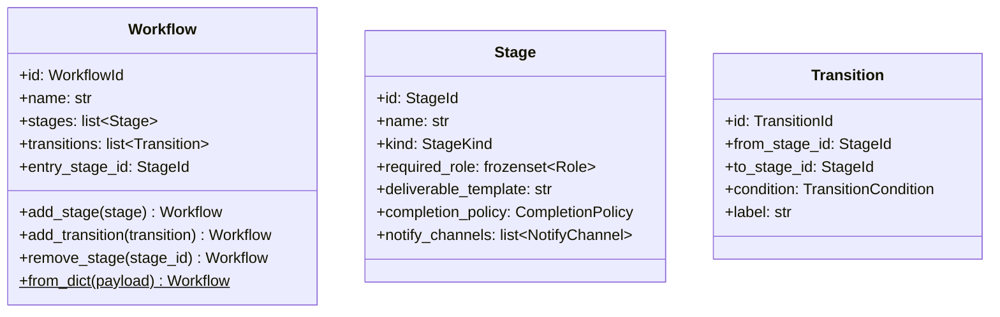

# 詳細設計書

> feature: `workflow`
> 関連: [basic-design.md](basic-design.md) / [`docs/architecture/domain-model/aggregates.md`](../../architecture/domain-model/aggregates.md) §Workflow

## 記述ルール（必ず守ること）

詳細設計に**疑似コード・サンプル実装（python/ts/sh/yaml 等の言語コードブロック）を書かない**。
ソースコードと二重管理になりメンテナンスコストしか生まない。
必要なのは「構造契約（属性名・型・制約）」と「確定文言（メッセージ文字列）」と「実装の意図」。

## クラス設計（詳細）



### Aggregate Root: Workflow

| 属性 | 型 | 制約 | 意図 |
|----|----|----|----|
| `id` | `WorkflowId`（UUIDv4） | 不変 | 一意識別 |
| `name` | `str` | 1〜80 文字（NFC 正規化、前後空白除去後） | 表示名（"V モデル開発フロー" 等） |
| `stages` | `list[Stage]` | 1〜30 件、`stage_id` の重複なし | 工程ノード集合（順序保持） |
| `transitions` | `list[Transition]` | 0〜60 件、`transition_id` の重複なし | 工程間遷移エッジ集合 |
| `entry_stage_id` | `StageId` | `stages` 内に存在 | Task 開始時の初期 Stage |

`model_config`:
- `frozen = True`
- `arbitrary_types_allowed = False`
- `extra = 'forbid'`

**不変条件（model_validator(mode='after') で集約検査）**:
1. `entry_stage_id` が `stages` 内に存在
2. 全 Transition の `from_stage_id` / `to_stage_id` が `stages` 内に存在
3. 同一 `(from_stage_id, condition)` の Transition 重複なし（決定論性）
4. `entry_stage_id` から BFS で全 Stage に到達可能（孤立 Stage 禁止）
5. 終端 Stage（外向き Transition なし）が 1 件以上存在
6. すべての Stage の `required_role` が空集合でない（Stage 自身の不変条件を集約検査として再確認）
7. すべての `EXTERNAL_REVIEW` Stage が `notify_channels` を持つ（同上）

**ふるまい**:
- `add_stage(stage: Stage) -> Workflow`: pre-validate で stages に追加した新 Workflow を返す
- `add_transition(transition: Transition) -> Workflow`: pre-validate で transitions に追加した新 Workflow を返す
- `remove_stage(stage_id: StageId) -> Workflow`: 関連 Transition も連鎖削除した新 Workflow を返す。事前検査で `stage_id` が `stages` 内に存在しなければ `WorkflowInvariantViolation(kind='stage_not_found')` を raise（MSG-WF-012）。`entry_stage_id` を指す Stage は削除不可、`WorkflowInvariantViolation(kind='cannot_remove_entry')` を raise（MSG-WF-010）
- `Workflow.from_dict(payload: dict) -> Workflow`（classmethod）: bulk-import ファクトリ。最終状態のみ validate

### Entity within Aggregate: Stage

| 属性 | 型 | 制約 |
|----|----|----|
| `id` | `StageId`（UUIDv4） | 不変 |
| `name` | `str` | 1〜80 文字（NFC 正規化済み） |
| `kind` | `StageKind` | enum: `WORK` / `INTERNAL_REVIEW` / `EXTERNAL_REVIEW` |
| `required_role` | `frozenset[Role]` | **空集合不可**、要素 1 件以上 |
| `deliverable_template` | `str` | 0〜10000 文字、Markdown |
| `completion_policy` | `CompletionPolicy`（VO） | — |
| `notify_channels` | `list[NotifyChannel]` | `kind == EXTERNAL_REVIEW` のとき非空、その他は空でも可 |

`model_validator(mode='after')` で:
- `required_role` の空集合違反 → `StageInvariantViolation(kind='empty_required_role')`
- `kind == EXTERNAL_REVIEW` かつ `notify_channels == []` → `StageInvariantViolation(kind='missing_notify')`

### Entity within Aggregate: Transition

| 属性 | 型 | 制約 |
|----|----|----|
| `id` | `TransitionId`（UUIDv4） | 不変 |
| `from_stage_id` | `StageId` | Workflow.stages 内に存在（Workflow 集約検査で確認） |
| `to_stage_id` | `StageId` | 同上 |
| `condition` | `TransitionCondition` | enum: `APPROVED` / `REJECTED` / `CONDITIONAL` / `TIMEOUT` |
| `label` | `str` | 0〜80 文字 |

Transition 単体では参照整合性を検査しない（Workflow 集約検査の責務）。

### Value Object: CompletionPolicy

| 属性 | 型 | 制約 |
|----|----|----|
| `kind` | `Literal['approved_by_reviewer', 'all_checklist_checked', 'manual']` | 完了判定ロジックの種別 |
| `description` | `str` | 0〜200 文字、人間可読の説明 |

### Value Object: NotifyChannel

| 属性 | 型 | 制約 |
|----|----|----|
| `kind` | `Literal['discord']` | **MVP は `discord` のみ。`'slack'` / `'email'` は MVP では受け付けず、コンストラクタで `pydantic.ValidationError` を raise**（Phase 2 で kind ごとの target 規則を凍結後に解禁）|
| `target` | `str` | 1〜500 文字。`kind=='discord'` なら下記 URL allow list を完全充足する Discord webhook URL のみ。違反時は `pydantic.ValidationError` を raise |

**`kind` の MVP 制約理由**: `'slack'` / `'email'` は target の正規化規則・SSRF 対策・secret マスキング規則がそれぞれ異なる。`Phase 2` でメッセンジャー多対応を検討する際に、kind ごとに本書 §確定 G と同等の凍結を行ってから解禁する。MVP で「プレースホルダとして許容」すると未検証のまま運用ルートが開く危険があるため、コンストラクタレベルで物理的に拒否する。

`model_config.frozen = True`。

### 確定 G: NotifyChannel URL allow list の完全凍結（SSRF / A10 対策）

`NotifyChannel.target` は外部 webhook URL を保持し、bakufu Backend が後段（`feature/discord-notifier`）で **HTTPS POST 送信先**として利用する。攻撃者が任意 URL を埋め込めば、Backend が任意の第三者サーバーへ通知を送る経路が成立する（SSRF / [`docs/architecture/threat-model.md`](../../architecture/threat-model.md) §A10）。VO レベルで以下を**全て充足**する URL のみを受理し、1 つでも違反すれば即 `pydantic.ValidationError` を Fail Fast で raise する。

#### 検査仕様（kind='discord' の場合）

| # | 検査項目 | 規則 | 違反時の Fail Fast 理由 |
|---|----|----|----|
| G1 | 文字数 | `1 <= len(target) <= 500` | DoS / メモリ攻撃防御 |
| G2 | パーサー | `urllib.parse.urlparse(target)` で **必ず**正規化を経由（生文字列での部分一致禁止） | `startswith` / 正規表現単独はクエリ・断片・userinfo の解釈を誤りバイパス可能 |
| G3 | スキーム | `parsed.scheme == 'https'`（小文字化済みの完全一致） | HTTP は中間者攻撃 / 平文盗聴を許容 |
| G4 | ホスト | `parsed.hostname == 'discord.com'`（urlparse は hostname を小文字化済み）。**完全一致**必須 | `discord.com.evil.example` / `evil-discord.com` / `*.discord.com` を物理層で拒否（部分一致は SSRF の温床） |
| G5 | ポート | `parsed.port in (None, 443)` のみ | 非標準ポートで内部サービスへの接続を試みる経路を塞ぐ |
| G6 | ユーザー情報 | `parsed.username is None` かつ `parsed.password is None`（`@` を含む URL を実質拒否） | `https://attacker@discord.com/...` 経路で Basic 認証情報を埋め込み正規ドメインに偽装する攻撃を塞ぐ（RFC 3986 userinfo セクション悪用） |
| G7 | パス形式 | `parsed.path` が `^/api/webhooks/(?P<id>[0-9]+)/(?P<token>[A-Za-z0-9_\-]+)$` に正規表現完全一致。`{id}` は 1〜30 桁の数字（Discord snowflake 想定）、`{token}` は 1〜100 文字の URL-safe Base64 互換文字 | パス偽装 / 開いた API への迂回を塞ぐ |
| G8 | クエリ | `parsed.query == ''`（空文字列） | `?override=...` 等での挙動変更経路を塞ぐ |
| G9 | フラグメント | `parsed.fragment == ''`（空文字列） | クライアント側でしか解釈されない部分の混入を防ぎ、ログ・監査での扱いを単純化 |
| G10 | 大文字小文字 | scheme / hostname は urlparse の正規化で小文字化、path は **大文字小文字を区別**（`/api/webhooks/...` 固定、`/API/WEBHOOKS/...` は拒否） | Discord 公式 webhook URL のパス部は小文字固定。揺れを許すと比較・マスキングの基準が壊れる |

すべての検査は `pydantic.field_validator('target', mode='after')` で実行し、エラー時は `pydantic.ValidationError` を Workflow 経由で `WorkflowInvariantViolation(kind='from_dict_invalid')` または直接 `pydantic.ValidationError` として application 層に伝播する。違反種別は `detail` に項目番号（G1〜G10）を含める。

#### `target` のシークレット扱い

`NotifyChannel.target` の path 部 `{token}`（G7）は **Discord webhook の認証 secret** に相当する。これを露出した場合、第三者が任意のメッセージを当該 webhook 経由で送信できる。以下のマスキング規則を**強制**する：

| 永続化先 | 適用 |
|---|---|
| Outbox `payload_json`（`ExternalReviewRequested` 等のイベント本体） | ✓ |
| `audit_log.args_json` / `error_text` | ✓ |
| Conversation の system message（subprocess stderr 含む） | ✓ |
| 構造化ログ（stdout / file） | ✓ |
| 例外 `message` / `detail`（`WorkflowInvariantViolation` / `pydantic.ValidationError`） | ✓ |
| `Workflow.model_dump()` / `Stage.model_dump()` の出力 | ✓（`mode='json'` 時に自動置換、後述）|

**マスキング規則**: 正規表現 `https://discord\.com/api/webhooks/([0-9]+)/([A-Za-z0-9_\-]+)` にマッチする箇所を `https://discord.com/api/webhooks/\1/<REDACTED:DISCORD_WEBHOOK>` に置換（id 部は識別性のため残す、token 部のみ伏字）。これは [`docs/architecture/domain-model/storage.md`](../../architecture/domain-model/storage.md) §シークレットマスキング規則 への追補として `feature/persistence` で `storage.md` を更新する PR を起こす（横断的変更、本 feature の `アーキテクチャへの影響` で明示）。

**VO 自体のシリアライズ時挙動**: `NotifyChannel.model_dump(mode='json')` の `target` 値は、**カスタム `field_serializer` でマスキング後の文字列に変換**して返す。デフォルトの `model_dump()` は内部処理（同じ Workflow 内での参照取り回し）用に raw target を返してよいが、`mode='json'` および `model_dump_json()` では必ずマスキング済み文字列を出力する。実装観点で「永続化用 JSON は token を含まない」を VO レベルで保証する。

#### Phase 2 で再検証が必要な項目（本 feature 範囲外、申し送り）

以下は本 feature の VO レベルでは対処不能で、`feature/discord-notifier` の `basic-design.md` に必ず凍結する：

- **DNS rebinding**: hostname == 'discord.com' を解決した IP がプライベートレンジ（10/8、172.16/12、192.168/16、127/8、169.254/16、IPv6 link-local 等）でないことを送信時に再検証
- **HTTP リダイレクト追跡**: webhook POST レスポンスで 3xx を受けた場合、リダイレクト先を再度 G3〜G6 で検査するか、リダイレクト追跡を無効化する（`requests.post(..., allow_redirects=False)` 等）
- **IPv4-mapped IPv6**: `::ffff:127.0.0.1` のような形式での内部接続を物理層で拒否（送信時に getaddrinfo 結果を検査）

これらはネットワーク I/O 発生レイヤで対処すべき項目で、ドメイン層 VO の責務外。本 feature では `NotifyChannel` の構造的妥当性のみを保証する。

### Exception: WorkflowInvariantViolation

| 属性 | 型 | 制約 |
|----|----|----|
| `message` | `str` | MSG-WF-NNN 由来 |
| `detail` | `dict[str, object]` | 違反の文脈 |
| `kind` | `Literal['entry_not_in_stages', 'transition_ref_invalid', 'transition_duplicate', 'unreachable_stage', 'no_sink_stage', 'capacity_exceeded', 'cannot_remove_entry', 'stage_not_found', 'missing_notify_aggregate', 'empty_required_role_aggregate', 'from_dict_invalid']` | Workflow レベルの違反種別。`*_aggregate` は集約検査経路で発生する種別（Stage 自身の検査経路は `StageInvariantViolation` のサブクラスで分離） |

### Exception: StageInvariantViolation

`WorkflowInvariantViolation` のサブクラス。

| 属性 | 型 | 制約 |
|----|----|----|
| `kind` | `Literal['empty_required_role', 'missing_notify']` | Stage レベルの違反種別 |

## 確定事項（先送り撤廃）

### 確定 A: pre-validate 方式は Pydantic v2 model_validate 経由

`add_stage` / `add_transition` / `remove_stage` 共通の手順:

1. `self.model_dump(mode='python')` で現状を dict 化
2. dict 内の該当キー（`stages` / `transitions`）を更新
3. `Workflow.model_validate(updated_dict)` を呼ぶ — `model_validator(mode='after')` が走り、不変条件検査が再実行される
4. `model_validate` は失敗時に `ValidationError` を raise し、Workflow 内では `WorkflowInvariantViolation` に変換して raise する

`model_copy` は `validate=False` がデフォルトのため使用しない（`model_validate` を経由する）。

### 確定 B: BFS による到達可能性検査

`entry_stage_id` から `transitions` を辺として BFS を実行し、訪問済み Stage 集合を求める。`stages` 集合との差集合が空でなければ「孤立 Stage が存在」と判定。実装は標準ライブラリの `collections.deque` で十分（外部依存なし）。

DFS（再帰）は採用しない理由：将来 V > 1000 の Workflow を扱う場合に Python のデフォルト再帰深度（1000）を超える可能性、および循環があっても BFS は無限ループしないため安全側に倒す。

### 確定 C: 終端 Stage の検出

Stage を 1 件ずつ走査し、`from_stage_id == stage.id` の Transition が `transitions` 内に 0 件である Stage を「終端」と数える。BFS と同じ計算量 O(V+E)。

### 確定 D: from_dict のペイロード形式

```
{
  "id": "<uuid>",
  "name": "<str>",
  "entry_stage_id": "<uuid>",
  "stages": [
    {"id": "<uuid>", "name": "<str>", "kind": "WORK|INTERNAL_REVIEW|EXTERNAL_REVIEW",
     "required_role": ["LEADER", "UX"], "deliverable_template": "<markdown>",
     "completion_policy": {"kind": "approved_by_reviewer", "description": "..."},
     "notify_channels": [...]}
  ],
  "transitions": [
    {"id": "<uuid>", "from_stage_id": "<uuid>", "to_stage_id": "<uuid>",
     "condition": "APPROVED|REJECTED|CONDITIONAL|TIMEOUT", "label": "<str>"}
  ]
}
```

`required_role` は JSON 配列で受け取り、Pydantic validator が `frozenset[Role]` に変換する。

### 確定 E: 容量上限

`len(stages) <= 30` / `len(transitions) <= 60`。MVP の実用範囲（V モデル開発室のレンダリング例で stages=13、transitions=15 程度）の 2 倍を上限に設定。Phase 2 で運用実績を見て調整。

### 確定 F: 集約検査 helper の独立性（二重防護のテスタビリティ）

Workflow の `model_validator(mode='after')` 内で行う集約検査は、それぞれ独立した module-level private helper 関数として実装する。Workflow クラスのメソッドではない（純粋関数として、Stage 自身の `model_validator` と**コードを共有しない**ことを物理的に保証）：

| helper 関数 | 入力 | 検査内容 | 違反時 raise する例外 |
|----|----|----|----|
| `_validate_dag_reachability(stages, transitions, entry_stage_id)` | 全 Stage / Transition / entry | BFS で entry から全 Stage が到達可能か | `WorkflowInvariantViolation(kind='unreachable_stage')`、MSG-WF-003 |
| `_validate_dag_sink_exists(stages, transitions)` | 全 Stage / Transition | 終端 Stage（外向き Transition なし）が 1 件以上存在 | `WorkflowInvariantViolation(kind='no_sink_stage')`、MSG-WF-004 |
| `_validate_transition_determinism(transitions)` | 全 Transition | 同一 `(from_stage_id, condition)` の Transition 重複なし | `WorkflowInvariantViolation(kind='transition_duplicate')`、MSG-WF-005 |
| `_validate_transition_refs(stages, transitions)` | 全 Stage / Transition | 全 Transition の from / to が stages 内に存在 | `WorkflowInvariantViolation(kind='transition_ref_invalid')`、MSG-WF-009 |
| `_validate_external_review_notify(stages)` | 全 Stage | `kind=EXTERNAL_REVIEW` の Stage が `notify_channels` 非空 | `WorkflowInvariantViolation(kind='missing_notify_aggregate')`、MSG-WF-006 |
| `_validate_required_role_non_empty(stages)` | 全 Stage | 全 Stage の `required_role` が非空 | `WorkflowInvariantViolation(kind='empty_required_role_aggregate')`、MSG-WF-007 |
| `_validate_capacity(stages, transitions)` | 全 Stage / Transition | 容量上限（30 / 60） | `WorkflowInvariantViolation(kind='capacity_exceeded')` |

Workflow 本体の `model_validator(mode='after')` は、これら helper を順次呼び出すディスパッチに専念する。

**この分離が必要な理由**:

1. **テスタビリティ**: 各 helper を直接呼び出すユニットテスト（TC-UT-WF-006b 等）が可能。Workflow 本体を構築せず、helper のロジックを単独で検査できる
2. **二重防護の独立性証明**: Stage 自身の `model_validator` がバグで通った場合の最後の砦として、Workflow 集約検査が独立に raise することを物理層で保証。両者がコードを共有していないため「同じバグで両方止まる」リスクが排除される
3. **可読性**: `model_validator` 本体は 7 種の検査の順序と責務を一望できる薄いディスパッチコードに保たれる
4. **仕様変更の局所化**: 検査ロジックの変更は該当 helper のみで完結、`model_validator` 本体や他の検査ロジックを触らない

**配置**: `backend/src/bakufu/domain/workflow.py` のモジュールレベル private 関数（先頭アンダースコア）として置き、`Workflow.model_validator` から呼び出す。テストは `from bakufu.domain.workflow import _validate_external_review_notify` 等で直接 import 可能（module-private は Python 慣習で外部利用は警告だが、テストレイヤからは許容、`pyright` 設定で `tests/` のみ private import を許す）。

## 設計判断の補足

### なぜ Stage / Transition を Workflow 内部 Entity にするか

Stage / Transition は単独で意味を持たず、Workflow の整合性（DAG）の文脈でのみ valid。独立 Aggregate にすると Repository が分散し、「Stage 1 件追加」のたびに DAG 全体検査ができなくなる（Aggregate 跨ぎの整合性は結果整合になる = 不整合状態が短時間でも発生する）。

### なぜ DAG 検査を Aggregate 集約 + Stage 自身の二重防護にするか

Stage 自身の不変条件（`required_role` 非空 / `EXTERNAL_REVIEW` の `notify_channels`）は、Stage を **Workflow に追加せず単独で構築する場面**（テスト・プリセット定義）でも検出されるべき。`StageInvariantViolation` を Stage 自身が raise することで、Workflow 構築前に問題を発見できる。

### なぜ from_dict はクラスメソッドか

`Workflow()` コンストラクタに dict を渡す形だと、内部で Stage / Transition の構築順序を Pydantic に任せることになり、エラーメッセージが「どの Stage で失敗したか」を識別しにくい。`from_dict` の中で明示的に Stage を 1 件ずつ構築 → エラー時に index を含めて raise すれば、デバッグ容易性が大きく上がる。

### なぜ NotifyChannel に URL allow list を入れるか

`Stage.notify_channels` は外部 webhook URL を保持する。悪意ある UI / API リクエストで `target` を任意 URL に書き換えられると、bakufu Backend が任意の第三者サーバーに通知を送る経路（SSRF / データ漏洩）が成立する。VO レベルで URL スキームと host を allow list で制限することで、Aggregate 構築時に Fail Fast。

## ユーザー向けメッセージの確定文言

### プレフィックス統一

| プレフィックス | 意味 |
|--------------|-----|
| `[FAIL]` | 処理中止を伴う失敗 |
| `[OK]` | 成功完了 |

### MSG 確定文言表

| ID | 出力先 | 文言 |
|----|------|----|
| MSG-WF-001 | 例外 message / Toast | `[FAIL] Workflow name must be 1-80 characters (got {length})` |
| MSG-WF-002 | 例外 message | `[FAIL] entry_stage_id {id} not found in stages` |
| MSG-WF-003 | 例外 message | `[FAIL] Unreachable stages from entry: {stage_ids}` |
| MSG-WF-004 | 例外 message | `[FAIL] No sink stage; workflow has cycles only (entry={entry_stage_id})` |
| MSG-WF-005 | 例外 message | `[FAIL] Duplicate transition: from_stage={from_id}, condition={condition}` |
| MSG-WF-006 | 例外 message | `[FAIL] EXTERNAL_REVIEW stage {stage_id} must have at least one notify_channel` |
| MSG-WF-007 | 例外 message | `[FAIL] Stage {stage_id} required_role must not be empty` |
| MSG-WF-008 | 例外 message | `[FAIL] Stage id duplicate: {stage_id}` |
| MSG-WF-009 | 例外 message | `[FAIL] Transition references unknown stage: from={from_id}, to={to_id}` |
| MSG-WF-010 | 例外 message | `[FAIL] Cannot remove entry stage: {stage_id}` |
| MSG-WF-011 | 例外 message | `[FAIL] from_dict payload invalid: {detail}` |
| MSG-WF-012 | 例外 message | `[FAIL] Stage not found in workflow: stage_id={stage_id}` |

メッセージ文字列は ASCII 範囲。日本語化は UI 側 i18n リソース（Phase 2）。

## データ構造（永続化キー）

該当なし — 理由: 本 feature は domain 層のみで永続化スキーマは含まない。永続化は `feature/persistence` で扱う。

参考の概形のみ:

| カラム | 型 | 制約 | 意図 |
|-------|----|----|----|
| `workflows.id` | `UUID` | PK | WorkflowId |
| `workflows.name` | `VARCHAR(80)` | NOT NULL | 表示名 |
| `workflows.entry_stage_id` | `UUID` | NOT NULL, FK to `stages.id` | エントリポイント |
| `stages.id` | `UUID` | PK | StageId |
| `stages.workflow_id` | `UUID` | FK to `workflows.id` | 所属 |
| `transitions.id` | `UUID` | PK | TransitionId |
| `transitions.workflow_id` | `UUID` | FK | 所属 |

詳細は `feature/persistence` で確定。

## API エンドポイント詳細

該当なし — 理由: 本 feature は domain 層のみ。API は `feature/http-api` で凍結する。

## 出典・参考

- [Pydantic v2 — model_validator / model_validate](https://docs.pydantic.dev/latest/concepts/validators/) — pre-validate 方式の実装根拠
- [Pydantic v2 — frozen models](https://docs.pydantic.dev/latest/concepts/models/#fields-with-non-hashable-default-values) — 不変モデルの挙動
- [Cormen et al., "Introduction to Algorithms" 3rd ed., Ch. 22](https://mitpress.mit.edu/9780262033848/) — BFS の正当性証明（到達可能性）
- [`docs/architecture/domain-model/aggregates.md`](../../architecture/domain-model/aggregates.md) — Workflow 凍結済み設計
- [`docs/architecture/domain-model/transactions.md`](../../architecture/domain-model/transactions.md) — V モデル開発室の Workflow レンダリング例
- [`docs/architecture/threat-model.md`](../../architecture/threat-model.md) — A04 / A10 対応根拠
