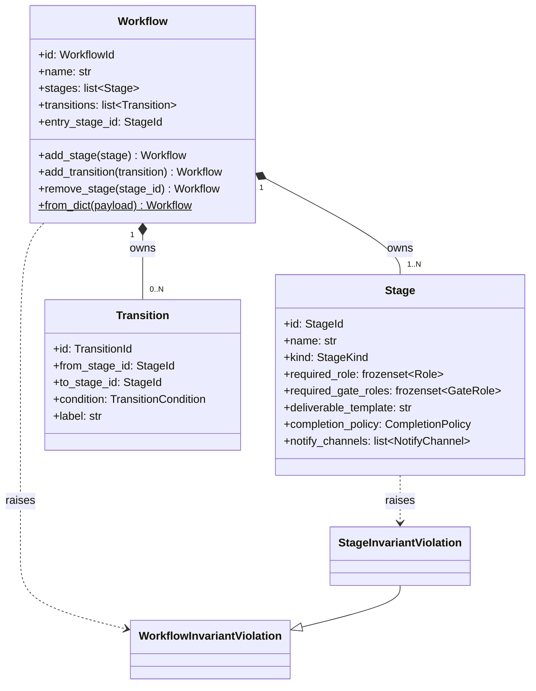
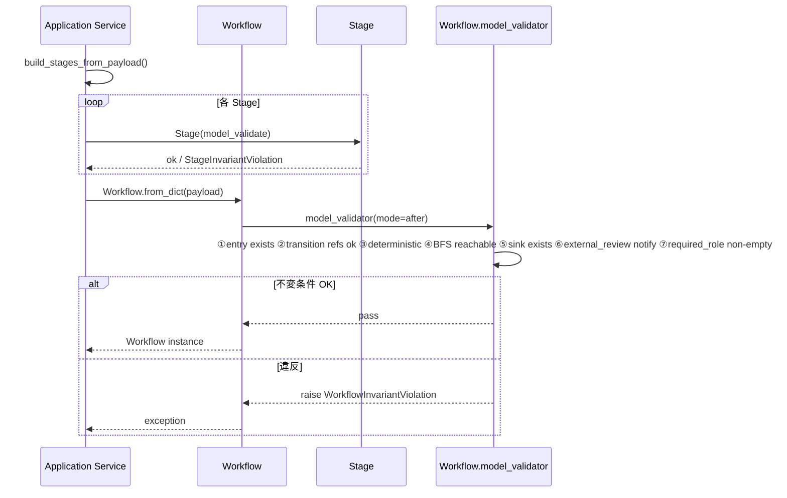

# 基本設計書 — workflow / domain

> feature: `workflow`（業務概念）/ sub-feature: `domain`
> 親業務仕様: [`../feature-spec.md`](../feature-spec.md)
> 関連 Issue: [#9 feat(workflow): Workflow + Stage + Transition Aggregate (M1)](https://github.com/bakufu-dev/bakufu/issues/9)
> 凍結済み設計: [`docs/design/domain-model/aggregates.md`](../../../design/domain-model/aggregates.md) §Workflow / [`docs/design/domain-model/value-objects.md`](../../../design/domain-model/value-objects.md) §Workflow 構成要素

## 記述ルール（必ず守ること）

基本設計に**疑似コード・サンプル実装（python/ts/sh/yaml 等の言語コードブロック）を書かない**。
ソースコードと二重管理になりメンテナンスコストしか生まない。
必要なのは構造契約（クラス・モジュール・データの関係）であり、実装の細部は [detailed-design.md](detailed-design.md) で凍結する。

## §モジュール契約（機能要件）

本 sub-feature が満たすべき機能要件（入力 / 処理 / 出力 / エラー時）を凍結する。業務根拠は [`../feature-spec.md §9 受入基準`](../feature-spec.md) を参照。

### REQ-WF-001: Workflow 構築

| 項目 | 内容 |
|------|------|
| 入力 | `id: WorkflowId`、`name: str`（1〜80）、`stages: list[Stage]`（1 件以上）、`transitions: list[Transition]`（0 件以上）、`entry_stage_id: StageId`、`archived: bool`（デフォルト: `False`）|
| 処理 | Pydantic 型バリデーション → `model_validator(mode='after')` で DAG 不変条件 7 種を集約検査（①entry 存在 ②Transition 参照整合 ③決定論性 ④BFS 到達可能性 ⑤終端 Stage ⑥EXTERNAL_REVIEW notify_channels 集約 ⑦required_role 非空 集約） → 通過時のみ Workflow を返す |
| 出力 | `Workflow` インスタンス（frozen） |
| エラー時 | `WorkflowInvariantViolation` を raise。MSG-WF-001〜007 のいずれかを格納 |

### REQ-WF-002: Stage 追加

| 項目 | 内容 |
|------|------|
| 入力 | 現 Workflow + `stage: Stage` |
| 処理 | 1) 現 `stages` に `stage` を追加した新リスト 2) 仮 Workflow を `model_validate(updated_dict)` で再構築（不変条件検査が走る） 3) 通過時のみ仮 Workflow を返す |
| 出力 | 更新された Workflow（新インスタンス） |
| エラー時 | 同一 `stage_id` 重複、Stage 自身の不変条件違反等で `WorkflowInvariantViolation`（MSG-WF-008） |

### REQ-WF-003: Transition 追加

| 項目 | 内容 |
|------|------|
| 入力 | 現 Workflow + `transition: Transition` |
| 処理 | 1) 現 `transitions` に追加した新リスト 2) 仮 Workflow を再構築し DAG 整合性を検査 |
| 出力 | 更新された Workflow |
| エラー時 | `from_stage_id` / `to_stage_id` が `stages` 内に存在しない、同一 `from × condition` の Transition 重複で `WorkflowInvariantViolation`（MSG-WF-009 / MSG-WF-005）|

### REQ-WF-004: Stage 削除

| 項目 | 内容 |
|------|------|
| 入力 | 現 Workflow + `stage_id: StageId` |
| 処理 | 1) 削除対象 `stage_id` が `entry_stage_id` を指すなら即 raise（MSG-WF-010） 2) `stages` から該当 Stage を除外し、`transitions` から `from_stage_id` または `to_stage_id` が一致するものを除外 3) 仮 Workflow を再構築・検査 |
| 出力 | 更新された Workflow |
| エラー時 | `stage_id` が存在しない、entry stage を削除しようとした、削除後に到達不能 Stage が生じた等で `WorkflowInvariantViolation` |

### REQ-WF-005: DAG 不変条件検査

| 項目 | 内容 |
|------|------|
| 入力 | Workflow インスタンス（コンストラクタ末尾 / 状態変更ふるまい末尾で自動呼び出し） |
| 処理 | 以下の検査を順次実行（最初の違反で停止）: ①`entry_stage_id` が `stages` に存在 ②全 Transition の `from_stage_id` / `to_stage_id` が `stages` に存在 ③同一 `from_stage_id × condition` の Transition 重複なし（決定論性） ④`entry_stage_id` から BFS で全 Stage に到達可能（孤立 Stage 禁止） ⑤終端 Stage（外向き Transition なし）が 1 件以上存在 ⑥`EXTERNAL_REVIEW` Stage は `notify_channels` を持つ ⑦各 Stage の `required_role` が空集合でない |
| 出力 | None（検査通過） |
| エラー時 | いずれか違反で `WorkflowInvariantViolation`（kind に違反種別を格納） |

### REQ-WF-006: bulk-import ファクトリ

| 項目 | 内容 |
|------|------|
| 入力 | `payload: dict`（`{id, name, stages, transitions, entry_stage_id}`） |
| 処理 | 1) Pydantic で全 Stage / Transition を構築（個別に Stage 自身の不変条件はここで検査） 2) Workflow を `model_validate(payload)` で再構築（最終状態のみ validate） 3) 通過時のみ返す |
| 出力 | `Workflow` インスタンス |
| エラー時 | Pydantic `ValidationError` または `WorkflowInvariantViolation` を raise（MSG-WF-011） |

### REQ-WF-007: Stage 自身の不変条件

| 項目 | 内容 |
|------|------|
| 入力 | Stage インスタンス |
| 処理 | `model_validator(mode='after')` で: ①`required_role` が空集合でない ②`EXTERNAL_REVIEW` の場合 `notify_channels` を持つ ③`required_gate_roles` の各要素が slug 形式（1〜40 文字小文字英数字ハイフン、数字先頭禁止）を充足する |
| 出力 | None |
| エラー時 | `StageInvariantViolation`（`WorkflowInvariantViolation` のサブクラス） |

### REQ-WF-008: Stage の内部レビュー GateRole 設定

| 項目 | 内容 |
|------|------|
| 入力 | Stage 構築時の `required_gate_roles: frozenset[str]`（省略時は空 frozenset） |
| 処理 | 各要素が slug 形式（1〜40 文字、小文字英数字ハイフン、数字先頭禁止）であることを `field_validator` で検査。空 frozenset は合法（内部レビュー不要の Stage を表す） |
| 出力 | valid な Stage 属性（`required_gate_roles` がバリデーション済み frozenset として保持） |
| エラー時 | `StageInvariantViolation(kind='invalid_gate_role_format')` |

**設計根拠**: `required_gate_roles` は InternalReviewGate feature (#65) で追加された属性。空集合を許容するのは「Workflow 内の全 Stage に内部レビューが必要とは限らない」という業務要件（feature-spec §9 AC#10 / InternalReviewGate feature-spec §9 AC#10 参照）。feature/internal-review-gate の設計書 [`../../internal-review-gate/feature-spec.md`](../../internal-review-gate/feature-spec.md) を真実源とし、本書は Stage 側の構造制約のみを凍結する。

## モジュール構成

| 機能 ID | モジュール | ディレクトリ | 責務 |
|--------|----------|------------|------|
| REQ-WF-001〜006 | `Workflow` Aggregate Root | `backend/src/bakufu/domain/workflow.py` | Workflow の属性・DAG 不変条件・ふるまい・bulk-import |
| REQ-WF-001, 002, 004, 007, 008 | `Stage` Entity | 同上 | Stage の属性・自身の不変条件（required_gate_roles 追加） |
| REQ-WF-001, 003 | `Transition` Entity | 同上 | Transition の属性 |
| REQ-WF-005 | DAG 検査ユーティリティ | 同上（Workflow 内 private 関数） | BFS 到達可能性検査・終端 Stage 検出 |
| REQ-WF-001 | `WorkflowInvariantViolation` / `StageInvariantViolation` | `backend/src/bakufu/domain/exceptions.py`（既存ファイル更新） | ドメイン例外 |
| 共通 | ID 型 / 列挙型 / VO（`StageKind` / `TransitionCondition` / `Role` / `CompletionPolicy` / `NotifyChannel` / `GateRole`） | `backend/src/bakufu/domain/value_objects.py`（既存ファイル更新） | GateRole 型を追加 |

```
ディレクトリ構造（本 feature で追加・変更されるファイル）:

.
└── backend/
    ├── src/
    │   └── bakufu/
    │       └── domain/
    │           ├── workflow.py          # 新規: Workflow / Stage / Transition
    │           ├── value_objects.py     # 既存更新: StageKind / TransitionCondition / Role / CompletionPolicy / NotifyChannel
    │           └── exceptions.py        # 既存更新: WorkflowInvariantViolation / StageInvariantViolation
    └── tests/
        └── domain/
            └── test_workflow.py         # 新規: ユニットテスト
```

## クラス設計（概要）



**凝集のポイント**:
- Stage / Transition は Workflow Aggregate 内部の Entity。外部から個別にアクセスせず、必ず Workflow 経由
- Workflow / Stage / Transition すべて Pydantic v2 frozen model。状態変更ふるまいは新インスタンスを返す
- DAG 不変条件は Workflow `model_validator(mode='after')` 内で集約検査。Stage 自身の不変条件（`required_role` 非空 / `EXTERNAL_REVIEW` の `notify_channels` / `required_gate_roles` 各要素の slug 形式）は Stage 自身の `model_validator` で先に検査される（二重防護）
- `from_dict` は **classmethod ファクトリ**。bulk import 時のみ「途中 valid」を要求しない

## 処理フロー

### ユースケース 1: V モデル開発室の Workflow 構築（from_dict）

1. application 層が `Workflow.from_dict(preset_payload)` を呼び出す
2. payload 内の Stage 配列を Pydantic で個別構築 — Stage 自身の不変条件（`required_role` 非空 / `EXTERNAL_REVIEW` の `notify_channels`）が走る
3. payload 内の Transition 配列を Pydantic で個別構築
4. Workflow を `model_validate(payload_with_built_entities)` で構築 — Workflow の DAG 不変条件 7 種が集約検査される（①entry_stage_id 存在 ②Transition 参照整合 ③同一 from×condition 重複なし ④BFS 到達可能性 ⑤終端 Stage 1 件以上 ⑥全 EXTERNAL_REVIEW Stage の notify_channels 非空（集約再確認）⑦全 Stage の required_role 非空（集約再確認））
5. valid なら Workflow を返す

### ユースケース 2: Stage 追加（add_stage）

1. application 層が `workflow.add_stage(new_stage)` を呼び出す
2. 新 Stage 自身の不変条件は構築時に既に検査済み（呼び出し側が new_stage を作る時に通過している）
3. 現 `stages` に append した新リストを構築
4. `workflow.model_dump()` を取得し、`stages` を新リストに差し替え
5. `Workflow.model_validate(updated_dict)` で仮 Workflow を再構築 → DAG 不変条件検査
6. 通過時のみ仮 Workflow を返す

### ユースケース 3: Stage 削除（remove_stage）

1. `stage_id == entry_stage_id` なら即 raise（MSG-WF-010）
2. `stages` から該当 Stage を除外、`transitions` から `from_stage_id` または `to_stage_id` が一致するものを除外した新リストを構築
3. `model_validate` で仮 Workflow を再構築 → DAG 不変条件検査（孤立 Stage が生まれていないか等）
4. 通過時のみ返す

## シーケンス図



## アーキテクチャへの影響

- `docs/design/domain-model.md` への変更: なし（凍結済み設計に従う実装のみ）
- `docs/design/domain-model/value-objects.md` §Stage 属性表 で `notify_channels` の説明に「Discord / Slack / Email 等」とあるが、本 feature の MVP では `kind='discord'` のみコンストラクタ受理（[detailed-design.md](detailed-design.md) §確定 G）。`'slack'` / `'email'` の解禁は Phase 2 で kind ごとの URL / target 規則を凍結した上で実施する
- `docs/design/domain-model/storage.md` §シークレットマスキング規則 への追補: Discord webhook URL の token 部マスキング規則は本 feature の domain 層では VO 内 `field_serializer` として実装する。`feature/persistence` で Repository 実装時に `infrastructure/security/masking.py` 単一ゲートウェイにも追加する（本 PR スコープ外）
- `docs/design/tech-stack.md` への変更: なし
- 既存 feature への波及: なし。後続 `feature/task` が Workflow 内 Stage を `current_stage_id` で参照する設計だが、本 feature 範囲では参照されないので波及なし

## 外部連携

該当なし — 理由: domain 層のみのため外部システムへの通信は発生しない。

| 連携先 | 目的 | プロトコル | 認証 | タイムアウト / リトライ |
|-------|------|----------|-----|--------------------|
| 該当なし | — | — | — | — |

## UX 設計

該当なし — 理由: domain 層のため UI は持たない。Workflow 編集 UI は `feature/workflow-ui`（Phase 2 react-flow 統合予定）で扱う。

| シナリオ | 期待される挙動 |
|---------|------------|
| 該当なし | — |

**アクセシビリティ方針**: 該当なし（UI なし）。

## セキュリティ設計

### 脅威モデル

本 feature 範囲では以下の 3 件。詳細な信頼境界は [`docs/design/threat-model.md`](../../../design/threat-model.md) を参照。

| 想定攻撃者 | 攻撃経路 | 保護資産 | 対策 |
|-----------|---------|---------|------|
| **T1: 不正な JSON ペイロードによる Aggregate 破壊** | `from_dict()` 経路で UI / API から渡される dict | Workflow 整合性、Task 遷移の信頼性 | Pydantic 型強制で `Role` 名 / UUID 形式 / enum 値を Fail Fast で拒否。最終 validate で DAG 不変条件を二重検査 |
| **T2: 巨大 / 循環 Workflow による DoS** | 数千 Stage / Transition を含むペイロード | メモリ・検査時間 | MVP で `len(stages) <= 30` / `len(transitions) <= 60` のソフト上限を不変条件として追加（Phase 2 で運用調整） |
| **T3: Stage の `notify_channels` 経由の URL 注入 / SSRF / webhook secret 漏洩** | webhook URL を悪意のある第三者 URL（または内部サービス）に向ける application バグ / 不正 payload。token 部の偶発露出による第三者なりすまし送信 | 通知経路 / webhook secret | `NotifyChannel` VO で **10 項目の allow list（G1〜G10）** を `field_validator` で強制（[detailed-design.md](detailed-design.md) §確定 G）。`urlparse` 経由・scheme=https 完全一致・hostname=discord.com 完全一致・port∈{None,443}・userinfo 拒否・path 正規表現完全一致・query/fragment 空 / 500 文字上限。**`kind='slack'` / `'email'` は MVP コンストラクタ拒否**。`target` の token 部は `<REDACTED:DISCORD_WEBHOOK>` でマスキングを永続化前単一ゲートウェイで強制 |

### OWASP Top 10 対応

| # | カテゴリ | 対応状況 |
|---|---------|---------|
| A01 | Broken Access Control | 該当なし（domain 層に認可境界なし） |
| A02 | Cryptographic Failures | 該当なし |
| A03 | Injection | 該当なし（Pydantic 型強制で間接防御） |
| A04 | Insecure Design | **適用**: pre-validate 方式、frozen model、DAG 二重検査、Stage 自身の二重検査 |
| A05 | Security Misconfiguration | 該当なし |
| A06 | Vulnerable Components | Pydantic v2 / pyright を使用、依存監査は CI |
| A07 | Auth Failures | 該当なし |
| A08 | Data Integrity Failures | **適用**: frozen model で不変性を強制 |
| A09 | Logging Failures | 該当なし（ログ出力は application 層責務） |
| A10 | SSRF | **適用**: T3 の対策（NotifyChannel URL allow list） |

## ER 図

該当なし — 理由: 本 sub-feature は domain 層のみで永続化スキーマは含まない。永続化は [`../repository/`](../repository/) sub-feature で扱う。

## エラーハンドリング方針

| 例外種別 | 処理方針 | ユーザーへの通知 |
|---------|---------|----------------|
| `WorkflowInvariantViolation` | application 層で catch、HTTP API 層で 400 / 422 にマッピング（別 feature） | MSG-WF-001 〜 012 |
| `StageInvariantViolation` | 同上（`WorkflowInvariantViolation` のサブクラスとして処理可能） | MSG-WF-006 / 007 |
| `pydantic.ValidationError` | 構築時の型違反。application 層で catch、HTTP 422 にマッピング | MSG-WF-011（汎用） |
| その他の例外 | 握り潰さない、application 層へ伝播。Backend ルートで 500 として記録 | 汎用エラーメッセージ |

## 依存関係

| 区分 | 依存 | バージョン方針 | 導入経路 | 備考 |
|-----|------|-------------|---------|------|
| ランタイム | Python 3.12+ | pyproject.toml | uv | 既存 |
| Python 依存 | `pydantic` v2 | `pyproject.toml` | uv | 既存 |
| Python 依存 | `pyright` (strict) | `pyproject.toml` dev | uv tool | 既存 |
| Python 依存 | `ruff` | 同上 | uv tool | 既存 |
| Python 依存 | `pytest` / `pytest-cov` | 同上 | uv | 既存 |
| Node 依存 | 該当なし | — | — | バックエンド単独 |
| 外部サービス | 該当なし | — | — | domain 層 |
