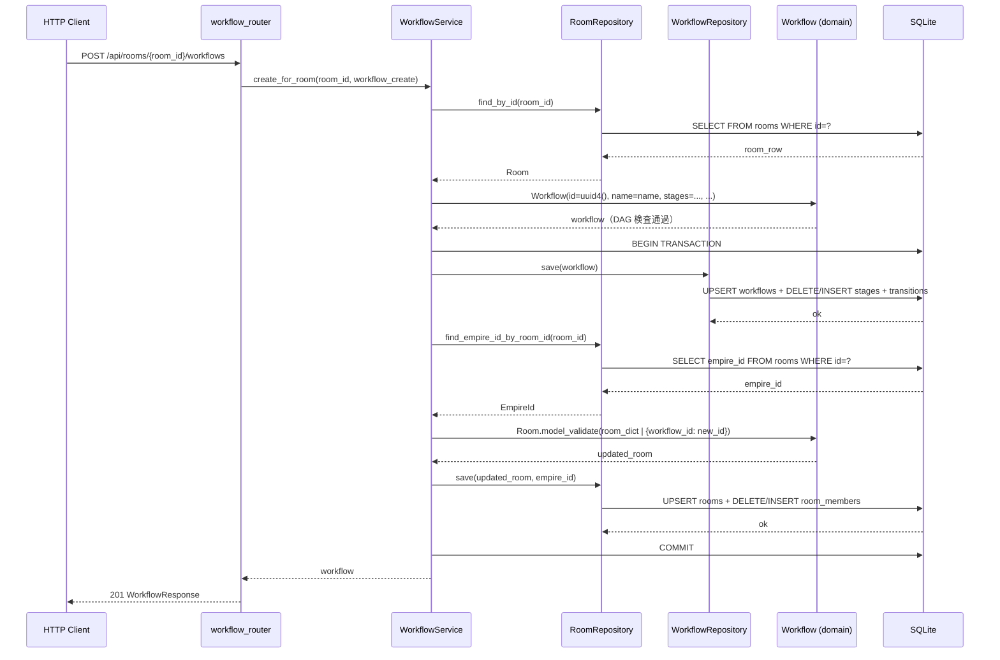

# 基本設計書

> feature: `workflow` / sub-feature: `http-api`
> 関連 Issue: [#58 feat(workflow-http-api): Workflow + Stage HTTP API (M3)](https://github.com/bakufu-dev/bakufu/issues/58)
> 関連: [`../feature-spec.md`](../feature-spec.md) / [`../domain/basic-design.md`](../domain/basic-design.md) / [`../repository/basic-design.md`](../repository/basic-design.md) / [`../../http-api-foundation/http-api/basic-design.md`](../../http-api-foundation/http-api/basic-design.md)
> 凍結済み設計参照: [`docs/design/architecture.md §interfaces レイヤー詳細`](../../../design/architecture.md) / [`docs/design/threat-model.md`](../../../design/threat-model.md)

## 記述ルール（必ず守ること）

基本設計に**疑似コード・サンプル実装（python/ts/sh/yaml 等の言語コードブロック）を書かない**。
ソースコードと二重管理になりメンテナンスコストしか生まない。
必要なのは構造契約（クラス・モジュール・データの関係）であり、実装の細部は [detailed-design.md](detailed-design.md) で凍結する。

## 前提条件（実装着手前に充足すること）

本 sub-feature の実装前に以下の変更が必要である:

| 前提 | 対象ファイル | 内容 |
|-----|------------|------|
| **P-1: domain 拡張** | `backend/src/bakufu/domain/workflow/workflow.py` | `Workflow` aggregate に `archived: bool = False` フィールドを追加する（業務ルール R1-14 の実装根拠）。不変条件への影響なし（archived は状態フラグであり DAG 整合性検査とは独立）|
| **P-2: domain basic-design 更新** | `docs/features/workflow/domain/basic-design.md` | `Workflow` のフィールド一覧に `archived: bool` を追記。本 PR で同時更新可 |

## モジュール構成

本 sub-feature で追加・変更するモジュール一覧。

| 機能 ID | モジュール | ディレクトリ | 責務 |
|--------|----------|------------|------|
| REQ-WF-HTTP-001〜007 | `workflow_router` | `backend/src/bakufu/interfaces/http/routers/workflows.py` | Workflow CRUD + Stage 一覧 + プリセット一覧 エンドポイント（7 本）|
| REQ-WF-HTTP-001〜007 | `WorkflowService` | `backend/src/bakufu/application/services/workflow_service.py` | http-api-foundation で骨格確定済み。本 sub-feature で全メソッドを肉付け |
| REQ-WF-HTTP-001〜007 | `WorkflowSchemas` | `backend/src/bakufu/interfaces/http/schemas/workflow.py` | Pydantic v2 リクエスト / レスポンスモデル（新規ファイル）|
| 横断 | `workflow 例外ハンドラ群` | `backend/src/bakufu/interfaces/http/error_handlers.py`（既存追記）| `WorkflowNotFoundError` / `WorkflowArchivedError` / `WorkflowIrreversibleError` / `WorkflowInvariantViolation` → `ErrorResponse` 変換 |
| 横断 | `application 例外定義` | `backend/src/bakufu/application/exceptions/workflow_exceptions.py`（新規）| `WorkflowNotFoundError` / `WorkflowArchivedError` / `WorkflowIrreversibleError`（room sub-feature の暫定定義を本ファイルに正式移転）|
| REQ-WF-HTTP-004, 005 | `WorkflowService` DI 拡張 | `backend/src/bakufu/interfaces/http/dependencies.py`（既存追記）| `get_workflow_service()` を WorkflowRepository + RoomRepository を受け取る形に拡張 |

```
本 sub-feature で追加・変更されるファイル:

backend/
└── src/bakufu/
    ├── application/
    │   ├── exceptions/
    │   │   └── workflow_exceptions.py          # 新規: WorkflowNotFoundError / WorkflowArchivedError
    │   └── services/
    │       └── workflow_service.py             # 既存追記: 全メソッドを肉付け
    └── interfaces/http/
        ├── dependencies.py                     # 既存追記: get_workflow_service() 拡張
        ├── error_handlers.py                   # 既存追記: workflow 例外ハンドラ群
        ├── routers/
        │   └── workflows.py                    # 新規: 7 エンドポイント
        └── schemas/
            └── workflow.py                     # 新規: Pydantic スキーマ群
```

## モジュール契約（機能要件）

本 sub-feature が提供するモジュールの入出力契約を凍結する。各 REQ-WF-HTTP-NNN は親 [`../feature-spec.md §5`](../feature-spec.md) ユースケース UC-WF-NNN と 1:1 または N:1 で対応する（孤児要件なし）。

### REQ-WF-HTTP-001: Workflow 作成・Room 割り当て（POST /api/rooms/{room_id}/workflows）

| 項目 | 内容 |
|---|---|
| 入力 | パスパラメータ `room_id: UUID` / リクエスト Body `WorkflowCreate`（`preset_name: str \| None` または `name: str` + `stages: list[StageCreate]` + `transitions: list[TransitionCreate]` + `entry_stage_id: UUID` のどちらか）|
| 処理 | `WorkflowService.create_for_room(room_id, workflow_create)` → 1) Room 存在確認（不在 → `RoomNotFoundError` 404）2) Room archived 確認（archived → `RoomArchivedError` 409）3) プリセット解決または JSON デシリアライズ（不明プリセット名 → `WorkflowPresetNotFoundError` 404）4) `Workflow(...)` 構築（DAG 不変条件 R1-1〜9 検査）→ 5) `WorkflowRepository.save(workflow)` 6) Room.workflow_id を新 Workflow ID に更新 → 7) `RoomRepository.save(updated_room, empire_id)` 。手順 5〜7 は同一 UoW 内で実行 |
| 出力 | HTTP 201, `WorkflowResponse`（id / name / stages / transitions / entry_stage_id / archived）|
| エラー時 | Room 不在 → 404 / Room archived → 409 / プリセット不明 → 404 (MSG-WF-HTTP-004) / DAG 違反 → 422 (MSG-WF-HTTP-005) / 不正 UUID → 422 |

### REQ-WF-HTTP-002: Room の Workflow 取得（GET /api/rooms/{room_id}/workflows）

| 項目 | 内容 |
|---|---|
| 入力 | パスパラメータ `room_id: UUID` |
| 処理 | `WorkflowService.find_by_room(room_id)` → Room 存在確認 → Room.workflow_id を取得 → `WorkflowRepository.find_by_id(room.workflow_id)` |
| 出力 | HTTP 200, `WorkflowListResponse(items: list[WorkflowResponse], total: int)`（Room の workflow_id が指す Workflow を 0 または 1 件返す）|
| エラー時 | Room 不在 → 404 / 不正 UUID → 422 |

### REQ-WF-HTTP-003: Workflow 単件取得（GET /api/workflows/{id}）

| 項目 | 内容 |
|---|---|
| 入力 | パスパラメータ `id: UUID` |
| 処理 | `WorkflowService.find_by_id(workflow_id)` → `WorkflowRepository.find_by_id(workflow_id)` → 不在 → `WorkflowNotFoundError` |
| 出力 | HTTP 200, `WorkflowResponse`（stages / transitions / entry_stage_id 込み）|
| エラー時 | 不在 → 404 (MSG-WF-HTTP-001) / 不正 UUID → 422 |

### REQ-WF-HTTP-004: Workflow 更新（PATCH /api/workflows/{id}）

| 項目 | 内容 |
|---|---|
| 入力 | パスパラメータ `id: UUID` + `WorkflowUpdate(name: str \| None, stages: list[StageCreate] \| None, transitions: list[TransitionCreate] \| None, entry_stage_id: UUID \| None)`（None は変更なし）|
| 処理 | `WorkflowService.update(workflow_id, name, stages, transitions, entry_stage_id)` → 1) `find_by_id` → 不在 → 404 / archived → 409 (R1-14) 2) 変更フィールドのみ差し替えた dict で `Workflow(...)` 再構築（pre-validate、DAG 検査 R1-1〜9 が再実行）3) `WorkflowRepository.save(updated_workflow)` |
| 出力 | HTTP 200, 更新済み `WorkflowResponse` |
| エラー時 | 不在 → 404 (MSG-WF-HTTP-001) / archived → 409 (MSG-WF-HTTP-002) / notify_channels masked → 409 (MSG-WF-HTTP-008) / DAG 違反 → 422 (MSG-WF-HTTP-005) / 不正 UUID → 422 |

### REQ-WF-HTTP-005: Workflow アーカイブ（DELETE /api/workflows/{id}）

| 項目 | 内容 |
|---|---|
| 入力 | パスパラメータ `id: UUID` |
| 処理 | `WorkflowService.archive(workflow_id)` → `find_by_id` → `workflow.archive()` → `WorkflowRepository.save(archived_workflow)` |
| 出力 | HTTP 204 No Content |
| エラー時 | 不在 → 404 (MSG-WF-HTTP-001) / 不正 UUID → 422 |

### REQ-WF-HTTP-006: Stage 一覧取得（GET /api/workflows/{id}/stages）

| 項目 | 内容 |
|---|---|
| 入力 | パスパラメータ `id: UUID` |
| 処理 | `WorkflowService.find_stages(workflow_id)` → `find_by_id` → `workflow.stages` と `workflow.transitions` を返す |
| 出力 | HTTP 200, `StageListResponse(stages: list[StageResponse], transitions: list[TransitionResponse], entry_stage_id: str)` |
| エラー時 | 不在 → 404 (MSG-WF-HTTP-001) / 不正 UUID → 422 |

### REQ-WF-HTTP-007: プリセット一覧取得（GET /api/workflows/presets）

| 項目 | 内容 |
|---|---|
| 入力 | なし |
| 処理 | `WorkflowService.get_presets()` → アプリ内 static データからプリセット定義一覧を返す（DB クエリなし）|
| 出力 | HTTP 200, `WorkflowPresetListResponse(items: list[WorkflowPresetResponse], total: int)` |
| エラー時 | 該当なし（static データのため常に成功）|

## ユーザー向けメッセージ一覧

確定文言は [`detailed-design.md §MSG 確定文言表`](detailed-design.md) で凍結する。

| ID | 種別 | 条件 | HTTP ステータス |
|---|---|---|---|
| MSG-WF-HTTP-001 | エラー（不在）| Workflow が見つからない | 404 |
| MSG-WF-HTTP-002 | エラー（競合）| アーカイブ済み Workflow への更新操作（R1-14 違反）| 409 |
| MSG-WF-HTTP-004 | エラー（不在）| 指定したプリセット名が存在しない | 404 |
| MSG-WF-HTTP-005 | エラー（検証）| `WorkflowInvariantViolation` の DAG 業務ルール違反本文（R1-1〜9）| 422 |
| MSG-WF-HTTP-006 | エラー（不在）| Room が見つからない（room_id スコープのエラー）| 404 |
| MSG-WF-HTTP-007 | エラー（競合）| アーカイブ済み Room への Workflow 作成（R1-14 / Room R1-5 違反）| 409 |
| MSG-WF-HTTP-008 | エラー（競合）| notify_channels が masked 状態の Workflow への更新操作（R1-16 違反）| 409 |

## 依存関係

| 区分 | 依存 | バージョン方針 | 備考 |
|---|---|---|---|
| ランタイム | Python 3.12+ | pyproject.toml | 既存 |
| HTTP フレームワーク | FastAPI / Pydantic v2 / httpx | pyproject.toml | http-api-foundation で確定済み |
| DI パターン | `get_session()` / `get_workflow_service()` | http-api-foundation 確定E | `dependencies.py` の `get_workflow_service()` を拡張 |
| application 例外 | `WorkflowNotFoundError` / `WorkflowArchivedError` / `WorkflowPresetNotFoundError` | 本 PR で新規定義 | `application/exceptions/workflow_exceptions.py` |
| domain | `Workflow` / `WorkflowId` / `WorkflowInvariantViolation` / `Stage` / `Transition` / `StageId` / `StageKind` | M1 確定 + 本 PR で `archived` フィールド追加 | workflow domain sub-feature（Issue #9）|
| repository | `WorkflowRepository` Protocol | M2 確定 | workflow repository sub-feature（Issue #31）|
| room 参照 | `RoomRepository.find_by_id` / `RoomRepository.find_empire_id_by_room_id` / `RoomRepository.save` | room repository + room http-api（Issue #33, #57）確定 | Room.workflow_id 更新のため |
| room 例外 | `RoomNotFoundError` / `RoomArchivedError` | room http-api（Issue #57）確定 | Room 不在 / archived 確認のため |
| 基盤 | http-api-foundation（ErrorResponse / lifespan / CSRF / CORS）| M3-A 確定（Issue #55）| 全 error handler / app.state.session_factory を引き継ぐ |

## クラス設計（概要）

```mermaid
classDiagram
    class WorkflowRouter {
        <<FastAPI APIRouter>>
        +POST /api/rooms/{room_id}/workflows
        +GET /api/rooms/{room_id}/workflows
        +GET /api/workflows/presets
        +GET /api/workflows/{id}
        +PATCH /api/workflows/{id}
        +DELETE /api/workflows/{id}
        +GET /api/workflows/{id}/stages
    }
    class WorkflowService {
        -_workflow_repo: WorkflowRepository
        -_room_repo: RoomRepository
        -_session: AsyncSession
        +__init__(workflow_repo, room_repo, session)
        +create_for_room(room_id, workflow_create) Workflow
        +find_by_room(room_id) Workflow | None
        +find_by_id(workflow_id) Workflow
        +update(workflow_id, name, stages, transitions, entry_stage_id) Workflow
        +archive(workflow_id) None
        +find_stages(workflow_id) tuple[list[Stage], list[Transition], StageId]
        +get_presets() list[WorkflowPreset]
    }
    class WorkflowRepository {
        <<Protocol>>
        +find_by_id(workflow_id) Workflow | None
        +count() int
        +save(workflow) None
    }
    class RoomRepository {
        <<Protocol>>
        +find_by_id(room_id) Room | None
        +find_empire_id_by_room_id(room_id) EmpireId | None
        +save(room, empire_id) None
    }
    class WorkflowCreate {
        <<Pydantic BaseModel>>
        +name: str | None
        +stages: list~StageCreate~ | None
        +transitions: list~TransitionCreate~ | None
        +entry_stage_id: UUID | None
        +preset_name: str | None
    }
    class WorkflowUpdate {
        <<Pydantic BaseModel>>
        +name: str | None
        +stages: list~StageCreate~ | None
        +transitions: list~TransitionCreate~ | None
        +entry_stage_id: UUID | None
    }
    class StageCreate {
        <<Pydantic BaseModel>>
        +id: UUID
        +name: str
        +kind: str
        +required_role: list~str~
        +completion_policy: dict | None
        +notify_channels: list~str~
        +required_gate_roles: list~str~
    }
    class TransitionCreate {
        <<Pydantic BaseModel>>
        +id: UUID
        +from_stage_id: UUID
        +to_stage_id: UUID
        +condition: str
    }
    class WorkflowResponse {
        <<Pydantic BaseModel>>
        +id: str
        +name: str
        +stages: list~StageResponse~
        +transitions: list~TransitionResponse~
        +entry_stage_id: str
        +archived: bool
    }
    class WorkflowListResponse {
        <<Pydantic BaseModel>>
        +items: list~WorkflowResponse~
        +total: int
    }
    class StageResponse {
        <<Pydantic BaseModel>>
        +id: str
        +name: str
        +kind: str
        +required_role: list~str~
        +completion_policy: dict | None
        +notify_channels: list~str~
        +required_gate_roles: list~str~
    }
    class TransitionResponse {
        <<Pydantic BaseModel>>
        +id: str
        +from_stage_id: str
        +to_stage_id: str
        +condition: str
    }
    class StageListResponse {
        <<Pydantic BaseModel>>
        +stages: list~StageResponse~
        +transitions: list~TransitionResponse~
        +entry_stage_id: str
    }
    class WorkflowPresetResponse {
        <<Pydantic BaseModel>>
        +preset_name: str
        +display_name: str
        +description: str
        +stage_count: int
        +transition_count: int
    }
    class WorkflowPresetListResponse {
        <<Pydantic BaseModel>>
        +items: list~WorkflowPresetResponse~
        +total: int
    }

    WorkflowRouter --> WorkflowService : uses (DI)
    WorkflowService --> WorkflowRepository : uses (Port)
    WorkflowService --> RoomRepository : uses (Port, Room割り当て更新)
    WorkflowRouter ..> WorkflowCreate : deserializes
    WorkflowRouter ..> WorkflowUpdate : deserializes
    WorkflowRouter ..> WorkflowResponse : serializes
    WorkflowRouter ..> WorkflowListResponse : serializes
    WorkflowRouter ..> StageListResponse : serializes
    WorkflowRouter ..> WorkflowPresetListResponse : serializes
```

## 処理フロー

### ユースケース 1: Workflow 作成・Room 割り当て（POST /api/rooms/{room_id}/workflows）

1. Router が `room_id: UUID` をパスパラメータとして受け取る（不正形式 → 422）
2. Router が `WorkflowCreate` を Pydantic でデシリアライズ（422 on 失敗）
3. model_validator で JSON 定義と `preset_name` の排他確認（両方 None / 両方設定 → 422）
4. `WorkflowService.create_for_room(room_id, workflow_create)` 呼び出し
5. Room 存在確認（`RoomRepository.find_by_id` → None → `RoomNotFoundError` → 404）
6. Room archived 確認（archived=True → `RoomArchivedError` → 409）
7. `preset_name` 指定時: static プリセット辞書から定義を解決（未知 → `WorkflowPresetNotFoundError` → 404）
8. `Workflow(id=uuid4(), name=name, stages=stages, ...)` 構築（R1-1〜9 失敗時 `WorkflowInvariantViolation` → 422）
9. `async with session.begin()`: (a) `WorkflowRepository.save(workflow)` (b) `RoomRepository.find_empire_id_by_room_id(room_id)` (c) 既存 Room の `workflow_id` を新 ID に差し替えて再構築 (d) `RoomRepository.save(updated_room, empire_id)`
10. HTTP 201, `WorkflowResponse` を返す

### ユースケース 2: Room の Workflow 取得（GET /api/rooms/{room_id}/workflows）

1. `room_id: UUID` パスパラメータ取得（不正形式 → 422）
2. Room 存在確認（不在 → 404）
3. `WorkflowService.find_by_room(room_id)` → `RoomRepository.find_by_id(room_id)` で room を取得
4. `WorkflowRepository.find_by_id(room.workflow_id)` で Workflow を取得
5. `WorkflowListResponse(items=[workflow_response], total=1)` で HTTP 200

### ユースケース 3: Workflow 単件取得（GET /api/workflows/{id}）

1. `id: UUID` パスパラメータ取得（不正形式 → 422）
2. `WorkflowService.find_by_id(workflow_id)` → None → `WorkflowNotFoundError` → 404
3. `WorkflowResponse` で HTTP 200

### ユースケース 4: Workflow 更新（PATCH /api/workflows/{id}）

1. `id: UUID` + `WorkflowUpdate` 取得
2. `WorkflowService.update(workflow_id, ...)` → `find_by_id` → None → 404 / archived → 409 / notify_channels masked (pydantic.ValidationError) → 409 (R1-16)
3. 変更フィールドのみ差し替えた dict で `Workflow(...)` 再構築（pre-validate、DAG 検査実行）
4. `async with session.begin()`: `WorkflowRepository.save(updated_workflow)`
5. `WorkflowResponse` で HTTP 200

### ユースケース 5: Workflow アーカイブ（DELETE /api/workflows/{id}）

1. `id: UUID` 取得（不正形式 → 422）
2. `WorkflowService.archive(workflow_id)` → `find_by_id` → None → 404
3. `workflow.archive()` → `archived=True` の新 Workflow（冪等）
4. `async with session.begin()`: `WorkflowRepository.save(archived_workflow)`
5. HTTP 204 No Content

### ユースケース 6: Stage 一覧取得（GET /api/workflows/{id}/stages）

1. `id: UUID` 取得（不正形式 → 422）
2. `WorkflowService.find_stages(workflow_id)` → `find_by_id` → None → 404
3. `workflow.stages` / `workflow.transitions` / `workflow.entry_stage_id` を取得
4. `StageListResponse` で HTTP 200

### ユースケース 7: プリセット一覧取得（GET /api/workflows/presets）

1. DB クエリなし。`WorkflowService.get_presets()` → static プリセット定義辞書から list を構築
2. `WorkflowPresetListResponse` で HTTP 200

**ルーティング注意**: `GET /api/workflows/presets` は `GET /api/workflows/{id}` より**先に**登録する。FastAPI はリテラルパスをパスパラメータより優先するが、登録順でも担保する。

## シーケンス図



## アーキテクチャへの影響

- **`docs/design/architecture.md`**: 変更なし（http-api-foundation で routers/ の配置はすでに明示済み）
- **`docs/design/tech-stack.md`**: 変更なし
- **`workflow/domain/basic-design.md`**: `Workflow.archived: bool = False` フィールド追加の記述を反映（本 PR で対処、前提条件 P-2）
- 既存 feature への波及: `error_handlers.py` に workflow 専用ハンドラを追記するが、既存ハンドラ（HTTPException / ValidationError / generic / empire / room 専用）は変更しない
- `WorkflowNotFoundError` は room http-api（Issue #57）で room_exceptions.py に暫定定義済み。本 PR で `workflow_exceptions.py` に正式移転し、room_exceptions.py から import する形に変更する

## 外部連携

| 連携先 | 目的 | プロトコル | 認証 | タイムアウト / リトライ |
|-------|------|----------|-----|---------------------|
| 該当なし | — | — | — | — |

外部連携なし — 理由: Workflow HTTP API は SQLite ローカル永続化のみで完結し、外部 API 呼び出しを行わない。実 Discord webhook 送信は `feature/discord-notifier` の責務。

## UX 設計

| シナリオ | 期待される挙動 |
|---------|------------|
| JSON 定義と preset_name を同時に指定 | 422（排他チェック）|
| JSON 定義も preset_name も未指定（WorkflowCreate で両者 None）| 422（model_validator）|
| 不明な preset_name を指定 | 404 `{"error": {"code": "not_found", "message": "Workflow preset not found."}}` |
| DAG 整合性違反（孤立 Stage 等）の JSON 定義 | 422 `WorkflowInvariantViolation` 本文（[FAIL] プレフィックス除去済み）|
| アーカイブ済み Workflow に PATCH | 409 `{"error": {"code": "conflict", "message": "Workflow is archived and cannot be modified."}}` |
| `GET /api/workflows/presets` | 200 プリセット一覧（"v-model" / "agile" 等の static データ）|
| 不正 UUID でパスパラメータ | 422 FastAPI validation_error |
| `DELETE /api/workflows/{id}` を 2 回呼び出し（冪等）| 2 回目も 204（archive() は冪等、業務ルール R1-14 に「再アーカイブは禁止されない」）|

**アクセシビリティ方針**: 該当なし（HTTP API のため）。

## セキュリティ設計

### 脅威モデル

| 想定攻撃者 | 攻撃経路 | 保護資産 | 対策 |
|-----------|---------|---------|------|
| **T1: CSRF 経由での Workflow 改ざん** | ブラウザ経由の不正 POST / PATCH / DELETE | Workflow の状態整合性 | http-api-foundation 確定D: CSRF Origin 検証ミドルウェア（Origin ヘッダ不一致なら 403）|
| **T2: スタックトレース露出** | 500 エラーレスポンスへのスタックトレース混入 | 内部実装情報 | http-api-foundation 確定A: generic_exception_handler が `internal_error` のみを返す |
| **T3: 不正 UUID によるパスインジェクション** | `room_id` / `id` に不正値を注入 | DB 整合性 | FastAPI `UUID` 型強制（422 on 不正形式）+ SQLAlchemy ORM |
| **T4: SSRF 経由の notify_channels 設定** | Stage 定義に不正 Discord webhook URL を含む JSON を POST | 内部ネットワーク / 外部サービス | domain `NotifyChannel` が URL allow list G1〜G10（R1-10）を検査。違反は `WorkflowInvariantViolation` → 422 |
| **T5: プリセット定義の改ざん** | static プリセットデータへの動的書き換え | Workflow 整合性 | static データは定数（変数への再代入不可）として定義。プリセット解決は読み取り専用 |

### OWASP Top 10 対応

| # | カテゴリ | 対応状況 |
|---|---------|---------|
| A01 | Broken Access Control | loopback バインド（`127.0.0.1:8000`）+ CSRF Origin 検証（http-api-foundation 確定D）|
| A02 | Cryptographic Failures | `Stage.notify_channels` は domain 層で URL 形式検査のみ。**GET**: DB から取得した notify_channels は repository 層で masking 済み（`<REDACTED:DISCORD_WEBHOOK>`）。**POST/PATCH**: in-memory `NotifyChannel` を `model_dump(mode='json')['target']` でシリアライズし `field_serializer` による masking を適用（詳細: [`detailed-design.md §確定A StageResponse`](detailed-design.md)）|
| A03 | Injection | SQLAlchemy ORM 経由（raw SQL 不使用）|
| A04 | Insecure Design | domain の pre-validate + frozen Workflow で不整合状態を物理的に防止 |
| A05 | Security Misconfiguration | http-api-foundation の lifespan / CORS 設定を引き継ぐ |
| A06 | Vulnerable Components | 依存 CVE は CI `pip-audit` で監視 |
| A07 | Auth Failures | MVP 設計上 意図的な認証なし（loopback バインドで代替）|
| A08 | Data Integrity Failures | delete-then-insert + UoW（repository sub-feature 確定済み）|
| A09 | Logging Failures | 内部エラーは application 層でログ、スタックトレースはレスポンスに含めない |
| A10 | SSRF | T4 対策: domain `NotifyChannel` allow list（R1-10）が SSRF リクエスト生成を防止 |

## ER 図

本 sub-feature は DB スキーマを変更しない（`workflows` / `workflow_stages` / `workflow_transitions` テーブルは repository sub-feature で確定済み）。ただし `archived` カラムを `workflows` テーブルに追加する（前提条件 P-1 に対応する DB 変更）。

ER は [`../repository/basic-design.md §ER 図`](../repository/basic-design.md) を参照。`archived` カラム追加の Alembic revision は本 PR で追加する（`0004_workflow_archived.py` 相当）。

## エラーハンドリング方針

| 例外種別 | 発生箇所 | 処理方針 | HTTP ステータス |
|---------|---------|---------|---------------|
| `WorkflowNotFoundError` | `WorkflowService.find_by_id`（None 時）/ archive（None 時）| `error_handlers.py` 専用ハンドラ → HTTP 404 | 404 |
| `WorkflowArchivedError` | `WorkflowService.update`（archived=True 時）| 専用ハンドラ → HTTP 409 (MSG-WF-HTTP-002) | 409 |
| `WorkflowIrreversibleError` | `WorkflowService.update`（pydantic.ValidationError 発生時 — notify_channels masked）| 専用ハンドラ → HTTP 409 (MSG-WF-HTTP-008) | 409 |
| `WorkflowPresetNotFoundError` | `WorkflowService.create_for_room`（未知 preset_name）| 専用ハンドラ → HTTP 404 (MSG-WF-HTTP-004) | 404 |
| `WorkflowInvariantViolation` | domain Workflow 構築 / update 時（DAG / 容量 / SSRF 等）| 専用ハンドラ → HTTP 422 (MSG-WF-HTTP-005 前処理済み本文)| 422 |
| `RoomNotFoundError` | `WorkflowService.create_for_room` / `find_by_room`（Room 不在時）| room http-api 既存ハンドラが処理 | 404 |
| `RoomArchivedError` | `WorkflowService.create_for_room`（Room archived 時）| room http-api 既存ハンドラが処理 | 409 |
| `RequestValidationError` | FastAPI Pydantic（入力形式不正）| http-api-foundation の既存ハンドラ | 422 |
| その他例外 | どこでも | http-api-foundation generic_exception_handler | 500（スタックトレース非露出）|

Router 内に `try/except` は書かない（http-api-foundation architecture 規律）。
